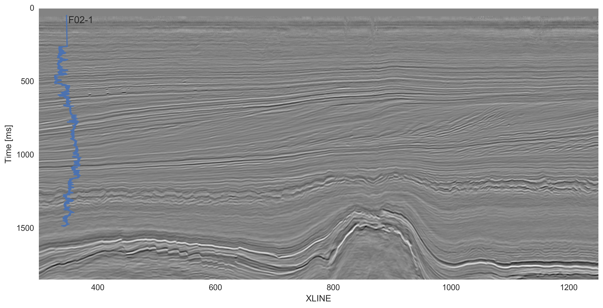
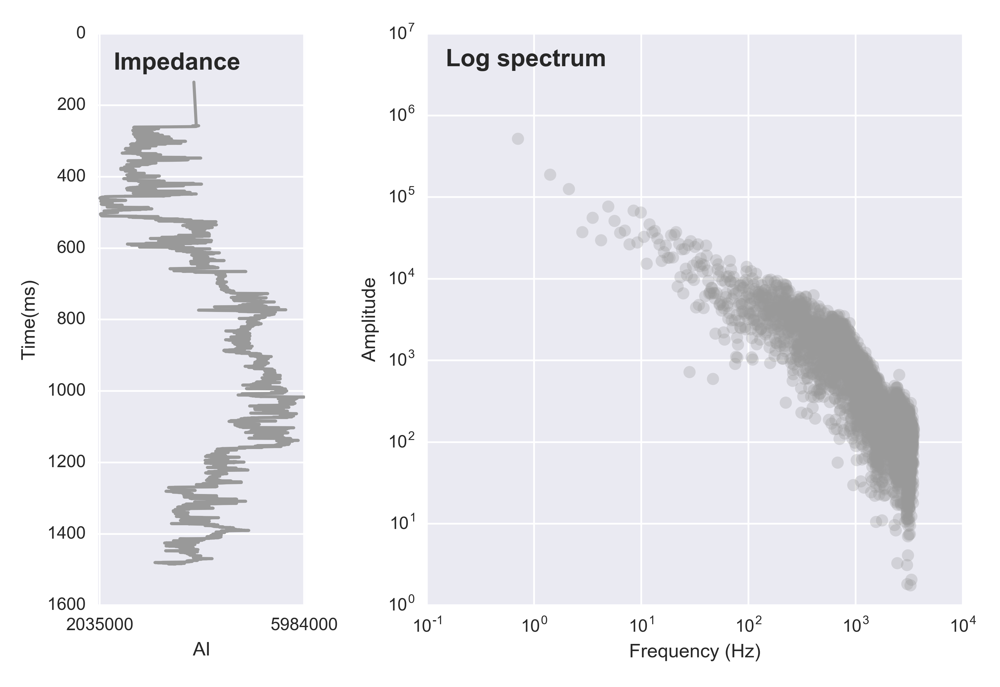
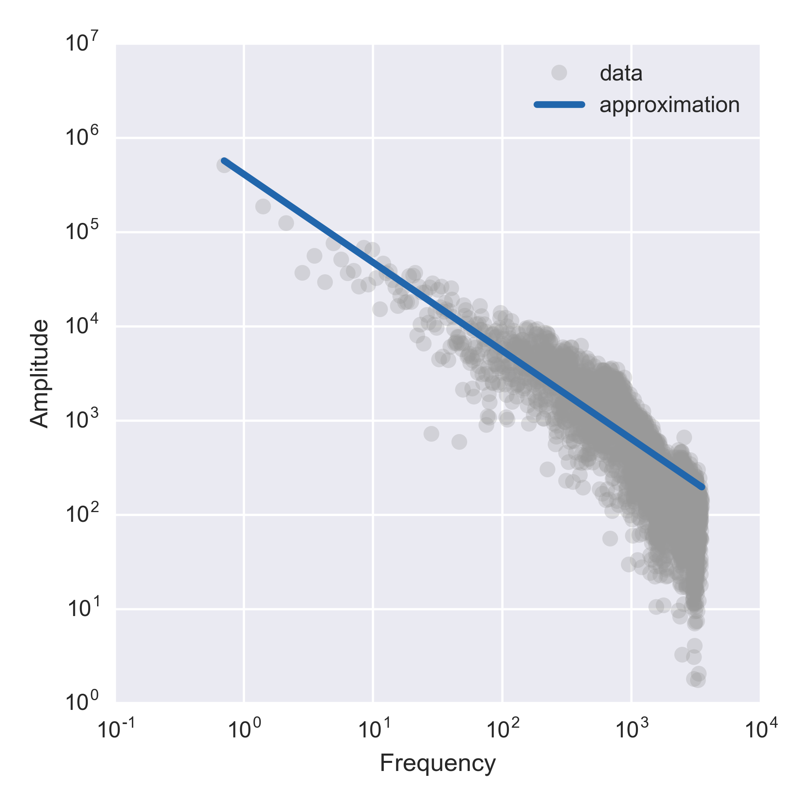
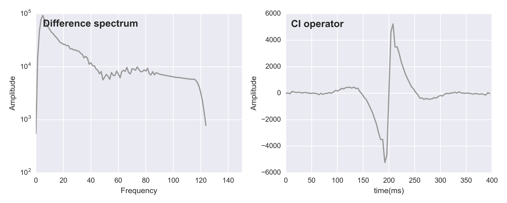
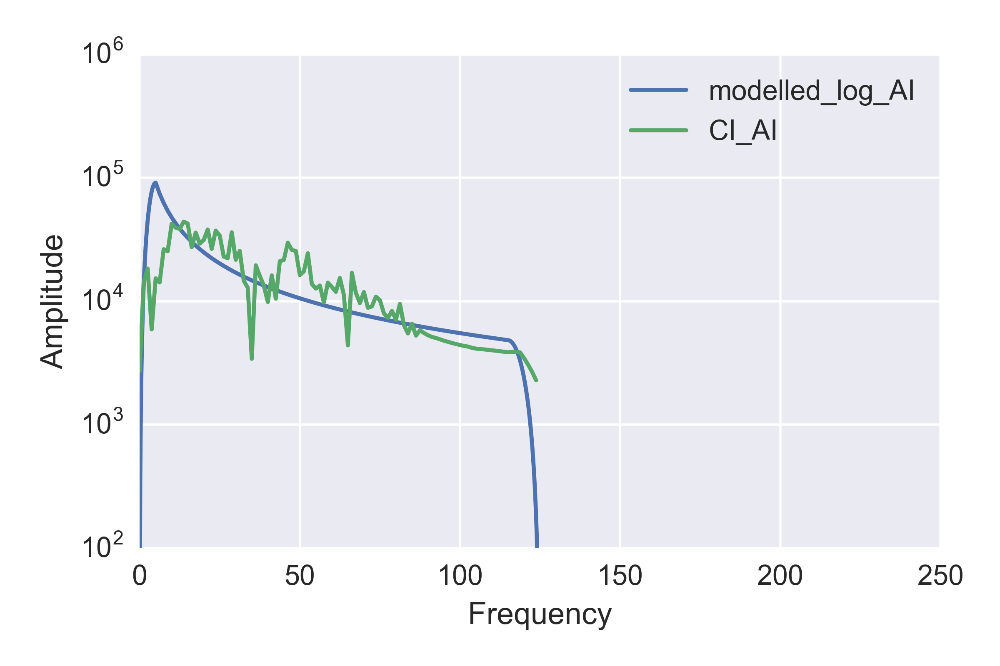

### Geophysical Tutorial

# Colored inversion

Martin Blouin<sup>1</sup> and Erwan Gloaguen<sup>2</sup>

<sup>1</sup> GeoLEARN Solutions, Quebec City, Canada
<sup>2</sup> INRS-ETE, Quebec City, Canada

Corresponding author: martin.blouin@geolearn.ca

Whether it is deterministic, band-limited or stochastic, seismic inversion can bear many names depending on the algorithm used to produce it. Broadly, inversion converts reflectivity data to physical properties of the earth, such as acoustic impedance, the product of seismic velocity and bulk density. This is useful because, while reflectivity informs us about boundaries, impedance can be converted to useful earth propertes such as porosity and fluid content via known petrophysical relationships.

Lancaster and Whitcombe (2000) published a fast method for band-limited inversion of seismic data known as colored inversion (CI) that generated widespread interest among interpreters. Recognizing that the popular sparse-spike inversion process could be approximated by a single operator, yielding relative impedance via simple convolution with the reflectivity data, the authors showed that this operator can be derived from well logs. Like other inversions, CI can help remove the smearing effects of the seismic wavelet and enhance features such as thin beds and discontinuities. What's more, since CI is directly linked to seismic data, the relative impedance it produces can be used as a base for comparison with other inversion to see what kind of information is introduced by numerical constraints or the low-frequency model.

In this tutorial, we follow the steps presented by Lancaster and Whitcombe in their 2000 expanded abstract to achieve the so-called "fast-track colored inversion". Using open-source algorithms, we describe all the steps to go from reflectivity data to inverted cubes:

1.	Fit a function to the log spectrum(s).
2.	Get a difference spectrum by substracting the seismic spectrum.
3.	Convert the difference spectrum to an operator.
4.	Convolve the operator with the stacked seismic.
5.	As a QC step, check the residuals by comparing log and AI section spectrums.

The idea of this tutorial is to achieve a colored inversion without any external software, just Python code with the NumPy and SciPy libraries. You can read and run the code for yourself from the repository at **github.com/seg/tutorials-2017**. The tutorial focus on presenting the whole workflow in the simplest fashion rather than trying to optimize parameters to recover interpretable features. Prior to running the workflow on your data, noise attenuation should be performed to ensure that the inversion process recovers frequencies associated only with the Earth.

## The dataset

For our demonstration, we use one inline from the 1987 Dutch F3 volume (Figure 1), plus the acoustic impedance log from the F02-1 well. Good descriptions of the geological setting of this dataset can be found in Sorensen et al. (1997) and Overeem et al. (2001). We use the dip-steered median filter stacked dataset to get reduced noise on our input.


<center>*Figure 1. F3 dip-steered median filtered stacked seismic data at inline 362 with well location and bounding horizons of the inverted region.*</center>

## 1. Fit a function to the log spectrum

Walden and Hosken (1984) observed that the reflectivity sequences in sedimentary basins display a logarithmic decay in amplitude as frequency increases. For the first step of our inversion, we look at the reflectivity spectrum and make sure it behaves as predicted. We load the F02-1 well, convert it to the time domain, and calculate the spectrum (Figure 2).

```python
n_log = AI_f021.shape[0]
k_log = np.arange(n_log-1)
Fs_log = 1 / np.diff(time_f021/1000)
T_log = n_log / Fs_log
freq_log = k_log / T_log
freq_log = freq_log[range(n_log//2)]
spec_log = np.fft.fft(AI_f021) / n_log
spec_log = spec_log[range(n_log//2)]
```


<center>*Figure 2. F02-1 well data. (a) AI log, (b) Calculated power spectrum.*</center>

We would like to simplify the spectrum, so we proceed to a regression. To make the process more robust, CI packages offer you the option of averaging this spectrum over all the available wells, but we can skip tht as we are working with only a single well. In order to proceed to a linear regression, we define two simple functions, one that serves as the linearization of the problem and one for the error function. I then use `scipy.optimize` to find the best fit, shown in Figure 3.

```python
def linearize(p, x):
    return p[0] * x**p[1]
    
def error(p, x, y):    
    return np.log10(y) - np.log10(linearize(p, x))

args = (freq_log[1:2000], np.abs(spec_log[1:2000]))
qout, success = optimize.leastsq(error,
                                 (1e5, -0.8),
                                 args=args,
                                 maxfev=3000)
```


<center>*Figure 3. F02-1 well spectrum approximated by a linear function in log space.*</center>

## 2. Compute the difference

Now we have a continuous function that mathematically approximates the well log spectrum. The next major step of the workflow is to compute an operator that is representative of the difference between the log spectrum and the seismic spectrum.

We first define some boundaries to our modelled spectrum in the frequency domain. This is a critical part that will have great influence on the end result. We define a simple function to generate a 50 points Hanning shaped taper at both end of the spectrum; the result is shown in Figure 4. Then we take seismic traces next to the well location, average them, and repeat the procedure we did on the well to get the spectrum. Figure 4 shows the resulting modelled spectrum. In this example, taper windows of 0&ndash;5 Hz and 100&ndash;120 Hz have been defined. It is important to note that our end result will be greatly influenced by this choice and care should be applied at this stage.


<center>*Figure 4. Comparison of well log, seismic and modelled frequency power spectrum.*</center>

After this step is completed, we simply substract the seismic spectrum from our modelled spectrum (Figure 5).

## 3. Convert to an operator

Now, continuing with Lancaster & Whitcombe's methodology, we can derive an inversion operator. We move to the time domain with an inverse Fourier transform, then shift zero time to the center of the time window. Finally, we rotate the phase by taking the quadrature of the signal, represented by the imaginary component and shown in Figure 5.

```python
gap = spec_log_model - spec_seismic_model
operator = np.fft.ifft(gap)
operator = np.fft.fftshift(operator)
operator = operator.imag
```


<center>*Figure 5. a) Resulting difference spectrum. b) Associated operator.*</center>

## 4. Convolve operator with seismic

Once the operator is calculated a simple trace by trace convolution with the reflectivity data is needed to perform colored inversion. NumPy's `apply_along_axis()` applies any function to all columns of an array, so we can pass it the convolution:

```python
def convolve(t):
    return np.convolve(t, operator, mode='same')

ci = np.apply_along_axis(convolve, axis=0, arr=seis)
```

Since the relative impedance result contains no low frequencies, it does not inform us about trends, so it makes more sense to look at the result in a single formation. We will focus on an area of interest of about 300 ms in thickness between two horizons; Figure 6 presents the resulting relative impedance section scaled (0-1) in this area.


<center>*Figure 6. Relative impedance result in a single stratigraphic unit.*</center>

## 5. Check the residuals

To make sure that we did a good job defining our operator, we now look at the spectrum from the relative impedance result at the well location to see if we achieved a good fit with the well log spectrum (Figure 7). It is to be noted that this fit was achieved with some arbitrary decisions, and the workflow could be iterated upon to try to minimize the difference between the two spectrums.


<center>*Figure 7. QC of the colored inversion workflow with comparison of input and output spectrums.*</center>

## Conclusion

We have presented a straightforward application of colored inversion using only Python with the NumPy and SciPy libraries. This open-source workflow is documented at **github.com/seg**. It is called a 'robust' process in the literature, but it is somewhat sensitive to the chosen frequency range. There are also choices to be made about the window of application and the number of traces used to compute the seismic spectrum. Notwithstanding all this, the process is simple and fast, and yields informative images to interpreters.

## Acknowledgment
Thanks to Matt Hall for useful comments and suggestions on the workflow and manuscript.

## References and further reading

The F3 dataset is maintained by dGB Earth Sciences and TNO, and openly licensed CC-BY-SA. It can be obtained from The Open Seismic Repository opendtect.org/osr. 

For a recent comprehensive overview of seismic inversion methods, see Francis, A. (2014). A simple guide to seismic inversion. _GEOExPro_ **10** (2), 46–50.

Lancaster, S. and D. Whitcombe (2000). Fast-track 'coloured' inversion. _SEG Expanded Abstracts, 2000_, p 1572&ndash;1575. DOI: 10.1190/1.18157111.

Overeem, I, G. J. Weltje, C. Bishop-Kay, and S. B. Kroonenberg, (2001). The Late Cenozoic Eridanos delta system in the Southern North Sea Basin: a climate signal in sediment supply? Basin Research, 13, 293–312. DOI: 10.1046/j.1365-2117.2001.00151.x

Sørensen, J.C., U. Gregersen, M. Breiner and O. Michelsen (1997). High frequency sequence stratigraphy of upper Cenozoic deposits. _Mar. Petrol. Geol._ **14**, 99–123. DOI: 10.1016/S0264-8172.

Walden, A.T., and Hosken, J.W.J. (1985). An investigation of the spectral properties of primary reflection coefficients. _Geophysical Prospecting_ **33**, 400–435. DOI: 10.1111/j.1365-2478.1985.tb00443.x

<hr>

&copy; Martin Blouin & Erwan Gloaguen. Licensed CC-BY-SA. Article published by the Society of Exploration Geophysicists in _The Leading Edge_, October 2017.
