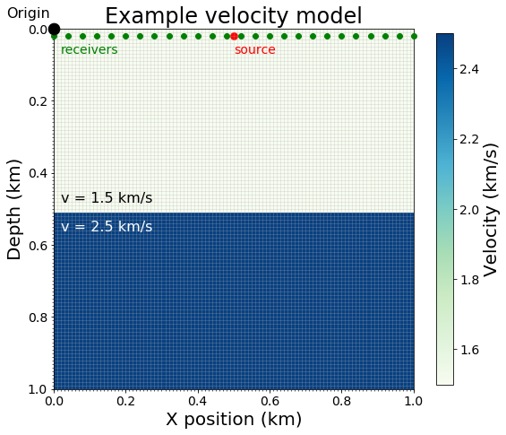
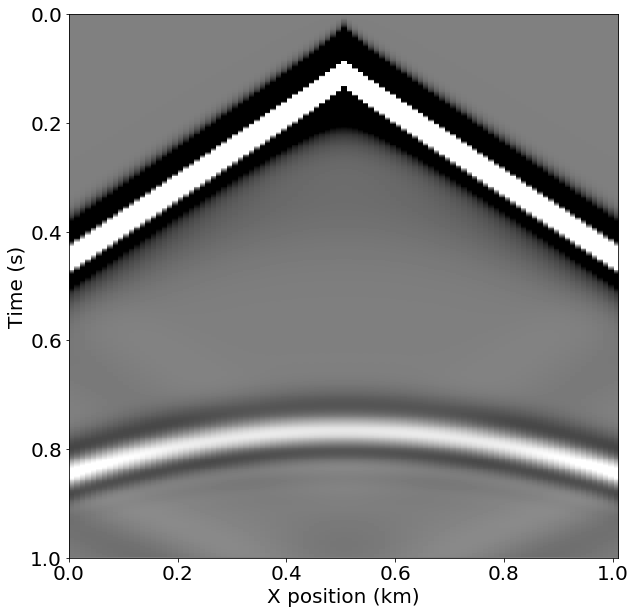
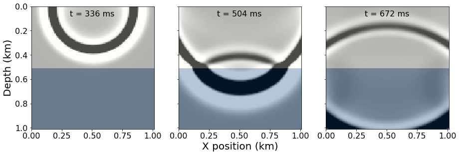

```python
import numpy as np
import matplotlib.pyplot as plt

%matplotlib inline
```

<div style="padding: 6px 12px 18px 12px; margin: 4px; background: #eeeeff; border: 2px solid #8888aa; border-radius: 4px;">

<h2>Preface: Installing Devito (do not include in manuscipt)</h2>

<p>This tutorial and the coming second part are based on Devito version 3.1.0. It requires the installation of the full software with examples, not only the code generation API. To install:</p>

<pre style="background: #eeeeff;">
  git clone -b v3.1.0 https://github.com/opesci/devito
  cd devito
  conda env create -f environment.yml
  source activate devito
  pip install -e .
</pre>

<p>That final dot is important, don't miss it out!</p>
</div>

### Geophysics tutorial


# Full-waveform inversion 1: forward modeling

Mathias Louboutin<sup>1</sup>\*, Philipp Witte<sup>1</sup>, Michael Lange<sup>2</sup>, Navjot Kukreja<sup>2</sup>, Fabio Luporini<sup>2</sup>, Gerard Gorman<sup>2</sup>, and Felix J. Herrmann<sup>1,3</sup>

<sup>1</sup> Seismic Laboratory for Imaging and Modeling (SLIM), The University of British Columbia 

<sup>2</sup> Imperial College London, London, UK

<sup>3</sup> now at Georgia Institute of Technology, USA 

Corresponding author: mloubout@eoas.ubc.ca


Since its re-introduction by Pratt (1999), full-waveform inversion (FWI) has gained a lot of attention in geophysical exploration because of its ability to build high resolution velocity models more or less automatically in areas of complex geology. While there is an extensive and growing literature on the topic, publications focus mostly on technical aspects, making this topic inaccessible for a broader audience due to the lack of simple introductory resources for newcomers to geophysics. We will accomplish this by providing a hands-on walkthrough of FWI using Devito (Lange et al. 2016), a system based on domain-specific languages that automatically generates code for time-domain finite-differences.

As usual, this tutorial is accompanied by all the code you need to reproduce the figures. Go to github.com/seg/tutorials-2017 and follow the links. In the Notebook, we describe how to simulate synthetic data for a specified source and receiver setup and how to save the corresponding wavefields and shot records. In part two of this series, we will address how to calculate model updates, i.e. gradients of the FWI objective function, via adjoint modeling. Finally, in part three we will demonstrate how to use this gradient as part of an optimization framework for inverting an unknown velocity model.


## Introduction

Devito provides a concise and straightforward computational framework for discretizing wave equations, which underlie all FWI frameworks. We will show that it generates verifiable executable code at run time for wave propagators associated with forward and (in part 2) adjoint wave equations. Devito frees the user from the recurrent and time-consuming development of performant time-stepping codes and allows the user to concentrate on the geophysics of the problem rather than on low-level implementation details of wave-equation simulators. This tutorial covers the conventional adjoint-state formulation of full-waveform tomography (Tarantola 1984) that underlies most of the current methods referred to as full-waveform inversion (Virieux and Operto 2009). While other formulations have been developed to improve the convergence of FWI for poor starting models, in these tutorials we will concentrate on the standard formulation that relies on the combination of a forward/adjoint pair of propagators and a correlation-based gradient. In part one of this tutorial, we discuss how to set up wave simulations for inversion, including how to express the wave equation in Devito symbolically and how to deal with the acquisition geometry.

<div style="padding: 12px 12px 18px 12px; margin: 20px 4px 20px 4px; background: #eeeeff; border: 2px solid #8888aa; border-radius: 4px;">
<h4>What is FWI?</h4>
<p>FWI tries to iteratively minimize the difference between data that was acquired in a seismic survey and synthetic data that is generated from a wave simulator with an estimated (velocity) model of the subsurface. As such, each FWI framework essentially consists of a wave simulator for forward modeling the predicted data and an adjoint simulator for calculating a model update from the data misfit. This first part of this tutorial is dedicated to the forward modeling part and demonstrates how to discretize and implement the acoustic wave equation using Devito.</p>
</div>


## Wave simulations for inversion

The acoustic wave equation with the squared slowness $m$, defined as $m(x,y)=c^{-2}(x,y)$ with $c(x,y)$ being the unknown spatially varying wavespeed, is given by:

$$
 m \frac{\mathrm{d}^2 u(t, x, y)}{\mathrm{d}t^2}\ -\ \Delta u(t, x, y)\ +\ \eta(x, y) \frac{\mathrm{d} u(t, x, y)}{\mathrm{d}t}\ \  =\ \  q(t, x, y; x_\mathrm{s}, y_\mathrm{s}),\ \ \ \ \ \ \ \ (1)
$$

where $\Delta$ is the Laplace operator, $q(t, x, y;x_\mathrm{s}, y_\mathrm{s})$ is the seismic source, located at $(x_\mathrm{s}, y_\mathrm{s})$ and $\eta(x, y)$ is a space-dependent dampening parameter for the absorbing boundary layer (Cerjan et al. 1985). As shown in Figure 1, the physical model is extended in every direction by `nbpml` grid points to mimic an infinite domain. The dampening term $\eta\, \mathrm{d}u/\mathrm{d}t$ attenuates the waves in the dampening layer and prevents waves from reflecting at the model boundaries. In Devito, the discrete representations of $m$ and $\eta$ are contained in a `model` object that contains a `grid` object with all relevant information such as the origin of the coordinate system, grid spacing, size of the model and dimensions `time, x, y`:


```python
# FIGURE 1
from IPython.display import HTML
HTML("../Figures/Figure1_composed.svg")
```


<?xml version="1.0" encoding="UTF-8" standalone="no"?>
<!-- Created with Inkscape (http://www.inkscape.org/) -->

<svg
   xmlns:dc="http://purl.org/dc/elements/1.1/"
   xmlns:cc="http://creativecommons.org/ns#"
   xmlns:rdf="http://www.w3.org/1999/02/22-rdf-syntax-ns#"
   xmlns:svg="http://www.w3.org/2000/svg"
   xmlns="http://www.w3.org/2000/svg"
   xmlns:xlink="http://www.w3.org/1999/xlink"
   xmlns:sodipodi="http://sodipodi.sourceforge.net/DTD/sodipodi-0.dtd"
   xmlns:inkscape="http://www.inkscape.org/namespaces/inkscape"
   width="375mm"
   height="170mm"
   viewBox="0 0 1328.7401 602.36221"
   id="svg2"
   version="1.1"
   inkscape:version="0.91 r13725"
   sodipodi:docname="Figure1_composed.svg">
  <defs
     id="defs4">
    <marker
       inkscape:isstock="true"
       style="overflow:visible"
       id="marker8810"
       refX="0.0"
       refY="0.0"
       orient="auto"
       inkscape:stockid="Arrow2Mstart">
      <path
         transform="scale(0.6) translate(0,0)"
         d="M 8.7185878,4.0337352 L -2.2072895,0.016013256 L 8.7185884,-4.0017078 C 6.9730900,-1.6296469 6.9831476,1.6157441 8.7185878,4.0337352 z "
         style="fill-rule:evenodd;stroke-width:0.625;stroke-linejoin:round;stroke:#000000;stroke-opacity:1;fill:#000000;fill-opacity:1"
         id="path8812" />
    </marker>
    <marker
       inkscape:stockid="Arrow2Mstart"
       orient="auto"
       refY="0.0"
       refX="0.0"
       id="Arrow2Mstart"
       style="overflow:visible"
       inkscape:isstock="true"
       inkscape:collect="always">
      <path
         id="path5930"
         style="fill-rule:evenodd;stroke-width:0.625;stroke-linejoin:round;stroke:#fffe09;stroke-opacity:1;fill:#fffe09;fill-opacity:1"
         d="M 8.7185878,4.0337352 L -2.2072895,0.016013256 L 8.7185884,-4.0017078 C 6.9730900,-1.6296469 6.9831476,1.6157441 8.7185878,4.0337352 z "
         transform="scale(0.6) translate(0,0)" />
    </marker>
    <marker
       inkscape:stockid="Arrow2Mend"
       orient="auto"
       refY="0.0"
       refX="0.0"
       id="marker7642"
       style="overflow:visible;"
       inkscape:isstock="true">
      <path
         id="path7644"
         style="fill-rule:evenodd;stroke-width:0.625;stroke-linejoin:round;stroke:#fffe09;stroke-opacity:1;fill:#fffe09;fill-opacity:1"
         d="M 8.7185878,4.0337352 L -2.2072895,0.016013256 L 8.7185884,-4.0017078 C 6.9730900,-1.6296469 6.9831476,1.6157441 8.7185878,4.0337352 z "
         transform="scale(0.6) rotate(180) translate(0,0)" />
    </marker>
    <marker
       inkscape:stockid="Arrow2Mend"
       orient="auto"
       refY="0.0"
       refX="0.0"
       id="marker7572"
       style="overflow:visible;"
       inkscape:isstock="true">
      <path
         id="path7574"
         style="fill-rule:evenodd;stroke-width:0.625;stroke-linejoin:round;stroke:#ffa809;stroke-opacity:1;fill:#ffa809;fill-opacity:1"
         d="M 8.7185878,4.0337352 L -2.2072895,0.016013256 L 8.7185884,-4.0017078 C 6.9730900,-1.6296469 6.9831476,1.6157441 8.7185878,4.0337352 z "
         transform="scale(0.6) rotate(180) translate(0,0)" />
    </marker>
    <marker
       inkscape:stockid="Arrow1Send"
       orient="auto"
       refY="0.0"
       refX="0.0"
       id="marker7508"
       style="overflow:visible;"
       inkscape:isstock="true">
      <path
         id="path7510"
         d="M 0.0,0.0 L 5.0,-5.0 L -12.5,0.0 L 5.0,5.0 L 0.0,0.0 z "
         style="fill-rule:evenodd;stroke:#ffa809;stroke-width:1pt;stroke-opacity:1;fill:#ffa809;fill-opacity:1"
         transform="scale(0.2) rotate(180) translate(6,0)" />
    </marker>
    <marker
       inkscape:stockid="Arrow2Mend"
       orient="auto"
       refY="0.0"
       refX="0.0"
       id="Arrow2Mend"
       style="overflow:visible;"
       inkscape:isstock="true">
      <path
         id="path5933"
         style="fill-rule:evenodd;stroke-width:0.625;stroke-linejoin:round;stroke:#000000;stroke-opacity:1;fill:#000000;fill-opacity:1"
         d="M 8.7185878,4.0337352 L -2.2072895,0.016013256 L 8.7185884,-4.0017078 C 6.9730900,-1.6296469 6.9831476,1.6157441 8.7185878,4.0337352 z "
         transform="scale(0.6) rotate(180) translate(0,0)" />
    </marker>
    <marker
       inkscape:stockid="Arrow1Mstart"
       orient="auto"
       refY="0.0"
       refX="0.0"
       id="Arrow1Mstart"
       style="overflow:visible"
       inkscape:isstock="true">
      <path
         id="path5912"
         d="M 0.0,0.0 L 5.0,-5.0 L -12.5,0.0 L 5.0,5.0 L 0.0,0.0 z "
         style="fill-rule:evenodd;stroke:#ffa809;stroke-width:1pt;stroke-opacity:1;fill:#ffa809;fill-opacity:1"
         transform="scale(0.4) translate(10,0)" />
    </marker>
    <marker
       inkscape:stockid="Arrow1Send"
       orient="auto"
       refY="0.0"
       refX="0.0"
       id="Arrow1Send"
       style="overflow:visible;"
       inkscape:isstock="true">
      <path
         id="path5921"
         d="M 0.0,0.0 L 5.0,-5.0 L -12.5,0.0 L 5.0,5.0 L 0.0,0.0 z "
         style="fill-rule:evenodd;stroke:#ffa809;stroke-width:1pt;stroke-opacity:1;fill:#ffa809;fill-opacity:1"
         transform="scale(0.2) rotate(180) translate(6,0)" />
    </marker>
    <marker
       inkscape:stockid="Arrow2Lend"
       orient="auto"
       refY="0.0"
       refX="0.0"
       id="Arrow2Lend"
       style="overflow:visible;"
       inkscape:isstock="true">
      <path
         id="path5927"
         style="fill-rule:evenodd;stroke-width:0.625;stroke-linejoin:round;stroke:#000000;stroke-opacity:1;fill:#000000;fill-opacity:1"
         d="M 8.7185878,4.0337352 L -2.2072895,0.016013256 L 8.7185884,-4.0017078 C 6.9730900,-1.6296469 6.9831476,1.6157441 8.7185878,4.0337352 z "
         transform="scale(1.1) rotate(180) translate(1,0)" />
    </marker>
    <marker
       inkscape:stockid="Arrow2Lstart"
       orient="auto"
       refY="0.0"
       refX="0.0"
       id="Arrow2Lstart"
       style="overflow:visible"
       inkscape:isstock="true">
      <path
         id="path5924"
         style="fill-rule:evenodd;stroke-width:0.625;stroke-linejoin:round;stroke:#000000;stroke-opacity:1;fill:#000000;fill-opacity:1"
         d="M 8.7185878,4.0337352 L -2.2072895,0.016013256 L 8.7185884,-4.0017078 C 6.9730900,-1.6296469 6.9831476,1.6157441 8.7185878,4.0337352 z "
         transform="scale(1.1) translate(1,0)" />
    </marker>
    <marker
       inkscape:stockid="Arrow1Sstart"
       orient="auto"
       refY="0.0"
       refX="0.0"
       id="Arrow1Sstart"
       style="overflow:visible"
       inkscape:isstock="true">
      <path
         id="path5918"
         d="M 0.0,0.0 L 5.0,-5.0 L -12.5,0.0 L 5.0,5.0 L 0.0,0.0 z "
         style="fill-rule:evenodd;stroke:#ffa809;stroke-width:1pt;stroke-opacity:1;fill:#ffa809;fill-opacity:1"
         transform="scale(0.2) translate(6,0)" />
    </marker>
    <clipPath
       id="clipPath4208"
       clipPathUnits="userSpaceOnUse">
      <path
         inkscape:connector-curvature="0"
         id="path4210"
         d="m 72,109.0944 357.12,0 0,360.6912 -357.12,0 0,-360.6912 z" />
    </clipPath>
    <clipPath
       id="clipPath4220"
       clipPathUnits="userSpaceOnUse">
      <path
         inkscape:connector-curvature="0"
         id="path4222"
         d="m 72,109.0944 357.12,0 0,360.6912 -357.12,0 0,-360.6912 z" />
    </clipPath>
    <clipPath
       id="clipPath4330"
       clipPathUnits="userSpaceOnUse">
      <path
         inkscape:connector-curvature="0"
         id="path4332"
         d="m -3.5,-3.5 7,0 0,7 -7,0 0,-7 z" />
    </clipPath>
    <clipPath
       id="clipPath4342"
       clipPathUnits="userSpaceOnUse">
      <path
         inkscape:connector-curvature="0"
         id="path4344"
         d="m -3.5,-3.5 7,0 0,7 -7,0 0,-7 z" />
    </clipPath>
    <clipPath
       id="clipPath4354"
       clipPathUnits="userSpaceOnUse">
      <path
         inkscape:connector-curvature="0"
         id="path4356"
         d="m -3.5,-3.5 7,0 0,7 -7,0 0,-7 z" />
    </clipPath>
    <clipPath
       id="clipPath4366"
       clipPathUnits="userSpaceOnUse">
      <path
         inkscape:connector-curvature="0"
         id="path4368"
         d="m -3.5,-3.5 7,0 0,7 -7,0 0,-7 z" />
    </clipPath>
    <clipPath
       id="clipPath4378"
       clipPathUnits="userSpaceOnUse">
      <path
         inkscape:connector-curvature="0"
         id="path4380"
         d="m -3.5,-3.5 7,0 0,7 -7,0 0,-7 z" />
    </clipPath>
    <clipPath
       id="clipPath4390"
       clipPathUnits="userSpaceOnUse">
      <path
         inkscape:connector-curvature="0"
         id="path4392"
         d="m -3.5,-3.5 7,0 0,7 -7,0 0,-7 z" />
    </clipPath>
    <clipPath
       id="clipPath4402"
       clipPathUnits="userSpaceOnUse">
      <path
         inkscape:connector-curvature="0"
         id="path4404"
         d="m -3.5,-3.5 7,0 0,7 -7,0 0,-7 z" />
    </clipPath>
    <clipPath
       id="clipPath4414"
       clipPathUnits="userSpaceOnUse">
      <path
         inkscape:connector-curvature="0"
         id="path4416"
         d="m -3.5,-3.5 7,0 0,7 -7,0 0,-7 z" />
    </clipPath>
    <clipPath
       id="clipPath4426"
       clipPathUnits="userSpaceOnUse">
      <path
         inkscape:connector-curvature="0"
         id="path4428"
         d="m -3.5,-3.5 7,0 0,7 -7,0 0,-7 z" />
    </clipPath>
    <clipPath
       id="clipPath4438"
       clipPathUnits="userSpaceOnUse">
      <path
         inkscape:connector-curvature="0"
         id="path4440"
         d="m -3.5,-3.5 7,0 0,7 -7,0 0,-7 z" />
    </clipPath>
    <clipPath
       id="clipPath4450"
       clipPathUnits="userSpaceOnUse">
      <path
         inkscape:connector-curvature="0"
         id="path4452"
         d="m -3.5,-3.5 7,0 0,7 -7,0 0,-7 z" />
    </clipPath>
    <clipPath
       id="clipPath4462"
       clipPathUnits="userSpaceOnUse">
      <path
         inkscape:connector-curvature="0"
         id="path4464"
         d="m -3.5,-3.5 7,0 0,7 -7,0 0,-7 z" />
    </clipPath>
    <clipPath
       id="clipPath4474"
       clipPathUnits="userSpaceOnUse">
      <path
         inkscape:connector-curvature="0"
         id="path4476"
         d="m -3.5,-3.5 7,0 0,7 -7,0 0,-7 z" />
    </clipPath>
    <clipPath
       id="clipPath4486"
       clipPathUnits="userSpaceOnUse">
      <path
         inkscape:connector-curvature="0"
         id="path4488"
         d="m -3.5,-3.5 7,0 0,7 -7,0 0,-7 z" />
    </clipPath>
    <clipPath
       id="clipPath4498"
       clipPathUnits="userSpaceOnUse">
      <path
         inkscape:connector-curvature="0"
         id="path4500"
         d="m -3.5,-3.5 7,0 0,7 -7,0 0,-7 z" />
    </clipPath>
    <clipPath
       id="clipPath4510"
       clipPathUnits="userSpaceOnUse">
      <path
         inkscape:connector-curvature="0"
         id="path4512"
         d="m -3.5,-3.5 7,0 0,7 -7,0 0,-7 z" />
    </clipPath>
    <clipPath
       id="clipPath4522"
       clipPathUnits="userSpaceOnUse">
      <path
         inkscape:connector-curvature="0"
         id="path4524"
         d="m -3.5,-3.5 7,0 0,7 -7,0 0,-7 z" />
    </clipPath>
    <clipPath
       id="clipPath4534"
       clipPathUnits="userSpaceOnUse">
      <path
         inkscape:connector-curvature="0"
         id="path4536"
         d="m -3.5,-3.5 7,0 0,7 -7,0 0,-7 z" />
    </clipPath>
    <clipPath
       id="clipPath4546"
       clipPathUnits="userSpaceOnUse">
      <path
         inkscape:connector-curvature="0"
         id="path4548"
         d="m -3.5,-3.5 7,0 0,7 -7,0 0,-7 z" />
    </clipPath>
    <clipPath
       id="clipPath4558"
       clipPathUnits="userSpaceOnUse">
      <path
         inkscape:connector-curvature="0"
         id="path4560"
         d="m -3.5,-3.5 7,0 0,7 -7,0 0,-7 z" />
    </clipPath>
    <clipPath
       id="clipPath4570"
       clipPathUnits="userSpaceOnUse">
      <path
         inkscape:connector-curvature="0"
         id="path4572"
         d="m -3.5,-3.5 7,0 0,7 -7,0 0,-7 z" />
    </clipPath>
    <clipPath
       id="clipPath4582"
       clipPathUnits="userSpaceOnUse">
      <path
         inkscape:connector-curvature="0"
         id="path4584"
         d="m -3.5,-3.5 7,0 0,7 -7,0 0,-7 z" />
    </clipPath>
    <clipPath
       id="clipPath4594"
       clipPathUnits="userSpaceOnUse">
      <path
         inkscape:connector-curvature="0"
         id="path4596"
         d="m -3.5,-3.5 7,0 0,7 -7,0 0,-7 z" />
    </clipPath>
    <clipPath
       id="clipPath4606"
       clipPathUnits="userSpaceOnUse">
      <path
         inkscape:connector-curvature="0"
         id="path4608"
         d="m -3.5,-3.5 7,0 0,7 -7,0 0,-7 z" />
    </clipPath>
    <clipPath
       id="clipPath4618"
       clipPathUnits="userSpaceOnUse">
      <path
         inkscape:connector-curvature="0"
         id="path4620"
         d="m -3.5,-3.5 7,0 0,7 -7,0 0,-7 z" />
    </clipPath>
    <clipPath
       id="clipPath4630"
       clipPathUnits="userSpaceOnUse">
      <path
         inkscape:connector-curvature="0"
         id="path4632"
         d="m -3.5,-3.5 7,0 0,7 -7,0 0,-7 z" />
    </clipPath>
    <clipPath
       id="clipPath4640"
       clipPathUnits="userSpaceOnUse">
      <path
         inkscape:connector-curvature="0"
         id="path4642"
         d="m 451.44,115.488 17.3952,0 0,347.904 -17.3952,0 0,-347.904 z" />
    </clipPath>
    <clipPath
       id="clipPath4419"
       clipPathUnits="userSpaceOnUse">
      <path
         inkscape:connector-curvature="0"
         id="path4421"
         d="m 81,124.74 401.76,0 0,401.76 -401.76,0 0,-401.76 z" />
    </clipPath>
    <clipPath
       id="clipPath4431"
       clipPathUnits="userSpaceOnUse">
      <path
         inkscape:connector-curvature="0"
         id="path4433"
         d="m 81,124.74 401.76,0 0,401.76 -401.76,0 0,-401.76 z" />
    </clipPath>
    <clipPath
       id="clipPath4479"
       clipPathUnits="userSpaceOnUse">
      <path
         inkscape:connector-curvature="0"
         id="path4481"
         d="m 81,124.74 401.76,0 0,401.76 -401.76,0 0,-401.76 z" />
    </clipPath>
    <clipPath
       id="clipPath4493"
       clipPathUnits="userSpaceOnUse">
      <path
         inkscape:connector-curvature="0"
         id="path4495"
         d="m 81,124.74 401.76,0 0,401.76 -401.76,0 0,-401.76 z" />
    </clipPath>
    <clipPath
       id="clipPath4507"
       clipPathUnits="userSpaceOnUse">
      <path
         inkscape:connector-curvature="0"
         id="path4509"
         d="m 81,124.74 401.76,0 0,401.76 -401.76,0 0,-401.76 z" />
    </clipPath>
    <clipPath
       id="clipPath4521"
       clipPathUnits="userSpaceOnUse">
      <path
         inkscape:connector-curvature="0"
         id="path4523"
         d="m 81,124.74 401.76,0 0,401.76 -401.76,0 0,-401.76 z" />
    </clipPath>
    <clipPath
       id="clipPath4535"
       clipPathUnits="userSpaceOnUse">
      <path
         inkscape:connector-curvature="0"
         id="path4537"
         d="m 81,124.74 401.76,0 0,401.76 -401.76,0 0,-401.76 z" />
    </clipPath>
    <clipPath
       id="clipPath4549"
       clipPathUnits="userSpaceOnUse">
      <path
         inkscape:connector-curvature="0"
         id="path4551"
         d="m 81,124.74 401.76,0 0,401.76 -401.76,0 0,-401.76 z" />
    </clipPath>
    <clipPath
       id="clipPath4563"
       clipPathUnits="userSpaceOnUse">
      <path
         inkscape:connector-curvature="0"
         id="path4565"
         d="m 81,124.74 401.76,0 0,401.76 -401.76,0 0,-401.76 z" />
    </clipPath>
    <clipPath
       id="clipPath4577"
       clipPathUnits="userSpaceOnUse">
      <path
         inkscape:connector-curvature="0"
         id="path4579"
         d="m 81,124.74 401.76,0 0,401.76 -401.76,0 0,-401.76 z" />
    </clipPath>
    <clipPath
       id="clipPath4591"
       clipPathUnits="userSpaceOnUse">
      <path
         inkscape:connector-curvature="0"
         id="path4593"
         d="m 81,124.74 401.76,0 0,401.76 -401.76,0 0,-401.76 z" />
    </clipPath>
    <clipPath
       id="clipPath4605"
       clipPathUnits="userSpaceOnUse">
      <path
         inkscape:connector-curvature="0"
         id="path4607"
         d="m 81,124.74 401.76,0 0,401.76 -401.76,0 0,-401.76 z" />
    </clipPath>
    <clipPath
       id="clipPath4619"
       clipPathUnits="userSpaceOnUse">
      <path
         inkscape:connector-curvature="0"
         id="path4621"
         d="m 81,124.74 401.76,0 0,401.76 -401.76,0 0,-401.76 z" />
    </clipPath>
    <clipPath
       id="clipPath4633"
       clipPathUnits="userSpaceOnUse">
      <path
         inkscape:connector-curvature="0"
         id="path4635"
         d="m 81,124.74 401.76,0 0,401.76 -401.76,0 0,-401.76 z" />
    </clipPath>
    <clipPath
       id="clipPath4647"
       clipPathUnits="userSpaceOnUse">
      <path
         inkscape:connector-curvature="0"
         id="path4649"
         d="m 81,124.74 401.76,0 0,401.76 -401.76,0 0,-401.76 z" />
    </clipPath>
    <clipPath
       id="clipPath4661"
       clipPathUnits="userSpaceOnUse">
      <path
         inkscape:connector-curvature="0"
         id="path4663"
         d="m 81,124.74 401.76,0 0,401.76 -401.76,0 0,-401.76 z" />
    </clipPath>
    <clipPath
       id="clipPath4675"
       clipPathUnits="userSpaceOnUse">
      <path
         inkscape:connector-curvature="0"
         id="path4677"
         d="m 81,124.74 401.76,0 0,401.76 -401.76,0 0,-401.76 z" />
    </clipPath>
    <clipPath
       id="clipPath4689"
       clipPathUnits="userSpaceOnUse">
      <path
         inkscape:connector-curvature="0"
         id="path4691"
         d="m 81,124.74 401.76,0 0,401.76 -401.76,0 0,-401.76 z" />
    </clipPath>
    <clipPath
       id="clipPath4703"
       clipPathUnits="userSpaceOnUse">
      <path
         inkscape:connector-curvature="0"
         id="path4705"
         d="m 81,124.74 401.76,0 0,401.76 -401.76,0 0,-401.76 z" />
    </clipPath>
    <clipPath
       id="clipPath4717"
       clipPathUnits="userSpaceOnUse">
      <path
         inkscape:connector-curvature="0"
         id="path4719"
         d="m 81,124.74 401.76,0 0,401.76 -401.76,0 0,-401.76 z" />
    </clipPath>
    <clipPath
       id="clipPath4731"
       clipPathUnits="userSpaceOnUse">
      <path
         inkscape:connector-curvature="0"
         id="path4733"
         d="m 81,124.74 401.76,0 0,401.76 -401.76,0 0,-401.76 z" />
    </clipPath>
    <clipPath
       id="clipPath4745"
       clipPathUnits="userSpaceOnUse">
      <path
         inkscape:connector-curvature="0"
         id="path4747"
         d="m 81,124.74 401.76,0 0,401.76 -401.76,0 0,-401.76 z" />
    </clipPath>
    <clipPath
       id="clipPath4759"
       clipPathUnits="userSpaceOnUse">
      <path
         inkscape:connector-curvature="0"
         id="path4761"
         d="m 81,124.74 401.76,0 0,401.76 -401.76,0 0,-401.76 z" />
    </clipPath>
    <clipPath
       id="clipPath4773"
       clipPathUnits="userSpaceOnUse">
      <path
         inkscape:connector-curvature="0"
         id="path4775"
         d="m 81,124.74 401.76,0 0,401.76 -401.76,0 0,-401.76 z" />
    </clipPath>
    <clipPath
       id="clipPath4787"
       clipPathUnits="userSpaceOnUse">
      <path
         inkscape:connector-curvature="0"
         id="path4789"
         d="m 81,124.74 401.76,0 0,401.76 -401.76,0 0,-401.76 z" />
    </clipPath>
    <clipPath
       id="clipPath4801"
       clipPathUnits="userSpaceOnUse">
      <path
         inkscape:connector-curvature="0"
         id="path4803"
         d="m 81,124.74 401.76,0 0,401.76 -401.76,0 0,-401.76 z" />
    </clipPath>
    <clipPath
       id="clipPath4815"
       clipPathUnits="userSpaceOnUse">
      <path
         inkscape:connector-curvature="0"
         id="path4817"
         d="m 81,124.74 401.76,0 0,401.76 -401.76,0 0,-401.76 z" />
    </clipPath>
    <clipPath
       id="clipPath4829"
       clipPathUnits="userSpaceOnUse">
      <path
         inkscape:connector-curvature="0"
         id="path4831"
         d="m 81,124.74 401.76,0 0,401.76 -401.76,0 0,-401.76 z" />
    </clipPath>
    <clipPath
       id="clipPath4843"
       clipPathUnits="userSpaceOnUse">
      <path
         inkscape:connector-curvature="0"
         id="path4845"
         d="m 81,124.74 401.76,0 0,401.76 -401.76,0 0,-401.76 z" />
    </clipPath>
    <clipPath
       id="clipPath4857"
       clipPathUnits="userSpaceOnUse">
      <path
         inkscape:connector-curvature="0"
         id="path4859"
         d="m 81,124.74 401.76,0 0,401.76 -401.76,0 0,-401.76 z" />
    </clipPath>
    <clipPath
       id="clipPath4871"
       clipPathUnits="userSpaceOnUse">
      <path
         inkscape:connector-curvature="0"
         id="path4873"
         d="m 81,124.74 401.76,0 0,401.76 -401.76,0 0,-401.76 z" />
    </clipPath>
    <clipPath
       id="clipPath4885"
       clipPathUnits="userSpaceOnUse">
      <path
         inkscape:connector-curvature="0"
         id="path4887"
         d="m 81,124.74 401.76,0 0,401.76 -401.76,0 0,-401.76 z" />
    </clipPath>
    <clipPath
       id="clipPath4899"
       clipPathUnits="userSpaceOnUse">
      <path
         inkscape:connector-curvature="0"
         id="path4901"
         d="m 81,124.74 401.76,0 0,401.76 -401.76,0 0,-401.76 z" />
    </clipPath>
    <clipPath
       id="clipPath4913"
       clipPathUnits="userSpaceOnUse">
      <path
         inkscape:connector-curvature="0"
         id="path4915"
         d="m 81,124.74 401.76,0 0,401.76 -401.76,0 0,-401.76 z" />
    </clipPath>
    <clipPath
       id="clipPath4927"
       clipPathUnits="userSpaceOnUse">
      <path
         inkscape:connector-curvature="0"
         id="path4929"
         d="m 81,124.74 401.76,0 0,401.76 -401.76,0 0,-401.76 z" />
    </clipPath>
    <clipPath
       id="clipPath4941"
       clipPathUnits="userSpaceOnUse">
      <path
         inkscape:connector-curvature="0"
         id="path4943"
         d="m 81,124.74 401.76,0 0,401.76 -401.76,0 0,-401.76 z" />
    </clipPath>
    <clipPath
       id="clipPath4955"
       clipPathUnits="userSpaceOnUse">
      <path
         inkscape:connector-curvature="0"
         id="path4957"
         d="m 81,124.74 401.76,0 0,401.76 -401.76,0 0,-401.76 z" />
    </clipPath>
    <clipPath
       id="clipPath4969"
       clipPathUnits="userSpaceOnUse">
      <path
         inkscape:connector-curvature="0"
         id="path4971"
         d="m 81,124.74 401.76,0 0,401.76 -401.76,0 0,-401.76 z" />
    </clipPath>
    <clipPath
       id="clipPath4983"
       clipPathUnits="userSpaceOnUse">
      <path
         inkscape:connector-curvature="0"
         id="path4985"
         d="m 81,124.74 401.76,0 0,401.76 -401.76,0 0,-401.76 z" />
    </clipPath>
    <clipPath
       id="clipPath4997"
       clipPathUnits="userSpaceOnUse">
      <path
         inkscape:connector-curvature="0"
         id="path4999"
         d="m 81,124.74 401.76,0 0,401.76 -401.76,0 0,-401.76 z" />
    </clipPath>
    <clipPath
       id="clipPath5011"
       clipPathUnits="userSpaceOnUse">
      <path
         inkscape:connector-curvature="0"
         id="path5013"
         d="m 81,124.74 401.76,0 0,401.76 -401.76,0 0,-401.76 z" />
    </clipPath>
    <clipPath
       id="clipPath5025"
       clipPathUnits="userSpaceOnUse">
      <path
         inkscape:connector-curvature="0"
         id="path5027"
         d="m 81,124.74 401.76,0 0,401.76 -401.76,0 0,-401.76 z" />
    </clipPath>
    <clipPath
       id="clipPath5039"
       clipPathUnits="userSpaceOnUse">
      <path
         inkscape:connector-curvature="0"
         id="path5041"
         d="m 81,124.74 401.76,0 0,401.76 -401.76,0 0,-401.76 z" />
    </clipPath>
    <clipPath
       id="clipPath5053"
       clipPathUnits="userSpaceOnUse">
      <path
         inkscape:connector-curvature="0"
         id="path5055"
         d="m 81,124.74 401.76,0 0,401.76 -401.76,0 0,-401.76 z" />
    </clipPath>
    <clipPath
       id="clipPath5067"
       clipPathUnits="userSpaceOnUse">
      <path
         inkscape:connector-curvature="0"
         id="path5069"
         d="m 81,124.74 401.76,0 0,401.76 -401.76,0 0,-401.76 z" />
    </clipPath>
    <clipPath
       id="clipPath5081"
       clipPathUnits="userSpaceOnUse">
      <path
         inkscape:connector-curvature="0"
         id="path5083"
         d="m 81,124.74 401.76,0 0,401.76 -401.76,0 0,-401.76 z" />
    </clipPath>
    <clipPath
       id="clipPath5095"
       clipPathUnits="userSpaceOnUse">
      <path
         inkscape:connector-curvature="0"
         id="path5097"
         d="m 81,124.74 401.76,0 0,401.76 -401.76,0 0,-401.76 z" />
    </clipPath>
    <clipPath
       id="clipPath5109"
       clipPathUnits="userSpaceOnUse">
      <path
         inkscape:connector-curvature="0"
         id="path5111"
         d="m 81,124.74 401.76,0 0,401.76 -401.76,0 0,-401.76 z" />
    </clipPath>
    <clipPath
       id="clipPath5123"
       clipPathUnits="userSpaceOnUse">
      <path
         inkscape:connector-curvature="0"
         id="path5125"
         d="m 81,124.74 401.76,0 0,401.76 -401.76,0 0,-401.76 z" />
    </clipPath>
    <clipPath
       id="clipPath5137"
       clipPathUnits="userSpaceOnUse">
      <path
         inkscape:connector-curvature="0"
         id="path5139"
         d="m 81,124.74 401.76,0 0,401.76 -401.76,0 0,-401.76 z" />
    </clipPath>
    <clipPath
       id="clipPath5151"
       clipPathUnits="userSpaceOnUse">
      <path
         inkscape:connector-curvature="0"
         id="path5153"
         d="m 81,124.74 401.76,0 0,401.76 -401.76,0 0,-401.76 z" />
    </clipPath>
    <clipPath
       id="clipPath5165"
       clipPathUnits="userSpaceOnUse">
      <path
         inkscape:connector-curvature="0"
         id="path5167"
         d="m 81,124.74 401.76,0 0,401.76 -401.76,0 0,-401.76 z" />
    </clipPath>
    <clipPath
       id="clipPath5179"
       clipPathUnits="userSpaceOnUse">
      <path
         inkscape:connector-curvature="0"
         id="path5181"
         d="m 81,124.74 401.76,0 0,401.76 -401.76,0 0,-401.76 z" />
    </clipPath>
    <clipPath
       id="clipPath5193"
       clipPathUnits="userSpaceOnUse">
      <path
         inkscape:connector-curvature="0"
         id="path5195"
         d="m 81,124.74 401.76,0 0,401.76 -401.76,0 0,-401.76 z" />
    </clipPath>
    <clipPath
       id="clipPath5207"
       clipPathUnits="userSpaceOnUse">
      <path
         inkscape:connector-curvature="0"
         id="path5209"
         d="m 81,124.74 401.76,0 0,401.76 -401.76,0 0,-401.76 z" />
    </clipPath>
    <clipPath
       id="clipPath5221"
       clipPathUnits="userSpaceOnUse">
      <path
         inkscape:connector-curvature="0"
         id="path5223"
         d="m 81,124.74 401.76,0 0,401.76 -401.76,0 0,-401.76 z" />
    </clipPath>
    <clipPath
       id="clipPath5235"
       clipPathUnits="userSpaceOnUse">
      <path
         inkscape:connector-curvature="0"
         id="path5237"
         d="m 81,124.74 401.76,0 0,401.76 -401.76,0 0,-401.76 z" />
    </clipPath>
    <clipPath
       id="clipPath5249"
       clipPathUnits="userSpaceOnUse">
      <path
         inkscape:connector-curvature="0"
         id="path5251"
         d="m 81,124.74 401.76,0 0,401.76 -401.76,0 0,-401.76 z" />
    </clipPath>
    <clipPath
       id="clipPath5263"
       clipPathUnits="userSpaceOnUse">
      <path
         inkscape:connector-curvature="0"
         id="path5265"
         d="m 81,124.74 401.76,0 0,401.76 -401.76,0 0,-401.76 z" />
    </clipPath>
    <clipPath
       id="clipPath5277"
       clipPathUnits="userSpaceOnUse">
      <path
         inkscape:connector-curvature="0"
         id="path5279"
         d="m 81,124.74 401.76,0 0,401.76 -401.76,0 0,-401.76 z" />
    </clipPath>
    <clipPath
       id="clipPath5291"
       clipPathUnits="userSpaceOnUse">
      <path
         inkscape:connector-curvature="0"
         id="path5293"
         d="m 81,124.74 401.76,0 0,401.76 -401.76,0 0,-401.76 z" />
    </clipPath>
    <clipPath
       id="clipPath5305"
       clipPathUnits="userSpaceOnUse">
      <path
         inkscape:connector-curvature="0"
         id="path5307"
         d="m 81,124.74 401.76,0 0,401.76 -401.76,0 0,-401.76 z" />
    </clipPath>
    <clipPath
       id="clipPath5319"
       clipPathUnits="userSpaceOnUse">
      <path
         inkscape:connector-curvature="0"
         id="path5321"
         d="m 81,124.74 401.76,0 0,401.76 -401.76,0 0,-401.76 z" />
    </clipPath>
    <clipPath
       id="clipPath5333"
       clipPathUnits="userSpaceOnUse">
      <path
         inkscape:connector-curvature="0"
         id="path5335"
         d="m 81,124.74 401.76,0 0,401.76 -401.76,0 0,-401.76 z" />
    </clipPath>
    <clipPath
       id="clipPath5347"
       clipPathUnits="userSpaceOnUse">
      <path
         inkscape:connector-curvature="0"
         id="path5349"
         d="m 81,124.74 401.76,0 0,401.76 -401.76,0 0,-401.76 z" />
    </clipPath>
    <clipPath
       id="clipPath5361"
       clipPathUnits="userSpaceOnUse">
      <path
         inkscape:connector-curvature="0"
         id="path5363"
         d="m 81,124.74 401.76,0 0,401.76 -401.76,0 0,-401.76 z" />
    </clipPath>
    <clipPath
       id="clipPath5375"
       clipPathUnits="userSpaceOnUse">
      <path
         inkscape:connector-curvature="0"
         id="path5377"
         d="m 81,124.74 401.76,0 0,401.76 -401.76,0 0,-401.76 z" />
    </clipPath>
    <clipPath
       id="clipPath5389"
       clipPathUnits="userSpaceOnUse">
      <path
         inkscape:connector-curvature="0"
         id="path5391"
         d="m 81,124.74 401.76,0 0,401.76 -401.76,0 0,-401.76 z" />
    </clipPath>
    <clipPath
       id="clipPath5403"
       clipPathUnits="userSpaceOnUse">
      <path
         inkscape:connector-curvature="0"
         id="path5405"
         d="m 81,124.74 401.76,0 0,401.76 -401.76,0 0,-401.76 z" />
    </clipPath>
    <clipPath
       id="clipPath5417"
       clipPathUnits="userSpaceOnUse">
      <path
         inkscape:connector-curvature="0"
         id="path5419"
         d="m 81,124.74 401.76,0 0,401.76 -401.76,0 0,-401.76 z" />
    </clipPath>
    <clipPath
       id="clipPath5431"
       clipPathUnits="userSpaceOnUse">
      <path
         inkscape:connector-curvature="0"
         id="path5433"
         d="m 81,124.74 401.76,0 0,401.76 -401.76,0 0,-401.76 z" />
    </clipPath>
    <clipPath
       id="clipPath5445"
       clipPathUnits="userSpaceOnUse">
      <path
         inkscape:connector-curvature="0"
         id="path5447"
         d="m 81,124.74 401.76,0 0,401.76 -401.76,0 0,-401.76 z" />
    </clipPath>
    <clipPath
       id="clipPath5459"
       clipPathUnits="userSpaceOnUse">
      <path
         inkscape:connector-curvature="0"
         id="path5461"
         d="m 81,124.74 401.76,0 0,401.76 -401.76,0 0,-401.76 z" />
    </clipPath>
    <clipPath
       id="clipPath5473"
       clipPathUnits="userSpaceOnUse">
      <path
         inkscape:connector-curvature="0"
         id="path5475"
         d="m 81,124.74 401.76,0 0,401.76 -401.76,0 0,-401.76 z" />
    </clipPath>
    <clipPath
       id="clipPath5487"
       clipPathUnits="userSpaceOnUse">
      <path
         inkscape:connector-curvature="0"
         id="path5489"
         d="m 81,124.74 401.76,0 0,401.76 -401.76,0 0,-401.76 z" />
    </clipPath>
    <clipPath
       id="clipPath5501"
       clipPathUnits="userSpaceOnUse">
      <path
         inkscape:connector-curvature="0"
         id="path5503"
         d="m 81,124.74 401.76,0 0,401.76 -401.76,0 0,-401.76 z" />
    </clipPath>
    <clipPath
       id="clipPath5515"
       clipPathUnits="userSpaceOnUse">
      <path
         inkscape:connector-curvature="0"
         id="path5517"
         d="m 81,124.74 401.76,0 0,401.76 -401.76,0 0,-401.76 z" />
    </clipPath>
    <clipPath
       id="clipPath5529"
       clipPathUnits="userSpaceOnUse">
      <path
         inkscape:connector-curvature="0"
         id="path5531"
         d="m 81,124.74 401.76,0 0,401.76 -401.76,0 0,-401.76 z" />
    </clipPath>
    <clipPath
       id="clipPath5543"
       clipPathUnits="userSpaceOnUse">
      <path
         inkscape:connector-curvature="0"
         id="path5545"
         d="m 81,124.74 401.76,0 0,401.76 -401.76,0 0,-401.76 z" />
    </clipPath>
    <clipPath
       id="clipPath5557"
       clipPathUnits="userSpaceOnUse">
      <path
         inkscape:connector-curvature="0"
         id="path5559"
         d="m 81,124.74 401.76,0 0,401.76 -401.76,0 0,-401.76 z" />
    </clipPath>
    <clipPath
       id="clipPath5571"
       clipPathUnits="userSpaceOnUse">
      <path
         inkscape:connector-curvature="0"
         id="path5573"
         d="m 81,124.74 401.76,0 0,401.76 -401.76,0 0,-401.76 z" />
    </clipPath>
    <clipPath
       id="clipPath5585"
       clipPathUnits="userSpaceOnUse">
      <path
         inkscape:connector-curvature="0"
         id="path5587"
         d="m 81,124.74 401.76,0 0,401.76 -401.76,0 0,-401.76 z" />
    </clipPath>
    <clipPath
       id="clipPath5599"
       clipPathUnits="userSpaceOnUse">
      <path
         inkscape:connector-curvature="0"
         id="path5601"
         d="m 81,124.74 401.76,0 0,401.76 -401.76,0 0,-401.76 z" />
    </clipPath>
    <clipPath
       id="clipPath5613"
       clipPathUnits="userSpaceOnUse">
      <path
         inkscape:connector-curvature="0"
         id="path5615"
         d="m 81,124.74 401.76,0 0,401.76 -401.76,0 0,-401.76 z" />
    </clipPath>
    <clipPath
       id="clipPath5627"
       clipPathUnits="userSpaceOnUse">
      <path
         inkscape:connector-curvature="0"
         id="path5629"
         d="m 81,124.74 401.76,0 0,401.76 -401.76,0 0,-401.76 z" />
    </clipPath>
    <clipPath
       id="clipPath5641"
       clipPathUnits="userSpaceOnUse">
      <path
         inkscape:connector-curvature="0"
         id="path5643"
         d="m 81,124.74 401.76,0 0,401.76 -401.76,0 0,-401.76 z" />
    </clipPath>
    <clipPath
       id="clipPath5655"
       clipPathUnits="userSpaceOnUse">
      <path
         inkscape:connector-curvature="0"
         id="path5657"
         d="m 81,124.74 401.76,0 0,401.76 -401.76,0 0,-401.76 z" />
    </clipPath>
    <clipPath
       id="clipPath5669"
       clipPathUnits="userSpaceOnUse">
      <path
         inkscape:connector-curvature="0"
         id="path5671"
         d="m 81,124.74 401.76,0 0,401.76 -401.76,0 0,-401.76 z" />
    </clipPath>
    <clipPath
       id="clipPath5683"
       clipPathUnits="userSpaceOnUse">
      <path
         inkscape:connector-curvature="0"
         id="path5685"
         d="m 81,124.74 401.76,0 0,401.76 -401.76,0 0,-401.76 z" />
    </clipPath>
    <clipPath
       id="clipPath5697"
       clipPathUnits="userSpaceOnUse">
      <path
         inkscape:connector-curvature="0"
         id="path5699"
         d="m 81,124.74 401.76,0 0,401.76 -401.76,0 0,-401.76 z" />
    </clipPath>
    <clipPath
       id="clipPath5711"
       clipPathUnits="userSpaceOnUse">
      <path
         inkscape:connector-curvature="0"
         id="path5713"
         d="m 81,124.74 401.76,0 0,401.76 -401.76,0 0,-401.76 z" />
    </clipPath>
    <clipPath
       id="clipPath5725"
       clipPathUnits="userSpaceOnUse">
      <path
         inkscape:connector-curvature="0"
         id="path5727"
         d="m 81,124.74 401.76,0 0,401.76 -401.76,0 0,-401.76 z" />
    </clipPath>
    <clipPath
       id="clipPath5739"
       clipPathUnits="userSpaceOnUse">
      <path
         inkscape:connector-curvature="0"
         id="path5741"
         d="m 81,124.74 401.76,0 0,401.76 -401.76,0 0,-401.76 z" />
    </clipPath>
    <clipPath
       id="clipPath5753"
       clipPathUnits="userSpaceOnUse">
      <path
         inkscape:connector-curvature="0"
         id="path5755"
         d="m 81,124.74 401.76,0 0,401.76 -401.76,0 0,-401.76 z" />
    </clipPath>
    <clipPath
       id="clipPath5767"
       clipPathUnits="userSpaceOnUse">
      <path
         inkscape:connector-curvature="0"
         id="path5769"
         d="m 81,124.74 401.76,0 0,401.76 -401.76,0 0,-401.76 z" />
    </clipPath>
    <clipPath
       id="clipPath5781"
       clipPathUnits="userSpaceOnUse">
      <path
         inkscape:connector-curvature="0"
         id="path5783"
         d="m 81,124.74 401.76,0 0,401.76 -401.76,0 0,-401.76 z" />
    </clipPath>
    <clipPath
       id="clipPath5795"
       clipPathUnits="userSpaceOnUse">
      <path
         inkscape:connector-curvature="0"
         id="path5797"
         d="m 81,124.74 401.76,0 0,401.76 -401.76,0 0,-401.76 z" />
    </clipPath>
    <clipPath
       id="clipPath5809"
       clipPathUnits="userSpaceOnUse">
      <path
         inkscape:connector-curvature="0"
         id="path5811"
         d="m 81,124.74 401.76,0 0,401.76 -401.76,0 0,-401.76 z" />
    </clipPath>
    <clipPath
       id="clipPath5823"
       clipPathUnits="userSpaceOnUse">
      <path
         inkscape:connector-curvature="0"
         id="path5825"
         d="m 81,124.74 401.76,0 0,401.76 -401.76,0 0,-401.76 z" />
    </clipPath>
    <clipPath
       id="clipPath5837"
       clipPathUnits="userSpaceOnUse">
      <path
         inkscape:connector-curvature="0"
         id="path5839"
         d="m 81,124.74 401.76,0 0,401.76 -401.76,0 0,-401.76 z" />
    </clipPath>
    <clipPath
       id="clipPath5851"
       clipPathUnits="userSpaceOnUse">
      <path
         inkscape:connector-curvature="0"
         id="path5853"
         d="m 81,124.74 401.76,0 0,401.76 -401.76,0 0,-401.76 z" />
    </clipPath>
    <clipPath
       id="clipPath5865"
       clipPathUnits="userSpaceOnUse">
      <path
         inkscape:connector-curvature="0"
         id="path5867"
         d="m 81,124.74 401.76,0 0,401.76 -401.76,0 0,-401.76 z" />
    </clipPath>
    <clipPath
       id="clipPath5879"
       clipPathUnits="userSpaceOnUse">
      <path
         inkscape:connector-curvature="0"
         id="path5881"
         d="m 81,124.74 401.76,0 0,401.76 -401.76,0 0,-401.76 z" />
    </clipPath>
    <clipPath
       id="clipPath5933"
       clipPathUnits="userSpaceOnUse">
      <path
         inkscape:connector-curvature="0"
         id="path5935"
         d="m 81,124.74 401.76,0 0,401.76 -401.76,0 0,-401.76 z" />
    </clipPath>
    <clipPath
       id="clipPath5947"
       clipPathUnits="userSpaceOnUse">
      <path
         inkscape:connector-curvature="0"
         id="path5949"
         d="m 81,124.74 401.76,0 0,401.76 -401.76,0 0,-401.76 z" />
    </clipPath>
    <clipPath
       id="clipPath5961"
       clipPathUnits="userSpaceOnUse">
      <path
         inkscape:connector-curvature="0"
         id="path5963"
         d="m 81,124.74 401.76,0 0,401.76 -401.76,0 0,-401.76 z" />
    </clipPath>
    <clipPath
       id="clipPath5975"
       clipPathUnits="userSpaceOnUse">
      <path
         inkscape:connector-curvature="0"
         id="path5977"
         d="m 81,124.74 401.76,0 0,401.76 -401.76,0 0,-401.76 z" />
    </clipPath>
    <clipPath
       id="clipPath5989"
       clipPathUnits="userSpaceOnUse">
      <path
         inkscape:connector-curvature="0"
         id="path5991"
         d="m 81,124.74 401.76,0 0,401.76 -401.76,0 0,-401.76 z" />
    </clipPath>
    <clipPath
       id="clipPath6003"
       clipPathUnits="userSpaceOnUse">
      <path
         inkscape:connector-curvature="0"
         id="path6005"
         d="m 81,124.74 401.76,0 0,401.76 -401.76,0 0,-401.76 z" />
    </clipPath>
    <clipPath
       id="clipPath6017"
       clipPathUnits="userSpaceOnUse">
      <path
         inkscape:connector-curvature="0"
         id="path6019"
         d="m 81,124.74 401.76,0 0,401.76 -401.76,0 0,-401.76 z" />
    </clipPath>
    <clipPath
       id="clipPath6031"
       clipPathUnits="userSpaceOnUse">
      <path
         inkscape:connector-curvature="0"
         id="path6033"
         d="m 81,124.74 401.76,0 0,401.76 -401.76,0 0,-401.76 z" />
    </clipPath>
    <clipPath
       id="clipPath6045"
       clipPathUnits="userSpaceOnUse">
      <path
         inkscape:connector-curvature="0"
         id="path6047"
         d="m 81,124.74 401.76,0 0,401.76 -401.76,0 0,-401.76 z" />
    </clipPath>
    <clipPath
       id="clipPath6059"
       clipPathUnits="userSpaceOnUse">
      <path
         inkscape:connector-curvature="0"
         id="path6061"
         d="m 81,124.74 401.76,0 0,401.76 -401.76,0 0,-401.76 z" />
    </clipPath>
    <clipPath
       id="clipPath6073"
       clipPathUnits="userSpaceOnUse">
      <path
         inkscape:connector-curvature="0"
         id="path6075"
         d="m 81,124.74 401.76,0 0,401.76 -401.76,0 0,-401.76 z" />
    </clipPath>
    <clipPath
       id="clipPath6087"
       clipPathUnits="userSpaceOnUse">
      <path
         inkscape:connector-curvature="0"
         id="path6089"
         d="m 81,124.74 401.76,0 0,401.76 -401.76,0 0,-401.76 z" />
    </clipPath>
    <clipPath
       id="clipPath6101"
       clipPathUnits="userSpaceOnUse">
      <path
         inkscape:connector-curvature="0"
         id="path6103"
         d="m 81,124.74 401.76,0 0,401.76 -401.76,0 0,-401.76 z" />
    </clipPath>
    <clipPath
       id="clipPath6115"
       clipPathUnits="userSpaceOnUse">
      <path
         inkscape:connector-curvature="0"
         id="path6117"
         d="m 81,124.74 401.76,0 0,401.76 -401.76,0 0,-401.76 z" />
    </clipPath>
    <clipPath
       id="clipPath6129"
       clipPathUnits="userSpaceOnUse">
      <path
         inkscape:connector-curvature="0"
         id="path6131"
         d="m 81,124.74 401.76,0 0,401.76 -401.76,0 0,-401.76 z" />
    </clipPath>
    <clipPath
       id="clipPath6143"
       clipPathUnits="userSpaceOnUse">
      <path
         inkscape:connector-curvature="0"
         id="path6145"
         d="m 81,124.74 401.76,0 0,401.76 -401.76,0 0,-401.76 z" />
    </clipPath>
    <clipPath
       id="clipPath6157"
       clipPathUnits="userSpaceOnUse">
      <path
         inkscape:connector-curvature="0"
         id="path6159"
         d="m 81,124.74 401.76,0 0,401.76 -401.76,0 0,-401.76 z" />
    </clipPath>
    <clipPath
       id="clipPath6171"
       clipPathUnits="userSpaceOnUse">
      <path
         inkscape:connector-curvature="0"
         id="path6173"
         d="m 81,124.74 401.76,0 0,401.76 -401.76,0 0,-401.76 z" />
    </clipPath>
    <clipPath
       id="clipPath6185"
       clipPathUnits="userSpaceOnUse">
      <path
         inkscape:connector-curvature="0"
         id="path6187"
         d="m 81,124.74 401.76,0 0,401.76 -401.76,0 0,-401.76 z" />
    </clipPath>
    <clipPath
       id="clipPath6199"
       clipPathUnits="userSpaceOnUse">
      <path
         inkscape:connector-curvature="0"
         id="path6201"
         d="m 81,124.74 401.76,0 0,401.76 -401.76,0 0,-401.76 z" />
    </clipPath>
    <clipPath
       id="clipPath6213"
       clipPathUnits="userSpaceOnUse">
      <path
         inkscape:connector-curvature="0"
         id="path6215"
         d="m 81,124.74 401.76,0 0,401.76 -401.76,0 0,-401.76 z" />
    </clipPath>
    <clipPath
       id="clipPath6227"
       clipPathUnits="userSpaceOnUse">
      <path
         inkscape:connector-curvature="0"
         id="path6229"
         d="m 81,124.74 401.76,0 0,401.76 -401.76,0 0,-401.76 z" />
    </clipPath>
    <clipPath
       id="clipPath6241"
       clipPathUnits="userSpaceOnUse">
      <path
         inkscape:connector-curvature="0"
         id="path6243"
         d="m 81,124.74 401.76,0 0,401.76 -401.76,0 0,-401.76 z" />
    </clipPath>
    <clipPath
       id="clipPath6255"
       clipPathUnits="userSpaceOnUse">
      <path
         inkscape:connector-curvature="0"
         id="path6257"
         d="m 81,124.74 401.76,0 0,401.76 -401.76,0 0,-401.76 z" />
    </clipPath>
    <clipPath
       id="clipPath6269"
       clipPathUnits="userSpaceOnUse">
      <path
         inkscape:connector-curvature="0"
         id="path6271"
         d="m 81,124.74 401.76,0 0,401.76 -401.76,0 0,-401.76 z" />
    </clipPath>
    <clipPath
       id="clipPath6283"
       clipPathUnits="userSpaceOnUse">
      <path
         inkscape:connector-curvature="0"
         id="path6285"
         d="m 81,124.74 401.76,0 0,401.76 -401.76,0 0,-401.76 z" />
    </clipPath>
    <clipPath
       id="clipPath6297"
       clipPathUnits="userSpaceOnUse">
      <path
         inkscape:connector-curvature="0"
         id="path6299"
         d="m 81,124.74 401.76,0 0,401.76 -401.76,0 0,-401.76 z" />
    </clipPath>
    <clipPath
       id="clipPath6311"
       clipPathUnits="userSpaceOnUse">
      <path
         inkscape:connector-curvature="0"
         id="path6313"
         d="m 81,124.74 401.76,0 0,401.76 -401.76,0 0,-401.76 z" />
    </clipPath>
    <clipPath
       id="clipPath6325"
       clipPathUnits="userSpaceOnUse">
      <path
         inkscape:connector-curvature="0"
         id="path6327"
         d="m 81,124.74 401.76,0 0,401.76 -401.76,0 0,-401.76 z" />
    </clipPath>
    <clipPath
       id="clipPath6339"
       clipPathUnits="userSpaceOnUse">
      <path
         inkscape:connector-curvature="0"
         id="path6341"
         d="m 81,124.74 401.76,0 0,401.76 -401.76,0 0,-401.76 z" />
    </clipPath>
    <clipPath
       id="clipPath6353"
       clipPathUnits="userSpaceOnUse">
      <path
         inkscape:connector-curvature="0"
         id="path6355"
         d="m 81,124.74 401.76,0 0,401.76 -401.76,0 0,-401.76 z" />
    </clipPath>
    <clipPath
       id="clipPath6367"
       clipPathUnits="userSpaceOnUse">
      <path
         inkscape:connector-curvature="0"
         id="path6369"
         d="m 81,124.74 401.76,0 0,401.76 -401.76,0 0,-401.76 z" />
    </clipPath>
    <clipPath
       id="clipPath6381"
       clipPathUnits="userSpaceOnUse">
      <path
         inkscape:connector-curvature="0"
         id="path6383"
         d="m 81,124.74 401.76,0 0,401.76 -401.76,0 0,-401.76 z" />
    </clipPath>
    <clipPath
       id="clipPath6395"
       clipPathUnits="userSpaceOnUse">
      <path
         inkscape:connector-curvature="0"
         id="path6397"
         d="m 81,124.74 401.76,0 0,401.76 -401.76,0 0,-401.76 z" />
    </clipPath>
    <clipPath
       id="clipPath6409"
       clipPathUnits="userSpaceOnUse">
      <path
         inkscape:connector-curvature="0"
         id="path6411"
         d="m 81,124.74 401.76,0 0,401.76 -401.76,0 0,-401.76 z" />
    </clipPath>
    <clipPath
       id="clipPath6423"
       clipPathUnits="userSpaceOnUse">
      <path
         inkscape:connector-curvature="0"
         id="path6425"
         d="m 81,124.74 401.76,0 0,401.76 -401.76,0 0,-401.76 z" />
    </clipPath>
    <clipPath
       id="clipPath6437"
       clipPathUnits="userSpaceOnUse">
      <path
         inkscape:connector-curvature="0"
         id="path6439"
         d="m 81,124.74 401.76,0 0,401.76 -401.76,0 0,-401.76 z" />
    </clipPath>
    <clipPath
       id="clipPath6451"
       clipPathUnits="userSpaceOnUse">
      <path
         inkscape:connector-curvature="0"
         id="path6453"
         d="m 81,124.74 401.76,0 0,401.76 -401.76,0 0,-401.76 z" />
    </clipPath>
    <clipPath
       id="clipPath6465"
       clipPathUnits="userSpaceOnUse">
      <path
         inkscape:connector-curvature="0"
         id="path6467"
         d="m 81,124.74 401.76,0 0,401.76 -401.76,0 0,-401.76 z" />
    </clipPath>
    <clipPath
       id="clipPath6479"
       clipPathUnits="userSpaceOnUse">
      <path
         inkscape:connector-curvature="0"
         id="path6481"
         d="m 81,124.74 401.76,0 0,401.76 -401.76,0 0,-401.76 z" />
    </clipPath>
    <clipPath
       id="clipPath6493"
       clipPathUnits="userSpaceOnUse">
      <path
         inkscape:connector-curvature="0"
         id="path6495"
         d="m 81,124.74 401.76,0 0,401.76 -401.76,0 0,-401.76 z" />
    </clipPath>
    <clipPath
       id="clipPath6507"
       clipPathUnits="userSpaceOnUse">
      <path
         inkscape:connector-curvature="0"
         id="path6509"
         d="m 81,124.74 401.76,0 0,401.76 -401.76,0 0,-401.76 z" />
    </clipPath>
    <clipPath
       id="clipPath6521"
       clipPathUnits="userSpaceOnUse">
      <path
         inkscape:connector-curvature="0"
         id="path6523"
         d="m 81,124.74 401.76,0 0,401.76 -401.76,0 0,-401.76 z" />
    </clipPath>
    <clipPath
       id="clipPath6535"
       clipPathUnits="userSpaceOnUse">
      <path
         inkscape:connector-curvature="0"
         id="path6537"
         d="m 81,124.74 401.76,0 0,401.76 -401.76,0 0,-401.76 z" />
    </clipPath>
    <clipPath
       id="clipPath6549"
       clipPathUnits="userSpaceOnUse">
      <path
         inkscape:connector-curvature="0"
         id="path6551"
         d="m 81,124.74 401.76,0 0,401.76 -401.76,0 0,-401.76 z" />
    </clipPath>
    <clipPath
       id="clipPath6563"
       clipPathUnits="userSpaceOnUse">
      <path
         inkscape:connector-curvature="0"
         id="path6565"
         d="m 81,124.74 401.76,0 0,401.76 -401.76,0 0,-401.76 z" />
    </clipPath>
    <clipPath
       id="clipPath6577"
       clipPathUnits="userSpaceOnUse">
      <path
         inkscape:connector-curvature="0"
         id="path6579"
         d="m 81,124.74 401.76,0 0,401.76 -401.76,0 0,-401.76 z" />
    </clipPath>
    <clipPath
       id="clipPath6591"
       clipPathUnits="userSpaceOnUse">
      <path
         inkscape:connector-curvature="0"
         id="path6593"
         d="m 81,124.74 401.76,0 0,401.76 -401.76,0 0,-401.76 z" />
    </clipPath>
    <clipPath
       id="clipPath6605"
       clipPathUnits="userSpaceOnUse">
      <path
         inkscape:connector-curvature="0"
         id="path6607"
         d="m 81,124.74 401.76,0 0,401.76 -401.76,0 0,-401.76 z" />
    </clipPath>
    <clipPath
       id="clipPath6619"
       clipPathUnits="userSpaceOnUse">
      <path
         inkscape:connector-curvature="0"
         id="path6621"
         d="m 81,124.74 401.76,0 0,401.76 -401.76,0 0,-401.76 z" />
    </clipPath>
    <clipPath
       id="clipPath6633"
       clipPathUnits="userSpaceOnUse">
      <path
         inkscape:connector-curvature="0"
         id="path6635"
         d="m 81,124.74 401.76,0 0,401.76 -401.76,0 0,-401.76 z" />
    </clipPath>
    <clipPath
       id="clipPath6647"
       clipPathUnits="userSpaceOnUse">
      <path
         inkscape:connector-curvature="0"
         id="path6649"
         d="m 81,124.74 401.76,0 0,401.76 -401.76,0 0,-401.76 z" />
    </clipPath>
    <clipPath
       id="clipPath6661"
       clipPathUnits="userSpaceOnUse">
      <path
         inkscape:connector-curvature="0"
         id="path6663"
         d="m 81,124.74 401.76,0 0,401.76 -401.76,0 0,-401.76 z" />
    </clipPath>
    <clipPath
       id="clipPath6675"
       clipPathUnits="userSpaceOnUse">
      <path
         inkscape:connector-curvature="0"
         id="path6677"
         d="m 81,124.74 401.76,0 0,401.76 -401.76,0 0,-401.76 z" />
    </clipPath>
    <clipPath
       id="clipPath6689"
       clipPathUnits="userSpaceOnUse">
      <path
         inkscape:connector-curvature="0"
         id="path6691"
         d="m 81,124.74 401.76,0 0,401.76 -401.76,0 0,-401.76 z" />
    </clipPath>
    <clipPath
       id="clipPath6703"
       clipPathUnits="userSpaceOnUse">
      <path
         inkscape:connector-curvature="0"
         id="path6705"
         d="m 81,124.74 401.76,0 0,401.76 -401.76,0 0,-401.76 z" />
    </clipPath>
    <clipPath
       id="clipPath6717"
       clipPathUnits="userSpaceOnUse">
      <path
         inkscape:connector-curvature="0"
         id="path6719"
         d="m 81,124.74 401.76,0 0,401.76 -401.76,0 0,-401.76 z" />
    </clipPath>
    <clipPath
       id="clipPath6731"
       clipPathUnits="userSpaceOnUse">
      <path
         inkscape:connector-curvature="0"
         id="path6733"
         d="m 81,124.74 401.76,0 0,401.76 -401.76,0 0,-401.76 z" />
    </clipPath>
    <clipPath
       id="clipPath6745"
       clipPathUnits="userSpaceOnUse">
      <path
         inkscape:connector-curvature="0"
         id="path6747"
         d="m 81,124.74 401.76,0 0,401.76 -401.76,0 0,-401.76 z" />
    </clipPath>
    <clipPath
       id="clipPath6759"
       clipPathUnits="userSpaceOnUse">
      <path
         inkscape:connector-curvature="0"
         id="path6761"
         d="m 81,124.74 401.76,0 0,401.76 -401.76,0 0,-401.76 z" />
    </clipPath>
    <clipPath
       id="clipPath6773"
       clipPathUnits="userSpaceOnUse">
      <path
         inkscape:connector-curvature="0"
         id="path6775"
         d="m 81,124.74 401.76,0 0,401.76 -401.76,0 0,-401.76 z" />
    </clipPath>
    <clipPath
       id="clipPath6787"
       clipPathUnits="userSpaceOnUse">
      <path
         inkscape:connector-curvature="0"
         id="path6789"
         d="m 81,124.74 401.76,0 0,401.76 -401.76,0 0,-401.76 z" />
    </clipPath>
    <clipPath
       id="clipPath6801"
       clipPathUnits="userSpaceOnUse">
      <path
         inkscape:connector-curvature="0"
         id="path6803"
         d="m 81,124.74 401.76,0 0,401.76 -401.76,0 0,-401.76 z" />
    </clipPath>
    <clipPath
       id="clipPath6815"
       clipPathUnits="userSpaceOnUse">
      <path
         inkscape:connector-curvature="0"
         id="path6817"
         d="m 81,124.74 401.76,0 0,401.76 -401.76,0 0,-401.76 z" />
    </clipPath>
    <clipPath
       id="clipPath6829"
       clipPathUnits="userSpaceOnUse">
      <path
         inkscape:connector-curvature="0"
         id="path6831"
         d="m 81,124.74 401.76,0 0,401.76 -401.76,0 0,-401.76 z" />
    </clipPath>
    <clipPath
       id="clipPath6843"
       clipPathUnits="userSpaceOnUse">
      <path
         inkscape:connector-curvature="0"
         id="path6845"
         d="m 81,124.74 401.76,0 0,401.76 -401.76,0 0,-401.76 z" />
    </clipPath>
    <clipPath
       id="clipPath6857"
       clipPathUnits="userSpaceOnUse">
      <path
         inkscape:connector-curvature="0"
         id="path6859"
         d="m 81,124.74 401.76,0 0,401.76 -401.76,0 0,-401.76 z" />
    </clipPath>
    <clipPath
       id="clipPath6871"
       clipPathUnits="userSpaceOnUse">
      <path
         inkscape:connector-curvature="0"
         id="path6873"
         d="m 81,124.74 401.76,0 0,401.76 -401.76,0 0,-401.76 z" />
    </clipPath>
    <clipPath
       id="clipPath6885"
       clipPathUnits="userSpaceOnUse">
      <path
         inkscape:connector-curvature="0"
         id="path6887"
         d="m 81,124.74 401.76,0 0,401.76 -401.76,0 0,-401.76 z" />
    </clipPath>
    <clipPath
       id="clipPath6899"
       clipPathUnits="userSpaceOnUse">
      <path
         inkscape:connector-curvature="0"
         id="path6901"
         d="m 81,124.74 401.76,0 0,401.76 -401.76,0 0,-401.76 z" />
    </clipPath>
    <clipPath
       id="clipPath6913"
       clipPathUnits="userSpaceOnUse">
      <path
         inkscape:connector-curvature="0"
         id="path6915"
         d="m 81,124.74 401.76,0 0,401.76 -401.76,0 0,-401.76 z" />
    </clipPath>
    <clipPath
       id="clipPath6927"
       clipPathUnits="userSpaceOnUse">
      <path
         inkscape:connector-curvature="0"
         id="path6929"
         d="m 81,124.74 401.76,0 0,401.76 -401.76,0 0,-401.76 z" />
    </clipPath>
    <clipPath
       id="clipPath6941"
       clipPathUnits="userSpaceOnUse">
      <path
         inkscape:connector-curvature="0"
         id="path6943"
         d="m 81,124.74 401.76,0 0,401.76 -401.76,0 0,-401.76 z" />
    </clipPath>
    <clipPath
       id="clipPath6955"
       clipPathUnits="userSpaceOnUse">
      <path
         inkscape:connector-curvature="0"
         id="path6957"
         d="m 81,124.74 401.76,0 0,401.76 -401.76,0 0,-401.76 z" />
    </clipPath>
    <clipPath
       id="clipPath6969"
       clipPathUnits="userSpaceOnUse">
      <path
         inkscape:connector-curvature="0"
         id="path6971"
         d="m 81,124.74 401.76,0 0,401.76 -401.76,0 0,-401.76 z" />
    </clipPath>
    <clipPath
       id="clipPath6983"
       clipPathUnits="userSpaceOnUse">
      <path
         inkscape:connector-curvature="0"
         id="path6985"
         d="m 81,124.74 401.76,0 0,401.76 -401.76,0 0,-401.76 z" />
    </clipPath>
    <clipPath
       id="clipPath6997"
       clipPathUnits="userSpaceOnUse">
      <path
         inkscape:connector-curvature="0"
         id="path6999"
         d="m 81,124.74 401.76,0 0,401.76 -401.76,0 0,-401.76 z" />
    </clipPath>
    <clipPath
       id="clipPath7011"
       clipPathUnits="userSpaceOnUse">
      <path
         inkscape:connector-curvature="0"
         id="path7013"
         d="m 81,124.74 401.76,0 0,401.76 -401.76,0 0,-401.76 z" />
    </clipPath>
    <clipPath
       id="clipPath7025"
       clipPathUnits="userSpaceOnUse">
      <path
         inkscape:connector-curvature="0"
         id="path7027"
         d="m 81,124.74 401.76,0 0,401.76 -401.76,0 0,-401.76 z" />
    </clipPath>
    <clipPath
       id="clipPath7039"
       clipPathUnits="userSpaceOnUse">
      <path
         inkscape:connector-curvature="0"
         id="path7041"
         d="m 81,124.74 401.76,0 0,401.76 -401.76,0 0,-401.76 z" />
    </clipPath>
    <clipPath
       id="clipPath7053"
       clipPathUnits="userSpaceOnUse">
      <path
         inkscape:connector-curvature="0"
         id="path7055"
         d="m 81,124.74 401.76,0 0,401.76 -401.76,0 0,-401.76 z" />
    </clipPath>
    <clipPath
       id="clipPath7067"
       clipPathUnits="userSpaceOnUse">
      <path
         inkscape:connector-curvature="0"
         id="path7069"
         d="m 81,124.74 401.76,0 0,401.76 -401.76,0 0,-401.76 z" />
    </clipPath>
    <clipPath
       id="clipPath7081"
       clipPathUnits="userSpaceOnUse">
      <path
         inkscape:connector-curvature="0"
         id="path7083"
         d="m 81,124.74 401.76,0 0,401.76 -401.76,0 0,-401.76 z" />
    </clipPath>
    <clipPath
       id="clipPath7095"
       clipPathUnits="userSpaceOnUse">
      <path
         inkscape:connector-curvature="0"
         id="path7097"
         d="m 81,124.74 401.76,0 0,401.76 -401.76,0 0,-401.76 z" />
    </clipPath>
    <clipPath
       id="clipPath7109"
       clipPathUnits="userSpaceOnUse">
      <path
         inkscape:connector-curvature="0"
         id="path7111"
         d="m 81,124.74 401.76,0 0,401.76 -401.76,0 0,-401.76 z" />
    </clipPath>
    <clipPath
       id="clipPath7123"
       clipPathUnits="userSpaceOnUse">
      <path
         inkscape:connector-curvature="0"
         id="path7125"
         d="m 81,124.74 401.76,0 0,401.76 -401.76,0 0,-401.76 z" />
    </clipPath>
    <clipPath
       id="clipPath7137"
       clipPathUnits="userSpaceOnUse">
      <path
         inkscape:connector-curvature="0"
         id="path7139"
         d="m 81,124.74 401.76,0 0,401.76 -401.76,0 0,-401.76 z" />
    </clipPath>
    <clipPath
       id="clipPath7151"
       clipPathUnits="userSpaceOnUse">
      <path
         inkscape:connector-curvature="0"
         id="path7153"
         d="m 81,124.74 401.76,0 0,401.76 -401.76,0 0,-401.76 z" />
    </clipPath>
    <clipPath
       id="clipPath7165"
       clipPathUnits="userSpaceOnUse">
      <path
         inkscape:connector-curvature="0"
         id="path7167"
         d="m 81,124.74 401.76,0 0,401.76 -401.76,0 0,-401.76 z" />
    </clipPath>
    <clipPath
       id="clipPath7179"
       clipPathUnits="userSpaceOnUse">
      <path
         inkscape:connector-curvature="0"
         id="path7181"
         d="m 81,124.74 401.76,0 0,401.76 -401.76,0 0,-401.76 z" />
    </clipPath>
    <clipPath
       id="clipPath7193"
       clipPathUnits="userSpaceOnUse">
      <path
         inkscape:connector-curvature="0"
         id="path7195"
         d="m 81,124.74 401.76,0 0,401.76 -401.76,0 0,-401.76 z" />
    </clipPath>
    <clipPath
       id="clipPath7207"
       clipPathUnits="userSpaceOnUse">
      <path
         inkscape:connector-curvature="0"
         id="path7209"
         d="m 81,124.74 401.76,0 0,401.76 -401.76,0 0,-401.76 z" />
    </clipPath>
    <clipPath
       id="clipPath7221"
       clipPathUnits="userSpaceOnUse">
      <path
         inkscape:connector-curvature="0"
         id="path7223"
         d="m 81,124.74 401.76,0 0,401.76 -401.76,0 0,-401.76 z" />
    </clipPath>
    <clipPath
       id="clipPath7235"
       clipPathUnits="userSpaceOnUse">
      <path
         inkscape:connector-curvature="0"
         id="path7237"
         d="m 81,124.74 401.76,0 0,401.76 -401.76,0 0,-401.76 z" />
    </clipPath>
    <clipPath
       id="clipPath7249"
       clipPathUnits="userSpaceOnUse">
      <path
         inkscape:connector-curvature="0"
         id="path7251"
         d="m 81,124.74 401.76,0 0,401.76 -401.76,0 0,-401.76 z" />
    </clipPath>
    <clipPath
       id="clipPath7263"
       clipPathUnits="userSpaceOnUse">
      <path
         inkscape:connector-curvature="0"
         id="path7265"
         d="m 81,124.74 401.76,0 0,401.76 -401.76,0 0,-401.76 z" />
    </clipPath>
    <clipPath
       id="clipPath7277"
       clipPathUnits="userSpaceOnUse">
      <path
         inkscape:connector-curvature="0"
         id="path7279"
         d="m 81,124.74 401.76,0 0,401.76 -401.76,0 0,-401.76 z" />
    </clipPath>
    <clipPath
       id="clipPath7291"
       clipPathUnits="userSpaceOnUse">
      <path
         inkscape:connector-curvature="0"
         id="path7293"
         d="m 81,124.74 401.76,0 0,401.76 -401.76,0 0,-401.76 z" />
    </clipPath>
    <clipPath
       id="clipPath7305"
       clipPathUnits="userSpaceOnUse">
      <path
         inkscape:connector-curvature="0"
         id="path7307"
         d="m 81,124.74 401.76,0 0,401.76 -401.76,0 0,-401.76 z" />
    </clipPath>
    <clipPath
       id="clipPath7319"
       clipPathUnits="userSpaceOnUse">
      <path
         inkscape:connector-curvature="0"
         id="path7321"
         d="m 81,124.74 401.76,0 0,401.76 -401.76,0 0,-401.76 z" />
    </clipPath>
    <clipPath
       id="clipPath7333"
       clipPathUnits="userSpaceOnUse">
      <path
         inkscape:connector-curvature="0"
         id="path7335"
         d="m 81,124.74 401.76,0 0,401.76 -401.76,0 0,-401.76 z" />
    </clipPath>
    <clipPath
       id="clipPath7377"
       clipPathUnits="userSpaceOnUse">
      <path
         inkscape:connector-curvature="0"
         id="path7379"
         d="m -3.5,-3.5 7,0 0,7 -7,0 0,-7 z" />
    </clipPath>
    <clipPath
       id="clipPath7389"
       clipPathUnits="userSpaceOnUse">
      <path
         inkscape:connector-curvature="0"
         id="path7391"
         d="m -3.5,-3.5 7,0 0,7 -7,0 0,-7 z" />
    </clipPath>
    <clipPath
       id="clipPath7401"
       clipPathUnits="userSpaceOnUse">
      <path
         inkscape:connector-curvature="0"
         id="path7403"
         d="m -3.5,-3.5 7,0 0,7 -7,0 0,-7 z" />
    </clipPath>
    <clipPath
       id="clipPath7413"
       clipPathUnits="userSpaceOnUse">
      <path
         inkscape:connector-curvature="0"
         id="path7415"
         d="m -3.5,-3.5 7,0 0,7 -7,0 0,-7 z" />
    </clipPath>
    <clipPath
       id="clipPath7425"
       clipPathUnits="userSpaceOnUse">
      <path
         inkscape:connector-curvature="0"
         id="path7427"
         d="m -3.5,-3.5 7,0 0,7 -7,0 0,-7 z" />
    </clipPath>
    <clipPath
       id="clipPath7437"
       clipPathUnits="userSpaceOnUse">
      <path
         inkscape:connector-curvature="0"
         id="path7439"
         d="m -3.5,-3.5 7,0 0,7 -7,0 0,-7 z" />
    </clipPath>
    <clipPath
       id="clipPath7449"
       clipPathUnits="userSpaceOnUse">
      <path
         inkscape:connector-curvature="0"
         id="path7451"
         d="m -3.5,-3.5 7,0 0,7 -7,0 0,-7 z" />
    </clipPath>
    <clipPath
       id="clipPath7461"
       clipPathUnits="userSpaceOnUse">
      <path
         inkscape:connector-curvature="0"
         id="path7463"
         d="m -3.5,-3.5 7,0 0,7 -7,0 0,-7 z" />
    </clipPath>
    <clipPath
       id="clipPath7473"
       clipPathUnits="userSpaceOnUse">
      <path
         inkscape:connector-curvature="0"
         id="path7475"
         d="m -3.5,-3.5 7,0 0,7 -7,0 0,-7 z" />
    </clipPath>
    <clipPath
       id="clipPath7485"
       clipPathUnits="userSpaceOnUse">
      <path
         inkscape:connector-curvature="0"
         id="path7487"
         d="m -3.5,-3.5 7,0 0,7 -7,0 0,-7 z" />
    </clipPath>
    <clipPath
       id="clipPath7497"
       clipPathUnits="userSpaceOnUse">
      <path
         inkscape:connector-curvature="0"
         id="path7499"
         d="m -3.5,-3.5 7,0 0,7 -7,0 0,-7 z" />
    </clipPath>
    <clipPath
       id="clipPath7509"
       clipPathUnits="userSpaceOnUse">
      <path
         inkscape:connector-curvature="0"
         id="path7511"
         d="m -3.5,-3.5 7,0 0,7 -7,0 0,-7 z" />
    </clipPath>
    <clipPath
       id="clipPath7521"
       clipPathUnits="userSpaceOnUse">
      <path
         inkscape:connector-curvature="0"
         id="path7523"
         d="m -3.5,-3.5 7,0 0,7 -7,0 0,-7 z" />
    </clipPath>
    <clipPath
       id="clipPath7533"
       clipPathUnits="userSpaceOnUse">
      <path
         inkscape:connector-curvature="0"
         id="path7535"
         d="m -3.5,-3.5 7,0 0,7 -7,0 0,-7 z" />
    </clipPath>
    <clipPath
       id="clipPath7545"
       clipPathUnits="userSpaceOnUse">
      <path
         inkscape:connector-curvature="0"
         id="path7547"
         d="m -3.5,-3.5 7,0 0,7 -7,0 0,-7 z" />
    </clipPath>
    <clipPath
       id="clipPath7557"
       clipPathUnits="userSpaceOnUse">
      <path
         inkscape:connector-curvature="0"
         id="path7559"
         d="m -3.5,-3.5 7,0 0,7 -7,0 0,-7 z" />
    </clipPath>
    <clipPath
       id="clipPath7569"
       clipPathUnits="userSpaceOnUse">
      <path
         inkscape:connector-curvature="0"
         id="path7571"
         d="m -3.5,-3.5 7,0 0,7 -7,0 0,-7 z" />
    </clipPath>
    <clipPath
       id="clipPath7581"
       clipPathUnits="userSpaceOnUse">
      <path
         inkscape:connector-curvature="0"
         id="path7583"
         d="m -3.5,-3.5 7,0 0,7 -7,0 0,-7 z" />
    </clipPath>
    <clipPath
       id="clipPath7593"
       clipPathUnits="userSpaceOnUse">
      <path
         inkscape:connector-curvature="0"
         id="path7595"
         d="m -3.5,-3.5 7,0 0,7 -7,0 0,-7 z" />
    </clipPath>
    <clipPath
       id="clipPath7605"
       clipPathUnits="userSpaceOnUse">
      <path
         inkscape:connector-curvature="0"
         id="path7607"
         d="m -3.5,-3.5 7,0 0,7 -7,0 0,-7 z" />
    </clipPath>
    <clipPath
       id="clipPath7617"
       clipPathUnits="userSpaceOnUse">
      <path
         inkscape:connector-curvature="0"
         id="path7619"
         d="m -3.5,-3.5 7,0 0,7 -7,0 0,-7 z" />
    </clipPath>
    <clipPath
       id="clipPath7629"
       clipPathUnits="userSpaceOnUse">
      <path
         inkscape:connector-curvature="0"
         id="path7631"
         d="m -3.5,-3.5 7,0 0,7 -7,0 0,-7 z" />
    </clipPath>
    <clipPath
       id="clipPath7641"
       clipPathUnits="userSpaceOnUse">
      <path
         inkscape:connector-curvature="0"
         id="path7643"
         d="m -3.5,-3.5 7,0 0,7 -7,0 0,-7 z" />
    </clipPath>
    <clipPath
       id="clipPath7653"
       clipPathUnits="userSpaceOnUse">
      <path
         inkscape:connector-curvature="0"
         id="path7655"
         d="m -3.5,-3.5 7,0 0,7 -7,0 0,-7 z" />
    </clipPath>
    <clipPath
       id="clipPath7665"
       clipPathUnits="userSpaceOnUse">
      <path
         inkscape:connector-curvature="0"
         id="path7667"
         d="m -3.5,-3.5 7,0 0,7 -7,0 0,-7 z" />
    </clipPath>
    <clipPath
       id="clipPath7677"
       clipPathUnits="userSpaceOnUse">
      <path
         inkscape:connector-curvature="0"
         id="path7679"
         d="m -3.5,-3.5 7,0 0,7 -7,0 0,-7 z" />
    </clipPath>
    <clipPath
       id="clipPath7689"
       clipPathUnits="userSpaceOnUse">
      <path
         inkscape:connector-curvature="0"
         id="path7691"
         d="m 507.87,129.924 19.5696,0 0,391.392 -19.5696,0 0,-391.392 z" />
    </clipPath>
    <path
       id="g0-17"
       d="M11.7739 -6.86601C11.8978 -7.36175 11.9721 -7.6592 11.9721 -8.32845C11.9721 -9.81567 11.1046 -10.9311 9.22078 -10.9311C7.01474 -10.9311 5.84974 -9.36951 5.40358 -8.74983C5.32922 -10.1627 4.31295 -10.9311 3.22232 -10.9311C2.50349 -10.9311 1.93339 -10.5841 1.46244 -9.64216C1.01627 -8.74983 0.66925 -7.23782 0.66925 -7.13867S0.768399 -6.91559 0.941908 -6.91559C1.1402 -6.91559 1.16499 -6.94037 1.31371 -7.51048C1.68552 -8.97291 2.15647 -10.4353 3.14796 -10.4353C3.71806 -10.4353 3.91635 -10.0388 3.91635 -9.29515C3.91635 -8.74983 3.66848 -7.78313 3.49497 -7.01474L2.80094 -4.33773C2.70179 -3.86678 2.42913 -2.75136 2.3052 -2.3052C2.13169 -1.66073 1.85903 -0.495741 1.85903 -0.371806C1.85903 -0.0247871 2.13169 0.247871 2.50349 0.247871C2.80094 0.247871 3.14796 0.0991482 3.34625 -0.272658C3.39583 -0.396593 3.61891 -1.26414 3.74285 -1.75988L4.28816 -3.99072L5.10613 -7.26261C5.15571 -7.41133 5.77538 -8.65068 6.6925 -9.44387C7.33697 -10.0388 8.17973 -10.4353 9.14642 -10.4353C10.1379 -10.4353 10.4849 -9.69174 10.4849 -8.70026C10.4849 -7.98143 10.3858 -7.58484 10.2618 -7.11388L7.38654 4.28816C7.36175 4.4121 7.31218 4.56082 7.31218 4.70954C7.31218 5.08135 7.60963 5.32922 7.98143 5.32922C8.20451 5.32922 8.72504 5.23007 8.92334 4.48646L11.7739 -6.86601Z" />
    <path
       id="g1-48"
       d="M10.4106 -7.95664C10.4106 -9.46865 10.3858 -12.0465 9.34472 -14.0295C8.4276 -15.7646 6.96516 -16.3842 5.67624 -16.3842C4.48646 -16.3842 2.97445 -15.8389 2.03254 -14.0543C1.04106 -12.1952 0.941908 -9.89003 0.941908 -7.95664C0.941908 -6.54378 0.966695 -4.38731 1.73509 -2.50349C2.80094 0.0495741 4.70954 0.396593 5.67624 0.396593C6.81644 0.396593 8.55153 -0.0743612 9.5678 -2.42913C10.3114 -4.13944 10.4106 -6.14719 10.4106 -7.95664ZM5.67624 0C4.08986 0 3.14796 -1.36329 2.80094 -3.2471C2.52828 -4.70954 2.52828 -6.84123 2.52828 -8.2293C2.52828 -10.1379 2.52828 -11.7243 2.85051 -13.2363C3.32147 -15.3432 4.70954 -15.9876 5.67624 -15.9876C6.6925 -15.9876 8.00622 -15.3184 8.47717 -13.2859C8.7994 -11.873 8.82419 -10.2123 8.82419 -8.2293C8.82419 -6.61814 8.82419 -4.63518 8.52675 -3.17274C8.00622 -0.470954 6.54378 0 5.67624 0Z" />
    <path
       id="g1-61"
       d="M15.9381 -7.95664C16.3099 -7.95664 16.6817 -7.95664 16.6817 -8.37802C16.6817 -8.82419 16.2603 -8.82419 15.8389 -8.82419H1.98296C1.56158 -8.82419 1.1402 -8.82419 1.1402 -8.37802C1.1402 -7.95664 1.51201 -7.95664 1.88382 -7.95664H15.9381ZM15.8389 -3.54455C16.2603 -3.54455 16.6817 -3.54455 16.6817 -3.99072C16.6817 -4.4121 16.3099 -4.4121 15.9381 -4.4121H1.88382C1.51201 -4.4121 1.1402 -4.4121 1.1402 -3.99072C1.1402 -3.54455 1.56158 -3.54455 1.98296 -3.54455H15.8389Z" />
    <path
       id="g0-17-1"
       d="M11.7739 -6.86601C11.8978 -7.36175 11.9721 -7.6592 11.9721 -8.32845C11.9721 -9.81567 11.1046 -10.9311 9.22078 -10.9311C7.01474 -10.9311 5.84974 -9.36951 5.40358 -8.74983C5.32922 -10.1627 4.31295 -10.9311 3.22232 -10.9311C2.50349 -10.9311 1.93339 -10.5841 1.46244 -9.64216C1.01627 -8.74983 0.66925 -7.23782 0.66925 -7.13867S0.768399 -6.91559 0.941908 -6.91559C1.1402 -6.91559 1.16499 -6.94037 1.31371 -7.51048C1.68552 -8.97291 2.15647 -10.4353 3.14796 -10.4353C3.71806 -10.4353 3.91635 -10.0388 3.91635 -9.29515C3.91635 -8.74983 3.66848 -7.78313 3.49497 -7.01474L2.80094 -4.33773C2.70179 -3.86678 2.42913 -2.75136 2.3052 -2.3052C2.13169 -1.66073 1.85903 -0.495741 1.85903 -0.371806C1.85903 -0.0247871 2.13169 0.247871 2.50349 0.247871C2.80094 0.247871 3.14796 0.0991482 3.34625 -0.272658C3.39583 -0.396593 3.61891 -1.26414 3.74285 -1.75988L4.28816 -3.99072L5.10613 -7.26261C5.15571 -7.41133 5.77538 -8.65068 6.6925 -9.44387C7.33697 -10.0388 8.17973 -10.4353 9.14642 -10.4353C10.1379 -10.4353 10.4849 -9.69174 10.4849 -8.70026C10.4849 -7.98143 10.3858 -7.58484 10.2618 -7.11388L7.38654 4.28816C7.36175 4.4121 7.31218 4.56082 7.31218 4.70954C7.31218 5.08135 7.60963 5.32922 7.98143 5.32922C8.20451 5.32922 8.72504 5.23007 8.92334 4.48646L11.7739 -6.86601Z" />
    <path
       id="g0-62"
       d="M16.3347 -5.65145C16.8056 -5.87453 16.8304 -6.02325 16.8304 -6.19676C16.8304 -6.34549 16.7808 -6.519 16.3347 -6.71729L2.92487 -12.8893C2.60264 -13.038 2.55307 -13.0628 2.50349 -13.0628C2.20605 -13.0628 2.03254 -12.8149 2.03254 -12.6166C2.03254 -12.3192 2.23083 -12.22 2.55307 -12.0713L15.2936 -6.19676L2.52828 -0.297445C2.03254 -0.0743612 2.03254 0.0991482 2.03254 0.247871C2.03254 0.446167 2.20605 0.694037 2.50349 0.694037C2.55307 0.694037 2.57785 0.66925 2.92487 0.520528L16.3347 -5.65145Z" />
    <path
       id="g1-48-8"
       d="M10.4106 -7.95664C10.4106 -9.46865 10.3858 -12.0465 9.34472 -14.0295C8.4276 -15.7646 6.96516 -16.3842 5.67624 -16.3842C4.48646 -16.3842 2.97445 -15.8389 2.03254 -14.0543C1.04106 -12.1952 0.941908 -9.89003 0.941908 -7.95664C0.941908 -6.54378 0.966695 -4.38731 1.73509 -2.50349C2.80094 0.0495741 4.70954 0.396593 5.67624 0.396593C6.81644 0.396593 8.55153 -0.0743612 9.5678 -2.42913C10.3114 -4.13944 10.4106 -6.14719 10.4106 -7.95664ZM5.67624 0C4.08986 0 3.14796 -1.36329 2.80094 -3.2471C2.52828 -4.70954 2.52828 -6.84123 2.52828 -8.2293C2.52828 -10.1379 2.52828 -11.7243 2.85051 -13.2363C3.32147 -15.3432 4.70954 -15.9876 5.67624 -15.9876C6.6925 -15.9876 8.00622 -15.3184 8.47717 -13.2859C8.7994 -11.873 8.82419 -10.2123 8.82419 -8.2293C8.82419 -6.61814 8.82419 -4.63518 8.52675 -3.17274C8.00622 -0.470954 6.54378 0 5.67624 0Z" />
    <clipPath
       id="clipPath6053"
       clipPathUnits="userSpaceOnUse">
      <path
         inkscape:connector-curvature="0"
         id="path6055"
         d="m 81,124.74 401.76,0 0,401.76 -401.76,0 0,-401.76 z" />
    </clipPath>
    <clipPath
       id="clipPath6065"
       clipPathUnits="userSpaceOnUse">
      <path
         inkscape:connector-curvature="0"
         id="path6067-3"
         d="m 81,124.74 401.76,0 0,401.76 -401.76,0 0,-401.76 z" />
    </clipPath>
    <clipPath
       id="clipPath6113"
       clipPathUnits="userSpaceOnUse">
      <path
         inkscape:connector-curvature="0"
         id="path6115"
         d="m 81,124.74 401.76,0 0,401.76 -401.76,0 0,-401.76 z" />
    </clipPath>
    <clipPath
       id="clipPath6127"
       clipPathUnits="userSpaceOnUse">
      <path
         inkscape:connector-curvature="0"
         id="path6129"
         d="m 81,124.74 401.76,0 0,401.76 -401.76,0 0,-401.76 z" />
    </clipPath>
    <clipPath
       id="clipPath6141"
       clipPathUnits="userSpaceOnUse">
      <path
         inkscape:connector-curvature="0"
         id="path6143"
         d="m 81,124.74 401.76,0 0,401.76 -401.76,0 0,-401.76 z" />
    </clipPath>
    <clipPath
       id="clipPath6155"
       clipPathUnits="userSpaceOnUse">
      <path
         inkscape:connector-curvature="0"
         id="path6157"
         d="m 81,124.74 401.76,0 0,401.76 -401.76,0 0,-401.76 z" />
    </clipPath>
    <clipPath
       id="clipPath6169"
       clipPathUnits="userSpaceOnUse">
      <path
         inkscape:connector-curvature="0"
         id="path6171"
         d="m 81,124.74 401.76,0 0,401.76 -401.76,0 0,-401.76 z" />
    </clipPath>
    <clipPath
       id="clipPath6183"
       clipPathUnits="userSpaceOnUse">
      <path
         inkscape:connector-curvature="0"
         id="path6185"
         d="m 81,124.74 401.76,0 0,401.76 -401.76,0 0,-401.76 z" />
    </clipPath>
    <clipPath
       id="clipPath6197"
       clipPathUnits="userSpaceOnUse">
      <path
         inkscape:connector-curvature="0"
         id="path6199"
         d="m 81,124.74 401.76,0 0,401.76 -401.76,0 0,-401.76 z" />
    </clipPath>
    <clipPath
       id="clipPath6211"
       clipPathUnits="userSpaceOnUse">
      <path
         inkscape:connector-curvature="0"
         id="path6213"
         d="m 81,124.74 401.76,0 0,401.76 -401.76,0 0,-401.76 z" />
    </clipPath>
    <clipPath
       id="clipPath6225"
       clipPathUnits="userSpaceOnUse">
      <path
         inkscape:connector-curvature="0"
         id="path6227"
         d="m 81,124.74 401.76,0 0,401.76 -401.76,0 0,-401.76 z" />
    </clipPath>
    <clipPath
       id="clipPath6239"
       clipPathUnits="userSpaceOnUse">
      <path
         inkscape:connector-curvature="0"
         id="path6241"
         d="m 81,124.74 401.76,0 0,401.76 -401.76,0 0,-401.76 z" />
    </clipPath>
    <clipPath
       id="clipPath6253"
       clipPathUnits="userSpaceOnUse">
      <path
         inkscape:connector-curvature="0"
         id="path6255"
         d="m 81,124.74 401.76,0 0,401.76 -401.76,0 0,-401.76 z" />
    </clipPath>
    <clipPath
       id="clipPath6267"
       clipPathUnits="userSpaceOnUse">
      <path
         inkscape:connector-curvature="0"
         id="path6269"
         d="m 81,124.74 401.76,0 0,401.76 -401.76,0 0,-401.76 z" />
    </clipPath>
    <clipPath
       id="clipPath6281"
       clipPathUnits="userSpaceOnUse">
      <path
         inkscape:connector-curvature="0"
         id="path6283"
         d="m 81,124.74 401.76,0 0,401.76 -401.76,0 0,-401.76 z" />
    </clipPath>
    <clipPath
       id="clipPath6295"
       clipPathUnits="userSpaceOnUse">
      <path
         inkscape:connector-curvature="0"
         id="path6297"
         d="m 81,124.74 401.76,0 0,401.76 -401.76,0 0,-401.76 z" />
    </clipPath>
    <clipPath
       id="clipPath6309"
       clipPathUnits="userSpaceOnUse">
      <path
         inkscape:connector-curvature="0"
         id="path6311"
         d="m 81,124.74 401.76,0 0,401.76 -401.76,0 0,-401.76 z" />
    </clipPath>
    <clipPath
       id="clipPath6323"
       clipPathUnits="userSpaceOnUse">
      <path
         inkscape:connector-curvature="0"
         id="path6325"
         d="m 81,124.74 401.76,0 0,401.76 -401.76,0 0,-401.76 z" />
    </clipPath>
    <clipPath
       id="clipPath6337"
       clipPathUnits="userSpaceOnUse">
      <path
         inkscape:connector-curvature="0"
         id="path6339"
         d="m 81,124.74 401.76,0 0,401.76 -401.76,0 0,-401.76 z" />
    </clipPath>
    <clipPath
       id="clipPath6351"
       clipPathUnits="userSpaceOnUse">
      <path
         inkscape:connector-curvature="0"
         id="path6353"
         d="m 81,124.74 401.76,0 0,401.76 -401.76,0 0,-401.76 z" />
    </clipPath>
    <clipPath
       id="clipPath6365"
       clipPathUnits="userSpaceOnUse">
      <path
         inkscape:connector-curvature="0"
         id="path6367"
         d="m 81,124.74 401.76,0 0,401.76 -401.76,0 0,-401.76 z" />
    </clipPath>
    <clipPath
       id="clipPath6379"
       clipPathUnits="userSpaceOnUse">
      <path
         inkscape:connector-curvature="0"
         id="path6381"
         d="m 81,124.74 401.76,0 0,401.76 -401.76,0 0,-401.76 z" />
    </clipPath>
    <clipPath
       id="clipPath6393"
       clipPathUnits="userSpaceOnUse">
      <path
         inkscape:connector-curvature="0"
         id="path6395"
         d="m 81,124.74 401.76,0 0,401.76 -401.76,0 0,-401.76 z" />
    </clipPath>
    <clipPath
       id="clipPath6407"
       clipPathUnits="userSpaceOnUse">
      <path
         inkscape:connector-curvature="0"
         id="path6409"
         d="m 81,124.74 401.76,0 0,401.76 -401.76,0 0,-401.76 z" />
    </clipPath>
    <clipPath
       id="clipPath6421"
       clipPathUnits="userSpaceOnUse">
      <path
         inkscape:connector-curvature="0"
         id="path6423"
         d="m 81,124.74 401.76,0 0,401.76 -401.76,0 0,-401.76 z" />
    </clipPath>
    <clipPath
       id="clipPath6435"
       clipPathUnits="userSpaceOnUse">
      <path
         inkscape:connector-curvature="0"
         id="path6437"
         d="m 81,124.74 401.76,0 0,401.76 -401.76,0 0,-401.76 z" />
    </clipPath>
    <clipPath
       id="clipPath6449"
       clipPathUnits="userSpaceOnUse">
      <path
         inkscape:connector-curvature="0"
         id="path6451"
         d="m 81,124.74 401.76,0 0,401.76 -401.76,0 0,-401.76 z" />
    </clipPath>
    <clipPath
       id="clipPath6463"
       clipPathUnits="userSpaceOnUse">
      <path
         inkscape:connector-curvature="0"
         id="path6465"
         d="m 81,124.74 401.76,0 0,401.76 -401.76,0 0,-401.76 z" />
    </clipPath>
    <clipPath
       id="clipPath6477"
       clipPathUnits="userSpaceOnUse">
      <path
         inkscape:connector-curvature="0"
         id="path6479"
         d="m 81,124.74 401.76,0 0,401.76 -401.76,0 0,-401.76 z" />
    </clipPath>
    <clipPath
       id="clipPath6491"
       clipPathUnits="userSpaceOnUse">
      <path
         inkscape:connector-curvature="0"
         id="path6493"
         d="m 81,124.74 401.76,0 0,401.76 -401.76,0 0,-401.76 z" />
    </clipPath>
    <clipPath
       id="clipPath6505"
       clipPathUnits="userSpaceOnUse">
      <path
         inkscape:connector-curvature="0"
         id="path6507"
         d="m 81,124.74 401.76,0 0,401.76 -401.76,0 0,-401.76 z" />
    </clipPath>
    <clipPath
       id="clipPath6519"
       clipPathUnits="userSpaceOnUse">
      <path
         inkscape:connector-curvature="0"
         id="path6521"
         d="m 81,124.74 401.76,0 0,401.76 -401.76,0 0,-401.76 z" />
    </clipPath>
    <clipPath
       id="clipPath6533"
       clipPathUnits="userSpaceOnUse">
      <path
         inkscape:connector-curvature="0"
         id="path6535"
         d="m 81,124.74 401.76,0 0,401.76 -401.76,0 0,-401.76 z" />
    </clipPath>
    <clipPath
       id="clipPath6547"
       clipPathUnits="userSpaceOnUse">
      <path
         inkscape:connector-curvature="0"
         id="path6549"
         d="m 81,124.74 401.76,0 0,401.76 -401.76,0 0,-401.76 z" />
    </clipPath>
    <clipPath
       id="clipPath6561"
       clipPathUnits="userSpaceOnUse">
      <path
         inkscape:connector-curvature="0"
         id="path6563"
         d="m 81,124.74 401.76,0 0,401.76 -401.76,0 0,-401.76 z" />
    </clipPath>
    <clipPath
       id="clipPath6575"
       clipPathUnits="userSpaceOnUse">
      <path
         inkscape:connector-curvature="0"
         id="path6577"
         d="m 81,124.74 401.76,0 0,401.76 -401.76,0 0,-401.76 z" />
    </clipPath>
    <clipPath
       id="clipPath6589"
       clipPathUnits="userSpaceOnUse">
      <path
         inkscape:connector-curvature="0"
         id="path6591"
         d="m 81,124.74 401.76,0 0,401.76 -401.76,0 0,-401.76 z" />
    </clipPath>
    <clipPath
       id="clipPath6603"
       clipPathUnits="userSpaceOnUse">
      <path
         inkscape:connector-curvature="0"
         id="path6605"
         d="m 81,124.74 401.76,0 0,401.76 -401.76,0 0,-401.76 z" />
    </clipPath>
    <clipPath
       id="clipPath6617"
       clipPathUnits="userSpaceOnUse">
      <path
         inkscape:connector-curvature="0"
         id="path6619"
         d="m 81,124.74 401.76,0 0,401.76 -401.76,0 0,-401.76 z" />
    </clipPath>
    <clipPath
       id="clipPath6631"
       clipPathUnits="userSpaceOnUse">
      <path
         inkscape:connector-curvature="0"
         id="path6633"
         d="m 81,124.74 401.76,0 0,401.76 -401.76,0 0,-401.76 z" />
    </clipPath>
    <clipPath
       id="clipPath6645"
       clipPathUnits="userSpaceOnUse">
      <path
         inkscape:connector-curvature="0"
         id="path6647"
         d="m 81,124.74 401.76,0 0,401.76 -401.76,0 0,-401.76 z" />
    </clipPath>
    <clipPath
       id="clipPath6659"
       clipPathUnits="userSpaceOnUse">
      <path
         inkscape:connector-curvature="0"
         id="path6661"
         d="m 81,124.74 401.76,0 0,401.76 -401.76,0 0,-401.76 z" />
    </clipPath>
    <clipPath
       id="clipPath6673"
       clipPathUnits="userSpaceOnUse">
      <path
         inkscape:connector-curvature="0"
         id="path6675"
         d="m 81,124.74 401.76,0 0,401.76 -401.76,0 0,-401.76 z" />
    </clipPath>
    <clipPath
       id="clipPath6687"
       clipPathUnits="userSpaceOnUse">
      <path
         inkscape:connector-curvature="0"
         id="path6689"
         d="m 81,124.74 401.76,0 0,401.76 -401.76,0 0,-401.76 z" />
    </clipPath>
    <clipPath
       id="clipPath6701"
       clipPathUnits="userSpaceOnUse">
      <path
         inkscape:connector-curvature="0"
         id="path6703"
         d="m 81,124.74 401.76,0 0,401.76 -401.76,0 0,-401.76 z" />
    </clipPath>
    <clipPath
       id="clipPath6715"
       clipPathUnits="userSpaceOnUse">
      <path
         inkscape:connector-curvature="0"
         id="path6717"
         d="m 81,124.74 401.76,0 0,401.76 -401.76,0 0,-401.76 z" />
    </clipPath>
    <clipPath
       id="clipPath6729"
       clipPathUnits="userSpaceOnUse">
      <path
         inkscape:connector-curvature="0"
         id="path6731"
         d="m 81,124.74 401.76,0 0,401.76 -401.76,0 0,-401.76 z" />
    </clipPath>
    <clipPath
       id="clipPath6743"
       clipPathUnits="userSpaceOnUse">
      <path
         inkscape:connector-curvature="0"
         id="path6745"
         d="m 81,124.74 401.76,0 0,401.76 -401.76,0 0,-401.76 z" />
    </clipPath>
    <clipPath
       id="clipPath6757"
       clipPathUnits="userSpaceOnUse">
      <path
         inkscape:connector-curvature="0"
         id="path6759"
         d="m 81,124.74 401.76,0 0,401.76 -401.76,0 0,-401.76 z" />
    </clipPath>
    <clipPath
       id="clipPath6771"
       clipPathUnits="userSpaceOnUse">
      <path
         inkscape:connector-curvature="0"
         id="path6773"
         d="m 81,124.74 401.76,0 0,401.76 -401.76,0 0,-401.76 z" />
    </clipPath>
    <clipPath
       id="clipPath6785"
       clipPathUnits="userSpaceOnUse">
      <path
         inkscape:connector-curvature="0"
         id="path6787"
         d="m 81,124.74 401.76,0 0,401.76 -401.76,0 0,-401.76 z" />
    </clipPath>
    <clipPath
       id="clipPath6799"
       clipPathUnits="userSpaceOnUse">
      <path
         inkscape:connector-curvature="0"
         id="path6801"
         d="m 81,124.74 401.76,0 0,401.76 -401.76,0 0,-401.76 z" />
    </clipPath>
    <clipPath
       id="clipPath6813"
       clipPathUnits="userSpaceOnUse">
      <path
         inkscape:connector-curvature="0"
         id="path6815"
         d="m 81,124.74 401.76,0 0,401.76 -401.76,0 0,-401.76 z" />
    </clipPath>
    <clipPath
       id="clipPath6827"
       clipPathUnits="userSpaceOnUse">
      <path
         inkscape:connector-curvature="0"
         id="path6829"
         d="m 81,124.74 401.76,0 0,401.76 -401.76,0 0,-401.76 z" />
    </clipPath>
    <clipPath
       id="clipPath6841"
       clipPathUnits="userSpaceOnUse">
      <path
         inkscape:connector-curvature="0"
         id="path6843"
         d="m 81,124.74 401.76,0 0,401.76 -401.76,0 0,-401.76 z" />
    </clipPath>
    <clipPath
       id="clipPath6855"
       clipPathUnits="userSpaceOnUse">
      <path
         inkscape:connector-curvature="0"
         id="path6857"
         d="m 81,124.74 401.76,0 0,401.76 -401.76,0 0,-401.76 z" />
    </clipPath>
    <clipPath
       id="clipPath6869"
       clipPathUnits="userSpaceOnUse">
      <path
         inkscape:connector-curvature="0"
         id="path6871"
         d="m 81,124.74 401.76,0 0,401.76 -401.76,0 0,-401.76 z" />
    </clipPath>
    <clipPath
       id="clipPath6883"
       clipPathUnits="userSpaceOnUse">
      <path
         inkscape:connector-curvature="0"
         id="path6885"
         d="m 81,124.74 401.76,0 0,401.76 -401.76,0 0,-401.76 z" />
    </clipPath>
    <clipPath
       id="clipPath6897"
       clipPathUnits="userSpaceOnUse">
      <path
         inkscape:connector-curvature="0"
         id="path6899"
         d="m 81,124.74 401.76,0 0,401.76 -401.76,0 0,-401.76 z" />
    </clipPath>
    <clipPath
       id="clipPath6911"
       clipPathUnits="userSpaceOnUse">
      <path
         inkscape:connector-curvature="0"
         id="path6913"
         d="m 81,124.74 401.76,0 0,401.76 -401.76,0 0,-401.76 z" />
    </clipPath>
    <clipPath
       id="clipPath6925"
       clipPathUnits="userSpaceOnUse">
      <path
         inkscape:connector-curvature="0"
         id="path6927"
         d="m 81,124.74 401.76,0 0,401.76 -401.76,0 0,-401.76 z" />
    </clipPath>
    <clipPath
       id="clipPath6939"
       clipPathUnits="userSpaceOnUse">
      <path
         inkscape:connector-curvature="0"
         id="path6941"
         d="m 81,124.74 401.76,0 0,401.76 -401.76,0 0,-401.76 z" />
    </clipPath>
    <clipPath
       id="clipPath6953"
       clipPathUnits="userSpaceOnUse">
      <path
         inkscape:connector-curvature="0"
         id="path6955"
         d="m 81,124.74 401.76,0 0,401.76 -401.76,0 0,-401.76 z" />
    </clipPath>
    <clipPath
       id="clipPath6967"
       clipPathUnits="userSpaceOnUse">
      <path
         inkscape:connector-curvature="0"
         id="path6969"
         d="m 81,124.74 401.76,0 0,401.76 -401.76,0 0,-401.76 z" />
    </clipPath>
    <clipPath
       id="clipPath6981"
       clipPathUnits="userSpaceOnUse">
      <path
         inkscape:connector-curvature="0"
         id="path6983"
         d="m 81,124.74 401.76,0 0,401.76 -401.76,0 0,-401.76 z" />
    </clipPath>
    <clipPath
       id="clipPath6995"
       clipPathUnits="userSpaceOnUse">
      <path
         inkscape:connector-curvature="0"
         id="path6997"
         d="m 81,124.74 401.76,0 0,401.76 -401.76,0 0,-401.76 z" />
    </clipPath>
    <clipPath
       id="clipPath7009"
       clipPathUnits="userSpaceOnUse">
      <path
         inkscape:connector-curvature="0"
         id="path7011"
         d="m 81,124.74 401.76,0 0,401.76 -401.76,0 0,-401.76 z" />
    </clipPath>
    <clipPath
       id="clipPath7023"
       clipPathUnits="userSpaceOnUse">
      <path
         inkscape:connector-curvature="0"
         id="path7025"
         d="m 81,124.74 401.76,0 0,401.76 -401.76,0 0,-401.76 z" />
    </clipPath>
    <clipPath
       id="clipPath7037"
       clipPathUnits="userSpaceOnUse">
      <path
         inkscape:connector-curvature="0"
         id="path7039"
         d="m 81,124.74 401.76,0 0,401.76 -401.76,0 0,-401.76 z" />
    </clipPath>
    <clipPath
       id="clipPath7051"
       clipPathUnits="userSpaceOnUse">
      <path
         inkscape:connector-curvature="0"
         id="path7053"
         d="m 81,124.74 401.76,0 0,401.76 -401.76,0 0,-401.76 z" />
    </clipPath>
    <clipPath
       id="clipPath7065"
       clipPathUnits="userSpaceOnUse">
      <path
         inkscape:connector-curvature="0"
         id="path7067"
         d="m 81,124.74 401.76,0 0,401.76 -401.76,0 0,-401.76 z" />
    </clipPath>
    <clipPath
       id="clipPath7079"
       clipPathUnits="userSpaceOnUse">
      <path
         inkscape:connector-curvature="0"
         id="path7081"
         d="m 81,124.74 401.76,0 0,401.76 -401.76,0 0,-401.76 z" />
    </clipPath>
    <clipPath
       id="clipPath7093"
       clipPathUnits="userSpaceOnUse">
      <path
         inkscape:connector-curvature="0"
         id="path7095"
         d="m 81,124.74 401.76,0 0,401.76 -401.76,0 0,-401.76 z" />
    </clipPath>
    <clipPath
       id="clipPath7107"
       clipPathUnits="userSpaceOnUse">
      <path
         inkscape:connector-curvature="0"
         id="path7109"
         d="m 81,124.74 401.76,0 0,401.76 -401.76,0 0,-401.76 z" />
    </clipPath>
    <clipPath
       id="clipPath7121"
       clipPathUnits="userSpaceOnUse">
      <path
         inkscape:connector-curvature="0"
         id="path7123"
         d="m 81,124.74 401.76,0 0,401.76 -401.76,0 0,-401.76 z" />
    </clipPath>
    <clipPath
       id="clipPath7135"
       clipPathUnits="userSpaceOnUse">
      <path
         inkscape:connector-curvature="0"
         id="path7137"
         d="m 81,124.74 401.76,0 0,401.76 -401.76,0 0,-401.76 z" />
    </clipPath>
    <clipPath
       id="clipPath7149"
       clipPathUnits="userSpaceOnUse">
      <path
         inkscape:connector-curvature="0"
         id="path7151"
         d="m 81,124.74 401.76,0 0,401.76 -401.76,0 0,-401.76 z" />
    </clipPath>
    <clipPath
       id="clipPath7163"
       clipPathUnits="userSpaceOnUse">
      <path
         inkscape:connector-curvature="0"
         id="path7165"
         d="m 81,124.74 401.76,0 0,401.76 -401.76,0 0,-401.76 z" />
    </clipPath>
    <clipPath
       id="clipPath7177"
       clipPathUnits="userSpaceOnUse">
      <path
         inkscape:connector-curvature="0"
         id="path7179"
         d="m 81,124.74 401.76,0 0,401.76 -401.76,0 0,-401.76 z" />
    </clipPath>
    <clipPath
       id="clipPath7191"
       clipPathUnits="userSpaceOnUse">
      <path
         inkscape:connector-curvature="0"
         id="path7193"
         d="m 81,124.74 401.76,0 0,401.76 -401.76,0 0,-401.76 z" />
    </clipPath>
    <clipPath
       id="clipPath7205"
       clipPathUnits="userSpaceOnUse">
      <path
         inkscape:connector-curvature="0"
         id="path7207"
         d="m 81,124.74 401.76,0 0,401.76 -401.76,0 0,-401.76 z" />
    </clipPath>
    <clipPath
       id="clipPath7219"
       clipPathUnits="userSpaceOnUse">
      <path
         inkscape:connector-curvature="0"
         id="path7221"
         d="m 81,124.74 401.76,0 0,401.76 -401.76,0 0,-401.76 z" />
    </clipPath>
    <clipPath
       id="clipPath7233"
       clipPathUnits="userSpaceOnUse">
      <path
         inkscape:connector-curvature="0"
         id="path7235"
         d="m 81,124.74 401.76,0 0,401.76 -401.76,0 0,-401.76 z" />
    </clipPath>
    <clipPath
       id="clipPath7247"
       clipPathUnits="userSpaceOnUse">
      <path
         inkscape:connector-curvature="0"
         id="path7249"
         d="m 81,124.74 401.76,0 0,401.76 -401.76,0 0,-401.76 z" />
    </clipPath>
    <clipPath
       id="clipPath7261"
       clipPathUnits="userSpaceOnUse">
      <path
         inkscape:connector-curvature="0"
         id="path7263"
         d="m 81,124.74 401.76,0 0,401.76 -401.76,0 0,-401.76 z" />
    </clipPath>
    <clipPath
       id="clipPath7275"
       clipPathUnits="userSpaceOnUse">
      <path
         inkscape:connector-curvature="0"
         id="path7277"
         d="m 81,124.74 401.76,0 0,401.76 -401.76,0 0,-401.76 z" />
    </clipPath>
    <clipPath
       id="clipPath7289"
       clipPathUnits="userSpaceOnUse">
      <path
         inkscape:connector-curvature="0"
         id="path7291"
         d="m 81,124.74 401.76,0 0,401.76 -401.76,0 0,-401.76 z" />
    </clipPath>
    <clipPath
       id="clipPath7303"
       clipPathUnits="userSpaceOnUse">
      <path
         inkscape:connector-curvature="0"
         id="path7305"
         d="m 81,124.74 401.76,0 0,401.76 -401.76,0 0,-401.76 z" />
    </clipPath>
    <clipPath
       id="clipPath7317"
       clipPathUnits="userSpaceOnUse">
      <path
         inkscape:connector-curvature="0"
         id="path7319"
         d="m 81,124.74 401.76,0 0,401.76 -401.76,0 0,-401.76 z" />
    </clipPath>
    <clipPath
       id="clipPath7331"
       clipPathUnits="userSpaceOnUse">
      <path
         inkscape:connector-curvature="0"
         id="path7333"
         d="m 81,124.74 401.76,0 0,401.76 -401.76,0 0,-401.76 z" />
    </clipPath>
    <clipPath
       id="clipPath7345"
       clipPathUnits="userSpaceOnUse">
      <path
         inkscape:connector-curvature="0"
         id="path7347-4"
         d="m 81,124.74 401.76,0 0,401.76 -401.76,0 0,-401.76 z" />
    </clipPath>
    <clipPath
       id="clipPath7359"
       clipPathUnits="userSpaceOnUse">
      <path
         inkscape:connector-curvature="0"
         id="path7361"
         d="m 81,124.74 401.76,0 0,401.76 -401.76,0 0,-401.76 z" />
    </clipPath>
    <clipPath
       id="clipPath7373"
       clipPathUnits="userSpaceOnUse">
      <path
         inkscape:connector-curvature="0"
         id="path7375"
         d="m 81,124.74 401.76,0 0,401.76 -401.76,0 0,-401.76 z" />
    </clipPath>
    <clipPath
       id="clipPath7387"
       clipPathUnits="userSpaceOnUse">
      <path
         inkscape:connector-curvature="0"
         id="path7389"
         d="m 81,124.74 401.76,0 0,401.76 -401.76,0 0,-401.76 z" />
    </clipPath>
    <clipPath
       id="clipPath7401-9"
       clipPathUnits="userSpaceOnUse">
      <path
         inkscape:connector-curvature="0"
         id="path7403-2"
         d="m 81,124.74 401.76,0 0,401.76 -401.76,0 0,-401.76 z" />
    </clipPath>
    <clipPath
       id="clipPath7415"
       clipPathUnits="userSpaceOnUse">
      <path
         inkscape:connector-curvature="0"
         id="path7417-9"
         d="m 81,124.74 401.76,0 0,401.76 -401.76,0 0,-401.76 z" />
    </clipPath>
    <clipPath
       id="clipPath7429"
       clipPathUnits="userSpaceOnUse">
      <path
         inkscape:connector-curvature="0"
         id="path7431"
         d="m 81,124.74 401.76,0 0,401.76 -401.76,0 0,-401.76 z" />
    </clipPath>
    <clipPath
       id="clipPath7443"
       clipPathUnits="userSpaceOnUse">
      <path
         inkscape:connector-curvature="0"
         id="path7445"
         d="m 81,124.74 401.76,0 0,401.76 -401.76,0 0,-401.76 z" />
    </clipPath>
    <clipPath
       id="clipPath7457"
       clipPathUnits="userSpaceOnUse">
      <path
         inkscape:connector-curvature="0"
         id="path7459"
         d="m 81,124.74 401.76,0 0,401.76 -401.76,0 0,-401.76 z" />
    </clipPath>
    <clipPath
       id="clipPath7471"
       clipPathUnits="userSpaceOnUse">
      <path
         inkscape:connector-curvature="0"
         id="path7473"
         d="m 81,124.74 401.76,0 0,401.76 -401.76,0 0,-401.76 z" />
    </clipPath>
    <clipPath
       id="clipPath7485-5"
       clipPathUnits="userSpaceOnUse">
      <path
         inkscape:connector-curvature="0"
         id="path7487-8"
         d="m 81,124.74 401.76,0 0,401.76 -401.76,0 0,-401.76 z" />
    </clipPath>
    <clipPath
       id="clipPath7499"
       clipPathUnits="userSpaceOnUse">
      <path
         inkscape:connector-curvature="0"
         id="path7501-8"
         d="m 81,124.74 401.76,0 0,401.76 -401.76,0 0,-401.76 z" />
    </clipPath>
    <clipPath
       id="clipPath7513"
       clipPathUnits="userSpaceOnUse">
      <path
         inkscape:connector-curvature="0"
         id="path7515"
         d="m 81,124.74 401.76,0 0,401.76 -401.76,0 0,-401.76 z" />
    </clipPath>
    <clipPath
       id="clipPath7567"
       clipPathUnits="userSpaceOnUse">
      <path
         inkscape:connector-curvature="0"
         id="path7569"
         d="m 81,124.74 401.76,0 0,401.76 -401.76,0 0,-401.76 z" />
    </clipPath>
    <clipPath
       id="clipPath7581-7"
       clipPathUnits="userSpaceOnUse">
      <path
         inkscape:connector-curvature="0"
         id="path7583-2"
         d="m 81,124.74 401.76,0 0,401.76 -401.76,0 0,-401.76 z" />
    </clipPath>
    <clipPath
       id="clipPath7595"
       clipPathUnits="userSpaceOnUse">
      <path
         inkscape:connector-curvature="0"
         id="path7597-7"
         d="m 81,124.74 401.76,0 0,401.76 -401.76,0 0,-401.76 z" />
    </clipPath>
    <clipPath
       id="clipPath7609"
       clipPathUnits="userSpaceOnUse">
      <path
         inkscape:connector-curvature="0"
         id="path7611"
         d="m 81,124.74 401.76,0 0,401.76 -401.76,0 0,-401.76 z" />
    </clipPath>
    <clipPath
       id="clipPath7623"
       clipPathUnits="userSpaceOnUse">
      <path
         inkscape:connector-curvature="0"
         id="path7625"
         d="m 81,124.74 401.76,0 0,401.76 -401.76,0 0,-401.76 z" />
    </clipPath>
    <clipPath
       id="clipPath7637"
       clipPathUnits="userSpaceOnUse">
      <path
         inkscape:connector-curvature="0"
         id="path7639"
         d="m 81,124.74 401.76,0 0,401.76 -401.76,0 0,-401.76 z" />
    </clipPath>
    <clipPath
       id="clipPath7651"
       clipPathUnits="userSpaceOnUse">
      <path
         inkscape:connector-curvature="0"
         id="path7653"
         d="m 81,124.74 401.76,0 0,401.76 -401.76,0 0,-401.76 z" />
    </clipPath>
    <clipPath
       id="clipPath7665-2"
       clipPathUnits="userSpaceOnUse">
      <path
         inkscape:connector-curvature="0"
         id="path7667-3"
         d="m 81,124.74 401.76,0 0,401.76 -401.76,0 0,-401.76 z" />
    </clipPath>
    <clipPath
       id="clipPath7679"
       clipPathUnits="userSpaceOnUse">
      <path
         inkscape:connector-curvature="0"
         id="path7681-9"
         d="m 81,124.74 401.76,0 0,401.76 -401.76,0 0,-401.76 z" />
    </clipPath>
    <clipPath
       id="clipPath7693"
       clipPathUnits="userSpaceOnUse">
      <path
         inkscape:connector-curvature="0"
         id="path7695"
         d="m 81,124.74 401.76,0 0,401.76 -401.76,0 0,-401.76 z" />
    </clipPath>
    <clipPath
       id="clipPath7707"
       clipPathUnits="userSpaceOnUse">
      <path
         inkscape:connector-curvature="0"
         id="path7709"
         d="m 81,124.74 401.76,0 0,401.76 -401.76,0 0,-401.76 z" />
    </clipPath>
    <clipPath
       id="clipPath7721"
       clipPathUnits="userSpaceOnUse">
      <path
         inkscape:connector-curvature="0"
         id="path7723"
         d="m 81,124.74 401.76,0 0,401.76 -401.76,0 0,-401.76 z" />
    </clipPath>
    <clipPath
       id="clipPath7735"
       clipPathUnits="userSpaceOnUse">
      <path
         inkscape:connector-curvature="0"
         id="path7737"
         d="m 81,124.74 401.76,0 0,401.76 -401.76,0 0,-401.76 z" />
    </clipPath>
    <clipPath
       id="clipPath7749"
       clipPathUnits="userSpaceOnUse">
      <path
         inkscape:connector-curvature="0"
         id="path7751"
         d="m 81,124.74 401.76,0 0,401.76 -401.76,0 0,-401.76 z" />
    </clipPath>
    <clipPath
       id="clipPath7763"
       clipPathUnits="userSpaceOnUse">
      <path
         inkscape:connector-curvature="0"
         id="path7765"
         d="m 81,124.74 401.76,0 0,401.76 -401.76,0 0,-401.76 z" />
    </clipPath>
    <clipPath
       id="clipPath7777"
       clipPathUnits="userSpaceOnUse">
      <path
         inkscape:connector-curvature="0"
         id="path7779"
         d="m 81,124.74 401.76,0 0,401.76 -401.76,0 0,-401.76 z" />
    </clipPath>
    <clipPath
       id="clipPath7791"
       clipPathUnits="userSpaceOnUse">
      <path
         inkscape:connector-curvature="0"
         id="path7793"
         d="m 81,124.74 401.76,0 0,401.76 -401.76,0 0,-401.76 z" />
    </clipPath>
    <clipPath
       id="clipPath7805"
       clipPathUnits="userSpaceOnUse">
      <path
         inkscape:connector-curvature="0"
         id="path7807"
         d="m 81,124.74 401.76,0 0,401.76 -401.76,0 0,-401.76 z" />
    </clipPath>
    <clipPath
       id="clipPath7819"
       clipPathUnits="userSpaceOnUse">
      <path
         inkscape:connector-curvature="0"
         id="path7821"
         d="m 81,124.74 401.76,0 0,401.76 -401.76,0 0,-401.76 z" />
    </clipPath>
    <clipPath
       id="clipPath7833"
       clipPathUnits="userSpaceOnUse">
      <path
         inkscape:connector-curvature="0"
         id="path7835"
         d="m 81,124.74 401.76,0 0,401.76 -401.76,0 0,-401.76 z" />
    </clipPath>
    <clipPath
       id="clipPath7847"
       clipPathUnits="userSpaceOnUse">
      <path
         inkscape:connector-curvature="0"
         id="path7849"
         d="m 81,124.74 401.76,0 0,401.76 -401.76,0 0,-401.76 z" />
    </clipPath>
    <clipPath
       id="clipPath7861"
       clipPathUnits="userSpaceOnUse">
      <path
         inkscape:connector-curvature="0"
         id="path7863"
         d="m 81,124.74 401.76,0 0,401.76 -401.76,0 0,-401.76 z" />
    </clipPath>
    <clipPath
       id="clipPath7875"
       clipPathUnits="userSpaceOnUse">
      <path
         inkscape:connector-curvature="0"
         id="path7877"
         d="m 81,124.74 401.76,0 0,401.76 -401.76,0 0,-401.76 z" />
    </clipPath>
    <clipPath
       id="clipPath7889"
       clipPathUnits="userSpaceOnUse">
      <path
         inkscape:connector-curvature="0"
         id="path7891"
         d="m 81,124.74 401.76,0 0,401.76 -401.76,0 0,-401.76 z" />
    </clipPath>
    <clipPath
       id="clipPath7903"
       clipPathUnits="userSpaceOnUse">
      <path
         inkscape:connector-curvature="0"
         id="path7905"
         d="m 81,124.74 401.76,0 0,401.76 -401.76,0 0,-401.76 z" />
    </clipPath>
    <clipPath
       id="clipPath7917"
       clipPathUnits="userSpaceOnUse">
      <path
         inkscape:connector-curvature="0"
         id="path7919"
         d="m 81,124.74 401.76,0 0,401.76 -401.76,0 0,-401.76 z" />
    </clipPath>
    <clipPath
       id="clipPath7931"
       clipPathUnits="userSpaceOnUse">
      <path
         inkscape:connector-curvature="0"
         id="path7933"
         d="m 81,124.74 401.76,0 0,401.76 -401.76,0 0,-401.76 z" />
    </clipPath>
    <clipPath
       id="clipPath7945"
       clipPathUnits="userSpaceOnUse">
      <path
         inkscape:connector-curvature="0"
         id="path7947"
         d="m 81,124.74 401.76,0 0,401.76 -401.76,0 0,-401.76 z" />
    </clipPath>
    <clipPath
       id="clipPath7959"
       clipPathUnits="userSpaceOnUse">
      <path
         inkscape:connector-curvature="0"
         id="path7961"
         d="m 81,124.74 401.76,0 0,401.76 -401.76,0 0,-401.76 z" />
    </clipPath>
    <clipPath
       id="clipPath7973"
       clipPathUnits="userSpaceOnUse">
      <path
         inkscape:connector-curvature="0"
         id="path7975"
         d="m 81,124.74 401.76,0 0,401.76 -401.76,0 0,-401.76 z" />
    </clipPath>
    <clipPath
       id="clipPath7987"
       clipPathUnits="userSpaceOnUse">
      <path
         inkscape:connector-curvature="0"
         id="path7989"
         d="m 81,124.74 401.76,0 0,401.76 -401.76,0 0,-401.76 z" />
    </clipPath>
    <clipPath
       id="clipPath8001"
       clipPathUnits="userSpaceOnUse">
      <path
         inkscape:connector-curvature="0"
         id="path8003"
         d="m 81,124.74 401.76,0 0,401.76 -401.76,0 0,-401.76 z" />
    </clipPath>
    <clipPath
       id="clipPath8015"
       clipPathUnits="userSpaceOnUse">
      <path
         inkscape:connector-curvature="0"
         id="path8017"
         d="m 81,124.74 401.76,0 0,401.76 -401.76,0 0,-401.76 z" />
    </clipPath>
    <clipPath
       id="clipPath8029"
       clipPathUnits="userSpaceOnUse">
      <path
         inkscape:connector-curvature="0"
         id="path8031"
         d="m 81,124.74 401.76,0 0,401.76 -401.76,0 0,-401.76 z" />
    </clipPath>
    <clipPath
       id="clipPath8043"
       clipPathUnits="userSpaceOnUse">
      <path
         inkscape:connector-curvature="0"
         id="path8045"
         d="m 81,124.74 401.76,0 0,401.76 -401.76,0 0,-401.76 z" />
    </clipPath>
    <clipPath
       id="clipPath8057"
       clipPathUnits="userSpaceOnUse">
      <path
         inkscape:connector-curvature="0"
         id="path8059"
         d="m 81,124.74 401.76,0 0,401.76 -401.76,0 0,-401.76 z" />
    </clipPath>
    <clipPath
       id="clipPath8071"
       clipPathUnits="userSpaceOnUse">
      <path
         inkscape:connector-curvature="0"
         id="path8073"
         d="m 81,124.74 401.76,0 0,401.76 -401.76,0 0,-401.76 z" />
    </clipPath>
    <clipPath
       id="clipPath8085"
       clipPathUnits="userSpaceOnUse">
      <path
         inkscape:connector-curvature="0"
         id="path8087"
         d="m 81,124.74 401.76,0 0,401.76 -401.76,0 0,-401.76 z" />
    </clipPath>
    <clipPath
       id="clipPath8099"
       clipPathUnits="userSpaceOnUse">
      <path
         inkscape:connector-curvature="0"
         id="path8101"
         d="m 81,124.74 401.76,0 0,401.76 -401.76,0 0,-401.76 z" />
    </clipPath>
    <clipPath
       id="clipPath8113"
       clipPathUnits="userSpaceOnUse">
      <path
         inkscape:connector-curvature="0"
         id="path8115"
         d="m 81,124.74 401.76,0 0,401.76 -401.76,0 0,-401.76 z" />
    </clipPath>
    <clipPath
       id="clipPath8127"
       clipPathUnits="userSpaceOnUse">
      <path
         inkscape:connector-curvature="0"
         id="path8129"
         d="m 81,124.74 401.76,0 0,401.76 -401.76,0 0,-401.76 z" />
    </clipPath>
    <clipPath
       id="clipPath8141"
       clipPathUnits="userSpaceOnUse">
      <path
         inkscape:connector-curvature="0"
         id="path8143"
         d="m 81,124.74 401.76,0 0,401.76 -401.76,0 0,-401.76 z" />
    </clipPath>
    <clipPath
       id="clipPath8155"
       clipPathUnits="userSpaceOnUse">
      <path
         inkscape:connector-curvature="0"
         id="path8157"
         d="m 81,124.74 401.76,0 0,401.76 -401.76,0 0,-401.76 z" />
    </clipPath>
    <clipPath
       id="clipPath8169"
       clipPathUnits="userSpaceOnUse">
      <path
         inkscape:connector-curvature="0"
         id="path8171"
         d="m 81,124.74 401.76,0 0,401.76 -401.76,0 0,-401.76 z" />
    </clipPath>
    <clipPath
       id="clipPath8183"
       clipPathUnits="userSpaceOnUse">
      <path
         inkscape:connector-curvature="0"
         id="path8185"
         d="m 81,124.74 401.76,0 0,401.76 -401.76,0 0,-401.76 z" />
    </clipPath>
    <clipPath
       id="clipPath8197"
       clipPathUnits="userSpaceOnUse">
      <path
         inkscape:connector-curvature="0"
         id="path8199"
         d="m 81,124.74 401.76,0 0,401.76 -401.76,0 0,-401.76 z" />
    </clipPath>
    <clipPath
       id="clipPath8211"
       clipPathUnits="userSpaceOnUse">
      <path
         inkscape:connector-curvature="0"
         id="path8213"
         d="m 81,124.74 401.76,0 0,401.76 -401.76,0 0,-401.76 z" />
    </clipPath>
    <clipPath
       id="clipPath8225"
       clipPathUnits="userSpaceOnUse">
      <path
         inkscape:connector-curvature="0"
         id="path8227"
         d="m 81,124.74 401.76,0 0,401.76 -401.76,0 0,-401.76 z" />
    </clipPath>
    <clipPath
       id="clipPath8239"
       clipPathUnits="userSpaceOnUse">
      <path
         inkscape:connector-curvature="0"
         id="path8241"
         d="m 81,124.74 401.76,0 0,401.76 -401.76,0 0,-401.76 z" />
    </clipPath>
    <clipPath
       id="clipPath8253"
       clipPathUnits="userSpaceOnUse">
      <path
         inkscape:connector-curvature="0"
         id="path8255"
         d="m 81,124.74 401.76,0 0,401.76 -401.76,0 0,-401.76 z" />
    </clipPath>
    <clipPath
       id="clipPath8267"
       clipPathUnits="userSpaceOnUse">
      <path
         inkscape:connector-curvature="0"
         id="path8269"
         d="m 81,124.74 401.76,0 0,401.76 -401.76,0 0,-401.76 z" />
    </clipPath>
    <clipPath
       id="clipPath8281"
       clipPathUnits="userSpaceOnUse">
      <path
         inkscape:connector-curvature="0"
         id="path8283"
         d="m 81,124.74 401.76,0 0,401.76 -401.76,0 0,-401.76 z" />
    </clipPath>
    <clipPath
       id="clipPath8295"
       clipPathUnits="userSpaceOnUse">
      <path
         inkscape:connector-curvature="0"
         id="path8297"
         d="m 81,124.74 401.76,0 0,401.76 -401.76,0 0,-401.76 z" />
    </clipPath>
    <clipPath
       id="clipPath8309"
       clipPathUnits="userSpaceOnUse">
      <path
         inkscape:connector-curvature="0"
         id="path8311"
         d="m 81,124.74 401.76,0 0,401.76 -401.76,0 0,-401.76 z" />
    </clipPath>
    <clipPath
       id="clipPath8323"
       clipPathUnits="userSpaceOnUse">
      <path
         inkscape:connector-curvature="0"
         id="path8325"
         d="m 81,124.74 401.76,0 0,401.76 -401.76,0 0,-401.76 z" />
    </clipPath>
    <clipPath
       id="clipPath8337"
       clipPathUnits="userSpaceOnUse">
      <path
         inkscape:connector-curvature="0"
         id="path8339"
         d="m 81,124.74 401.76,0 0,401.76 -401.76,0 0,-401.76 z" />
    </clipPath>
    <clipPath
       id="clipPath8351"
       clipPathUnits="userSpaceOnUse">
      <path
         inkscape:connector-curvature="0"
         id="path8353"
         d="m 81,124.74 401.76,0 0,401.76 -401.76,0 0,-401.76 z" />
    </clipPath>
    <clipPath
       id="clipPath8365"
       clipPathUnits="userSpaceOnUse">
      <path
         inkscape:connector-curvature="0"
         id="path8367"
         d="m 81,124.74 401.76,0 0,401.76 -401.76,0 0,-401.76 z" />
    </clipPath>
    <clipPath
       id="clipPath8379"
       clipPathUnits="userSpaceOnUse">
      <path
         inkscape:connector-curvature="0"
         id="path8381"
         d="m 81,124.74 401.76,0 0,401.76 -401.76,0 0,-401.76 z" />
    </clipPath>
    <clipPath
       id="clipPath8393"
       clipPathUnits="userSpaceOnUse">
      <path
         inkscape:connector-curvature="0"
         id="path8395"
         d="m 81,124.74 401.76,0 0,401.76 -401.76,0 0,-401.76 z" />
    </clipPath>
    <clipPath
       id="clipPath8407"
       clipPathUnits="userSpaceOnUse">
      <path
         inkscape:connector-curvature="0"
         id="path8409"
         d="m 81,124.74 401.76,0 0,401.76 -401.76,0 0,-401.76 z" />
    </clipPath>
    <clipPath
       id="clipPath8421"
       clipPathUnits="userSpaceOnUse">
      <path
         inkscape:connector-curvature="0"
         id="path8423"
         d="m 81,124.74 401.76,0 0,401.76 -401.76,0 0,-401.76 z" />
    </clipPath>
    <clipPath
       id="clipPath8435"
       clipPathUnits="userSpaceOnUse">
      <path
         inkscape:connector-curvature="0"
         id="path8437"
         d="m 81,124.74 401.76,0 0,401.76 -401.76,0 0,-401.76 z" />
    </clipPath>
    <clipPath
       id="clipPath8449"
       clipPathUnits="userSpaceOnUse">
      <path
         inkscape:connector-curvature="0"
         id="path8451"
         d="m 81,124.74 401.76,0 0,401.76 -401.76,0 0,-401.76 z" />
    </clipPath>
    <clipPath
       id="clipPath8463"
       clipPathUnits="userSpaceOnUse">
      <path
         inkscape:connector-curvature="0"
         id="path8465"
         d="m 81,124.74 401.76,0 0,401.76 -401.76,0 0,-401.76 z" />
    </clipPath>
    <clipPath
       id="clipPath8477"
       clipPathUnits="userSpaceOnUse">
      <path
         inkscape:connector-curvature="0"
         id="path8479"
         d="m 81,124.74 401.76,0 0,401.76 -401.76,0 0,-401.76 z" />
    </clipPath>
    <clipPath
       id="clipPath8491"
       clipPathUnits="userSpaceOnUse">
      <path
         inkscape:connector-curvature="0"
         id="path8493"
         d="m 81,124.74 401.76,0 0,401.76 -401.76,0 0,-401.76 z" />
    </clipPath>
    <clipPath
       id="clipPath8505"
       clipPathUnits="userSpaceOnUse">
      <path
         inkscape:connector-curvature="0"
         id="path8507"
         d="m 81,124.74 401.76,0 0,401.76 -401.76,0 0,-401.76 z" />
    </clipPath>
    <clipPath
       id="clipPath8519"
       clipPathUnits="userSpaceOnUse">
      <path
         inkscape:connector-curvature="0"
         id="path8521"
         d="m 81,124.74 401.76,0 0,401.76 -401.76,0 0,-401.76 z" />
    </clipPath>
    <clipPath
       id="clipPath8533"
       clipPathUnits="userSpaceOnUse">
      <path
         inkscape:connector-curvature="0"
         id="path8535"
         d="m 81,124.74 401.76,0 0,401.76 -401.76,0 0,-401.76 z" />
    </clipPath>
    <clipPath
       id="clipPath8547"
       clipPathUnits="userSpaceOnUse">
      <path
         inkscape:connector-curvature="0"
         id="path8549"
         d="m 81,124.74 401.76,0 0,401.76 -401.76,0 0,-401.76 z" />
    </clipPath>
    <clipPath
       id="clipPath8561"
       clipPathUnits="userSpaceOnUse">
      <path
         inkscape:connector-curvature="0"
         id="path8563"
         d="m 81,124.74 401.76,0 0,401.76 -401.76,0 0,-401.76 z" />
    </clipPath>
    <clipPath
       id="clipPath8575"
       clipPathUnits="userSpaceOnUse">
      <path
         inkscape:connector-curvature="0"
         id="path8577"
         d="m 81,124.74 401.76,0 0,401.76 -401.76,0 0,-401.76 z" />
    </clipPath>
    <clipPath
       id="clipPath8589"
       clipPathUnits="userSpaceOnUse">
      <path
         inkscape:connector-curvature="0"
         id="path8591"
         d="m 81,124.74 401.76,0 0,401.76 -401.76,0 0,-401.76 z" />
    </clipPath>
    <clipPath
       id="clipPath8603"
       clipPathUnits="userSpaceOnUse">
      <path
         inkscape:connector-curvature="0"
         id="path8605"
         d="m 81,124.74 401.76,0 0,401.76 -401.76,0 0,-401.76 z" />
    </clipPath>
    <clipPath
       id="clipPath8617"
       clipPathUnits="userSpaceOnUse">
      <path
         inkscape:connector-curvature="0"
         id="path8619"
         d="m 81,124.74 401.76,0 0,401.76 -401.76,0 0,-401.76 z" />
    </clipPath>
    <clipPath
       id="clipPath8631"
       clipPathUnits="userSpaceOnUse">
      <path
         inkscape:connector-curvature="0"
         id="path8633"
         d="m 81,124.74 401.76,0 0,401.76 -401.76,0 0,-401.76 z" />
    </clipPath>
    <clipPath
       id="clipPath8645"
       clipPathUnits="userSpaceOnUse">
      <path
         inkscape:connector-curvature="0"
         id="path8647"
         d="m 81,124.74 401.76,0 0,401.76 -401.76,0 0,-401.76 z" />
    </clipPath>
    <clipPath
       id="clipPath8659"
       clipPathUnits="userSpaceOnUse">
      <path
         inkscape:connector-curvature="0"
         id="path8661"
         d="m 81,124.74 401.76,0 0,401.76 -401.76,0 0,-401.76 z" />
    </clipPath>
    <clipPath
       id="clipPath8673"
       clipPathUnits="userSpaceOnUse">
      <path
         inkscape:connector-curvature="0"
         id="path8675"
         d="m 81,124.74 401.76,0 0,401.76 -401.76,0 0,-401.76 z" />
    </clipPath>
    <clipPath
       id="clipPath8687"
       clipPathUnits="userSpaceOnUse">
      <path
         inkscape:connector-curvature="0"
         id="path8689"
         d="m 81,124.74 401.76,0 0,401.76 -401.76,0 0,-401.76 z" />
    </clipPath>
    <clipPath
       id="clipPath8701"
       clipPathUnits="userSpaceOnUse">
      <path
         inkscape:connector-curvature="0"
         id="path8703"
         d="m 81,124.74 401.76,0 0,401.76 -401.76,0 0,-401.76 z" />
    </clipPath>
    <clipPath
       id="clipPath8715"
       clipPathUnits="userSpaceOnUse">
      <path
         inkscape:connector-curvature="0"
         id="path8717"
         d="m 81,124.74 401.76,0 0,401.76 -401.76,0 0,-401.76 z" />
    </clipPath>
    <clipPath
       id="clipPath8729"
       clipPathUnits="userSpaceOnUse">
      <path
         inkscape:connector-curvature="0"
         id="path8731"
         d="m 81,124.74 401.76,0 0,401.76 -401.76,0 0,-401.76 z" />
    </clipPath>
    <clipPath
       id="clipPath8743"
       clipPathUnits="userSpaceOnUse">
      <path
         inkscape:connector-curvature="0"
         id="path8745"
         d="m 81,124.74 401.76,0 0,401.76 -401.76,0 0,-401.76 z" />
    </clipPath>
    <clipPath
       id="clipPath8757"
       clipPathUnits="userSpaceOnUse">
      <path
         inkscape:connector-curvature="0"
         id="path8759"
         d="m 81,124.74 401.76,0 0,401.76 -401.76,0 0,-401.76 z" />
    </clipPath>
    <clipPath
       id="clipPath8771"
       clipPathUnits="userSpaceOnUse">
      <path
         inkscape:connector-curvature="0"
         id="path8773"
         d="m 81,124.74 401.76,0 0,401.76 -401.76,0 0,-401.76 z" />
    </clipPath>
    <clipPath
       id="clipPath8785"
       clipPathUnits="userSpaceOnUse">
      <path
         inkscape:connector-curvature="0"
         id="path8787"
         d="m 81,124.74 401.76,0 0,401.76 -401.76,0 0,-401.76 z" />
    </clipPath>
    <clipPath
       id="clipPath8799"
       clipPathUnits="userSpaceOnUse">
      <path
         inkscape:connector-curvature="0"
         id="path8801"
         d="m 81,124.74 401.76,0 0,401.76 -401.76,0 0,-401.76 z" />
    </clipPath>
    <clipPath
       id="clipPath8813"
       clipPathUnits="userSpaceOnUse">
      <path
         inkscape:connector-curvature="0"
         id="path8815"
         d="m 81,124.74 401.76,0 0,401.76 -401.76,0 0,-401.76 z" />
    </clipPath>
    <clipPath
       id="clipPath8827"
       clipPathUnits="userSpaceOnUse">
      <path
         inkscape:connector-curvature="0"
         id="path8829"
         d="m 81,124.74 401.76,0 0,401.76 -401.76,0 0,-401.76 z" />
    </clipPath>
    <clipPath
       id="clipPath8841"
       clipPathUnits="userSpaceOnUse">
      <path
         inkscape:connector-curvature="0"
         id="path8843"
         d="m 81,124.74 401.76,0 0,401.76 -401.76,0 0,-401.76 z" />
    </clipPath>
    <clipPath
       id="clipPath8855"
       clipPathUnits="userSpaceOnUse">
      <path
         inkscape:connector-curvature="0"
         id="path8857"
         d="m 81,124.74 401.76,0 0,401.76 -401.76,0 0,-401.76 z" />
    </clipPath>
    <clipPath
       id="clipPath8869"
       clipPathUnits="userSpaceOnUse">
      <path
         inkscape:connector-curvature="0"
         id="path8871"
         d="m 81,124.74 401.76,0 0,401.76 -401.76,0 0,-401.76 z" />
    </clipPath>
    <clipPath
       id="clipPath8883"
       clipPathUnits="userSpaceOnUse">
      <path
         inkscape:connector-curvature="0"
         id="path8885"
         d="m 81,124.74 401.76,0 0,401.76 -401.76,0 0,-401.76 z" />
    </clipPath>
    <clipPath
       id="clipPath8897"
       clipPathUnits="userSpaceOnUse">
      <path
         inkscape:connector-curvature="0"
         id="path8899"
         d="m 81,124.74 401.76,0 0,401.76 -401.76,0 0,-401.76 z" />
    </clipPath>
    <clipPath
       id="clipPath8911"
       clipPathUnits="userSpaceOnUse">
      <path
         inkscape:connector-curvature="0"
         id="path8913"
         d="m 81,124.74 401.76,0 0,401.76 -401.76,0 0,-401.76 z" />
    </clipPath>
    <clipPath
       id="clipPath8925"
       clipPathUnits="userSpaceOnUse">
      <path
         inkscape:connector-curvature="0"
         id="path8927"
         d="m 81,124.74 401.76,0 0,401.76 -401.76,0 0,-401.76 z" />
    </clipPath>
    <clipPath
       id="clipPath8939"
       clipPathUnits="userSpaceOnUse">
      <path
         inkscape:connector-curvature="0"
         id="path8941"
         d="m 81,124.74 401.76,0 0,401.76 -401.76,0 0,-401.76 z" />
    </clipPath>
    <clipPath
       id="clipPath8953"
       clipPathUnits="userSpaceOnUse">
      <path
         inkscape:connector-curvature="0"
         id="path8955"
         d="m 81,124.74 401.76,0 0,401.76 -401.76,0 0,-401.76 z" />
    </clipPath>
    <clipPath
       id="clipPath8967"
       clipPathUnits="userSpaceOnUse">
      <path
         inkscape:connector-curvature="0"
         id="path8969"
         d="m 81,124.74 401.76,0 0,401.76 -401.76,0 0,-401.76 z" />
    </clipPath>
    <clipPath
       id="clipPath9019"
       clipPathUnits="userSpaceOnUse">
      <path
         inkscape:connector-curvature="0"
         id="path9021"
         d="m -3.5,-3.5 7,0 0,7 -7,0 0,-7 z" />
    </clipPath>
    <clipPath
       id="clipPath9031"
       clipPathUnits="userSpaceOnUse">
      <path
         inkscape:connector-curvature="0"
         id="path9033"
         d="m -3.5,-3.5 7,0 0,7 -7,0 0,-7 z" />
    </clipPath>
    <clipPath
       id="clipPath9043"
       clipPathUnits="userSpaceOnUse">
      <path
         inkscape:connector-curvature="0"
         id="path9045"
         d="m -3.5,-3.5 7,0 0,7 -7,0 0,-7 z" />
    </clipPath>
    <clipPath
       id="clipPath9055"
       clipPathUnits="userSpaceOnUse">
      <path
         inkscape:connector-curvature="0"
         id="path9057"
         d="m -3.5,-3.5 7,0 0,7 -7,0 0,-7 z" />
    </clipPath>
    <clipPath
       id="clipPath9067"
       clipPathUnits="userSpaceOnUse">
      <path
         inkscape:connector-curvature="0"
         id="path9069"
         d="m -3.5,-3.5 7,0 0,7 -7,0 0,-7 z" />
    </clipPath>
    <clipPath
       id="clipPath9079"
       clipPathUnits="userSpaceOnUse">
      <path
         inkscape:connector-curvature="0"
         id="path9081"
         d="m -3.5,-3.5 7,0 0,7 -7,0 0,-7 z" />
    </clipPath>
    <clipPath
       id="clipPath9091"
       clipPathUnits="userSpaceOnUse">
      <path
         inkscape:connector-curvature="0"
         id="path9093"
         d="m -3.5,-3.5 7,0 0,7 -7,0 0,-7 z" />
    </clipPath>
    <clipPath
       id="clipPath9103"
       clipPathUnits="userSpaceOnUse">
      <path
         inkscape:connector-curvature="0"
         id="path9105"
         d="m -3.5,-3.5 7,0 0,7 -7,0 0,-7 z" />
    </clipPath>
    <clipPath
       id="clipPath9115"
       clipPathUnits="userSpaceOnUse">
      <path
         inkscape:connector-curvature="0"
         id="path9117"
         d="m -3.5,-3.5 7,0 0,7 -7,0 0,-7 z" />
    </clipPath>
    <clipPath
       id="clipPath9127"
       clipPathUnits="userSpaceOnUse">
      <path
         inkscape:connector-curvature="0"
         id="path9129"
         d="m -3.5,-3.5 7,0 0,7 -7,0 0,-7 z" />
    </clipPath>
    <clipPath
       id="clipPath9139"
       clipPathUnits="userSpaceOnUse">
      <path
         inkscape:connector-curvature="0"
         id="path9141"
         d="m -3.5,-3.5 7,0 0,7 -7,0 0,-7 z" />
    </clipPath>
    <clipPath
       id="clipPath9151"
       clipPathUnits="userSpaceOnUse">
      <path
         inkscape:connector-curvature="0"
         id="path9153"
         d="m -3.5,-3.5 7,0 0,7 -7,0 0,-7 z" />
    </clipPath>
    <clipPath
       id="clipPath9163"
       clipPathUnits="userSpaceOnUse">
      <path
         inkscape:connector-curvature="0"
         id="path9165"
         d="m -3.5,-3.5 7,0 0,7 -7,0 0,-7 z" />
    </clipPath>
    <clipPath
       id="clipPath9175"
       clipPathUnits="userSpaceOnUse">
      <path
         inkscape:connector-curvature="0"
         id="path9177"
         d="m -3.5,-3.5 7,0 0,7 -7,0 0,-7 z" />
    </clipPath>
    <clipPath
       id="clipPath9187"
       clipPathUnits="userSpaceOnUse">
      <path
         inkscape:connector-curvature="0"
         id="path9189"
         d="m -3.5,-3.5 7,0 0,7 -7,0 0,-7 z" />
    </clipPath>
    <clipPath
       id="clipPath9199"
       clipPathUnits="userSpaceOnUse">
      <path
         inkscape:connector-curvature="0"
         id="path9201"
         d="m -3.5,-3.5 7,0 0,7 -7,0 0,-7 z" />
    </clipPath>
    <clipPath
       id="clipPath9211"
       clipPathUnits="userSpaceOnUse">
      <path
         inkscape:connector-curvature="0"
         id="path9213"
         d="m -3.5,-3.5 7,0 0,7 -7,0 0,-7 z" />
    </clipPath>
    <clipPath
       id="clipPath9223"
       clipPathUnits="userSpaceOnUse">
      <path
         inkscape:connector-curvature="0"
         id="path9225"
         d="m -3.5,-3.5 7,0 0,7 -7,0 0,-7 z" />
    </clipPath>
    <clipPath
       id="clipPath9235"
       clipPathUnits="userSpaceOnUse">
      <path
         inkscape:connector-curvature="0"
         id="path9237"
         d="m -3.5,-3.5 7,0 0,7 -7,0 0,-7 z" />
    </clipPath>
    <clipPath
       id="clipPath9247"
       clipPathUnits="userSpaceOnUse">
      <path
         inkscape:connector-curvature="0"
         id="path9249"
         d="m -3.5,-3.5 7,0 0,7 -7,0 0,-7 z" />
    </clipPath>
    <clipPath
       id="clipPath9259"
       clipPathUnits="userSpaceOnUse">
      <path
         inkscape:connector-curvature="0"
         id="path9261"
         d="m -3.5,-3.5 7,0 0,7 -7,0 0,-7 z" />
    </clipPath>
    <clipPath
       id="clipPath9271"
       clipPathUnits="userSpaceOnUse">
      <path
         inkscape:connector-curvature="0"
         id="path9273"
         d="m -3.5,-3.5 7,0 0,7 -7,0 0,-7 z" />
    </clipPath>
    <clipPath
       id="clipPath9283"
       clipPathUnits="userSpaceOnUse">
      <path
         inkscape:connector-curvature="0"
         id="path9285"
         d="m -3.5,-3.5 7,0 0,7 -7,0 0,-7 z" />
    </clipPath>
    <clipPath
       id="clipPath9295"
       clipPathUnits="userSpaceOnUse">
      <path
         inkscape:connector-curvature="0"
         id="path9297"
         d="m -3.5,-3.5 7,0 0,7 -7,0 0,-7 z" />
    </clipPath>
    <clipPath
       id="clipPath9307"
       clipPathUnits="userSpaceOnUse">
      <path
         inkscape:connector-curvature="0"
         id="path9309"
         d="m -3.5,-3.5 7,0 0,7 -7,0 0,-7 z" />
    </clipPath>
    <clipPath
       id="clipPath9319"
       clipPathUnits="userSpaceOnUse">
      <path
         inkscape:connector-curvature="0"
         id="path9321"
         d="m -3.5,-3.5 7,0 0,7 -7,0 0,-7 z" />
    </clipPath>
    <clipPath
       id="clipPath9331"
       clipPathUnits="userSpaceOnUse">
      <path
         inkscape:connector-curvature="0"
         id="path9333"
         d="m 507.87,129.924 19.5696,0 0,391.392 -19.5696,0 0,-391.392 z" />
    </clipPath>
  </defs>
  <sodipodi:namedview
     id="base"
     pagecolor="#ffffff"
     bordercolor="#666666"
     borderopacity="1.0"
     inkscape:pageopacity="0.0"
     inkscape:pageshadow="2"
     inkscape:zoom="0.77667555"
     inkscape:cx="513.72802"
     inkscape:cy="-29.421727"
     inkscape:document-units="px"
     inkscape:current-layer="layer1"
     showgrid="false"
     showguides="false"
     inkscape:guide-bbox="true"
     inkscape:window-width="2560"
     inkscape:window-height="1391"
     inkscape:window-x="0"
     inkscape:window-y="23"
     inkscape:window-maximized="1">
    <sodipodi:guide
       position="563.22308,526.14067"
       orientation="0,1"
       id="guide5368" />
    <sodipodi:guide
       position="692.74289,88.675394"
       orientation="0,1"
       id="guide5370" />
  </sodipodi:namedview>
  <metadata
     id="metadata7">
    <rdf:RDF>
      <cc:Work
         rdf:about="">
        <dc:format>image/svg+xml</dc:format>
        <dc:type
           rdf:resource="http://purl.org/dc/dcmitype/StillImage" />
        <dc:title />
      </cc:Work>
    </rdf:RDF>
  </metadata>
  <g
     inkscape:label="Layer 1"
     inkscape:groupmode="layer"
     id="layer1"
     transform="translate(0,-449.99999)">
    <rect
       y="463.39825"
       x="40.096912"
       height="564.80188"
       width="562.56"
       id="rect5750"
       style="opacity:1;fill:#084182;fill-opacity:0.34769231;stroke:none;stroke-width:10;stroke-linejoin:round;stroke-miterlimit:4;stroke-dasharray:none;stroke-opacity:1" />
    <rect
       style="opacity:1;fill:#084182;fill-opacity:0.34769231;stroke:none;stroke-width:10;stroke-linejoin:round;stroke-miterlimit:4;stroke-dasharray:none;stroke-opacity:1"
       id="rect5748"
       width="437.836"
       height="438.31598"
       x="102.45894"
       y="525.83044" />
    <circle
       style="opacity:1;fill:#000000;fill-opacity:1;stroke:none;stroke-width:10;stroke-linejoin:round;stroke-miterlimit:4;stroke-dasharray:none;stroke-opacity:1"
       id="path5372"
       cx="103.34978"
       cy="526.07568"
       r="9.6622915" />
    <g
       id="g12442"
       transform="matrix(0.87308266,0,0,0.87308266,86.386214,-525.6135)">
      <path
         inkscape:connector-curvature="0"
         id="path6047-7"
         style="fill:#ffffff;fill-opacity:1;fill-rule:nonzero;stroke:none"
         d="m 754.60698,1707.115 502.20002,0 0,-502.2 -502.20002,0 0,502.2 z" />
      <g
         transform="matrix(1.25,0,0,-1.25,653.35698,1863.04)"
         id="g6049">
        <g
           clip-path="url(#clipPath6053)"
           id="g6051-9">
          <g
             transform="matrix(401.76,0,0,401.76,81,124.74)"
             id="g6057-8">
            <image
               id="image6059"
               xlink:href="data:image/png;base64,iVBORw0KGgoAAAANSUhEUgAACLgAAAi4CAYAAADZH4nlAAAABHNCSVQICAgIfAhkiAAAIABJREFUeJzs2jERwCAAwMBS/2LZWLijDrqS4V9BBGSsPc8DAAAAAAAAAABR7+0AAAAAAAAAAAD4Y3ABAAAAAAAAACDN4AIAAAAAAAAAQJrBBQAAAAAAAACANIMLAAAAAAAAAABpBhcAAAAAAAAAANIMLgAAAAAAAAAApBlcAAAAAAAAAABIM7gAAAAAAAAAAJBmcAEAAAAAAAAAIM3gAgAAAAAAAABAmsEFAAAAAAAAAIA0gwsAAAAAAAAAAGkGFwAAAAAAAAAA0gwuAAAAAAAAAACkGVwAAAAAAAAAAEgzuAAAAAAAAAAAkGZwAQAAAAAAAAAgzeACAAAAAAAAAECawQUAAAAAAAAAgDSDCwAAAAAAAAAAaQYXAAAAAAAAAADSDC4AAAAAAAAAAKQZXAAAAAAAAAAASDO4AAAAAAAAAACQZnABAAAAAAAAACDN4AIAAAAAAAAAQJrBBQAAAAAAAACANIMLAAAAAAAAAABpBhcAAAAAAAAAANIMLgAAAAAAAAAApBlcAAAAAAAAAABIM7gAAAAAAAAAAJBmcAEAAAAAAAAAIM3gAgAAAAAAAABAmsEFAAAAAAAAAIA0gwsAAAAAAAAAAGkGFwAAAAAAAAAA0gwuAAAAAAAAAACkGVwAAAAAAAAAAEgzuAAAAAAAAAAAkGZwAQAAAAAAAAAgzeACAAAAAAAAAECawQUAAAAAAAAAgDSDCwAAAAAAAAAAaQYXAAAAAAAAAADSDC4AAAAAAAAAAKQZXAAAAAAAAAAASDO4AAAAAAAAAACQZnABAAAAAAAAACDN4AIAAAAAAAAAQJrBBQAAAAAAAACANIMLAAAAAAAAAABpBhcAAAAAAAAAANIMLgAAAAAAAAAApBlcAAAAAAAAAABIM7gAAAAAAAAAAJBmcAEAAAAAAAAAIM3gAgAAAAAAAABAmsEFAAAAAAAAAIA0gwsAAAAAAAAAAGkGFwAAAAAAAAAA0gwuAAAAAAAAAACkGVwAAAAAAAAAAEgzuAAAAAAAAAAAkGZwAQAAAAAAAAAgzeACAAAAAAAAAECawQUAAAAAAAAAgDSDCwAAAAAAAAAAaQYXAAAAAAAAAADSDC4AAAAAAAAAAKQZXAAAAAAAAAAASDO4AAAAAAAAAACQZnABAAAAAAAAACDN4AIAAAAAAAAAQJrBBQAAAAAAAACANIMLAAAAAAAAAABpBhcAAAAAAAAAANIMLgAAAAAAAAAApBlcAAAAAAAAAABIM7gAAAAAAAAAAJBmcAEAAAAAAAAAIM3gAgAAAAAAAABAmsEFAAAAAAAAAIA0gwsAAAAAAAAAAGkGFwAAAAAAAAAA0gwuAAAAAAAAAACkGVwAAAAAAAAAAEgzuAAAAAAAAAAAkGZwAQAAAAAAAAAgzeACAAAAAAAAAECawQUAAAAAAAAAgDSDCwAAAAAAAAAAaQYXAAAAAAAAAADSDC4AAAAAAAAAAKQZXAAAAAAAAAAASDO4AAAAAAAAAACQZnABAAAAAAAAACDN4AIAAAAAAAAAQJrBBQAAAAAAAACANIMLAAAAAAAAAABpBhcAAAAAAAAAANIMLgAAAAAAAAAApBlcAAAAAAAAAABIM7gAAAAAAAAAAJBmcAEAAAAAAAAAIM3gAgAAAAAAAABAmsEFAAAAAAAAAIA0gwsAAAAAAAAAAGkGFwAAAAAAAAAA0gwuAAAAAAAAAACkGVwAAAAAAAAAAEgzuAAAAAAAAAAAkGZwAQAAAAAAAAAgzeACAAAAAAAAAECawQUAAAAAAAAAgDSDCwAAAAAAAAAAaQYXAAAAAAAAAADSDC4AAAAAAAAAAKQZXAAAAAAAAAAASDO4AAAAAAAAAACQZnABAAAAAAAAACDN4AIAAAAAAAAAQJrBBQAAAAAAAACANIMLAAAAAAAAAABpBhcAAAAAAAAAANIMLgAAAAAAAAAApBlcAAAAAAAAAABIM7gAAAAAAAAAAJBmcAEAAAAAAAAAIM3gAgAAAAAAAABAmsEFAAAAAAAAAIA0gwsAAAAAAAAAAGkGFwAAAAAAAAAA0gwuAAAAAAAAAACkGVwAAAAAAAAAAEgzuAAAAAAAAAAAkGZwAQAAAAAAAAAgzeACAAAAAAAAAECawQUAAAAAAAAAgDSDCwAAAAAAAAAAaQYXAAAAAAAAAADSDC4AAAAAAAAAAKQZXAAAAAAAAAAASDO4AAAAAAAAAACQZnABAAAAAAAAACDN4AIAAAAAAAAAQJrBBQAAAAAAAACANIMLAAAAAAAAAABpBhcAAAAAAAAAANIMLgAAAAAAAAAApBlcAAAAAAAAAABIM7gAAAAAAAAAAJBmcAEAAAAAAAAAIM3gAgAAAAAAAABAmsEFAAAAAAAAAIA0gwsAAAAAAAAAAGkGFwAAAAAAAAAA0gwuAAAAAAAAAACkGVwAAAAAAAAAAEgzuAAAAAAAAAAAkGZwAQAAAAAAAAAgzeACAAAAAAAAAECawQUAAAAAAAAAgDSDCwAAAAAAAAAAaQYXAAAAAAAAAADSDC4AAAAAAAAAAKQZXAAAAAAAAAAASDO4AAAAAAAAAACQZnABAAAAAAAAACDN4AIAAAAAAAAAQJrBBQAAAAAAAACANIMLAAAAAAAAAABpBhcAAAAAAAAAANIMLgAAAAAAAAAApBlcAAAAAAAAAABIM7gAAAAAAAAAAJBmcAEAAAAAAAAAIM3gAgAAAAAAAABAmsEFAAAAAAAAAIA0gwsAAAAAAAAAAGkGFwAAAAAAAAAA0gwuAAAAAAAAAACkGVwAAAAAAAAAAEgzuAAAAAAAAAAAkGZwAQAAAAAAAAAgzeACAAAAAAAAAECawQUAAAAAAAAAgDSDCwAAAAAAAAAAaQYXAAAAAAAAAADSDC4AAAAAAAAAAKQZXAAAAAAAAAAASDO4AAAAAAAAAACQZnABAAAAAAAAACDN4AIAAAAAAAAAQJrBBQAAAAAAAACANIMLAAAAAAAAAABpBhcAAAAAAAAAANIMLgAAAAAAAAAApBlcAAAAAAAAAABIM7gAAAAAAAAAAJBmcAEAAAAAAAAAIM3gAgAAAAAAAABAmsEFAAAAAAAAAIA0gwsAAAAAAAAAAGkGFwAAAAAAAAAA0gwuAAAAAAAAAACkGVwAAAAAAAAAAEgzuAAAAAAAAAAAkGZwAQAAAAAAAAAgzeACAAAAAAAAAECawQUAAAAAAAAAgDSDCwAAAAAAAAAAaQYXAAAAAAAAAADSDC4AAAAAAAAAAKQZXAAAAAAAAAAASDO4AAAAAAAAAACQZnABAAAAAAAAACDN4AIAAAAAAAAAQJrBBQAAAAAAAACANIMLAAAAAAAAAABpBhcAAAAAAAAAANIMLgAAAAAAAAAApBlcAAAAAAAAAABIM7gAAAAAAAAAAJBmcAEAAAAAAAAAIM3gAgAAAAAAAABAmsEFAAAAAAAAAIA0gwsAAAAAAAAAAGkGFwAAAAAAAAAA0gwuAAAAAAAAAACkGVwAAAAAAAAAAEgzuAAAAAAAAAAAkGZwAQAAAAAAAAAgzeACAAAAAAAAAECawQUAAAAAAAAAgDSDCwAAAAAAAAAAaQYXAAAAAAAAAADSDC4AAAAAAAAAAKQZXAAAAAAAAAAASDO4AAAAAAAAAACQZnABAAAAAAAAACDN4AIAAAAAAAAAQJrBBQAAAAAAAACANIMLAAAAAAAAAABpBhcAAAAAAAAAANIMLgAAAAAAAAAApBlcAAAAAAAAAABIM7gAAAAAAAAAAJBmcAEAAAAAAAAAIM3gAgAAAAAAAABAmsEFAAAAAAAAAIA0gwsAAAAAAAAAAGkGFwAAAAAAAAAA0gwuAAAAAAAAAACkGVwAAAAAAAAAAEgzuAAAAAAAAAAAkGZwAQAAAAAAAAAgzeACAAAAAAAAAECawQUAAAAAAAAAgDSDCwAAAAAAAAAAaQYXAAAAAAAAAADSDC4AAAAAAAAAAKQZXAAAAAAAAAAASDO4AAAAAAAAAACQZnABAAAAAAAAACDN4AIAAAAAAAAAQJrBBQAAAAAAAACANIMLAAAAAAAAAABpBhcAAAAAAAAAANIMLgAAAAAAAAAApBlcAAAAAAAAAABIM7gAAAAAAAAAAJBmcAEAAAAAAAAAIM3gAgAAAAAAAABAmsEFAAAAAAAAAIA0gwsAAAAAAAAAAGkGFwAAAAAAAAAA0gwuAAAAAAAAAACkGVwAAAAAAAAAAEgzuAAAAAAAAAAAkGZwAQAAAAAAAAAgzeACAAAAAAAAAECawQUAAAAAAAAAgDSDCwAAAAAAAAAAaQYXAAAAAAAAAADSDC4AAAAAAAAAAKQZXAAAAAAAAAAASDO4AAAAAAAAAACQZnABAAAAAAAAACDN4AIAAAAAAAAAQJrBBQAAAAAAAACANIMLAAAAAAAAAABpBhcAAAAAAAAAANIMLgAAAAAAAAAApBlcAAAAAAAAAABIM7gAAAAAAAAAAJBmcAEAAAAAAAAAIM3gAgAAAAAAAABAmsEFAAAAAAAAAIA0gwsAAAAAAAAAAGkGFwAAAAAAAAAA0gwuAAAAAAAAAACkGVwAAAAAAAAAAEgzuAAAAAAAAAAAkGZwAQAAAAAAAAAgzeACAAAAAAAAAECawQUAAAAAAAAAgDSDCwAAAAAAAAAAaQYXAAAAAAAAAADSDC4AAAAAAAAAAKQZXAAAAAAAAAAASDO4AAAAAAAAAACQZnABAAAAAAAAACDN4AIAAAAAAAAAQJrBBQAAAAAAAACANIMLAAAAAAAAAABpBhcAAAAAAAAAANIMLgAAAAAAAAAApBlcAAAAAAAAAABIM7gAAAAAAAAAAJBmcAEAAAAAAAAAIM3gAgAAAAAAAABAmsEFAAAAAAAAAIA0gwsAAAAAAAAAAGkGFwAAAAAAAAAA0gwuAAAAAAAAAACkGVwAAAAAAAAAAEgzuAAAAAAAAAAAkGZwAQAAAAAAAAAgzeACAAAAAAAAAECawQUAAAAAAAAAgDSDCwAAAAAAAAAAaQYXAAAAAAAAAADSDC4AAAAAAAAAAKQZXAAAAAAAAAAASDO4AAAAAAAAAACQZnABAAAAAAAAACDN4AIAAAAAAAAAQJrBBQAAAAAAAACANIMLAAAAAAAAAABpBhcAAAAAAAAAANIMLgAAAAAAAAAApBlcAAAAAAAAAABIM7gAAAAAAAAAAJBmcAEAAAAAAAAAIM3gAgAAAAAAAABAmsEFAAAAAAAAAIA0gwsAAAAAAAAAAGkGFwAAAAAAAAAA0gwuAAAAAAAAAACkGVwAAAAAAAAAAEgzuAAAAAAAAAAAkGZwAQAAAAAAAAAgzeACAAAAAAAAAECawQUAAAAAAAAAgDSDCwAAAAAAAAAAaQYXAAAAAAAAAADSDC4AAAAAAAAAAKQZXAAAAAAAAAAASDO4AAAAAAAAAACQZnABAAAAAAAAACDN4AIAAAAAAAAAQJrBBQAAAAAAAACANIMLAAAAAAAAAABpBhcAAAAAAAAAANIMLgAAAAAAAAAApBlcAAAAAAAAAABIM7gAAAAAAAAAAJBmcAEAAAAAAAAAIM3gAgAAAAAAAABAmsEFAAAAAAAAAIA0gwsAAAAAAAAAAGkGFwAAAAAAAAAA0gwuAAAAAAAAAACkGVwAAAAAAAAAAEgzuAAAAAAAAAAAkGZwAQAAAAAAAAAgzeACAAAAAAAAAECawQUAAAAAAAAAgDSDCwAAAAAAAAAAaQYXAAAAAAAAAADSDC4AAAAAAAAAAKQZXAAAAAAAAAAASDO4AAAAAAAAAACQZnABAAAAAAAAACDN4AIAAAAAAAAAQJrBBQAAAAAAAACANIMLAAAAAAAAAABpBhcAAAAAAAAAANIMLgAAAAAAAAAApBlcAAAAAAAAAABIM7gAAAAAAAAAAJBmcAEAAAAAAAAAIM3gAgAAAAAAAABAmsEFAAAAAAAAAIA0gwsAAAAAAAAAAGkGFwAAAAAAAAAA0gwuAAAAAAAAAACkGVwAAAAAAAAAAEgzuAAAAAAAAAAAkGZwAQAAAAAAAAAgzeACAAAAAAAAAECawQUAAAAAAAAAgDSDCwAAAAAAAAAAaQYXAAAAAAAAAADSDC4AAAAAAAAAAKQZXAAAAAAAAAAASDO4AAAAAAAAAACQZnABAAAAAAAAACDN4AIAAAAAAAAAQJrBBQAAAAAAAACANIMLAAAAAAAAAABpBhcAAAAAAAAAANIMLgAAAAAAAAAApBlcAAAAAAAAAABIM7gAAAAAAAAAAJBmcAEAAAAAAAAAIM3gAgAAAAAAAABAmsEFAAAAAAAAAIA0gwsAAAAAAAAAAGkGFwAAAAAAAAAA0gwuAAAAAAAAAACkGVwAAAAAAAAAAEgzuAAAAAAAAAAAkGZwAQAAAAAAAAAgzeACAAAAAAAAAECawQUAAAAAAAAAgDSDCwAAAAAAAAAAaQYXAAAAAAAAAADSDC4AAAAAAAAAAKQZXAAAAAAAAAAASDO4AAAAAAAAAACQZnABAAAAAAAAACDN4AIAAAAAAAAAQJrBBQAAAAAAAACANIMLAAAAAAAAAABpBhcAAAAAAAAAANIMLgAAAAAAAAAApBlcAAAAAAAAAABIM7gAAAAAAAAAAJBmcAEAAAAAAAAAIM3gAgAAAAAAAABAmsEFAAAAAAAAAIA0gwsAAAAAAAAAAGkGFwAAAAAAAAAA0gwuAAAAAAAAAACkGVwAAAAAAAAAAEgzuAAAAAAAAAAAkGZwAQAAAAAAAAAgzeACAAAAAAAAAECawQUAAAAAAAAAgDSDCwAAAAAAAAAAaQYXAAAAAAAAAADSDC4AAAAAAAAAAKQZXAAAAAAAAAAASDO4AAAAAAAAAACQZnABAAAAAAAAACDN4AIAAAAAAAAAQJrBBQAAAAAAAACANIMLAAAAAAAAAABpBhcAAAAAAAAAANIMLgAAAAAAAAAApBlcAAAAAAAAAABIM7gAAAAAAAAAAJBmcAEAAAAAAAAAIM3gAgAAAAAAAMDHrh0LAAAAAAzyt57GjuIIYE1wAQAAAAAAAABgTXABAAAAAAAAAGBNcAEAAAAAAAAAYE1wAQAAAAAAAABgTXABAAAAAAAAAGBNcAEAAAAAAAAAYE1wAQAAAAAAAABgTXABAAAAAAAAAGBNcAEAAAAAAAAAYE1wAQAAAAAAAABgTXABAAAAAAAAAGBNcAEAAAAAAAAAYE1wAQAAAAAAAABgTXABAAAAAAAAAGBNcAEAAAAAAAAAYE1wAQAAAAAAAABgTXABAAAAAAAAAGBNcAEAAAAAAAAAYE1wAQAAAAAAAABgTXABAAAAAAAAAGBNcAEAAAAAAAAAYE1wAQAAAAAAAABgTXABAAAAAAAAAGBNcAEAAAAAAAAAYE1wAQAAAAAAAABgTXABAAAAAAAAAGBNcAEAAAAAAAAAYE1wAQAAAAAAAABgTXABAAAAAAAAAGBNcAEAAAAAAAAAYE1wAQAAAAAAAABgTXABAAAAAAAAAGBNcAEAAAAAAAAAYE1wAQAAAAAAAABgTXABAAAAAAAAAGBNcAEAAAAAAAAAYE1wAQAAAAAAAABgTXABAAAAAAAAAGBNcAEAAAAAAAAAYE1wAQAAAAAAAABgTXABAAAAAAAAAGBNcAEAAAAAAAAAYE1wAQAAAAAAAABgTXABAAAAAAAAAGBNcAEAAAAAAAAAYE1wAQAAAAAAAABgTXABAAAAAAAAAGBNcAEAAAAAAAAAYE1wAQAAAAAAAABgTXABAAAAAAAAAGBNcAEAAAAAAAAAYE1wAQAAAAAAAABgTXABAAAAAAAAAGBNcAEAAAAAAAAAYE1wAQAAAAAAAABgTXABAAAAAAAAAGBNcAEAAAAAAAAAYE1wAQAAAAAAAABgTXABAAAAAAAAAGBNcAEAAAAAAAAAYE1wAQAAAAAAAABgTXABAAAAAAAAAGBNcAEAAAAAAAAAYE1wAQAAAAAAAABgTXABAAAAAAAAAGBNcAEAAAAAAAAAYE1wAQAAAAAAAABgTXABAAAAAAAAAGBNcAEAAAAAAAAAYE1wAQAAAAAAAABgTXABAAAAAAAAAGBNcAEAAAAAAAAAYE1wAQAAAAAAAABgTXABAAAAAAAAAGBNcAEAAAAAAAAAYE1wAQAAAAAAAABgTXABAAAAAAAAAGBNcAEAAAAAAAAAYE1wAQAAAAAAAABgTXABAAAAAAAAAGBNcAEAAAAAAAAAYE1wAQAAAAAAAABgTXABAAAAAAAAAGBNcAEAAAAAAAAAYE1wAQAAAAAAAABgTXABAAAAAAAAAGBNcAEAAAAAAAAAYE1wAQAAAAAAAABgTXABAAAAAAAAAGBNcAEAAAAAAAAAYE1wAQAAAAAAAABgTXABAAAAAAAAAGBNcAEAAAAAAAAAYE1wAQAAAAAAAABgTXABAAAAAAAAAGBNcAEAAAAAAAAAYE1wAQAAAAAAAABgTXABAAAAAAAAAGBNcAEAAAAAAAAAYE1wAQAAAAAAAABgTXABAAAAAAAAAGBNcAEAAAAAAAAAYE1wAQAAAAAAAABgTXABAAAAAAAAAGBNcAEAAAAAAAAAYE1wAQAAAAAAAABgTXABAAAAAAAAAGBNcAEAAAAAAAAAYE1wAQAAAAAAAABgTXABAAAAAAAAAGBNcAEAAAAAAAAAYE1wAQAAAAAAAABgTXABAAAAAAAAAGBNcAEAAAAAAAAAYE1wAQAAAAAAAABgTXABAAAAAAAAAGBNcAEAAAAAAAAAYE1wAQAAAAAAAABgTXABAAAAAAAAAGBNcAEAAAAAAAAAYE1wAQAAAAAAAABgTXABAAAAAAAAAGBNcAEAAAAAAAAAYE1wAQAAAAAAAABgTXABAAAAAAAAAGBNcAEAAAAAAAAAYE1wAQAAAAAAAABgTXABAAAAAAAAAGBNcAEAAAAAAAAAYE1wAQAAAAAAAABgTXABAAAAAAAAAGBNcAEAAAAAAAAAYE1wAQAAAAAAAABgTXABAAAAAAAAAGBNcAEAAAAAAAAAYE1wAQAAAAAAAABgTXABAAAAAAAAAGBNcAEAAAAAAAAAYE1wAQAAAAAAAABgTXABAAAAAAAAAGBNcAEAAAAAAAAAYE1wAQAAAAAAAABgTXABAAAAAAAAAGBNcAEAAAAAAAAAYE1wAQAAAAAAAABgTXABAAAAAAAAAGBNcAEAAAAAAAAAYE1wAQAAAAAAAABgTXABAAAAAAAAAGBNcAEAAAAAAAAAYE1wAQAAAAAAAABgTXABAAAAAAAAAGBNcAEAAAAAAAAAYE1wAQAAAAAAAABgTXABAAAAAAAAAGBNcAEAAAAAAAAAYE1wAQAAAAAAAABgTXABAAAAAAAAAGBNcAEAAAAAAAAAYE1wAQAAAAAAAABgTXABAAAAAAAAAGBNcAEAAAAAAAAAYE1wAQAAAAAAAABgTXABAAAAAAAAAGBNcAEAAAAAAAAAYE1wAQAAAAAAAABgTXABAAAAAAAAAGBNcAEAAAAAAAAAYE1wAQAAAAAAAABgTXABAAAAAAAAAGBNcAEAAAAAAAAAYE1wAQAAAAAAAABgTXABAAAAAAAAAGBNcAEAAAAAAAAAYE1wAQAAAAAAAABgTXABAAAAAAAAAGBNcAEAAAAAAAAAYE1wAQAAAAAAAABgTXABAAAAAAAAAGBNcAEAAAAAAAAAYE1wAQAAAAAAAABgTXABAAAAAAAAAGBNcAEAAAAAAAAAYE1wAQAAAAAAAABgTXABAAAAAAAAAGBNcAEAAAAAAAAAYE1wAQAAAAAAAABgTXABAAAAAAAAAGBNcAEAAAAAAAAAYE1wAQAAAAAAAABgTXABAAAAAAAAAGBNcAEAAAAAAAAAYE1wAQAAAAAAAABgTXABAAAAAAAAAGBNcAEAAAAAAAAAYE1wAQAAAAAAAABgTXABAAAAAAAAAGBNcAEAAAAAAAAAYE1wAQAAAAAAAABgTXABAAAAAAAAAGBNcAEAAAAAAAAAYE1wAQAAAAAAAABgTXABAAAAAAAAAGBNcAEAAAAAAAAAYE1wAQAAAAAAAABgTXABAAAAAAAAAGBNcAEAAAAAAAAAYE1wAQAAAAAAAABgTXABAAAAAAAAAGBNcAEAAAAAAAAAYE1wAQAAAAAAAABgTXABAAAAAAAAAGBNcAEAAAAAAAAAYE1wAQAAAAAAAABgTXABAAAAAAAAAGBNcAEAAAAAAAAAYE1wAQAAAAAAAABgTXABAAAAAAAAAGBNcAEAAAAAAAAAYE1wAQAAAAAAAABgTXABAAAAAAAAAGBNcAEAAAAAAAAAYE1wAQAAAAAAAABgTXABAAAAAAAAAGBNcAEAAAAAAAAAYE1wAQAAAAAAAABgTXABAAAAAAAAAGBNcAEAAAAAAAAAYE1wAQAAAAAAAABgTXABAAAAAAAAAGBNcAEAAAAAAAAAYE1wAQAAAAAAAABgTXABAAAAAAAAAGBNcAEAAAAAAAAAYE1wAQAAAAAAAABgTXABAAAAAAAAAGBNcAEAAAAAAAAAYE1wAQAAAAAAAABgTXABAAAAAAAAAGBNcAEAAAAAAAAAYE1wAQAAAAAAAABgTXABAAAAAAAAAGBNcAEAAAAAAAAAYE1wAQAAAAAAAABgTXABAAAAAAAAAGBNcAEAAAAAAAAAYE1wAQAAAAAAAABgTXABAAAAAAAAAGBNcAEAAAAAAAAAYE1wAQAAAAAAAABgTXABAAAAAAAAAGBNcAEAAAAAAAAAYE1wAQAAAAAAAABgTXABAAAAAAAAAGBNcAEAAAAAAAAAYE1wAQAAAAAAAABgTXABAAAAAAAAAGBNcAEAAAAAAAAAYE1wAQAAAAAAAABgTXABAAAAAAAAAGBNcAEAAAAAAAAAYE1wAQAAAAAAAABgTXABAAAAAAAAAGBNcAEAAAAAAAAAYE1wAQAAAAAAAABgTXABAAAAAAAAAGBNcAEAAAAAAAAAYE1wAQB31xbLAAAgAElEQVQAAAAAAABgTXABAAAAAAAAAGBNcAEAAAAAAAAAYE1wAQAAAAAAAABgTXABAAAAAAAAAGBNcAEAAAAAAAAAYE1wAQAAAAAAAABgTXABAAAAAAAAAGBNcAEAAAAAAAAAYE1wAQAAAAAAAABgTXABAAAAAAAAAGBNcAEAAAAAAAAAYE1wAQAAAAAAAABgTXABAAAAAAAAAGBNcAEAAAAAAAAAYE1wAQAAAAAAAABgTXABAAAAAAAAAGBNcAEAAAAAAAAAYE1wAQAAAAAAAABgTXABAAAAAAAAAGBNcAEAAAAAAAAAYE1wAQAAAAAAAABgTXABAAAAAAAAAGBNcAEAAAAAAAAAYE1wAQAAAAAAAABgTXABAAAAAAAAAGBNcAEAAAAAAAAAYE1wAQAAAAAAAABgTXABAAAAAAAAAGBNcAEAAAAAAAAAYE1wAQAAAAAAAABgTXABAAAAAAAAAGBNcAEAAAAAAAAAYE1wAQAAAAAAAABgTXABAAAAAAAAAGBNcAEAAAAAAAAAYE1wAQAAAAAAAABgTXABAAAAAAAAAGBNcAEAAAAAAAAAYE1wAQAAAAAAAABgTXABAAAAAAAAAGBNcAEAAAAAAAAAYE1wAQAAAAAAAABgTXABAAAAAAAAAGBNcAEAAAAAAAAAYE1wAQAAAAAAAABgTXABAAAAAAAAAGBNcAEAAAAAAAAAYE1wAQAAAAAAAABgTXABAAAAAAAAAGBNcAEAAAAAAAAAYE1wAQAAAAAAAABgTXABAAAAAAAAAGBNcAEAAAAAAAAAYE1wAQAAAAAAAABgTXABAAAAAAAAAGBNcAEAAAAAAAAAYE1wAQAAAAAAAABgTXABAAAAAAAAAGBNcAEAAAAAAAAAYE1wAQAAAAAAAABgTXABAAAAAAAAAGBNcAEAAAAAAAAAYE1wAQAAAAAAAABgTXABAAAAAAAAAGBNcAEAAAAAAAAAYE1wAQAAAAAAAABgTXABAAAAAAAAAGBNcAEAAAAAAAAAYE1wAQAAAAAAAABgTXABAAAAAAAAAGBNcAEAAAAAAAAAYE1wAQAAAAAAAABgTXABAAAAAAAAAGBNcAEAAAAAAAAAYE1wAQAAAAAAAABgTXABAAAAAAAAAGBNcAEAAAAAAAAAYE1wAQAAAAAAAABgTXABAAAAAAAAAGBNcAEAAAAAAAAAYE1wAQAAAAAAAABgTXABAAAAAAAAAGBNcAEAAAAAAAAAYE1wAQAAAAAAAABgTXABAAAAAAAAAGBNcAEAAAAAAAAAYE1wAQAAAAAAAABgTXABAAAAAAAAAGBNcAEAAAAAAAAAYE1wAQAAAAAAAABgTXABAAAAAAAAAGBNcAEAAAAAAAAAYE1wAQAAAAAAAABgTXABAAAAAAAAAGBNcAEAAAAAAAAAYE1wAQAAAAAAAABgTXABAAAAAAAAAGBNcAEAAAAAAAAAYE1wAQAAAAAAAABgTXABAAAAAAAAAGBNcAEAAAAAAAAAYE1wAQAAAAAAAABgTXABAAAAAAAAAGBNcAEAAAAAAAAAYE1wAQAAAAAAAABgTXABAAAAAAAAAGBNcAEAAAAAAAAAYE1wAQAAAAAAAABgTXABAAAAAAAAAGBNcAEAAAAAAAAAYE1wAQAAAAAAAABgTXABAAAAAAAAAGBNcAEAAAAAAAAAYE1wAQAAAAAAAABgTXABAAAAAAAAAGBNcAEAAAAAAAAAYE1wAQAAAAAAAABgTXABAAAAAAAAAGBNcAEAAAAAAAAAYE1wAQAAAAAAAABgTXABAAAAAAAAAGBNcAEAAAAAAAAAYE1wAQAAAAAAAABgTXABAAAAAAAAAGBNcAEAAAAAAAAAYE1wAQAAAAAAAABgTXABAAAAAAAAAGBNcAEAAAAAAAAAYE1wAQAAAAAAAABgTXABAAAAAAAAAGBNcAEAAAAAAAAAYE1wAQAAAAAAAABgTXABAAAAAAAAAGBNcAEAAAAAAAAAYE1wAQAAAAAAAABgTXABAAAAAAAAAGBNcAEAAAAAAAAAYE1wAQAAAAAAAABgTXABAAAAAAAAAGBNcAEAAAAAAAAAYE1wAQAAAAAAAABgTXABAAAAAAAAAGBNcAEAAAAAAAAAYE1wAQAAAAAAAABgTXABAAAAAAAAAGBNcAEAAAAAAAAAYE1wAQAAAAAAAABgTXABAAAAAAAAAGBNcAEAAAAAAAAAYE1wAQAAAAAAAABgTXABAAAAAAAAAGBNcAEAAAAAAAAAYE1wAQAAAAAAAABgTXABAAAAAAAAAGBNcAEAAAAAAAAAYE1wAQAAAAAAAABgTXABAAAAAAAAAGBNcAEAAAAAAAAAYE1wAQAAAAAAAABgTXABAAAAAAAAAGBNcAEAAAAAAAAAYE1wAQAAAAAAAABgTXABAAAAAAAAAGBNcAEAAAAAAAAAYE1wAQAAAAAAAABgTXABAAAAAAAAAGBNcAEAAAAAAAAAYE1wAQAAAAAAAABgTXABAAAAAAAAAGBNcAEAAAAAAAAAYE1wAQAAAAAAAABgTXABAAAAAAAAAGBNcAEAAAAAAAAAYE1wAQAAAAAAAABgTXABAAAAAAAAAGBNcAEAAAAAAAAAYE1wAQAAAAAAAABgTXABAAAAAAAAAGBNcAEAAAAAAAAAYE1wAQAAAAAAAABgTXABAAAAAAAAAGBNcAEAAAAAAAAAYE1wAQAAAAAAAABgTXABAAAAAAAAAGBNcAEAAAAAAAAAYE1wAQAAAAAAAABgTXABAAAAAAAAAGBNcAEAAAAAAAAAYE1wAQAAAAAAAABgTXABAAAAAAAAAGBNcAEAAAAAAAAAYE1wAQAAAAAAAABgTXABAAAAAAAAAGBNcAEAAAAAAAAAYE1wAQAAAAAAAABgTXABAAAAAAAAAGBNcAEAAAAAAAAAYE1wAQAAAAAAAABgTXABAAAAAAAAAGBNcAEAAAAAAAAAiJ07JgIABGIg2GAATxh8xyig5opdBRFwE9IELgAAAAAAAAAApAlcAAAAAAAAAABIE7gAAAAAAAAAAJAmcAEAAAAAAAAAIE3gAgAAAAAAAABAmsAFAAAAAAAAAIA0gQsAAAAAAAAAAGkCFwAAAAAAAAAA0gQuAAAAAAAAAACkCVwAAAAAAAAAAEgTuAAAAAAAAAAAkCZwAQAAAAAAAAAgTeACAAAAAAAAAECawAUAAAAAAAAAgDSBCwAAAAAAAAAAaQIXAAAAAAAAAADSBC4AAAAAAAAAAKQJXAAAAAAAAAAASBO4AAAAAAAAAACQJnABAAAAAAAAACBN4AIAAAAAAAAAQJrABQAAAAAAAACANIELAAAAAAAAAABpAhcAAAAAAAAAANIELgAAAAAAAAAApAlcAAAAAAAAAABIE7gAAAAAAAAAAJAmcAEAAAAAAAAAIE3gAgAAAAAAAABAmsAFAAAAAAAAAIA0gQsAAAAAAAAAAGkCFwAAAAAAAAAA0gQuAAAAAAAAAACkCVwAAAAAAAAAAEgTuAAAAAAAAAAAkCZwAQAAAAAAAAAgTeACAAAAAAAAAECawAUAAAAAAAAAgDSBCwAAAAAAAAAAaQIXAAAAAAAAAADSBC4AAAAAAAAAAKQJXAAAAAAAAAAASBO4AAAAAAAAAACQJnABAAAAAAAAACBN4AIAAAAAAAAAQJrABQAAAAAAAACANIELAAAAAAAAAABpAhcAAAAAAAAAANIELgAAAAAAAAAApAlcAAAAAAAAAABIE7gAAAAAAAAAAJAmcAEAAAAAAAAAIE3gAgAAAAAAAABAmsAFAAAAAAAAAIA0gQsAAAAAAAAAAGkCFwAAAAAAAAAA0gQuAAAAAAAAAACkCVwAAAAAAAAAAEgTuAAAAAAAAAAAkCZwAQAAAAAAAAAgTeACAAAAAAAAAECawAUAAAAAAAAAgDSBCwAAAAAAAAAAaQIXAAAAAAAAAADSBC4AAAAAAAAAAKQJXAAAAAAAAAAASBO4AAAAAAAAAACQJnABAAAAAAAAACBN4AIAAAAAAAAAQJrABQAAAAAAAACANIELAAAAAAAAAABpAhcAAAAAAAAAANIELgAAAAAAAAAApAlcAAAAAAAAAABIE7gAAAAAAAAAAJAmcAEAAAAAAAAAIE3gAgAAAAAAAABAmsAFAAAAAAAAAIA0gQsAAAAAAAAAAGkCFwAAAAAAAAAA0gQuAAAAAAAAAACkCVwAAAAAAAAAAEgTuAAAAAAAAAAAkCZwAQAAAAAAAAAgTeACAAAAAAAAAECawAUAAAAAAAAAgDSBCwAAAAAAAAAAaQIXAAAAAAAAAADSBC4AAAAAAAAAAKQJXAAAAAAAAAAASBO4AAAAAAAAAACQJnABAAAAAAAAACBN4AIAAAAAAAAAQJrABQAAAAAAAACANIELAAAAAAAAAABpAhcAAAAAAAAAANIELgAAAAAAAAAApAlcAAAAAAAAAABIE7gAAAAAAAAAAJAmcAEAAAAAAAAAIE3gAgAAAAAAAABAmsAFAAAAAAAAAIA0gQsAAAAAAAAAAGkCFwAAAAAAAAAA0gQuAAAAAAAAAACkCVwAAAAAAAAAAEgTuAAAAAAAAAAAkCZwAQAAAAAAAAAgTeACAAAAAAAAAECawAUAAAAAAAAAgDSBCwAAAAAAAAAAaQIXAAAAAAAAAADSBC4AAAAAAAAAAKQJXAAAAAAAAAAASBO4AAAAAAAAAACQJnABAAAAAAAAACBN4AIAAAAAAAAAQJrABQAAAAAAAACANIELAAAAAAAAAABpAhcAAAAAAAAAANIELgAAAAAAAAAApAlcAAAAAAAAAABIE7gAAAAAAAAAAJAmcAEAAAAAAAAAIE3gAgAAAAAAAABAmsAFAAAAAAAAAIA0gQsAAAAAAAAAAGkCFwAAAAAAAAAA0gQuAAAAAAAAAACkCVwAAAAAAAAAAEgTuAAAAAAAAAAAkCZwAQAAAAAAAAAgTeACAAAAAAAAAECawAUAAAAAAAAAgDSBCwAAAAAAAAAAaQIXAAAAAAAAAADSBC4AAAAAAAAAAKQJXAAAAAAAAAAASBO4AAAAAAAAAACQJnABAAAAAAAAACBN4AIAAAAAAAAAQJrABQAAAAAAAACANIELAAAAAAAAAABpAhcAAAAAAAAAANIELgAAAAAAAAAApAlcAAAAAAAAAABIE7gAAAAAAAAAAJAmcAEAAAAAAAAAIE3gAgAAAAAAAABAmsAFAAAAAAAAAIA0gQsAAAAAAAAAAGkCFwAAAAAAAAAA0gQuAAAAAAAAAACkCVwAAAAAAAAAAEgTuAAAAAAAAAAAkCZwAQAAAAAAAAAgTeACAAAAAAAAAECawAUAAAAAAAAAgDSBCwAAAAAAAAAAaQIXAAAAAAAAAADSBC4AAAAAAAAAAKQJXAAAAAAAAAAASBO4AAAAAAAAAACQJnABAAAAAAAAACBN4AIAAAAAAAAAQJrABQAAAAAAAACANIELAAAAAAAAAABpAhcAAAAAAAAAANIELgAAAAAAAAAApAlcAAAAAAAAAABIE7gAAAAAAAAAAJAmcAEAAAAAAAAAIE3gAgAAAAAAAABAmsAFAAAAAAAAAIA0gQsAAAAAAAAAAGkCFwAAAAAAAAAA0gQuAAAAAAAAAACkCVwAAAAAAAAAAEgTuAAAAAAAAAAAkCZwAQAAAAAAAAAgTeACAAAAAAAAAECawAUAAAAAAAAAgDSBCwAAAAAAAAAAaQIXAAAAAAAAAADSBC4AAAAAAAAAAKQJXAAAAAAAAAAASBO4AAAAAAAAAACQJnABAAAAAAAAACBN4AIAAAAAAAAAQJrABQAAAAAAAACANIELAAAAAAAAAABpAhcAAAAAAAAAANIELgAAAAAAAAAApAlcAAAAAAAAAABIE7gAAAAAAAAAAJAmcAEAAAAAAAAAIE3gAgAAAAAAAABAmsAFAAAAAAAAAIA0gQsAAAAAAAAAAGkCFwAAAAAAAAAA0gQuAAAAAAAAAACkCVwAAAAAAAAAAEhb+8zvDQAAAAAAAAAA8OTBBQAAAAAAAACANIELAAAAAAAAAABpAhcAAAAAAAAAANIELgAAAAAAAAAApAlcAAAAAAAAAABIE7gAAAAAAAAAAJAmcAEAAAAAAAAAIE3gAgAAAAAAAABAmsAFAAAAAAAAAIA0gQsAAAAAAAAAAGkCFwAAAAAAAAAA0gQuAAAAAAAAAACkCVwAAAAAAAAAAEgTuAAAAAAAAAAAkCZwAQAAAAAAAAAgTeACAAAAAAAAAECawAUAAAAAAAAAgDSBCwAAAAAAAAAAaQIXAAAAAAAAAADSBC4AAAAAAAAAAKQJXAAAAAAAAAAASBO4AAAAAAAAAACQJnABAAAAAAAAACBN4AIAAAAAAAAAQJrABQAAAAAAAACANIELAAAAAAAAAABpAhcAAAAAAAAAANIELgAAAAAAAAAApAlcAAAAAAAAAABIE7gAAAAAAAAAAJAmcAEAAAAAAAAAIE3gAgAAAAAAAABAmsAFAAAAAAAAAIA0gQsAAAAAAAAAAGkCFwAAAAAAAAAA0gQuAAAAAAAAAACkCVwAAAAAAAAAAEgTuAAAAAAAAAAAkCZwAQAAAAAAAAAgTeACAAAAAAAAAECawAUAAAAAAAAAgDSBCwAAAAAAAAAAaQIXAAAAAAAAAADSBC4AAAAAAAAAAKQJXAAAAAAAAAAASBO4AAAAAAAAAACQJnABAAAAAAAAACBN4AIAAAAAAAAAQJrABQAAAAAAAACANIELAAAAAAAAAABpAhcAAAAAAAAAANIELgAAAAAAAAAApAlcAAAAAAAAAABIE7gAAAAAAAAAAJAmcAEAAAAAAAAAIE3gAgAAAAAAAABAmsAFAAAAAAAAAIA0gQsAAAAAAAAAAGkCFwAAAAAAAAAA0gQuAAAAAAAAAACkCVwAAAAAAAAAAEgTuAAAAAAAAAAAkCZwAQAAAAAAAAAgTeACAAAAAAAAAECawAUAAAAAAAAAgDSBCwAAAAAAAAAAaQIXAAAAAAAAAADSBC4AAAAAAAAAAKQJXAAAAAAAAAAASBO4AAAAAAAAAACQJnABAAAAAAAAACBN4AIAAAAAAAAAQJrABQAAAAAAAACANIELAAAAAAAAAABpAhcAAAAAAAAAANIELgAAAAAAAAAApAlcAAAAAAAAAABIE7gAAAAAAAAAAJAmcAEAAAAAAAAAIE3gAgAAAAAAAABAmsAFAAAAAAAAAIA0gQsAAAAAAAAAAGkCFwAAAAAAAAAA0gQuAAAAAAAAAACkCVwAAAAAAAAAAEgTuAAAAAAAAAAAkCZwAQAAAAAAAAAgTeACAAAAAAAAAECawAUAAAAAAAAAgDSBCwAAAAAAAAAAaQIXAAAAAAAAAADSBC4AAAAAAAAAAKQJXAAAAAAAAAAASBO4AAAAAAAAAACQJnABAAAAAAAAACBN4AIAAAAAAAAAQJrABQAAAAAAAACANIELAAAAAAAAAABpAhcAAAAAAAAAANIELgAAAAAAAAAApAlcAAAAAAAAAABIE7gAAAAAAAAAAJAmcAEAAAAAAAAAIE3gAgAAAAAAAABAmsAFAAAAAAAAAIA0gQsAAAAAAAAAAGkCFwAAAAAAAAAA0gQuAAAAAAAAAACkCVwAAAAAAAAAAEgTuAAAAAAAAAAAkCZwAQAAAAAAAAAgTeACAAAAAAAAAECawAUAAAAAAAAAgDSBCwAAAAAAAAAAaQIXAAAAAAAAAADSBC4AAAAAAAAAAKQJXAAAAAAAAAAASBO4AAAAAAAAAACQJnABAAAAAAAAACBN4AIAAAAAAAAAQJrABQAAAAAAAACANIELAAAAAAAAAABpAhcAAAAAAAAAANIELgAAAAAAAAAApAlcAAAAAAAAAABIE7gAAAAAAAAAAJAmcAEAAAAAAAAAIE3gAgAAAAAAAABAmsAFAAAAAAAAAIA0gQsAAAAAAAAAAGkCFwAAAAAAAAAA0gQuAAAAAAAAAACkCVwAAAAAAAAAAEgTuAAAAAAAAAAAkCZwAQAAAAAAAAAgTeACAAAAAAAAAECawAUAAAAAAAAAgDSBCwAAAAAAAAAAaQIXAAAAAAAAAADSBC4AAAAAAAAAAKQJXAAAAAAAAAAASBO4AAAAAAAAAACQJnABAAAAAAAAACBN4AIAAAAAAAAAQJrABQAAAAAAAACANIELAAAAAAAAAABpAhcAAAAAAAAAANIELgAAAAAAAAAApAlcAAAAAAAAAABIE7gAAAAAAAAAAJAmcAEAAAAAAAAAIE3gAgAAAAAAAABAmsAFAAAAAAAAAIA0gQsAAAAAAAAAAGkCFwAAAAAAAAAA0gQuAAAAAAAAAACkCVwAAAAAAAAAAEgTuAAAAAAAAAAAkCZwAQAAAAAAAAAgTeACAAAAAAAAAECawAUAAAAAAAAAgDSBCwAAAAAAAAAAaQIXAAAAAAAAAADSBC4AAAAAAAAAAKQJXAAAAAAAAAAASBO4AAAAAAAAAACQJnABAAAAAAAAACBN4AIAAAAAAAAAQJrABQAAAAAAAACANIELAAAAAAAAAABpAhcAAAAAAAAAANIELgAAAAAAAAAApAlcAAAAAAAAAABIE7gAAAAAAAAAAJAmcAEAAAAAAAAAIE3gAgAAAAAAAABAmsAFAAAAAAAAAIA0gQsAAAAAAAAAAGkCFwAAAAAAAAAA0gQuAAAAAAAAAACkCVwAAAAAAAAAAEgTuAAAAAAAAAAAkCZwAQAAAAAAAAAgTeACAAAAAAAAAECawAUAAAAAAAAAgDSBCwAAAAAAAAAAaQIXAAAAAAAAAADSBC4AAAAAAAAAAKQJXAAAAAAAAAAASBO4AAAAAAAAAACQJnABAAAAAAAAACBN4AIAAAAAAAAAQJrABQAAAAAAAACANIELAAAAAAAAAABpAhcAAAAAAAAAANIELgAAAAAAAAAApAlcAAAAAAAAAABIE7gAAAAAAAAAAJAmcAEAAAAAAAAAIE3gAgAAAAAAAABAmsAFAAAAAAAAAIA0gQsAAAAAAAAAAGkCFwAAAAAAAAAA0gQuAAAAAAAAAACkCVwAAAAAAAAAAEgTuAAAAAAAAAAAkCZwAQAAAAAAAAAgTeACAAAAAAAAAECawAUAAAAAAAAAgDSBCwAAAAAAAAAAaQIXAAAAAAAAAADSBC4AAAAAAAAAAKQJXAAAAAAAAAAASBO4AAAAAAAAAACQJnABAAAAAAAAACBN4AIAAAAAAAAAQJrABQAAAAAAAACANIELAAAAAAAAAABpAhcAAAAAAAAAANIELgAAAAAAAAAApAlcAAAAAAAAAABIE7gAAAAAAAAAAJAmcAEAAAAAAAAAIE3gAgAAAAAAAABAmsAFAAAAAAAAAIA0gQsAAAAAAAAAAGkCFwAAAAAAAAAA0gQuAAAAAAAAAACkCVwAAAAAAAAAAEgTuAAAAAAAAAAAkCZwAQAAAAAAAAAgTeACAAAAAAAAAECawAUAAAAAAAAAgDSBCwAAAAAAAAAAaQIXAAAAAAAAAADSBC4AAAAAAAAAAKQJXAAAAAAAAAAASBO4AAAAAAAAAACQJnABAAAAAAAAACBN4AIAAAAAAAAAQJrABQAAAAAAAACANIELAAAAAAAAAABpAhcAAAAAAAAAANIELgAAAAAAAAAApAlcAAAAAAAAAABIE7gAAAAAAAAAAJAmcAEAAAAAAAAAIE3gAgAAAAAAAABAmsAFAAAAAAAAAIA0gQsAAAAAAAAAAGkCFwAAAAAAAAAA0gQuAAAAAAAAAACkCVwAAAAAAAAAAEgTuAAAAAAAAAAAkCZwAQAAAAAAAAAgTeACAAAAAAAAAECawAUAAAAAAAAAgDSBCwAAAAAAAAAAaQIXAAAAAAAAAADSBC4AAAAAAAAAAKQJXAAAAAAAAAAASBO4AAAAAAAAAACQJnABAAAAAAAAACBN4AIAAAAAAAAAQJrABQAAAAAAAAAuu3YsAAAAADDI33oaO4ojYE1wAQAAAAAAAABgTXABAAAAAAAAAGBNcAEAAAAAAAAAYE1wAQAAAAAAAABgTXABAAAAAAAAAGBNcAEAAAAAAAAAYE1wAQAAAAAAAABgTXABAAAAAAAAAGBNcAEAAAAAAAAAYE1wAQAAAAAAAABgTXABAAAAAAAAAGBNcAEAAAAAAAAAYE1wAQAAAAAAAABgTXABAAAAAAAAAGBNcAEAAAAAAAAAYE1wAQAAAAAAAABgTXABAAAAAAAAAGBNcAEAAAAAAAAAYE1wAQAAAAAAAABgTXABAAAAAAAAAGBNcAEAAAAAAAAAYE1wAQAAAAAAAABgTXABAAAAAAAAAGBNcAEAAAAAAAAAYE1wAQAAAAAAAABgTXABAAAAAAAAAGBNcAEAAAAAAAAAYE1wAQAAAAAAAABgTXABAAAAAAAAAGBNcAEAAAAAAAAAYE1wAQAAAAAAAABgTXABAAAAAAAAAGBNcAEAAAAAAAAAYE1wAQAAAAAAAABgTXABAAAAAAAAAGBNcAEAAAAAAAAAYE1wAQAAAAAAAABgTXABAAAAAAAAAGBNcAEAAAAAAAAAYE1wAQAAAAAAAABgTXABAAAAAAAAAGBNcAEAAAAAAAAAYE1wAQAAAAAAAABgTXABAAAAAAAAAGBNcAEAAAAAAAAAYE1wAQAAAAAAAABgTXABAAAAAAAAAGBNcAEAAAAAAAAAYE1wAQAAAAAAAABgTXABAAAAAAAAAGBNcAEAAAAAAAAAYE1wAQAAAAAAAABgTXABAAAAAAAAAGBNcAEAAAAAAAAAYE1wAQAAAAAAAABgTXABAAAAAAAAAGBNcAEAAAAAAAAAYE1wAQAAAAAAAABgTXABAAAAAAAAAGBNcAEAAAAAAAAAYE1wAQAAAAAAAABgTXABAAAAAAAAAGBNcAEAAAAAAAAAYE1wAQAAAAAAAABgTXABAAAAAAAAAGBNcAEAAAAAAAAAYE1wAQAAAAAAAEgOXi0AACAASURBVABgTXABAAAAAAAAAGBNcAEAAAAAAAAAYE1wAQAAAAAAAABgTXABAAAAAAAAAGBNcAEAAAAAAAAAYE1wAQAAAAAAAABgTXABAAAAAAAAAGBNcAEAAAAAAAAAYE1wAQAAAAAAAABgTXABAAAAAAAAAGBNcAEAAAAAAAAAYE1wAQAAAAAAAABgTXABAAAAAAAAAGBNcAEAAAAAAAAAYE1wAQAAAAAAAABgTXABAAAAAAAAAGBNcAEAAAAAAAAAYE1wAQAAAAAAAABgTXABAAAAAAAAAGBNcAEAAAAAAAAAYE1wAQAAAAAAAABgTXABAAAAAAAAAGBNcAEAAAAAAAAAYE1wAQAAAAAAAABgTXABAAAAAAAAAGBNcAEAAAAAAAAAYE1wAQAAAAAAAABgTXABAAAAAAAAAGBNcAEAAAAAAAAAYE1wAQAAAAAAAABgTXABAAAAAAAAAGBNcAEAAAAAAAAAYE1wAQAAAAAAAABgTXABAAAAAAAAAGBNcAEAAAAAAAAAYE1wAQAAAAAAAABgTXABAAAAAAAAAGBNcAEAAAAAAAAAYE1wAQAAAAAAAABgTXABAAAAAAAAAGBNcAEAAAAAAAAAYE1wAQAAAAAAAABgTXABAAAAAAAAAGBNcAEAAAAAAAAAYE1wAQAAAAAAAABgTXABAAAAAAAAAGBNcAEAAAAAAAAAYE1wAQAAAAAAAABgTXABAAAAAAAAAGBNcAEAAAAAAAAAYE1wAQAAAAAAAABgTXABAAAAAAAAAGBNcAEAAAAAAAAAYE1wAQAAAAAAAABgTXABAAAAAAAAAGBNcAEAAAAAAAAAYE1wAQAAAAAAAABgTXABAAAAAAAAAGBNcAEAAAAAAAAAYE1wAQAAAAAAAABgTXABAAAAAAAAAGBNcAEAAAAAAAAAYE1wAQAAAAAAAABgTXABAAAAAAAAAGBNcAEAAAAAAAAAYE1wAQAAAAAAAABgTXABAAAAAAAAAGBNcAEAAAAAAAAAYE1wAQAAAAAAAABgTXABAAAAAAAAAGBNcAEAAAAAAAAAYE1wAQAAAAAAAABgTXABAAAAAAAAAGBNcAEAAAAAAAAAYE1wAQAAAAAAAABgTXABAAAAAAAAAGBNcAEAAAAAAAAAYE1wAQAAAAAAAABgTXABAAAAAAAAAGBNcAEAAAAAAAAAYE1wAQAAAAAAAABgTXABAAAAAAAAAGBNcAEAAAAAAAAAYE1wAQAAAAAAAABgTXABAAAAAAAAAGBNcAEAAAAAAAAAYE1wAQAAAAAAAABgTXABAAAAAAAAAGBNcAEAAAAAAAAAYE1wAQAAAAAAAABgTXABAAAAAAAAAGBNcAEAAAAAAAAAYE1wAQAAAAAAAABgTXABAAAAAAAAAGBNcAEAAAAAAAAAYE1wAQAAAAAAAABgTXABAAAAAAAAAGBNcAEAAAAAAAAAYE1wAQAAAAAAAABgTXABAAAAAAAAAGBNcAEAAAAAAAAAYE1wAQAAAAAAAABgTXABAAAAAAAAAGBNcAEAAAAAAAAAYE1wAQAAAAAAAABgTXABAAAAAAAAAGBNcAEAAAAAAAAAYE1wAQAAAAAAAABgTXABAAAAAAAAAGBNcAEAAAAAAAAAYE1wAQAAAAAAAABgTXABAAAAAAAAAGBNcAEAAAAAAAAAYE1wAQAAAAAAAABgTXABAAAAAAAAAGBNcAEAAAAAAAAAYE1wAQAAAAAAAABgTXABAAAAAAAAAGBNcAEAAAAAAAAAYE1wAQAAAAAAAABgTXABAAAAAAAAAGBNcAEAAAAAAAAAYE1wAQAAAAAAAABgTXABAAAAAAAAAGBNcAEAAAAAAAAAYE1wAQAAAAAAAABgTXABAAAAAAAAAGBNcAEAAAAAAAAAYE1wAQAAAAAAAABgTXABAAAAAAAAAGBNcAEAAAAAAAAAYE1wAQAAAAAAAABgTXABAAAAAAAAAGBNcAEAAAAAAAAAYE1wAQAAAAAAAABgTXABAAAAAAAAAGBNcAEAAAAAAAAAYE1wAQAAAAAAAABgTXABAAAAAAAAAGBNcAEAAAAAAAAAYE1wAQAAAAAAAABgTXABAAAAAAAAAGBNcAEAAAAAAAAAYE1wAQAAAAAAAABgTXABAAAAAAAAAGBNcAEAAAAAAAAAYE1wAQAAAAAAAABgTXABAAAAAAAAAGBNcAEAAAAAAAAAYE1wAQAAAAAAAABgTXABAAAAAAAAAGBNcAEAAAAAAAAAYE1wAQAAAAAAAABgTXABAAAAAAAAAGBNcAEAAAAAAAAAYE1wAQAAAAAAAABgTXABAAAAAAAAAGBNcAEAAAAAAAAAYE1wAQAAAAAAAABgTXABAAAAAAAAAGBNcAEAAAAAAAAAYE1wAQAAAAAAAABgTXABAAAAAAAAAGBNcAEAAAAAAAAAYE1wAQAAAAAAAABgTXABAAAAAAAAAGBNcAEAAAAAAAAAYE1wAQAAAAAAAABgTXABAAAAAAAAAGBNcAEAAAAAAAAAYE1wAQAAAAAAAABgTXABAAAAAAAAAGBNcAEAAAAAAAAAYE1wAQAAAAAAAABgTXABAAAAAAAAAGBNcAEAAAAAAAAAYE1wAQAAAAAAAABgTXABAAAAAAAAAGBNcAEAAAAAAAAAYE1wAQAAAAAAAABgTXABAAAAAAAAAGBNcAEAAAAAAAAAYE1wAQAAAAAAAABgTXABAAAAAAAAAGBNcAEAAAAAAAAAYE1wAQAAAAAAAABgTXABAAAAAAAAAGBNcAEAAAAAAAAAYE1wAQAAAAAAAABgTXABAAAAAAAAAGBNcAEAAAAAAAAAYE1wAQAAAAAAAABgTXABAAAAAAAAAGBNcAEAAAAAAAAAYE1wAQAAAAAAAABgTXABAAAAAAAAAGBNcAEAAAAAAAAAYE1wAQAAAAAAAABgTXABAAAAAAAAAGBNcAEAAAAAAAAAYE1wAQAAAAAAAABgTXABAAAAAAAAAGBNcAEAAAAAAAAAYE1wAQAAAAAAAABgTXABAAAAAAAAAGBNcAEAAAAAAAAAYE1wAQAAAAAAAABgTXABAAAAAAAAAGBNcAEAAAAAAAAAYE1wAQAAAAAAAABgTXABAAAAAAAAAGBNcAEAAAAAAAAAYE1wAQAAAAAAAABgTXABAAAAAAAAAGBNcAEAAAAAAAAAYE1wAQAAAAAAAABgTXABAAAAAAAAAGBNcAEAAAAAAAAAYE1wAQAAAAAAAABgTXABAAAAAAAAAGBNcAEAAAAAAAAAYE1wAQAAAAAAAABgTXABAAAAAAAAAGBNcAEAAAAAAAAAYE1wAQAAAAAAAABgTXABAAAAAAAAAGBNcAEAAAAAAAAAYE1wAQAAAAAAAABgTXABAAAAAAAAAGBNcAEAAAAAAAAAYE1wAQAAAAAAAABgTXABAAAAAAAAAGBNcAEAAAAAAAAAYE1wAQAAAAAAAABgTXABAAAAAAAAAGBNcAEAAAAAAAAAYE1wAQAAAAAAAABgTXABAAAAAAAAAGBNcAEAAAAAAAAAYE1wAQAAAAAAAABgTXABAAAAAAAAAGBNcAEAAAAAAAAAYE1wAQAAAAAAAABgTXABAAAAAAAAAGBNcAEAAAAAAAAAYE1wAQAAAAAAAABgTXABAAAAAAAAAGBNcAEAAAAAAAAAYE1wAQAAAAAAAABgTXABAAAAAAAAAGBNcAEAAAAAAAAAYE1wAQAAAAAAAABgTXABAAAAAAAAAGBNcAEAAAAAAAAAYE1wAQAAAAAAAABgTXABAAAAAAAAAGBNcAEAAAAAAAAAYE1wAQAAAAAAAABgTXABAAAAAAAAAGBNcAEAAAAAAAAAYE1wAQAAAAAAAABgTXABAAAAAAAAAGBNcAEAAAAAAAAAYE1wAQAAAAAAAABgTXABAAAAAAAAAGBNcAEAAAAAAAAAYE1wAQAAAAAAAABgTXABAAAAAAAAAGBNcAEAAAAAAAAAYE1wAQAAAAAAAABgTXABAAAAAAAAAGBNcAEAAAAAAAAAYE1wAQAAAAAAAABgTXABAAAAAAAAAGBNcAEAAAAAAAAAYE1wAQAAAAAAAABgTXABAAAAAAAAAGBNcAEAAAAAAAAAYE1wAQAAAAAAAABgTXABAAAAAAAAAGBNcAEAAAAAAAAAYE1wAQAAAAAAAABgTXABAAAAAAAAAGBNcAEAAAAAAAAAYE1wAQAAAAAAAABgTXABAAAAAAAAAGBNcAEAAAAAAAAAYE1wAQAAAAAAAABgTXABAAAAAAAAAGBNcAEAAAAAAAAAYE1wAQAAAAAAAABgTXABAAAAAAAAAGBNcAEAAAAAAAAAYE1wAQAAAAAAAABgTXABAAAAAAAAAGBNcAEAAAAAAAAAYE1wAQAAAAAAAABgTXABAAAAAAAAAGBNcAEAAAAAAAAAYE1wAQAAAAAAAABgTXABAAAAAAAAAGBNcAEAAAAAAAAAYE1wAQAAAAAAAABgTXABAAAAAAAAAGBNcAEAAAAAAAAAYE1wAQAAAAAAAABgTXABAAAAAAAAAGBNcAEAAAAAAAAAYE1wAQAAAAAAAABgTXABAAAAAAAAAGBNcAEAAAAAAAAAYE1wAQAAAAAAAABgTXABAAAAAAAAAGBNcAEAAAAAAAAAYE1wAQAAAAAAAABgTXABAAAAAAAAAGBNcAEAAAAAAAAAYE1wAQAAAAAAAABgTXABAAAAAAAAAGBNcAEAAAAAAAAAYE1wAQAAAAAAAABgTXABAAAAAAAAAGBNcAEAAAAAAAAAYE1wAQAAAAAAAABgTXABAAAAAAAAAGBNcAEAAAAAAAAAYE1wAQAAAAAAAABgTXABAAAAAAAAAGBNcAEAAAAAAAAAYE1wAQAAAAAAAABgTXABAAAAAAAAAGBNcAEAAAAAAAAAYE1wAQAAAAAAAABgTXABAAAAAAAAAGBNcAEAAAAAAAAAYE1wAQAAAAAAAABgTXABAAAAAAAAAGBNcAEAAAAAAAAAYE1wAQAAAAAAAABgTXABAAAAAAAAAGBNcAEAAAAAAAAAYE1wAQAAAAAAAABgTXABAAAAAAAAAGBNcAEAAAAAAAAAYE1wAQAAAAAAAABgTXABAAAAAAAAAGBNcAEAAAAAAAAAYE1wAQAAAAAAAABgTXABAAAAAAAAAGBNcAEAAAAAAAAAYE1wAQAAAAAAAABgTXABAAAAAAAAAGBNcAEAAAAAAAAAYE1wAQAAAAAAAABgTXABAAAAAAAAAGBNcAEAAAAAAAAAYE1wAQAAAAAAAABgTXABAAAAAAAAAGBNcAEAAAAAAAAAYE1wAQAAAAAAAABgTXABAAAAAAAAAGBNcAEAAAAAAAAAYE1wAQAAAAAAAABgTXABAAAAAAAAAGBNcAEAAAAAAAAAYE1wAQAAAAAAAABgTXABAAAAAAAAAGBNcAEAAAAAAAAAYE1wAQAAAAAAAABgTXABAAAAAAAAAGBNcAEAAAAAAAAAYE1wAQAAAAAAAABgTXABAAAAAAAAAGBNcAEAAAAAAAAAYE1wAQAAAAAAAABgTXABAAAAAAAAAGBNcAEAAAAAAAAAYE1wAQAAAAAAAABgTXABAAAAAAAAAGBNcAEAAAAAAAAAYE1wAQAAAAAAAABgTXABAAAAAAAAAGBNcAEAAAAAAAAAYE1wAQAAAAAAAABgTXABAAAAAAAAAGBNcAEAAAAAAAAAYE1wAQAAAAAAAABgTXABAAAAAAAAAGBNcAEAAAAAAAAAYE1wAQAAAAAAAABgTXABAAAAAAAAAGBNcAEAAAAAAAAAYE1wAQAAAAAAAABgTXABAAAAAAAAAGBNcAEAAAAAAAAAYE1wAQAAAAAAAABgTXABAAAAAAAAAGBNcAEAAAAAAAAAYE1wAQAAAAAAAABgTXABAAAAAAAAAGBNcAEAAAAAAAAAoHbtWAAAAABgkL/1NHYUR2uCCwAAAAAAAAAAa4ILAAAAAAAAAABrggsAAAAAAAAAAGuCCwAAAAAAAAAAa4ILAAAAAAAAAABrggsAAAAAAAAAAGuCCwAAAAAAAAAAa4ILAAAAAAAAAABrggsAAAAAAAAAAGuCCwAAAAAAAAAAa4ILAAAAAAAAAABrggsAAAAAAAAAAGuCCwAAAAAAAAAAa4ILAAAAAAAAAABrggsAAAAAAAAAAGuCCwAAAAAAAAAAa4ILAAAAAAAAAABrggsAAAAAAAAAAGuCCwAAAAAAAAAAa4ILAAAAAAAAAABrggsAAAAAAAAAAGuCCwAAAAAAAAAAa4ILAAAAAAAAAABrggsAAAAAAAAAAGuCCwAAAAAAAAAAa4ILAAAAAAAAAABrggsAAAAAAAAAAGuCCwAAAAAAAAAAa4ILAAAAAAAAAABrggsAAAAAAAAAAGuCCwAAAAAAAAAAa4ILAAAAAAAAAABrggsAAAAAAAAAAGuCCwAAAAAAAAAAa4ILAAAAAAAAAABrggsAAAAAAAAAAGuCCwAAAAAAAAAAa4ILAAAAAAAAAABrggsAAAAAAAAAAGuCCwAAAAAAAAAAa4ILAAAAAAAAAABrggsAAAAAAAAAAGuCCwAAAAAAAAAAa4ILAAAAAAAAAABrggsAAAAAAAAAAGuCCwAAAAAAAAAAa4ILAAAAAAAAAABrggsAAAAAAAAAAGuCCwAAAAAAAAAAa4ILAAAAAAAAAABrggsAAAAAAAAAAGuCCwAAAAAAAAAAa4ILAAAAAAAAAABrggsAAAAAAAAAAGuCCwAAAAAAAAAAa4ILAAAAAAAAAABrggsAAAAAAAAAAGuCCwAAAAAAAAAAa4ILAAAAAAAAAABrggsAAAAAAAAAAGuCCwAAAAAAAAAAa4ILAAAAAAAAAABrggsAAAAAAAAAAGuCCwAAAAAAAAAAa4ILAAAAAAAAAABrggsAAAAAAAAAAGuCCwAAAAAAAAAAa4ILAAAAAAAAAABrggsAAAAAAAAAAGuCCwAAAAAAAAAAa4ILAAAAAAAAAABrggsAAAAAAAAAAGuCCwAAAAAAAAAAa4ILAAAAAAAAAABrggsAAAAAAAAAAGuCCwAAAAAAAAAAa4ILAAAAAAAAAABrggsAAAAAAAAAAGuCCwAAAAAAAAAAa4ILAAAAAAAAAABrggsAAAAAAAAAAGuCCwAAAAAAAAAAa4ILAAAAAAAAAABrggsAAAAAAAAAAGuCCwAAAAAAAAAAa4ILAAAAAAAAAABrggsAAAAAAAAAAGuCCwAAAAAAAAAAa4ILAAAAAAAAAABrggsAAAAAAAAAAGuCCwAAAAAAAAAAa4ILAAAAAAAAAABrggsAAAAAAAAAAGuCCwAAAAAAAAAAa4ILAAAAAAAAAABrggsAAAAAAAAAAGuCCwAAAAAAAAAAa4ILAAAAAAAAAABrggsAAAAAAAAAAGuCCwAAAAAAAAAAa4ILAAAAAAAAAABrggsAAAAAAAAAAGuCCwAAAAAAAAAAa4ILAAAAAAAAAABrggsAAAAAAAAAAGuCCwAAAAAAAAAAa4ILAAAAAAAAAABrggsAAAAAAAAAAGuCCwAAAAAAAAAAa4ILAAAAAAAAAABrggsAAAAAAAAAAGuCCwAAAAAAAAAAa4ILAAAAAAAAAABrggsAAAAAAAAAAGuCCwAAAAAAAAAAa4ILAAAAAAAAAABrggsAAAAAAAAAAGuCCwAAAAAAAAAAa4ILAAAAAAAAAABrggsAAAAAAAAAAGuCCwAAAAAAAAAAa4ILAAAAAAAAAABrggsAAAAAAAAAAGuCCwAAAAAAAAAAa4ILAAAAAAAAAABrggsAAAAAAAAAAGuCCwAAAAAAAAAAa4ILAAAAAAAAAABrggsAAAAAAAAAAGuCCwAAAAAAAAAAa4ILAAAAAAAAAABrggsAAAAAAAAAAGuCCwAAAAAAAAAAa4ILAAAAAAAAAABrggsAAAAAAAAAAGuCCwAAAAAAAAAAa4ILAAAAAAAAAABrggsAAAAAAAAAAGuCCwAAAAAAAAAAa4ILAAAAAAAAAABrggsAAAAAAAAAAGuCCwAAAAAAAAAAa4ILAAAAAAAAAABrggsAAAAAAAAAAGuCCwAAAAAAAAAAa4ILAAAAAAAAAABrggsAAAAAAAAAAGuCCwAAAAAAAAAAa4ILAAAAAAAAAABrggsAAAAAAAAAAGuCCwAAAAAAAAAAa4ILAAAAAAAAAABrggsAAAAAAAAAAGuCCwAAAAAAAAAAa4ILAAAAAAAAAABrggsAAAAAAAAAAGuCCwAAAAAAAAAAa4ILAAAAAAAAAABrggsAAAAAAAAAAGuCCwAAAAAAAAAAa4ILAAAAAAAAAABrggsAAAAAAAAAAGuCCwAAAAAAAAAAa4ILAAAAAAAAAABrggsAAAAAAAAAAGuCCwAAAAAAAAAAa4ILAAAAAAAAAABrggsAAAAAAAAAAGuCCwAAAAAAAAAAa4ILAAAAAAAAAABrggsAAAAAAAAAAGuCCwAAAAAAAAAAa4ILAAAAAAAAAABrggsAAAAAAAAAAGuCCwAAAAAAAAAAa4ILAAAAAAAAAABrggsAAAAAAAAAAGuCCwAAAAAAAAAAa4ILAAAAAAAAAABrggsAAAAAAAAAAGuCCwAAAAAAAAAAa4ILAAAAAAAAAABrggsAAAAAAAAAAGuCCwAAAAAAAAAAa4ILAAAAAAAAAABrggsAAAAAAAAAAGuCCwAAAAAAAAAAa4ILAAAAAAAAAABrggsAAAAAAAAAAGuCCwAAAAAAAAAAa4ILAAAAAAAAAABrggsAAAAAAAAAAGuCCwAAAAAAAAAAa4ILAAAAAAAAAABrggsAAAAAAAAAAGuCCwAAAAAAAAAAa4ILAAAAAAAAAABrggsAAAAAAAAAAGuCCwAAAAAAAAAAa4ILAAAAAAAAAABrggsAAAAAAAAAAGuCCwAAAAAAAAAAa4ILAAAAAAAAAABrggsAAAAAAAAAAGuCCwAAAAAAAAAAa4ILAAAAAAAAAABrggsAAAAAAAAAAGuCCwAAAAAAAAAAa4ILAAAAAAAAAABrggsAAAAAAAAAAGuCCwAAAAAAAAAAa4ILAAAAAAAAAABrggsAAAAAAAAAAGuCCwAAAAAAAAAAa4ILAAAAAAAAAABrggsAAAAAAAAAAGuCCwAAAAAAAAAAa4ILAAAAAAAAAABrggsAAAAAAAAAAGuCCwAAAAAAAAAAa4ILAAAAAAAAAABrggsAAAAAAAAAAGuCCwAAAAAAAAAAa4ILAAAAAAAAAABrggsAAAAAAAAAAGuCCwAAAAAAAAAAa4ILAAAAAAAAAABrggsAAAAAAAAAAGuCCwAAAAAAAAAAa4ILAAAAAAAAAABrggsAAAAAAAAAAGuCCwAAAAAAAAAAa4ILAAAAAAAAAABrggsAAAAAAAAAAGuCCwAAAAAAAAAAa4ILAAAAAAAAAABrggsAAAAAAAAAAGuCCwAAAAAAAAAAa4ILAAAAAAAAAABrggsAAAAAAAAAAGuCCwAAAAAAAAAAa4ILAAAAAAAAAABrggsAAAAAAAAAAGuCCwAAAAAAAAAAa4ILAAAAAAAAAABrggsAAAAAAAAAAGuCCwAAAAAAAAAAa4ILAAAAAAAAAABrggsAAAAAAAAAAGuCCwAAAAAAAAAAa4ILAAAAAAAAAABrggsAAAAAAAAAAGuCCwAAAAAAAAAAa4ILAAAAAAAAAABrggsAAAAAAAAAAGuCCwAAAAAAAAAAa4ILAAAAAAAAAABrggsAAAAAAAAAAGuCCwAAAAAAAAAAa4ILAAAAAAAAAABrggsAAAAAAAAAAGuCCwAAAAAAAAAAa4ILAAAAAAAAAABrggsAAAAAAAAAAGuCCwAAAAAAAAAAa4ILAAAAAAAAAABrggsAAAAAAAAAAGuCCwAAAAAAAAAAa4ILAAAAAAAAAABrggsAAAAAAAAAAGuCCwAAAAAAAAAAa4ILAAAAAAAAAABrggsAAAAAAAAAAGuCCwAAAAAAAAAAa4ILAAAAAAAAAABrggsAAAAAAAAAAGuCCwAAAAAAAAAAa4ILAAAAAAAAAABrggsAAAAAAAAAAGuCCwAAAAAAAAAAa4ILAAAAAAAAAABrggsAAAAAAAAAAGuCCwAAAAAAAAAAa4ILAAAAAAAAAABrggsAAAAAAAAAAGuCCwAAAAAAAAAAa4ILAAAAAAAAAABrggsAAAAAAAAAAGuCCwAAAAAAAAAAa4ILAAAAAAAAAABrggsAAAAAAAAAAGuCCwAAAAAAAAAAa4ILAAAAAAAAAABrggsAAAAAAAAAAGuCCwAAAAAAAAAAa4ILAAAAAAAAAABrggsAAAAAAAAAAGuCCwAAAAAAAAAAa4ILAAAAAAAAAABrggsAAAAAAAAAAGuCCwAAAAAAAAAAa4ILAAAAAAAAAABrggsAAAAAAAAAAGuCCwAAAAAAAAAAa4ILAAAAAAAAAABrggsAAAAAAAAAAGuCCwAAAAAAAAAAa4ILAAAAAAAAAABrggsAAAAAAAAAAGuCCwAAAAAAAAAAa4ILAAAAAAAAAABrggsAAAAAAAAAAGuCCwAAAAAAAAAAa4ILAAAAAAAAAABrggsAAAAAAAAAAGuCCwAAAAAAAAAAa4ILAAAAAAAAAABrggsAAAAAAAAAAGuCCwAAAAAAAAAAa4ILAAAAAAAAAABrggsAAAAAAAAAAGuCCwAAAAAAAAAAa4ILAAAAAAAAAABrggsAAAAAAAAAAGuCCwAAAAAAAAAAa4ILAAAAAAAAAABrggsAAAAAAAAAAGuCCwAAAAAAAAAAa4ILAAAAAAAAAABrggsAAAAAAAAAAGuCCwAAAAAAAAAAa4ILAAAAAAAAAABrggsAAAAAAAAAAGuCCwAAAAAAAAAAa4ILAAAAAAAAAABrggsAAAAAAAAAAGuCCwAAAAAAAAAAa4ILAAAAAAAAAABrggsAAAAAAAAAAGuCCwAAAAAAAAAAa4ILAAAAAAAAAABrggsAAAAAAAAAAGuCg3ZPAgAAAMpJREFUCwAAAAAAAAAAa4ILAAAAAAAAAABrggsAAAAAAAAAAGuCCwAAAAAAAAAAa4ILAAAAAAAAAABrggsAAAAAAAAAAGuCCwAAAAAAAAAAa4ILAAAAAAAAAABrggsAAAAAAAAAAGuCCwAAAAAAAAAAa4ILAAAAAAAAAABrggsAAAAAAAAAAGuCCwAAAAAAAAAAa4ILAAAAAAAAAABrggsAAAAAAAAAAGuCCwAAAAAAAAAAa4ILAAAAAAAAAABrggsAAAAAAAAAAGsB+4EWOmTMo44AAAAASUVORK5CYII="
               transform="matrix(1,0,0,-1,0,1)"
               preserveAspectRatio="none"
               height="1"
               width="1" />
          </g>
        </g>
      </g>
      <g
         transform="matrix(1.25,0,0,-1.25,653.35698,1863.04)"
         id="g6061">
        <g
           clip-path="url(#clipPath6065)"
           id="g6063">
          <path
             inkscape:connector-curvature="0"
             id="path6069"
             style="fill:#ff0000;fill-opacity:1;fill-rule:nonzero;stroke:#ff0000;stroke-width:1;stroke-linecap:butt;stroke-linejoin:round;stroke-miterlimit:10;stroke-dasharray:none;stroke-opacity:1"
             d="m 281.88,514.59182 c 1.02713,0 2.01232,0.40808 2.73861,1.13437 0.72629,0.72629 1.13437,1.71148 1.13437,2.73861 0,1.02713 -0.40808,2.01232 -1.13437,2.73861 -0.72629,0.72629 -1.71148,1.13437 -2.73861,1.13437 -1.02713,0 -2.01232,-0.40808 -2.73861,-1.13437 -0.72629,-0.72629 -1.13437,-1.71148 -1.13437,-2.73861 0,-1.02713 0.40808,-2.01232 1.13437,-2.73861 0.72629,-0.72629 1.71148,-1.13437 2.73861,-1.13437 z" />
        </g>
      </g>
      <g
         transform="matrix(1.25,0,0,-1.25,653.35698,1863.04)"
         id="g6071-8">
        <path
           inkscape:connector-curvature="0"
           id="path6073"
           style="fill:#000000;fill-opacity:1;fill-rule:nonzero;stroke:#000000;stroke-width:0.80000001;stroke-linecap:butt;stroke-linejoin:round;stroke-miterlimit:10;stroke-dasharray:none;stroke-opacity:1"
           d="m 81,124.74 0,-3.5" />
        <text
           id="text6075"
           style="font-variant:normal;font-weight:normal;font-size:14px;font-family:'DejaVu Sans';-inkscape-font-specification:DejaVuSans;writing-mode:lr-tb;fill:#000000;fill-opacity:1;fill-rule:nonzero;stroke:none"
           transform="matrix(1,0,0,-1,69.867187,107.09937)">
          <tspan
             id="tspan6077"
             sodipodi:role="line"
             y="0"
             x="0 8.9040003 13.356">0.0</tspan>
        </text>
        <path
           inkscape:connector-curvature="0"
           id="path6079"
           style="fill:#000000;fill-opacity:1;fill-rule:nonzero;stroke:#000000;stroke-width:0.80000001;stroke-linecap:butt;stroke-linejoin:round;stroke-miterlimit:10;stroke-dasharray:none;stroke-opacity:1"
           d="m 161.352,124.74 0,-3.5" />
        <text
           id="text6081"
           style="font-variant:normal;font-weight:normal;font-size:14px;font-family:'DejaVu Sans';-inkscape-font-specification:DejaVuSans;writing-mode:lr-tb;fill:#000000;fill-opacity:1;fill-rule:nonzero;stroke:none"
           transform="matrix(1,0,0,-1,150.21919,107.09937)">
          <tspan
             id="tspan6083"
             sodipodi:role="line"
             y="0"
             x="0 8.9040003 13.356">0.2</tspan>
        </text>
        <path
           inkscape:connector-curvature="0"
           id="path6085"
           style="fill:#000000;fill-opacity:1;fill-rule:nonzero;stroke:#000000;stroke-width:0.80000001;stroke-linecap:butt;stroke-linejoin:round;stroke-miterlimit:10;stroke-dasharray:none;stroke-opacity:1"
           d="m 241.704,124.74 0,-3.5" />
        <text
           id="text6087"
           style="font-variant:normal;font-weight:normal;font-size:14px;font-family:'DejaVu Sans';-inkscape-font-specification:DejaVuSans;writing-mode:lr-tb;fill:#000000;fill-opacity:1;fill-rule:nonzero;stroke:none"
           transform="matrix(1,0,0,-1,230.57119,107.09937)">
          <tspan
             id="tspan6089"
             sodipodi:role="line"
             y="0"
             x="0 8.9040003 13.356">0.4</tspan>
        </text>
        <path
           inkscape:connector-curvature="0"
           id="path6091-2"
           style="fill:#000000;fill-opacity:1;fill-rule:nonzero;stroke:#000000;stroke-width:0.80000001;stroke-linecap:butt;stroke-linejoin:round;stroke-miterlimit:10;stroke-dasharray:none;stroke-opacity:1"
           d="m 322.056,124.74 0,-3.5" />
        <text
           id="text6093"
           style="font-variant:normal;font-weight:normal;font-size:14px;font-family:'DejaVu Sans';-inkscape-font-specification:DejaVuSans;writing-mode:lr-tb;fill:#000000;fill-opacity:1;fill-rule:nonzero;stroke:none"
           transform="matrix(1,0,0,-1,310.92319,107.09937)">
          <tspan
             id="tspan6095"
             sodipodi:role="line"
             y="0"
             x="0 8.9040003 13.356">0.6</tspan>
        </text>
        <path
           inkscape:connector-curvature="0"
           id="path6097"
           style="fill:#000000;fill-opacity:1;fill-rule:nonzero;stroke:#000000;stroke-width:0.80000001;stroke-linecap:butt;stroke-linejoin:round;stroke-miterlimit:10;stroke-dasharray:none;stroke-opacity:1"
           d="m 402.408,124.74 0,-3.5" />
        <text
           id="text6099"
           style="font-variant:normal;font-weight:normal;font-size:14px;font-family:'DejaVu Sans';-inkscape-font-specification:DejaVuSans;writing-mode:lr-tb;fill:#000000;fill-opacity:1;fill-rule:nonzero;stroke:none"
           transform="matrix(1,0,0,-1,391.27519,107.09937)">
          <tspan
             id="tspan6101"
             sodipodi:role="line"
             y="0"
             x="0 8.9040003 13.356">0.8</tspan>
        </text>
        <path
           inkscape:connector-curvature="0"
           id="path6103-3"
           style="fill:#000000;fill-opacity:1;fill-rule:nonzero;stroke:#000000;stroke-width:0.80000001;stroke-linecap:butt;stroke-linejoin:round;stroke-miterlimit:10;stroke-dasharray:none;stroke-opacity:1"
           d="m 482.76,124.74 0,-3.5" />
        <text
           id="text6105"
           style="font-variant:normal;font-weight:normal;font-size:14px;font-family:'DejaVu Sans';-inkscape-font-specification:DejaVuSans;writing-mode:lr-tb;fill:#000000;fill-opacity:1;fill-rule:nonzero;stroke:none"
           transform="matrix(1,0,0,-1,471.62719,107.09937)">
          <tspan
             id="tspan6107"
             sodipodi:role="line"
             y="0"
             x="0 8.9040003 13.356">1.0</tspan>
        </text>
      </g>
      <g
         transform="matrix(1.25,0,0,-1.25,653.35698,1863.04)"
         id="g6109">
        <g
           clip-path="url(#clipPath6113)"
           id="g6111-5">
          <path
             inkscape:connector-curvature="0"
             id="path6117-5"
             style="fill:none;stroke:#b0b0b0;stroke-width:0.80000001;stroke-linecap:square;stroke-linejoin:round;stroke-miterlimit:10;stroke-dasharray:none;stroke-opacity:0.3"
             d="M 81,124.74 81,526.5" />
        </g>
      </g>
      <g
         transform="matrix(1.25,0,0,-1.25,653.35698,1863.04)"
         id="g6119">
        <path
           inkscape:connector-curvature="0"
           id="path6121"
           style="fill:#000000;fill-opacity:1;fill-rule:nonzero;stroke:#000000;stroke-width:0.60000002;stroke-linecap:butt;stroke-linejoin:round;stroke-miterlimit:10;stroke-dasharray:none;stroke-opacity:1"
           d="m 81,124.74 0,-2" />
      </g>
      <g
         transform="matrix(1.25,0,0,-1.25,653.35698,1863.04)"
         id="g6123">
        <g
           clip-path="url(#clipPath6127)"
           id="g6125-2">
          <path
             inkscape:connector-curvature="0"
             id="path6131-8"
             style="fill:none;stroke:#b0b0b0;stroke-width:0.80000001;stroke-linecap:square;stroke-linejoin:round;stroke-miterlimit:10;stroke-dasharray:none;stroke-opacity:0.3"
             d="m 85.0176,124.74 0,401.76" />
        </g>
      </g>
      <g
         transform="matrix(1.25,0,0,-1.25,653.35698,1863.04)"
         id="g6133">
        <path
           inkscape:connector-curvature="0"
           id="path6135"
           style="fill:#000000;fill-opacity:1;fill-rule:nonzero;stroke:#000000;stroke-width:0.60000002;stroke-linecap:butt;stroke-linejoin:round;stroke-miterlimit:10;stroke-dasharray:none;stroke-opacity:1"
           d="m 85.0176,124.74 0,-2" />
      </g>
      <g
         transform="matrix(1.25,0,0,-1.25,653.35698,1863.04)"
         id="g6137">
        <g
           clip-path="url(#clipPath6141)"
           id="g6139-2">
          <path
             inkscape:connector-curvature="0"
             id="path6145-6"
             style="fill:none;stroke:#b0b0b0;stroke-width:0.80000001;stroke-linecap:square;stroke-linejoin:round;stroke-miterlimit:10;stroke-dasharray:none;stroke-opacity:0.3"
             d="m 89.0352,124.74 0,401.76" />
        </g>
      </g>
      <g
         transform="matrix(1.25,0,0,-1.25,653.35698,1863.04)"
         id="g6147">
        <path
           inkscape:connector-curvature="0"
           id="path6149"
           style="fill:#000000;fill-opacity:1;fill-rule:nonzero;stroke:#000000;stroke-width:0.60000002;stroke-linecap:butt;stroke-linejoin:round;stroke-miterlimit:10;stroke-dasharray:none;stroke-opacity:1"
           d="m 89.0352,124.74 0,-2" />
      </g>
      <g
         transform="matrix(1.25,0,0,-1.25,653.35698,1863.04)"
         id="g6151">
        <g
           clip-path="url(#clipPath6155)"
           id="g6153-9">
          <path
             inkscape:connector-curvature="0"
             id="path6159-4"
             style="fill:none;stroke:#b0b0b0;stroke-width:0.80000001;stroke-linecap:square;stroke-linejoin:round;stroke-miterlimit:10;stroke-dasharray:none;stroke-opacity:0.3"
             d="m 93.0528,124.74 0,401.76" />
        </g>
      </g>
      <g
         transform="matrix(1.25,0,0,-1.25,653.35698,1863.04)"
         id="g6161">
        <path
           inkscape:connector-curvature="0"
           id="path6163"
           style="fill:#000000;fill-opacity:1;fill-rule:nonzero;stroke:#000000;stroke-width:0.60000002;stroke-linecap:butt;stroke-linejoin:round;stroke-miterlimit:10;stroke-dasharray:none;stroke-opacity:1"
           d="m 93.0528,124.74 0,-2" />
      </g>
      <g
         transform="matrix(1.25,0,0,-1.25,653.35698,1863.04)"
         id="g6165">
        <g
           clip-path="url(#clipPath6169)"
           id="g6167-1">
          <path
             inkscape:connector-curvature="0"
             id="path6173-4"
             style="fill:none;stroke:#b0b0b0;stroke-width:0.80000001;stroke-linecap:square;stroke-linejoin:round;stroke-miterlimit:10;stroke-dasharray:none;stroke-opacity:0.3"
             d="m 97.0704,124.74 0,401.76" />
        </g>
      </g>
      <g
         transform="matrix(1.25,0,0,-1.25,653.35698,1863.04)"
         id="g6175">
        <path
           inkscape:connector-curvature="0"
           id="path6177"
           style="fill:#000000;fill-opacity:1;fill-rule:nonzero;stroke:#000000;stroke-width:0.60000002;stroke-linecap:butt;stroke-linejoin:round;stroke-miterlimit:10;stroke-dasharray:none;stroke-opacity:1"
           d="m 97.0704,124.74 0,-2" />
      </g>
      <g
         transform="matrix(1.25,0,0,-1.25,653.35698,1863.04)"
         id="g6179">
        <g
           clip-path="url(#clipPath6183)"
           id="g6181-0">
          <path
             inkscape:connector-curvature="0"
             id="path6187-9"
             style="fill:none;stroke:#b0b0b0;stroke-width:0.80000001;stroke-linecap:square;stroke-linejoin:round;stroke-miterlimit:10;stroke-dasharray:none;stroke-opacity:0.3"
             d="m 101.088,124.74 0,401.76" />
        </g>
      </g>
      <g
         transform="matrix(1.25,0,0,-1.25,653.35698,1863.04)"
         id="g6189">
        <path
           inkscape:connector-curvature="0"
           id="path6191"
           style="fill:#000000;fill-opacity:1;fill-rule:nonzero;stroke:#000000;stroke-width:0.60000002;stroke-linecap:butt;stroke-linejoin:round;stroke-miterlimit:10;stroke-dasharray:none;stroke-opacity:1"
           d="m 101.088,124.74 0,-2" />
      </g>
      <g
         transform="matrix(1.25,0,0,-1.25,653.35698,1863.04)"
         id="g6193">
        <g
           clip-path="url(#clipPath6197)"
           id="g6195-4">
          <path
             inkscape:connector-curvature="0"
             id="path6201-7"
             style="fill:none;stroke:#b0b0b0;stroke-width:0.80000001;stroke-linecap:square;stroke-linejoin:round;stroke-miterlimit:10;stroke-dasharray:none;stroke-opacity:0.3"
             d="m 105.1056,124.74 0,401.76" />
        </g>
      </g>
      <g
         transform="matrix(1.25,0,0,-1.25,653.35698,1863.04)"
         id="g6203">
        <path
           inkscape:connector-curvature="0"
           id="path6205"
           style="fill:#000000;fill-opacity:1;fill-rule:nonzero;stroke:#000000;stroke-width:0.60000002;stroke-linecap:butt;stroke-linejoin:round;stroke-miterlimit:10;stroke-dasharray:none;stroke-opacity:1"
           d="m 105.1056,124.74 0,-2" />
      </g>
      <g
         transform="matrix(1.25,0,0,-1.25,653.35698,1863.04)"
         id="g6207">
        <g
           clip-path="url(#clipPath6211)"
           id="g6209-0">
          <path
             inkscape:connector-curvature="0"
             id="path6215-6"
             style="fill:none;stroke:#b0b0b0;stroke-width:0.80000001;stroke-linecap:square;stroke-linejoin:round;stroke-miterlimit:10;stroke-dasharray:none;stroke-opacity:0.3"
             d="m 109.1232,124.74 0,401.76" />
        </g>
      </g>
      <g
         transform="matrix(1.25,0,0,-1.25,653.35698,1863.04)"
         id="g6217">
        <path
           inkscape:connector-curvature="0"
           id="path6219"
           style="fill:#000000;fill-opacity:1;fill-rule:nonzero;stroke:#000000;stroke-width:0.60000002;stroke-linecap:butt;stroke-linejoin:round;stroke-miterlimit:10;stroke-dasharray:none;stroke-opacity:1"
           d="m 109.1232,124.74 0,-2" />
      </g>
      <g
         transform="matrix(1.25,0,0,-1.25,653.35698,1863.04)"
         id="g6221">
        <g
           clip-path="url(#clipPath6225)"
           id="g6223-3">
          <path
             inkscape:connector-curvature="0"
             id="path6229-4"
             style="fill:none;stroke:#b0b0b0;stroke-width:0.80000001;stroke-linecap:square;stroke-linejoin:round;stroke-miterlimit:10;stroke-dasharray:none;stroke-opacity:0.3"
             d="m 113.1408,124.74 0,401.76" />
        </g>
      </g>
      <g
         transform="matrix(1.25,0,0,-1.25,653.35698,1863.04)"
         id="g6231">
        <path
           inkscape:connector-curvature="0"
           id="path6233"
           style="fill:#000000;fill-opacity:1;fill-rule:nonzero;stroke:#000000;stroke-width:0.60000002;stroke-linecap:butt;stroke-linejoin:round;stroke-miterlimit:10;stroke-dasharray:none;stroke-opacity:1"
           d="m 113.1408,124.74 0,-2" />
      </g>
      <g
         transform="matrix(1.25,0,0,-1.25,653.35698,1863.04)"
         id="g6235">
        <g
           clip-path="url(#clipPath6239)"
           id="g6237-0">
          <path
             inkscape:connector-curvature="0"
             id="path6243-9"
             style="fill:none;stroke:#b0b0b0;stroke-width:0.80000001;stroke-linecap:square;stroke-linejoin:round;stroke-miterlimit:10;stroke-dasharray:none;stroke-opacity:0.3"
             d="m 117.1584,124.74 0,401.76" />
        </g>
      </g>
      <g
         transform="matrix(1.25,0,0,-1.25,653.35698,1863.04)"
         id="g6245">
        <path
           inkscape:connector-curvature="0"
           id="path6247"
           style="fill:#000000;fill-opacity:1;fill-rule:nonzero;stroke:#000000;stroke-width:0.60000002;stroke-linecap:butt;stroke-linejoin:round;stroke-miterlimit:10;stroke-dasharray:none;stroke-opacity:1"
           d="m 117.1584,124.74 0,-2" />
      </g>
      <g
         transform="matrix(1.25,0,0,-1.25,653.35698,1863.04)"
         id="g6249">
        <g
           clip-path="url(#clipPath6253)"
           id="g6251-5">
          <path
             inkscape:connector-curvature="0"
             id="path6257-6"
             style="fill:none;stroke:#b0b0b0;stroke-width:0.80000001;stroke-linecap:square;stroke-linejoin:round;stroke-miterlimit:10;stroke-dasharray:none;stroke-opacity:0.3"
             d="m 121.176,124.74 0,401.76" />
        </g>
      </g>
      <g
         transform="matrix(1.25,0,0,-1.25,653.35698,1863.04)"
         id="g6259">
        <path
           inkscape:connector-curvature="0"
           id="path6261"
           style="fill:#000000;fill-opacity:1;fill-rule:nonzero;stroke:#000000;stroke-width:0.60000002;stroke-linecap:butt;stroke-linejoin:round;stroke-miterlimit:10;stroke-dasharray:none;stroke-opacity:1"
           d="m 121.176,124.74 0,-2" />
      </g>
      <g
         transform="matrix(1.25,0,0,-1.25,653.35698,1863.04)"
         id="g6263">
        <g
           clip-path="url(#clipPath6267)"
           id="g6265-3">
          <path
             inkscape:connector-curvature="0"
             id="path6271-1"
             style="fill:none;stroke:#b0b0b0;stroke-width:0.80000001;stroke-linecap:square;stroke-linejoin:round;stroke-miterlimit:10;stroke-dasharray:none;stroke-opacity:0.3"
             d="m 125.1936,124.74 0,401.76" />
        </g>
      </g>
      <g
         transform="matrix(1.25,0,0,-1.25,653.35698,1863.04)"
         id="g6273">
        <path
           inkscape:connector-curvature="0"
           id="path6275"
           style="fill:#000000;fill-opacity:1;fill-rule:nonzero;stroke:#000000;stroke-width:0.60000002;stroke-linecap:butt;stroke-linejoin:round;stroke-miterlimit:10;stroke-dasharray:none;stroke-opacity:1"
           d="m 125.1936,124.74 0,-2" />
      </g>
      <g
         transform="matrix(1.25,0,0,-1.25,653.35698,1863.04)"
         id="g6277">
        <g
           clip-path="url(#clipPath6281)"
           id="g6279-1">
          <path
             inkscape:connector-curvature="0"
             id="path6285-9"
             style="fill:none;stroke:#b0b0b0;stroke-width:0.80000001;stroke-linecap:square;stroke-linejoin:round;stroke-miterlimit:10;stroke-dasharray:none;stroke-opacity:0.3"
             d="m 129.2112,124.74 0,401.76" />
        </g>
      </g>
      <g
         transform="matrix(1.25,0,0,-1.25,653.35698,1863.04)"
         id="g6287">
        <path
           inkscape:connector-curvature="0"
           id="path6289"
           style="fill:#000000;fill-opacity:1;fill-rule:nonzero;stroke:#000000;stroke-width:0.60000002;stroke-linecap:butt;stroke-linejoin:round;stroke-miterlimit:10;stroke-dasharray:none;stroke-opacity:1"
           d="m 129.2112,124.74 0,-2" />
      </g>
      <g
         transform="matrix(1.25,0,0,-1.25,653.35698,1863.04)"
         id="g6291">
        <g
           clip-path="url(#clipPath6295)"
           id="g6293-6">
          <path
             inkscape:connector-curvature="0"
             id="path6299-0"
             style="fill:none;stroke:#b0b0b0;stroke-width:0.80000001;stroke-linecap:square;stroke-linejoin:round;stroke-miterlimit:10;stroke-dasharray:none;stroke-opacity:0.3"
             d="m 133.2288,124.74 0,401.76" />
        </g>
      </g>
      <g
         transform="matrix(1.25,0,0,-1.25,653.35698,1863.04)"
         id="g6301">
        <path
           inkscape:connector-curvature="0"
           id="path6303"
           style="fill:#000000;fill-opacity:1;fill-rule:nonzero;stroke:#000000;stroke-width:0.60000002;stroke-linecap:butt;stroke-linejoin:round;stroke-miterlimit:10;stroke-dasharray:none;stroke-opacity:1"
           d="m 133.2288,124.74 0,-2" />
      </g>
      <g
         transform="matrix(1.25,0,0,-1.25,653.35698,1863.04)"
         id="g6305">
        <g
           clip-path="url(#clipPath6309)"
           id="g6307-4">
          <path
             inkscape:connector-curvature="0"
             id="path6313-1"
             style="fill:none;stroke:#b0b0b0;stroke-width:0.80000001;stroke-linecap:square;stroke-linejoin:round;stroke-miterlimit:10;stroke-dasharray:none;stroke-opacity:0.3"
             d="m 137.2464,124.74 0,401.76" />
        </g>
      </g>
      <g
         transform="matrix(1.25,0,0,-1.25,653.35698,1863.04)"
         id="g6315">
        <path
           inkscape:connector-curvature="0"
           id="path6317"
           style="fill:#000000;fill-opacity:1;fill-rule:nonzero;stroke:#000000;stroke-width:0.60000002;stroke-linecap:butt;stroke-linejoin:round;stroke-miterlimit:10;stroke-dasharray:none;stroke-opacity:1"
           d="m 137.2464,124.74 0,-2" />
      </g>
      <g
         transform="matrix(1.25,0,0,-1.25,653.35698,1863.04)"
         id="g6319">
        <g
           clip-path="url(#clipPath6323)"
           id="g6321-6">
          <path
             inkscape:connector-curvature="0"
             id="path6327-4"
             style="fill:none;stroke:#b0b0b0;stroke-width:0.80000001;stroke-linecap:square;stroke-linejoin:round;stroke-miterlimit:10;stroke-dasharray:none;stroke-opacity:0.3"
             d="m 141.264,124.74 0,401.76" />
        </g>
      </g>
      <g
         transform="matrix(1.25,0,0,-1.25,653.35698,1863.04)"
         id="g6329">
        <path
           inkscape:connector-curvature="0"
           id="path6331"
           style="fill:#000000;fill-opacity:1;fill-rule:nonzero;stroke:#000000;stroke-width:0.60000002;stroke-linecap:butt;stroke-linejoin:round;stroke-miterlimit:10;stroke-dasharray:none;stroke-opacity:1"
           d="m 141.264,124.74 0,-2" />
      </g>
      <g
         transform="matrix(1.25,0,0,-1.25,653.35698,1863.04)"
         id="g6333">
        <g
           clip-path="url(#clipPath6337)"
           id="g6335-3">
          <path
             inkscape:connector-curvature="0"
             id="path6341-0"
             style="fill:none;stroke:#b0b0b0;stroke-width:0.80000001;stroke-linecap:square;stroke-linejoin:round;stroke-miterlimit:10;stroke-dasharray:none;stroke-opacity:0.3"
             d="m 145.2816,124.74 0,401.76" />
        </g>
      </g>
      <g
         transform="matrix(1.25,0,0,-1.25,653.35698,1863.04)"
         id="g6343">
        <path
           inkscape:connector-curvature="0"
           id="path6345"
           style="fill:#000000;fill-opacity:1;fill-rule:nonzero;stroke:#000000;stroke-width:0.60000002;stroke-linecap:butt;stroke-linejoin:round;stroke-miterlimit:10;stroke-dasharray:none;stroke-opacity:1"
           d="m 145.2816,124.74 0,-2" />
      </g>
      <g
         transform="matrix(1.25,0,0,-1.25,653.35698,1863.04)"
         id="g6347">
        <g
           clip-path="url(#clipPath6351)"
           id="g6349-9">
          <path
             inkscape:connector-curvature="0"
             id="path6355-2"
             style="fill:none;stroke:#b0b0b0;stroke-width:0.80000001;stroke-linecap:square;stroke-linejoin:round;stroke-miterlimit:10;stroke-dasharray:none;stroke-opacity:0.3"
             d="m 149.2992,124.74 0,401.76" />
        </g>
      </g>
      <g
         transform="matrix(1.25,0,0,-1.25,653.35698,1863.04)"
         id="g6357">
        <path
           inkscape:connector-curvature="0"
           id="path6359"
           style="fill:#000000;fill-opacity:1;fill-rule:nonzero;stroke:#000000;stroke-width:0.60000002;stroke-linecap:butt;stroke-linejoin:round;stroke-miterlimit:10;stroke-dasharray:none;stroke-opacity:1"
           d="m 149.2992,124.74 0,-2" />
      </g>
      <g
         transform="matrix(1.25,0,0,-1.25,653.35698,1863.04)"
         id="g6361">
        <g
           clip-path="url(#clipPath6365)"
           id="g6363-7">
          <path
             inkscape:connector-curvature="0"
             id="path6369-3"
             style="fill:none;stroke:#b0b0b0;stroke-width:0.80000001;stroke-linecap:square;stroke-linejoin:round;stroke-miterlimit:10;stroke-dasharray:none;stroke-opacity:0.3"
             d="m 153.3168,124.74 0,401.76" />
        </g>
      </g>
      <g
         transform="matrix(1.25,0,0,-1.25,653.35698,1863.04)"
         id="g6371">
        <path
           inkscape:connector-curvature="0"
           id="path6373"
           style="fill:#000000;fill-opacity:1;fill-rule:nonzero;stroke:#000000;stroke-width:0.60000002;stroke-linecap:butt;stroke-linejoin:round;stroke-miterlimit:10;stroke-dasharray:none;stroke-opacity:1"
           d="m 153.3168,124.74 0,-2" />
      </g>
      <g
         transform="matrix(1.25,0,0,-1.25,653.35698,1863.04)"
         id="g6375">
        <g
           clip-path="url(#clipPath6379)"
           id="g6377-0">
          <path
             inkscape:connector-curvature="0"
             id="path6383-0"
             style="fill:none;stroke:#b0b0b0;stroke-width:0.80000001;stroke-linecap:square;stroke-linejoin:round;stroke-miterlimit:10;stroke-dasharray:none;stroke-opacity:0.3"
             d="m 157.3344,124.74 0,401.76" />
        </g>
      </g>
      <g
         transform="matrix(1.25,0,0,-1.25,653.35698,1863.04)"
         id="g6385">
        <path
           inkscape:connector-curvature="0"
           id="path6387"
           style="fill:#000000;fill-opacity:1;fill-rule:nonzero;stroke:#000000;stroke-width:0.60000002;stroke-linecap:butt;stroke-linejoin:round;stroke-miterlimit:10;stroke-dasharray:none;stroke-opacity:1"
           d="m 157.3344,124.74 0,-2" />
      </g>
      <g
         transform="matrix(1.25,0,0,-1.25,653.35698,1863.04)"
         id="g6389">
        <g
           clip-path="url(#clipPath6393)"
           id="g6391-5">
          <path
             inkscape:connector-curvature="0"
             id="path6397-7"
             style="fill:none;stroke:#b0b0b0;stroke-width:0.80000001;stroke-linecap:square;stroke-linejoin:round;stroke-miterlimit:10;stroke-dasharray:none;stroke-opacity:0.3"
             d="m 161.352,124.74 0,401.76" />
        </g>
      </g>
      <g
         transform="matrix(1.25,0,0,-1.25,653.35698,1863.04)"
         id="g6399">
        <path
           inkscape:connector-curvature="0"
           id="path6401"
           style="fill:#000000;fill-opacity:1;fill-rule:nonzero;stroke:#000000;stroke-width:0.60000002;stroke-linecap:butt;stroke-linejoin:round;stroke-miterlimit:10;stroke-dasharray:none;stroke-opacity:1"
           d="m 161.352,124.74 0,-2" />
      </g>
      <g
         transform="matrix(1.25,0,0,-1.25,653.35698,1863.04)"
         id="g6403">
        <g
           clip-path="url(#clipPath6407)"
           id="g6405-4">
          <path
             inkscape:connector-curvature="0"
             id="path6411-4"
             style="fill:none;stroke:#b0b0b0;stroke-width:0.80000001;stroke-linecap:square;stroke-linejoin:round;stroke-miterlimit:10;stroke-dasharray:none;stroke-opacity:0.3"
             d="m 165.3696,124.74 0,401.76" />
        </g>
      </g>
      <g
         transform="matrix(1.25,0,0,-1.25,653.35698,1863.04)"
         id="g6413">
        <path
           inkscape:connector-curvature="0"
           id="path6415"
           style="fill:#000000;fill-opacity:1;fill-rule:nonzero;stroke:#000000;stroke-width:0.60000002;stroke-linecap:butt;stroke-linejoin:round;stroke-miterlimit:10;stroke-dasharray:none;stroke-opacity:1"
           d="m 165.3696,124.74 0,-2" />
      </g>
      <g
         transform="matrix(1.25,0,0,-1.25,653.35698,1863.04)"
         id="g6417">
        <g
           clip-path="url(#clipPath6421)"
           id="g6419-9">
          <path
             inkscape:connector-curvature="0"
             id="path6425-9"
             style="fill:none;stroke:#b0b0b0;stroke-width:0.80000001;stroke-linecap:square;stroke-linejoin:round;stroke-miterlimit:10;stroke-dasharray:none;stroke-opacity:0.3"
             d="m 169.3872,124.74 0,401.76" />
        </g>
      </g>
      <g
         transform="matrix(1.25,0,0,-1.25,653.35698,1863.04)"
         id="g6427">
        <path
           inkscape:connector-curvature="0"
           id="path6429"
           style="fill:#000000;fill-opacity:1;fill-rule:nonzero;stroke:#000000;stroke-width:0.60000002;stroke-linecap:butt;stroke-linejoin:round;stroke-miterlimit:10;stroke-dasharray:none;stroke-opacity:1"
           d="m 169.3872,124.74 0,-2" />
      </g>
      <g
         transform="matrix(1.25,0,0,-1.25,653.35698,1863.04)"
         id="g6431">
        <g
           clip-path="url(#clipPath6435)"
           id="g6433-5">
          <path
             inkscape:connector-curvature="0"
             id="path6439-1"
             style="fill:none;stroke:#b0b0b0;stroke-width:0.80000001;stroke-linecap:square;stroke-linejoin:round;stroke-miterlimit:10;stroke-dasharray:none;stroke-opacity:0.3"
             d="m 173.4048,124.74 0,401.76" />
        </g>
      </g>
      <g
         transform="matrix(1.25,0,0,-1.25,653.35698,1863.04)"
         id="g6441">
        <path
           inkscape:connector-curvature="0"
           id="path6443"
           style="fill:#000000;fill-opacity:1;fill-rule:nonzero;stroke:#000000;stroke-width:0.60000002;stroke-linecap:butt;stroke-linejoin:round;stroke-miterlimit:10;stroke-dasharray:none;stroke-opacity:1"
           d="m 173.4048,124.74 0,-2" />
      </g>
      <g
         transform="matrix(1.25,0,0,-1.25,653.35698,1863.04)"
         id="g6445">
        <g
           clip-path="url(#clipPath6449)"
           id="g6447-6">
          <path
             inkscape:connector-curvature="0"
             id="path6453-5"
             style="fill:none;stroke:#b0b0b0;stroke-width:0.80000001;stroke-linecap:square;stroke-linejoin:round;stroke-miterlimit:10;stroke-dasharray:none;stroke-opacity:0.3"
             d="m 177.4224,124.74 0,401.76" />
        </g>
      </g>
      <g
         transform="matrix(1.25,0,0,-1.25,653.35698,1863.04)"
         id="g6455">
        <path
           inkscape:connector-curvature="0"
           id="path6457"
           style="fill:#000000;fill-opacity:1;fill-rule:nonzero;stroke:#000000;stroke-width:0.60000002;stroke-linecap:butt;stroke-linejoin:round;stroke-miterlimit:10;stroke-dasharray:none;stroke-opacity:1"
           d="m 177.4224,124.74 0,-2" />
      </g>
      <g
         transform="matrix(1.25,0,0,-1.25,653.35698,1863.04)"
         id="g6459">
        <g
           clip-path="url(#clipPath6463)"
           id="g6461-3">
          <path
             inkscape:connector-curvature="0"
             id="path6467-4"
             style="fill:none;stroke:#b0b0b0;stroke-width:0.80000001;stroke-linecap:square;stroke-linejoin:round;stroke-miterlimit:10;stroke-dasharray:none;stroke-opacity:0.3"
             d="m 181.44,124.74 0,401.76" />
        </g>
      </g>
      <g
         transform="matrix(1.25,0,0,-1.25,653.35698,1863.04)"
         id="g6469">
        <path
           inkscape:connector-curvature="0"
           id="path6471"
           style="fill:#000000;fill-opacity:1;fill-rule:nonzero;stroke:#000000;stroke-width:0.60000002;stroke-linecap:butt;stroke-linejoin:round;stroke-miterlimit:10;stroke-dasharray:none;stroke-opacity:1"
           d="m 181.44,124.74 0,-2" />
      </g>
      <g
         transform="matrix(1.25,0,0,-1.25,653.35698,1863.04)"
         id="g6473">
        <g
           clip-path="url(#clipPath6477)"
           id="g6475-9">
          <path
             inkscape:connector-curvature="0"
             id="path6481-0"
             style="fill:none;stroke:#b0b0b0;stroke-width:0.80000001;stroke-linecap:square;stroke-linejoin:round;stroke-miterlimit:10;stroke-dasharray:none;stroke-opacity:0.3"
             d="m 185.4576,124.74 0,401.76" />
        </g>
      </g>
      <g
         transform="matrix(1.25,0,0,-1.25,653.35698,1863.04)"
         id="g6483">
        <path
           inkscape:connector-curvature="0"
           id="path6485"
           style="fill:#000000;fill-opacity:1;fill-rule:nonzero;stroke:#000000;stroke-width:0.60000002;stroke-linecap:butt;stroke-linejoin:round;stroke-miterlimit:10;stroke-dasharray:none;stroke-opacity:1"
           d="m 185.4576,124.74 0,-2" />
      </g>
      <g
         transform="matrix(1.25,0,0,-1.25,653.35698,1863.04)"
         id="g6487">
        <g
           clip-path="url(#clipPath6491)"
           id="g6489-6">
          <path
             inkscape:connector-curvature="0"
             id="path6495-4"
             style="fill:none;stroke:#b0b0b0;stroke-width:0.80000001;stroke-linecap:square;stroke-linejoin:round;stroke-miterlimit:10;stroke-dasharray:none;stroke-opacity:0.3"
             d="m 189.4752,124.74 0,401.76" />
        </g>
      </g>
      <g
         transform="matrix(1.25,0,0,-1.25,653.35698,1863.04)"
         id="g6497">
        <path
           inkscape:connector-curvature="0"
           id="path6499"
           style="fill:#000000;fill-opacity:1;fill-rule:nonzero;stroke:#000000;stroke-width:0.60000002;stroke-linecap:butt;stroke-linejoin:round;stroke-miterlimit:10;stroke-dasharray:none;stroke-opacity:1"
           d="m 189.4752,124.74 0,-2" />
      </g>
      <g
         transform="matrix(1.25,0,0,-1.25,653.35698,1863.04)"
         id="g6501">
        <g
           clip-path="url(#clipPath6505)"
           id="g6503-9">
          <path
             inkscape:connector-curvature="0"
             id="path6509-5"
             style="fill:none;stroke:#b0b0b0;stroke-width:0.80000001;stroke-linecap:square;stroke-linejoin:round;stroke-miterlimit:10;stroke-dasharray:none;stroke-opacity:0.3"
             d="m 193.4928,124.74 0,401.76" />
        </g>
      </g>
      <g
         transform="matrix(1.25,0,0,-1.25,653.35698,1863.04)"
         id="g6511">
        <path
           inkscape:connector-curvature="0"
           id="path6513"
           style="fill:#000000;fill-opacity:1;fill-rule:nonzero;stroke:#000000;stroke-width:0.60000002;stroke-linecap:butt;stroke-linejoin:round;stroke-miterlimit:10;stroke-dasharray:none;stroke-opacity:1"
           d="m 193.4928,124.74 0,-2" />
      </g>
      <g
         transform="matrix(1.25,0,0,-1.25,653.35698,1863.04)"
         id="g6515">
        <g
           clip-path="url(#clipPath6519)"
           id="g6517-2">
          <path
             inkscape:connector-curvature="0"
             id="path6523-5"
             style="fill:none;stroke:#b0b0b0;stroke-width:0.80000001;stroke-linecap:square;stroke-linejoin:round;stroke-miterlimit:10;stroke-dasharray:none;stroke-opacity:0.3"
             d="m 197.5104,124.74 0,401.76" />
        </g>
      </g>
      <g
         transform="matrix(1.25,0,0,-1.25,653.35698,1863.04)"
         id="g6525">
        <path
           inkscape:connector-curvature="0"
           id="path6527"
           style="fill:#000000;fill-opacity:1;fill-rule:nonzero;stroke:#000000;stroke-width:0.60000002;stroke-linecap:butt;stroke-linejoin:round;stroke-miterlimit:10;stroke-dasharray:none;stroke-opacity:1"
           d="m 197.5104,124.74 0,-2" />
      </g>
      <g
         transform="matrix(1.25,0,0,-1.25,653.35698,1863.04)"
         id="g6529">
        <g
           clip-path="url(#clipPath6533)"
           id="g6531-8">
          <path
             inkscape:connector-curvature="0"
             id="path6537-2"
             style="fill:none;stroke:#b0b0b0;stroke-width:0.80000001;stroke-linecap:square;stroke-linejoin:round;stroke-miterlimit:10;stroke-dasharray:none;stroke-opacity:0.3"
             d="m 201.528,124.74 0,401.76" />
        </g>
      </g>
      <g
         transform="matrix(1.25,0,0,-1.25,653.35698,1863.04)"
         id="g6539">
        <path
           inkscape:connector-curvature="0"
           id="path6541"
           style="fill:#000000;fill-opacity:1;fill-rule:nonzero;stroke:#000000;stroke-width:0.60000002;stroke-linecap:butt;stroke-linejoin:round;stroke-miterlimit:10;stroke-dasharray:none;stroke-opacity:1"
           d="m 201.528,124.74 0,-2" />
      </g>
      <g
         transform="matrix(1.25,0,0,-1.25,653.35698,1863.04)"
         id="g6543">
        <g
           clip-path="url(#clipPath6547)"
           id="g6545-8">
          <path
             inkscape:connector-curvature="0"
             id="path6551-6"
             style="fill:none;stroke:#b0b0b0;stroke-width:0.80000001;stroke-linecap:square;stroke-linejoin:round;stroke-miterlimit:10;stroke-dasharray:none;stroke-opacity:0.3"
             d="m 205.5456,124.74 0,401.76" />
        </g>
      </g>
      <g
         transform="matrix(1.25,0,0,-1.25,653.35698,1863.04)"
         id="g6553">
        <path
           inkscape:connector-curvature="0"
           id="path6555"
           style="fill:#000000;fill-opacity:1;fill-rule:nonzero;stroke:#000000;stroke-width:0.60000002;stroke-linecap:butt;stroke-linejoin:round;stroke-miterlimit:10;stroke-dasharray:none;stroke-opacity:1"
           d="m 205.5456,124.74 0,-2" />
      </g>
      <g
         transform="matrix(1.25,0,0,-1.25,653.35698,1863.04)"
         id="g6557">
        <g
           clip-path="url(#clipPath6561)"
           id="g6559-9">
          <path
             inkscape:connector-curvature="0"
             id="path6565-2"
             style="fill:none;stroke:#b0b0b0;stroke-width:0.80000001;stroke-linecap:square;stroke-linejoin:round;stroke-miterlimit:10;stroke-dasharray:none;stroke-opacity:0.3"
             d="m 209.5632,124.74 0,401.76" />
        </g>
      </g>
      <g
         transform="matrix(1.25,0,0,-1.25,653.35698,1863.04)"
         id="g6567">
        <path
           inkscape:connector-curvature="0"
           id="path6569"
           style="fill:#000000;fill-opacity:1;fill-rule:nonzero;stroke:#000000;stroke-width:0.60000002;stroke-linecap:butt;stroke-linejoin:round;stroke-miterlimit:10;stroke-dasharray:none;stroke-opacity:1"
           d="m 209.5632,124.74 0,-2" />
      </g>
      <g
         transform="matrix(1.25,0,0,-1.25,653.35698,1863.04)"
         id="g6571">
        <g
           clip-path="url(#clipPath6575)"
           id="g6573-0">
          <path
             inkscape:connector-curvature="0"
             id="path6579-7"
             style="fill:none;stroke:#b0b0b0;stroke-width:0.80000001;stroke-linecap:square;stroke-linejoin:round;stroke-miterlimit:10;stroke-dasharray:none;stroke-opacity:0.3"
             d="m 213.5808,124.74 0,401.76" />
        </g>
      </g>
      <g
         transform="matrix(1.25,0,0,-1.25,653.35698,1863.04)"
         id="g6581">
        <path
           inkscape:connector-curvature="0"
           id="path6583"
           style="fill:#000000;fill-opacity:1;fill-rule:nonzero;stroke:#000000;stroke-width:0.60000002;stroke-linecap:butt;stroke-linejoin:round;stroke-miterlimit:10;stroke-dasharray:none;stroke-opacity:1"
           d="m 213.5808,124.74 0,-2" />
      </g>
      <g
         transform="matrix(1.25,0,0,-1.25,653.35698,1863.04)"
         id="g6585">
        <g
           clip-path="url(#clipPath6589)"
           id="g6587-0">
          <path
             inkscape:connector-curvature="0"
             id="path6593-1"
             style="fill:none;stroke:#b0b0b0;stroke-width:0.80000001;stroke-linecap:square;stroke-linejoin:round;stroke-miterlimit:10;stroke-dasharray:none;stroke-opacity:0.3"
             d="m 217.5984,124.74 0,401.76" />
        </g>
      </g>
      <g
         transform="matrix(1.25,0,0,-1.25,653.35698,1863.04)"
         id="g6595">
        <path
           inkscape:connector-curvature="0"
           id="path6597"
           style="fill:#000000;fill-opacity:1;fill-rule:nonzero;stroke:#000000;stroke-width:0.60000002;stroke-linecap:butt;stroke-linejoin:round;stroke-miterlimit:10;stroke-dasharray:none;stroke-opacity:1"
           d="m 217.5984,124.74 0,-2" />
      </g>
      <g
         transform="matrix(1.25,0,0,-1.25,653.35698,1863.04)"
         id="g6599">
        <g
           clip-path="url(#clipPath6603)"
           id="g6601-5">
          <path
             inkscape:connector-curvature="0"
             id="path6607-3"
             style="fill:none;stroke:#b0b0b0;stroke-width:0.80000001;stroke-linecap:square;stroke-linejoin:round;stroke-miterlimit:10;stroke-dasharray:none;stroke-opacity:0.3"
             d="m 221.616,124.74 0,401.76" />
        </g>
      </g>
      <g
         transform="matrix(1.25,0,0,-1.25,653.35698,1863.04)"
         id="g6609">
        <path
           inkscape:connector-curvature="0"
           id="path6611"
           style="fill:#000000;fill-opacity:1;fill-rule:nonzero;stroke:#000000;stroke-width:0.60000002;stroke-linecap:butt;stroke-linejoin:round;stroke-miterlimit:10;stroke-dasharray:none;stroke-opacity:1"
           d="m 221.616,124.74 0,-2" />
      </g>
      <g
         transform="matrix(1.25,0,0,-1.25,653.35698,1863.04)"
         id="g6613">
        <g
           clip-path="url(#clipPath6617)"
           id="g6615-3">
          <path
             inkscape:connector-curvature="0"
             id="path6621-0"
             style="fill:none;stroke:#b0b0b0;stroke-width:0.80000001;stroke-linecap:square;stroke-linejoin:round;stroke-miterlimit:10;stroke-dasharray:none;stroke-opacity:0.3"
             d="m 225.6336,124.74 0,401.76" />
        </g>
      </g>
      <g
         transform="matrix(1.25,0,0,-1.25,653.35698,1863.04)"
         id="g6623">
        <path
           inkscape:connector-curvature="0"
           id="path6625"
           style="fill:#000000;fill-opacity:1;fill-rule:nonzero;stroke:#000000;stroke-width:0.60000002;stroke-linecap:butt;stroke-linejoin:round;stroke-miterlimit:10;stroke-dasharray:none;stroke-opacity:1"
           d="m 225.6336,124.74 0,-2" />
      </g>
      <g
         transform="matrix(1.25,0,0,-1.25,653.35698,1863.04)"
         id="g6627">
        <g
           clip-path="url(#clipPath6631)"
           id="g6629-3">
          <path
             inkscape:connector-curvature="0"
             id="path6635-2"
             style="fill:none;stroke:#b0b0b0;stroke-width:0.80000001;stroke-linecap:square;stroke-linejoin:round;stroke-miterlimit:10;stroke-dasharray:none;stroke-opacity:0.3"
             d="m 229.6512,124.74 0,401.76" />
        </g>
      </g>
      <g
         transform="matrix(1.25,0,0,-1.25,653.35698,1863.04)"
         id="g6637">
        <path
           inkscape:connector-curvature="0"
           id="path6639"
           style="fill:#000000;fill-opacity:1;fill-rule:nonzero;stroke:#000000;stroke-width:0.60000002;stroke-linecap:butt;stroke-linejoin:round;stroke-miterlimit:10;stroke-dasharray:none;stroke-opacity:1"
           d="m 229.6512,124.74 0,-2" />
      </g>
      <g
         transform="matrix(1.25,0,0,-1.25,653.35698,1863.04)"
         id="g6641">
        <g
           clip-path="url(#clipPath6645)"
           id="g6643-0">
          <path
             inkscape:connector-curvature="0"
             id="path6649-5"
             style="fill:none;stroke:#b0b0b0;stroke-width:0.80000001;stroke-linecap:square;stroke-linejoin:round;stroke-miterlimit:10;stroke-dasharray:none;stroke-opacity:0.3"
             d="m 233.6688,124.74 0,401.76" />
        </g>
      </g>
      <g
         transform="matrix(1.25,0,0,-1.25,653.35698,1863.04)"
         id="g6651">
        <path
           inkscape:connector-curvature="0"
           id="path6653"
           style="fill:#000000;fill-opacity:1;fill-rule:nonzero;stroke:#000000;stroke-width:0.60000002;stroke-linecap:butt;stroke-linejoin:round;stroke-miterlimit:10;stroke-dasharray:none;stroke-opacity:1"
           d="m 233.6688,124.74 0,-2" />
      </g>
      <g
         transform="matrix(1.25,0,0,-1.25,653.35698,1863.04)"
         id="g6655">
        <g
           clip-path="url(#clipPath6659)"
           id="g6657-3">
          <path
             inkscape:connector-curvature="0"
             id="path6663-2"
             style="fill:none;stroke:#b0b0b0;stroke-width:0.80000001;stroke-linecap:square;stroke-linejoin:round;stroke-miterlimit:10;stroke-dasharray:none;stroke-opacity:0.3"
             d="m 237.6864,124.74 0,401.76" />
        </g>
      </g>
      <g
         transform="matrix(1.25,0,0,-1.25,653.35698,1863.04)"
         id="g6665">
        <path
           inkscape:connector-curvature="0"
           id="path6667"
           style="fill:#000000;fill-opacity:1;fill-rule:nonzero;stroke:#000000;stroke-width:0.60000002;stroke-linecap:butt;stroke-linejoin:round;stroke-miterlimit:10;stroke-dasharray:none;stroke-opacity:1"
           d="m 237.6864,124.74 0,-2" />
      </g>
      <g
         transform="matrix(1.25,0,0,-1.25,653.35698,1863.04)"
         id="g6669">
        <g
           clip-path="url(#clipPath6673)"
           id="g6671-7">
          <path
             inkscape:connector-curvature="0"
             id="path6677-5"
             style="fill:none;stroke:#b0b0b0;stroke-width:0.80000001;stroke-linecap:square;stroke-linejoin:round;stroke-miterlimit:10;stroke-dasharray:none;stroke-opacity:0.3"
             d="m 241.704,124.74 0,401.76" />
        </g>
      </g>
      <g
         transform="matrix(1.25,0,0,-1.25,653.35698,1863.04)"
         id="g6679">
        <path
           inkscape:connector-curvature="0"
           id="path6681"
           style="fill:#000000;fill-opacity:1;fill-rule:nonzero;stroke:#000000;stroke-width:0.60000002;stroke-linecap:butt;stroke-linejoin:round;stroke-miterlimit:10;stroke-dasharray:none;stroke-opacity:1"
           d="m 241.704,124.74 0,-2" />
      </g>
      <g
         transform="matrix(1.25,0,0,-1.25,653.35698,1863.04)"
         id="g6683">
        <g
           clip-path="url(#clipPath6687)"
           id="g6685-8">
          <path
             inkscape:connector-curvature="0"
             id="path6691-8"
             style="fill:none;stroke:#b0b0b0;stroke-width:0.80000001;stroke-linecap:square;stroke-linejoin:round;stroke-miterlimit:10;stroke-dasharray:none;stroke-opacity:0.3"
             d="m 245.7216,124.74 0,401.76" />
        </g>
      </g>
      <g
         transform="matrix(1.25,0,0,-1.25,653.35698,1863.04)"
         id="g6693">
        <path
           inkscape:connector-curvature="0"
           id="path6695"
           style="fill:#000000;fill-opacity:1;fill-rule:nonzero;stroke:#000000;stroke-width:0.60000002;stroke-linecap:butt;stroke-linejoin:round;stroke-miterlimit:10;stroke-dasharray:none;stroke-opacity:1"
           d="m 245.7216,124.74 0,-2" />
      </g>
      <g
         transform="matrix(1.25,0,0,-1.25,653.35698,1863.04)"
         id="g6697">
        <g
           clip-path="url(#clipPath6701)"
           id="g6699-5">
          <path
             inkscape:connector-curvature="0"
             id="path6705-5"
             style="fill:none;stroke:#b0b0b0;stroke-width:0.80000001;stroke-linecap:square;stroke-linejoin:round;stroke-miterlimit:10;stroke-dasharray:none;stroke-opacity:0.3"
             d="m 249.7392,124.74 0,401.76" />
        </g>
      </g>
      <g
         transform="matrix(1.25,0,0,-1.25,653.35698,1863.04)"
         id="g6707">
        <path
           inkscape:connector-curvature="0"
           id="path6709"
           style="fill:#000000;fill-opacity:1;fill-rule:nonzero;stroke:#000000;stroke-width:0.60000002;stroke-linecap:butt;stroke-linejoin:round;stroke-miterlimit:10;stroke-dasharray:none;stroke-opacity:1"
           d="m 249.7392,124.74 0,-2" />
      </g>
      <g
         transform="matrix(1.25,0,0,-1.25,653.35698,1863.04)"
         id="g6711">
        <g
           clip-path="url(#clipPath6715)"
           id="g6713-3">
          <path
             inkscape:connector-curvature="0"
             id="path6719-2"
             style="fill:none;stroke:#b0b0b0;stroke-width:0.80000001;stroke-linecap:square;stroke-linejoin:round;stroke-miterlimit:10;stroke-dasharray:none;stroke-opacity:0.3"
             d="m 253.7568,124.74 0,401.76" />
        </g>
      </g>
      <g
         transform="matrix(1.25,0,0,-1.25,653.35698,1863.04)"
         id="g6721">
        <path
           inkscape:connector-curvature="0"
           id="path6723"
           style="fill:#000000;fill-opacity:1;fill-rule:nonzero;stroke:#000000;stroke-width:0.60000002;stroke-linecap:butt;stroke-linejoin:round;stroke-miterlimit:10;stroke-dasharray:none;stroke-opacity:1"
           d="m 253.7568,124.74 0,-2" />
      </g>
      <g
         transform="matrix(1.25,0,0,-1.25,653.35698,1863.04)"
         id="g6725">
        <g
           clip-path="url(#clipPath6729)"
           id="g6727-2">
          <path
             inkscape:connector-curvature="0"
             id="path6733-7"
             style="fill:none;stroke:#b0b0b0;stroke-width:0.80000001;stroke-linecap:square;stroke-linejoin:round;stroke-miterlimit:10;stroke-dasharray:none;stroke-opacity:0.3"
             d="m 257.7744,124.74 0,401.76" />
        </g>
      </g>
      <g
         transform="matrix(1.25,0,0,-1.25,653.35698,1863.04)"
         id="g6735">
        <path
           inkscape:connector-curvature="0"
           id="path6737"
           style="fill:#000000;fill-opacity:1;fill-rule:nonzero;stroke:#000000;stroke-width:0.60000002;stroke-linecap:butt;stroke-linejoin:round;stroke-miterlimit:10;stroke-dasharray:none;stroke-opacity:1"
           d="m 257.7744,124.74 0,-2" />
      </g>
      <g
         transform="matrix(1.25,0,0,-1.25,653.35698,1863.04)"
         id="g6739">
        <g
           clip-path="url(#clipPath6743)"
           id="g6741-9">
          <path
             inkscape:connector-curvature="0"
             id="path6747-4"
             style="fill:none;stroke:#b0b0b0;stroke-width:0.80000001;stroke-linecap:square;stroke-linejoin:round;stroke-miterlimit:10;stroke-dasharray:none;stroke-opacity:0.3"
             d="m 261.792,124.74 0,401.76" />
        </g>
      </g>
      <g
         transform="matrix(1.25,0,0,-1.25,653.35698,1863.04)"
         id="g6749">
        <path
           inkscape:connector-curvature="0"
           id="path6751"
           style="fill:#000000;fill-opacity:1;fill-rule:nonzero;stroke:#000000;stroke-width:0.60000002;stroke-linecap:butt;stroke-linejoin:round;stroke-miterlimit:10;stroke-dasharray:none;stroke-opacity:1"
           d="m 261.792,124.74 0,-2" />
      </g>
      <g
         transform="matrix(1.25,0,0,-1.25,653.35698,1863.04)"
         id="g6753">
        <g
           clip-path="url(#clipPath6757)"
           id="g6755-7">
          <path
             inkscape:connector-curvature="0"
             id="path6761-1"
             style="fill:none;stroke:#b0b0b0;stroke-width:0.80000001;stroke-linecap:square;stroke-linejoin:round;stroke-miterlimit:10;stroke-dasharray:none;stroke-opacity:0.3"
             d="m 265.8096,124.74 0,401.76" />
        </g>
      </g>
      <g
         transform="matrix(1.25,0,0,-1.25,653.35698,1863.04)"
         id="g6763">
        <path
           inkscape:connector-curvature="0"
           id="path6765"
           style="fill:#000000;fill-opacity:1;fill-rule:nonzero;stroke:#000000;stroke-width:0.60000002;stroke-linecap:butt;stroke-linejoin:round;stroke-miterlimit:10;stroke-dasharray:none;stroke-opacity:1"
           d="m 265.8096,124.74 0,-2" />
      </g>
      <g
         transform="matrix(1.25,0,0,-1.25,653.35698,1863.04)"
         id="g6767">
        <g
           clip-path="url(#clipPath6771)"
           id="g6769-7">
          <path
             inkscape:connector-curvature="0"
             id="path6775-1"
             style="fill:none;stroke:#b0b0b0;stroke-width:0.80000001;stroke-linecap:square;stroke-linejoin:round;stroke-miterlimit:10;stroke-dasharray:none;stroke-opacity:0.3"
             d="m 269.8272,124.74 0,401.76" />
        </g>
      </g>
      <g
         transform="matrix(1.25,0,0,-1.25,653.35698,1863.04)"
         id="g6777">
        <path
           inkscape:connector-curvature="0"
           id="path6779"
           style="fill:#000000;fill-opacity:1;fill-rule:nonzero;stroke:#000000;stroke-width:0.60000002;stroke-linecap:butt;stroke-linejoin:round;stroke-miterlimit:10;stroke-dasharray:none;stroke-opacity:1"
           d="m 269.8272,124.74 0,-2" />
      </g>
      <g
         transform="matrix(1.25,0,0,-1.25,653.35698,1863.04)"
         id="g6781">
        <g
           clip-path="url(#clipPath6785)"
           id="g6783-4">
          <path
             inkscape:connector-curvature="0"
             id="path6789-4"
             style="fill:none;stroke:#b0b0b0;stroke-width:0.80000001;stroke-linecap:square;stroke-linejoin:round;stroke-miterlimit:10;stroke-dasharray:none;stroke-opacity:0.3"
             d="m 273.8448,124.74 0,401.76" />
        </g>
      </g>
      <g
         transform="matrix(1.25,0,0,-1.25,653.35698,1863.04)"
         id="g6791">
        <path
           inkscape:connector-curvature="0"
           id="path6793"
           style="fill:#000000;fill-opacity:1;fill-rule:nonzero;stroke:#000000;stroke-width:0.60000002;stroke-linecap:butt;stroke-linejoin:round;stroke-miterlimit:10;stroke-dasharray:none;stroke-opacity:1"
           d="m 273.8448,124.74 0,-2" />
      </g>
      <g
         transform="matrix(1.25,0,0,-1.25,653.35698,1863.04)"
         id="g6795">
        <g
           clip-path="url(#clipPath6799)"
           id="g6797-2">
          <path
             inkscape:connector-curvature="0"
             id="path6803-0"
             style="fill:none;stroke:#b0b0b0;stroke-width:0.80000001;stroke-linecap:square;stroke-linejoin:round;stroke-miterlimit:10;stroke-dasharray:none;stroke-opacity:0.3"
             d="m 277.8624,124.74 0,401.76" />
        </g>
      </g>
      <g
         transform="matrix(1.25,0,0,-1.25,653.35698,1863.04)"
         id="g6805">
        <path
           inkscape:connector-curvature="0"
           id="path6807"
           style="fill:#000000;fill-opacity:1;fill-rule:nonzero;stroke:#000000;stroke-width:0.60000002;stroke-linecap:butt;stroke-linejoin:round;stroke-miterlimit:10;stroke-dasharray:none;stroke-opacity:1"
           d="m 277.8624,124.74 0,-2" />
      </g>
      <g
         transform="matrix(1.25,0,0,-1.25,653.35698,1863.04)"
         id="g6809">
        <g
           clip-path="url(#clipPath6813)"
           id="g6811-7">
          <path
             inkscape:connector-curvature="0"
             id="path6817-5"
             style="fill:none;stroke:#b0b0b0;stroke-width:0.80000001;stroke-linecap:square;stroke-linejoin:round;stroke-miterlimit:10;stroke-dasharray:none;stroke-opacity:0.3"
             d="m 281.88,124.74 0,401.76" />
        </g>
      </g>
      <g
         transform="matrix(1.25,0,0,-1.25,653.35698,1863.04)"
         id="g6819">
        <path
           inkscape:connector-curvature="0"
           id="path6821"
           style="fill:#000000;fill-opacity:1;fill-rule:nonzero;stroke:#000000;stroke-width:0.60000002;stroke-linecap:butt;stroke-linejoin:round;stroke-miterlimit:10;stroke-dasharray:none;stroke-opacity:1"
           d="m 281.88,124.74 0,-2" />
      </g>
      <g
         transform="matrix(1.25,0,0,-1.25,653.35698,1863.04)"
         id="g6823">
        <g
           clip-path="url(#clipPath6827)"
           id="g6825-6">
          <path
             inkscape:connector-curvature="0"
             id="path6831-2"
             style="fill:none;stroke:#b0b0b0;stroke-width:0.80000001;stroke-linecap:square;stroke-linejoin:round;stroke-miterlimit:10;stroke-dasharray:none;stroke-opacity:0.3"
             d="m 285.8976,124.74 0,401.76" />
        </g>
      </g>
      <g
         transform="matrix(1.25,0,0,-1.25,653.35698,1863.04)"
         id="g6833">
        <path
           inkscape:connector-curvature="0"
           id="path6835"
           style="fill:#000000;fill-opacity:1;fill-rule:nonzero;stroke:#000000;stroke-width:0.60000002;stroke-linecap:butt;stroke-linejoin:round;stroke-miterlimit:10;stroke-dasharray:none;stroke-opacity:1"
           d="m 285.8976,124.74 0,-2" />
      </g>
      <g
         transform="matrix(1.25,0,0,-1.25,653.35698,1863.04)"
         id="g6837">
        <g
           clip-path="url(#clipPath6841)"
           id="g6839-0">
          <path
             inkscape:connector-curvature="0"
             id="path6845-9"
             style="fill:none;stroke:#b0b0b0;stroke-width:0.80000001;stroke-linecap:square;stroke-linejoin:round;stroke-miterlimit:10;stroke-dasharray:none;stroke-opacity:0.3"
             d="m 289.9152,124.74 0,401.76" />
        </g>
      </g>
      <g
         transform="matrix(1.25,0,0,-1.25,653.35698,1863.04)"
         id="g6847">
        <path
           inkscape:connector-curvature="0"
           id="path6849"
           style="fill:#000000;fill-opacity:1;fill-rule:nonzero;stroke:#000000;stroke-width:0.60000002;stroke-linecap:butt;stroke-linejoin:round;stroke-miterlimit:10;stroke-dasharray:none;stroke-opacity:1"
           d="m 289.9152,124.74 0,-2" />
      </g>
      <g
         transform="matrix(1.25,0,0,-1.25,653.35698,1863.04)"
         id="g6851">
        <g
           clip-path="url(#clipPath6855)"
           id="g6853-0">
          <path
             inkscape:connector-curvature="0"
             id="path6859-2"
             style="fill:none;stroke:#b0b0b0;stroke-width:0.80000001;stroke-linecap:square;stroke-linejoin:round;stroke-miterlimit:10;stroke-dasharray:none;stroke-opacity:0.3"
             d="m 293.9328,124.74 0,401.76" />
        </g>
      </g>
      <g
         transform="matrix(1.25,0,0,-1.25,653.35698,1863.04)"
         id="g6861">
        <path
           inkscape:connector-curvature="0"
           id="path6863"
           style="fill:#000000;fill-opacity:1;fill-rule:nonzero;stroke:#000000;stroke-width:0.60000002;stroke-linecap:butt;stroke-linejoin:round;stroke-miterlimit:10;stroke-dasharray:none;stroke-opacity:1"
           d="m 293.9328,124.74 0,-2" />
      </g>
      <g
         transform="matrix(1.25,0,0,-1.25,653.35698,1863.04)"
         id="g6865">
        <g
           clip-path="url(#clipPath6869)"
           id="g6867-5">
          <path
             inkscape:connector-curvature="0"
             id="path6873-0"
             style="fill:none;stroke:#b0b0b0;stroke-width:0.80000001;stroke-linecap:square;stroke-linejoin:round;stroke-miterlimit:10;stroke-dasharray:none;stroke-opacity:0.3"
             d="m 297.9504,124.74 0,401.76" />
        </g>
      </g>
      <g
         transform="matrix(1.25,0,0,-1.25,653.35698,1863.04)"
         id="g6875">
        <path
           inkscape:connector-curvature="0"
           id="path6877"
           style="fill:#000000;fill-opacity:1;fill-rule:nonzero;stroke:#000000;stroke-width:0.60000002;stroke-linecap:butt;stroke-linejoin:round;stroke-miterlimit:10;stroke-dasharray:none;stroke-opacity:1"
           d="m 297.9504,124.74 0,-2" />
      </g>
      <g
         transform="matrix(1.25,0,0,-1.25,653.35698,1863.04)"
         id="g6879">
        <g
           clip-path="url(#clipPath6883)"
           id="g6881-4">
          <path
             inkscape:connector-curvature="0"
             id="path6887-5"
             style="fill:none;stroke:#b0b0b0;stroke-width:0.80000001;stroke-linecap:square;stroke-linejoin:round;stroke-miterlimit:10;stroke-dasharray:none;stroke-opacity:0.3"
             d="m 301.968,124.74 0,401.76" />
        </g>
      </g>
      <g
         transform="matrix(1.25,0,0,-1.25,653.35698,1863.04)"
         id="g6889">
        <path
           inkscape:connector-curvature="0"
           id="path6891"
           style="fill:#000000;fill-opacity:1;fill-rule:nonzero;stroke:#000000;stroke-width:0.60000002;stroke-linecap:butt;stroke-linejoin:round;stroke-miterlimit:10;stroke-dasharray:none;stroke-opacity:1"
           d="m 301.968,124.74 0,-2" />
      </g>
      <g
         transform="matrix(1.25,0,0,-1.25,653.35698,1863.04)"
         id="g6893">
        <g
           clip-path="url(#clipPath6897)"
           id="g6895-1">
          <path
             inkscape:connector-curvature="0"
             id="path6901-8"
             style="fill:none;stroke:#b0b0b0;stroke-width:0.80000001;stroke-linecap:square;stroke-linejoin:round;stroke-miterlimit:10;stroke-dasharray:none;stroke-opacity:0.3"
             d="m 305.9856,124.74 0,401.76" />
        </g>
      </g>
      <g
         transform="matrix(1.25,0,0,-1.25,653.35698,1863.04)"
         id="g6903">
        <path
           inkscape:connector-curvature="0"
           id="path6905"
           style="fill:#000000;fill-opacity:1;fill-rule:nonzero;stroke:#000000;stroke-width:0.60000002;stroke-linecap:butt;stroke-linejoin:round;stroke-miterlimit:10;stroke-dasharray:none;stroke-opacity:1"
           d="m 305.9856,124.74 0,-2" />
      </g>
      <g
         transform="matrix(1.25,0,0,-1.25,653.35698,1863.04)"
         id="g6907">
        <g
           clip-path="url(#clipPath6911)"
           id="g6909-8">
          <path
             inkscape:connector-curvature="0"
             id="path6915-0"
             style="fill:none;stroke:#b0b0b0;stroke-width:0.80000001;stroke-linecap:square;stroke-linejoin:round;stroke-miterlimit:10;stroke-dasharray:none;stroke-opacity:0.3"
             d="m 310.0032,124.74 0,401.76" />
        </g>
      </g>
      <g
         transform="matrix(1.25,0,0,-1.25,653.35698,1863.04)"
         id="g6917">
        <path
           inkscape:connector-curvature="0"
           id="path6919"
           style="fill:#000000;fill-opacity:1;fill-rule:nonzero;stroke:#000000;stroke-width:0.60000002;stroke-linecap:butt;stroke-linejoin:round;stroke-miterlimit:10;stroke-dasharray:none;stroke-opacity:1"
           d="m 310.0032,124.74 0,-2" />
      </g>
      <g
         transform="matrix(1.25,0,0,-1.25,653.35698,1863.04)"
         id="g6921">
        <g
           clip-path="url(#clipPath6925)"
           id="g6923-2">
          <path
             inkscape:connector-curvature="0"
             id="path6929-1"
             style="fill:none;stroke:#b0b0b0;stroke-width:0.80000001;stroke-linecap:square;stroke-linejoin:round;stroke-miterlimit:10;stroke-dasharray:none;stroke-opacity:0.3"
             d="m 314.0208,124.74 0,401.76" />
        </g>
      </g>
      <g
         transform="matrix(1.25,0,0,-1.25,653.35698,1863.04)"
         id="g6931">
        <path
           inkscape:connector-curvature="0"
           id="path6933"
           style="fill:#000000;fill-opacity:1;fill-rule:nonzero;stroke:#000000;stroke-width:0.60000002;stroke-linecap:butt;stroke-linejoin:round;stroke-miterlimit:10;stroke-dasharray:none;stroke-opacity:1"
           d="m 314.0208,124.74 0,-2" />
      </g>
      <g
         transform="matrix(1.25,0,0,-1.25,653.35698,1863.04)"
         id="g6935">
        <g
           clip-path="url(#clipPath6939)"
           id="g6937-1">
          <path
             inkscape:connector-curvature="0"
             id="path6943-0"
             style="fill:none;stroke:#b0b0b0;stroke-width:0.80000001;stroke-linecap:square;stroke-linejoin:round;stroke-miterlimit:10;stroke-dasharray:none;stroke-opacity:0.3"
             d="m 318.0384,124.74 0,401.76" />
        </g>
      </g>
      <g
         transform="matrix(1.25,0,0,-1.25,653.35698,1863.04)"
         id="g6945">
        <path
           inkscape:connector-curvature="0"
           id="path6947"
           style="fill:#000000;fill-opacity:1;fill-rule:nonzero;stroke:#000000;stroke-width:0.60000002;stroke-linecap:butt;stroke-linejoin:round;stroke-miterlimit:10;stroke-dasharray:none;stroke-opacity:1"
           d="m 318.0384,124.74 0,-2" />
      </g>
      <g
         transform="matrix(1.25,0,0,-1.25,653.35698,1863.04)"
         id="g6949">
        <g
           clip-path="url(#clipPath6953)"
           id="g6951-5">
          <path
             inkscape:connector-curvature="0"
             id="path6957-9"
             style="fill:none;stroke:#b0b0b0;stroke-width:0.80000001;stroke-linecap:square;stroke-linejoin:round;stroke-miterlimit:10;stroke-dasharray:none;stroke-opacity:0.3"
             d="m 322.056,124.74 0,401.76" />
        </g>
      </g>
      <g
         transform="matrix(1.25,0,0,-1.25,653.35698,1863.04)"
         id="g6959">
        <path
           inkscape:connector-curvature="0"
           id="path6961"
           style="fill:#000000;fill-opacity:1;fill-rule:nonzero;stroke:#000000;stroke-width:0.60000002;stroke-linecap:butt;stroke-linejoin:round;stroke-miterlimit:10;stroke-dasharray:none;stroke-opacity:1"
           d="m 322.056,124.74 0,-2" />
      </g>
      <g
         transform="matrix(1.25,0,0,-1.25,653.35698,1863.04)"
         id="g6963">
        <g
           clip-path="url(#clipPath6967)"
           id="g6965-4">
          <path
             inkscape:connector-curvature="0"
             id="path6971-7"
             style="fill:none;stroke:#b0b0b0;stroke-width:0.80000001;stroke-linecap:square;stroke-linejoin:round;stroke-miterlimit:10;stroke-dasharray:none;stroke-opacity:0.3"
             d="m 326.0736,124.74 0,401.76" />
        </g>
      </g>
      <g
         transform="matrix(1.25,0,0,-1.25,653.35698,1863.04)"
         id="g6973">
        <path
           inkscape:connector-curvature="0"
           id="path6975"
           style="fill:#000000;fill-opacity:1;fill-rule:nonzero;stroke:#000000;stroke-width:0.60000002;stroke-linecap:butt;stroke-linejoin:round;stroke-miterlimit:10;stroke-dasharray:none;stroke-opacity:1"
           d="m 326.0736,124.74 0,-2" />
      </g>
      <g
         transform="matrix(1.25,0,0,-1.25,653.35698,1863.04)"
         id="g6977">
        <g
           clip-path="url(#clipPath6981)"
           id="g6979-0">
          <path
             inkscape:connector-curvature="0"
             id="path6985-2"
             style="fill:none;stroke:#b0b0b0;stroke-width:0.80000001;stroke-linecap:square;stroke-linejoin:round;stroke-miterlimit:10;stroke-dasharray:none;stroke-opacity:0.3"
             d="m 330.0912,124.74 0,401.76" />
        </g>
      </g>
      <g
         transform="matrix(1.25,0,0,-1.25,653.35698,1863.04)"
         id="g6987">
        <path
           inkscape:connector-curvature="0"
           id="path6989"
           style="fill:#000000;fill-opacity:1;fill-rule:nonzero;stroke:#000000;stroke-width:0.60000002;stroke-linecap:butt;stroke-linejoin:round;stroke-miterlimit:10;stroke-dasharray:none;stroke-opacity:1"
           d="m 330.0912,124.74 0,-2" />
      </g>
      <g
         transform="matrix(1.25,0,0,-1.25,653.35698,1863.04)"
         id="g6991">
        <g
           clip-path="url(#clipPath6995)"
           id="g6993-1">
          <path
             inkscape:connector-curvature="0"
             id="path6999-7"
             style="fill:none;stroke:#b0b0b0;stroke-width:0.80000001;stroke-linecap:square;stroke-linejoin:round;stroke-miterlimit:10;stroke-dasharray:none;stroke-opacity:0.3"
             d="m 334.1088,124.74 0,401.76" />
        </g>
      </g>
      <g
         transform="matrix(1.25,0,0,-1.25,653.35698,1863.04)"
         id="g7001">
        <path
           inkscape:connector-curvature="0"
           id="path7003"
           style="fill:#000000;fill-opacity:1;fill-rule:nonzero;stroke:#000000;stroke-width:0.60000002;stroke-linecap:butt;stroke-linejoin:round;stroke-miterlimit:10;stroke-dasharray:none;stroke-opacity:1"
           d="m 334.1088,124.74 0,-2" />
      </g>
      <g
         transform="matrix(1.25,0,0,-1.25,653.35698,1863.04)"
         id="g7005">
        <g
           clip-path="url(#clipPath7009)"
           id="g7007-6">
          <path
             inkscape:connector-curvature="0"
             id="path7013-0"
             style="fill:none;stroke:#b0b0b0;stroke-width:0.80000001;stroke-linecap:square;stroke-linejoin:round;stroke-miterlimit:10;stroke-dasharray:none;stroke-opacity:0.3"
             d="m 338.1264,124.74 0,401.76" />
        </g>
      </g>
      <g
         transform="matrix(1.25,0,0,-1.25,653.35698,1863.04)"
         id="g7015">
        <path
           inkscape:connector-curvature="0"
           id="path7017"
           style="fill:#000000;fill-opacity:1;fill-rule:nonzero;stroke:#000000;stroke-width:0.60000002;stroke-linecap:butt;stroke-linejoin:round;stroke-miterlimit:10;stroke-dasharray:none;stroke-opacity:1"
           d="m 338.1264,124.74 0,-2" />
      </g>
      <g
         transform="matrix(1.25,0,0,-1.25,653.35698,1863.04)"
         id="g7019">
        <g
           clip-path="url(#clipPath7023)"
           id="g7021-8">
          <path
             inkscape:connector-curvature="0"
             id="path7027-6"
             style="fill:none;stroke:#b0b0b0;stroke-width:0.80000001;stroke-linecap:square;stroke-linejoin:round;stroke-miterlimit:10;stroke-dasharray:none;stroke-opacity:0.3"
             d="m 342.144,124.74 0,401.76" />
        </g>
      </g>
      <g
         transform="matrix(1.25,0,0,-1.25,653.35698,1863.04)"
         id="g7029">
        <path
           inkscape:connector-curvature="0"
           id="path7031"
           style="fill:#000000;fill-opacity:1;fill-rule:nonzero;stroke:#000000;stroke-width:0.60000002;stroke-linecap:butt;stroke-linejoin:round;stroke-miterlimit:10;stroke-dasharray:none;stroke-opacity:1"
           d="m 342.144,124.74 0,-2" />
      </g>
      <g
         transform="matrix(1.25,0,0,-1.25,653.35698,1863.04)"
         id="g7033">
        <g
           clip-path="url(#clipPath7037)"
           id="g7035-0">
          <path
             inkscape:connector-curvature="0"
             id="path7041-6"
             style="fill:none;stroke:#b0b0b0;stroke-width:0.80000001;stroke-linecap:square;stroke-linejoin:round;stroke-miterlimit:10;stroke-dasharray:none;stroke-opacity:0.3"
             d="m 346.1616,124.74 0,401.76" />
        </g>
      </g>
      <g
         transform="matrix(1.25,0,0,-1.25,653.35698,1863.04)"
         id="g7043">
        <path
           inkscape:connector-curvature="0"
           id="path7045"
           style="fill:#000000;fill-opacity:1;fill-rule:nonzero;stroke:#000000;stroke-width:0.60000002;stroke-linecap:butt;stroke-linejoin:round;stroke-miterlimit:10;stroke-dasharray:none;stroke-opacity:1"
           d="m 346.1616,124.74 0,-2" />
      </g>
      <g
         transform="matrix(1.25,0,0,-1.25,653.35698,1863.04)"
         id="g7047">
        <g
           clip-path="url(#clipPath7051)"
           id="g7049-7">
          <path
             inkscape:connector-curvature="0"
             id="path7055-2"
             style="fill:none;stroke:#b0b0b0;stroke-width:0.80000001;stroke-linecap:square;stroke-linejoin:round;stroke-miterlimit:10;stroke-dasharray:none;stroke-opacity:0.3"
             d="m 350.1792,124.74 0,401.76" />
        </g>
      </g>
      <g
         transform="matrix(1.25,0,0,-1.25,653.35698,1863.04)"
         id="g7057">
        <path
           inkscape:connector-curvature="0"
           id="path7059"
           style="fill:#000000;fill-opacity:1;fill-rule:nonzero;stroke:#000000;stroke-width:0.60000002;stroke-linecap:butt;stroke-linejoin:round;stroke-miterlimit:10;stroke-dasharray:none;stroke-opacity:1"
           d="m 350.1792,124.74 0,-2" />
      </g>
      <g
         transform="matrix(1.25,0,0,-1.25,653.35698,1863.04)"
         id="g7061">
        <g
           clip-path="url(#clipPath7065)"
           id="g7063-5">
          <path
             inkscape:connector-curvature="0"
             id="path7069-4"
             style="fill:none;stroke:#b0b0b0;stroke-width:0.80000001;stroke-linecap:square;stroke-linejoin:round;stroke-miterlimit:10;stroke-dasharray:none;stroke-opacity:0.3"
             d="m 354.1968,124.74 0,401.76" />
        </g>
      </g>
      <g
         transform="matrix(1.25,0,0,-1.25,653.35698,1863.04)"
         id="g7071">
        <path
           inkscape:connector-curvature="0"
           id="path7073"
           style="fill:#000000;fill-opacity:1;fill-rule:nonzero;stroke:#000000;stroke-width:0.60000002;stroke-linecap:butt;stroke-linejoin:round;stroke-miterlimit:10;stroke-dasharray:none;stroke-opacity:1"
           d="m 354.1968,124.74 0,-2" />
      </g>
      <g
         transform="matrix(1.25,0,0,-1.25,653.35698,1863.04)"
         id="g7075">
        <g
           clip-path="url(#clipPath7079)"
           id="g7077-5">
          <path
             inkscape:connector-curvature="0"
             id="path7083-8"
             style="fill:none;stroke:#b0b0b0;stroke-width:0.80000001;stroke-linecap:square;stroke-linejoin:round;stroke-miterlimit:10;stroke-dasharray:none;stroke-opacity:0.3"
             d="m 358.2144,124.74 0,401.76" />
        </g>
      </g>
      <g
         transform="matrix(1.25,0,0,-1.25,653.35698,1863.04)"
         id="g7085">
        <path
           inkscape:connector-curvature="0"
           id="path7087"
           style="fill:#000000;fill-opacity:1;fill-rule:nonzero;stroke:#000000;stroke-width:0.60000002;stroke-linecap:butt;stroke-linejoin:round;stroke-miterlimit:10;stroke-dasharray:none;stroke-opacity:1"
           d="m 358.2144,124.74 0,-2" />
      </g>
      <g
         transform="matrix(1.25,0,0,-1.25,653.35698,1863.04)"
         id="g7089">
        <g
           clip-path="url(#clipPath7093)"
           id="g7091-1">
          <path
             inkscape:connector-curvature="0"
             id="path7097-8"
             style="fill:none;stroke:#b0b0b0;stroke-width:0.80000001;stroke-linecap:square;stroke-linejoin:round;stroke-miterlimit:10;stroke-dasharray:none;stroke-opacity:0.3"
             d="m 362.232,124.74 0,401.76" />
        </g>
      </g>
      <g
         transform="matrix(1.25,0,0,-1.25,653.35698,1863.04)"
         id="g7099">
        <path
           inkscape:connector-curvature="0"
           id="path7101"
           style="fill:#000000;fill-opacity:1;fill-rule:nonzero;stroke:#000000;stroke-width:0.60000002;stroke-linecap:butt;stroke-linejoin:round;stroke-miterlimit:10;stroke-dasharray:none;stroke-opacity:1"
           d="m 362.232,124.74 0,-2" />
      </g>
      <g
         transform="matrix(1.25,0,0,-1.25,653.35698,1863.04)"
         id="g7103">
        <g
           clip-path="url(#clipPath7107)"
           id="g7105-2">
          <path
             inkscape:connector-curvature="0"
             id="path7111-1"
             style="fill:none;stroke:#b0b0b0;stroke-width:0.80000001;stroke-linecap:square;stroke-linejoin:round;stroke-miterlimit:10;stroke-dasharray:none;stroke-opacity:0.3"
             d="m 366.2496,124.74 0,401.76" />
        </g>
      </g>
      <g
         transform="matrix(1.25,0,0,-1.25,653.35698,1863.04)"
         id="g7113">
        <path
           inkscape:connector-curvature="0"
           id="path7115"
           style="fill:#000000;fill-opacity:1;fill-rule:nonzero;stroke:#000000;stroke-width:0.60000002;stroke-linecap:butt;stroke-linejoin:round;stroke-miterlimit:10;stroke-dasharray:none;stroke-opacity:1"
           d="m 366.2496,124.74 0,-2" />
      </g>
      <g
         transform="matrix(1.25,0,0,-1.25,653.35698,1863.04)"
         id="g7117">
        <g
           clip-path="url(#clipPath7121)"
           id="g7119-2">
          <path
             inkscape:connector-curvature="0"
             id="path7125-0"
             style="fill:none;stroke:#b0b0b0;stroke-width:0.80000001;stroke-linecap:square;stroke-linejoin:round;stroke-miterlimit:10;stroke-dasharray:none;stroke-opacity:0.3"
             d="m 370.2672,124.74 0,401.76" />
        </g>
      </g>
      <g
         transform="matrix(1.25,0,0,-1.25,653.35698,1863.04)"
         id="g7127">
        <path
           inkscape:connector-curvature="0"
           id="path7129"
           style="fill:#000000;fill-opacity:1;fill-rule:nonzero;stroke:#000000;stroke-width:0.60000002;stroke-linecap:butt;stroke-linejoin:round;stroke-miterlimit:10;stroke-dasharray:none;stroke-opacity:1"
           d="m 370.2672,124.74 0,-2" />
      </g>
      <g
         transform="matrix(1.25,0,0,-1.25,653.35698,1863.04)"
         id="g7131">
        <g
           clip-path="url(#clipPath7135)"
           id="g7133-6">
          <path
             inkscape:connector-curvature="0"
             id="path7139-2"
             style="fill:none;stroke:#b0b0b0;stroke-width:0.80000001;stroke-linecap:square;stroke-linejoin:round;stroke-miterlimit:10;stroke-dasharray:none;stroke-opacity:0.3"
             d="m 374.2848,124.74 0,401.76" />
        </g>
      </g>
      <g
         transform="matrix(1.25,0,0,-1.25,653.35698,1863.04)"
         id="g7141">
        <path
           inkscape:connector-curvature="0"
           id="path7143"
           style="fill:#000000;fill-opacity:1;fill-rule:nonzero;stroke:#000000;stroke-width:0.60000002;stroke-linecap:butt;stroke-linejoin:round;stroke-miterlimit:10;stroke-dasharray:none;stroke-opacity:1"
           d="m 374.2848,124.74 0,-2" />
      </g>
      <g
         transform="matrix(1.25,0,0,-1.25,653.35698,1863.04)"
         id="g7145">
        <g
           clip-path="url(#clipPath7149)"
           id="g7147-6">
          <path
             inkscape:connector-curvature="0"
             id="path7153-2"
             style="fill:none;stroke:#b0b0b0;stroke-width:0.80000001;stroke-linecap:square;stroke-linejoin:round;stroke-miterlimit:10;stroke-dasharray:none;stroke-opacity:0.3"
             d="m 378.3024,124.74 0,401.76" />
        </g>
      </g>
      <g
         transform="matrix(1.25,0,0,-1.25,653.35698,1863.04)"
         id="g7155">
        <path
           inkscape:connector-curvature="0"
           id="path7157"
           style="fill:#000000;fill-opacity:1;fill-rule:nonzero;stroke:#000000;stroke-width:0.60000002;stroke-linecap:butt;stroke-linejoin:round;stroke-miterlimit:10;stroke-dasharray:none;stroke-opacity:1"
           d="m 378.3024,124.74 0,-2" />
      </g>
      <g
         transform="matrix(1.25,0,0,-1.25,653.35698,1863.04)"
         id="g7159">
        <g
           clip-path="url(#clipPath7163)"
           id="g7161-9">
          <path
             inkscape:connector-curvature="0"
             id="path7167-3"
             style="fill:none;stroke:#b0b0b0;stroke-width:0.80000001;stroke-linecap:square;stroke-linejoin:round;stroke-miterlimit:10;stroke-dasharray:none;stroke-opacity:0.3"
             d="m 382.32,124.74 0,401.76" />
        </g>
      </g>
      <g
         transform="matrix(1.25,0,0,-1.25,653.35698,1863.04)"
         id="g7169">
        <path
           inkscape:connector-curvature="0"
           id="path7171"
           style="fill:#000000;fill-opacity:1;fill-rule:nonzero;stroke:#000000;stroke-width:0.60000002;stroke-linecap:butt;stroke-linejoin:round;stroke-miterlimit:10;stroke-dasharray:none;stroke-opacity:1"
           d="m 382.32,124.74 0,-2" />
      </g>
      <g
         transform="matrix(1.25,0,0,-1.25,653.35698,1863.04)"
         id="g7173">
        <g
           clip-path="url(#clipPath7177)"
           id="g7175-1">
          <path
             inkscape:connector-curvature="0"
             id="path7181-9"
             style="fill:none;stroke:#b0b0b0;stroke-width:0.80000001;stroke-linecap:square;stroke-linejoin:round;stroke-miterlimit:10;stroke-dasharray:none;stroke-opacity:0.3"
             d="m 386.3376,124.74 0,401.76" />
        </g>
      </g>
      <g
         transform="matrix(1.25,0,0,-1.25,653.35698,1863.04)"
         id="g7183">
        <path
           inkscape:connector-curvature="0"
           id="path7185"
           style="fill:#000000;fill-opacity:1;fill-rule:nonzero;stroke:#000000;stroke-width:0.60000002;stroke-linecap:butt;stroke-linejoin:round;stroke-miterlimit:10;stroke-dasharray:none;stroke-opacity:1"
           d="m 386.3376,124.74 0,-2" />
      </g>
      <g
         transform="matrix(1.25,0,0,-1.25,653.35698,1863.04)"
         id="g7187">
        <g
           clip-path="url(#clipPath7191)"
           id="g7189-5">
          <path
             inkscape:connector-curvature="0"
             id="path7195-7"
             style="fill:none;stroke:#b0b0b0;stroke-width:0.80000001;stroke-linecap:square;stroke-linejoin:round;stroke-miterlimit:10;stroke-dasharray:none;stroke-opacity:0.3"
             d="m 390.3552,124.74 0,401.76" />
        </g>
      </g>
      <g
         transform="matrix(1.25,0,0,-1.25,653.35698,1863.04)"
         id="g7197">
        <path
           inkscape:connector-curvature="0"
           id="path7199"
           style="fill:#000000;fill-opacity:1;fill-rule:nonzero;stroke:#000000;stroke-width:0.60000002;stroke-linecap:butt;stroke-linejoin:round;stroke-miterlimit:10;stroke-dasharray:none;stroke-opacity:1"
           d="m 390.3552,124.74 0,-2" />
      </g>
      <g
         transform="matrix(1.25,0,0,-1.25,653.35698,1863.04)"
         id="g7201">
        <g
           clip-path="url(#clipPath7205)"
           id="g7203-6">
          <path
             inkscape:connector-curvature="0"
             id="path7209-9"
             style="fill:none;stroke:#b0b0b0;stroke-width:0.80000001;stroke-linecap:square;stroke-linejoin:round;stroke-miterlimit:10;stroke-dasharray:none;stroke-opacity:0.3"
             d="m 394.3728,124.74 0,401.76" />
        </g>
      </g>
      <g
         transform="matrix(1.25,0,0,-1.25,653.35698,1863.04)"
         id="g7211">
        <path
           inkscape:connector-curvature="0"
           id="path7213"
           style="fill:#000000;fill-opacity:1;fill-rule:nonzero;stroke:#000000;stroke-width:0.60000002;stroke-linecap:butt;stroke-linejoin:round;stroke-miterlimit:10;stroke-dasharray:none;stroke-opacity:1"
           d="m 394.3728,124.74 0,-2" />
      </g>
      <g
         transform="matrix(1.25,0,0,-1.25,653.35698,1863.04)"
         id="g7215">
        <g
           clip-path="url(#clipPath7219)"
           id="g7217-5">
          <path
             inkscape:connector-curvature="0"
             id="path7223-8"
             style="fill:none;stroke:#b0b0b0;stroke-width:0.80000001;stroke-linecap:square;stroke-linejoin:round;stroke-miterlimit:10;stroke-dasharray:none;stroke-opacity:0.3"
             d="m 398.3904,124.74 0,401.76" />
        </g>
      </g>
      <g
         transform="matrix(1.25,0,0,-1.25,653.35698,1863.04)"
         id="g7225">
        <path
           inkscape:connector-curvature="0"
           id="path7227"
           style="fill:#000000;fill-opacity:1;fill-rule:nonzero;stroke:#000000;stroke-width:0.60000002;stroke-linecap:butt;stroke-linejoin:round;stroke-miterlimit:10;stroke-dasharray:none;stroke-opacity:1"
           d="m 398.3904,124.74 0,-2" />
      </g>
      <g
         transform="matrix(1.25,0,0,-1.25,653.35698,1863.04)"
         id="g7229">
        <g
           clip-path="url(#clipPath7233)"
           id="g7231-0">
          <path
             inkscape:connector-curvature="0"
             id="path7237-9"
             style="fill:none;stroke:#b0b0b0;stroke-width:0.80000001;stroke-linecap:square;stroke-linejoin:round;stroke-miterlimit:10;stroke-dasharray:none;stroke-opacity:0.3"
             d="m 402.408,124.74 0,401.76" />
        </g>
      </g>
      <g
         transform="matrix(1.25,0,0,-1.25,653.35698,1863.04)"
         id="g7239">
        <path
           inkscape:connector-curvature="0"
           id="path7241"
           style="fill:#000000;fill-opacity:1;fill-rule:nonzero;stroke:#000000;stroke-width:0.60000002;stroke-linecap:butt;stroke-linejoin:round;stroke-miterlimit:10;stroke-dasharray:none;stroke-opacity:1"
           d="m 402.408,124.74 0,-2" />
      </g>
      <g
         transform="matrix(1.25,0,0,-1.25,653.35698,1863.04)"
         id="g7243">
        <g
           clip-path="url(#clipPath7247)"
           id="g7245-0">
          <path
             inkscape:connector-curvature="0"
             id="path7251-6"
             style="fill:none;stroke:#b0b0b0;stroke-width:0.80000001;stroke-linecap:square;stroke-linejoin:round;stroke-miterlimit:10;stroke-dasharray:none;stroke-opacity:0.3"
             d="m 406.4256,124.74 0,401.76" />
        </g>
      </g>
      <g
         transform="matrix(1.25,0,0,-1.25,653.35698,1863.04)"
         id="g7253">
        <path
           inkscape:connector-curvature="0"
           id="path7255"
           style="fill:#000000;fill-opacity:1;fill-rule:nonzero;stroke:#000000;stroke-width:0.60000002;stroke-linecap:butt;stroke-linejoin:round;stroke-miterlimit:10;stroke-dasharray:none;stroke-opacity:1"
           d="m 406.4256,124.74 0,-2" />
      </g>
      <g
         transform="matrix(1.25,0,0,-1.25,653.35698,1863.04)"
         id="g7257">
        <g
           clip-path="url(#clipPath7261)"
           id="g7259-4">
          <path
             inkscape:connector-curvature="0"
             id="path7265-5"
             style="fill:none;stroke:#b0b0b0;stroke-width:0.80000001;stroke-linecap:square;stroke-linejoin:round;stroke-miterlimit:10;stroke-dasharray:none;stroke-opacity:0.3"
             d="m 410.4432,124.74 0,401.76" />
        </g>
      </g>
      <g
         transform="matrix(1.25,0,0,-1.25,653.35698,1863.04)"
         id="g7267">
        <path
           inkscape:connector-curvature="0"
           id="path7269"
           style="fill:#000000;fill-opacity:1;fill-rule:nonzero;stroke:#000000;stroke-width:0.60000002;stroke-linecap:butt;stroke-linejoin:round;stroke-miterlimit:10;stroke-dasharray:none;stroke-opacity:1"
           d="m 410.4432,124.74 0,-2" />
      </g>
      <g
         transform="matrix(1.25,0,0,-1.25,653.35698,1863.04)"
         id="g7271">
        <g
           clip-path="url(#clipPath7275)"
           id="g7273-1">
          <path
             inkscape:connector-curvature="0"
             id="path7279-9"
             style="fill:none;stroke:#b0b0b0;stroke-width:0.80000001;stroke-linecap:square;stroke-linejoin:round;stroke-miterlimit:10;stroke-dasharray:none;stroke-opacity:0.3"
             d="m 414.4608,124.74 0,401.76" />
        </g>
      </g>
      <g
         transform="matrix(1.25,0,0,-1.25,653.35698,1863.04)"
         id="g7281">
        <path
           inkscape:connector-curvature="0"
           id="path7283"
           style="fill:#000000;fill-opacity:1;fill-rule:nonzero;stroke:#000000;stroke-width:0.60000002;stroke-linecap:butt;stroke-linejoin:round;stroke-miterlimit:10;stroke-dasharray:none;stroke-opacity:1"
           d="m 414.4608,124.74 0,-2" />
      </g>
      <g
         transform="matrix(1.25,0,0,-1.25,653.35698,1863.04)"
         id="g7285">
        <g
           clip-path="url(#clipPath7289)"
           id="g7287-7">
          <path
             inkscape:connector-curvature="0"
             id="path7293-1"
             style="fill:none;stroke:#b0b0b0;stroke-width:0.80000001;stroke-linecap:square;stroke-linejoin:round;stroke-miterlimit:10;stroke-dasharray:none;stroke-opacity:0.3"
             d="m 418.4784,124.74 0,401.76" />
        </g>
      </g>
      <g
         transform="matrix(1.25,0,0,-1.25,653.35698,1863.04)"
         id="g7295">
        <path
           inkscape:connector-curvature="0"
           id="path7297"
           style="fill:#000000;fill-opacity:1;fill-rule:nonzero;stroke:#000000;stroke-width:0.60000002;stroke-linecap:butt;stroke-linejoin:round;stroke-miterlimit:10;stroke-dasharray:none;stroke-opacity:1"
           d="m 418.4784,124.74 0,-2" />
      </g>
      <g
         transform="matrix(1.25,0,0,-1.25,653.35698,1863.04)"
         id="g7299">
        <g
           clip-path="url(#clipPath7303)"
           id="g7301-1">
          <path
             inkscape:connector-curvature="0"
             id="path7307-4"
             style="fill:none;stroke:#b0b0b0;stroke-width:0.80000001;stroke-linecap:square;stroke-linejoin:round;stroke-miterlimit:10;stroke-dasharray:none;stroke-opacity:0.3"
             d="m 422.496,124.74 0,401.76" />
        </g>
      </g>
      <g
         transform="matrix(1.25,0,0,-1.25,653.35698,1863.04)"
         id="g7309">
        <path
           inkscape:connector-curvature="0"
           id="path7311"
           style="fill:#000000;fill-opacity:1;fill-rule:nonzero;stroke:#000000;stroke-width:0.60000002;stroke-linecap:butt;stroke-linejoin:round;stroke-miterlimit:10;stroke-dasharray:none;stroke-opacity:1"
           d="m 422.496,124.74 0,-2" />
      </g>
      <g
         transform="matrix(1.25,0,0,-1.25,653.35698,1863.04)"
         id="g7313">
        <g
           clip-path="url(#clipPath7317)"
           id="g7315-0">
          <path
             inkscape:connector-curvature="0"
             id="path7321-7"
             style="fill:none;stroke:#b0b0b0;stroke-width:0.80000001;stroke-linecap:square;stroke-linejoin:round;stroke-miterlimit:10;stroke-dasharray:none;stroke-opacity:0.3"
             d="m 426.5136,124.74 0,401.76" />
        </g>
      </g>
      <g
         transform="matrix(1.25,0,0,-1.25,653.35698,1863.04)"
         id="g7323">
        <path
           inkscape:connector-curvature="0"
           id="path7325"
           style="fill:#000000;fill-opacity:1;fill-rule:nonzero;stroke:#000000;stroke-width:0.60000002;stroke-linecap:butt;stroke-linejoin:round;stroke-miterlimit:10;stroke-dasharray:none;stroke-opacity:1"
           d="m 426.5136,124.74 0,-2" />
      </g>
      <g
         transform="matrix(1.25,0,0,-1.25,653.35698,1863.04)"
         id="g7327">
        <g
           clip-path="url(#clipPath7331)"
           id="g7329-1">
          <path
             inkscape:connector-curvature="0"
             id="path7335-1"
             style="fill:none;stroke:#b0b0b0;stroke-width:0.80000001;stroke-linecap:square;stroke-linejoin:round;stroke-miterlimit:10;stroke-dasharray:none;stroke-opacity:0.3"
             d="m 430.5312,124.74 0,401.76" />
        </g>
      </g>
      <g
         transform="matrix(1.25,0,0,-1.25,653.35698,1863.04)"
         id="g7337">
        <path
           inkscape:connector-curvature="0"
           id="path7339"
           style="fill:#000000;fill-opacity:1;fill-rule:nonzero;stroke:#000000;stroke-width:0.60000002;stroke-linecap:butt;stroke-linejoin:round;stroke-miterlimit:10;stroke-dasharray:none;stroke-opacity:1"
           d="m 430.5312,124.74 0,-2" />
      </g>
      <g
         transform="matrix(1.25,0,0,-1.25,653.35698,1863.04)"
         id="g7341">
        <g
           clip-path="url(#clipPath7345)"
           id="g7343">
          <path
             inkscape:connector-curvature="0"
             id="path7349-2"
             style="fill:none;stroke:#b0b0b0;stroke-width:0.80000001;stroke-linecap:square;stroke-linejoin:round;stroke-miterlimit:10;stroke-dasharray:none;stroke-opacity:0.3"
             d="m 434.5488,124.74 0,401.76" />
        </g>
      </g>
      <g
         transform="matrix(1.25,0,0,-1.25,653.35698,1863.04)"
         id="g7351">
        <path
           inkscape:connector-curvature="0"
           id="path7353-2"
           style="fill:#000000;fill-opacity:1;fill-rule:nonzero;stroke:#000000;stroke-width:0.60000002;stroke-linecap:butt;stroke-linejoin:round;stroke-miterlimit:10;stroke-dasharray:none;stroke-opacity:1"
           d="m 434.5488,124.74 0,-2" />
      </g>
      <g
         transform="matrix(1.25,0,0,-1.25,653.35698,1863.04)"
         id="g7355">
        <g
           clip-path="url(#clipPath7359)"
           id="g7357">
          <path
             inkscape:connector-curvature="0"
             id="path7363"
             style="fill:none;stroke:#b0b0b0;stroke-width:0.80000001;stroke-linecap:square;stroke-linejoin:round;stroke-miterlimit:10;stroke-dasharray:none;stroke-opacity:0.3"
             d="m 438.5664,124.74 0,401.76" />
        </g>
      </g>
      <g
         transform="matrix(1.25,0,0,-1.25,653.35698,1863.04)"
         id="g7365">
        <path
           inkscape:connector-curvature="0"
           id="path7367"
           style="fill:#000000;fill-opacity:1;fill-rule:nonzero;stroke:#000000;stroke-width:0.60000002;stroke-linecap:butt;stroke-linejoin:round;stroke-miterlimit:10;stroke-dasharray:none;stroke-opacity:1"
           d="m 438.5664,124.74 0,-2" />
      </g>
      <g
         transform="matrix(1.25,0,0,-1.25,653.35698,1863.04)"
         id="g7369">
        <g
           clip-path="url(#clipPath7373)"
           id="g7371-5">
          <path
             inkscape:connector-curvature="0"
             id="path7377"
             style="fill:none;stroke:#b0b0b0;stroke-width:0.80000001;stroke-linecap:square;stroke-linejoin:round;stroke-miterlimit:10;stroke-dasharray:none;stroke-opacity:0.3"
             d="m 442.584,124.74 0,401.76" />
        </g>
      </g>
      <g
         transform="matrix(1.25,0,0,-1.25,653.35698,1863.04)"
         id="g7379">
        <path
           inkscape:connector-curvature="0"
           id="path7381-1"
           style="fill:#000000;fill-opacity:1;fill-rule:nonzero;stroke:#000000;stroke-width:0.60000002;stroke-linecap:butt;stroke-linejoin:round;stroke-miterlimit:10;stroke-dasharray:none;stroke-opacity:1"
           d="m 442.584,124.74 0,-2" />
      </g>
      <g
         transform="matrix(1.25,0,0,-1.25,653.35698,1863.04)"
         id="g7383-1">
        <g
           clip-path="url(#clipPath7387)"
           id="g7385-8">
          <path
             inkscape:connector-curvature="0"
             id="path7391-5"
             style="fill:none;stroke:#b0b0b0;stroke-width:0.80000001;stroke-linecap:square;stroke-linejoin:round;stroke-miterlimit:10;stroke-dasharray:none;stroke-opacity:0.3"
             d="m 446.6016,124.74 0,401.76" />
        </g>
      </g>
      <g
         transform="matrix(1.25,0,0,-1.25,653.35698,1863.04)"
         id="g7393">
        <path
           inkscape:connector-curvature="0"
           id="path7395"
           style="fill:#000000;fill-opacity:1;fill-rule:nonzero;stroke:#000000;stroke-width:0.60000002;stroke-linecap:butt;stroke-linejoin:round;stroke-miterlimit:10;stroke-dasharray:none;stroke-opacity:1"
           d="m 446.6016,124.74 0,-2" />
      </g>
      <g
         transform="matrix(1.25,0,0,-1.25,653.35698,1863.04)"
         id="g7397-2">
        <g
           clip-path="url(#clipPath7401-9)"
           id="g7399-9">
          <path
             inkscape:connector-curvature="0"
             id="path7405-6"
             style="fill:none;stroke:#b0b0b0;stroke-width:0.80000001;stroke-linecap:square;stroke-linejoin:round;stroke-miterlimit:10;stroke-dasharray:none;stroke-opacity:0.3"
             d="m 450.6192,124.74 0,401.76" />
        </g>
      </g>
      <g
         transform="matrix(1.25,0,0,-1.25,653.35698,1863.04)"
         id="g7407-2">
        <path
           inkscape:connector-curvature="0"
           id="path7409"
           style="fill:#000000;fill-opacity:1;fill-rule:nonzero;stroke:#000000;stroke-width:0.60000002;stroke-linecap:butt;stroke-linejoin:round;stroke-miterlimit:10;stroke-dasharray:none;stroke-opacity:1"
           d="m 450.6192,124.74 0,-2" />
      </g>
      <g
         transform="matrix(1.25,0,0,-1.25,653.35698,1863.04)"
         id="g7411-9">
        <g
           clip-path="url(#clipPath7415)"
           id="g7413">
          <path
             inkscape:connector-curvature="0"
             id="path7419"
             style="fill:none;stroke:#b0b0b0;stroke-width:0.80000001;stroke-linecap:square;stroke-linejoin:round;stroke-miterlimit:10;stroke-dasharray:none;stroke-opacity:0.3"
             d="m 454.6368,124.74 0,401.76" />
        </g>
      </g>
      <g
         transform="matrix(1.25,0,0,-1.25,653.35698,1863.04)"
         id="g7421-2">
        <path
           inkscape:connector-curvature="0"
           id="path7423"
           style="fill:#000000;fill-opacity:1;fill-rule:nonzero;stroke:#000000;stroke-width:0.60000002;stroke-linecap:butt;stroke-linejoin:round;stroke-miterlimit:10;stroke-dasharray:none;stroke-opacity:1"
           d="m 454.6368,124.74 0,-2" />
      </g>
      <g
         transform="matrix(1.25,0,0,-1.25,653.35698,1863.04)"
         id="g7425">
        <g
           clip-path="url(#clipPath7429)"
           id="g7427">
          <path
             inkscape:connector-curvature="0"
             id="path7433"
             style="fill:none;stroke:#b0b0b0;stroke-width:0.80000001;stroke-linecap:square;stroke-linejoin:round;stroke-miterlimit:10;stroke-dasharray:none;stroke-opacity:0.3"
             d="m 458.6544,124.74 0,401.76" />
        </g>
      </g>
      <g
         transform="matrix(1.25,0,0,-1.25,653.35698,1863.04)"
         id="g7435-7">
        <path
           inkscape:connector-curvature="0"
           id="path7437"
           style="fill:#000000;fill-opacity:1;fill-rule:nonzero;stroke:#000000;stroke-width:0.60000002;stroke-linecap:butt;stroke-linejoin:round;stroke-miterlimit:10;stroke-dasharray:none;stroke-opacity:1"
           d="m 458.6544,124.74 0,-2" />
      </g>
      <g
         transform="matrix(1.25,0,0,-1.25,653.35698,1863.04)"
         id="g7439">
        <g
           clip-path="url(#clipPath7443)"
           id="g7441">
          <path
             inkscape:connector-curvature="0"
             id="path7447"
             style="fill:none;stroke:#b0b0b0;stroke-width:0.80000001;stroke-linecap:square;stroke-linejoin:round;stroke-miterlimit:10;stroke-dasharray:none;stroke-opacity:0.3"
             d="m 462.672,124.74 0,401.76" />
        </g>
      </g>
      <g
         transform="matrix(1.25,0,0,-1.25,653.35698,1863.04)"
         id="g7449">
        <path
           inkscape:connector-curvature="0"
           id="path7451-9"
           style="fill:#000000;fill-opacity:1;fill-rule:nonzero;stroke:#000000;stroke-width:0.60000002;stroke-linecap:butt;stroke-linejoin:round;stroke-miterlimit:10;stroke-dasharray:none;stroke-opacity:1"
           d="m 462.672,124.74 0,-2" />
      </g>
      <g
         transform="matrix(1.25,0,0,-1.25,653.35698,1863.04)"
         id="g7453">
        <g
           clip-path="url(#clipPath7457)"
           id="g7455-9">
          <path
             inkscape:connector-curvature="0"
             id="path7461"
             style="fill:none;stroke:#b0b0b0;stroke-width:0.80000001;stroke-linecap:square;stroke-linejoin:round;stroke-miterlimit:10;stroke-dasharray:none;stroke-opacity:0.3"
             d="m 466.6896,124.74 0,401.76" />
        </g>
      </g>
      <g
         transform="matrix(1.25,0,0,-1.25,653.35698,1863.04)"
         id="g7463">
        <path
           inkscape:connector-curvature="0"
           id="path7465-4"
           style="fill:#000000;fill-opacity:1;fill-rule:nonzero;stroke:#000000;stroke-width:0.60000002;stroke-linecap:butt;stroke-linejoin:round;stroke-miterlimit:10;stroke-dasharray:none;stroke-opacity:1"
           d="m 466.6896,124.74 0,-2" />
      </g>
      <g
         transform="matrix(1.25,0,0,-1.25,653.35698,1863.04)"
         id="g7467-6">
        <g
           clip-path="url(#clipPath7471)"
           id="g7469-1">
          <path
             inkscape:connector-curvature="0"
             id="path7475-9"
             style="fill:none;stroke:#b0b0b0;stroke-width:0.80000001;stroke-linecap:square;stroke-linejoin:round;stroke-miterlimit:10;stroke-dasharray:none;stroke-opacity:0.3"
             d="m 470.7072,124.74 0,401.76" />
        </g>
      </g>
      <g
         transform="matrix(1.25,0,0,-1.25,653.35698,1863.04)"
         id="g7477">
        <path
           inkscape:connector-curvature="0"
           id="path7479"
           style="fill:#000000;fill-opacity:1;fill-rule:nonzero;stroke:#000000;stroke-width:0.60000002;stroke-linecap:butt;stroke-linejoin:round;stroke-miterlimit:10;stroke-dasharray:none;stroke-opacity:1"
           d="m 470.7072,124.74 0,-2" />
      </g>
      <g
         transform="matrix(1.25,0,0,-1.25,653.35698,1863.04)"
         id="g7481-5">
        <g
           clip-path="url(#clipPath7485-5)"
           id="g7483-3">
          <path
             inkscape:connector-curvature="0"
             id="path7489-6"
             style="fill:none;stroke:#b0b0b0;stroke-width:0.80000001;stroke-linecap:square;stroke-linejoin:round;stroke-miterlimit:10;stroke-dasharray:none;stroke-opacity:0.3"
             d="m 474.7248,124.74 0,401.76" />
        </g>
      </g>
      <g
         transform="matrix(1.25,0,0,-1.25,653.35698,1863.04)"
         id="g7491-3">
        <path
           inkscape:connector-curvature="0"
           id="path7493"
           style="fill:#000000;fill-opacity:1;fill-rule:nonzero;stroke:#000000;stroke-width:0.60000002;stroke-linecap:butt;stroke-linejoin:round;stroke-miterlimit:10;stroke-dasharray:none;stroke-opacity:1"
           d="m 474.7248,124.74 0,-2" />
      </g>
      <g
         transform="matrix(1.25,0,0,-1.25,653.35698,1863.04)"
         id="g7495-7">
        <g
           clip-path="url(#clipPath7499)"
           id="g7497">
          <path
             inkscape:connector-curvature="0"
             id="path7503"
             style="fill:none;stroke:#b0b0b0;stroke-width:0.80000001;stroke-linecap:square;stroke-linejoin:round;stroke-miterlimit:10;stroke-dasharray:none;stroke-opacity:0.3"
             d="m 478.7424,124.74 0,401.76" />
        </g>
      </g>
      <g
         transform="matrix(1.25,0,0,-1.25,653.35698,1863.04)"
         id="g7505-0">
        <path
           inkscape:connector-curvature="0"
           id="path7507"
           style="fill:#000000;fill-opacity:1;fill-rule:nonzero;stroke:#000000;stroke-width:0.60000002;stroke-linecap:butt;stroke-linejoin:round;stroke-miterlimit:10;stroke-dasharray:none;stroke-opacity:1"
           d="m 478.7424,124.74 0,-2" />
      </g>
      <g
         transform="matrix(1.25,0,0,-1.25,653.35698,1863.04)"
         id="g7509">
        <g
           clip-path="url(#clipPath7513)"
           id="g7511">
          <path
             inkscape:connector-curvature="0"
             id="path7517"
             style="fill:none;stroke:#b0b0b0;stroke-width:0.80000001;stroke-linecap:square;stroke-linejoin:round;stroke-miterlimit:10;stroke-dasharray:none;stroke-opacity:0.3"
             d="m 482.76,124.74 0,401.76" />
        </g>
      </g>
      <g
         transform="matrix(1.25,0,0,-1.25,653.35698,1863.04)"
         id="g7519-9">
        <path
           inkscape:connector-curvature="0"
           id="path7521"
           style="fill:#000000;fill-opacity:1;fill-rule:nonzero;stroke:#000000;stroke-width:0.60000002;stroke-linecap:butt;stroke-linejoin:round;stroke-miterlimit:10;stroke-dasharray:none;stroke-opacity:1"
           d="m 482.76,124.74 0,-2" />
        <text
           id="text7523"
           style="font-variant:normal;font-weight:normal;font-size:20px;font-family:'DejaVu Sans';-inkscape-font-specification:DejaVuSans;writing-mode:lr-tb;fill:#000000;fill-opacity:1;fill-rule:nonzero;stroke:none"
           transform="matrix(1,0,0,-1,205.72375,84.99)">
          <tspan
             id="tspan7525"
             sodipodi:role="line"
             y="0"
             x="0 13.7 20.059999 32.759998 45 55.419998 60.98 68.82 74.379997 86.620003 99.300003 105.66 113.46 125.04 144.52">X position (km)</tspan>
        </text>
        <path
           inkscape:connector-curvature="0"
           id="path7527"
           style="fill:#000000;fill-opacity:1;fill-rule:nonzero;stroke:#000000;stroke-width:0.80000001;stroke-linecap:butt;stroke-linejoin:round;stroke-miterlimit:10;stroke-dasharray:none;stroke-opacity:1"
           d="m 81,526.5 -3.5,0" />
        <text
           id="text7529"
           style="font-variant:normal;font-weight:normal;font-size:14px;font-family:'DejaVu Sans';-inkscape-font-specification:DejaVuSans;writing-mode:lr-tb;fill:#000000;fill-opacity:1;fill-rule:nonzero;stroke:none"
           transform="matrix(1,0,0,-1,51.734375,521.17969)">
          <tspan
             id="tspan7531"
             sodipodi:role="line"
             y="0"
             x="0 8.9040003 13.356">0.0</tspan>
        </text>
        <path
           inkscape:connector-curvature="0"
           id="path7533"
           style="fill:#000000;fill-opacity:1;fill-rule:nonzero;stroke:#000000;stroke-width:0.80000001;stroke-linecap:butt;stroke-linejoin:round;stroke-miterlimit:10;stroke-dasharray:none;stroke-opacity:1"
           d="m 81,446.148 -3.5,0" />
        <text
           id="text7535"
           style="font-variant:normal;font-weight:normal;font-size:14px;font-family:'DejaVu Sans';-inkscape-font-specification:DejaVuSans;writing-mode:lr-tb;fill:#000000;fill-opacity:1;fill-rule:nonzero;stroke:none"
           transform="matrix(1,0,0,-1,51.734375,440.82769)">
          <tspan
             id="tspan7537"
             sodipodi:role="line"
             y="0"
             x="0 8.9040003 13.356">0.2</tspan>
        </text>
        <path
           inkscape:connector-curvature="0"
           id="path7539"
           style="fill:#000000;fill-opacity:1;fill-rule:nonzero;stroke:#000000;stroke-width:0.80000001;stroke-linecap:butt;stroke-linejoin:round;stroke-miterlimit:10;stroke-dasharray:none;stroke-opacity:1"
           d="m 81,365.796 -3.5,0" />
        <text
           id="text7541"
           style="font-variant:normal;font-weight:normal;font-size:14px;font-family:'DejaVu Sans';-inkscape-font-specification:DejaVuSans;writing-mode:lr-tb;fill:#000000;fill-opacity:1;fill-rule:nonzero;stroke:none"
           transform="matrix(1,0,0,-1,51.734375,360.47569)">
          <tspan
             id="tspan7543"
             sodipodi:role="line"
             y="0"
             x="0 8.9040003 13.356">0.4</tspan>
        </text>
        <path
           inkscape:connector-curvature="0"
           id="path7545"
           style="fill:#000000;fill-opacity:1;fill-rule:nonzero;stroke:#000000;stroke-width:0.80000001;stroke-linecap:butt;stroke-linejoin:round;stroke-miterlimit:10;stroke-dasharray:none;stroke-opacity:1"
           d="m 81,285.444 -3.5,0" />
        <text
           id="text7547"
           style="font-variant:normal;font-weight:normal;font-size:14px;font-family:'DejaVu Sans';-inkscape-font-specification:DejaVuSans;writing-mode:lr-tb;fill:#000000;fill-opacity:1;fill-rule:nonzero;stroke:none"
           transform="matrix(1,0,0,-1,51.734375,280.12369)">
          <tspan
             id="tspan7549"
             sodipodi:role="line"
             y="0"
             x="0 8.9040003 13.356">0.6</tspan>
        </text>
        <path
           inkscape:connector-curvature="0"
           id="path7551"
           style="fill:#000000;fill-opacity:1;fill-rule:nonzero;stroke:#000000;stroke-width:0.80000001;stroke-linecap:butt;stroke-linejoin:round;stroke-miterlimit:10;stroke-dasharray:none;stroke-opacity:1"
           d="m 81,205.092 -3.5,0" />
        <text
           id="text7553"
           style="font-variant:normal;font-weight:normal;font-size:14px;font-family:'DejaVu Sans';-inkscape-font-specification:DejaVuSans;writing-mode:lr-tb;fill:#000000;fill-opacity:1;fill-rule:nonzero;stroke:none"
           transform="matrix(1,0,0,-1,51.734375,199.77169)">
          <tspan
             id="tspan7555"
             sodipodi:role="line"
             y="0"
             x="0 8.9040003 13.356">0.8</tspan>
        </text>
        <path
           inkscape:connector-curvature="0"
           id="path7557"
           style="fill:#000000;fill-opacity:1;fill-rule:nonzero;stroke:#000000;stroke-width:0.80000001;stroke-linecap:butt;stroke-linejoin:round;stroke-miterlimit:10;stroke-dasharray:none;stroke-opacity:1"
           d="m 81,124.74 -3.5,0" />
        <text
           id="text7559"
           style="font-variant:normal;font-weight:normal;font-size:14px;font-family:'DejaVu Sans';-inkscape-font-specification:DejaVuSans;writing-mode:lr-tb;fill:#000000;fill-opacity:1;fill-rule:nonzero;stroke:none"
           transform="matrix(1,0,0,-1,51.734375,119.41969)">
          <tspan
             id="tspan7561"
             sodipodi:role="line"
             y="0"
             x="0 8.9040003 13.356">1.0</tspan>
        </text>
      </g>
      <g
         transform="matrix(1.25,0,0,-1.25,653.35698,1863.04)"
         id="g7563-7">
        <g
           clip-path="url(#clipPath7567)"
           id="g7565-9">
          <path
             inkscape:connector-curvature="0"
             id="path7571-6"
             style="fill:none;stroke:#b0b0b0;stroke-width:0.80000001;stroke-linecap:square;stroke-linejoin:round;stroke-miterlimit:10;stroke-dasharray:none;stroke-opacity:0.3"
             d="m 81,526.5 401.76,0" />
        </g>
      </g>
      <g
         transform="matrix(1.25,0,0,-1.25,653.35698,1863.04)"
         id="g7573">
        <path
           inkscape:connector-curvature="0"
           id="path7575"
           style="fill:#000000;fill-opacity:1;fill-rule:nonzero;stroke:#000000;stroke-width:0.60000002;stroke-linecap:butt;stroke-linejoin:round;stroke-miterlimit:10;stroke-dasharray:none;stroke-opacity:1"
           d="m 81,526.5 -2,0" />
      </g>
      <g
         transform="matrix(1.25,0,0,-1.25,653.35698,1863.04)"
         id="g7577-7">
        <g
           clip-path="url(#clipPath7581-7)"
           id="g7579-1">
          <path
             inkscape:connector-curvature="0"
             id="path7585-0"
             style="fill:none;stroke:#b0b0b0;stroke-width:0.80000001;stroke-linecap:square;stroke-linejoin:round;stroke-miterlimit:10;stroke-dasharray:none;stroke-opacity:0.3"
             d="m 81,522.4824 401.76,0" />
        </g>
      </g>
      <g
         transform="matrix(1.25,0,0,-1.25,653.35698,1863.04)"
         id="g7587-6">
        <path
           inkscape:connector-curvature="0"
           id="path7589"
           style="fill:#000000;fill-opacity:1;fill-rule:nonzero;stroke:#000000;stroke-width:0.60000002;stroke-linecap:butt;stroke-linejoin:round;stroke-miterlimit:10;stroke-dasharray:none;stroke-opacity:1"
           d="m 81,522.4824 -2,0" />
      </g>
      <g
         transform="matrix(1.25,0,0,-1.25,653.35698,1863.04)"
         id="g7591-0">
        <g
           clip-path="url(#clipPath7595)"
           id="g7593">
          <path
             inkscape:connector-curvature="0"
             id="path7599"
             style="fill:none;stroke:#b0b0b0;stroke-width:0.80000001;stroke-linecap:square;stroke-linejoin:round;stroke-miterlimit:10;stroke-dasharray:none;stroke-opacity:0.3"
             d="m 81,518.4648 401.76,0" />
        </g>
      </g>
      <g
         transform="matrix(1.25,0,0,-1.25,653.35698,1863.04)"
         id="g7601-7">
        <path
           inkscape:connector-curvature="0"
           id="path7603"
           style="fill:#000000;fill-opacity:1;fill-rule:nonzero;stroke:#000000;stroke-width:0.60000002;stroke-linecap:butt;stroke-linejoin:round;stroke-miterlimit:10;stroke-dasharray:none;stroke-opacity:1"
           d="m 81,518.4648 -2,0" />
      </g>
      <g
         transform="matrix(1.25,0,0,-1.25,653.35698,1863.04)"
         id="g7605">
        <g
           clip-path="url(#clipPath7609)"
           id="g7607">
          <path
             inkscape:connector-curvature="0"
             id="path7613"
             style="fill:none;stroke:#b0b0b0;stroke-width:0.80000001;stroke-linecap:square;stroke-linejoin:round;stroke-miterlimit:10;stroke-dasharray:none;stroke-opacity:0.3"
             d="m 81,514.4472 401.76,0" />
        </g>
      </g>
      <g
         transform="matrix(1.25,0,0,-1.25,653.35698,1863.04)"
         id="g7615-0">
        <path
           inkscape:connector-curvature="0"
           id="path7617"
           style="fill:#000000;fill-opacity:1;fill-rule:nonzero;stroke:#000000;stroke-width:0.60000002;stroke-linecap:butt;stroke-linejoin:round;stroke-miterlimit:10;stroke-dasharray:none;stroke-opacity:1"
           d="m 81,514.4472 -2,0" />
      </g>
      <g
         transform="matrix(1.25,0,0,-1.25,653.35698,1863.04)"
         id="g7619">
        <g
           clip-path="url(#clipPath7623)"
           id="g7621">
          <path
             inkscape:connector-curvature="0"
             id="path7627"
             style="fill:none;stroke:#b0b0b0;stroke-width:0.80000001;stroke-linecap:square;stroke-linejoin:round;stroke-miterlimit:10;stroke-dasharray:none;stroke-opacity:0.3"
             d="m 81,510.4296 401.76,0" />
        </g>
      </g>
      <g
         transform="matrix(1.25,0,0,-1.25,653.35698,1863.04)"
         id="g7629">
        <path
           inkscape:connector-curvature="0"
           id="path7631-4"
           style="fill:#000000;fill-opacity:1;fill-rule:nonzero;stroke:#000000;stroke-width:0.60000002;stroke-linecap:butt;stroke-linejoin:round;stroke-miterlimit:10;stroke-dasharray:none;stroke-opacity:1"
           d="m 81,510.4296 -2,0" />
      </g>
      <g
         transform="matrix(1.25,0,0,-1.25,653.35698,1863.04)"
         id="g7633">
        <g
           clip-path="url(#clipPath7637)"
           id="g7635-8">
          <path
             inkscape:connector-curvature="0"
             id="path7641"
             style="fill:none;stroke:#b0b0b0;stroke-width:0.80000001;stroke-linecap:square;stroke-linejoin:round;stroke-miterlimit:10;stroke-dasharray:none;stroke-opacity:0.3"
             d="m 81,506.412 401.76,0" />
        </g>
      </g>
      <g
         transform="matrix(1.25,0,0,-1.25,653.35698,1863.04)"
         id="g7643">
        <path
           inkscape:connector-curvature="0"
           id="path7645-5"
           style="fill:#000000;fill-opacity:1;fill-rule:nonzero;stroke:#000000;stroke-width:0.60000002;stroke-linecap:butt;stroke-linejoin:round;stroke-miterlimit:10;stroke-dasharray:none;stroke-opacity:1"
           d="m 81,506.412 -2,0" />
      </g>
      <g
         transform="matrix(1.25,0,0,-1.25,653.35698,1863.04)"
         id="g7647-4">
        <g
           clip-path="url(#clipPath7651)"
           id="g7649-9">
          <path
             inkscape:connector-curvature="0"
             id="path7655-9"
             style="fill:none;stroke:#b0b0b0;stroke-width:0.80000001;stroke-linecap:square;stroke-linejoin:round;stroke-miterlimit:10;stroke-dasharray:none;stroke-opacity:0.3"
             d="m 81,502.3944 401.76,0" />
        </g>
      </g>
      <g
         transform="matrix(1.25,0,0,-1.25,653.35698,1863.04)"
         id="g7657">
        <path
           inkscape:connector-curvature="0"
           id="path7659"
           style="fill:#000000;fill-opacity:1;fill-rule:nonzero;stroke:#000000;stroke-width:0.60000002;stroke-linecap:butt;stroke-linejoin:round;stroke-miterlimit:10;stroke-dasharray:none;stroke-opacity:1"
           d="m 81,502.3944 -2,0" />
      </g>
      <g
         transform="matrix(1.25,0,0,-1.25,653.35698,1863.04)"
         id="g7661-2">
        <g
           clip-path="url(#clipPath7665-2)"
           id="g7663-6">
          <path
             inkscape:connector-curvature="0"
             id="path7669-7"
             style="fill:none;stroke:#b0b0b0;stroke-width:0.80000001;stroke-linecap:square;stroke-linejoin:round;stroke-miterlimit:10;stroke-dasharray:none;stroke-opacity:0.3"
             d="m 81,498.3768 401.76,0" />
        </g>
      </g>
      <g
         transform="matrix(1.25,0,0,-1.25,653.35698,1863.04)"
         id="g7671-5">
        <path
           inkscape:connector-curvature="0"
           id="path7673"
           style="fill:#000000;fill-opacity:1;fill-rule:nonzero;stroke:#000000;stroke-width:0.60000002;stroke-linecap:butt;stroke-linejoin:round;stroke-miterlimit:10;stroke-dasharray:none;stroke-opacity:1"
           d="m 81,498.3768 -2,0" />
      </g>
      <g
         transform="matrix(1.25,0,0,-1.25,653.35698,1863.04)"
         id="g7675-6">
        <g
           clip-path="url(#clipPath7679)"
           id="g7677">
          <path
             inkscape:connector-curvature="0"
             id="path7683-9"
             style="fill:none;stroke:#b0b0b0;stroke-width:0.80000001;stroke-linecap:square;stroke-linejoin:round;stroke-miterlimit:10;stroke-dasharray:none;stroke-opacity:0.3"
             d="m 81,494.3592 401.76,0" />
        </g>
      </g>
      <g
         transform="matrix(1.25,0,0,-1.25,653.35698,1863.04)"
         id="g7685-6">
        <path
           inkscape:connector-curvature="0"
           id="path7687"
           style="fill:#000000;fill-opacity:1;fill-rule:nonzero;stroke:#000000;stroke-width:0.60000002;stroke-linecap:butt;stroke-linejoin:round;stroke-miterlimit:10;stroke-dasharray:none;stroke-opacity:1"
           d="m 81,494.3592 -2,0" />
      </g>
      <g
         transform="matrix(1.25,0,0,-1.25,653.35698,1863.04)"
         id="g7689">
        <g
           clip-path="url(#clipPath7693)"
           id="g7691">
          <path
             inkscape:connector-curvature="0"
             id="path7697"
             style="fill:none;stroke:#b0b0b0;stroke-width:0.80000001;stroke-linecap:square;stroke-linejoin:round;stroke-miterlimit:10;stroke-dasharray:none;stroke-opacity:0.3"
             d="m 81,490.3416 401.76,0" />
        </g>
      </g>
      <g
         transform="matrix(1.25,0,0,-1.25,653.35698,1863.04)"
         id="g7699">
        <path
           inkscape:connector-curvature="0"
           id="path7701-4"
           style="fill:#000000;fill-opacity:1;fill-rule:nonzero;stroke:#000000;stroke-width:0.60000002;stroke-linecap:butt;stroke-linejoin:round;stroke-miterlimit:10;stroke-dasharray:none;stroke-opacity:1"
           d="m 81,490.3416 -2,0" />
      </g>
      <g
         transform="matrix(1.25,0,0,-1.25,653.35698,1863.04)"
         id="g7703">
        <g
           clip-path="url(#clipPath7707)"
           id="g7705">
          <path
             inkscape:connector-curvature="0"
             id="path7711"
             style="fill:none;stroke:#b0b0b0;stroke-width:0.80000001;stroke-linecap:square;stroke-linejoin:round;stroke-miterlimit:10;stroke-dasharray:none;stroke-opacity:0.3"
             d="m 81,486.324 401.76,0" />
        </g>
      </g>
      <g
         transform="matrix(1.25,0,0,-1.25,653.35698,1863.04)"
         id="g7713">
        <path
           inkscape:connector-curvature="0"
           id="path7715"
           style="fill:#000000;fill-opacity:1;fill-rule:nonzero;stroke:#000000;stroke-width:0.60000002;stroke-linecap:butt;stroke-linejoin:round;stroke-miterlimit:10;stroke-dasharray:none;stroke-opacity:1"
           d="m 81,486.324 -2,0" />
      </g>
      <g
         transform="matrix(1.25,0,0,-1.25,653.35698,1863.04)"
         id="g7717">
        <g
           clip-path="url(#clipPath7721)"
           id="g7719">
          <path
             inkscape:connector-curvature="0"
             id="path7725-1"
             style="fill:none;stroke:#b0b0b0;stroke-width:0.80000001;stroke-linecap:square;stroke-linejoin:round;stroke-miterlimit:10;stroke-dasharray:none;stroke-opacity:0.3"
             d="m 81,482.3064 401.76,0" />
        </g>
      </g>
      <g
         transform="matrix(1.25,0,0,-1.25,653.35698,1863.04)"
         id="g7727">
        <path
           inkscape:connector-curvature="0"
           id="path7729"
           style="fill:#000000;fill-opacity:1;fill-rule:nonzero;stroke:#000000;stroke-width:0.60000002;stroke-linecap:butt;stroke-linejoin:round;stroke-miterlimit:10;stroke-dasharray:none;stroke-opacity:1"
           d="m 81,482.3064 -2,0" />
      </g>
      <g
         transform="matrix(1.25,0,0,-1.25,653.35698,1863.04)"
         id="g7731">
        <g
           clip-path="url(#clipPath7735)"
           id="g7733">
          <path
             inkscape:connector-curvature="0"
             id="path7739"
             style="fill:none;stroke:#b0b0b0;stroke-width:0.80000001;stroke-linecap:square;stroke-linejoin:round;stroke-miterlimit:10;stroke-dasharray:none;stroke-opacity:0.3"
             d="m 81,478.2888 401.76,0" />
        </g>
      </g>
      <g
         transform="matrix(1.25,0,0,-1.25,653.35698,1863.04)"
         id="g7741">
        <path
           inkscape:connector-curvature="0"
           id="path7743"
           style="fill:#000000;fill-opacity:1;fill-rule:nonzero;stroke:#000000;stroke-width:0.60000002;stroke-linecap:butt;stroke-linejoin:round;stroke-miterlimit:10;stroke-dasharray:none;stroke-opacity:1"
           d="m 81,478.2888 -2,0" />
      </g>
      <g
         transform="matrix(1.25,0,0,-1.25,653.35698,1863.04)"
         id="g7745">
        <g
           clip-path="url(#clipPath7749)"
           id="g7747">
          <path
             inkscape:connector-curvature="0"
             id="path7753"
             style="fill:none;stroke:#b0b0b0;stroke-width:0.80000001;stroke-linecap:square;stroke-linejoin:round;stroke-miterlimit:10;stroke-dasharray:none;stroke-opacity:0.3"
             d="m 81,474.2712 401.76,0" />
        </g>
      </g>
      <g
         transform="matrix(1.25,0,0,-1.25,653.35698,1863.04)"
         id="g7755">
        <path
           inkscape:connector-curvature="0"
           id="path7757"
           style="fill:#000000;fill-opacity:1;fill-rule:nonzero;stroke:#000000;stroke-width:0.60000002;stroke-linecap:butt;stroke-linejoin:round;stroke-miterlimit:10;stroke-dasharray:none;stroke-opacity:1"
           d="m 81,474.2712 -2,0" />
      </g>
      <g
         transform="matrix(1.25,0,0,-1.25,653.35698,1863.04)"
         id="g7759">
        <g
           clip-path="url(#clipPath7763)"
           id="g7761">
          <path
             inkscape:connector-curvature="0"
             id="path7767"
             style="fill:none;stroke:#b0b0b0;stroke-width:0.80000001;stroke-linecap:square;stroke-linejoin:round;stroke-miterlimit:10;stroke-dasharray:none;stroke-opacity:0.3"
             d="m 81,470.2536 401.76,0" />
        </g>
      </g>
      <g
         transform="matrix(1.25,0,0,-1.25,653.35698,1863.04)"
         id="g7769">
        <path
           inkscape:connector-curvature="0"
           id="path7771"
           style="fill:#000000;fill-opacity:1;fill-rule:nonzero;stroke:#000000;stroke-width:0.60000002;stroke-linecap:butt;stroke-linejoin:round;stroke-miterlimit:10;stroke-dasharray:none;stroke-opacity:1"
           d="m 81,470.2536 -2,0" />
      </g>
      <g
         transform="matrix(1.25,0,0,-1.25,653.35698,1863.04)"
         id="g7773">
        <g
           clip-path="url(#clipPath7777)"
           id="g7775">
          <path
             inkscape:connector-curvature="0"
             id="path7781"
             style="fill:none;stroke:#b0b0b0;stroke-width:0.80000001;stroke-linecap:square;stroke-linejoin:round;stroke-miterlimit:10;stroke-dasharray:none;stroke-opacity:0.3"
             d="m 81,466.236 401.76,0" />
        </g>
      </g>
      <g
         transform="matrix(1.25,0,0,-1.25,653.35698,1863.04)"
         id="g7783">
        <path
           inkscape:connector-curvature="0"
           id="path7785"
           style="fill:#000000;fill-opacity:1;fill-rule:nonzero;stroke:#000000;stroke-width:0.60000002;stroke-linecap:butt;stroke-linejoin:round;stroke-miterlimit:10;stroke-dasharray:none;stroke-opacity:1"
           d="m 81,466.236 -2,0" />
      </g>
      <g
         transform="matrix(1.25,0,0,-1.25,653.35698,1863.04)"
         id="g7787">
        <g
           clip-path="url(#clipPath7791)"
           id="g7789">
          <path
             inkscape:connector-curvature="0"
             id="path7795"
             style="fill:none;stroke:#b0b0b0;stroke-width:0.80000001;stroke-linecap:square;stroke-linejoin:round;stroke-miterlimit:10;stroke-dasharray:none;stroke-opacity:0.3"
             d="m 81,462.2184 401.76,0" />
        </g>
      </g>
      <g
         transform="matrix(1.25,0,0,-1.25,653.35698,1863.04)"
         id="g7797">
        <path
           inkscape:connector-curvature="0"
           id="path7799"
           style="fill:#000000;fill-opacity:1;fill-rule:nonzero;stroke:#000000;stroke-width:0.60000002;stroke-linecap:butt;stroke-linejoin:round;stroke-miterlimit:10;stroke-dasharray:none;stroke-opacity:1"
           d="m 81,462.2184 -2,0" />
      </g>
      <g
         transform="matrix(1.25,0,0,-1.25,653.35698,1863.04)"
         id="g7801">
        <g
           clip-path="url(#clipPath7805)"
           id="g7803">
          <path
             inkscape:connector-curvature="0"
             id="path7809"
             style="fill:none;stroke:#b0b0b0;stroke-width:0.80000001;stroke-linecap:square;stroke-linejoin:round;stroke-miterlimit:10;stroke-dasharray:none;stroke-opacity:0.3"
             d="m 81,458.2008 401.76,0" />
        </g>
      </g>
      <g
         transform="matrix(1.25,0,0,-1.25,653.35698,1863.04)"
         id="g7811">
        <path
           inkscape:connector-curvature="0"
           id="path7813"
           style="fill:#000000;fill-opacity:1;fill-rule:nonzero;stroke:#000000;stroke-width:0.60000002;stroke-linecap:butt;stroke-linejoin:round;stroke-miterlimit:10;stroke-dasharray:none;stroke-opacity:1"
           d="m 81,458.2008 -2,0" />
      </g>
      <g
         transform="matrix(1.25,0,0,-1.25,653.35698,1863.04)"
         id="g7815">
        <g
           clip-path="url(#clipPath7819)"
           id="g7817">
          <path
             inkscape:connector-curvature="0"
             id="path7823"
             style="fill:none;stroke:#b0b0b0;stroke-width:0.80000001;stroke-linecap:square;stroke-linejoin:round;stroke-miterlimit:10;stroke-dasharray:none;stroke-opacity:0.3"
             d="m 81,454.1832 401.76,0" />
        </g>
      </g>
      <g
         transform="matrix(1.25,0,0,-1.25,653.35698,1863.04)"
         id="g7825">
        <path
           inkscape:connector-curvature="0"
           id="path7827"
           style="fill:#000000;fill-opacity:1;fill-rule:nonzero;stroke:#000000;stroke-width:0.60000002;stroke-linecap:butt;stroke-linejoin:round;stroke-miterlimit:10;stroke-dasharray:none;stroke-opacity:1"
           d="m 81,454.1832 -2,0" />
      </g>
      <g
         transform="matrix(1.25,0,0,-1.25,653.35698,1863.04)"
         id="g7829">
        <g
           clip-path="url(#clipPath7833)"
           id="g7831">
          <path
             inkscape:connector-curvature="0"
             id="path7837"
             style="fill:none;stroke:#b0b0b0;stroke-width:0.80000001;stroke-linecap:square;stroke-linejoin:round;stroke-miterlimit:10;stroke-dasharray:none;stroke-opacity:0.3"
             d="m 81,450.1656 401.76,0" />
        </g>
      </g>
      <g
         transform="matrix(1.25,0,0,-1.25,653.35698,1863.04)"
         id="g7839">
        <path
           inkscape:connector-curvature="0"
           id="path7841"
           style="fill:#000000;fill-opacity:1;fill-rule:nonzero;stroke:#000000;stroke-width:0.60000002;stroke-linecap:butt;stroke-linejoin:round;stroke-miterlimit:10;stroke-dasharray:none;stroke-opacity:1"
           d="m 81,450.1656 -2,0" />
      </g>
      <g
         transform="matrix(1.25,0,0,-1.25,653.35698,1863.04)"
         id="g7843">
        <g
           clip-path="url(#clipPath7847)"
           id="g7845">
          <path
             inkscape:connector-curvature="0"
             id="path7851"
             style="fill:none;stroke:#b0b0b0;stroke-width:0.80000001;stroke-linecap:square;stroke-linejoin:round;stroke-miterlimit:10;stroke-dasharray:none;stroke-opacity:0.3"
             d="m 81,446.148 401.76,0" />
        </g>
      </g>
      <g
         transform="matrix(1.25,0,0,-1.25,653.35698,1863.04)"
         id="g7853">
        <path
           inkscape:connector-curvature="0"
           id="path7855"
           style="fill:#000000;fill-opacity:1;fill-rule:nonzero;stroke:#000000;stroke-width:0.60000002;stroke-linecap:butt;stroke-linejoin:round;stroke-miterlimit:10;stroke-dasharray:none;stroke-opacity:1"
           d="m 81,446.148 -2,0" />
      </g>
      <g
         transform="matrix(1.25,0,0,-1.25,653.35698,1863.04)"
         id="g7857">
        <g
           clip-path="url(#clipPath7861)"
           id="g7859">
          <path
             inkscape:connector-curvature="0"
             id="path7865"
             style="fill:none;stroke:#b0b0b0;stroke-width:0.80000001;stroke-linecap:square;stroke-linejoin:round;stroke-miterlimit:10;stroke-dasharray:none;stroke-opacity:0.3"
             d="m 81,442.1304 401.76,0" />
        </g>
      </g>
      <g
         transform="matrix(1.25,0,0,-1.25,653.35698,1863.04)"
         id="g7867">
        <path
           inkscape:connector-curvature="0"
           id="path7869"
           style="fill:#000000;fill-opacity:1;fill-rule:nonzero;stroke:#000000;stroke-width:0.60000002;stroke-linecap:butt;stroke-linejoin:round;stroke-miterlimit:10;stroke-dasharray:none;stroke-opacity:1"
           d="m 81,442.1304 -2,0" />
      </g>
      <g
         transform="matrix(1.25,0,0,-1.25,653.35698,1863.04)"
         id="g7871">
        <g
           clip-path="url(#clipPath7875)"
           id="g7873">
          <path
             inkscape:connector-curvature="0"
             id="path7879"
             style="fill:none;stroke:#b0b0b0;stroke-width:0.80000001;stroke-linecap:square;stroke-linejoin:round;stroke-miterlimit:10;stroke-dasharray:none;stroke-opacity:0.3"
             d="m 81,438.1128 401.76,0" />
        </g>
      </g>
      <g
         transform="matrix(1.25,0,0,-1.25,653.35698,1863.04)"
         id="g7881">
        <path
           inkscape:connector-curvature="0"
           id="path7883"
           style="fill:#000000;fill-opacity:1;fill-rule:nonzero;stroke:#000000;stroke-width:0.60000002;stroke-linecap:butt;stroke-linejoin:round;stroke-miterlimit:10;stroke-dasharray:none;stroke-opacity:1"
           d="m 81,438.1128 -2,0" />
      </g>
      <g
         transform="matrix(1.25,0,0,-1.25,653.35698,1863.04)"
         id="g7885">
        <g
           clip-path="url(#clipPath7889)"
           id="g7887">
          <path
             inkscape:connector-curvature="0"
             id="path7893"
             style="fill:none;stroke:#b0b0b0;stroke-width:0.80000001;stroke-linecap:square;stroke-linejoin:round;stroke-miterlimit:10;stroke-dasharray:none;stroke-opacity:0.3"
             d="m 81,434.0952 401.76,0" />
        </g>
      </g>
      <g
         transform="matrix(1.25,0,0,-1.25,653.35698,1863.04)"
         id="g7895">
        <path
           inkscape:connector-curvature="0"
           id="path7897"
           style="fill:#000000;fill-opacity:1;fill-rule:nonzero;stroke:#000000;stroke-width:0.60000002;stroke-linecap:butt;stroke-linejoin:round;stroke-miterlimit:10;stroke-dasharray:none;stroke-opacity:1"
           d="m 81,434.0952 -2,0" />
      </g>
      <g
         transform="matrix(1.25,0,0,-1.25,653.35698,1863.04)"
         id="g7899">
        <g
           clip-path="url(#clipPath7903)"
           id="g7901">
          <path
             inkscape:connector-curvature="0"
             id="path7907"
             style="fill:none;stroke:#b0b0b0;stroke-width:0.80000001;stroke-linecap:square;stroke-linejoin:round;stroke-miterlimit:10;stroke-dasharray:none;stroke-opacity:0.3"
             d="m 81,430.0776 401.76,0" />
        </g>
      </g>
      <g
         transform="matrix(1.25,0,0,-1.25,653.35698,1863.04)"
         id="g7909">
        <path
           inkscape:connector-curvature="0"
           id="path7911"
           style="fill:#000000;fill-opacity:1;fill-rule:nonzero;stroke:#000000;stroke-width:0.60000002;stroke-linecap:butt;stroke-linejoin:round;stroke-miterlimit:10;stroke-dasharray:none;stroke-opacity:1"
           d="m 81,430.0776 -2,0" />
      </g>
      <g
         transform="matrix(1.25,0,0,-1.25,653.35698,1863.04)"
         id="g7913">
        <g
           clip-path="url(#clipPath7917)"
           id="g7915">
          <path
             inkscape:connector-curvature="0"
             id="path7921"
             style="fill:none;stroke:#b0b0b0;stroke-width:0.80000001;stroke-linecap:square;stroke-linejoin:round;stroke-miterlimit:10;stroke-dasharray:none;stroke-opacity:0.3"
             d="m 81,426.06 401.76,0" />
        </g>
      </g>
      <g
         transform="matrix(1.25,0,0,-1.25,653.35698,1863.04)"
         id="g7923">
        <path
           inkscape:connector-curvature="0"
           id="path7925"
           style="fill:#000000;fill-opacity:1;fill-rule:nonzero;stroke:#000000;stroke-width:0.60000002;stroke-linecap:butt;stroke-linejoin:round;stroke-miterlimit:10;stroke-dasharray:none;stroke-opacity:1"
           d="m 81,426.06 -2,0" />
      </g>
      <g
         transform="matrix(1.25,0,0,-1.25,653.35698,1863.04)"
         id="g7927">
        <g
           clip-path="url(#clipPath7931)"
           id="g7929">
          <path
             inkscape:connector-curvature="0"
             id="path7935"
             style="fill:none;stroke:#b0b0b0;stroke-width:0.80000001;stroke-linecap:square;stroke-linejoin:round;stroke-miterlimit:10;stroke-dasharray:none;stroke-opacity:0.3"
             d="m 81,422.0424 401.76,0" />
        </g>
      </g>
      <g
         transform="matrix(1.25,0,0,-1.25,653.35698,1863.04)"
         id="g7937">
        <path
           inkscape:connector-curvature="0"
           id="path7939"
           style="fill:#000000;fill-opacity:1;fill-rule:nonzero;stroke:#000000;stroke-width:0.60000002;stroke-linecap:butt;stroke-linejoin:round;stroke-miterlimit:10;stroke-dasharray:none;stroke-opacity:1"
           d="m 81,422.0424 -2,0" />
      </g>
      <g
         transform="matrix(1.25,0,0,-1.25,653.35698,1863.04)"
         id="g7941">
        <g
           clip-path="url(#clipPath7945)"
           id="g7943">
          <path
             inkscape:connector-curvature="0"
             id="path7949"
             style="fill:none;stroke:#b0b0b0;stroke-width:0.80000001;stroke-linecap:square;stroke-linejoin:round;stroke-miterlimit:10;stroke-dasharray:none;stroke-opacity:0.3"
             d="m 81,418.0248 401.76,0" />
        </g>
      </g>
      <g
         transform="matrix(1.25,0,0,-1.25,653.35698,1863.04)"
         id="g7951">
        <path
           inkscape:connector-curvature="0"
           id="path7953"
           style="fill:#000000;fill-opacity:1;fill-rule:nonzero;stroke:#000000;stroke-width:0.60000002;stroke-linecap:butt;stroke-linejoin:round;stroke-miterlimit:10;stroke-dasharray:none;stroke-opacity:1"
           d="m 81,418.0248 -2,0" />
      </g>
      <g
         transform="matrix(1.25,0,0,-1.25,653.35698,1863.04)"
         id="g7955">
        <g
           clip-path="url(#clipPath7959)"
           id="g7957">
          <path
             inkscape:connector-curvature="0"
             id="path7963"
             style="fill:none;stroke:#b0b0b0;stroke-width:0.80000001;stroke-linecap:square;stroke-linejoin:round;stroke-miterlimit:10;stroke-dasharray:none;stroke-opacity:0.3"
             d="m 81,414.0072 401.76,0" />
        </g>
      </g>
      <g
         transform="matrix(1.25,0,0,-1.25,653.35698,1863.04)"
         id="g7965">
        <path
           inkscape:connector-curvature="0"
           id="path7967"
           style="fill:#000000;fill-opacity:1;fill-rule:nonzero;stroke:#000000;stroke-width:0.60000002;stroke-linecap:butt;stroke-linejoin:round;stroke-miterlimit:10;stroke-dasharray:none;stroke-opacity:1"
           d="m 81,414.0072 -2,0" />
      </g>
      <g
         transform="matrix(1.25,0,0,-1.25,653.35698,1863.04)"
         id="g7969">
        <g
           clip-path="url(#clipPath7973)"
           id="g7971">
          <path
             inkscape:connector-curvature="0"
             id="path7977"
             style="fill:none;stroke:#b0b0b0;stroke-width:0.80000001;stroke-linecap:square;stroke-linejoin:round;stroke-miterlimit:10;stroke-dasharray:none;stroke-opacity:0.3"
             d="m 81,409.9896 401.76,0" />
        </g>
      </g>
      <g
         transform="matrix(1.25,0,0,-1.25,653.35698,1863.04)"
         id="g7979">
        <path
           inkscape:connector-curvature="0"
           id="path7981"
           style="fill:#000000;fill-opacity:1;fill-rule:nonzero;stroke:#000000;stroke-width:0.60000002;stroke-linecap:butt;stroke-linejoin:round;stroke-miterlimit:10;stroke-dasharray:none;stroke-opacity:1"
           d="m 81,409.9896 -2,0" />
      </g>
      <g
         transform="matrix(1.25,0,0,-1.25,653.35698,1863.04)"
         id="g7983">
        <g
           clip-path="url(#clipPath7987)"
           id="g7985">
          <path
             inkscape:connector-curvature="0"
             id="path7991"
             style="fill:none;stroke:#b0b0b0;stroke-width:0.80000001;stroke-linecap:square;stroke-linejoin:round;stroke-miterlimit:10;stroke-dasharray:none;stroke-opacity:0.3"
             d="m 81,405.972 401.76,0" />
        </g>
      </g>
      <g
         transform="matrix(1.25,0,0,-1.25,653.35698,1863.04)"
         id="g7993">
        <path
           inkscape:connector-curvature="0"
           id="path7995"
           style="fill:#000000;fill-opacity:1;fill-rule:nonzero;stroke:#000000;stroke-width:0.60000002;stroke-linecap:butt;stroke-linejoin:round;stroke-miterlimit:10;stroke-dasharray:none;stroke-opacity:1"
           d="m 81,405.972 -2,0" />
      </g>
      <g
         transform="matrix(1.25,0,0,-1.25,653.35698,1863.04)"
         id="g7997">
        <g
           clip-path="url(#clipPath8001)"
           id="g7999">
          <path
             inkscape:connector-curvature="0"
             id="path8005"
             style="fill:none;stroke:#b0b0b0;stroke-width:0.80000001;stroke-linecap:square;stroke-linejoin:round;stroke-miterlimit:10;stroke-dasharray:none;stroke-opacity:0.3"
             d="m 81,401.9544 401.76,0" />
        </g>
      </g>
      <g
         transform="matrix(1.25,0,0,-1.25,653.35698,1863.04)"
         id="g8007">
        <path
           inkscape:connector-curvature="0"
           id="path8009"
           style="fill:#000000;fill-opacity:1;fill-rule:nonzero;stroke:#000000;stroke-width:0.60000002;stroke-linecap:butt;stroke-linejoin:round;stroke-miterlimit:10;stroke-dasharray:none;stroke-opacity:1"
           d="m 81,401.9544 -2,0" />
      </g>
      <g
         transform="matrix(1.25,0,0,-1.25,653.35698,1863.04)"
         id="g8011">
        <g
           clip-path="url(#clipPath8015)"
           id="g8013">
          <path
             inkscape:connector-curvature="0"
             id="path8019"
             style="fill:none;stroke:#b0b0b0;stroke-width:0.80000001;stroke-linecap:square;stroke-linejoin:round;stroke-miterlimit:10;stroke-dasharray:none;stroke-opacity:0.3"
             d="m 81,397.9368 401.76,0" />
        </g>
      </g>
      <g
         transform="matrix(1.25,0,0,-1.25,653.35698,1863.04)"
         id="g8021">
        <path
           inkscape:connector-curvature="0"
           id="path8023"
           style="fill:#000000;fill-opacity:1;fill-rule:nonzero;stroke:#000000;stroke-width:0.60000002;stroke-linecap:butt;stroke-linejoin:round;stroke-miterlimit:10;stroke-dasharray:none;stroke-opacity:1"
           d="m 81,397.9368 -2,0" />
      </g>
      <g
         transform="matrix(1.25,0,0,-1.25,653.35698,1863.04)"
         id="g8025">
        <g
           clip-path="url(#clipPath8029)"
           id="g8027">
          <path
             inkscape:connector-curvature="0"
             id="path8033"
             style="fill:none;stroke:#b0b0b0;stroke-width:0.80000001;stroke-linecap:square;stroke-linejoin:round;stroke-miterlimit:10;stroke-dasharray:none;stroke-opacity:0.3"
             d="m 81,393.9192 401.76,0" />
        </g>
      </g>
      <g
         transform="matrix(1.25,0,0,-1.25,653.35698,1863.04)"
         id="g8035">
        <path
           inkscape:connector-curvature="0"
           id="path8037"
           style="fill:#000000;fill-opacity:1;fill-rule:nonzero;stroke:#000000;stroke-width:0.60000002;stroke-linecap:butt;stroke-linejoin:round;stroke-miterlimit:10;stroke-dasharray:none;stroke-opacity:1"
           d="m 81,393.9192 -2,0" />
      </g>
      <g
         transform="matrix(1.25,0,0,-1.25,653.35698,1863.04)"
         id="g8039">
        <g
           clip-path="url(#clipPath8043)"
           id="g8041">
          <path
             inkscape:connector-curvature="0"
             id="path8047"
             style="fill:none;stroke:#b0b0b0;stroke-width:0.80000001;stroke-linecap:square;stroke-linejoin:round;stroke-miterlimit:10;stroke-dasharray:none;stroke-opacity:0.3"
             d="m 81,389.9016 401.76,0" />
        </g>
      </g>
      <g
         transform="matrix(1.25,0,0,-1.25,653.35698,1863.04)"
         id="g8049">
        <path
           inkscape:connector-curvature="0"
           id="path8051"
           style="fill:#000000;fill-opacity:1;fill-rule:nonzero;stroke:#000000;stroke-width:0.60000002;stroke-linecap:butt;stroke-linejoin:round;stroke-miterlimit:10;stroke-dasharray:none;stroke-opacity:1"
           d="m 81,389.9016 -2,0" />
      </g>
      <g
         transform="matrix(1.25,0,0,-1.25,653.35698,1863.04)"
         id="g8053">
        <g
           clip-path="url(#clipPath8057)"
           id="g8055">
          <path
             inkscape:connector-curvature="0"
             id="path8061"
             style="fill:none;stroke:#b0b0b0;stroke-width:0.80000001;stroke-linecap:square;stroke-linejoin:round;stroke-miterlimit:10;stroke-dasharray:none;stroke-opacity:0.3"
             d="m 81,385.884 401.76,0" />
        </g>
      </g>
      <g
         transform="matrix(1.25,0,0,-1.25,653.35698,1863.04)"
         id="g8063">
        <path
           inkscape:connector-curvature="0"
           id="path8065"
           style="fill:#000000;fill-opacity:1;fill-rule:nonzero;stroke:#000000;stroke-width:0.60000002;stroke-linecap:butt;stroke-linejoin:round;stroke-miterlimit:10;stroke-dasharray:none;stroke-opacity:1"
           d="m 81,385.884 -2,0" />
      </g>
      <g
         transform="matrix(1.25,0,0,-1.25,653.35698,1863.04)"
         id="g8067">
        <g
           clip-path="url(#clipPath8071)"
           id="g8069">
          <path
             inkscape:connector-curvature="0"
             id="path8075"
             style="fill:none;stroke:#b0b0b0;stroke-width:0.80000001;stroke-linecap:square;stroke-linejoin:round;stroke-miterlimit:10;stroke-dasharray:none;stroke-opacity:0.3"
             d="m 81,381.8664 401.76,0" />
        </g>
      </g>
      <g
         transform="matrix(1.25,0,0,-1.25,653.35698,1863.04)"
         id="g8077">
        <path
           inkscape:connector-curvature="0"
           id="path8079"
           style="fill:#000000;fill-opacity:1;fill-rule:nonzero;stroke:#000000;stroke-width:0.60000002;stroke-linecap:butt;stroke-linejoin:round;stroke-miterlimit:10;stroke-dasharray:none;stroke-opacity:1"
           d="m 81,381.8664 -2,0" />
      </g>
      <g
         transform="matrix(1.25,0,0,-1.25,653.35698,1863.04)"
         id="g8081">
        <g
           clip-path="url(#clipPath8085)"
           id="g8083">
          <path
             inkscape:connector-curvature="0"
             id="path8089"
             style="fill:none;stroke:#b0b0b0;stroke-width:0.80000001;stroke-linecap:square;stroke-linejoin:round;stroke-miterlimit:10;stroke-dasharray:none;stroke-opacity:0.3"
             d="m 81,377.8488 401.76,0" />
        </g>
      </g>
      <g
         transform="matrix(1.25,0,0,-1.25,653.35698,1863.04)"
         id="g8091">
        <path
           inkscape:connector-curvature="0"
           id="path8093"
           style="fill:#000000;fill-opacity:1;fill-rule:nonzero;stroke:#000000;stroke-width:0.60000002;stroke-linecap:butt;stroke-linejoin:round;stroke-miterlimit:10;stroke-dasharray:none;stroke-opacity:1"
           d="m 81,377.8488 -2,0" />
      </g>
      <g
         transform="matrix(1.25,0,0,-1.25,653.35698,1863.04)"
         id="g8095">
        <g
           clip-path="url(#clipPath8099)"
           id="g8097">
          <path
             inkscape:connector-curvature="0"
             id="path8103"
             style="fill:none;stroke:#b0b0b0;stroke-width:0.80000001;stroke-linecap:square;stroke-linejoin:round;stroke-miterlimit:10;stroke-dasharray:none;stroke-opacity:0.3"
             d="m 81,373.8312 401.76,0" />
        </g>
      </g>
      <g
         transform="matrix(1.25,0,0,-1.25,653.35698,1863.04)"
         id="g8105">
        <path
           inkscape:connector-curvature="0"
           id="path8107"
           style="fill:#000000;fill-opacity:1;fill-rule:nonzero;stroke:#000000;stroke-width:0.60000002;stroke-linecap:butt;stroke-linejoin:round;stroke-miterlimit:10;stroke-dasharray:none;stroke-opacity:1"
           d="m 81,373.8312 -2,0" />
      </g>
      <g
         transform="matrix(1.25,0,0,-1.25,653.35698,1863.04)"
         id="g8109">
        <g
           clip-path="url(#clipPath8113)"
           id="g8111">
          <path
             inkscape:connector-curvature="0"
             id="path8117"
             style="fill:none;stroke:#b0b0b0;stroke-width:0.80000001;stroke-linecap:square;stroke-linejoin:round;stroke-miterlimit:10;stroke-dasharray:none;stroke-opacity:0.3"
             d="m 81,369.8136 401.76,0" />
        </g>
      </g>
      <g
         transform="matrix(1.25,0,0,-1.25,653.35698,1863.04)"
         id="g8119">
        <path
           inkscape:connector-curvature="0"
           id="path8121"
           style="fill:#000000;fill-opacity:1;fill-rule:nonzero;stroke:#000000;stroke-width:0.60000002;stroke-linecap:butt;stroke-linejoin:round;stroke-miterlimit:10;stroke-dasharray:none;stroke-opacity:1"
           d="m 81,369.8136 -2,0" />
      </g>
      <g
         transform="matrix(1.25,0,0,-1.25,653.35698,1863.04)"
         id="g8123">
        <g
           clip-path="url(#clipPath8127)"
           id="g8125">
          <path
             inkscape:connector-curvature="0"
             id="path8131"
             style="fill:none;stroke:#b0b0b0;stroke-width:0.80000001;stroke-linecap:square;stroke-linejoin:round;stroke-miterlimit:10;stroke-dasharray:none;stroke-opacity:0.3"
             d="m 81,365.796 401.76,0" />
        </g>
      </g>
      <g
         transform="matrix(1.25,0,0,-1.25,653.35698,1863.04)"
         id="g8133">
        <path
           inkscape:connector-curvature="0"
           id="path8135"
           style="fill:#000000;fill-opacity:1;fill-rule:nonzero;stroke:#000000;stroke-width:0.60000002;stroke-linecap:butt;stroke-linejoin:round;stroke-miterlimit:10;stroke-dasharray:none;stroke-opacity:1"
           d="m 81,365.796 -2,0" />
      </g>
      <g
         transform="matrix(1.25,0,0,-1.25,653.35698,1863.04)"
         id="g8137">
        <g
           clip-path="url(#clipPath8141)"
           id="g8139">
          <path
             inkscape:connector-curvature="0"
             id="path8145"
             style="fill:none;stroke:#b0b0b0;stroke-width:0.80000001;stroke-linecap:square;stroke-linejoin:round;stroke-miterlimit:10;stroke-dasharray:none;stroke-opacity:0.3"
             d="m 81,361.7784 401.76,0" />
        </g>
      </g>
      <g
         transform="matrix(1.25,0,0,-1.25,653.35698,1863.04)"
         id="g8147">
        <path
           inkscape:connector-curvature="0"
           id="path8149"
           style="fill:#000000;fill-opacity:1;fill-rule:nonzero;stroke:#000000;stroke-width:0.60000002;stroke-linecap:butt;stroke-linejoin:round;stroke-miterlimit:10;stroke-dasharray:none;stroke-opacity:1"
           d="m 81,361.7784 -2,0" />
      </g>
      <g
         transform="matrix(1.25,0,0,-1.25,653.35698,1863.04)"
         id="g8151">
        <g
           clip-path="url(#clipPath8155)"
           id="g8153">
          <path
             inkscape:connector-curvature="0"
             id="path8159"
             style="fill:none;stroke:#b0b0b0;stroke-width:0.80000001;stroke-linecap:square;stroke-linejoin:round;stroke-miterlimit:10;stroke-dasharray:none;stroke-opacity:0.3"
             d="m 81,357.7608 401.76,0" />
        </g>
      </g>
      <g
         transform="matrix(1.25,0,0,-1.25,653.35698,1863.04)"
         id="g8161">
        <path
           inkscape:connector-curvature="0"
           id="path8163"
           style="fill:#000000;fill-opacity:1;fill-rule:nonzero;stroke:#000000;stroke-width:0.60000002;stroke-linecap:butt;stroke-linejoin:round;stroke-miterlimit:10;stroke-dasharray:none;stroke-opacity:1"
           d="m 81,357.7608 -2,0" />
      </g>
      <g
         transform="matrix(1.25,0,0,-1.25,653.35698,1863.04)"
         id="g8165">
        <g
           clip-path="url(#clipPath8169)"
           id="g8167">
          <path
             inkscape:connector-curvature="0"
             id="path8173"
             style="fill:none;stroke:#b0b0b0;stroke-width:0.80000001;stroke-linecap:square;stroke-linejoin:round;stroke-miterlimit:10;stroke-dasharray:none;stroke-opacity:0.3"
             d="m 81,353.7432 401.76,0" />
        </g>
      </g>
      <g
         transform="matrix(1.25,0,0,-1.25,653.35698,1863.04)"
         id="g8175">
        <path
           inkscape:connector-curvature="0"
           id="path8177"
           style="fill:#000000;fill-opacity:1;fill-rule:nonzero;stroke:#000000;stroke-width:0.60000002;stroke-linecap:butt;stroke-linejoin:round;stroke-miterlimit:10;stroke-dasharray:none;stroke-opacity:1"
           d="m 81,353.7432 -2,0" />
      </g>
      <g
         transform="matrix(1.25,0,0,-1.25,653.35698,1863.04)"
         id="g8179">
        <g
           clip-path="url(#clipPath8183)"
           id="g8181">
          <path
             inkscape:connector-curvature="0"
             id="path8187"
             style="fill:none;stroke:#b0b0b0;stroke-width:0.80000001;stroke-linecap:square;stroke-linejoin:round;stroke-miterlimit:10;stroke-dasharray:none;stroke-opacity:0.3"
             d="m 81,349.7256 401.76,0" />
        </g>
      </g>
      <g
         transform="matrix(1.25,0,0,-1.25,653.35698,1863.04)"
         id="g8189">
        <path
           inkscape:connector-curvature="0"
           id="path8191"
           style="fill:#000000;fill-opacity:1;fill-rule:nonzero;stroke:#000000;stroke-width:0.60000002;stroke-linecap:butt;stroke-linejoin:round;stroke-miterlimit:10;stroke-dasharray:none;stroke-opacity:1"
           d="m 81,349.7256 -2,0" />
      </g>
      <g
         transform="matrix(1.25,0,0,-1.25,653.35698,1863.04)"
         id="g8193">
        <g
           clip-path="url(#clipPath8197)"
           id="g8195">
          <path
             inkscape:connector-curvature="0"
             id="path8201"
             style="fill:none;stroke:#b0b0b0;stroke-width:0.80000001;stroke-linecap:square;stroke-linejoin:round;stroke-miterlimit:10;stroke-dasharray:none;stroke-opacity:0.3"
             d="m 81,345.708 401.76,0" />
        </g>
      </g>
      <g
         transform="matrix(1.25,0,0,-1.25,653.35698,1863.04)"
         id="g8203">
        <path
           inkscape:connector-curvature="0"
           id="path8205"
           style="fill:#000000;fill-opacity:1;fill-rule:nonzero;stroke:#000000;stroke-width:0.60000002;stroke-linecap:butt;stroke-linejoin:round;stroke-miterlimit:10;stroke-dasharray:none;stroke-opacity:1"
           d="m 81,345.708 -2,0" />
      </g>
      <g
         transform="matrix(1.25,0,0,-1.25,653.35698,1863.04)"
         id="g8207">
        <g
           clip-path="url(#clipPath8211)"
           id="g8209">
          <path
             inkscape:connector-curvature="0"
             id="path8215"
             style="fill:none;stroke:#b0b0b0;stroke-width:0.80000001;stroke-linecap:square;stroke-linejoin:round;stroke-miterlimit:10;stroke-dasharray:none;stroke-opacity:0.3"
             d="m 81,341.6904 401.76,0" />
        </g>
      </g>
      <g
         transform="matrix(1.25,0,0,-1.25,653.35698,1863.04)"
         id="g8217">
        <path
           inkscape:connector-curvature="0"
           id="path8219"
           style="fill:#000000;fill-opacity:1;fill-rule:nonzero;stroke:#000000;stroke-width:0.60000002;stroke-linecap:butt;stroke-linejoin:round;stroke-miterlimit:10;stroke-dasharray:none;stroke-opacity:1"
           d="m 81,341.6904 -2,0" />
      </g>
      <g
         transform="matrix(1.25,0,0,-1.25,653.35698,1863.04)"
         id="g8221">
        <g
           clip-path="url(#clipPath8225)"
           id="g8223">
          <path
             inkscape:connector-curvature="0"
             id="path8229"
             style="fill:none;stroke:#b0b0b0;stroke-width:0.80000001;stroke-linecap:square;stroke-linejoin:round;stroke-miterlimit:10;stroke-dasharray:none;stroke-opacity:0.3"
             d="m 81,337.6728 401.76,0" />
        </g>
      </g>
      <g
         transform="matrix(1.25,0,0,-1.25,653.35698,1863.04)"
         id="g8231">
        <path
           inkscape:connector-curvature="0"
           id="path8233"
           style="fill:#000000;fill-opacity:1;fill-rule:nonzero;stroke:#000000;stroke-width:0.60000002;stroke-linecap:butt;stroke-linejoin:round;stroke-miterlimit:10;stroke-dasharray:none;stroke-opacity:1"
           d="m 81,337.6728 -2,0" />
      </g>
      <g
         transform="matrix(1.25,0,0,-1.25,653.35698,1863.04)"
         id="g8235">
        <g
           clip-path="url(#clipPath8239)"
           id="g8237">
          <path
             inkscape:connector-curvature="0"
             id="path8243"
             style="fill:none;stroke:#b0b0b0;stroke-width:0.80000001;stroke-linecap:square;stroke-linejoin:round;stroke-miterlimit:10;stroke-dasharray:none;stroke-opacity:0.3"
             d="m 81,333.6552 401.76,0" />
        </g>
      </g>
      <g
         transform="matrix(1.25,0,0,-1.25,653.35698,1863.04)"
         id="g8245">
        <path
           inkscape:connector-curvature="0"
           id="path8247"
           style="fill:#000000;fill-opacity:1;fill-rule:nonzero;stroke:#000000;stroke-width:0.60000002;stroke-linecap:butt;stroke-linejoin:round;stroke-miterlimit:10;stroke-dasharray:none;stroke-opacity:1"
           d="m 81,333.6552 -2,0" />
      </g>
      <g
         transform="matrix(1.25,0,0,-1.25,653.35698,1863.04)"
         id="g8249">
        <g
           clip-path="url(#clipPath8253)"
           id="g8251">
          <path
             inkscape:connector-curvature="0"
             id="path8257"
             style="fill:none;stroke:#b0b0b0;stroke-width:0.80000001;stroke-linecap:square;stroke-linejoin:round;stroke-miterlimit:10;stroke-dasharray:none;stroke-opacity:0.3"
             d="m 81,329.6376 401.76,0" />
        </g>
      </g>
      <g
         transform="matrix(1.25,0,0,-1.25,653.35698,1863.04)"
         id="g8259">
        <path
           inkscape:connector-curvature="0"
           id="path8261"
           style="fill:#000000;fill-opacity:1;fill-rule:nonzero;stroke:#000000;stroke-width:0.60000002;stroke-linecap:butt;stroke-linejoin:round;stroke-miterlimit:10;stroke-dasharray:none;stroke-opacity:1"
           d="m 81,329.6376 -2,0" />
      </g>
      <g
         transform="matrix(1.25,0,0,-1.25,653.35698,1863.04)"
         id="g8263">
        <g
           clip-path="url(#clipPath8267)"
           id="g8265">
          <path
             inkscape:connector-curvature="0"
             id="path8271"
             style="fill:none;stroke:#b0b0b0;stroke-width:0.80000001;stroke-linecap:square;stroke-linejoin:round;stroke-miterlimit:10;stroke-dasharray:none;stroke-opacity:0.3"
             d="m 81,325.62 401.76,0" />
        </g>
      </g>
      <g
         transform="matrix(1.25,0,0,-1.25,653.35698,1863.04)"
         id="g8273">
        <path
           inkscape:connector-curvature="0"
           id="path8275"
           style="fill:#000000;fill-opacity:1;fill-rule:nonzero;stroke:#000000;stroke-width:0.60000002;stroke-linecap:butt;stroke-linejoin:round;stroke-miterlimit:10;stroke-dasharray:none;stroke-opacity:1"
           d="m 81,325.62 -2,0" />
      </g>
      <g
         transform="matrix(1.25,0,0,-1.25,653.35698,1863.04)"
         id="g8277">
        <g
           clip-path="url(#clipPath8281)"
           id="g8279">
          <path
             inkscape:connector-curvature="0"
             id="path8285"
             style="fill:none;stroke:#b0b0b0;stroke-width:0.80000001;stroke-linecap:square;stroke-linejoin:round;stroke-miterlimit:10;stroke-dasharray:none;stroke-opacity:0.3"
             d="m 81,321.6024 401.76,0" />
        </g>
      </g>
      <g
         transform="matrix(1.25,0,0,-1.25,653.35698,1863.04)"
         id="g8287">
        <path
           inkscape:connector-curvature="0"
           id="path8289"
           style="fill:#000000;fill-opacity:1;fill-rule:nonzero;stroke:#000000;stroke-width:0.60000002;stroke-linecap:butt;stroke-linejoin:round;stroke-miterlimit:10;stroke-dasharray:none;stroke-opacity:1"
           d="m 81,321.6024 -2,0" />
      </g>
      <g
         transform="matrix(1.25,0,0,-1.25,653.35698,1863.04)"
         id="g8291">
        <g
           clip-path="url(#clipPath8295)"
           id="g8293">
          <path
             inkscape:connector-curvature="0"
             id="path8299"
             style="fill:none;stroke:#b0b0b0;stroke-width:0.80000001;stroke-linecap:square;stroke-linejoin:round;stroke-miterlimit:10;stroke-dasharray:none;stroke-opacity:0.3"
             d="m 81,317.5848 401.76,0" />
        </g>
      </g>
      <g
         transform="matrix(1.25,0,0,-1.25,653.35698,1863.04)"
         id="g8301">
        <path
           inkscape:connector-curvature="0"
           id="path8303"
           style="fill:#000000;fill-opacity:1;fill-rule:nonzero;stroke:#000000;stroke-width:0.60000002;stroke-linecap:butt;stroke-linejoin:round;stroke-miterlimit:10;stroke-dasharray:none;stroke-opacity:1"
           d="m 81,317.5848 -2,0" />
      </g>
      <g
         transform="matrix(1.25,0,0,-1.25,653.35698,1863.04)"
         id="g8305">
        <g
           clip-path="url(#clipPath8309)"
           id="g8307">
          <path
             inkscape:connector-curvature="0"
             id="path8313"
             style="fill:none;stroke:#b0b0b0;stroke-width:0.80000001;stroke-linecap:square;stroke-linejoin:round;stroke-miterlimit:10;stroke-dasharray:none;stroke-opacity:0.3"
             d="m 81,313.5672 401.76,0" />
        </g>
      </g>
      <g
         transform="matrix(1.25,0,0,-1.25,653.35698,1863.04)"
         id="g8315">
        <path
           inkscape:connector-curvature="0"
           id="path8317"
           style="fill:#000000;fill-opacity:1;fill-rule:nonzero;stroke:#000000;stroke-width:0.60000002;stroke-linecap:butt;stroke-linejoin:round;stroke-miterlimit:10;stroke-dasharray:none;stroke-opacity:1"
           d="m 81,313.5672 -2,0" />
      </g>
      <g
         transform="matrix(1.25,0,0,-1.25,653.35698,1863.04)"
         id="g8319">
        <g
           clip-path="url(#clipPath8323)"
           id="g8321">
          <path
             inkscape:connector-curvature="0"
             id="path8327"
             style="fill:none;stroke:#b0b0b0;stroke-width:0.80000001;stroke-linecap:square;stroke-linejoin:round;stroke-miterlimit:10;stroke-dasharray:none;stroke-opacity:0.3"
             d="m 81,309.5496 401.76,0" />
        </g>
      </g>
      <g
         transform="matrix(1.25,0,0,-1.25,653.35698,1863.04)"
         id="g8329">
        <path
           inkscape:connector-curvature="0"
           id="path8331"
           style="fill:#000000;fill-opacity:1;fill-rule:nonzero;stroke:#000000;stroke-width:0.60000002;stroke-linecap:butt;stroke-linejoin:round;stroke-miterlimit:10;stroke-dasharray:none;stroke-opacity:1"
           d="m 81,309.5496 -2,0" />
      </g>
      <g
         transform="matrix(1.25,0,0,-1.25,653.35698,1863.04)"
         id="g8333">
        <g
           clip-path="url(#clipPath8337)"
           id="g8335">
          <path
             inkscape:connector-curvature="0"
             id="path8341"
             style="fill:none;stroke:#b0b0b0;stroke-width:0.80000001;stroke-linecap:square;stroke-linejoin:round;stroke-miterlimit:10;stroke-dasharray:none;stroke-opacity:0.3"
             d="m 81,305.532 401.76,0" />
        </g>
      </g>
      <g
         transform="matrix(1.25,0,0,-1.25,653.35698,1863.04)"
         id="g8343">
        <path
           inkscape:connector-curvature="0"
           id="path8345"
           style="fill:#000000;fill-opacity:1;fill-rule:nonzero;stroke:#000000;stroke-width:0.60000002;stroke-linecap:butt;stroke-linejoin:round;stroke-miterlimit:10;stroke-dasharray:none;stroke-opacity:1"
           d="m 81,305.532 -2,0" />
      </g>
      <g
         transform="matrix(1.25,0,0,-1.25,653.35698,1863.04)"
         id="g8347">
        <g
           clip-path="url(#clipPath8351)"
           id="g8349">
          <path
             inkscape:connector-curvature="0"
             id="path8355"
             style="fill:none;stroke:#b0b0b0;stroke-width:0.80000001;stroke-linecap:square;stroke-linejoin:round;stroke-miterlimit:10;stroke-dasharray:none;stroke-opacity:0.3"
             d="m 81,301.5144 401.76,0" />
        </g>
      </g>
      <g
         transform="matrix(1.25,0,0,-1.25,653.35698,1863.04)"
         id="g8357">
        <path
           inkscape:connector-curvature="0"
           id="path8359"
           style="fill:#000000;fill-opacity:1;fill-rule:nonzero;stroke:#000000;stroke-width:0.60000002;stroke-linecap:butt;stroke-linejoin:round;stroke-miterlimit:10;stroke-dasharray:none;stroke-opacity:1"
           d="m 81,301.5144 -2,0" />
      </g>
      <g
         transform="matrix(1.25,0,0,-1.25,653.35698,1863.04)"
         id="g8361">
        <g
           clip-path="url(#clipPath8365)"
           id="g8363">
          <path
             inkscape:connector-curvature="0"
             id="path8369"
             style="fill:none;stroke:#b0b0b0;stroke-width:0.80000001;stroke-linecap:square;stroke-linejoin:round;stroke-miterlimit:10;stroke-dasharray:none;stroke-opacity:0.3"
             d="m 81,297.4968 401.76,0" />
        </g>
      </g>
      <g
         transform="matrix(1.25,0,0,-1.25,653.35698,1863.04)"
         id="g8371">
        <path
           inkscape:connector-curvature="0"
           id="path8373"
           style="fill:#000000;fill-opacity:1;fill-rule:nonzero;stroke:#000000;stroke-width:0.60000002;stroke-linecap:butt;stroke-linejoin:round;stroke-miterlimit:10;stroke-dasharray:none;stroke-opacity:1"
           d="m 81,297.4968 -2,0" />
      </g>
      <g
         transform="matrix(1.25,0,0,-1.25,653.35698,1863.04)"
         id="g8375">
        <g
           clip-path="url(#clipPath8379)"
           id="g8377">
          <path
             inkscape:connector-curvature="0"
             id="path8383"
             style="fill:none;stroke:#b0b0b0;stroke-width:0.80000001;stroke-linecap:square;stroke-linejoin:round;stroke-miterlimit:10;stroke-dasharray:none;stroke-opacity:0.3"
             d="m 81,293.4792 401.76,0" />
        </g>
      </g>
      <g
         transform="matrix(1.25,0,0,-1.25,653.35698,1863.04)"
         id="g8385">
        <path
           inkscape:connector-curvature="0"
           id="path8387"
           style="fill:#000000;fill-opacity:1;fill-rule:nonzero;stroke:#000000;stroke-width:0.60000002;stroke-linecap:butt;stroke-linejoin:round;stroke-miterlimit:10;stroke-dasharray:none;stroke-opacity:1"
           d="m 81,293.4792 -2,0" />
      </g>
      <g
         transform="matrix(1.25,0,0,-1.25,653.35698,1863.04)"
         id="g8389">
        <g
           clip-path="url(#clipPath8393)"
           id="g8391">
          <path
             inkscape:connector-curvature="0"
             id="path8397"
             style="fill:none;stroke:#b0b0b0;stroke-width:0.80000001;stroke-linecap:square;stroke-linejoin:round;stroke-miterlimit:10;stroke-dasharray:none;stroke-opacity:0.3"
             d="m 81,289.4616 401.76,0" />
        </g>
      </g>
      <g
         transform="matrix(1.25,0,0,-1.25,653.35698,1863.04)"
         id="g8399">
        <path
           inkscape:connector-curvature="0"
           id="path8401"
           style="fill:#000000;fill-opacity:1;fill-rule:nonzero;stroke:#000000;stroke-width:0.60000002;stroke-linecap:butt;stroke-linejoin:round;stroke-miterlimit:10;stroke-dasharray:none;stroke-opacity:1"
           d="m 81,289.4616 -2,0" />
      </g>
      <g
         transform="matrix(1.25,0,0,-1.25,653.35698,1863.04)"
         id="g8403">
        <g
           clip-path="url(#clipPath8407)"
           id="g8405">
          <path
             inkscape:connector-curvature="0"
             id="path8411"
             style="fill:none;stroke:#b0b0b0;stroke-width:0.80000001;stroke-linecap:square;stroke-linejoin:round;stroke-miterlimit:10;stroke-dasharray:none;stroke-opacity:0.3"
             d="m 81,285.444 401.76,0" />
        </g>
      </g>
      <g
         transform="matrix(1.25,0,0,-1.25,653.35698,1863.04)"
         id="g8413">
        <path
           inkscape:connector-curvature="0"
           id="path8415"
           style="fill:#000000;fill-opacity:1;fill-rule:nonzero;stroke:#000000;stroke-width:0.60000002;stroke-linecap:butt;stroke-linejoin:round;stroke-miterlimit:10;stroke-dasharray:none;stroke-opacity:1"
           d="m 81,285.444 -2,0" />
      </g>
      <g
         transform="matrix(1.25,0,0,-1.25,653.35698,1863.04)"
         id="g8417">
        <g
           clip-path="url(#clipPath8421)"
           id="g8419">
          <path
             inkscape:connector-curvature="0"
             id="path8425"
             style="fill:none;stroke:#b0b0b0;stroke-width:0.80000001;stroke-linecap:square;stroke-linejoin:round;stroke-miterlimit:10;stroke-dasharray:none;stroke-opacity:0.3"
             d="m 81,281.4264 401.76,0" />
        </g>
      </g>
      <g
         transform="matrix(1.25,0,0,-1.25,653.35698,1863.04)"
         id="g8427">
        <path
           inkscape:connector-curvature="0"
           id="path8429"
           style="fill:#000000;fill-opacity:1;fill-rule:nonzero;stroke:#000000;stroke-width:0.60000002;stroke-linecap:butt;stroke-linejoin:round;stroke-miterlimit:10;stroke-dasharray:none;stroke-opacity:1"
           d="m 81,281.4264 -2,0" />
      </g>
      <g
         transform="matrix(1.25,0,0,-1.25,653.35698,1863.04)"
         id="g8431">
        <g
           clip-path="url(#clipPath8435)"
           id="g8433">
          <path
             inkscape:connector-curvature="0"
             id="path8439"
             style="fill:none;stroke:#b0b0b0;stroke-width:0.80000001;stroke-linecap:square;stroke-linejoin:round;stroke-miterlimit:10;stroke-dasharray:none;stroke-opacity:0.3"
             d="m 81,277.4088 401.76,0" />
        </g>
      </g>
      <g
         transform="matrix(1.25,0,0,-1.25,653.35698,1863.04)"
         id="g8441">
        <path
           inkscape:connector-curvature="0"
           id="path8443"
           style="fill:#000000;fill-opacity:1;fill-rule:nonzero;stroke:#000000;stroke-width:0.60000002;stroke-linecap:butt;stroke-linejoin:round;stroke-miterlimit:10;stroke-dasharray:none;stroke-opacity:1"
           d="m 81,277.4088 -2,0" />
      </g>
      <g
         transform="matrix(1.25,0,0,-1.25,653.35698,1863.04)"
         id="g8445">
        <g
           clip-path="url(#clipPath8449)"
           id="g8447">
          <path
             inkscape:connector-curvature="0"
             id="path8453"
             style="fill:none;stroke:#b0b0b0;stroke-width:0.80000001;stroke-linecap:square;stroke-linejoin:round;stroke-miterlimit:10;stroke-dasharray:none;stroke-opacity:0.3"
             d="m 81,273.3912 401.76,0" />
        </g>
      </g>
      <g
         transform="matrix(1.25,0,0,-1.25,653.35698,1863.04)"
         id="g8455">
        <path
           inkscape:connector-curvature="0"
           id="path8457"
           style="fill:#000000;fill-opacity:1;fill-rule:nonzero;stroke:#000000;stroke-width:0.60000002;stroke-linecap:butt;stroke-linejoin:round;stroke-miterlimit:10;stroke-dasharray:none;stroke-opacity:1"
           d="m 81,273.3912 -2,0" />
      </g>
      <g
         transform="matrix(1.25,0,0,-1.25,653.35698,1863.04)"
         id="g8459">
        <g
           clip-path="url(#clipPath8463)"
           id="g8461">
          <path
             inkscape:connector-curvature="0"
             id="path8467"
             style="fill:none;stroke:#b0b0b0;stroke-width:0.80000001;stroke-linecap:square;stroke-linejoin:round;stroke-miterlimit:10;stroke-dasharray:none;stroke-opacity:0.3"
             d="m 81,269.3736 401.76,0" />
        </g>
      </g>
      <g
         transform="matrix(1.25,0,0,-1.25,653.35698,1863.04)"
         id="g8469">
        <path
           inkscape:connector-curvature="0"
           id="path8471"
           style="fill:#000000;fill-opacity:1;fill-rule:nonzero;stroke:#000000;stroke-width:0.60000002;stroke-linecap:butt;stroke-linejoin:round;stroke-miterlimit:10;stroke-dasharray:none;stroke-opacity:1"
           d="m 81,269.3736 -2,0" />
      </g>
      <g
         transform="matrix(1.25,0,0,-1.25,653.35698,1863.04)"
         id="g8473">
        <g
           clip-path="url(#clipPath8477)"
           id="g8475">
          <path
             inkscape:connector-curvature="0"
             id="path8481"
             style="fill:none;stroke:#b0b0b0;stroke-width:0.80000001;stroke-linecap:square;stroke-linejoin:round;stroke-miterlimit:10;stroke-dasharray:none;stroke-opacity:0.3"
             d="m 81,265.356 401.76,0" />
        </g>
      </g>
      <g
         transform="matrix(1.25,0,0,-1.25,653.35698,1863.04)"
         id="g8483">
        <path
           inkscape:connector-curvature="0"
           id="path8485"
           style="fill:#000000;fill-opacity:1;fill-rule:nonzero;stroke:#000000;stroke-width:0.60000002;stroke-linecap:butt;stroke-linejoin:round;stroke-miterlimit:10;stroke-dasharray:none;stroke-opacity:1"
           d="m 81,265.356 -2,0" />
      </g>
      <g
         transform="matrix(1.25,0,0,-1.25,653.35698,1863.04)"
         id="g8487">
        <g
           clip-path="url(#clipPath8491)"
           id="g8489">
          <path
             inkscape:connector-curvature="0"
             id="path8495"
             style="fill:none;stroke:#b0b0b0;stroke-width:0.80000001;stroke-linecap:square;stroke-linejoin:round;stroke-miterlimit:10;stroke-dasharray:none;stroke-opacity:0.3"
             d="m 81,261.3384 401.76,0" />
        </g>
      </g>
      <g
         transform="matrix(1.25,0,0,-1.25,653.35698,1863.04)"
         id="g8497">
        <path
           inkscape:connector-curvature="0"
           id="path8499"
           style="fill:#000000;fill-opacity:1;fill-rule:nonzero;stroke:#000000;stroke-width:0.60000002;stroke-linecap:butt;stroke-linejoin:round;stroke-miterlimit:10;stroke-dasharray:none;stroke-opacity:1"
           d="m 81,261.3384 -2,0" />
      </g>
      <g
         transform="matrix(1.25,0,0,-1.25,653.35698,1863.04)"
         id="g8501">
        <g
           clip-path="url(#clipPath8505)"
           id="g8503">
          <path
             inkscape:connector-curvature="0"
             id="path8509"
             style="fill:none;stroke:#b0b0b0;stroke-width:0.80000001;stroke-linecap:square;stroke-linejoin:round;stroke-miterlimit:10;stroke-dasharray:none;stroke-opacity:0.3"
             d="m 81,257.3208 401.76,0" />
        </g>
      </g>
      <g
         transform="matrix(1.25,0,0,-1.25,653.35698,1863.04)"
         id="g8511">
        <path
           inkscape:connector-curvature="0"
           id="path8513"
           style="fill:#000000;fill-opacity:1;fill-rule:nonzero;stroke:#000000;stroke-width:0.60000002;stroke-linecap:butt;stroke-linejoin:round;stroke-miterlimit:10;stroke-dasharray:none;stroke-opacity:1"
           d="m 81,257.3208 -2,0" />
      </g>
      <g
         transform="matrix(1.25,0,0,-1.25,653.35698,1863.04)"
         id="g8515">
        <g
           clip-path="url(#clipPath8519)"
           id="g8517">
          <path
             inkscape:connector-curvature="0"
             id="path8523"
             style="fill:none;stroke:#b0b0b0;stroke-width:0.80000001;stroke-linecap:square;stroke-linejoin:round;stroke-miterlimit:10;stroke-dasharray:none;stroke-opacity:0.3"
             d="m 81,253.3032 401.76,0" />
        </g>
      </g>
      <g
         transform="matrix(1.25,0,0,-1.25,653.35698,1863.04)"
         id="g8525">
        <path
           inkscape:connector-curvature="0"
           id="path8527"
           style="fill:#000000;fill-opacity:1;fill-rule:nonzero;stroke:#000000;stroke-width:0.60000002;stroke-linecap:butt;stroke-linejoin:round;stroke-miterlimit:10;stroke-dasharray:none;stroke-opacity:1"
           d="m 81,253.3032 -2,0" />
      </g>
      <g
         transform="matrix(1.25,0,0,-1.25,653.35698,1863.04)"
         id="g8529">
        <g
           clip-path="url(#clipPath8533)"
           id="g8531">
          <path
             inkscape:connector-curvature="0"
             id="path8537"
             style="fill:none;stroke:#b0b0b0;stroke-width:0.80000001;stroke-linecap:square;stroke-linejoin:round;stroke-miterlimit:10;stroke-dasharray:none;stroke-opacity:0.3"
             d="m 81,249.2856 401.76,0" />
        </g>
      </g>
      <g
         transform="matrix(1.25,0,0,-1.25,653.35698,1863.04)"
         id="g8539">
        <path
           inkscape:connector-curvature="0"
           id="path8541"
           style="fill:#000000;fill-opacity:1;fill-rule:nonzero;stroke:#000000;stroke-width:0.60000002;stroke-linecap:butt;stroke-linejoin:round;stroke-miterlimit:10;stroke-dasharray:none;stroke-opacity:1"
           d="m 81,249.2856 -2,0" />
      </g>
      <g
         transform="matrix(1.25,0,0,-1.25,653.35698,1863.04)"
         id="g8543">
        <g
           clip-path="url(#clipPath8547)"
           id="g8545">
          <path
             inkscape:connector-curvature="0"
             id="path8551"
             style="fill:none;stroke:#b0b0b0;stroke-width:0.80000001;stroke-linecap:square;stroke-linejoin:round;stroke-miterlimit:10;stroke-dasharray:none;stroke-opacity:0.3"
             d="m 81,245.268 401.76,0" />
        </g>
      </g>
      <g
         transform="matrix(1.25,0,0,-1.25,653.35698,1863.04)"
         id="g8553">
        <path
           inkscape:connector-curvature="0"
           id="path8555"
           style="fill:#000000;fill-opacity:1;fill-rule:nonzero;stroke:#000000;stroke-width:0.60000002;stroke-linecap:butt;stroke-linejoin:round;stroke-miterlimit:10;stroke-dasharray:none;stroke-opacity:1"
           d="m 81,245.268 -2,0" />
      </g>
      <g
         transform="matrix(1.25,0,0,-1.25,653.35698,1863.04)"
         id="g8557">
        <g
           clip-path="url(#clipPath8561)"
           id="g8559">
          <path
             inkscape:connector-curvature="0"
             id="path8565"
             style="fill:none;stroke:#b0b0b0;stroke-width:0.80000001;stroke-linecap:square;stroke-linejoin:round;stroke-miterlimit:10;stroke-dasharray:none;stroke-opacity:0.3"
             d="m 81,241.2504 401.76,0" />
        </g>
      </g>
      <g
         transform="matrix(1.25,0,0,-1.25,653.35698,1863.04)"
         id="g8567">
        <path
           inkscape:connector-curvature="0"
           id="path8569"
           style="fill:#000000;fill-opacity:1;fill-rule:nonzero;stroke:#000000;stroke-width:0.60000002;stroke-linecap:butt;stroke-linejoin:round;stroke-miterlimit:10;stroke-dasharray:none;stroke-opacity:1"
           d="m 81,241.2504 -2,0" />
      </g>
      <g
         transform="matrix(1.25,0,0,-1.25,653.35698,1863.04)"
         id="g8571">
        <g
           clip-path="url(#clipPath8575)"
           id="g8573">
          <path
             inkscape:connector-curvature="0"
             id="path8579"
             style="fill:none;stroke:#b0b0b0;stroke-width:0.80000001;stroke-linecap:square;stroke-linejoin:round;stroke-miterlimit:10;stroke-dasharray:none;stroke-opacity:0.3"
             d="m 81,237.2328 401.76,0" />
        </g>
      </g>
      <g
         transform="matrix(1.25,0,0,-1.25,653.35698,1863.04)"
         id="g8581">
        <path
           inkscape:connector-curvature="0"
           id="path8583"
           style="fill:#000000;fill-opacity:1;fill-rule:nonzero;stroke:#000000;stroke-width:0.60000002;stroke-linecap:butt;stroke-linejoin:round;stroke-miterlimit:10;stroke-dasharray:none;stroke-opacity:1"
           d="m 81,237.2328 -2,0" />
      </g>
      <g
         transform="matrix(1.25,0,0,-1.25,653.35698,1863.04)"
         id="g8585">
        <g
           clip-path="url(#clipPath8589)"
           id="g8587">
          <path
             inkscape:connector-curvature="0"
             id="path8593"
             style="fill:none;stroke:#b0b0b0;stroke-width:0.80000001;stroke-linecap:square;stroke-linejoin:round;stroke-miterlimit:10;stroke-dasharray:none;stroke-opacity:0.3"
             d="m 81,233.2152 401.76,0" />
        </g>
      </g>
      <g
         transform="matrix(1.25,0,0,-1.25,653.35698,1863.04)"
         id="g8595">
        <path
           inkscape:connector-curvature="0"
           id="path8597"
           style="fill:#000000;fill-opacity:1;fill-rule:nonzero;stroke:#000000;stroke-width:0.60000002;stroke-linecap:butt;stroke-linejoin:round;stroke-miterlimit:10;stroke-dasharray:none;stroke-opacity:1"
           d="m 81,233.2152 -2,0" />
      </g>
      <g
         transform="matrix(1.25,0,0,-1.25,653.35698,1863.04)"
         id="g8599">
        <g
           clip-path="url(#clipPath8603)"
           id="g8601">
          <path
             inkscape:connector-curvature="0"
             id="path8607"
             style="fill:none;stroke:#b0b0b0;stroke-width:0.80000001;stroke-linecap:square;stroke-linejoin:round;stroke-miterlimit:10;stroke-dasharray:none;stroke-opacity:0.3"
             d="m 81,229.1976 401.76,0" />
        </g>
      </g>
      <g
         transform="matrix(1.25,0,0,-1.25,653.35698,1863.04)"
         id="g8609">
        <path
           inkscape:connector-curvature="0"
           id="path8611"
           style="fill:#000000;fill-opacity:1;fill-rule:nonzero;stroke:#000000;stroke-width:0.60000002;stroke-linecap:butt;stroke-linejoin:round;stroke-miterlimit:10;stroke-dasharray:none;stroke-opacity:1"
           d="m 81,229.1976 -2,0" />
      </g>
      <g
         transform="matrix(1.25,0,0,-1.25,653.35698,1863.04)"
         id="g8613">
        <g
           clip-path="url(#clipPath8617)"
           id="g8615">
          <path
             inkscape:connector-curvature="0"
             id="path8621"
             style="fill:none;stroke:#b0b0b0;stroke-width:0.80000001;stroke-linecap:square;stroke-linejoin:round;stroke-miterlimit:10;stroke-dasharray:none;stroke-opacity:0.3"
             d="m 81,225.18 401.76,0" />
        </g>
      </g>
      <g
         transform="matrix(1.25,0,0,-1.25,653.35698,1863.04)"
         id="g8623">
        <path
           inkscape:connector-curvature="0"
           id="path8625"
           style="fill:#000000;fill-opacity:1;fill-rule:nonzero;stroke:#000000;stroke-width:0.60000002;stroke-linecap:butt;stroke-linejoin:round;stroke-miterlimit:10;stroke-dasharray:none;stroke-opacity:1"
           d="m 81,225.18 -2,0" />
      </g>
      <g
         transform="matrix(1.25,0,0,-1.25,653.35698,1863.04)"
         id="g8627">
        <g
           clip-path="url(#clipPath8631)"
           id="g8629">
          <path
             inkscape:connector-curvature="0"
             id="path8635"
             style="fill:none;stroke:#b0b0b0;stroke-width:0.80000001;stroke-linecap:square;stroke-linejoin:round;stroke-miterlimit:10;stroke-dasharray:none;stroke-opacity:0.3"
             d="m 81,221.1624 401.76,0" />
        </g>
      </g>
      <g
         transform="matrix(1.25,0,0,-1.25,653.35698,1863.04)"
         id="g8637">
        <path
           inkscape:connector-curvature="0"
           id="path8639"
           style="fill:#000000;fill-opacity:1;fill-rule:nonzero;stroke:#000000;stroke-width:0.60000002;stroke-linecap:butt;stroke-linejoin:round;stroke-miterlimit:10;stroke-dasharray:none;stroke-opacity:1"
           d="m 81,221.1624 -2,0" />
      </g>
      <g
         transform="matrix(1.25,0,0,-1.25,653.35698,1863.04)"
         id="g8641">
        <g
           clip-path="url(#clipPath8645)"
           id="g8643">
          <path
             inkscape:connector-curvature="0"
             id="path8649"
             style="fill:none;stroke:#b0b0b0;stroke-width:0.80000001;stroke-linecap:square;stroke-linejoin:round;stroke-miterlimit:10;stroke-dasharray:none;stroke-opacity:0.3"
             d="m 81,217.1448 401.76,0" />
        </g>
      </g>
      <g
         transform="matrix(1.25,0,0,-1.25,653.35698,1863.04)"
         id="g8651">
        <path
           inkscape:connector-curvature="0"
           id="path8653"
           style="fill:#000000;fill-opacity:1;fill-rule:nonzero;stroke:#000000;stroke-width:0.60000002;stroke-linecap:butt;stroke-linejoin:round;stroke-miterlimit:10;stroke-dasharray:none;stroke-opacity:1"
           d="m 81,217.1448 -2,0" />
      </g>
      <g
         transform="matrix(1.25,0,0,-1.25,653.35698,1863.04)"
         id="g8655">
        <g
           clip-path="url(#clipPath8659)"
           id="g8657">
          <path
             inkscape:connector-curvature="0"
             id="path8663"
             style="fill:none;stroke:#b0b0b0;stroke-width:0.80000001;stroke-linecap:square;stroke-linejoin:round;stroke-miterlimit:10;stroke-dasharray:none;stroke-opacity:0.3"
             d="m 81,213.1272 401.76,0" />
        </g>
      </g>
      <g
         transform="matrix(1.25,0,0,-1.25,653.35698,1863.04)"
         id="g8665">
        <path
           inkscape:connector-curvature="0"
           id="path8667"
           style="fill:#000000;fill-opacity:1;fill-rule:nonzero;stroke:#000000;stroke-width:0.60000002;stroke-linecap:butt;stroke-linejoin:round;stroke-miterlimit:10;stroke-dasharray:none;stroke-opacity:1"
           d="m 81,213.1272 -2,0" />
      </g>
      <g
         transform="matrix(1.25,0,0,-1.25,653.35698,1863.04)"
         id="g8669">
        <g
           clip-path="url(#clipPath8673)"
           id="g8671">
          <path
             inkscape:connector-curvature="0"
             id="path8677"
             style="fill:none;stroke:#b0b0b0;stroke-width:0.80000001;stroke-linecap:square;stroke-linejoin:round;stroke-miterlimit:10;stroke-dasharray:none;stroke-opacity:0.3"
             d="m 81,209.1096 401.76,0" />
        </g>
      </g>
      <g
         transform="matrix(1.25,0,0,-1.25,653.35698,1863.04)"
         id="g8679">
        <path
           inkscape:connector-curvature="0"
           id="path8681"
           style="fill:#000000;fill-opacity:1;fill-rule:nonzero;stroke:#000000;stroke-width:0.60000002;stroke-linecap:butt;stroke-linejoin:round;stroke-miterlimit:10;stroke-dasharray:none;stroke-opacity:1"
           d="m 81,209.1096 -2,0" />
      </g>
      <g
         transform="matrix(1.25,0,0,-1.25,653.35698,1863.04)"
         id="g8683">
        <g
           clip-path="url(#clipPath8687)"
           id="g8685">
          <path
             inkscape:connector-curvature="0"
             id="path8691"
             style="fill:none;stroke:#b0b0b0;stroke-width:0.80000001;stroke-linecap:square;stroke-linejoin:round;stroke-miterlimit:10;stroke-dasharray:none;stroke-opacity:0.3"
             d="m 81,205.092 401.76,0" />
        </g>
      </g>
      <g
         transform="matrix(1.25,0,0,-1.25,653.35698,1863.04)"
         id="g8693">
        <path
           inkscape:connector-curvature="0"
           id="path8695"
           style="fill:#000000;fill-opacity:1;fill-rule:nonzero;stroke:#000000;stroke-width:0.60000002;stroke-linecap:butt;stroke-linejoin:round;stroke-miterlimit:10;stroke-dasharray:none;stroke-opacity:1"
           d="m 81,205.092 -2,0" />
      </g>
      <g
         transform="matrix(1.25,0,0,-1.25,653.35698,1863.04)"
         id="g8697">
        <g
           clip-path="url(#clipPath8701)"
           id="g8699">
          <path
             inkscape:connector-curvature="0"
             id="path8705"
             style="fill:none;stroke:#b0b0b0;stroke-width:0.80000001;stroke-linecap:square;stroke-linejoin:round;stroke-miterlimit:10;stroke-dasharray:none;stroke-opacity:0.3"
             d="m 81,201.0744 401.76,0" />
        </g>
      </g>
      <g
         transform="matrix(1.25,0,0,-1.25,653.35698,1863.04)"
         id="g8707">
        <path
           inkscape:connector-curvature="0"
           id="path8709"
           style="fill:#000000;fill-opacity:1;fill-rule:nonzero;stroke:#000000;stroke-width:0.60000002;stroke-linecap:butt;stroke-linejoin:round;stroke-miterlimit:10;stroke-dasharray:none;stroke-opacity:1"
           d="m 81,201.0744 -2,0" />
      </g>
      <g
         transform="matrix(1.25,0,0,-1.25,653.35698,1863.04)"
         id="g8711">
        <g
           clip-path="url(#clipPath8715)"
           id="g8713">
          <path
             inkscape:connector-curvature="0"
             id="path8719"
             style="fill:none;stroke:#b0b0b0;stroke-width:0.80000001;stroke-linecap:square;stroke-linejoin:round;stroke-miterlimit:10;stroke-dasharray:none;stroke-opacity:0.3"
             d="m 81,197.0568 401.76,0" />
        </g>
      </g>
      <g
         transform="matrix(1.25,0,0,-1.25,653.35698,1863.04)"
         id="g8721">
        <path
           inkscape:connector-curvature="0"
           id="path8723"
           style="fill:#000000;fill-opacity:1;fill-rule:nonzero;stroke:#000000;stroke-width:0.60000002;stroke-linecap:butt;stroke-linejoin:round;stroke-miterlimit:10;stroke-dasharray:none;stroke-opacity:1"
           d="m 81,197.0568 -2,0" />
      </g>
      <g
         transform="matrix(1.25,0,0,-1.25,653.35698,1863.04)"
         id="g8725">
        <g
           clip-path="url(#clipPath8729)"
           id="g8727">
          <path
             inkscape:connector-curvature="0"
             id="path8733"
             style="fill:none;stroke:#b0b0b0;stroke-width:0.80000001;stroke-linecap:square;stroke-linejoin:round;stroke-miterlimit:10;stroke-dasharray:none;stroke-opacity:0.3"
             d="m 81,193.0392 401.76,0" />
        </g>
      </g>
      <g
         transform="matrix(1.25,0,0,-1.25,653.35698,1863.04)"
         id="g8735">
        <path
           inkscape:connector-curvature="0"
           id="path8737"
           style="fill:#000000;fill-opacity:1;fill-rule:nonzero;stroke:#000000;stroke-width:0.60000002;stroke-linecap:butt;stroke-linejoin:round;stroke-miterlimit:10;stroke-dasharray:none;stroke-opacity:1"
           d="m 81,193.0392 -2,0" />
      </g>
      <g
         transform="matrix(1.25,0,0,-1.25,653.35698,1863.04)"
         id="g8739">
        <g
           clip-path="url(#clipPath8743)"
           id="g8741">
          <path
             inkscape:connector-curvature="0"
             id="path8747"
             style="fill:none;stroke:#b0b0b0;stroke-width:0.80000001;stroke-linecap:square;stroke-linejoin:round;stroke-miterlimit:10;stroke-dasharray:none;stroke-opacity:0.3"
             d="m 81,189.0216 401.76,0" />
        </g>
      </g>
      <g
         transform="matrix(1.25,0,0,-1.25,653.35698,1863.04)"
         id="g8749">
        <path
           inkscape:connector-curvature="0"
           id="path8751"
           style="fill:#000000;fill-opacity:1;fill-rule:nonzero;stroke:#000000;stroke-width:0.60000002;stroke-linecap:butt;stroke-linejoin:round;stroke-miterlimit:10;stroke-dasharray:none;stroke-opacity:1"
           d="m 81,189.0216 -2,0" />
      </g>
      <g
         transform="matrix(1.25,0,0,-1.25,653.35698,1863.04)"
         id="g8753">
        <g
           clip-path="url(#clipPath8757)"
           id="g8755">
          <path
             inkscape:connector-curvature="0"
             id="path8761"
             style="fill:none;stroke:#b0b0b0;stroke-width:0.80000001;stroke-linecap:square;stroke-linejoin:round;stroke-miterlimit:10;stroke-dasharray:none;stroke-opacity:0.3"
             d="m 81,185.004 401.76,0" />
        </g>
      </g>
      <g
         transform="matrix(1.25,0,0,-1.25,653.35698,1863.04)"
         id="g8763">
        <path
           inkscape:connector-curvature="0"
           id="path8765"
           style="fill:#000000;fill-opacity:1;fill-rule:nonzero;stroke:#000000;stroke-width:0.60000002;stroke-linecap:butt;stroke-linejoin:round;stroke-miterlimit:10;stroke-dasharray:none;stroke-opacity:1"
           d="m 81,185.004 -2,0" />
      </g>
      <g
         transform="matrix(1.25,0,0,-1.25,653.35698,1863.04)"
         id="g8767">
        <g
           clip-path="url(#clipPath8771)"
           id="g8769">
          <path
             inkscape:connector-curvature="0"
             id="path8775"
             style="fill:none;stroke:#b0b0b0;stroke-width:0.80000001;stroke-linecap:square;stroke-linejoin:round;stroke-miterlimit:10;stroke-dasharray:none;stroke-opacity:0.3"
             d="m 81,180.9864 401.76,0" />
        </g>
      </g>
      <g
         transform="matrix(1.25,0,0,-1.25,653.35698,1863.04)"
         id="g8777">
        <path
           inkscape:connector-curvature="0"
           id="path8779"
           style="fill:#000000;fill-opacity:1;fill-rule:nonzero;stroke:#000000;stroke-width:0.60000002;stroke-linecap:butt;stroke-linejoin:round;stroke-miterlimit:10;stroke-dasharray:none;stroke-opacity:1"
           d="m 81,180.9864 -2,0" />
      </g>
      <g
         transform="matrix(1.25,0,0,-1.25,653.35698,1863.04)"
         id="g8781">
        <g
           clip-path="url(#clipPath8785)"
           id="g8783">
          <path
             inkscape:connector-curvature="0"
             id="path8789"
             style="fill:none;stroke:#b0b0b0;stroke-width:0.80000001;stroke-linecap:square;stroke-linejoin:round;stroke-miterlimit:10;stroke-dasharray:none;stroke-opacity:0.3"
             d="m 81,176.9688 401.76,0" />
        </g>
      </g>
      <g
         transform="matrix(1.25,0,0,-1.25,653.35698,1863.04)"
         id="g8791">
        <path
           inkscape:connector-curvature="0"
           id="path8793"
           style="fill:#000000;fill-opacity:1;fill-rule:nonzero;stroke:#000000;stroke-width:0.60000002;stroke-linecap:butt;stroke-linejoin:round;stroke-miterlimit:10;stroke-dasharray:none;stroke-opacity:1"
           d="m 81,176.9688 -2,0" />
      </g>
      <g
         transform="matrix(1.25,0,0,-1.25,653.35698,1863.04)"
         id="g8795">
        <g
           clip-path="url(#clipPath8799)"
           id="g8797">
          <path
             inkscape:connector-curvature="0"
             id="path8803"
             style="fill:none;stroke:#b0b0b0;stroke-width:0.80000001;stroke-linecap:square;stroke-linejoin:round;stroke-miterlimit:10;stroke-dasharray:none;stroke-opacity:0.3"
             d="m 81,172.9512 401.76,0" />
        </g>
      </g>
      <g
         transform="matrix(1.25,0,0,-1.25,653.35698,1863.04)"
         id="g8805">
        <path
           inkscape:connector-curvature="0"
           id="path8807"
           style="fill:#000000;fill-opacity:1;fill-rule:nonzero;stroke:#000000;stroke-width:0.60000002;stroke-linecap:butt;stroke-linejoin:round;stroke-miterlimit:10;stroke-dasharray:none;stroke-opacity:1"
           d="m 81,172.9512 -2,0" />
      </g>
      <g
         transform="matrix(1.25,0,0,-1.25,653.35698,1863.04)"
         id="g8809">
        <g
           clip-path="url(#clipPath8813)"
           id="g8811">
          <path
             inkscape:connector-curvature="0"
             id="path8817"
             style="fill:none;stroke:#b0b0b0;stroke-width:0.80000001;stroke-linecap:square;stroke-linejoin:round;stroke-miterlimit:10;stroke-dasharray:none;stroke-opacity:0.3"
             d="m 81,168.9336 401.76,0" />
        </g>
      </g>
      <g
         transform="matrix(1.25,0,0,-1.25,653.35698,1863.04)"
         id="g8819">
        <path
           inkscape:connector-curvature="0"
           id="path8821"
           style="fill:#000000;fill-opacity:1;fill-rule:nonzero;stroke:#000000;stroke-width:0.60000002;stroke-linecap:butt;stroke-linejoin:round;stroke-miterlimit:10;stroke-dasharray:none;stroke-opacity:1"
           d="m 81,168.9336 -2,0" />
      </g>
      <g
         transform="matrix(1.25,0,0,-1.25,653.35698,1863.04)"
         id="g8823">
        <g
           clip-path="url(#clipPath8827)"
           id="g8825">
          <path
             inkscape:connector-curvature="0"
             id="path8831"
             style="fill:none;stroke:#b0b0b0;stroke-width:0.80000001;stroke-linecap:square;stroke-linejoin:round;stroke-miterlimit:10;stroke-dasharray:none;stroke-opacity:0.3"
             d="m 81,164.916 401.76,0" />
        </g>
      </g>
      <g
         transform="matrix(1.25,0,0,-1.25,653.35698,1863.04)"
         id="g8833">
        <path
           inkscape:connector-curvature="0"
           id="path8835"
           style="fill:#000000;fill-opacity:1;fill-rule:nonzero;stroke:#000000;stroke-width:0.60000002;stroke-linecap:butt;stroke-linejoin:round;stroke-miterlimit:10;stroke-dasharray:none;stroke-opacity:1"
           d="m 81,164.916 -2,0" />
      </g>
      <g
         transform="matrix(1.25,0,0,-1.25,653.35698,1863.04)"
         id="g8837">
        <g
           clip-path="url(#clipPath8841)"
           id="g8839">
          <path
             inkscape:connector-curvature="0"
             id="path8845"
             style="fill:none;stroke:#b0b0b0;stroke-width:0.80000001;stroke-linecap:square;stroke-linejoin:round;stroke-miterlimit:10;stroke-dasharray:none;stroke-opacity:0.3"
             d="m 81,160.8984 401.76,0" />
        </g>
      </g>
      <g
         transform="matrix(1.25,0,0,-1.25,653.35698,1863.04)"
         id="g8847">
        <path
           inkscape:connector-curvature="0"
           id="path8849"
           style="fill:#000000;fill-opacity:1;fill-rule:nonzero;stroke:#000000;stroke-width:0.60000002;stroke-linecap:butt;stroke-linejoin:round;stroke-miterlimit:10;stroke-dasharray:none;stroke-opacity:1"
           d="m 81,160.8984 -2,0" />
      </g>
      <g
         transform="matrix(1.25,0,0,-1.25,653.35698,1863.04)"
         id="g8851">
        <g
           clip-path="url(#clipPath8855)"
           id="g8853">
          <path
             inkscape:connector-curvature="0"
             id="path8859"
             style="fill:none;stroke:#b0b0b0;stroke-width:0.80000001;stroke-linecap:square;stroke-linejoin:round;stroke-miterlimit:10;stroke-dasharray:none;stroke-opacity:0.3"
             d="m 81,156.8808 401.76,0" />
        </g>
      </g>
      <g
         transform="matrix(1.25,0,0,-1.25,653.35698,1863.04)"
         id="g8861">
        <path
           inkscape:connector-curvature="0"
           id="path8863"
           style="fill:#000000;fill-opacity:1;fill-rule:nonzero;stroke:#000000;stroke-width:0.60000002;stroke-linecap:butt;stroke-linejoin:round;stroke-miterlimit:10;stroke-dasharray:none;stroke-opacity:1"
           d="m 81,156.8808 -2,0" />
      </g>
      <g
         transform="matrix(1.25,0,0,-1.25,653.35698,1863.04)"
         id="g8865">
        <g
           clip-path="url(#clipPath8869)"
           id="g8867">
          <path
             inkscape:connector-curvature="0"
             id="path8873"
             style="fill:none;stroke:#b0b0b0;stroke-width:0.80000001;stroke-linecap:square;stroke-linejoin:round;stroke-miterlimit:10;stroke-dasharray:none;stroke-opacity:0.3"
             d="m 81,152.8632 401.76,0" />
        </g>
      </g>
      <g
         transform="matrix(1.25,0,0,-1.25,653.35698,1863.04)"
         id="g8875">
        <path
           inkscape:connector-curvature="0"
           id="path8877"
           style="fill:#000000;fill-opacity:1;fill-rule:nonzero;stroke:#000000;stroke-width:0.60000002;stroke-linecap:butt;stroke-linejoin:round;stroke-miterlimit:10;stroke-dasharray:none;stroke-opacity:1"
           d="m 81,152.8632 -2,0" />
      </g>
      <g
         transform="matrix(1.25,0,0,-1.25,653.35698,1863.04)"
         id="g8879">
        <g
           clip-path="url(#clipPath8883)"
           id="g8881">
          <path
             inkscape:connector-curvature="0"
             id="path8887"
             style="fill:none;stroke:#b0b0b0;stroke-width:0.80000001;stroke-linecap:square;stroke-linejoin:round;stroke-miterlimit:10;stroke-dasharray:none;stroke-opacity:0.3"
             d="m 81,148.8456 401.76,0" />
        </g>
      </g>
      <g
         transform="matrix(1.25,0,0,-1.25,653.35698,1863.04)"
         id="g8889">
        <path
           inkscape:connector-curvature="0"
           id="path8891"
           style="fill:#000000;fill-opacity:1;fill-rule:nonzero;stroke:#000000;stroke-width:0.60000002;stroke-linecap:butt;stroke-linejoin:round;stroke-miterlimit:10;stroke-dasharray:none;stroke-opacity:1"
           d="m 81,148.8456 -2,0" />
      </g>
      <g
         transform="matrix(1.25,0,0,-1.25,653.35698,1863.04)"
         id="g8893">
        <g
           clip-path="url(#clipPath8897)"
           id="g8895">
          <path
             inkscape:connector-curvature="0"
             id="path8901"
             style="fill:none;stroke:#b0b0b0;stroke-width:0.80000001;stroke-linecap:square;stroke-linejoin:round;stroke-miterlimit:10;stroke-dasharray:none;stroke-opacity:0.3"
             d="m 81,144.828 401.76,0" />
        </g>
      </g>
      <g
         transform="matrix(1.25,0,0,-1.25,653.35698,1863.04)"
         id="g8903">
        <path
           inkscape:connector-curvature="0"
           id="path8905"
           style="fill:#000000;fill-opacity:1;fill-rule:nonzero;stroke:#000000;stroke-width:0.60000002;stroke-linecap:butt;stroke-linejoin:round;stroke-miterlimit:10;stroke-dasharray:none;stroke-opacity:1"
           d="m 81,144.828 -2,0" />
      </g>
      <g
         transform="matrix(1.25,0,0,-1.25,653.35698,1863.04)"
         id="g8907">
        <g
           clip-path="url(#clipPath8911)"
           id="g8909">
          <path
             inkscape:connector-curvature="0"
             id="path8915"
             style="fill:none;stroke:#b0b0b0;stroke-width:0.80000001;stroke-linecap:square;stroke-linejoin:round;stroke-miterlimit:10;stroke-dasharray:none;stroke-opacity:0.3"
             d="m 81,140.8104 401.76,0" />
        </g>
      </g>
      <g
         transform="matrix(1.25,0,0,-1.25,653.35698,1863.04)"
         id="g8917">
        <path
           inkscape:connector-curvature="0"
           id="path8919"
           style="fill:#000000;fill-opacity:1;fill-rule:nonzero;stroke:#000000;stroke-width:0.60000002;stroke-linecap:butt;stroke-linejoin:round;stroke-miterlimit:10;stroke-dasharray:none;stroke-opacity:1"
           d="m 81,140.8104 -2,0" />
      </g>
      <g
         transform="matrix(1.25,0,0,-1.25,653.35698,1863.04)"
         id="g8921">
        <g
           clip-path="url(#clipPath8925)"
           id="g8923">
          <path
             inkscape:connector-curvature="0"
             id="path8929"
             style="fill:none;stroke:#b0b0b0;stroke-width:0.80000001;stroke-linecap:square;stroke-linejoin:round;stroke-miterlimit:10;stroke-dasharray:none;stroke-opacity:0.3"
             d="m 81,136.7928 401.76,0" />
        </g>
      </g>
      <g
         transform="matrix(1.25,0,0,-1.25,653.35698,1863.04)"
         id="g8931">
        <path
           inkscape:connector-curvature="0"
           id="path8933"
           style="fill:#000000;fill-opacity:1;fill-rule:nonzero;stroke:#000000;stroke-width:0.60000002;stroke-linecap:butt;stroke-linejoin:round;stroke-miterlimit:10;stroke-dasharray:none;stroke-opacity:1"
           d="m 81,136.7928 -2,0" />
      </g>
      <g
         transform="matrix(1.25,0,0,-1.25,653.35698,1863.04)"
         id="g8935">
        <g
           clip-path="url(#clipPath8939)"
           id="g8937">
          <path
             inkscape:connector-curvature="0"
             id="path8943"
             style="fill:none;stroke:#b0b0b0;stroke-width:0.80000001;stroke-linecap:square;stroke-linejoin:round;stroke-miterlimit:10;stroke-dasharray:none;stroke-opacity:0.3"
             d="m 81,132.7752 401.76,0" />
        </g>
      </g>
      <g
         transform="matrix(1.25,0,0,-1.25,653.35698,1863.04)"
         id="g8945">
        <path
           inkscape:connector-curvature="0"
           id="path8947"
           style="fill:#000000;fill-opacity:1;fill-rule:nonzero;stroke:#000000;stroke-width:0.60000002;stroke-linecap:butt;stroke-linejoin:round;stroke-miterlimit:10;stroke-dasharray:none;stroke-opacity:1"
           d="m 81,132.7752 -2,0" />
      </g>
      <g
         transform="matrix(1.25,0,0,-1.25,653.35698,1863.04)"
         id="g8949">
        <g
           clip-path="url(#clipPath8953)"
           id="g8951">
          <path
             inkscape:connector-curvature="0"
             id="path8957"
             style="fill:none;stroke:#b0b0b0;stroke-width:0.80000001;stroke-linecap:square;stroke-linejoin:round;stroke-miterlimit:10;stroke-dasharray:none;stroke-opacity:0.3"
             d="m 81,128.7576 401.76,0" />
        </g>
      </g>
      <g
         transform="matrix(1.25,0,0,-1.25,653.35698,1863.04)"
         id="g8959">
        <path
           inkscape:connector-curvature="0"
           id="path8961"
           style="fill:#000000;fill-opacity:1;fill-rule:nonzero;stroke:#000000;stroke-width:0.60000002;stroke-linecap:butt;stroke-linejoin:round;stroke-miterlimit:10;stroke-dasharray:none;stroke-opacity:1"
           d="m 81,128.7576 -2,0" />
      </g>
      <g
         transform="matrix(1.25,0,0,-1.25,653.35698,1863.04)"
         id="g8963">
        <g
           clip-path="url(#clipPath8967)"
           id="g8965">
          <path
             inkscape:connector-curvature="0"
             id="path8971"
             style="fill:none;stroke:#b0b0b0;stroke-width:0.80000001;stroke-linecap:square;stroke-linejoin:round;stroke-miterlimit:10;stroke-dasharray:none;stroke-opacity:0.3"
             d="m 81,124.74 401.76,0" />
        </g>
      </g>
      <path
         d="m 754.60698,1707.115 -2.5,0"
         style="fill:#000000;fill-opacity:1;fill-rule:nonzero;stroke:#000000;stroke-width:0.75;stroke-linecap:butt;stroke-linejoin:round;stroke-miterlimit:10;stroke-dasharray:none;stroke-opacity:1"
         id="path8975"
         inkscape:connector-curvature="0" />
      <text
         y="707.82965"
         x="-1527.2357"
         transform="matrix(0,-1,1,0,0,0)"
         style="font-variant:normal;font-weight:normal;font-size:25px;font-family:'DejaVu Sans';-inkscape-font-specification:DejaVuSans;writing-mode:lr-tb;fill:#000000;fill-opacity:1;fill-rule:nonzero;stroke:none"
         id="text8977">
        <tspan
           x="-1527.2357 -1507.9857 -1492.6107 -1476.7357 -1466.9357 -1451.0857 -1443.1357 -1433.3857 -1418.9106 -1394.5607"
           y="707.82965"
           sodipodi:role="line"
           id="tspan8979">Depth (km)</tspan>
      </text>
      <path
         d="m 754.60698,1707.115 0,-502.2"
         style="fill:none;stroke:#000000;stroke-width:1;stroke-linecap:square;stroke-linejoin:miter;stroke-miterlimit:10;stroke-dasharray:none;stroke-opacity:1"
         id="path8981"
         inkscape:connector-curvature="0" />
      <path
         d="m 1256.807,1707.115 0,-502.2"
         style="fill:none;stroke:#000000;stroke-width:1;stroke-linecap:square;stroke-linejoin:miter;stroke-miterlimit:10;stroke-dasharray:none;stroke-opacity:1"
         id="path8983"
         inkscape:connector-curvature="0" />
      <path
         d="m 754.60698,1707.115 502.20002,0"
         style="fill:none;stroke:#000000;stroke-width:1;stroke-linecap:square;stroke-linejoin:miter;stroke-miterlimit:10;stroke-dasharray:none;stroke-opacity:1"
         id="path8985"
         inkscape:connector-curvature="0" />
      <path
         d="m 754.60698,1204.915 502.20002,0"
         style="fill:none;stroke:#000000;stroke-width:1;stroke-linecap:square;stroke-linejoin:miter;stroke-miterlimit:10;stroke-dasharray:none;stroke-opacity:1"
         id="path8987"
         inkscape:connector-curvature="0" />
      <text
         y="1240.069"
         x="764.651"
         style="font-variant:normal;font-weight:normal;font-size:17.5px;font-family:'DejaVu Sans';-inkscape-font-specification:DejaVuSans;writing-mode:lr-tb;fill:#008000;fill-opacity:1;fill-rule:nonzero;stroke:none"
         id="text8989">
        <tspan
           x="764.651 771.84351 782.60596 792.23096 802.99347 807.85846 818.21851 828.98096 836.17346"
           y="1240.069"
           sodipodi:role="line"
           id="tspan8991">receivers</tspan>
      </text>
      <text
         y="1240.069"
         x="1005.707"
         style="font-variant:normal;font-weight:normal;font-size:17.5px;font-family:'DejaVu Sans';-inkscape-font-specification:DejaVuSans;writing-mode:lr-tb;fill:#ff0000;fill-opacity:1;fill-rule:nonzero;stroke:none"
         id="text8993">
        <tspan
           x="1005.707 1014.8245 1025.5345 1036.6295 1043.822 1053.447"
           y="1240.069"
           sodipodi:role="line"
           id="tspan8995">source</tspan>
      </text>
      <text
         y="1189.849"
         x="689.11621"
         style="font-variant:normal;font-weight:normal;font-size:20px;font-family:'DejaVu Sans';-inkscape-font-specification:DejaVuSans;writing-mode:lr-tb;fill:#000000;fill-opacity:1;fill-rule:nonzero;stroke:none"
         id="text8997">
        <tspan
           x="689.11621 704.8562 713.07623 718.63623 731.33624 736.89624"
           y="1189.849"
           sodipodi:role="line"
           id="tspan8999">Origin</tspan>
      </text>
      <text
         y="1446.4666"
         x="764.651"
         style="font-variant:normal;font-weight:normal;font-size:20px;font-family:'DejaVu Sans';-inkscape-font-specification:DejaVuSans;writing-mode:lr-tb;fill:#000000;fill-opacity:1;fill-rule:nonzero;stroke:none"
         id="text9001">
        <tspan
           x="764.651 776.49097 782.85095 799.61096 805.97101 818.69098 825.05096 837.771 844.13098 855.711 875.19098 881.93097"
           y="1446.4666"
           sodipodi:role="line"
           id="tspan9003">v = 1.5 km/s</tspan>
      </text>
      <text
         y="1486.6426"
         x="764.651"
         style="font-variant:normal;font-weight:normal;font-size:20px;font-family:'DejaVu Sans';-inkscape-font-specification:DejaVuSans;writing-mode:lr-tb;fill:#ffffff;fill-opacity:1;fill-rule:nonzero;stroke:none"
         id="text9005">
        <tspan
           x="764.651 776.49097 782.85095 799.61096 805.97101 818.69098 825.05096 837.771 844.13098 855.711 875.19098 881.93097"
           y="1486.6426"
           sodipodi:role="line"
           id="tspan9007">v = 2.5 km/s</tspan>
      </text>
      <text
         y="1188.915"
         x="825.7558"
         style="font-variant:normal;font-weight:normal;font-size:30px;font-family:'DejaVu Sans';-inkscape-font-specification:DejaVuSans;writing-mode:lr-tb;fill:#000000;fill-opacity:1;fill-rule:nonzero;stroke:none"
         id="text9009">
        <tspan
           x="825.7558 844.71582 862.47577 880.86578 910.08582 929.1358 937.47577 955.92578 965.46582 983.22577 1001.6758 1010.0158 1028.3757 1044.8759 1053.2158 1064.9758 1082.7358 1092.2758 1121.4958 1139.8558 1158.9058 1177.3558"
           y="1188.915"
           sodipodi:role="line"
           id="tspan9011">Example velocity model</tspan>
      </text>
      <g
         id="g9013"
         transform="matrix(1.25,0,0,-1.25,754.60698,1214.959)">
        <g
           id="g9015">
          <g
             id="g9017"
             clip-path="url(#clipPath9019)">
            <path
               d="m 0,-3 c 0.795609,0 1.55874,0.316099 2.12132,0.87868 C 2.683901,-1.55874 3,-0.795609 3,0 3,0.795609 2.683901,1.55874 2.12132,2.12132 1.55874,2.683901 0.795609,3 0,3 -0.795609,3 -1.55874,2.683901 -2.12132,2.12132 -2.683901,1.55874 -3,0.795609 -3,0 -3,-0.795609 -2.683901,-1.55874 -2.12132,-2.12132 -1.55874,-2.683901 -0.795609,-3 0,-3 Z"
               style="fill:#008000;fill-opacity:1;fill-rule:nonzero;stroke:#008000;stroke-width:1;stroke-linecap:butt;stroke-linejoin:round;stroke-miterlimit:10;stroke-dasharray:none;stroke-opacity:1"
               id="path9023"
               inkscape:connector-curvature="0" />
          </g>
        </g>
        <g
           id="g9025"
           transform="translate(16.0704,0)">
          <g
             id="g9027">
            <g
               id="g9029"
               clip-path="url(#clipPath9031)">
              <path
                 d="m 0,-3 c 0.795609,0 1.55874,0.316099 2.12132,0.87868 C 2.683901,-1.55874 3,-0.795609 3,0 3,0.795609 2.683901,1.55874 2.12132,2.12132 1.55874,2.683901 0.795609,3 0,3 -0.795609,3 -1.55874,2.683901 -2.12132,2.12132 -2.683901,1.55874 -3,0.795609 -3,0 -3,-0.795609 -2.683901,-1.55874 -2.12132,-2.12132 -1.55874,-2.683901 -0.795609,-3 0,-3 Z"
                 style="fill:#008000;fill-opacity:1;fill-rule:nonzero;stroke:#008000;stroke-width:1;stroke-linecap:butt;stroke-linejoin:round;stroke-miterlimit:10;stroke-dasharray:none;stroke-opacity:1"
                 id="path9035"
                 inkscape:connector-curvature="0" />
            </g>
          </g>
          <g
             id="g9037"
             transform="translate(16.0704,0)">
            <g
               id="g9039">
              <g
                 id="g9041"
                 clip-path="url(#clipPath9043)">
                <path
                   d="m 0,-3 c 0.795609,0 1.55874,0.316099 2.12132,0.87868 C 2.683901,-1.55874 3,-0.795609 3,0 3,0.795609 2.683901,1.55874 2.12132,2.12132 1.55874,2.683901 0.795609,3 0,3 -0.795609,3 -1.55874,2.683901 -2.12132,2.12132 -2.683901,1.55874 -3,0.795609 -3,0 -3,-0.795609 -2.683901,-1.55874 -2.12132,-2.12132 -1.55874,-2.683901 -0.795609,-3 0,-3 Z"
                   style="fill:#008000;fill-opacity:1;fill-rule:nonzero;stroke:#008000;stroke-width:1;stroke-linecap:butt;stroke-linejoin:round;stroke-miterlimit:10;stroke-dasharray:none;stroke-opacity:1"
                   id="path9047"
                   inkscape:connector-curvature="0" />
              </g>
            </g>
            <g
               id="g9049"
               transform="translate(16.0704,0)">
              <g
                 id="g9051">
                <g
                   id="g9053"
                   clip-path="url(#clipPath9055)">
                  <path
                     d="m 0,-3 c 0.795609,0 1.55874,0.316099 2.12132,0.87868 C 2.683901,-1.55874 3,-0.795609 3,0 3,0.795609 2.683901,1.55874 2.12132,2.12132 1.55874,2.683901 0.795609,3 0,3 -0.795609,3 -1.55874,2.683901 -2.12132,2.12132 -2.683901,1.55874 -3,0.795609 -3,0 -3,-0.795609 -2.683901,-1.55874 -2.12132,-2.12132 -1.55874,-2.683901 -0.795609,-3 0,-3 Z"
                     style="fill:#008000;fill-opacity:1;fill-rule:nonzero;stroke:#008000;stroke-width:1;stroke-linecap:butt;stroke-linejoin:round;stroke-miterlimit:10;stroke-dasharray:none;stroke-opacity:1"
                     id="path9059"
                     inkscape:connector-curvature="0" />
                </g>
              </g>
              <g
                 id="g9061"
                 transform="translate(16.0704,0)">
                <g
                   id="g9063">
                  <g
                     id="g9065"
                     clip-path="url(#clipPath9067)">
                    <path
                       d="m 0,-3 c 0.795609,0 1.55874,0.316099 2.12132,0.87868 C 2.683901,-1.55874 3,-0.795609 3,0 3,0.795609 2.683901,1.55874 2.12132,2.12132 1.55874,2.683901 0.795609,3 0,3 -0.795609,3 -1.55874,2.683901 -2.12132,2.12132 -2.683901,1.55874 -3,0.795609 -3,0 -3,-0.795609 -2.683901,-1.55874 -2.12132,-2.12132 -1.55874,-2.683901 -0.795609,-3 0,-3 Z"
                       style="fill:#008000;fill-opacity:1;fill-rule:nonzero;stroke:#008000;stroke-width:1;stroke-linecap:butt;stroke-linejoin:round;stroke-miterlimit:10;stroke-dasharray:none;stroke-opacity:1"
                       id="path9071"
                       inkscape:connector-curvature="0" />
                  </g>
                </g>
                <g
                   id="g9073"
                   transform="translate(16.070403,0)">
                  <g
                     id="g9075">
                    <g
                       id="g9077"
                       clip-path="url(#clipPath9079)">
                      <path
                         d="m 0,-3 c 0.795609,0 1.55874,0.316099 2.12132,0.87868 C 2.683901,-1.55874 3,-0.795609 3,0 3,0.795609 2.683901,1.55874 2.12132,2.12132 1.55874,2.683901 0.795609,3 0,3 -0.795609,3 -1.55874,2.683901 -2.12132,2.12132 -2.683901,1.55874 -3,0.795609 -3,0 -3,-0.795609 -2.683901,-1.55874 -2.12132,-2.12132 -1.55874,-2.683901 -0.795609,-3 0,-3 Z"
                         style="fill:#008000;fill-opacity:1;fill-rule:nonzero;stroke:#008000;stroke-width:1;stroke-linecap:butt;stroke-linejoin:round;stroke-miterlimit:10;stroke-dasharray:none;stroke-opacity:1"
                         id="path9083"
                         inkscape:connector-curvature="0" />
                    </g>
                  </g>
                  <g
                     id="g9085"
                     transform="translate(16.070397,0)">
                    <g
                       id="g9087">
                      <g
                         id="g9089"
                         clip-path="url(#clipPath9091)">
                        <path
                           d="m 0,-3 c 0.795609,0 1.55874,0.316099 2.12132,0.87868 C 2.683901,-1.55874 3,-0.795609 3,0 3,0.795609 2.683901,1.55874 2.12132,2.12132 1.55874,2.683901 0.795609,3 0,3 -0.795609,3 -1.55874,2.683901 -2.12132,2.12132 -2.683901,1.55874 -3,0.795609 -3,0 -3,-0.795609 -2.683901,-1.55874 -2.12132,-2.12132 -1.55874,-2.683901 -0.795609,-3 0,-3 Z"
                           style="fill:#008000;fill-opacity:1;fill-rule:nonzero;stroke:#008000;stroke-width:1;stroke-linecap:butt;stroke-linejoin:round;stroke-miterlimit:10;stroke-dasharray:none;stroke-opacity:1"
                           id="path9095"
                           inkscape:connector-curvature="0" />
                      </g>
                    </g>
                    <g
                       id="g9097"
                       transform="translate(16.070403,0)">
                      <g
                         id="g9099">
                        <g
                           id="g9101"
                           clip-path="url(#clipPath9103)">
                          <path
                             d="m 0,-3 c 0.795609,0 1.55874,0.316099 2.12132,0.87868 C 2.683901,-1.55874 3,-0.795609 3,0 3,0.795609 2.683901,1.55874 2.12132,2.12132 1.55874,2.683901 0.795609,3 0,3 -0.795609,3 -1.55874,2.683901 -2.12132,2.12132 -2.683901,1.55874 -3,0.795609 -3,0 -3,-0.795609 -2.683901,-1.55874 -2.12132,-2.12132 -1.55874,-2.683901 -0.795609,-3 0,-3 Z"
                             style="fill:#008000;fill-opacity:1;fill-rule:nonzero;stroke:#008000;stroke-width:1;stroke-linecap:butt;stroke-linejoin:round;stroke-miterlimit:10;stroke-dasharray:none;stroke-opacity:1"
                             id="path9107"
                             inkscape:connector-curvature="0" />
                        </g>
                      </g>
                      <g
                         id="g9109"
                         transform="translate(16.070397,0)">
                        <g
                           id="g9111">
                          <g
                             id="g9113"
                             clip-path="url(#clipPath9115)">
                            <path
                               d="m 0,-3 c 0.795609,0 1.55874,0.316099 2.12132,0.87868 C 2.683901,-1.55874 3,-0.795609 3,0 3,0.795609 2.683901,1.55874 2.12132,2.12132 1.55874,2.683901 0.795609,3 0,3 -0.795609,3 -1.55874,2.683901 -2.12132,2.12132 -2.683901,1.55874 -3,0.795609 -3,0 -3,-0.795609 -2.683901,-1.55874 -2.12132,-2.12132 -1.55874,-2.683901 -0.795609,-3 0,-3 Z"
                               style="fill:#008000;fill-opacity:1;fill-rule:nonzero;stroke:#008000;stroke-width:1;stroke-linecap:butt;stroke-linejoin:round;stroke-miterlimit:10;stroke-dasharray:none;stroke-opacity:1"
                               id="path9119"
                               inkscape:connector-curvature="0" />
                          </g>
                        </g>
                        <g
                           id="g9121"
                           transform="translate(16.070409,0)">
                          <g
                             id="g9123">
                            <g
                               id="g9125"
                               clip-path="url(#clipPath9127)">
                              <path
                                 d="m 0,-3 c 0.795609,0 1.55874,0.316099 2.12132,0.87868 C 2.683901,-1.55874 3,-0.795609 3,0 3,0.795609 2.683901,1.55874 2.12132,2.12132 1.55874,2.683901 0.795609,3 0,3 -0.795609,3 -1.55874,2.683901 -2.12132,2.12132 -2.683901,1.55874 -3,0.795609 -3,0 -3,-0.795609 -2.683901,-1.55874 -2.12132,-2.12132 -1.55874,-2.683901 -0.795609,-3 0,-3 Z"
                                 style="fill:#008000;fill-opacity:1;fill-rule:nonzero;stroke:#008000;stroke-width:1;stroke-linecap:butt;stroke-linejoin:round;stroke-miterlimit:10;stroke-dasharray:none;stroke-opacity:1"
                                 id="path9131"
                                 inkscape:connector-curvature="0" />
                            </g>
                          </g>
                          <g
                             id="g9133"
                             transform="translate(16.070397,0)">
                            <g
                               id="g9135">
                              <g
                                 id="g9137"
                                 clip-path="url(#clipPath9139)">
                                <path
                                   d="m 0,-3 c 0.795609,0 1.55874,0.316099 2.12132,0.87868 C 2.683901,-1.55874 3,-0.795609 3,0 3,0.795609 2.683901,1.55874 2.12132,2.12132 1.55874,2.683901 0.795609,3 0,3 -0.795609,3 -1.55874,2.683901 -2.12132,2.12132 -2.683901,1.55874 -3,0.795609 -3,0 -3,-0.795609 -2.683901,-1.55874 -2.12132,-2.12132 -1.55874,-2.683901 -0.795609,-3 0,-3 Z"
                                   style="fill:#008000;fill-opacity:1;fill-rule:nonzero;stroke:#008000;stroke-width:1;stroke-linecap:butt;stroke-linejoin:round;stroke-miterlimit:10;stroke-dasharray:none;stroke-opacity:1"
                                   id="path9143"
                                   inkscape:connector-curvature="0" />
                              </g>
                            </g>
                            <g
                               id="g9145"
                               transform="translate(16.070397,0)">
                              <g
                                 id="g9147">
                                <g
                                   id="g9149"
                                   clip-path="url(#clipPath9151)">
                                <path
                                   d="m 0,-3 c 0.795609,0 1.55874,0.316099 2.12132,0.87868 C 2.683901,-1.55874 3,-0.795609 3,0 3,0.795609 2.683901,1.55874 2.12132,2.12132 1.55874,2.683901 0.795609,3 0,3 -0.795609,3 -1.55874,2.683901 -2.12132,2.12132 -2.683901,1.55874 -3,0.795609 -3,0 -3,-0.795609 -2.683901,-1.55874 -2.12132,-2.12132 -1.55874,-2.683901 -0.795609,-3 0,-3 Z"
                                   style="fill:#008000;fill-opacity:1;fill-rule:nonzero;stroke:#008000;stroke-width:1;stroke-linecap:butt;stroke-linejoin:round;stroke-miterlimit:10;stroke-dasharray:none;stroke-opacity:1"
                                   id="path9155"
                                   inkscape:connector-curvature="0" />
                                </g>
                              </g>
                              <g
                                 id="g9157"
                                 transform="translate(16.070397,0)">
                                <g
                                   id="g9159">
                                <g
                                   id="g9161"
                                   clip-path="url(#clipPath9163)">
                                <path
                                   d="m 0,-3 c 0.795609,0 1.55874,0.316099 2.12132,0.87868 C 2.683901,-1.55874 3,-0.795609 3,0 3,0.795609 2.683901,1.55874 2.12132,2.12132 1.55874,2.683901 0.795609,3 0,3 -0.795609,3 -1.55874,2.683901 -2.12132,2.12132 -2.683901,1.55874 -3,0.795609 -3,0 -3,-0.795609 -2.683901,-1.55874 -2.12132,-2.12132 -1.55874,-2.683901 -0.795609,-3 0,-3 Z"
                                   style="fill:#008000;fill-opacity:1;fill-rule:nonzero;stroke:#008000;stroke-width:1;stroke-linecap:butt;stroke-linejoin:round;stroke-miterlimit:10;stroke-dasharray:none;stroke-opacity:1"
                                   id="path9167"
                                   inkscape:connector-curvature="0" />
                                </g>
                                </g>
                                <g
                                   id="g9169"
                                   transform="translate(16.070397,0)">
                                <g
                                   id="g9171">
                                <g
                                   id="g9173"
                                   clip-path="url(#clipPath9175)">
                                <path
                                   d="m 0,-3 c 0.795609,0 1.55874,0.316099 2.12132,0.87868 C 2.683901,-1.55874 3,-0.795609 3,0 3,0.795609 2.683901,1.55874 2.12132,2.12132 1.55874,2.683901 0.795609,3 0,3 -0.795609,3 -1.55874,2.683901 -2.12132,2.12132 -2.683901,1.55874 -3,0.795609 -3,0 -3,-0.795609 -2.683901,-1.55874 -2.12132,-2.12132 -1.55874,-2.683901 -0.795609,-3 0,-3 Z"
                                   style="fill:#008000;fill-opacity:1;fill-rule:nonzero;stroke:#008000;stroke-width:1;stroke-linecap:butt;stroke-linejoin:round;stroke-miterlimit:10;stroke-dasharray:none;stroke-opacity:1"
                                   id="path9179"
                                   inkscape:connector-curvature="0" />
                                </g>
                                </g>
                                <g
                                   id="g9181"
                                   transform="translate(16.070409,0)">
                                <g
                                   id="g9183">
                                <g
                                   id="g9185"
                                   clip-path="url(#clipPath9187)">
                                <path
                                   d="m 0,-3 c 0.795609,0 1.55874,0.316099 2.12132,0.87868 C 2.683901,-1.55874 3,-0.795609 3,0 3,0.795609 2.683901,1.55874 2.12132,2.12132 1.55874,2.683901 0.795609,3 0,3 -0.795609,3 -1.55874,2.683901 -2.12132,2.12132 -2.683901,1.55874 -3,0.795609 -3,0 -3,-0.795609 -2.683901,-1.55874 -2.12132,-2.12132 -1.55874,-2.683901 -0.795609,-3 0,-3 Z"
                                   style="fill:#008000;fill-opacity:1;fill-rule:nonzero;stroke:#008000;stroke-width:1;stroke-linecap:butt;stroke-linejoin:round;stroke-miterlimit:10;stroke-dasharray:none;stroke-opacity:1"
                                   id="path9191"
                                   inkscape:connector-curvature="0" />
                                </g>
                                </g>
                                <g
                                   id="g9193"
                                   transform="translate(16.070409,0)">
                                <g
                                   id="g9195">
                                <g
                                   id="g9197"
                                   clip-path="url(#clipPath9199)">
                                <path
                                   d="m 0,-3 c 0.795609,0 1.55874,0.316099 2.12132,0.87868 C 2.683901,-1.55874 3,-0.795609 3,0 3,0.795609 2.683901,1.55874 2.12132,2.12132 1.55874,2.683901 0.795609,3 0,3 -0.795609,3 -1.55874,2.683901 -2.12132,2.12132 -2.683901,1.55874 -3,0.795609 -3,0 -3,-0.795609 -2.683901,-1.55874 -2.12132,-2.12132 -1.55874,-2.683901 -0.795609,-3 0,-3 Z"
                                   style="fill:#008000;fill-opacity:1;fill-rule:nonzero;stroke:#008000;stroke-width:1;stroke-linecap:butt;stroke-linejoin:round;stroke-miterlimit:10;stroke-dasharray:none;stroke-opacity:1"
                                   id="path9203"
                                   inkscape:connector-curvature="0" />
                                </g>
                                </g>
                                <g
                                   id="g9205"
                                   transform="translate(16.070385,0)">
                                <g
                                   id="g9207">
                                <g
                                   id="g9209"
                                   clip-path="url(#clipPath9211)">
                                <path
                                   d="m 0,-3 c 0.795609,0 1.55874,0.316099 2.12132,0.87868 C 2.683901,-1.55874 3,-0.795609 3,0 3,0.795609 2.683901,1.55874 2.12132,2.12132 1.55874,2.683901 0.795609,3 0,3 -0.795609,3 -1.55874,2.683901 -2.12132,2.12132 -2.683901,1.55874 -3,0.795609 -3,0 -3,-0.795609 -2.683901,-1.55874 -2.12132,-2.12132 -1.55874,-2.683901 -0.795609,-3 0,-3 Z"
                                   style="fill:#008000;fill-opacity:1;fill-rule:nonzero;stroke:#008000;stroke-width:1;stroke-linecap:butt;stroke-linejoin:round;stroke-miterlimit:10;stroke-dasharray:none;stroke-opacity:1"
                                   id="path9215"
                                   inkscape:connector-curvature="0" />
                                </g>
                                </g>
                                <g
                                   id="g9217"
                                   transform="translate(16.070409,0)">
                                <g
                                   id="g9219">
                                <g
                                   id="g9221"
                                   clip-path="url(#clipPath9223)">
                                <path
                                   d="m 0,-3 c 0.795609,0 1.55874,0.316099 2.12132,0.87868 C 2.683901,-1.55874 3,-0.795609 3,0 3,0.795609 2.683901,1.55874 2.12132,2.12132 1.55874,2.683901 0.795609,3 0,3 -0.795609,3 -1.55874,2.683901 -2.12132,2.12132 -2.683901,1.55874 -3,0.795609 -3,0 -3,-0.795609 -2.683901,-1.55874 -2.12132,-2.12132 -1.55874,-2.683901 -0.795609,-3 0,-3 Z"
                                   style="fill:#008000;fill-opacity:1;fill-rule:nonzero;stroke:#008000;stroke-width:1;stroke-linecap:butt;stroke-linejoin:round;stroke-miterlimit:10;stroke-dasharray:none;stroke-opacity:1"
                                   id="path9227"
                                   inkscape:connector-curvature="0" />
                                </g>
                                </g>
                                <g
                                   id="g9229"
                                   transform="translate(16.070409,0)">
                                <g
                                   id="g9231">
                                <g
                                   id="g9233"
                                   clip-path="url(#clipPath9235)">
                                <path
                                   d="m 0,-3 c 0.795609,0 1.55874,0.316099 2.12132,0.87868 C 2.683901,-1.55874 3,-0.795609 3,0 3,0.795609 2.683901,1.55874 2.12132,2.12132 1.55874,2.683901 0.795609,3 0,3 -0.795609,3 -1.55874,2.683901 -2.12132,2.12132 -2.683901,1.55874 -3,0.795609 -3,0 -3,-0.795609 -2.683901,-1.55874 -2.12132,-2.12132 -1.55874,-2.683901 -0.795609,-3 0,-3 Z"
                                   style="fill:#008000;fill-opacity:1;fill-rule:nonzero;stroke:#008000;stroke-width:1;stroke-linecap:butt;stroke-linejoin:round;stroke-miterlimit:10;stroke-dasharray:none;stroke-opacity:1"
                                   id="path9239"
                                   inkscape:connector-curvature="0" />
                                </g>
                                </g>
                                <g
                                   id="g9241"
                                   transform="translate(16.070385,0)">
                                <g
                                   id="g9243">
                                <g
                                   id="g9245"
                                   clip-path="url(#clipPath9247)">
                                <path
                                   d="m 0,-3 c 0.795609,0 1.55874,0.316099 2.12132,0.87868 C 2.683901,-1.55874 3,-0.795609 3,0 3,0.795609 2.683901,1.55874 2.12132,2.12132 1.55874,2.683901 0.795609,3 0,3 -0.795609,3 -1.55874,2.683901 -2.12132,2.12132 -2.683901,1.55874 -3,0.795609 -3,0 -3,-0.795609 -2.683901,-1.55874 -2.12132,-2.12132 -1.55874,-2.683901 -0.795609,-3 0,-3 Z"
                                   style="fill:#008000;fill-opacity:1;fill-rule:nonzero;stroke:#008000;stroke-width:1;stroke-linecap:butt;stroke-linejoin:round;stroke-miterlimit:10;stroke-dasharray:none;stroke-opacity:1"
                                   id="path9251"
                                   inkscape:connector-curvature="0" />
                                </g>
                                </g>
                                <g
                                   id="g9253"
                                   transform="translate(16.070409,0)">
                                <g
                                   id="g9255">
                                <g
                                   id="g9257"
                                   clip-path="url(#clipPath9259)">
                                <path
                                   d="m 0,-3 c 0.795609,0 1.55874,0.316099 2.12132,0.87868 C 2.683901,-1.55874 3,-0.795609 3,0 3,0.795609 2.683901,1.55874 2.12132,2.12132 1.55874,2.683901 0.795609,3 0,3 -0.795609,3 -1.55874,2.683901 -2.12132,2.12132 -2.683901,1.55874 -3,0.795609 -3,0 -3,-0.795609 -2.683901,-1.55874 -2.12132,-2.12132 -1.55874,-2.683901 -0.795609,-3 0,-3 Z"
                                   style="fill:#008000;fill-opacity:1;fill-rule:nonzero;stroke:#008000;stroke-width:1;stroke-linecap:butt;stroke-linejoin:round;stroke-miterlimit:10;stroke-dasharray:none;stroke-opacity:1"
                                   id="path9263"
                                   inkscape:connector-curvature="0" />
                                </g>
                                </g>
                                <g
                                   id="g9265"
                                   transform="translate(16.070385,0)">
                                <g
                                   id="g9267">
                                <g
                                   id="g9269"
                                   clip-path="url(#clipPath9271)">
                                <path
                                   d="m 0,-3 c 0.795609,0 1.55874,0.316099 2.12132,0.87868 C 2.683901,-1.55874 3,-0.795609 3,0 3,0.795609 2.683901,1.55874 2.12132,2.12132 1.55874,2.683901 0.795609,3 0,3 -0.795609,3 -1.55874,2.683901 -2.12132,2.12132 -2.683901,1.55874 -3,0.795609 -3,0 -3,-0.795609 -2.683901,-1.55874 -2.12132,-2.12132 -1.55874,-2.683901 -0.795609,-3 0,-3 Z"
                                   style="fill:#008000;fill-opacity:1;fill-rule:nonzero;stroke:#008000;stroke-width:1;stroke-linecap:butt;stroke-linejoin:round;stroke-miterlimit:10;stroke-dasharray:none;stroke-opacity:1"
                                   id="path9275"
                                   inkscape:connector-curvature="0" />
                                </g>
                                </g>
                                <g
                                   id="g9277"
                                   transform="translate(16.070409,0)">
                                <g
                                   id="g9279">
                                <g
                                   id="g9281"
                                   clip-path="url(#clipPath9283)">
                                <path
                                   d="m 0,-3 c 0.795609,0 1.55874,0.316099 2.12132,0.87868 C 2.683901,-1.55874 3,-0.795609 3,0 3,0.795609 2.683901,1.55874 2.12132,2.12132 1.55874,2.683901 0.795609,3 0,3 -0.795609,3 -1.55874,2.683901 -2.12132,2.12132 -2.683901,1.55874 -3,0.795609 -3,0 -3,-0.795609 -2.683901,-1.55874 -2.12132,-2.12132 -1.55874,-2.683901 -0.795609,-3 0,-3 Z"
                                   style="fill:#008000;fill-opacity:1;fill-rule:nonzero;stroke:#008000;stroke-width:1;stroke-linecap:butt;stroke-linejoin:round;stroke-miterlimit:10;stroke-dasharray:none;stroke-opacity:1"
                                   id="path9287"
                                   inkscape:connector-curvature="0" />
                                </g>
                                </g>
                                <g
                                   id="g9289"
                                   transform="translate(16.070409,0)">
                                <g
                                   id="g9291">
                                <g
                                   id="g9293"
                                   clip-path="url(#clipPath9295)">
                                <path
                                   d="m 0,-3 c 0.795609,0 1.55874,0.316099 2.12132,0.87868 C 2.683901,-1.55874 3,-0.795609 3,0 3,0.795609 2.683901,1.55874 2.12132,2.12132 1.55874,2.683901 0.795609,3 0,3 -0.795609,3 -1.55874,2.683901 -2.12132,2.12132 -2.683901,1.55874 -3,0.795609 -3,0 -3,-0.795609 -2.683901,-1.55874 -2.12132,-2.12132 -1.55874,-2.683901 -0.795609,-3 0,-3 Z"
                                   style="fill:#008000;fill-opacity:1;fill-rule:nonzero;stroke:#008000;stroke-width:1;stroke-linecap:butt;stroke-linejoin:round;stroke-miterlimit:10;stroke-dasharray:none;stroke-opacity:1"
                                   id="path9299"
                                   inkscape:connector-curvature="0" />
                                </g>
                                </g>
                                <g
                                   id="g9301"
                                   transform="translate(16.070385,0)">
                                <g
                                   id="g9303">
                                <g
                                   id="g9305"
                                   clip-path="url(#clipPath9307)">
                                <path
                                   d="m 0,-3 c 0.795609,0 1.55874,0.316099 2.12132,0.87868 C 2.683901,-1.55874 3,-0.795609 3,0 3,0.795609 2.683901,1.55874 2.12132,2.12132 1.55874,2.683901 0.795609,3 0,3 -0.795609,3 -1.55874,2.683901 -2.12132,2.12132 -2.683901,1.55874 -3,0.795609 -3,0 -3,-0.795609 -2.683901,-1.55874 -2.12132,-2.12132 -1.55874,-2.683901 -0.795609,-3 0,-3 Z"
                                   style="fill:#008000;fill-opacity:1;fill-rule:nonzero;stroke:#008000;stroke-width:1;stroke-linecap:butt;stroke-linejoin:round;stroke-miterlimit:10;stroke-dasharray:none;stroke-opacity:1"
                                   id="path9311"
                                   inkscape:connector-curvature="0" />
                                </g>
                                </g>
                                <g
                                   id="g9313"
                                   transform="translate(16.070409,0)">
                                <g
                                   id="g9315">
                                <g
                                   id="g9317"
                                   clip-path="url(#clipPath9319)">
                                <path
                                   d="m 0,-3 c 0.795609,0 1.55874,0.316099 2.12132,0.87868 C 2.683901,-1.55874 3,-0.795609 3,0 3,0.795609 2.683901,1.55874 2.12132,2.12132 1.55874,2.683901 0.795609,3 0,3 -0.795609,3 -1.55874,2.683901 -2.12132,2.12132 -2.683901,1.55874 -3,0.795609 -3,0 -3,-0.795609 -2.683901,-1.55874 -2.12132,-2.12132 -1.55874,-2.683901 -0.795609,-3 0,-3 Z"
                                   style="fill:#008000;fill-opacity:1;fill-rule:nonzero;stroke:#008000;stroke-width:1;stroke-linecap:butt;stroke-linejoin:round;stroke-miterlimit:10;stroke-dasharray:none;stroke-opacity:1"
                                   id="path9323"
                                   inkscape:connector-curvature="0" />
                                </g>
                                </g>
                                </g>
                                </g>
                                </g>
                                </g>
                                </g>
                                </g>
                                </g>
                                </g>
                                </g>
                                </g>
                                </g>
                                </g>
                                </g>
                              </g>
                            </g>
                          </g>
                        </g>
                      </g>
                    </g>
                  </g>
                </g>
              </g>
            </g>
          </g>
        </g>
      </g>
      <path
         d="m 754.60698,1212.8207 c 2.09661,0 4.10764,-0.833 5.59017,-2.3155 1.48253,-1.4826 2.31552,-3.4936 2.31552,-5.5902 0,-2.0966 -0.83299,-4.1076 -2.31552,-5.5902 -1.48253,-1.4825 -3.49355,-2.3155 -5.59017,-2.3155 -2.09661,0 -4.10764,0.833 -5.59017,2.3155 -1.48253,1.4826 -2.31552,3.4936 -2.31552,5.5902 0,2.0966 0.83299,4.1076 2.31552,5.5902 1.48253,1.4825 3.49355,2.3155 5.59017,2.3155 z"
         style="fill:#000000;fill-opacity:1;fill-rule:nonzero;stroke:#000000;stroke-width:1.25;stroke-linecap:butt;stroke-linejoin:round;stroke-miterlimit:10;stroke-dasharray:none;stroke-opacity:1"
         id="path9325"
         inkscape:connector-curvature="0" />
      <g
         transform="matrix(1.25,0,0,-1.25,653.35698,1863.04)"
         id="g9327">
        <g
           clip-path="url(#clipPath9331)"
           id="g9329">
          <path
             inkscape:connector-curvature="0"
             id="path9335"
             style="fill:#ffffff;fill-opacity:1;fill-rule:nonzero;stroke:#ffffff;stroke-width:0.01;stroke-linecap:butt;stroke-linejoin:miter;stroke-miterlimit:10;stroke-dasharray:none;stroke-opacity:1"
             d="m 507.87,129.924 0,1.52887 0,388.33425 0,1.52888 19.5696,0 0,-1.52888 0,-388.33425 0,-1.52887 -19.5696,0 z" />
        </g>
      </g>
      <g
         transform="matrix(1.25,0,0,-1.25,653.35698,1863.04)"
         id="g9337">
        <g
           transform="matrix(19.44,0,0,391.32,507.96,129.96)"
           id="g9339">
          <image
             id="image9341"
             xlink:href="data:image/png;base64,iVBORw0KGgoAAAANSUhEUgAAAGwAAAh+CAYAAADyl7o6AAAABHNCSVQICAgIfAhkiAAAFLJJREFUeJzt3cGJJDEABEFJ1OPMWtfW8j0b5jUkRFgwkNSjkbrn/vv5/TtkvG//AD4jWIxgMYLFCBYjWIxgMYLF7Nz77d/ABywsRrAYwWIEixEsRrAYwWJ2nmYlasUIFiNYjGAxgsUIFiNYjGAxDjBjLCxGsBjBYgSLESxGsBjBYjyHxVhYjGAxgsUIFiNYjGAxgsUIFrNzNStRK0awGMFiBIsRLEawGMFidp4DzBILixEsRrAYwWIEixEsRrAYwWLc/I2xsBjBYgSLESxGsBjBYgSLcZE0Rq0YwWIEixEsRrAYwWIEixEsxgFmjIXFCBYjWIxgMYLFCBYjWIw3MGMsLEawGMFiBIsRLEawGMFiBItx8zdGrRjBYgSLESxGsBjBYgSLcZE0xsJiBIsRLEawGMFiBIsRLEawGAeYMWrFCBYjWIxgMYLFCBYjWIw3MGMsLEawGMFiBIsRLEawGMFiBItx8zfGwmIEixEsRrAYwWIEixEsxkXSGLViBIsRLEawGMFiBIsRLEawGAeYMRYWI1iMYDGCxQgWI1iMYDHewIyxsBjBYgSLESxGsBjBYgSLESzGzd8YtWIEixEsRrAYwWIEixEsxkXSGAuLESxGsBjBYgSLESxGsBjBYjw4x1hYjGAxgsUIFiNYjGAxgsXsPM1K1IoRLEawGMFiBIsRLEawGMFiHGDGWFiMYDGCxQgWI1iMYDGCxXgOi7GwGMFiBIsRLEawGMFiBIsRLMYnZGPUihEsRrAYwWIEixEsRrAY/4EZY2ExgsUIFiNYjGAxgsUIFiNYjJu/MRYWI1iMYDGCxQgWI1iMYDEuksaoFSNYjGAxgsUIFiNYjGAxgsU4wIyxsBjBYgSLESxGsBjBYgSL8QZmjIXFCBYjWIxgMYLFCBYjWIxgMW7+xqgVI1iMYDGCxQgWI1iMYDEuksZYWIxgMYLFCBYjWIxgMYLFCBaz68E5xcJiBIsRLEawGMFiBIsRLGYew1osLEawGMFiBIsRLEawGMFiBIvZ9emiFAuLESxGsBjBYgSLESxGsJh5DGuxsBjBYgSLESxGsBjBYgSLESzGG5gxFhYjWIxgMYLFCBYjWIxgMd7AjLGwGMFiBIsRLEawGMFiBIsRLMYBZoyFxQgWI1iMYDGCxQgWI1iM57AYC4sRLEawGMFiBIsRLEawGMFi3PyNsbAYwWIEixEsRrAYwWIEi3GAGWNhMYLFCBYjWIxgMYLFCBYjWMyuZClyxQgWI1iMYDGCxQgWI1iMA8wYC4sRLEawGMFiBIsRLEawGMFivIEZY2ExgsUIFiNYjGAxgsUIFrPnQSzFwmIEixEsRrAYwWIEixEsRrAYN39jLCxGsBjBYgSLESxGsBjBYlwkjbGwGMFiBIsRLEawGMFiBItxHhZjYTGCxQgWI1iMYDGCxQgWI1iMA8wYC4sRLEawGMFiBIsRLEawmN3nQazEwmIEixEsRrAYwWIEixEsRrAYB5gxFhYjWIxgMYLFCBYjWIxgMd7AjLGwGMFiBIsRLEawGMFiBIsRLMYBZoyFxQgWI1iMYDGCxQgWI1iMA8wYC4sRLEawGMFiBIsRLEawGMFiPDjHWFiMYDGCxQgWI1iMYDGCxcwXZFssLEawGMFiBIsRLEawGMFiBIvx3ysxFhYjWIxgMYLFCBYjWIxgMb6EE2NhMYLFCBYjWIxgMYLFCBYjWIw3MGMsLEawGMFiBIsRLEawGMFiHGDGWFiMYDGCxQgWI1iMYDGCxQgW4wAzxsJiBIsRLEawGMFiBIsRLMZzWIyFxQgWI1iMYDGCxQgWI1iMYDFu/sZYWIxgMYLFCBYjWIxgMYLF+CuPGAuLESxGsBjBYgSLESxGsBjBYhxgxlhYjGAxgsUIFiNYjGAxgsXseRBLsbAYwWIEixEsRrAYwWIEixEsxqeLYiwsRrAYwWIEixEsRrAYwWJcJI2xsBjBYgSLESxGsBjBYgSLESzGp4tiLCxGsBjBYgSLESxGsBjBYlwkjbGwGMFiBIsRLEawGMFiBIsRLMbN3xgLixEsRrAYwWIEixEsRrAYB5gxFhYjWIxgMYLFCBYjWIxgMYLFeAMzxsJiBIsRLEawGMFiBIsRLMZF0hgLixEsRrAYwWIEixEsRrAYwWLc/I2xsBjBYgSLESxGsBjBYgSL2fMclmJhMYLFCBYjWIxgMYLFCBYjWIybvzEWFiNYjGAxgsUIFiNYjGAxvoQTY2ExgsUIFiNYjGAxgsUIFiNYjDcwYywsRrAYwWIEixEsRrAYwWJcJI2xsBjBYgSLESxGsBjBYgSLESzGAWaMhcUIFiNYjGAxgsUIFiNYjDcwYywsRrAYwWIEixEsRrAYwWIEi3HzN8bCYgSLESxGsBjBYgSLESzGRdIYC4sRLEawGMFiBIsRLEawGMFiPDjHWFiMYDGCxQgWI1iMYDGCxcwLmC0WFiNYjGAxgsUIFiNYjGAxgsX4dFGMhcUIFiNYjGAxgsUIFiNYjIukMRYWI1iMYDGCxQgWI1iMYDGCxfiEbIyFxQgWI1iMYDGCxQgWI1iMA8wYC4sRLEawGMFiBIsRLEawGMFivIEZY2ExgsUIFiNYjGAxgsUIFuMiaYyFxQgWI1iMYDGCxQgWI1iMYDFu/sZYWIxgMYLFCBYjWIxgMYLFeA6LsbAYwWIEixEsRrAYwWIEixEsZl7AbLGwGMFiBIsRLEawGMFiBIvZvX/f/g18wMJiBIsRLEawGMFiBIsRLEawGJ8uirGwGMFiBIsRLEawGMFiBIvZc4CZYmExgsUIFiNYjGAxgsUIFiNYzJxftlhYjGAxgsUIFiNYjGAxgsU4wIyxsBjBYgSLESxGsBjBYgSLESzGG5gxFhYjWIxgMYLFCBYjWIxgMZ7DYiwsRrAYwWIEixEsRrAYwWIEi3HzN8bCYgSLESxGsBjBYgSLESzGl3BiLCxGsBjBYgSLESxGsBjBYgSLcYAZY2ExgsUIFiNYjGAxgsUIFuMNzBgLixEsRrAYwWIEixEsRrAYwWJ2HWCmWFiMYDGCxQgWI1iMYDGCxUyxFr1iBIsRLEawGMFiBIsRLEawGAeYMRYWI1iMYDGCxQgWI1iMYDF73sBMsbAYwWIEixEsRrAYwWIEixEsxgFmjIXFCBYjWIxgMYLFCBYjWIwDzBgLixEsRrAYwWIEixEsRrAYwWJ2jwPMEguLESxGsBjBYgSLESxGsBj/gRljYTGCxQgWI1iMYDGCxQgWI1jMnjcwUywsRrAYwWIEixEsRrAYwWIcYMZYWIxgMYLFCBYjWIxgMYLFCBbjADPGwmIEixEsRrAYwWIEixEsZs4vWywsRrAYwWIEixEsRrAYwWIEi3HzN8bCYgSLESxGsBjBYgSLESzGRdIYC4sRLEawGMFiBIsRLEawGMFiHGDGWFiMYDGCxQgWI1iMYDGCxewdB5glFhYjWIxgMYLFCBYjWIxgMYLFOMCMsbAYwWIEixEsRrAYwWIEi9n1BmaKhcUIFiNYjGAxgsUIFiNYjGAxew4wUywsRrAYwWIEixEsRrAYwWIcYMZYWIxgMYLFCBYjWIxgMYLFTLEWvWIEixEsRrAYwWIEixEsRrAYB5gxFhYjWIxgMYLFCBYjWIxgMQ4wY/SKESxGsBjBYgSLESxGsBjBYhxgxlhYjGAxgsUIFiNYjGAxgsXMB0lbLCxGsBjBYgSLESxGsBjBYgSL2XOAmWJhMYLFCBYjWIxgMYLFCBbjADPGwmIEixEsRrAYwWIEixEsRrAYB5gxFhYjWIxgMYLFCBYjWIxgMbtOMFMsLEawGMFiBIsRLEawGMFiBItx8zfGwmIEixEsRrAYwWIEixEsxkXSGAuLESxGsBjBYgSLESxGsBjBYhxgxlhYjGAxgsUIFiNYjGAxgsU4wIyxsBjBYgSLESxGsBjBYgSLESzGAWaMhcUIFiNYjGAxgsUIFiNYzK4DzBQLixEsRrAYwWIEixEsRrAYwWKmWIteMYLFCBYjWIxgMYLFCBbjADPGwmIEixEsRrAYwWIEixEsRrAYB5gxesUIFiNYjGAxgsUIFiNYjAPMGAuLESxGsBjBYgSLESxGsBjBYhxgxugVI1iMYDGCxQgWI1iMYDEOMGMsLEawGMFiBIsRLEawGMFiBIvxH5gxFhYjWIxgMYLFCBYjWIxgMXsOMFMsLEawGMFiBIsRLEawGMFiBIvZdYKZYmExgsUIFiNYjGAxgsUIFrN3HGCWWFiMYDGCxQgWI1iMYDGCxQgW4wAzxsJiBIsRLEawGMFiBIsRLMaXcGIsLEawGMFiBIsRLEawGMFiBIvx6aIYC4sRLEawGMFiBIsRLEawGAeYMRYWI1iMYDGCxQgWI1iMYDGCxTjAjLGwGMFiBIsRLEawGMFiBItxgBljYTGCxQgWI1iMYDGCxQgWI1jMrgPMFAuLESxGsBjBYgSLESxGsJgp1qJXjGAxgsUIFiNYjGAxgsUIFrPrTzBTLCxGsBjBYgSLESxGsBjBYryBGWNhMYLFCBYjWIxgMYLFCBYjWIwDzBgLixEsRrAYwWIEixEsRrAYB5gxFhYjWIxgMYLFCBYjWIxgMYLF7B6PziUWFiNYjGAxgsUIFiNYjGAxc4+0xcJiBIsRLEawGMFiBIsRLEawmD0HmCkWFiNYjGAxgsUIFiNYjGAxDjBjLCxGsBjBYgSLESxGsBjBYgSL8QZmjIXFCBYjWIxgMYLFCBYjWIwDzBgLixEsRrAYwWIEixEsRrAYwWIcYMZYWIxgMYLFCBYjWIxgMYLFOMCMsbAYwWIEixEsRrAYwWIEixEsxgFmjIXFCBYjWIxgMYLFCBYjWMwUa9ErRrAYwWIEixEsRrAYwWIEi9l19TfFwmIEixEsRrAYwWIEixEsZp7CWiwsRrAYwWIEixEsRrAYwWIEi3GAGWNhMYLFCBYjWIxgMYLFCBbjADPGwmIEixEsRrAYwWIEixEsRrAYB5gxFhYjWIxgMYLFCBYjWIxgMQ4wYywsRrAYwWIEixEsRrAYwWIEi/EfmDEWFiNYjGAxgsUIFiNYjGAxex7DUiwsRrAYwWIEixEsRrAYwWIEi3GAGWNhMYLFCBYjWIxgMYLFCBYzH8JpsbAYwWIEixEsRrAYwWIEixEsxgFmjIXFCBYjWIxgMYLFCBYjWIwDzBgLixEsRrAYwWIEixEsRrAYwWIcYMZYWIxgMYLFCBYjWIxgMYLFOMCMsbAYwWIEixEsRrAYwWIEixEsxgFmjIXFCBYjWIxgMYLFCBYjWMwUa9ErRrAYwWIEixEsRrAYwWIEi9l19TfFwmIEixEsRrAYwWIEixEsZsdF0hQLixEsRrAYwWIEixEsRrAYwWLmsbnFwmIEixEsRrAYwWIEixEsxkXSGAuLESxGsBjBYgSLESxGsBjBYtz8jbGwGMFiBIsRLEawGMFiBItxkTTGwmIEixEsRrAYwWIEixEsRrAY/4EZY2ExgsUIFiNYjGAxgsUIFrPjDcwUC4sRLEawGMFiBIsRLEawGMFi3PyNsbAYwWIEixEsRrAYwWIEi/ElnBgLixEsRrAYwWIEixEsRrAYwWK8gRljYTGCxQgWI1iMYDGCxQgWMy9gtlhYjGAxgsUIFiNYjGAxgsUIFuPmb4yFxQgWI1iMYDGCxQgWI1iMi6QxFhYjWIxgMYLFCBYjWIxgMYLF+IRsjIXFCBYjWIxgMYLFCBYjWIz/wIyxsBjBYgSLESxGsBjBYgSLESzGzd8YC4sRLEawGMFiBIsRLEawGM9hMRYWI1iMYDGCxQgWI1iMYDGCxQgWI1iMYDGCxQgWI1iMYDGCxex6AzPFwmIEixEsRrAYwWIEixEsxl8qxlhYjGAxgsUIFiNYjGAxgsUIFuOvPGIsLEawGMFiBIsRLEawGMFifAknxsJiBIsRLEawGMFiBIsRLEawGP+BGWNhMYLFCBYjWIxgMYLFCBbjImmMhcUIFiNYjGAxgsUIFiNYjGAxbv7GWFiMYDGCxQgWI1iMYDGCxfiEbIyFxQgWI1iMYDGCxQgWI1iMYDHzAmaLhcUIFiNYjGAxgsUIFiNYjAPMGAuLESxGsBjBYgSLESxGsBjBYryBGWNhMYLFCBYjWIxgMYLFCBbjOSzGwmIEixEsRrAYwWIEixEsRrCYeW5usbAYwWIEixEsRrAYwWIEi3GAGWNhMYLFCBYjWIxgMYLFCBYjWIwH5xgLixEsRrAYwWIEixEsRrAYF0ljLCxGsBjBYgSLESxGsBjBYgSLcYAZY2ExgsUIFiNYjGAxgsUIFuM5LMbCYgSLESxGsBjBYgSLESxGsJh5bG6xsBjBYgSLESxGsBjBYgSL2bmexEosLEawGMFiBIsRLEawGMFiBItx8zfGwmIEixEsRrAYwWIEixEsxkXSGAuLESxGsBjBYgSLESxGsBjBYtz8jbGwGMFiBIsRLEawGMFiBItxkTTGwmIEixEsRrAYwWIEixEsRrAYN39jLCxGsBjBYgSLESxGsBjBYhxgxlhYjGAxgsUIFiNYjGAxgsUIFjPPzS0WFiNYjGAxgsUIFiNYjGAxDjBjLCxGsBjBYgSLESxGsBjBYgSL8eAcY2ExgsUIFiNYjGAxgsUIFiNYjGAxgsUIFiNYjGAxgsUIFiNYzK7/wEyxsBjBYgSLESxGsBjBYgSLcZE0xsJiBIsRLEawGMFiBIsRLEawGP+BGWNhMYLFCBYjWIxgMYLFCBaz4yJpioXFCBYjWIxgMYLFCBYjWIxgMW7+xlhYjGAxgsUIFiNYjGAxgsW4SBpjYTGCxQgWI1iMYDGCxQgWI1iMA8wYC4sRLEawGMFiBIsRLEawGG9gxlhYjGAxgsUIFiNYjGAxgsUIFuPmb4yFxQgWI1iMYDGCxQgWI1iMi6QxFhYjWIxgMYLFCBYjWIxgMYLFuPkbY2ExgsUIFiNYjGAxgsUIFuMiaYyFxQgWI1iMYDGCxQgWI1iMYDFu/sZYWIxgMYLFCBYjWIxgMYLFeA6LsbAYwWIEixEsRrAYwWIEixEsZp6bWywsRrAYwWIEixEsRrAYwWIcYMZYWIxgMYLFCBYjWIxgMYLF/AfcZDTYaAClcwAAAABJRU5ErkJggg=="
             transform="matrix(1,0,0,-1,0,1)"
             preserveAspectRatio="none"
             height="1"
             width="1" />
        </g>
        <path
           inkscape:connector-curvature="0"
           id="path9343"
           style="fill:#000000;fill-opacity:1;fill-rule:nonzero;stroke:#000000;stroke-width:0.80000001;stroke-linecap:butt;stroke-linejoin:round;stroke-miterlimit:10;stroke-dasharray:none;stroke-opacity:1"
           d="m 527.4396,169.0632 3.5,0" />
        <text
           id="text9345"
           style="font-variant:normal;font-weight:normal;font-size:14px;font-family:'DejaVu Sans';-inkscape-font-specification:DejaVuSans;writing-mode:lr-tb;fill:#000000;fill-opacity:1;fill-rule:nonzero;stroke:none"
           transform="matrix(1,0,0,-1,534.4396,163.74289)">
          <tspan
             id="tspan9347"
             sodipodi:role="line"
             y="0"
             x="0 8.9040003 13.356">1.6</tspan>
        </text>
        <path
           inkscape:connector-curvature="0"
           id="path9349"
           style="fill:#000000;fill-opacity:1;fill-rule:nonzero;stroke:#000000;stroke-width:0.80000001;stroke-linecap:butt;stroke-linejoin:round;stroke-miterlimit:10;stroke-dasharray:none;stroke-opacity:1"
           d="m 527.4396,247.3416 3.5,0" />
        <text
           id="text9351"
           style="font-variant:normal;font-weight:normal;font-size:14px;font-family:'DejaVu Sans';-inkscape-font-specification:DejaVuSans;writing-mode:lr-tb;fill:#000000;fill-opacity:1;fill-rule:nonzero;stroke:none"
           transform="matrix(1,0,0,-1,534.4396,242.02129)">
          <tspan
             id="tspan9353"
             sodipodi:role="line"
             y="0"
             x="0 8.9040003 13.356">1.8</tspan>
        </text>
        <path
           inkscape:connector-curvature="0"
           id="path9355"
           style="fill:#000000;fill-opacity:1;fill-rule:nonzero;stroke:#000000;stroke-width:0.80000001;stroke-linecap:butt;stroke-linejoin:round;stroke-miterlimit:10;stroke-dasharray:none;stroke-opacity:1"
           d="m 527.4396,325.62 3.5,0" />
        <text
           id="text9357"
           style="font-variant:normal;font-weight:normal;font-size:14px;font-family:'DejaVu Sans';-inkscape-font-specification:DejaVuSans;writing-mode:lr-tb;fill:#000000;fill-opacity:1;fill-rule:nonzero;stroke:none"
           transform="matrix(1,0,0,-1,534.4396,320.29969)">
          <tspan
             id="tspan9359"
             sodipodi:role="line"
             y="0"
             x="0 8.9040003 13.356">2.0</tspan>
        </text>
        <path
           inkscape:connector-curvature="0"
           id="path9361"
           style="fill:#000000;fill-opacity:1;fill-rule:nonzero;stroke:#000000;stroke-width:0.80000001;stroke-linecap:butt;stroke-linejoin:round;stroke-miterlimit:10;stroke-dasharray:none;stroke-opacity:1"
           d="m 527.4396,403.8984 3.5,0" />
        <text
           id="text9363"
           style="font-variant:normal;font-weight:normal;font-size:14px;font-family:'DejaVu Sans';-inkscape-font-specification:DejaVuSans;writing-mode:lr-tb;fill:#000000;fill-opacity:1;fill-rule:nonzero;stroke:none"
           transform="matrix(1,0,0,-1,534.4396,398.57809)">
          <tspan
             id="tspan9365"
             sodipodi:role="line"
             y="0"
             x="0 8.9040003 13.356">2.2</tspan>
        </text>
        <path
           inkscape:connector-curvature="0"
           id="path9367"
           style="fill:#000000;fill-opacity:1;fill-rule:nonzero;stroke:#000000;stroke-width:0.80000001;stroke-linecap:butt;stroke-linejoin:round;stroke-miterlimit:10;stroke-dasharray:none;stroke-opacity:1"
           d="m 527.4396,482.1768 3.5,0" />
        <text
           id="text9369"
           style="font-variant:normal;font-weight:normal;font-size:14px;font-family:'DejaVu Sans';-inkscape-font-specification:DejaVuSans;writing-mode:lr-tb;fill:#000000;fill-opacity:1;fill-rule:nonzero;stroke:none"
           transform="matrix(1,0,0,-1,534.4396,476.85649)">
          <tspan
             id="tspan9371"
             sodipodi:role="line"
             y="0"
             x="0 8.9040003 13.356">2.4</tspan>
        </text>
        <text
           id="text9373"
           style="font-variant:normal;font-weight:normal;font-size:20px;font-family:'DejaVu Sans';-inkscape-font-specification:DejaVuSans;writing-mode:lr-tb;fill:#000000;fill-opacity:1;fill-rule:nonzero;stroke:none"
           transform="matrix(0,1,1,0,575.90835,250.51844)">
          <tspan
             id="tspan9375"
             sodipodi:role="line"
             y="0"
             x="0 13.68 25.98 31.540001 43.779999 54.779999 60.34 68.18 80.019997 86.379997 94.18 105.76 125.24 131.98 142.39999">Velocity (km/s)</tspan>
        </text>
        <path
           inkscape:connector-curvature="0"
           id="path9377"
           style="fill:none;stroke:#000000;stroke-width:0.80000001;stroke-linecap:butt;stroke-linejoin:miter;stroke-miterlimit:10;stroke-dasharray:none;stroke-opacity:1"
           d="m 507.87,129.924 0,1.52887 0,388.33425 0,1.52888 19.5696,0 0,-1.52888 0,-388.33425 0,-1.52887 -19.5696,0 z" />
      </g>
    </g>
    <text
       sodipodi:linespacing="125%"
       id="text5867"
       y="507.08948"
       x="383.68661"
       style="color:#000000;font-style:normal;font-variant:normal;font-weight:normal;font-stretch:normal;font-size:31.88124847px;line-height:125%;font-family:Arial;-inkscape-font-specification:'Arial, Normal';text-indent:0;text-align:start;text-decoration:none;text-decoration-line:none;text-decoration-style:solid;text-decoration-color:#000000;letter-spacing:0px;word-spacing:0px;text-transform:none;direction:ltr;block-progression:tb;writing-mode:lr-tb;baseline-shift:baseline;text-anchor:start;white-space:normal;clip-rule:nonzero;display:inline;overflow:visible;visibility:visible;opacity:1;isolation:auto;mix-blend-mode:normal;color-interpolation:sRGB;color-interpolation-filters:linearRGB;solid-color:#000000;solid-opacity:1;fill:#fffe09;fill-opacity:1;fill-rule:nonzero;stroke:none;stroke-width:1px;stroke-linecap:butt;stroke-linejoin:miter;stroke-miterlimit:4;stroke-dasharray:none;stroke-dashoffset:0;stroke-opacity:1;color-rendering:auto;image-rendering:auto;shape-rendering:auto;text-rendering:auto;enable-background:accumulate;"
       xml:space="preserve"><tspan
         y="507.08948"
         x="383.68661"
         id="tspan5869"
         sodipodi:role="line">offset = nbpml</tspan></text>
    <text
       xml:space="preserve"
       style="color:#000000;font-style:normal;font-variant:normal;font-weight:normal;font-stretch:normal;font-size:31.88124847px;line-height:125%;font-family:Arial;-inkscape-font-specification:'Arial, Normal';text-indent:0;text-align:start;text-decoration:none;text-decoration-line:none;text-decoration-style:solid;text-decoration-color:#000000;letter-spacing:0px;word-spacing:0px;text-transform:none;direction:ltr;block-progression:tb;writing-mode:lr-tb;baseline-shift:baseline;text-anchor:start;white-space:normal;clip-rule:nonzero;display:inline;overflow:visible;visibility:visible;opacity:1;isolation:auto;mix-blend-mode:normal;color-interpolation:sRGB;color-interpolation-filters:linearRGB;solid-color:#000000;solid-opacity:1;fill:#ffffff;fill-opacity:1;fill-rule:nonzero;stroke:none;stroke-width:1px;stroke-linecap:butt;stroke-linejoin:miter;stroke-miterlimit:4;stroke-dasharray:none;stroke-dashoffset:0;stroke-opacity:1;color-rendering:auto;image-rendering:auto;shape-rendering:auto;text-rendering:auto;enable-background:accumulate;"
       x="189.912"
       y="1005.4421"
       id="text5859"
       sodipodi:linespacing="125%"><tspan
         sodipodi:role="line"
         id="tspan5861"
         x="189.912"
         y="1005.4421">absorbing layer</tspan></text>
    <text
       sodipodi:linespacing="125%"
       id="text5871"
       y="489.06393"
       x="109.44082"
       style="color:#000000;font-style:normal;font-variant:normal;font-weight:normal;font-stretch:normal;font-size:31.88124847px;line-height:125%;font-family:Arial;-inkscape-font-specification:'Arial, Normal';text-indent:0;text-align:start;text-decoration:none;text-decoration-line:none;text-decoration-style:solid;text-decoration-color:#000000;letter-spacing:0px;word-spacing:0px;text-transform:none;direction:ltr;block-progression:tb;writing-mode:lr-tb;baseline-shift:baseline;text-anchor:start;white-space:normal;clip-rule:nonzero;display:inline;overflow:visible;visibility:visible;opacity:1;isolation:auto;mix-blend-mode:normal;color-interpolation:sRGB;color-interpolation-filters:linearRGB;solid-color:#000000;solid-opacity:1;fill:#000000;fill-opacity:1;fill-rule:nonzero;stroke:none;stroke-width:1px;stroke-linecap:butt;stroke-linejoin:miter;stroke-miterlimit:4;stroke-dasharray:none;stroke-dashoffset:0;stroke-opacity:1;color-rendering:auto;image-rendering:auto;shape-rendering:auto;text-rendering:auto;enable-background:accumulate;"
       xml:space="preserve"><tspan
         y="489.06393"
         x="109.44082"
         id="tspan5873"
         sodipodi:role="line"
         style="font-style:italic;font-variant:normal;font-weight:normal;font-stretch:normal;font-family:'Century Schoolbook';-inkscape-font-specification:'Century Schoolbook';fill:#000000;fill-opacity:1;">x</tspan></text>
    <text
       xml:space="preserve"
       style="color:#000000;font-style:normal;font-variant:normal;font-weight:normal;font-stretch:normal;font-size:31.88124847px;line-height:125%;font-family:Arial;-inkscape-font-specification:'Arial, Normal';text-indent:0;text-align:start;text-decoration:none;text-decoration-line:none;text-decoration-style:solid;text-decoration-color:#000000;letter-spacing:0px;word-spacing:0px;text-transform:none;direction:ltr;block-progression:tb;writing-mode:lr-tb;baseline-shift:baseline;text-anchor:start;white-space:normal;clip-rule:nonzero;display:inline;overflow:visible;visibility:visible;opacity:1;isolation:auto;mix-blend-mode:normal;color-interpolation:sRGB;color-interpolation-filters:linearRGB;solid-color:#000000;solid-opacity:1;fill:#000000;fill-opacity:1;fill-rule:nonzero;stroke:none;stroke-width:1px;stroke-linecap:butt;stroke-linejoin:miter;stroke-miterlimit:4;stroke-dasharray:none;stroke-dashoffset:0;stroke-opacity:1;color-rendering:auto;image-rendering:auto;shape-rendering:auto;text-rendering:auto;enable-background:accumulate;"
       x="52.89534"
       y="549.57831"
       id="text5881"
       sodipodi:linespacing="125%"><tspan
         style="font-style:italic;font-variant:normal;font-weight:normal;font-stretch:normal;font-family:'Century Schoolbook';-inkscape-font-specification:'Century Schoolbook';fill:#000000;fill-opacity:1;"
         sodipodi:role="line"
         id="tspan5883"
         x="52.89534"
         y="549.57831">y</tspan></text>
    <text
       sodipodi:linespacing="125%"
       id="text5887"
       y="560.59741"
       x="112.65966"
       style="color:#000000;font-style:normal;font-variant:normal;font-weight:normal;font-stretch:normal;font-size:31.88124847px;line-height:125%;font-family:Arial;-inkscape-font-specification:'Arial, Normal';text-indent:0;text-align:start;text-decoration:none;text-decoration-line:none;text-decoration-style:solid;text-decoration-color:#000000;letter-spacing:0px;word-spacing:0px;text-transform:none;direction:ltr;block-progression:tb;writing-mode:lr-tb;baseline-shift:baseline;text-anchor:start;white-space:normal;clip-rule:nonzero;display:inline;overflow:visible;visibility:visible;opacity:1;isolation:auto;mix-blend-mode:normal;color-interpolation:sRGB;color-interpolation-filters:linearRGB;solid-color:#000000;solid-opacity:1;fill:#000000;fill-opacity:1;fill-rule:nonzero;stroke:none;stroke-width:1px;stroke-linecap:butt;stroke-linejoin:miter;stroke-miterlimit:4;stroke-dasharray:none;stroke-dashoffset:0;stroke-opacity:1;color-rendering:auto;image-rendering:auto;shape-rendering:auto;text-rendering:auto;enable-background:accumulate;"
       xml:space="preserve"><tspan
         y="560.59741"
         x="112.65966"
         id="tspan5889"
         sodipodi:role="line">origin</tspan></text>
    <text
       sodipodi:linespacing="125%"
       id="text5893"
       y="581.12299"
       x="224.67555"
       style="color:#000000;font-style:normal;font-variant:normal;font-weight:normal;font-stretch:normal;font-size:31.88124847px;line-height:125%;font-family:Arial;-inkscape-font-specification:'Arial, Normal';text-indent:0;text-align:start;text-decoration:none;text-decoration-line:none;text-decoration-style:solid;text-decoration-color:#000000;letter-spacing:0px;word-spacing:0px;text-transform:none;direction:ltr;block-progression:tb;writing-mode:lr-tb;baseline-shift:baseline;text-anchor:start;white-space:normal;clip-rule:nonzero;display:inline;overflow:visible;visibility:visible;opacity:1;isolation:auto;mix-blend-mode:normal;color-interpolation:sRGB;color-interpolation-filters:linearRGB;solid-color:#000000;solid-opacity:1;fill:#fd0000;fill-opacity:1;fill-rule:nonzero;stroke:none;stroke-width:1px;stroke-linecap:butt;stroke-linejoin:miter;stroke-miterlimit:4;stroke-dasharray:none;stroke-dashoffset:0;stroke-opacity:1;color-rendering:auto;image-rendering:auto;shape-rendering:auto;text-rendering:auto;enable-background:accumulate"
       xml:space="preserve"><tspan
         y="581.12299"
         x="224.67555"
         id="tspan5895"
         sodipodi:role="line">source</tspan></text>
    <circle
       r="9.6622915"
       cy="542.81366"
       cx="234.67876"
       id="circle5897"
       style="opacity:1;fill:#fd0000;fill-opacity:1;stroke:none;stroke-width:10;stroke-linejoin:round;stroke-miterlimit:4;stroke-dasharray:none;stroke-opacity:1" />
    <path
       style="fill:none;fill-rule:evenodd;stroke:#fffe09;stroke-width:2.85575008;stroke-linecap:butt;stroke-linejoin:miter;stroke-miterlimit:4;stroke-dasharray:none;stroke-opacity:1;marker-start:url(#Arrow2Mstart);marker-end:url(#marker7642)"
       d="m 544.12638,544.4281 54.23686,0"
       id="path5900"
       inkscape:connector-curvature="0" />
    <text
       sodipodi:linespacing="125%"
       id="text7872"
       y="940.34631"
       x="186.69315"
       style="color:#000000;font-style:normal;font-variant:normal;font-weight:normal;font-stretch:normal;font-size:31.88124847px;line-height:125%;font-family:Arial;-inkscape-font-specification:'Arial, Normal';text-indent:0;text-align:start;text-decoration:none;text-decoration-line:none;text-decoration-style:solid;text-decoration-color:#000000;letter-spacing:0px;word-spacing:0px;text-transform:none;direction:ltr;block-progression:tb;writing-mode:lr-tb;baseline-shift:baseline;text-anchor:start;white-space:normal;clip-rule:nonzero;display:inline;overflow:visible;visibility:visible;opacity:1;isolation:auto;mix-blend-mode:normal;color-interpolation:sRGB;color-interpolation-filters:linearRGB;solid-color:#000000;solid-opacity:1;fill:#ffffff;fill-opacity:1;fill-rule:nonzero;stroke:none;stroke-width:1px;stroke-linecap:butt;stroke-linejoin:miter;stroke-miterlimit:4;stroke-dasharray:none;stroke-dashoffset:0;stroke-opacity:1;color-rendering:auto;image-rendering:auto;shape-rendering:auto;text-rendering:auto;enable-background:accumulate;"
       xml:space="preserve"><tspan
         y="940.34631"
         x="186.69315"
         id="tspan7874"
         sodipodi:role="line">physical domain</tspan></text>
    <text
       xml:space="preserve"
       style="color:#000000;font-style:normal;font-variant:normal;font-weight:normal;font-stretch:normal;font-size:31.88124847px;line-height:125%;font-family:Arial;-inkscape-font-specification:'Arial, Normal';text-indent:0;text-align:start;text-decoration:none;text-decoration-line:none;text-decoration-style:solid;text-decoration-color:#000000;letter-spacing:0px;word-spacing:0px;text-transform:none;direction:ltr;block-progression:tb;writing-mode:lr-tb;baseline-shift:baseline;text-anchor:start;white-space:normal;clip-rule:nonzero;display:inline;overflow:visible;visibility:visible;opacity:1;isolation:auto;mix-blend-mode:normal;color-interpolation:sRGB;color-interpolation-filters:linearRGB;solid-color:#000000;solid-opacity:1;fill:#00e703;fill-opacity:1;fill-rule:nonzero;stroke:none;stroke-width:1px;stroke-linecap:butt;stroke-linejoin:miter;stroke-miterlimit:4;stroke-dasharray:none;stroke-dashoffset:0;stroke-opacity:1;color-rendering:auto;image-rendering:auto;shape-rendering:auto;text-rendering:auto;enable-background:accumulate;"
       x="388.19302"
       y="581.12299"
       id="text7878"
       sodipodi:linespacing="125%"><tspan
         sodipodi:role="line"
         id="tspan7880"
         x="388.19302"
         y="581.12299">receiver</tspan></text>
    <circle
       style="opacity:1;fill:#00e703;fill-opacity:1;stroke:none;stroke-width:10;stroke-linejoin:round;stroke-miterlimit:4;stroke-dasharray:none;stroke-opacity:1"
       id="circle7882"
       cx="398.19623"
       cy="542.81366"
       r="9.6622915" />
    <g
       transform="matrix(1.4124999,0,0,1.4124999,359.08474,840.58209)"
       id="page1"
       style="fill:#ffffff;fill-opacity:1">
      <use
         id="use7986"
         y="69.776299"
         xlink:href="#g0-17"
         x="56.4133"
         width="100%"
         height="100%"
         style="fill:#ffffff;fill-opacity:1" />
      <use
         id="use7988"
         y="69.776299"
         xlink:href="#g1-61"
         x="76.117699"
         width="100%"
         height="100%"
         style="fill:#ffffff;fill-opacity:1" />
      <use
         id="use7990"
         y="69.776299"
         xlink:href="#g1-48"
         x="100.779"
         width="100%"
         height="100%"
         style="fill:#ffffff;fill-opacity:1" />
    </g>
    <g
       id="g8005"
       transform="matrix(1.4124999,0,0,1.4124999,359.08474,905.60281)"
       style="fill:#ffffff;fill-opacity:1">
      <g
         transform="translate(-0.236222,0.78317236)"
         id="page1-5"
         style="fill:#ffffff;fill-opacity:1">
        <use
           id="use8077"
           y="69.776299"
           xlink:href="#g0-17-1"
           x="56.4133"
           width="100%"
           height="100%"
           style="fill:#ffffff;fill-opacity:1" />
        <use
           id="use8079"
           y="69.776299"
           xlink:href="#g0-62"
           x="76.117699"
           width="100%"
           height="100%"
           style="fill:#ffffff;fill-opacity:1" />
        <use
           id="use8081"
           y="69.776299"
           xlink:href="#g1-48-8"
           x="101.809"
           width="100%"
           height="100%"
           style="fill:#ffffff;fill-opacity:1" />
      </g>
    </g>
    <path
       style="fill:none;fill-rule:evenodd;stroke:#000000;stroke-width:3;stroke-linecap:butt;stroke-linejoin:miter;stroke-opacity:1;stroke-miterlimit:4;stroke-dasharray:none;marker-start:url(#marker8810);marker-end:url(#Arrow2Mend)"
       d="m 149.96075,464.60068 -108.797043,0 0,112.01588"
       id="path8802"
       inkscape:connector-curvature="0" />
  </g>
</svg>


> Figure 1: (a) Diagram showing the model domain, with the perfectly matched layer (PML) as an absorbing layer to attenuate the wavefield at the model boundary. (b) The example model used in this tutorial, with the source and receivers indicated. The grid lines show the cell boundaries.


```python
# NOT FOR MANUSCRIPT
from examples.seismic import Model, plot_velocity

# Define a velocity model. The velocity is in km/s
v = np.empty((101, 101), dtype=np.float32)
v[:, :51] = 1.5
v[:, 51:] = 2.5
```


```python
model = Model(vp=v,              # A velocity model.
              origin=(0, 0),     # Top left corner.
              shape=(101, 101),  # Number of grid points.
              spacing=(10, 10),  # Grid spacing in m.
              nbpml=40)          # boundary layer.
```

In the `Model` instantiation, `vp` is the velocity in $\text{km}/\text{s}$, `origin` is the origin of the physical model in meters, `spacing` is the discrete grid spacing in meters, `shape` is the number of grid points in each dimension and `nbpml` is the number of grid points in the absorbing boundary layer. Is is important to note that `shape` is the size of the physical domain only, while the total number of grid points, including the absorbing boundary layer, will be automatically derived from `shape` and `nbpml`.

## Symbolic definition of the wave propagator

To model seismic data by solving the acoustic wave equation, the first necessary step is to discretize this partial differential equation (PDE), which includes discrete representations of the velocity model and wavefields, as well as approximations of the spatial and temporal derivatives using finite-differences (FD). Unfortunately, implementing these finite-difference schemes in low-level code by hand is error prone, especially when we want performant and reliable code. 

The primary design objective of Devito is to allow users to define complex matrix-free finite-difference approximations from high-level symbolic definitions, while employing automated code generation to create highly optimized low-level C code. Using the symbolic algebra package SymPy (Meurer et al. 2017) to facilitate the automatic creation of derivative expressions, Devito generates computationally efficient wave propagators.

At the core of Devito's symbolic API are symbolic types that behave like SymPy function objects, while also managing  data:

* `Function` objects represent a spatially varying function discretized on a regular Cartesian grid. For example, a function symbol `f = Function(name='f', grid=model.grid, space_order=2)` is denoted symbolically as `f(x, y)`. The objects provide auto-generated symbolic expressions for finite-difference derivatives through shorthand expressions like `f.dx` and `f.dx2` for the first and second derivative in `x`.

* `TimeFunction` objects represent a time-dependent function that has $\text{time}$ as the leading dimension, for example `g(time, x, y)`. In addition to spatial derivatives `TimeFunction` symbols also provide time derivatives `g.dt` and `g.dt2`.

* `SparseFunction` objects represent sparse components, such as sources and receivers, which are usually distributed sparsely and often located off the computational grid — these objects also therefore handle interpolation onto the model grid.

To demonstrate Devito's symbolic capabilities, let us consider a time-dependent function $\mathbf{u}(\text{time}, x, y)$ representing the discrete forward wavefield:


```python
# NOT FOR MANUSCRIPT
from devito import TimeFunction

t0 = 0.     # Simulation starts a t=0
tn = 1000.  # Simulation last 1 second (1000 ms)
dt = model.critical_dt  # Time step from model grid spacing

nt = int(1 + (tn-t0) / dt)  # Discrete time axis length
time = np.linspace(t0, tn, nt)  # Discrete modelling time
```


```python
u = TimeFunction(name="u", grid=model.grid, 
                 time_order=2, space_order=2,
                 save=True, time_dim=nt)
```

where the `grid` object provided by the `model` defines the size of the allocated memory region, `time_order` and `space_order` define the default discretization order of the derived derivative expressions.

We can now use this symbolic representation of our wavefield to generate simple discretized expressions for finite-difference derivative approximations using shorthand expressions, such as `u.dt` and `u.dt2` to denote $\frac{\text{d} u}{\text{d} t}$ and $\frac{\text{d}^2 u}{\text{d} t^2}$ respectively:


```python
# NOT FOR MANUSCRIPT
u
```


    u(time, x, y)


```python
u.dt
```


    -u(time - dt, x, y)/(2*dt) + u(time + dt, x, y)/(2*dt)


```python
u.dt2
```


    -2*u(time, x, y)/dt**2 + u(time - dt, x, y)/dt**2 + u(time + dt, x, y)/dt**2


Using the automatic derivation of derivative expressions, we can now implement a discretized expression for Equation 1 without the source term $q(x,y,t;x_s, y_s)$. The `model` object, which we created earlier, already contains the squared slowness $\mathbf{m}$ and damping term $\mathbf{\eta}$ as `Function` objects:


```python
pde = model.m * u.dt2 - u.laplace + model.damp * u.dt
```

If we write out the (second order) second time derivative `u.dt2` as shown earlier and ignore the damping term for the moment, our `pde` expression translates to the following discrete the wave equation:

$$
 \frac{\mathbf{m}}{\text{dt}^2} \Big( \mathbf{u}[\text{time}-\text{dt}] - 2\mathbf{u}[\text{time}] + \mathbf{u}[\text{time}+\text{dt}]\Big) - \Delta \mathbf{u}[\text{time}] = 0, \quad \text{time}=1 \cdots n_{t-1} \ \ \ \ \ \ \ (2)
$$

with $\text{time}$ being the current time step and $\text{dt}$ being the time stepping interval. To propagate the wavefield, we rearrange to obtain an expression for the wavefield $\mathbf{u}(\text{time}+\text{dt})$ at the next time step. Ignoring the damping term once again, this yields:

$$
 \mathbf{u}[\text{time}+\text{dt}] = 2\mathbf{u}[\text{time}] - \mathbf{u}[\text{time}-\text{dt}] + \frac{\text{dt}^2}{\mathbf{m}} \Delta \mathbf{u}[\text{time}] \ \ \ \ \ \ \ (3)
$$

We can rearrange our `pde` expression automatically using the SymPy utility function `solve`, then create an expression which defines the update of the wavefield for the new time step $\mathbf{u}(\text{time}+\text{dt})$, with the command `u.forward`:


```python
# NOT FOR MANUSCRIPT
from devito import Eq
from sympy import solve
```


```python
stencil = Eq(u.forward, solve(pde, u.forward)[0])
```

`stencil` represents the finite-difference approximation derived from Equation 3, including the finite-difference approximation of the Laplacian and the damping term. Although it defines the update for a single time step only, Devito knows that we will be solving a time-dependent problem over a number of time steps because the wavefield `u` is a `TimeFunction` object.


## Setting up the acquisition geometry

The expression for time stepping we derived in the previous section does not contain a seismic source function yet, so the update for the wavefield at a new time step is solely defined by the two previous wavefields. However as indicated in Equation 1, wavefields for seismic experiments are often excited by an active (impulsive) source $q(x,y,t;x_\text{s})$, which is a function of space and time (just like the wavefield `u`). To include such a source term in our modeling scheme, we simply add the the source wavefield as an additional term to Equation 3:

$$
 \mathbf{u}[\text{time}+\text{dt}] = 2\mathbf{u}[\text{time}] - \mathbf{u}[\text{time}-\text{dt}] + \frac{\text{dt}^2}{\mathbf{m}} \Big(\Delta \mathbf{u}[\text{time}] + \mathbf{q}[\text{time}]\Big). \ \ \ \ \ \ \ (4)
$$

Since the source appears on the right-hand side in the original equation (Equation 1), the term also needs to be multiplied with $\frac{\text{dt}^2}{\mathbf{m}}$ (this follows from rearranging Equation 2, with the source on the right-hand side in place of 0). Unlike the discrete wavefield `u` however, the source `q` is typically localized in space and only a function of time, which means the time-dependent source wavelet is injected into the propagating wavefield at a specified source location. The same applies when we sample the wavefield at  receiver locations to simulate a shot record, i.e. the simulated wavefield needs to be sampled at specified receiver locations only. Source and receiver both do not necessarily coincide with the modeling grid.

Here, `RickerSource` acts as a wrapper around `SparseFunction` and models a Ricker wavelet with a peak frequency `f0` and source coordinates `src_coords`:


```python
# NOT FOR MANUSCRIPT
from examples.seismic import RickerSource

# Src is halfway across model, at depth of 20 m.
x_extent, _ = model.domain_size
src_coords = [x_extent/2, 20]
```


```python
f0 = 0.010  # kHz, peak frequency.
src = RickerSource(name='src', grid=model.grid, f0=f0,
                   time=time, coordinates=src_coords)
```

The `src.inject` function now injects the current time sample of the Ricker wavelet (weighted with $\frac{\text{dt}^2}{\mathbf{m}}$ as shown in Equation 4) into the updated wavefield `u.forward` at the specified coordinates.


```python
src_term = src.inject(field=u.forward,
                      expr=src * dt**2 / model.m,
                      offset=model.nbpml)
```

To extract the wavefield at a predetermined set of receiver locations, there is a corresponding wrapper function for receivers as well, which creates a `SparseFunction` object for a given number `npoint` of receivers, number `nt` of time samples, and specified receiver coordinates `rec_coords`:


```python
# NOT FOR MANUSCRIPT
from examples.seismic import Receiver

# Recs are distributed across model, at depth of 20 m.
x_locs = np.linspace(0, model.domain_size[0], 101)
rec_coords = [(x, 20) for x in x_locs]
```


```python
rec = Receiver(name='rec', npoint=101, ntime=nt,
               grid=model.grid, coordinates=rec_coords)
```

Rather than injecting a function into the model as we did for the source, we now simply save the wavefield at the grid points that correspond to receiver positions and interpolate the data to their exact possibly of the computatational grid location (`rec.interpolate` in Devito).


```python
rec_term = rec.interpolate(u, offset=model.nbpml)
```


```python
# NOT FOR MANUSCRIPT
# PLOTS HALF OF FIGURE 1.
import matplotlib.patches as patches
from matplotlib.ticker import MultipleLocator

fig = plt.figure(figsize=(9,9))

extent = [model.origin[0], model.origin[0] + 1e-3 * model.shape[0] * model.spacing[0],
          model.origin[1] + 1e-3*model.shape[1] * model.spacing[1], model.origin[1]]

model_param = dict(vmin=1.5, vmax=2.5, cmap="GnBu", aspect=1, extent=extent)

ax0 = fig.add_subplot(111)
im = plt.imshow(np.transpose(v), **model_param)
cb = plt.colorbar(shrink=0.8)
ax0.set_ylabel('Depth (km)',fontsize=20)
ax0.set_xlabel('X position (km)', fontsize=20)
cb.set_label('Velocity (km/s)', fontsize=20)
plt.xticks(fontsize=14)
plt.yticks(fontsize=14)
cb.ax.tick_params(labelsize=14)

plt.scatter(*(rec.coordinates.data[::4, :].T/1000), c='green', clip_on=False, zorder=100)
plt.text(*rec.coordinates.data[0].T/1000 + [0.02, 0.05], "receivers", color='green', size=14)
plt.scatter(*(src.coordinates.data.squeeze()/1000), c='red', s=60)
plt.text(*src.coordinates.data[0]/1000 + [0, 0.05], "source", color='red', size=14)
plt.scatter(0, 0, c='black', s=160, clip_on=False, zorder=101)
plt.text(-0.01, -0.03, "Origin", color='k', size=16, ha="right")
plt.text(0.02, 0.5-0.03, "v = 1.5 km/s", color='k', size=16, ha="left", va='center')
plt.text(0.02, 0.5+0.05, "v = 2.5 km/s", color='w', size=16, ha="left", va='center')
plt.title("Example velocity model", color='k', size=24)
plt.xlim((0, 1))
plt.ylim((1, 0))

minorLocator = MultipleLocator(1/100)
ax0.xaxis.set_minor_locator(minorLocator)
ax0.yaxis.set_minor_locator(minorLocator)

plt.grid(which='minor', alpha=0.3)

plt.savefig("../Figures/model.pdf", dpi=400)
plt.savefig("../Figures/model.png")
plt.show()
```





## Forward simulation 

We can now define our forward propagator by adding the source and receiver terms to our stencil object:


```python
# NOT FOR MANUSCRIPT
from devito import Operator
```


```python
op_fwd = Operator([stencil] + src_term + rec_term)
```

The symbolic expressions used to create `Operator` contain sufficient meta-information for Devito to create a fully functional computational kernel. The dimension symbols contained in the symbolic function object (`time, x, y`) define the loop structure of the created code,while allowing Devito to automatically optimize the underlying loop structure to increase execution speed.

The size of the loops and spacing between grid points is inferred from the symbolic `Function` objects and associated `model.grid` object at run-time. As a result, we can invoke the generated kernel through a simple Python function call by supplying the number of timesteps `time` and the timestep size `dt`. The user data associated with each `Function` is updated in-place during operator execution, allowing us to extract the final wavefield and shot record directly from the symbolic function objects without unwanted memory duplication:


```python
# Generate wavefield snapshots and a shot record.
op_fwd(time=nt, dt=model.critical_dt)
```

    CustomCompiler: compiled /var/folders/8x/2cdqc7_57plfk5txbsszysbc0000gn/T/devito-soo0dn41/3d06ca83c7f841ceea604b9788ecda3d3e36bfef.c [0.23 s]
    =========================================================================================
    Section section_1<595,1> with OI=0.80 computed in 0.000 s [0.45 GFlops/s]
    Section section_2<595,101> with OI=1.50 computed in 0.001 s [2.22 GFlops/s]
    Section main<595,180,180> with OI=3.27 computed in 0.068 s [15.10 GFlops/s, 0.28 GPts/s]
    =========================================================================================


When this has finished running, the resulting wavefield is stored in `u.data` and the shot record is in `rec.data`. We can easily plot this 2D array as an image, as shown in Figure 2.


```python
# NOT FOR MANUSCRIPT
# GENERATES FIGURE 2
from matplotlib import cm

fig1 = plt.figure(figsize=(10,10))
l = plt.imshow(rec.data, vmin=-1, vmax=1, cmap=cm.gray, aspect=1,
               extent=[model.origin[0], model.origin[0] + 1e-3*model.shape[0] * model.spacing[0],
                       1e-3*tn, t0])
plt.xlabel('X position (km)',  fontsize=20)
plt.ylabel('Time (s)',  fontsize=20)
plt.tick_params(labelsize=20)

plt.savefig("../Figures/shotrecord.png", dpi=400)
plt.savefig("../Figures/shotrecord.pdf")
plt.show()
```





> Figure 2. The shot record generated by Devito for the example velocity model.

As demonstrated in the notebook, a movie of snapshots of the forward wavefield can also be generated by capturing the wavefield at discrete time steps. Figure 3 shows three timesteps from the movie.


```python
# NOT FOR MANUSCRIPT
# GENERATES FIGURE 3
fig = plt.figure(figsize=(15, 5))

times = [200, 300, 400]

extent = [model.origin[0], model.origin[0] + 1e-3 * model.shape[0] * model.spacing[0],
          model.origin[1] + 1e-3*model.shape[1] * model.spacing[1], model.origin[1]]

data_param = dict(vmin=-1e0, vmax=1e0, cmap=cm.Greys, aspect=1, extent=extent, interpolation='none')
model_param = dict(vmin=1.5, vmax=2.5, cmap=cm.GnBu, aspect=1, extent=extent, alpha=.3)

ax0 = fig.add_subplot(131)
_ = plt.imshow(np.transpose(u.data[times[0],40:-40,40:-40]), **data_param)
_ = plt.imshow(np.transpose(v), **model_param)
ax0.set_ylabel('Depth (km)',  fontsize=20)
ax0.text(0.5, 0.08, "t = {:.0f} ms".format(time[times[0]]), ha="center", color='k')

ax1 = fig.add_subplot(132)
_ = plt.imshow(np.transpose(u.data[times[1],40:-40,40:-40]), **data_param)
_ = plt.imshow(np.transpose(v), **model_param)
ax1.set_xlabel('X position (km)',  fontsize=20)
ax1.set_yticklabels([])
ax1.text(0.5, 0.08, "t = {:.0f} ms".format(time[times[1]]), ha="center", color='k')

ax2 = fig.add_subplot(133)
_ = plt.imshow(np.transpose(u.data[times[2],40:-40,40:-40]), **data_param)
_ = plt.imshow(np.transpose(v), **model_param)
ax2.set_yticklabels([])
ax2.text(0.5, 0.08, "t = {:.0f} ms".format(time[times[2]]), ha="center", color='k')

plt.savefig("../Figures/snaps.pdf")
plt.savefig("../Figures/snaps.png", dpi=400)
plt.show()
```





> Figure 3. Three time steps from the wavefield simulation that resulted in the shot record in Figure 2. You can generate an animated version in the Notebook at github.com/seg.


```python
# NOT FOR MANUSCRIPT
import matplotlib.animation as animation
from IPython.display import HTML

fig = plt.figure()
im = plt.imshow(np.transpose(u.data[0,40:-40,40:-40]),
                cmap="Greys", animated=True, vmin=-1e0, vmax=1e0, aspect=1,
                extent=[model.origin[0], model.origin[0] + 1e-3 * model.shape[0] * model.spacing[0],
                        model.origin[1] + 1e-3*model.shape[1] * model.spacing[1], model.origin[1]])
plt.xlabel('X position (km)',  fontsize=20)
plt.ylabel('Depth (km)',  fontsize=20)
plt.tick_params(labelsize=20)
im2 = plt.imshow(np.transpose(v), vmin=1.5, vmax=2.5, cmap=cm.GnBu, aspect=1,
                 extent=[model.origin[0], model.origin[0] + 1e-3 * model.shape[0] * model.spacing[0],
                         model.origin[1] + 1e-3*model.shape[1] * model.spacing[1], model.origin[1]], alpha=.4)
def updatefig(i):
    im.set_array(np.transpose(u.data[i*5,40:-40,40:-40]))
    return im, im2

ani = animation.FuncAnimation(fig, updatefig, frames=np.linspace(0, nt/5-1, nt//5, dtype=np.int64), blit=True, interval=50)
plt.close(ani._fig)
HTML(ani.to_html5_video())
```


<video width="576" height="432" controls autoplay loop>
  <source type="video/mp4" src="data:video/mp4;base64,AAAAHGZ0eXBNNFYgAAACAGlzb21pc28yYXZjMQAAAAhmcmVlAAFt321kYXQAAAKvBgX//6vcRem9
5tlIt5Ys2CDZI+7veDI2NCAtIGNvcmUgMTQ4IHIyNjY4IGZkMmMzMjQgLSBILjI2NC9NUEVHLTQg
QVZDIGNvZGVjIC0gQ29weWxlZnQgMjAwMy0yMDE2IC0gaHR0cDovL3d3dy52aWRlb2xhbi5vcmcv
eDI2NC5odG1sIC0gb3B0aW9uczogY2FiYWM9MSByZWY9MyBkZWJsb2NrPTE6MDowIGFuYWx5c2U9
MHgzOjB4MTEzIG1lPWhleCBzdWJtZT03IHBzeT0xIHBzeV9yZD0xLjAwOjAuMDAgbWl4ZWRfcmVm
PTEgbWVfcmFuZ2U9MTYgY2hyb21hX21lPTEgdHJlbGxpcz0xIDh4OGRjdD0xIGNxbT0wIGRlYWR6
b25lPTIxLDExIGZhc3RfcHNraXA9MSBjaHJvbWFfcXBfb2Zmc2V0PS0yIHRocmVhZHM9MTIgbG9v
a2FoZWFkX3RocmVhZHM9MiBzbGljZWRfdGhyZWFkcz0wIG5yPTAgZGVjaW1hdGU9MSBpbnRlcmxh
Y2VkPTAgYmx1cmF5X2NvbXBhdD0wIGNvbnN0cmFpbmVkX2ludHJhPTAgYmZyYW1lcz0zIGJfcHly
YW1pZD0yIGJfYWRhcHQ9MSBiX2JpYXM9MCBkaXJlY3Q9MSB3ZWlnaHRiPTEgb3Blbl9nb3A9MCB3
ZWlnaHRwPTIga2V5aW50PTI1MCBrZXlpbnRfbWluPTIwIHNjZW5lY3V0PTQwIGludHJhX3JlZnJl
c2g9MCByY19sb29rYWhlYWQ9NDAgcmM9Y3JmIG1idHJlZT0xIGNyZj0yMy4wIHFjb21wPTAuNjAg
cXBtaW49MCBxcG1heD02OSBxcHN0ZXA9NCBpcF9yYXRpbz0xLjQwIGFxPTE6MS4wMACAAAAUgmWI
hAA///73aJ8Cm1pDeoDklcUl20+B/6tncHyP6QMAAAMAAAMAAIDgO/WSlFvtbKQAAA8pyn9x7mfg
ATnU+hFeHwwkughZQkKzKou2H8K0jnVwShlBIJOkzpS5HextmEG4MBIDutQ38tyai3d6MvtoO8Tn
6gNFsqH8QgOiSP5aIaDc7oAeGbYVCv8kGqhKa83PpEF1Q1AiKNh0VktYY/nbR7oNB1EQi0qKdsp1
6Lvt0zQkFuFDBTZEnHLgvNlySlqPbYk3NrXT+STWwaSUkHHWRJeIwGlroVPNAl42wCJKF+HJurU0
HYdVK1C8RwHskMyBJ8GJWXhWcswbuzjsggEl0HPrwTKtMHipkkbSFailZ9hI+VbeaMerRySXd4Hu
V8nthhHCp3upIVLgANZMA1QcAegGCBwVK96dd4+qV3H7zrynDWY5JXYTWfPIQkI9gbTCh/el1u//
nOmeEeh/MB7nu/uAtbls3sn7ZTtdDrrJdF2FUyQGVBqM/y5wBhQ2LojcewnJU+Az8c4Yj0Zxfyh5
2EdualwQhuM8i3z7yGWTqPNBJOeuMl5A/Tc63fl/6VyzLOMOhY09s1DatUEhlHbSQjOoSNv/S6Sg
w8ICglrK4shHI5R0vGjsXUb5xKg+p/gmGYLTBfXjaO+IOl917UHrAez3mqi9rQEBxBaLPfdSVBTn
4WkMkpzmpwN6xFcSxiJGyxaC11SSpoj77GKSzxIKDIEIWeWVeoVz7gwLiEfhH7Qvnk3sO04JUk2E
uw3ECXLhOXNrUhlRd8iLk3hDHQqM67/+AsL/KAD1rZw0f0pBMCWgKAIwpDBaIRkSkuKeeDVkGqy+
tnTvZ3cPA1f/HDO/fQPVI361DWghclDTP38Z1acIE/0w7MqqM/0ymDn8G4OQrDmM6Z6oWHm+iS+E
74H55Oa36O8PTOXNfc2Vu11wF3n/QCMtfSl8paZxk8MkzdqsP9NIQWYqPeW571Z3YgQQ4kTj7sgW
YhL+MI5sOcKwOD+18mJ11jzNza1v2WIET+2esGdWA8ZHoFmKK6spORCZRqddZ/i6ofY+PBWc2FvP
7JP8L1hxQwlXXT6hrTfW13Hdzs9AphH1QHIkxZl+DtI9bg53FEhVjO0BB4PGDBCqBFIknoc6ro9K
kq7qW2k0tnYyDSNXkbd8yAvgbit4ICdGBe/LIWR3Fq1RD7dM0fjTtMdLLMlYOCDpB7I2hB1Ndsi5
rqYFoth28pxbPw6oVFum6uPwx7fXb74Ky+yaJpfa1sv63rKGFFm+y/31dQJ9ovDHgWgBvG62g5xR
BsDjI+jSXJACBZC1aGx8y64d3xkMmZ6Wpc8eC3QNHyyX+k+8r56BjmblPRQPW90wBWwE6wax1nnQ
9GMUgCUAs0fz4z2E8kjMSIzX28qJKI1tTGo5ra8Ay6N2bIjDTDGMr8hps1koOzKdwBD6NX+6EK9J
mZceMRNMfc1Q6fPIDWNLZfr+DfnTZzbJodoBxIJcMNxXCbr9hHbMwre331VimRrW+tBBtpgG4xDn
tHG45Ccq5S9XjJ/MJhxTJLZ+nzd+tXEFZOcOG6sbDdTxyA5Aa7Z9RIKjLY5Y8nnjh+Icg+heN7sq
72b/nAIPMrmAWfN6geFaxVSFNB3L7jasHgu6eybwd03lTcvyNHLQMMZ8yuSrYtmExOmiMCjaqRgu
qzcT0gq4VQpBxME5uCWROO23JbitiheCkNIyjKNBl+fGZEXOwsdmVsLhCH4tgHsEXHH/IwxQjRZd
uu7Td1zPiZIWE2MtCVWmLvzi6jyTMMKEMJLr2YcEMZcpZPQW9RXqf/YkfuD0FHHfWhv/4BSd1nS0
r/LjO7fbd/onlF0C+5olUp4GJJjv7N0lgqSDxvEH8dkugvxqrGuyVq7fnQpU1yEM++RE42NKFcHA
z8AiEY2bGcQ5V+FbHwGVLwqDZ23AJA++Y73hpTGwG3wdMuvRdrCwME/wJrYF+d/DMp2XfX+iF33f
mBgRya5JMLR2zTNTZVoqeGMn6Nj3yKbzvi7/dY1va90f5O88SP0Ei7EGQFomJsg5zWNmgQjHIlJn
zV5154h8QEekNJNAdq9vOxkAAS5Gk0W7ptsX14kAIOj9esOHPvj6p5bxORlwgpxWLsABARUg8lTt
dXJc5PeXKE9ZvSKMOvJSoWtqVoG8xM0mZBao3gkKSv9fS2w73QoQ1HK9vwunE1PGBaqDvd663Nby
pYhsoyzxSpHFfnk12vyYmrge9nxCSRxm0q714ROndjGei6NsmeVw2z/M//Ak2zjK9OimaLFtFVH3
8DYy7cHj7+3a5Q79EtLq8vvSD//RpaB2iJptsyEi6oRIiSN/v/LMsUuhsgYOl4iJLo+cSQogTuCt
5iFRP8FUOKmmk48tnsPEoeUvJquQ8D70zsbwqyK21k0Ht7Z/54ZgidhlTqqtKtSc/GQSGIr8a6+Z
qbEx5dux8lPI+DU12OnjVOBhxV71q+sC8qhLAJ9FdV2vCpm9T9C1HTAMuztU0FUfKCuXwoDvRvoj
8oYrMJ8ptBxhSL6He01npCvrtZma8I8+GTo0LZJjZZ1bHCRyckUnfg78HkrGJIIUJEa8qX4B2SqT
ux/jnlyjM2Flfb3A1SRYF2LyelkikxvX68/sSfmry7LhCWnG0jlIFjyr9eoOFJ8APBWwK/cKzTPg
2xS4hJBAI0QMawcHfhgYnz7yyb2MhDQajYrogTTuL5ZW6uasnpmcYxJAS+23NlySOjskArwIkj+h
7dsNUL1t5P9I//qakbgsYpBFDSuhvHFfk2r8Okpkg/nC6rktYqEvJKUEFqHLG0jUh8Cr44dCZnl/
0RQAGfWDAx1sogqdVjrkV9PVGzPmoqYNcdJ48PbmFEYTige2FMoCYdFsVKyX/OaQQaTf+HebdVF3
AAp5q5hQQVkGVzmKoOGMqayt10PhghVYLLTnGmEQgmxGx/m+aY63QU6bgyCr1EOLs0Xi2nswivX8
V2Y70QLU+hdKEJMLZ7odX0SkGrWcHRSR70kWvDyJwYGF4hazU8D9V6pMBixw5bnDvDDG8GeZj3ah
giEIBf/Gn96ncT+dA3xf10pLsbswXekkRsp82kJixbEt4fWUW7yvvkJR1Ol2dc35vGSAKJ9a8c26
XzEa5uFOoSg8rAeJmSrChf3owssFGq+UkWY/IEvNuQwcNiqUS7PcBGxjnjPARN/pTwmSoCG/y6MW
7wYZVfD3STDW2Wr/J5GPs7eee3mDiZ1vmMYZlUs1Q8L8fQxJfALCrEKNNFjlvuLFECgR37drXZdT
LzsdWY9wjLNHj7O7p30ZoJwB8P73IR1CO/eWWykTsmw/+SpED5OWAU53/0DdirQfyhNuQg9KzHw9
bklJTokEkfBZ7VYN9cfKahhSqXBYE115G4EPuv4U3UGr/ELOVAqsxGMZrc6Ehej02dGbalH7DIfO
suIg+1qP5aN8C3nD+yMw4mflY/V7jC4y9xjFRfdhDyUE/kebSgxkD8bHWz9QvSnDNWQYFx8wcBo1
3Jej1oZa0e8gkmqTATP9f0FSbh48K2jB16OryCarxOa74PkFxoIG54TiKtIXALuvLQb2G2DDzeBS
VwlSXu9d09kSHvTzsxBLVlpBgfECcxwxjccyuBpLXkOyMwlCS89jT2SHirg2mwczJ9dh4Qr4LWif
pEcYRpI4EU0ZNzAp4l3oC8GnPSKkxGiCJ7AqF0xAAGsvd83hooL+2uK5VHMY3OIKq/Q4IMtH4vKN
+w1w5nlAWiEKQ4idmC2pHN0lykkC0lOi8Hv9p75EczV1mUXKxnSzHGkPLxHaBfvyGZUJdVPYAt8T
lhplIIpcXK8UTTTs0v4BW2hmeGAMNmas412KkmYFPV77QnluNduXTdJqidSXz4tWSlEn2FC4Oyr5
81gKNwPw3mpmLU04Pi+oTo1EeYv5eiTXMgW95x7/R4D645bEHI3VGkBUsOq6Klv4HzYgXsf+XMbJ
mxCxTkUEXyJjY95ArI8mzEGR+ORB5CDaSOvIU2mNDSAOoflaR7qDrCAdNQSP7K4+W6SR0IJvFXhd
eNRzP7d3j9YmTZ3O7/yovQmkQ+XSillMCVu7EPacRDTy2/ZnEX0CS/av9qBVxhwRdnINBpUczSNx
y53srnoPtD9PcJBZVWWTQN6+FMQ7Jm5cUpWm9wDcvHKzTuL+BOSKqFHH2ZiGPSBi7Ny6SlAtegfc
wt6m1uGyC50JfyqO3sLmLFwCtWGZP/LZYz9A8W+QE1ONOv8H+cz03p0Y2JQOEmWgeZrjcMsFf2UL
Uo7Y7DnF/CitfhEGsP03LikQT7wIO8Tvi5WMnqwwfRCt66jo1uiX3Oi7Tm3g4fIU3oHDxV3PcqON
Hl2XG0hpxJNbYuEVQ/eWDglwMOCkeC7Bv7SDD3YFIFHHV8EF2dFJOtp1j3uyd0SQbx+/t9/2nhd4
F8gIsRLCefyKzGX0It4pfbGw3Oy3ERmBcbv3xkXsLPP1Vwxrz5QvPzdIHl9tFVLw1ZcFbZMOyH03
zyvj4PK6uJcITYlQWzHvHYtvsfnV6CZN6b3sOZjMy50b/UJ0ahrKxwE88ez3ltw65F7zklK/921O
jt1CYKteTJsxtk4aVCA4dXWmeWCBt4PY33WGiaDZz6iF88dOGiV3sVonX4k4700iA1gMoDafyHDW
Y41ZFovF/9m4maJ6NeHpgTO27Xn+PGtdS4YE5CgAyG9otxMyWqRmrDIw4ysaiQWrg9Ii+qHA66ct
mgGzL5tuoOQrv4Bl6PZE3zNE5j8S7d9A2IHPChM5+hJQutkYAo45mN+G5+VUDmif8zmvgwvKeaod
9wlwsg6ktfHs8fms5zEnijxhyQSE4wOYdGOtE2M+d2x9t+FT4dHIc875PjqdlkC882T3jYrdeKSB
/J08cV2Mov/YG6KPqANDSUZi34zzkfUJ0ahJBxlYcKbP3YywQyL3nO/V+gjIrDtTRl4t1eitAE8s
f284dXdNEglJVG3+Bf+5OHB8xSRGfiyiEPzvatLRJuFWl9oZyPMkf/v/QTQxgkVuvSucfJc2mcXw
IvvUPlCcDwe7ylQLt+UnHDRd1LOQ48DCNk6nduk9OTdVplPwEj5H9dV4NdHfj9gVqeKugSjTi6fF
3ECBdgNm+bGAH8vSssFmyWvFrsxhKYNm3ekun6nPMRgS8iMCpBCKQHqmLpnd6WSjRZ0rSCmlLr6X
Rlraa2O3/GYCyIq5SvPeCymI+v+HYy4P5GFv7GF7nYrtqAD2y8u9arc3OWSZ5729UYtAvFGSwC67
9OYhtInR7UE9Q407eGis+l4VWxsyhTie00HDJod8wjk7Rwf2fODVf259VEAwdfVYFr+ipRKjYKOq
yGKvgsAtyYNsvazKPPLW6ubjAM8ChBnnfQR3uHYaFkVgkTs6u/WCw23/Fib4OjKN3MptXnX7oqZ0
0TgceD+PwVAzLNMf4wmPIBYb6fbsN2/iOThk2pDOKO1Sc1YReAaGUL+icG9yjK36jDnWQiaIku7U
W6BeEd5zsnhntuwGQbZHhNxsaW/+TR0Dl6MFcmf302wFffJOMrlCBDnmVhuSKc2TWjbW6MAKiGeE
n7DiCdUdwFe6EDF+MWQ03QXp9pcPrww6hPdWj9x+KtJT2b25/n6kzBwtqKkueygDJfLDNJBU2dHe
8a6UCVokkcw3L18yCN5M8oW38QBHde4kYv6I4L7/o5XWuWnPLuFCox9PQVZCiNGPfPc0uvsHEcoa
qzOYf00qn3ZA5ncmSE3UEXOYoLyP49mnR1WImHhr5AIIHajY9T47PLumFtSx0glAKQyAZia+sfdm
sVHHwUp/G0h8prZtd1vIM2bF1MrTNwkVmIv/IyHpJ25qMfnnRVO2DkfgIuGhRUCnlAPHellMMmnv
vz8BziCwHCD+yosZz1POf53O3tlCJkgTsznYCwQBiEY6sRonJHOdbxCVBe1FFBKCW6NP/ncda5Fd
Sr2BKbNA742XPX//FpNCkV850ndlAkv9wFJCVgH3oJ6jB7M75aEsIw3dNHB5XaHe+rZEjFA/joNP
R+yvsGrWTrdBAX+BM1AyIx4GQ0o4yhwBHpHQDWZtvDCKfI7wkdnqL8qynfygVoNNTM3Rhiq2dk95
IRtpbhA7Rpd0/X+7l3YRd/8m7sJAmHrCil+/yyxuFbejvcPPiGZc6tflXOSTzi1oEFzANcWtzohE
A6L4p0NQw8WOkGl78RM3+UiR17GMfH07qglqZ3YpT1oYNDN1/Q+DL42G8jwAILk2WNN+zhw+lZT9
Ui8nB4AxQMKfFcmdNBwoqahC1HP//E2qWube4gcdFTRa8tNQCSWP16eEJglRpLgPyLDi67nLxZ4i
+oJJn4gprCgkn4jVOpgjdVcXZZyrccb9K5xjdDPf98iwmjMCKEYCYi7I0S5+eDnagtpSOy7ToEZl
aEgut6g7gtZdx38YcqIJXEhe1S7vsjCDSWIsPsoOjadlZXoD1baLth1h2UMAEzn8Drm4xxS3xcUa
FwmE+PA06OYHAIUV6ezHq/BYmn3scAIXBA6VZHWMUzvFspaCPhU7rW50e0R/YwiC+GKXjboEG42x
s+su9jZ+GerWghQ5DEK2iNS62pXyQT2cmovJ2hligV7bHWVtkYSFLBV/FY6m1hINGwSrZfVZiz1Q
gjVPJzUcwk6aVU4/3GtT8kvvNa+w+nZBIUez0bCXHndVIcXoV6jr4DLCZhv+y+5CfkBZqsHT7rDr
VpJXp2mqyT4lRi8G84Zgf8dQvcIfPNtLUHvAUZxWKjTbstBn/Xf27Nhpyk4N957Ru4ZOQUQdw9ib
XYJTlZzPQckB1RkW2okn/HeEsYsi8+F5vTknrVHRBtxFWn/fZezO3LdRIMNhmQDOpXK+RkDmQugE
A5fP83KL1PwV0+Kd4LT+5kJlc8rpxypNxSwo/oAXFfxaMKI/nOQ5uhwJ9Oh1ExYJhKNDxJ5vyE1g
FZ1Bi3yajl4xtQAN8nn3fkcE6sF9PYeG4dBy5jUZ9xnIo7a1SxnmXaFVNhwEBwR+68IY2KrtcpJT
Yek1xQAAAKRBmiRsQ//+qZYAJzyin6YoXvQBf7mxSQwhjaJfMidWPxHThJcthrujy6IgZvZBtLU7
Ksl8isyYi/1EkkX8jkvOx9YKwFRCnRM++FTnM6ZGAuhZX7R/UKCd/TNw2c0MnaCrtHZwHK4pUfHo
Mv4IQsU5RU/5Yrgn4dPkx8P4FLlHaph/ZaU6Hw/6FLWaY3g3Qk59/L1Un0VRywB/yItO+WTAge8D
gAAAADBBnkJ4hn8AIbi+1gvuAgBJ9DWOhAaTj+Hwjr34LnYds+BBG8b+QEXKi45baNQFgKkAAAAi
AZ5hdEK/ABiI7VL8cxsg0bwJWZHDfKh20THbuKnEnl4siAAAACIBnmNqQr8AGSdB9ryXZ5YZSLHS
nPJkWhs9EegHlupG6IS1AAAArkGaaEmoQWiZTAh///6plgAoG5yHFrM2QVmnqAHGQs5+uZcA/QZL
a0fJxjsZ2PW5v8FMydqxBDSYe8vHsB9uxM+Fcv/O7PfvPTFCxJW3/iH6a/7oIZHcJgqJ4awkoRfX
pcc5D/eeUMEd84f9ZOxQYcZzH1eS30cbyNyU68rhLRKQTudUNiSrxeHUjlXj72rrihaQeSUugmiv
ruHRlWB4LCgftEQ3cGrYgXMzMyH5CQAAAEhBnoZFESwz/wAiUObJ1qB6n6imNB2VuUVodplSetuS
AsGzqzQBDdc1oQLTWT52P1Cj656YJfqB9nYR/3opL45QwYoSeUsbXIEAAAArAZ6ldEK/AD4tEhXf
bwTkBJ7hp7haggqAY5OesnJE7rFZlBwYQxqGnxw7IQAAAD4BnqdqQr8APf8APfavzhsrEqFPRaSf
gAKska7B9sDPmlt2VlLodYTWTxofudOi2mHPymyZjDrdVD4QWVc2sAAAARRBmqxJqEFsmUwIf//+
qZYAKUCPpSph5EEVACMnCbppgl7S10IeWbK/IW/zhvknQapWlNPZKhrj6ITgKpod1dJQwPUHPVKT
8va26lWb83cyR/B3Z8BBVSm57Emcq/PYA75U4IXg292mGj9+f3QBoot1861UZZIFWVUoTPYVDH2+
0YEftvUP3HjTfh667v+OiLYk0OjJxzrOjT1zB7TkTMcU2PF2ZCVfaqp4kL3bWv+BEwFBrFROY1Gd
BrqIssWqYKsaNBy/2cuBjbsYwa8Cm9KCjGrCTqcybs0Fi9uUiatbLSSZ0/JJ8z9uERq5j3/Y9wfT
VHuEx/bjJyUt2Zj9yzIeYtc2Eswc7DzqIHhd/v1nXKt6soAAAABjQZ7KRRUsM/8AI7cNSgeiMmtH
5bwQyZqTcAA7cXTrY8VsCsK9T5GTGVxKyhiaTRO/gjiRxhHdaGeCIg+TenPf+/Jt1gVCLyaIxhEs
tHPRiwwiUHH4nFeAI0guhu4e9rA7abixAAAAQgGe6XRCvwA/jNEgwcddqZnDdJtJ2oRcflvrEnyw
AFZ3qi1opuz2xZCBI8YpdyMXwHVeL6M9F7sTa2N32i4CeXMFjAAAAGcBnutqQr8AP4qg4jdhTrw+
pf2X6gAfs59SuAtQr3E4wfcGxevFM1e6I/fHotYLd/FCqSBH2pYjm1Z3AW4F84ZRYPRxvw7XnpAW
1RHf/fn8+5yaPolKzFxsdFtp2gtAdWb9gAs9JmRQAAABeUGa8EmoQWyZTAh3//6plgAqWlhgBhyE
CrCAZEX8RIa4BrDwWyYIzddni60gVmwbyMD1/+pjEaNQ4wPiso9/7VLB9PW6uR1N6Zu/bcn3VQ4m
n+y86csUfiNI4xkhrIWDawTscE23k1FggrPXxXLGx/bom+qKIQI0StiQlE3FypV6WUeFkOPAR2SL
dcB97zoAg/QhLeoowCfWZy8g+z3WvB+lrqkeaD+cDaI7VLQildPjKWGNaZDoAjubPNvmK7eeqzgn
gJpuyIwVkngeFO9+N4gQfRCAoAERHY5jeC7JuBfYhGlmQmdhf4S6XbR0mHcuWCKMovhtv4bshO+N
tFiMp4BLguc9Btr9TFXi3OJqC98dYwLU/BFGh/UheLqiEYmG8zXKM1a2D4Z8wafU9frkCkNdeY07
g6zNEAChwkIH09RFjUa69NM7Wc30W1/yQt2r114F8mM1jgPk0g8RrmwuGkCQl573wnPMkrhtwmeu
TdEqevnZCY2B2jAJAAAAyUGfDkUVLDP/ACS3EQJtGMQAs/AgYntl34peO+FJt+gVY3jPg4hbO3Ml
E4z+78e9vMcz1jFBwFKVPrcVTlMEpiOcjqpFyl4YHWuHhWicblxB2wcBzvA3OG1cd4YAJAEF8fIr
FcsRGCM+bRx6bHumYHfRNoA5pkDIxwwk29jHRYlXBcXmu3rb6RsZZb/DpPmbE63warxtzaqod8Zr
ilGpiEjE1pQeJssbZGL4iy3CELOkdimTt0WaycS1gAAD+BgfYAAR7FqWkEBSDwAAAHEBny10Qr8A
QVmNMcKuZaLrnyqdYCiXuUAE6ll6p21t9K7eOvL00h5nJ2/CiLBN1jB0+hJYVLIe15t2n2qOkcrZ
rRYlyWKMG2IAyl4BdpKiwvC6XYP6y9t4PSFSxviBWPM/Rmaz6aHN2iNjvSJxa8TtHQAAAH4Bny9q
Qr8APtC9nfH9IboshWsdDz9pSsdKSYlcqI653aSABOIWOLU4/pUcKjlI9ys2oBaj569oTzfehCJQ
jfo6+f2kig/fHRpFQ070nVTj5fsQOBy0Quy8HDMUHezE+MQIgmdg7yURkVuMnsHo6vEWktzU1bHW
5Drjwk1UAP8AAAG+QZs0SahBbJlMCHf//qmWACt6WWrQACWwrRp23vYCZ9c3xmctcbxuad5RdOsZ
/U4lK4QYyOYqOs38jXQ8oDnVISLW/X8DogMAXrvO6z+mD2x7IQnU4A1xjSXK4Ztk7GfN+BEleMYh
KxUeTslaujExhUb3vtbymwi+L/7r4Z1Vgl1j0o5BNAdc69hPF7mFdDRsJxkcqxdmibGfR4c8KOzr
CSblpKtCPt2jofhIREaGUq97dWBZI+6i3h2cAyY6ApAnV9Xfu2scT4+pptgif8HN3I2vAVDLADTO
YHAxSqNW8T8Kitd0e8wTwUgHE9yppEUMMTTo6rZnQF/GinHw5mJiZovsysqTr7JZASWiFcYF7L7J
DjYzZG5Yw3HF9zLe7GFOqL+HSq2HYPSfRbb9PC7Z0/GcmWudXUIlIbQy86kTYqQ+A/pZ/Ss/jY2r
EH9H2hj+EjSaE6WQXpuXS6iLCz0v8lzLwoRrAe9vAIC4xowpoHGG/9HATDLWm0SguM+MGeflp5Nt
aXZwy9IIu4m/t/edf5fIwlsJt/Pm7hpm1c/Z+nVf7Etl1GefeVI3FpdcMn/Uv7Z8KZFTHNeXdUQA
AWcAAAEwQZ9SRRUsM/8AS24taN0RNp8yAFqYcgpn19JHbIVYGPzQaH8qeDqyxs+y8f0JI9LUbpqQ
Hl9+yeaykQJmQyIkf6aP8jxUU+2voZgje0TAC7SDeG0IaZUQhzPUkp5le/lFYO32j99BS39P34x5
6sBk6AdaC4LTTEfbrG1HCnqkiKp5Hu1zfGcWD//+J5T1ay0ZkaTcWYcO63qeEisJxGZNlKhPITc4
8frMJicVzunkjd+v9DvzwSG8yKVghdoUQf1iN9su5+PzsE9Rr7WgnOj6BPxpm3AxXH3Ft+sPRlfz
KqItBArvP0d1sh3im0OUA4B9nAnTDASkM69+8wsfHte/cIlxlE0/Xyo1hcQOLJDbtK6VuyPNhoRx
qMWHtSAoA2rWXcnyP/DBFH0j5dAOWW9HDwAAALABn3F0Qr8AQVlyxwIpEXbEPHlJZ4jdcQYABtRn
AOkuoBJNfkCRemjeDlA2smE34FMH11aRVUQXWw9vrCvDAAZKueiJfZcbaT3Dct7I/3YxRuFqeVGD
92G1l+XznMIvnrzu/nzOqyuKXwRkAVZKsSsmSe4SIwqopZFJKxqlb79ufnWNT66Ntbmuxo21tSHc
2JDVRh13pIyCrJZajMCkJqQgOwX3Ep0RQn/V0oYAFX1fzAAAANMBn3NqQr8AiuwDHLDN0eXcdABt
R2Uw6R69GwMi6zRhdfpdGFVtXNCw/o0V8eWxtmTkLJBjRjedeuTgabXmJZ9ZG1AHSn7mTP+HS8Tc
ERJ9PL5o3UaTc40FA7WclLGi/59VOoFSNJ9vhdmrjsnb2IiSiT0M65YoVgeurd8/Yuret0Fxqymd
kqthXdBVPB4dXvOvHJKd0uhv6YL2vlNtf0sQ6OkqOc3ukWge+AJlG+snbxxzkY5mFAT9y5FOy2MT
wNOKr+Kw1IsFrsNBRGQl6mAs/ORYAAACE0GbdUmoQWyZTAh///6plgBXfhXHYA8wFMQBRC+AFxKH
A6fy54R7QpSv0IpyrNmn99CpriDq8xxqAHjtK4OPKYd/t+WU9nXmphZwXsemOjxXoTpk1kHK25rJ
Nk+TodmnQV3ic4+ksUFEh8lcGdkPozkMb+JoXFTFfVMeQxrxVKLHxhsZbSbgNuDzHgeCmzYk/Gt8
esEtNyschEoQuVMZQjSSqEcEctJFwRNr44tglL1i5a8p4guO7jIsswCMxnr8jOa4ve6PebEiwyqD
Kr4qf2wGe1AAGgl+WBOylr3OXxusPk8FuE04I4OBrAAPY8YBnxqwPSV5XugSKTf4/dgzE3YqG2rI
zCZhOOxG+jOA/Sqw0JnZ9cbPZ6MBZ8iW77I/lsbMxBgmLtqAMTlqqeyWc8Rgg3Je5m/8rFILhTpE
PPelrCE9TpMGixVmnAljRVNWLsn0N45SnqhiiL7z91qWFpEb0Jy1fPQc416KyIhkua+mk7DGGwOh
9ROlNDX7G8pVAheuUlPIgD34Nn6Tm2jSXfA+97mMCHfK/CVOrSW9jcu5ReOQSmK2NwzAcbjh2Cin
B85zXs7GIxv+YeW1jKTzABS5e2CuDjT5BImFqeEqgC43gpL8eREp2JkBQbqaFPINUUEM8NqCDF1q
j69yCIABTVoveE9GGvtV9rpfqPkPzIRvN9/udQJ1jW8+YtFN8Jg3+G5MCQAAAlNBm5lJ4QpSZTAh
//6plgAszKAhzIHlDeic5TIgCPfJLI5xpebaGCzlKXofbCgRt9U1Hc6iMPrk69Uv6xrUh2jvfen2
4vYT571a7C8UJQB8CtkXtFJyRMOaYI0oRGBtS7RZZ1eUSL1Xk0/Wdbq2iyaZcIAtSHYOcMrT4VdZ
D3Og+gb+15VBUOrf9vTqLqYXvHgZYoryieYJJRP3POkL+c0hscanmFilZuoRHliD7Hzq/r0K0d5X
R/c9LjnKoOG/tE0E9c17/hqoj0pJNxlifVMZXqjOG8efpAfAN3YuCa+hzZllQTZfI42zJlA4Q73V
2WrO7tIZzj+qICuhAJWGFG8CiYOZb1lM5sdGUrZby+9E+LBmho87jW7n1ZWaOqE/RqNg2VRLBBEI
qFU1/5dBIn6CFePzWzZZkAYZ0R+7WSGOV7DtqKg3S8vMUKhQZUS058feVtI2NLxWv1BlNkqm+aeP
qVHc6sYVdUkdAdFtwOj5D7ejzFMwc6mCPKDq/1Ra2HREKghHuwpfPdeX0gV4A+Y4JxXYA1mfQpAd
hyWDXcyRqNL3+yGZDewneyotoB00MLRL7JIH7JgpKdA63XjFgnb9V7CLTLTkfACabKoVhV4fkabH
6E7E8HhNNYQ1DH2Einr7dSi+iL2IXP43ixksrHn8Mfdt4vX6SZVcYBpwIfPc1pamYgPxk7nUYJ0h
psBacuUS/Ybx4xJOlEk6d9DKeGkUjTozYAPzE7QCT5i/rLmSl9MZNqWNh45Gt+qjnOT2djUyWjPp
7S5WyJXX+JNBKoBL2Ib0AAABw0Gft0U0TDP/AE+gN5aOmYzmkAKf5F+ti4Ue3AB/OdVMO8hVc5D4
Lg3NxG48d2hlDkoJ+e/IRJGVseuqbIWhx68xTMLwE/qQJfTr1v/aSjXMlfikM5IvrnRHRpD78DuD
8IoIE3wwFx6tfnMgJ0bka8WRJimjTKvY9pIlEDq4IQiL9uFPntYQIwKQ3d0VgM037k0WwlYPnNrf
T+AGObU0YrPFAGXCYNSQ96u7DiuEFKIzqj/waxNZT3pZk9kBW4YRl+OqwtfHcRadcoYpwRs0CCl3
ghuLhzMaicPARbGpl+Jlbffq/G05F+suLO4yAXZe7+5FY4XJxRg0jmB1bVaPIRcAcqJxd1MDaINB
+V0IGGhc21oXn4RE9eUyl9y2RuIQnMW4OmhvwynJSkxbwa6imb9kh7hR33SerqrvGCv3j7/5akrO
jJ5wEz0NtMI9w/yW3mD0P39k+Rg074vDAfAGQ1Cu458cY6BVcmz9imp4bakIviKdNAlgrhSFJjkV
dOg+doJ9f+sdAwRq5oN6CA/3rGYUY8whLcg5493VX+6De6K+c8lTlT6Byss2DVwcq2mz3yLj2VPl
so3OihM9ST+ES31wB90AAAEnAZ/WdEK/AEV2ZU1IuMazlpFCEXG8qJe2YFIs7EABYlLc/dVwqcVn
gWYzmHK33750OQ4IS2Wf8E2adGsKPBuAccUbksreOZhYFgwMmBg2bvQkDYoj6p7r6tYS5nsJ5S3V
/aSg68rURAzxZbm2LYG5TAa5Q7C0oG8FovCXx0s1r4Nj27mreZpu+rt1bYrFn5ytGlsdRqXblJXU
8Kgi6dABKBUBMuzURbloefwekT/SJUFD9Pt6/DczdKpqAMi4hHeuFSVT+VlV6LxPw1chBvsDt0MN
IRDoDxtWYPs526zhWoJcbJ7Hh8Ua52Nw/kWQRDrWbsPhaERMtrxeO9AMdTthi9QZbJ3XUgYCvfGM
amin9mBOUmpMaw1ouU+jLJWrROOYC/aBa2TziwAAASABn9hqQr8AkuwDcs6i5Z2LlLWc6/KgAIIl
rn3B5/2DG3VGXSnm4DFcU4fEN0d1lwmO/FKtrKiClFooZZR8L9j5H8G+j+N8Q5nqsgttUh8ESUeF
U2GTEX+FgDmnRFFsJ78N79DlqrkrgNmQg1FEAs34+aHfqItjhJvJzKVjNwo86N8Q9ynH7xGcP5+I
vlvysWSlBxE/O2ezb4JUqXK4+ffE9855807bEirJwP0FPEgSLwMuM9PsW4bMAL8hlCr75Fui4gdO
HRwza/c1FXgM8NlWXu380sT0F9s9Ln9emSyL1W6PtHMYN6GFVTot8yImbuj3F/zVPWtydrP4lQtP
uXj4oyx8ZxIZ2hH3ggHBudwlGIpMV4uzcPOkjAXUC26FMrAAAAMxQZvdSahBaJlMCH///qmWAC27
nOogKX8DR/eAFb974xblqaWJYs2g/JAsYjb+KOeSyMYvge25QIbEs3FTIHw3WU89uEyw75N2NTH4
L5LRXn/sF0VFYUweVcBC2RDV04l+STdmEc4rVn/HITpSoX7TGklAsfPXL6qCgP43Uwv0DiG4Oomb
M3EOWyELlX/gk9dK3DYUB8NEn4RiOsoqWPStyKsRtjxYT0nRXQh9EUX5OeTX53LxH2y96wSMm2kb
WVTkio7WSeHi9IlCHxsTMJHQu2w0GwK63PxtJCEObC/91iw1weKXAovdiFU9TzrQaw8+W/sW04Or
3EHJOhHXzR3sk97kDnGMgIRqVXcsmWRid1WVw7iEQKoWpVKRODmng1igRGXDkoVGWhbcavfu1RMZ
nWEeLZgyZzGtAUBwgLCA3GRy0Z5j/t6UUnDCLmO1bY+uaDIdvIP7Ej9rfS15IAVkp1/mPjiGnmDY
0ufvGsDYOpGxbSk2ky94uxIyKcEwGQQCgtgnPK2dul5Q2yZS6jfn1vlryywg8f3CXRcA5nQoIQgk
qpqU0rwyaoiwP1/3U2mQ/3zI5JwsQ6kN3a4miKJwAWO4GpeUGV5f+uYRm2dGwLIwFVrbFn+IWGSt
JWpI5Y2dX9JMgOYI0ZZI7d/6DLz2K4r0iv5RwFglULLmySzCC/xyqwd+EcretGTIGhG78MWym1/C
K67nxRFqb3kgwgNasqlibgGfHHUOnYTZVPj3766aG3+MD5iuVtJHsStVG6uBPHzr4tUbB+CtenV6
svSmgwNiCshEqWN8MMJbG1SfTvMZ2bYqSgSZLDvtVNhxd+ub5yVoNxf3ucr0iWaVzO1PEJsJISE+
79tmTkGEIUfa8hvNti2q2xBQk4cMsIoUYCNLbkMzwZkuhU1LofTY+VEh0/EVQ9xmudLhKxs/zv8u
c03yqT4JLi3xM5tE6OYN/g5bmkR+BgvvofSYwMYZtLmaXFH2grbmLh+XKyLRz8cSVLcSjuAcsYhv
OWyCSQcbQxwitIxNWpMhTLEDxUiS23qwhXyHU0CMpH0zjXxNTug14ILiNztdVHpwOKpUBXB+XZ8B
AQAAAdtBn/tFESwz/wBa4EOuZu8iOAIVSS5TKpACWvCXQTW7Ce7VlCzgGcH0islPsWegPLOa5920
DiG28Zr8s5Cy66GRYB2AoAYKKU+KnNjzOpKn+4PZNIvLK48AQ3K7tChMIl4JX9cN3A0D5oWGl73i
6OzQD2JYGI4LUNx09tDOOOhuVYZ7rQMWBRh3piJGzPNBnlYlTzDSFKURodcODTTmz3BVfVQxWYrV
eLK6lZoP+cggq5ESVcfDDXDdRJHnjdjR55Vnn/+HLNtD2BEtMmQRiRPIx75P/yLIde+2JPlz+FA/
+v5eKIOB9FrIzdO7KXZD8qlOMopJthkPeGeYD/euuPckGabihQc4HLI3MLaRAaygHPYZCTAotScn
RWBA3D3Ac0ZceAIjC4t2DWK8WYbRPKZcPvXCCZf/LmYeswbb2ON5gUdmqnR0LBNHBK1yaHoFk6Py
1BUt43cHn3Ux4PTA4gJJoxkDdrWCFwNAps0uMjKD61E7WAipxGMUXgQIx/PJQJaPUjJJ0G3vhk34
fTfOA8hOBhjUstdO/HaRoaYRHsIUT0IMk7dWWUTUAmCbokjDP4v9PYxfIeRU34bvNaXN9DhbyhXR
KAAAAwADJs/WhU0Cv1OY4AHfWdGnpteMAAABOAGeGnRCvwCfZQrIYWMvcFVEmAMTjPvq1ub09MJc
EgBGvUQR8I7FueyE2MvbbB3DF+GVAV7p5eP2Xo2Gahdj8OW7b/NtwIlqW3xnvKTnd22rc+ySuW4p
Hi9LB46kon20EVagXzQIApR5pwSHBDdboI03DEv0vynbbz9sS8jRudpUxG5wZ0Vcu6K1sg6Q9K31
sSsv1fg7VgQStl4YIsCovU327ToWLGgwf8MhUhp0kaumeaooAvFuIa9bdPVAjvcnWOTi2qODM4BZ
ysCmflVTR+dLQRsIXJzioSi2j+kj/c7k19/jzxcGdCtSlzNSrvN/5mexckHRXahNdd4+gR6Ekj3X
J7+V6kvfi5+36qIE5jMGvjU90DWzWCLy6GwZ6ZyB4Bznp4kefPGBxQxKdKbAze7qnJBef4UqTwAA
AU4BnhxqQr8AqFhXV7NZ5WQ01u2VMXNKnJ2Y9HINf3xAB9xJcIHZ2a5Wj09vpGcFvZLZ1QzHkPoL
VNvDCiJYm+ptW/PR2AHVaMawrzh4MCUrJOfwZJ4Ewk86aSVB589+boBn2LvzCnznPsrQ3dEqCWcN
zhjk9K18B2APptyjx8M1qWVwASfiIQbSQal4HM6KSkXKmmdWQcIa9xxfLtALW2labEmkjwT5YaCj
ExBeN67mtqtttEbQlc/A3zqw/kk1QUgaBbIa9Rni5VZAatdFkqRbahAm7F3/lXJcYDrWVymtjbUX
IIqKkbLAlhX1PNfigumJx+PWvFhiEqb9s3rCdcRPkvkY24rgwiAd3YmFLvrhD+01nnm2DNozWMZ2
JklHPF35a4PjHgT/zhjaLArhW5gS7tR2X7rk5w8vaX6DQRXkqFzIuh5d/gf8oZLA4qO7AAADr0Ga
AUmoQWyZTAh///6plgAu25zqub24P60AK2riI+HgwIK+zgHK96OzHdNTHQDL7hBQOpZfp7R6o2PV
vU/N+tfgJY/Eu40LttiMgjgWLrfmpwAgPJ9yA3OFdfuqZDKOG8TakvjjgoHz9r1jCY5/IP/vNRdE
JwM+NTwKQW7aRclJR3dG+r0Xw7GPjIT125ZVcRT2c1H7nfpLdrKZTwwAY4lfbvpZ///VjdzCHP5/
vFFVL7WD84Me6EVsyQbdm+sOJZKd+MHDBvSeb6dIDwJzvtPP0zR+nhoobpPNTJwgtlAroJTPi49q
GW1ap1pr+lqceWZoITlABPuc9yVMipknvcHmpeBOlCOqGJ/lCCYkfo6n3rnwoBPfBpS46/jmy+kf
38iSiMHCpZAga3JF1AmetgaUhINxu3HR7WgK3EvEIMuCrGU9IqRgHLA6NiA4Kq4kdszk3QouOKsW
6mNA8rAYQaDedxTokyw4o2MgP/vlnPmpGP0PrdD+gjl3Wtxk7amVmBiHyKZjLCUX+FBXZ5KWBOQE
DNgtums17Z4Whyaa3z3a3yiMW306WUXCAXC93WR1sDSk/DPzUg1Qjyi0/ivSb6xLLbmJCdY93c0k
AdwXckCVNcnY0NBoPsSkQuE8aGSHjoa1HHonjHclGGqiwpbep51vhOQd0m6XA1OA9Jpkh+ZAd4gA
J+UQfcUFTsH9msEZl8T82xjW8ugVM5KGdosNj+lVYJH5tn224TNkCI7We3BZAHnNf9ABsIepbNKh
MGvdyfJbHL5mwraMEZiK/ib7iKw4q4AeQT5Q8/kI9qcJC0SgRVXhPWDAWQieeVZ8r8ql+sGS6wC9
2N8IT1tL0C5GMP7U+fIbS9Wk6Z2GciZHaOx7WOUuyYihViUAxrAWBmKRztvK/T4uk4lsnyphhBmR
O8iguPRASCsyLYQbQ9lvZQCyZpWldBpJOlZDZCnl4LEWXzNhNniuoHq9lQPenmdJfyFg5hXjklkC
byfj1kLH1wPeD69bhUe4RH1Qh3quy7suJugul0IpogUznMZIwNfUQIULx86VSgeL99Eo//PZ8FTP
n4qvCa175MiWF+ICTMNFJsDOiz6A46BN6ZJ2exbqPP8WAORVXE6dNIp22nHTDAXjY0upPKPrFXtc
8VrzSoB/mPUFVnMZF34zxiInVSRRCN+VxRqyFZUMdeRS5lN0ReJZFJaO+5dqmF+vc77DcIvtgYPC
5W3Fm28aPZisF+5PlyI/Bln9i8tkw0alaKqbtSAAAAILQZ4/RRUsM/8AWumvvxhG8ZAkHoZY+B+A
AQjrOVoRUpSyYOjX82xKlZ93g8RD3qsEg+in3QIbwxP3ZM4o48hN+/TJMjb1SbIPDwPjzAst8l8X
Aan8MkHiH8cM5F93WctjMVoG/geXs+Ce1Pgxy5ykTmRCgqWe+wULMXkbJhnNysqKRdfAf1CjKW1G
tmGqztbvEOYZYqiAf8i/Mv6gyEZH/J8h9P9Zm6i/ZnlUn2dTRQZo/NiEd10SnAZFlebt7hk74Knz
xyY9KVUvklRalzluvbIsL4RoSvIBwsi3wcz3dLmLgxaTBUsZL6cN7BmKYDG7LrtV4fzANomBgN4E
Vz807zj7w9ags9jNe2Wn1HB6TYE9XCr0TQRvBdBOrixSfu92UP06wef5pWO0QjlH0HYx+5TNDK8l
om+Tcd+wWUHmnF073imy8sax3dbkF7Q6XEZb4kXaeNcu0LBahIo1SrpJpCZZDeblSyb3IXtYKCqz
JktpNFOlReuQw63y/mHrGjg/G2MmEdNzyDPzhu8kHJWxKpVPTEZ3kW+sN5z404NY3z1Dd9+gOoDn
oCFu7gXOGG8Sy1bmFtIdXVuzT1hJnu5swJ7XXuGC8xS7iZBagn+MEwFHDSMn3/1/njt/+Zk1iPU1
M9oWaLhqyffdxA3ZO1G8A19avEvXntObwmTbCTxocIJnSgou+cWACBWDwAAAAW8Bnl50Qr8Apg36
8EPVYhx1Htafgt9cBcEYl1YQjcD+5ACNeodTHLRaao8Lsv/JL+gXnup3LVSj/Yx4XA3NQ6Dt6G8T
VMFXmi0llqWajpHzcGZe2/zw9QHFt6fWjD61ujvIX+ppP8pfHRFcJZWGAgIPmsVsjhy8WIJd/YkZ
Oj/6nvGQ/92hmILuEUTHWWo184e86gDYMqxfqvgVAzbmDOPDxnXwYehL70FGfoaDD2lrfiqGRB3R
L2S1pgff+gRj9xyHVY+olm6r4IBs8tGUTa1yufDDLTU1Ngbh/ta8auHo4hiIAxjSVC+LmPHHgsDS
Iu1KyOPl083c4HfomtKzl1aKNKV/rsbZ02zBXVlaMbWNrTRRjMVpWsaDcnI8B6n0TdO0JTIHbeFj
dDOP+p8/laV5jlGbqiksnudvpQ6GdmoZhX97/IQkX/MoiJCqGBuVy+7pSf5Sv44RK/ypq1rk/zWh
8Mh5S1bhhpKTgDIvRQJBAAABtAGeQGpCvwCnyKJpHIhPeVXPFYq3YAP3OdcoWFpBivDRc4MEeD80
H865kXt5xCgBbdyieDOO6qFOB03p9LSHQObszIKT66kPQzLSXcE3FpbilOYhQZoj0hyDIOnY3AOI
Y8oF6I88Jlz7ZHo+hwIxSMO1fLJlWm2zCxnrQAff61/uFIwiCvE5JhaLOAdrM2MxPnncvfOuq7jO
yoBTVh+XCZhIvKwjlMGKVsYzNJshnSPFaEwli30H+INYT+9kDf/Ryc/bEyM7yVFbPTGwBXhoNofh
RNNJo7s7efBVw6AkGQpoKRgJK5SucZg57G9aleKZB4nxmIdqPHlDgo8hY10uBfRkNW1fLuWP8maw
aJReRH/ctDm6GQWjY/vkUYNHaDyp7BaLIj8xOLfPCyWcXVOTnVM+ZZ1ZvTEihZuyns5BEH+x6mEh
uzfffX1h0aE0sCarZEOeOha4kzJGcGn88O9cvEh/DpUaPiZEz3oimutu3xE918kuampQxEqO4J3I
YvPw0sl7v+Xc7JtyKok37WzfUH8Zuhk8COweYpXZiw8+bYnBQ6uNNEr3sr0Qm6r58FUgYeu3WMAA
AAQhQZpFSahBbJlMCH///qmWAFv+Fcfe7zVyUTg9UF7w4kfWiXSjx0ALYNT2Zdo4wRrMtWkTKHEi
lr51oOIs/zmGGGOBAU0K0rm4tmYOI9vBJaJk5az7wcxe5WYNTIy8TxRGmsvqbl/v0Uuq/nS81yN+
sPiG6wtdP9b9uvXvbKVqj8aUTx5BrYr97HvbvAh6slxqHg6uegHf5XBXG+80BOWYrUhSMOy5y2U+
Dx8BSyXBQieVbi7D6IzyvKouXb+grBzTdr6OSBiel8CY6u+5iiuIYe2xWvYzV/8EGpjL1QMsgRsO
kd8uKVX1cYKw1RbsWogsMW3lqGW8DLhKLLUXHS+gamhkGttLYTmFNCOBg6osaLX6so2r7qWhzPq4
5BmNwSwBaVbKfoiM7x/ePMkeB19FTPl6PF6O/vD4UM5gCVYBrQ5wMrR5EswNmtEMi2Vzbped8oLN
J0mpaH6H7yrbVRMLoH3BQ7YDbHH+McVK14K5YQ1E+Vr3Ly89pRwGPHK6pa9twgVLynZ95M0AHeI9
o6hFV84dtGJ6IV20FsUZF+lMGw9d1vvOVW9g0obGM3QJfI4wvfLceufxSrMtFAfrNhUsXnklJtLh
Xmdl+2Xtaf4aVF1eLwhUiUy8rJ9M049UQizwPB2S0w5ydqDwCPvO4fdlqeQ0Lpj7AroPOj6D0ihk
bEQ0uzOe6EjHvH4kxvCT+fGLr0cRdZwp0pvpL0PfDZ2bQQk4DIM/++ZqHUpzJgYflzyRVZ1DXTna
JrxEAhrz9FwJApubsGptPKeVJE5AjOFxfHBOpKP1UHF3FRy173UGvc6gp6BFwf0pr73W/1V9SRv8
sN15g2G5+QuQ2KsTJKojlNr5HyP9EYXftUW86APqvWn+6fc84v03e/+vg8RIUxEaVOAoE4aj9C6J
1+y8UXLHg+a1I0usxgJWIZJMFkJ8XL6aEZ4tjk6TuFh4tHPETAipsCsiNvDUlo5ZX1nF0LV9HFgJ
c9lj1U4C7wuO+hGQso4ligPMUkIN85MzVyu+a9+p4VKHRwe/ofjZGTlAZxUq0B0tKZQtR2Ubghio
2sXbINuMWLkIpvdnLU9JbjeY+y3mmX9uUWVR5t8mURssBJ59iCWsZ0mRp2hNjOHHxihawTns9gh7
I4oIL9QnyTlutta3aD++2UzaqTRGe8lIpRxbvMOrMbxijF6oeZqG4d3Ygo202J7/5eD97CLug3sD
Q5yMTEiVi5yhzy9rECuiBHWJlQiIonM7Ul8RyM1xQ6ke7JfoD9pQM6JtNycvf9HbBPMQDagYOiwC
HxSGdNH29nwDecQPfTlC0ua65zT71lsVDBA2tr9RqUcTv2sTjFChuzqRrG8DY+XdEI57WmHsN6zb
pRzGwoZ+tQTItSfA14WDEZ3uTi9k81UClpcHK3bzyNBswQAAAn9BnmNFFSwz/wBZ6VFEOAJP0lq/
b/UwgBMAICblQvL3gxYZg8l8oSZ4dgGErQPf8NC2Cx0+JnrR0Hlo3bKR4sbKc8OqWB+Z+YovJCcr
Q7whuk4Usw6/86o2X+q+Er5PPpOWc3ACX2NBcMMGYYdUIcOVW8Z19tVC8q+MELnuYIKDc6JzJsf4
20rnBp3RUiWhETRAMCyNNwgWLhzD8tTYzauWBXExN2NkC4VD+2j8ykFakL/uk74AwsDpQ6ROI4ev
WZDL4/YcIPKERS6qvKJSiJKMEYsxJzIkDoFGdL/x0Qs/zbf4L/Paaeyqda6P1rIKCtdUSYvN2+f/
Ptvw52j8LsLaNccNlhVglaf7aDGBZaXSbgYKM15ywFUOJHAlEH7J1mlS2edofZCgz8pMG7UlklQ5
fRhKZeS9URfBbGW6qaU5L7w7M4q8pPxiaAqUxd3p95ToZkqtdALu+9QNS4/FZ3ABqkREcw3GsnF4
97Z5bzTUGN87X2mUsNmiQkA1a3XssUUTxNR15A1KTnZWyfVy0QZZevHuO6LwtHvqFpIRi/ZLqEaZ
Ib7fLzIIdxNnQveT4PUO1/fmWAVQlME4Q1MQtXWbbK+mYVi8Qdvhmd0MaGsGPSoczTHGGlEQ5Kld
Zzga+tn43CfrMq02N8uYgCvHktruwV1fIZ1pwdke/Esp26oYXcMiCtAaAfbgOp+MfR1LW7ihWE5d
I9WNyDazWAH93zDam7lI/IIYYFGPwRUIP/cadOE2RsgPQXGJ4CDuk+1Vrc3ryNmlje95tGJLNR3d
oZle1dNI6+TH+H0JLgBKe9PY41BeUgzgYq5sqI0+L5wgGW83/XPcIFL2Ga8UOk4CLYAAAAHDAZ6C
dEK/AKziwPa5jXC6QpneXXKRbebSzDHAc9kfSw5WAArxGxmqXMETMONEuILRuf7U0e9pL5HtBk5E
AbiKDxqs4rY2pQZv+tq7feJen38XarcJ/+l58mZ1cL3kOTIYjNDHz4xaEDmWmQvfFtTCEx8MChY6
v1hH1nty95G9ABKVqlmsWcDzRnHze3esu8ET8GNPq4VwSxPgcQz9U8NkSdY5by9fMwhXg2ln21CD
pCHeD1VX95v0ZrNxJ/n/WkClc590r5Uv1niUrnJo3m7FpkoS2UWg0t7b7Ci8eMu5DhAYXn6sFVp9
MEXIMVvZ6bEiN4ONZSZaj4dx7ue50nLU0hnOw7ZTEc98S+mgl3+qjI09PXMmntoATC9oThhW8mJL
AAjqCamhNK5sdfLaLbVA97lkrWttKWeY1y3caPEfrDdCKMiCKl9pBpaBTJtQbTel06QEFSabkSHU
uOnT8CiDtFhLvaJ3jowev11O+nd+WJTLV+8B81xhjpDdYGY7XX1WxrXguUmVD+mC9bzJadjiVFpN
AHJrA/Rs5VjwR3fqDcBZ0zis3uVdGPxXSSjVpg/s01kQXYqAvcY43uSU+RdJj9AD0wAAAeEBnoRq
Qr8ArLT/Kl621tQkSYAJ1jxbQlCwIzSw8GDESd/CNaWKYjbV+3io4E0IUofklJ3Jel+LsNm9G9lT
weE+fNjwlAhnZiPBSfWRu/ryt/Uj07GRPiQkKnBjVH59ANIy+S15pPR7p8O+ZKjiaZRywmzgQEaT
N1OnCYs8YY2FIY6dpAuX748OL8mIzdnUYbCdksQBttA3Sspq7NZq/+sFsjWDdqo9ad+xRD5t45vG
Ks+eB2HlxgrIubLrc9XX7+3iNd5QnEwe89uUx6pvzia1j3cU7fA/Qy8dM1HtNIwe2Xq4bvZhJeOC
wWvdLuabI6I4Rx/fxp9+Ir6XmzDaMhsxd8vGX54u6pJRoxfKa6eqiptOWnc2OrErpAqCpousEhqK
Z4XQGgWKYNx2uzLwlokcYRNaQAVGDzfQBkbX6+dzMq8amOBG2ecRm5uEdTvI1fgJrcm7YPacQD3J
9a3id/Bn21cWNp2BrVvdInMVyJMQj4zGaEHPuVktIdXyI6MojMxM+wDrfdiH1bOBwOhyReOGEia4
sQpeMxnw6kibpC5duesdTs2xY68LSwRfQnnx/7bsrvvJfSGPFvlB12eRHGIuxfBrn+SwFwhcxzvc
3TEn2iOoG3q3TL9sPRN9uA68IBGDAAAEIEGaiUmoQWyZTAh///6plgAxU7+0AFrFbqmAsUpME18N
cFM3kenmgAIO34aDIDEExM6jBe00Sr4r/cveDyMovFnSD+HwfBv7yNHhHiIlQyVOsgmPW8K0c9W5
xwNdDsV47/BF/9QXlguOGJM3D1jWMSFKz+724UakyBvVxbqJjuNGwBztm9thr8t7DRpr3kxj+RT0
/mcUzcerE9j1psUN5bXu2HDfUeI36AeMXgzzX2O0JJxSxik1kMyqEEIWK1hHpcOmmeXm7XK1onxT
jLE9bM/TQ3uvRpGMv7Cw+oLybcZBbcC/ZIIjENlK04YsUlFHijlVNS0P95cfWCu+pGIMuNu6UxdK
T7wZ4pYIbdQIdnzrXedzzc+8RD6pCa88zabVNDrVqYm24AusAC+Ojsejk+nwQp6FoNnerefHEO+r
GnAuWZ3YBiRNufTAnGvECixZx52HCnE6hHxJK98lEjE7VVST8ggDU8O+TwNWpdPldFDnLOtmv/qZ
qRChCKuSrirMG+RoJoZshz9ToyWXdMsGzbZQ4FsR8dVP5iKj0xp4UDu+qnimIDwS01mVlJ53hSYQ
NEaK4uONWpije4sh2wetjxB/7s7OiaU8T6vccVURRqnpik/B8AOb0i3xx+SpFtRAn6OrTy13Bdnu
KXOcT0AE+BD7r0ybueARP50vPBhiZFVf1D6yIbi/pKux1D77PdSDJSoVeLUMbzrDknt0NNNaQz/C
eN0C9IBsrgV/Ho12NZmBMU6WB0AxhXodOHlR9aS+leCniG1zToyM2hxcEK3yD3UuIf/Ch9aYTDdW
JqoEwq2EWMJMDmgYztRwsX2cws7OVVQnmjSj/xKzc/LtDXzm2OuymZ/SxVY+M4DfxiNZrBr5wo9T
B1uPCYnU/8bOevZNaijtgH0uNXUWgT8b6qeUiMNvrHYHK3Bvkzk3l6jux/qG3xyjHB6RdKCVDV9n
81dPdk1qGqnsj0pciiOVBu5FdHX9ehwZRxmR5MDNqtdl2DzI8EbBpISBqvESehefAVORuh8pDfQI
h5SD7x3ljhj46QJSpfs8AicGx0Oql/T0YQ2gXaLy7Uw8551L2oVRVdOYYTT0AuhJ4fRrdezSCnwY
P+2RE+reT+gYzCVr8gM/c324YtXeBLr5NhMsDziLV8RTdfxN41XqVcEcUzhuZYkA2FKf2MszXZJt
QaZxZTu8i7KQCyV5fUhWPIInd/shQg7TAwCF2UfBEDmLCxNy6gn0jT6X+JHjGzY+Ck762QSZwOxJ
zyMvZ/ZfN1+5aWadLD7T4LQ3hnh9VUUbWbo0IXT8ZgpFYfARye57jMzW00YYgxQYoEN5/AE9Fr4d
brq0Tw2D/nSkvZyxoqWINYvlVlHP1ZFCN3sMOkwvoaCDM4xmQACsdFZvpT3SoFgQaygarICtgQAA
Ar9BnqdFFSwz/wBfjWavpzpcQaIAQTfOcjYVr6Z+OeIlgDkyMSFVEUUa4l46kalUY92f3gtNHQL2
eiW+Rx7Y8/psLFB1Ih80g/H2QdjKrFp3y7gjBWZ1+1Cb7IiDnyxbGr+x5/6dHf9AYlTTX6UVu6+z
GU10pAYQyYm5QppTQrQDBnynvaEYmqd9pWq8VKBI0d7thaeagwYCge7ebG5L27s8UjBLm5jT+fNH
ttwIcuGI5lTyFn/Ocln9rG+tqfCcleMvbNDpSsTsjk10N6mbh8IphJz42SKs8ZFw7RQgOEPKcfVH
POKVImTpJ1GCgcqCSSlu+cuYbLspodWGIhvRC8DSdDThFhjwQbnw6eRQeTHXgxrOI7U1IbFrtt8+
tswVOqtPeSDdui/EwNmg7vR8Qpb0p876Wk1eeOEThIu3VwmRN2UsU+ePoKHXCO+lxZ+GzYthpevF
m5B9wHAfPIRiADhSc2PLdWhjtVmiWiqyJenOxtQBJ/VcDH9ZJ/R7zoUF2/65D6gvdqIHBbwdmfSG
xmIlYFfYu2pyj/zClA7rd7tVmAnVhdU+O7IApHvZ7LRfEoIyNZBJ5vgaX6ErvUltb8Nip2jyRYGu
nKOHSsOK5uVXHKFf469V+9XetvK48MZ/loEVilevSSAZ6xVmeI3C3OlZPMjknc+tSxwYCgB0fhDN
8koOQWdBXgPMF+I2jjYPhQUjcDSYc7eM0555JJ7xblZgnDin4mGkO8wXoDj3jeNE8RA+bBR+6yMd
8+k2jiPgBRkqtw+sqiE+ss3AVEDax76jECXHnZTFWQwVEhV1OU6zR9+bWLNZsn8JKGd+5OcBSndZ
7h//4TbVZikcAATbC1oauqfm5b/BBD0EqH9M41sKc5kwVuZ6GvmtB3TIy1a9nhtsbN/CarVoKiHF
+3Qsp2hEHQIUX+sU/flhiHl3l/JBAAACAwGexnRCvwCxZDJvWsyf4L9eJmKOktAAfz2LM1RMBJ4V
iATFa1GA9uKsfP8dt6o7Pi/WaHv/1gdHygFCoKf8zwdDhZA7PFg6Q25KGhV4QTRmdv4xiMz4DqZE
gNxfZGrGlje9sUyl4CAgFcFD4staLNjLQOIQDK5WuQIUmfrfR3/LOGTl8TJxjjDMqFtJ6iofkh+q
TJAb+gsq1k822zK91lX6McapK9R6QdPiI1rEp/p3s4hWLeX7lqI9W4TeEi4Wg55DuRewYIIAHdTH
x7vcRl6PekikD9Je737R5ikdgRdiYuNRE3n/jGVmLgE9/BmEnmZrRboUlr5ukV+8Bv1AtSWYhcO7
OtvkYnpBO++OVw4DFlGqdlMOnKj2lzo4zDooPjr10U00+IRYrX/S1UA+OsGOt8G6PyQEy84Pf4ut
wyxNjF0QKjES91ilVbYn0sh1GhtlsHG7gVS9kc6duZmvFi9CCZvkPMpNcm6BojlG/K4hrDCvrArx
2JHpxzZGkvRvTc3myxNKUvtcXjmQ4Ux+V30uQRA9/SDaa0Med8Xfgyi1MAmnbpaOt14MkzcEjbSw
WKR4LpB4dxj9PSlKB8yx6gLlhfS6s6ROrA6uOpj8x0uD+WwY4qhOyGiKumW3xMTrrQoqnceGaHmS
NGqAKNcG/2+Y2QOfZV4ilmywGNi/4+AF4A2oAAACMwGeyGpCvwCxclPvRBhQQtejvgi0jIAW8ZwJ
Af9sRMXo1492W1zbSxW1hp0i89prnrGjDEgChVLTIZ+KtKvv2fJAFx0vXkw77B67ZThnGKwX9U4H
BmqyU4bqu2dIWR4cYmk3UBgElOEM609z1RWfzYZxTkzhqNwTsuwEU2lOOfL822Bmc5Bmbmcd/9UX
xkQ+ZV9RiPxj+V4P5aN5TkzNpzZkFffgn6WyB0kqa/wYN+bsscCF4V+rNY72QPrHJjLDlHAWS+a8
JoIxJwjSR7bwMKogV2wpeOleF4To06zqFRRMzjpOwD0jo19JwuSynaHQrPl7QW/wagifG8S2fZgb
qCWoHFygt5bADnj3Km8sNK5NFrQRUR/32ROzKxT7kIVT4MN4wNWpnXsGC3r+c5rx3XFGBgxxScyn
hqQLizmr+dzR6IztePqQu9/R1QjpGrqnX9ZI2RFwVKJ8E7iPUENr4vVKbB5HpTwBJuWxhv5Wzck0
NyHRNAiOrAOIljA4TKsw11e6flwKuHgaUdJF47kMKe+81YTeJKds3sNquXgHhDqjC8gmrAMIgnba
RV3Fk8DIL41J+Bekr6QA3HFGeNExC1c7wFstw5CHevV1XZKuYax2y/gtCiCo1ZbBLx16ddB/TQrT
1xZvpS8G5lzAnxFa68Id05/Y4OndIMZqpoe6aIaOcLzsug7B/1ifCNVy+fxsfoTsEIyW4UM2PfPD
9+Sr87ZMqIz5L5TowIVIC8BHRzINLtSQAAAFFUGazUmoQWyZTAh///6plgAxY8N7tGgAiD5CR4Lj
MxysCpYtHT4l+8G3YXSs3DwbvEi9k8ahQVWwTrbd7XtFALOwUX3z9xAEiC0p4bke58DgouVWdLgP
k0AZ73baaubjFjQxInOX8aRQAG87xUF4/+8p3EVQj9hjVlIpJMUBeXWOqVssrr25oNgnpETJpE+R
TPnzpLeFMgHIJ3uAq3GCzXcHApPm/IsRs6UVqcN7UQHypnBzb5SoSv/BxBKSA/ij3x9f58sOxz6k
ukEnz4rAYe+n7fVBcQD/P6a93O+8FIZx7iC2QWgIj2NGypOc8pVKFfCSSPy8BANh/iG+4TyILJVJ
iMkCln6petZMHhe3dCctQDQ0knxibtiimIY7dpVOetRIsMJChRAx9eILOkweKp/9RJTwvH1TZeVA
WBDLHplZM2sVO1AIv9lI6MwwmY/r9rEhq43TyEpsPmCoI3uhQ+1DdHYr/EWwMsxlGORY90YMj//U
HHyW4619nxuXHSZ4HIOdWMzQ2if8eMH1FSsoMWrFxlo5edERpFq0294JftUhr9IvfTM9Kh+wx5zk
9UdoB02T+KC8rZPVHpduGNKDwWmFCZ8opIpdKz2gsQMUM0+x4lC5dNVJlYANXTDCNCOZGO2JgFeC
tvQCAdSsJEp5MIX/mKP+TYwanlIuoA/3CMfsELv21hovsFL2T2hl9cTJMmguhFq/wv7B6uv2oFck
PSFh8TnaYzufcbXbC6flxH8PWuI+HjTAePS25oapCzIHmBuw3SikwePgpiKzHc3b9tpX/gZKRDnL
h8fQaqIBIxTRHbIHFIlGGgdatuQUeGuCKrdnqtBLRQ3YH375rS2v14OyxvIS0J8dxLxB2YF7C63h
yZALDH3KqtqOle4qiztMUvnCzsqakS+qjN65J9A4wrRJ31VKcl84K6xP+Os5UOu2bw0yxNRdsfCM
L9taFYpFxZOzt9VVIhX4TOSkWyeXG9Rw92n7as/Ov+lFv3E713gC/MTHqzQc8Dw9eyDGjbJvqP3t
uUUqHQUJCX2wjnP8fqSXEJNtKTr2VlC8qKaZiY+l45SdvvDL3flVT9YblXRRT5DmBPkHmrhw6Epg
n2fw3m6VsQ3WNMWxI3xiJQkKe8uTizNI/u98U+eP2jdfg8DK5gygcIPZZ4ZaL3a/l2B9DDtnkOtj
ZvsCwdRkrivzQTkNsq9S1r5AsA9uDBjdkN5h1I5ccokZdDyBcv2Jcqz2mjnQRnGaz4QTw8K8n9jU
mS5JP7/882sxtRTMFi11BLkXXNq+cU9Tjw8PYO1arkY9YeTQDhqcUz1b0NHY/sdIsKpjbEGPnfDZ
t3iqGwqFCgnIP6LeqbdyQRHMnfMxCVtYMelKr8P4tO5Ab/xn/rvWR4wnQcMp06RGTFq3/SYnbi8D
V4A8nmt9NZXcRfZlj1QNV75A2FktijvPZ6GCK0hk5572XiaHkPFj3qT7am//ajjOrCI5+bPiyAmS
HSct6F0JUB7lcFqVHKi/9dsidrdPFMzKt07BwPKWVaCQVdccGGIAC+gyL2bFmSFcGpDUoS/wtG6B
ccGF5Bu/qdRst3bMJmbUhNIkFjMluheSHY5NGda/wW/8FEImWuMz74IpGBxR+cokPQ/Vu1iNbsiD
HtvtT1bTa1PtPpFNiHcwr6KBXIJ6CBCuqneEICah5JwucTdf7gVLtUlb1R4qu2sSQ+IuIYmW9sz+
THRORlsMiUglEFOhaWS6a+5pAAADOkGe60UVLDP/AGINaIGUurI2z6XZiADuRhybfR6xRZnVWHPJ
ANpi5d0xX8Zse6sPKQaopVF5vrR7Y297oVgBqGOijoW0Fq3m6s+G3GqrnOAlhQ8aYGtIRfNKy2n7
68ShDOJhlI2jKe2aDeZY5cBZzdS4xclThH2txU4b29LLYNmSZNGjO8SOLKCQ27PCg7HIhlftrvLR
N/Cm4IzxqJyQPJNGLcFQGTTKjcoQi1iHQiIAWGhXb8SaJsWE1zoovOWBySmkQAOLZ4HNl3lTa1U/
myx1jmkdl+MdxoO8IHI1QXo+rZ4RBOgoiXtDl+CL/Akq0a+gJkLGz0UgzA1h2u7sOgZbuIrZIomw
42viZVZsWvsSv/y6dBerwr5c58iZk0O1moyZD2IynMWVaBYEXle86FtWw+WBdFtsuTcwpcRvXIbC
C16B67qH+Ha9LRGs3zlBd4LNP5w0wvA9K50seSkTFRRXJG8zRIv0c26aZeosWfYF3uYLmL4AeIYy
ZZ+vjrjgzw6oDlWx3y6nSvkU5v06YmryqUSiEYRkQVt0fMtOVMdX5FzSbKEneT8vwQOBBLGp9jfp
tCH1xmUZdRJDuVJKJuir0lxpNj+ZaiRU5vdKbJ6YtarwvQ9wE+O8js6CISxMCwOsFpZK2VPcic+4
kXAxTTROyXI2aL3wihh2slSiuVzgQtUYoUd90SkJfsjapceZBlz71/8JW+ssdMkAILIo+mzrKx1M
qgqi2vLIeE+Na3H82rCj86WCd75vwXDyVNPBBaW7N4hA0QcpTxT4e/8PjRC54B1Ftj+pETrI5crE
SovE1JmVpBjF705rcUw3dNM8wZbTKx/nhp4WWgxr9NYP6ahJqEci/1jZyDwOnUssUlhbmi8OKHcQ
+Wr9FXiLshh+/aOgeyEY8MTjT+FcIW+5TeuI+7YPNt4h0DRmHYar2MmOmKq7chhFSxwy07QhsH3T
Ha9/zU0PLEJkeTJ9oj7PS7qCOHniKMMFZNmyODXjP1s0XZIkHgoS+hcyRJqMay7G4kbLGZHN20HX
mT9PMpWNm+QZGFb8CEsg9jeSflSnUv6ns2qSxs6dbIZExoxVUMZ+Y4wRDSl5czUD7pgAAAJyAZ8K
dEK/AMikgAJ77kDUTA7qZ8Km/ZCAD+KP7pjOflZyeJJ/b9YsVIWP6X+aJALyeY6ItoPO6V0PvGyY
XQsq1saFdfkHBn2PBCN5jTZdysxdzlAzB2Nfa9OJpiD3vmcp9nmuLVgzdbi3SZnAnRBcwP7gQygL
8ULEWEFcOaZhhgyVAnmiUFMKxV4cbz1/R4sFG0UZ7jJQr02aYL4H1PBq0jIEXAe5IF0Zx6wUjoig
kM98Ay7j1oCn4zbReXgoDBAUGK1mvWzOiQlI4vxCArkK4UhhqIuKZAgqmfwdXVD0FDgPPDHd21kA
d055lLbgw1h87qN29av1A2ofnDHCS4RIUWZmzuOdveqW+E2VP1OS2l0TvDdwFz4lBNngsc5SJ+PB
CEn//1mEkSuJkua6tpoC7XYGt33LjNr/+WAbuL1tIlJCOw/onj5OiR8FQ3Hng3VPxTes+N6aD+HD
LRO41HQhWYcpwt0OFCneypZ3g2FpXwLBBv05JTfqBYVWoMJKIInVItcbxgzWsfWDH7pOO+fF4YWd
v69IjeO9yWqZEFXTF0KxfRkn5MZv5YBDgM0IQc4kveJDhdGd2keFnDlVIzjP4cWlgBr8Atw4VsCL
qucl+r+G8GeAtMm7nG0dEyy1lYMvKO7Zw+moaTzHfo1w/PQZpDqc0yuMcmzBjIgZKfzJN5vMdKQE
NwgSEIOWPCgAuaeENlLsOVrD2JLMP81vLoIOoWKdgVYYqr9KV/UZ7+9hnVmhCp8YK8begYGWiK9S
n6eCV/JYf06LuH0hgfCVwsVrx0wCt0UQ773QoI7hq61HHYvSuV+RzDoJCbkk5oyBEED7fMAAAAJ5
AZ8MakK/ALXyFg59tZSqyczqcJn0ALeM4B9Gn0vjfw7BD7Xkxos0ylhNK67OmsANNx22Vjoy8vpq
sY8nhcZL6kpHDRhFbP+0hOi/OZQCovbHfDM3eM7S1Q45jdmZIpPQtCg6gmSz9KJR5FrgylMqu6VY
WyZuvBpcxyh0jmUfs3Yl7BCLG34XSnbm++nSB0n/XVVFNcZ0dNMkFzRNMUHysmqa1ShwSEDmCd/R
MSqCicfpvqnReaarfoDoiuJ/8wYHGlqsAPPg9J8i4IW1DlrxsAHSE3+vCNaxi3/W8eOGxHhJ1Z+e
99r72VvacsmESNLtUo4xZTirHkXRvr9sqrs5/JWa0v6zl2r/fzHkqq3pHlRb8uOTphM2R+Qx7j56
WWqDP24/4KP7Gut8DEDONEFwrBHPe8ohqGvsoMHXMqBJyFImbLNg2Qic4VCqfRVgpB/Mt5DJiTYu
YJ3aNOIGipgK8PlyH7jXTfWpS7Tm4tkw4F3mOKIUgJ046kqvWKm6ORaQL5h5HgZ/QyVpfrlH1Uth
RMF53/zc51EeprMG8o9jaFobc8OCLm0SVIRSzhsk8dHSmARfe34FYIsPDSwN60Irr71nCOsHrqxM
YSbGOvfGq8Jfrt3AKqfXpcxQaoUY1UHGo5ZoTXefmbinRoSwgX0Z39sEW9ZRAHAfm6p/aZD1B+bA
o5OJFBPRjxtf6smmyVoD3f8gYQ+IKw47f0QoCFiGxMH7vYIKIXjEFhGWLGlqZLxfk3O5ADls17Ka
ChUqC2ddhzviQQbsNq4ZdM1mBba3oCjjekEzPt9Col3AQkiltmi3W6aE7LLkka/kihRMCtmTf7IW
7IIjfA2ZAAAFHEGbEUmoQWyZTAh3//6plgAxY8QyVuACH8JRR3h1smiHvF8FfZzwZKc9viSQgtdb
WFbY17USb9kzlkz6/RVpMTOmA0vqWyI5oPf3t8sSYb305AmQr2owXGIsjk0MfS/S2xqL3vuS7ywo
3OrWPdvyhCm8LqL3MHHdeyQL4FORIAWnZXGXSenm9djrg/9VCiYpaXAmYa+bHlpsv8+kSqqdFBfa
4yQCEINzTdSghbAbeFUSh8K74qg/KKjX/czGPFgmJLv3/SAkhnO6/bai9zknTWeS7pViJ+m1aeEV
pTitr9g0rXgSjilyeP1QKgXisPDQjQYDi2JSBVIu/tHVidtkGJq4A/KHrWt/VsVNwpuhDe71mxBq
WHUiqh4IsgZBESY7yyfLjrntVMKo5H0IabnXGpHFZp7VbvkQHHG+iiN+SPRMJ+TR9I3o41dwgxNh
RKvtGCdwLdu14CYs7tD0AtAnjgl+D1eapkxqrOCp9UUMljeHSp9M1p+Y8ekDS/9AVnh2tKtf7j/9
njXWvmvYzTyDL/MFlq6Ue2C4dZ0GNNIOqE/lJQoV44tKWVbPd4d/SiSEgMUFuasv7xJ0/erKfEGU
pbX+L+Jl0dvP3EJCkvZ/iRQQgWY6aqlI8dA/iEeOYBARaRflzMzxIoJPPr/kI5AuFTb4izko+qFX
Y9BTW402CL2BTcuSnhDiIrCJzsQvS2mwOWPHZmSNS4pbgGyr3T2zkroqoLoUx0xZq8QbnJu74E1d
LZivU5gajJO7BA+Ujaht/ygmL37XD6ds78rCZyQCF5XyUagiIcg2RCK5ybeeuOUPrvUjeolKB2Rk
ZQxhbJsnyNXHAEsYK76QoCSZdsDHNRrKRSPN/9gjwcoi389NIACEPBZ+Z6FBhQOA2cA72BXIBhnj
nMq/BQgpao6qhuK2YuB373TzPiqBOEiVraZoOV1rRRKQ9hqMUZNS8kMJR+mOy5viOrPKkvbJeFfA
l6xpJSes0sblXidPc0uIPmylUvHtX6EBe//tvU9V6HJHCU1zG63+mfAVkydLKBPJV9pQPGPMjKkL
t3L51g0i0EbGbLFQGUtvuUZcIOI66DtH1aNVeWCE87E+THTRg7tY+DHMHp1YfDrefIx/FCKguYFO
7daFzrCfwjHnqgBRT9+ELl99cU/0QNanQ2vsv3HZTEWZegRELcoq5RtJs5j3bWhXHKUJcnFpwp5+
Aqyzgy6X9Oxwi1phTgdyJf5CyudEbohGKQPB3bW236R4LUDpNf8WraNaVQZLU8gamJc7A/qf23rb
4Xr45fWdnmXEelpUvKre6nn5zgUOC5tW1+AMQVc4nC8Apkwpo3izivorihowjhxFgNKw38cMMPRu
LSViJj7wLKcLeZpnJBSPYRUATNf3eWyEsq+DoEhV9NpNRexWMaf8JLmWg+DF0sHOlUt7sI4WrXq9
kcewoA+edI95aqVJsAhvtRNKM0CcfNwnPxDNEDg6Cu4O2FPxuyzs1GUvaoq7w87px4kGkYqs03CP
I9oykknjYKSaR50oECjirFKNlJxWwlNX/jaEYXFkZr7qZbFE1eVbGujNiMPAz4ChoA90YmhRDSqb
/k9Z6qDuE9XegmKDC2D3i9e7IO9O2ZIReXrjnAB5QcEA9hpftCEby5JvenEpVUj3ClJa+zyCI/M2
C7HOCEr5wBj8a7cNTnW+eplsgjQ3QkUoMpHTftmkqHJyIrNoaLHvFgN0YtNU5+94yqFcRuSsFRly
hGejrFqpIQAAA0BBny9FFSwz/wBh/gQpE0szVNXzCuUIAIegDaMKz86i/kVJm6DX9Qm2uAIYKtqJ
IPtyXGj4RmxvSZ++vuFLYsQWtN84Fm3/SY1UH2/Se3Kt9IFsXEsDySDpbX7aHRkvO6ll5VONZDRD
gOFAPAo4J9IyBCs2fpoNOIM/RodX/uoeEG+PInSc5SsIUJdUTb5U2miO1L0ADgf9IPApwovinJAQ
X7NEaV4MSFFoCXW1ypL54+qRG4ZXogv7caZ+pnANw/H4lbKswU0p/i52zomMHQAGbZawJ1IVueDC
jVrReFv1PyR6ww8tDqpUaMzant8aKryju0CjY4BR61hEYg2gFQceUt1uMqzsXBFrfgOmbV7HhKqk
TGWqW0RQzzv3lKAv0ww4iIfxih6xNIlcGOrohWjIvs85KroF/qaQWWQrmS+fS7GJNeYBz9sLHezE
HM/KhPSgxo2HvDZOAfQHQvPPx6/pTEmt2T/1Nf/mv1Jej0B/ir7W+r0EKoaM9A2bMSIoSoynjbve
Pyfn5E+0+1RGhAEMnIbRPa6g3XHpGTF4R0e9kAUOTVsELzJ34C97o6vS6cPLcOktnWJuKTLJ21BL
gz1nzMw3lKcHpBga5MPVRM6j9u8754TZoOJeQkQH5Hi7hLIDWkJiRLW0V+eQ/ZVXvfovJ6HmYQkR
iRdYwDojLoMHNX8XWbuNvO+TPG95w2J2mlZomgxRYQqsRHS1DNpLNxXkFGlTltmljtplWQ5s4Nmy
qtbEYq5Asmd0FKijntX+3T2WCKAf0dxi7xvxro6vXqkUskyyYs0TDeMo9R0RWTZ5T5KmWxD53t/F
l2Rm1V9Pii6HlLAJqXsK8VjrgEu+lb4QSZ1HIhuWPRVvSN5vlALQg4ZxY5D/5qXPUYzw6YlGMURo
WrWD0mSuGUZ3UiNeC0BrYyaVSyklOIJigFSIyTht8dKl6ETrD4BEiGNfGjUJX0d3PTyIx42Xsim6
9sPY9ttnP2NRnRQdbh9PTd34BuKPKt5i5u9488GzdE1NedFyXBoeArl75dJsMIslQ/NaODxQlJMT
khxoJrmWH+8CLvpOqzR84Zq4/dylFadUj5FuOYV0enP5GlYdkZh3AQQE8LuPAAACeAGfTnRCvwC6
Y+vZpawLd6IFkWWYEK7RxKf8Dcq7V2FB35QAaKApBqUZ9fluuQtFcIjGnzvrmeceSNFb6VWOJRL3
0yBzAA35o7hK/SErnPxHDoM0oFt3opiiRVvOcmodgtb9bNdVuSjfWpLl6gwUIsA6ltw86/QDEswc
M6Kyf8Z4955AfFTm+DVE+++bura0FerDpvDy12wwkJa4DsfmhVSf6kQyzZNup2zdEAfJklUTQZW4
jcx+t5t4JOJMgXZFn+35IqaSTr4DxkxiBjYZ23YSHVTegYNwJ0HsmM/IeHrMEv8DkHlrvF8c8LAb
rUzM4FFRe+0oxARfAamAz3/GuKwA0Hi3iN4haVj7SuATDx10IfHEjrKs0eiA4o7tEalAV5cA+Lw0
C86OtL4Ju9xIgyOV8xTEawyXJxxculu0kiLoyZHUftSauRZFAJRkzOGYshpxbWVmlHxfwo9VP7pl
33LWocXTaK3c3V4u5+aLlzDy9M++kFUxBwdM4+9SAYqwcOJ+Q0/6HEh/6WjSiIbb+uD6yKnnpfW4
OPoLJi5yoilVDGQynKaDAeRUKJqUL603hwIqQuBNzDhTWtHaXAzhYZnAvo7qpd0oeTjMVFLQTRVT
d1nnbUx8C/AF2lnM+t52ZFgvFhohNKKpMXVB1/pv67FTTH8RpnK3G2Jk1wC+PMFW126h2qwQAgEQ
PRwkV13lMY522es8bKfw4oVjB3IKX0kEnFSbuOPHr2XCAcC89y8PJ0Y8GiRR65WI3j3b98rMotrP
VaF3kuNpFSDfiflRH+ipC3UQ7IC7ULNm+UI7HQNjx+41xZEPMpIaCbZ+YfDFDPpdjvMkVgP8AAAC
qwGfUGpCvwC6NTP2N8ks2zAB/PMdRETVsAsCjz+B4TMtgDQyhwxWxM5mzgd7k66mI4p328T2u5VP
lIBo+4/e9UgBDsAW+sKkS/3OoODMqaA9iokTO3LR4rgT39bZmkaZTfmtsvq/AVc1umkgWXVvzZGx
Alxivfv1rkzqFiMaVF1ulUO75BzNaI0BEFfyfJTNwhBQP1zqKRV0M4PgcUYI43Ebchqg1ntQm5zm
JC9I3g+Qdz5MDcM+CSWUCg+Vnd+EzRVu6Adp+t9/pqq9lz0VNs9oYRUdxU+Kt+IWpKaG6qqy43+0
akZWKIBzDXzXfnvGAWuo4M0/RjezSha7TFAajYzDkolR63O3pbhjrnIrP/HGmEMQYEH7x0+4R0q2
NnRS7DRUj3y9lqyZIABTZAE4NPRZimbVNuWdbYhedM8uXzul20rxp9a82h/F90xCcAFe2HZXq1jC
drxkBzo8oGzDPlPO2Id/z74wEM/mu7m2TxEqtSs63FNFO1ctUbOqt6LZM6jgRKWqvMYHL/NPZsOT
M16UV3Qix1/oYhDZA2sUKkrNUZAoe+oH5+8vIr1O2/SJxRKsFEuPOn749i6QnfQmRv1QP6jfhNYW
j/VXMkHw+WvQCXVkrYEnqoQILN27ryfoKdFkJpVicfJkTbFm79Qnd9v0jlmWjTw1CZXnvyGCfzL7
b3LVNU1f09xlLtxA2DJcIvPgO25TDoCVZxxJJURp8H41KTUZ70MofvUnvdNJguCUk2BY1hasIGU8
4Xs/NucMUJKIn9mTqAhsSWTfDXBsze0b/eTBZkq0YIZMwohByQERw9Xsrki1JfMSyr9p0cBGsXAX
l4G1Pz2gCX/yejTx+4arJlbLK3JwQTCxuYHDOk9HzEk1o2n7lF3WG3mD4Xygxn9jZokYmgfaF6MW
AAAF9kGbVUmoQWyZTAh3//6plgAxUDkW5oAGi1nT+crQETqtdvFnNkOQXGENvmq+EIFJGbZ6MqPT
noSh+Rj4rb9JfLzmcEdNhZAI/OoMQP+8+Ga14PxkMj77cfxlZf7OX32UZDyoqwpLJeJzovKALxJb
VlKkq96N4Qu5/C4jlIDTLC1xVnK0onACpOzY8ZpsNap4Z+F1jFpr9k/m3J2NQRV4KeunmznX5/FW
B2r+CtNp0kNf7fnc4ZQWaa3bj2uhmzmiP+VxrryYXMZ1DY6iA3L3c4vzy6BknboxZWoXOXVh30/e
yZI/0gtTvmPWbSOq/TfeznLSh4zjpVl+NpjHOV5eosvTs6Mb3FsQRV1OGPY6O6MT2sKTp/igY0Hn
csZP86Ya/XfG3QRih4Awan77MHqGQIQQ6OO91w2AXnj8+HiMlCweggzs7NY/RCxjggMr0KznaFFe
5hmecHuRek4Zo5/f21r0UDqv4sRRuGdx6Tr0Tvq/EBExb1GdL8mWTTCglGT8wz9Epktk2s6Ibk4H
sTm2/Q/K58NPAzrzb+9p56xhcOhFi+zHbNGsBkoAaqJwUuZh+I1b5VOmi1A497u/yiBgM9+2MMg4
Ai7SBhxPzACL85mJ7JTD7/xX6SAUxxaC8W0g+YltClKwLZx8Fz50bGzE3IB5JAoJiGHki1B0bKmh
zK/HJoul9hevgmQAPzSedXbztNJ+YZcgaCScz18JqAGf5h/BGn3k39ysfDuauO34noOE9yP9lCBn
Vh5fg042V+iMlBmgmRxdHR7gk39sk0MmgOkqvf0Z72SIRQzG1T7Ak+AIgd4+tnBHz3buj6TUUVS6
RN1WDR162apKYYw3pRIflHHzDELnFCF6XmaXqjitp3Ni1N4h3PerLdauUkA1AWkXyRxvjw0bU0BZ
+8jcVGf2JzF9HrzJV4Vxcy8SIJ1/AXJxcQV19tH3MhQPwLUoZeq4hJfgUubf4TZUWTJyM2oOtwGK
l7DntcQFnO/zzEjRG2QcxwnuUBDHU7ni96CBtss69WtLaZvU/0/hrkSD/y02SuGDckv3Rz58eylU
c/lILI05wp0w1rP3h1RIiMwEkabS4+QhR7iAqHvedFFmy2JNa+0htrjal8QJxV3EVLlFNP2i2ztG
XkO262QHE38YNXpTMAIN946tXPzQvqEJdLmK1+tGSKzPXQBJOjBt5i8Hsu2dgIxQ1m+FqR6ZpvYF
Pijeu+OV9GIySWzHzd8MZs5hqubC9DuRWGUAMY6ZT2b+sqDCL2UuxXd2yuGyFioLJ+x1b4CHmYRV
lLNmFwlsjV372aQlvmV3xMVFKiOwZSMGsRxR2vbn5RiIkcIwKbDExiLr1TtrdsNUKZQe3wNuMDnB
oj/b1P//8OgiUQPknQ2FuX0x0xJkHsvqbK7nNaveKaC3slN8aGMAuOulM1E2vWyd5XtfEtPodcFo
eAuhjhwA+opbum1yU0s40RQ8hN7Y6U5ftK5VDh32UWfjxPGX2RPsdElfPJPrOzdnKjSlOiDUN5DR
3CI/H6+cSrKGwyhj9l9Y2lhXVMYB/voDi/5Aa1gx/qupXcz30j21jQ43HKPz5j/wWEFf1xCmOnBh
DiRg4Xc+PiUY8BsdiFNWT4U8hL8TWamNky7kNSgfrBtPqisNQKL+8AK3v+c2FexiRyEIS/YjWDST
YxAEaDf5cgufI+TlEbTQvTAH6EXKATyyjL1waQTo4PscYX6kOBll6DvR+77szrrg99oz6kB9ZBim
+lCSVI+MplPB5NYBqzVLSVUNNj4DLC+KeVKWKGr25CCgsKejvWKjIsCHJn5ewprHiIRzqd9YAnCa
fVxf5loGRvjdTMu0bKAto7cwyiibrxsj1LbK2xmAv7hibX6IkMYew6s0YxkQyYIH6eRd5LtEkQmn
FrW5A3Waw2tA8X+gw/joNvMw9yAa8TodQfe26Sz+RrXRPs5FKa/3d3636sYujltuyrwQ2lLD/SSB
Dli06aQ9SwLLy6cOxn+TRhQ8T62oM00btpRnSeRxUjpJo5qAEyYL+cVAm2EJzcm5AAAD10Gfc0UV
LDP/AGmNZq9lp37PE5BhESBSAN6i4KZ0aVBIelcKt00K9QgHCgRFIJDBqaT2mkFnKCb7T2EsHjoc
KrzEOoLQWhl7Jx11XhxJJwn+/n7wqYWc8HqeFegPwlHiJ2C/VYMu0zo9O1B/9sVXirLISh+nhyjR
l9tdNYroeQCoaLovGEIUpVYfFOYPBlnVxoIUTbqv4ccL6LFyk2aLYQZqd+J7khb3Ua5trUp/3oXZ
eHrb9OZyKhCCRCO/sostCkGIHibB9azZxcHRM+RUF2MuYx7XVstljGicyM0G1ksf3RZS/D+Soc7Q
5lQHfypdl/qSArwvY54k1Baxtd0+TB8pHMZGjvQlG45cLw61iOJN7mFYgBtSW3c+jssUPR3b2Buy
yCP/K7/GqpM7d1xeBtso1cNkmD5wUd8Bs0TvtxaFQ8uE2kmEry2woV/WEjVBSnv/IZj9TRPOBtR5
98cUeTlm69Nz+4aoEa1sDCu0EvBXWwhTKgZ4EpiYIHkjqSOYON9+8H7BHIqM0/Kp2MjWDW2pZFSs
oECzh+w2o6ImwNcYzh7qp64XZWyf0RSgOkSqBtOP9aWBA9+yGG7py5F/2o4fCFmzJdigE77PCpKs
4xzSqgikxp3vkl55ZLyUxMv+8vWGoziEorPVtTJyzTY0bReFlJ8W5nExfbifdWlYla8ESloACzLx
mXuEUpoEDEHe5i24iQlRZ1hkYtctejOiVg4pHDYlPJKGOoL363I5BU2+phsUrv1+SFehNCXzRP10
A87oWZZFi5F4gGxArg0CoLMSwZQz2tekiYyc7CC8ptIZiP5G55VkAutZ6SOa/q9dOcz/wr+s8nQo
ZopcC5FygXPSVuObNW8QpPRTrUm/lt47YXmxu0ppbqpBp9Kr7DYJBSy0cKEEh4vYB+h7y1jycdNM
RB5GAan/mDj9sNPYSTJ5s8kkMYZCT/LhaGOP8SFKiEuk6cbOjm8g/dHG12cEMr1gLeBMrm+pvUWj
6tmb3ylQN7PqLkLF0MBX6jXftm24pri6f0sBSnybA8TDOfvgrvmCswgcBlj2G/uKigh/C2sI41dF
14YpQsZ+2UoAz30BtGbD3oFTi1MNaaMZM6/ZyJHbgxgJfgtRrJe9R4Vwu/W8dOWh8GM9AMlPtsLn
DpxZZWFkxdyOyLg4zxShsHw39qZl3Eu2021ICOT9MUwCaJFPTcdD4ukICfrZuUmA71F4ruIjn8Or
ii3ai9dUB0+Y9oB4GYxW5PEGehQFKJICl2JkNFcsJ8XufaSFZOi8ThNzMHOIAcjTJSCB72tgyeIF
mZ/jmdaUmoIuAAAC/gGfknRCvwC+5DJeIx7jTXYgA2k5l318oA/2wNr4T17diNsHOdQN7f1hE4z8
jGijGo/a/3La8EuuDA8sPvr8F2Jlc8BGTwaln4kLorfp/adu0ZswUgtklACYkUuqPiF926xjbI91
ZmllCMo5VhmRYz4FeMNG6+XJS5u/KpX3BDwfelCB4KJZ0Qdjx8NTiQ9TKBbUhBZokyYLq8sgt1yB
CWZDuiK7DfgmtWJTN203pBoKi68+Q+rjaSUlYSrc79CK5ho+5gtaBi0J+/BQFfErZIID6brZOVw/
tBY0G22Cd8K9XVLb/mQRcfXUkXMQFoUt+b/knPO+zeoReljp0ydijU//0Pc1EPhJI2yR9mnRIMX/
+9gVC4i2gRkl1TlwwqHCNO0fWvz8fceq5AIfh7QZDo8Fio8A6uqUEK6NuAfUkxexB8GOZSG3qQkX
mZPg0qH4170j6rjE7KLaRjnKOeWyr16WZDJYWOghcuZXyFc9l+q3FuliypGtIR2owjjk9Kj24C5V
NiIxDvllNAX60VNt6j7vDapWEABQc1ZDqtjL5elJqd99qiEnv6gmty1obVGOspoeTvbDq49qjyOH
LC1a3LN2T8d1q/K3j7UpK9VyXeEdb7W+GBjuVhWfZT7lhc0N6NC/k+CivRsp1jpMhc+a50fl7fWe
pv3sFcmYfN9sERzFop9bDQ2hevDXnMj8nXvtB8VQFAucsYE9ZxHBCUghwpJCLn2fUh3Xqc6Y+PZv
lOc9VbbJzcNYch1b42H2Ss+EItqkdVTLngbqR/N2LjdBvJ5QGDJ6g35ZSZZQy/IhZJ20cELbV8iZ
TDx0V6aGtz6o3bu6I1aNz7+QXwjsf+VnNUg5uSQSxOasSYcAmWM4pOBcglzGdzOo/YvH8dhO46rH
y30aLVmgwu0UptKKNzXRaU/jvWRfRKTcGJat7e3fZGiIGg1uYG0BQsbH0muYcbUXz6ASPG5b4tTb
R4Pgnnk4mA8OXeo/vtiVN+TX9bDRTisX/3iDUqvyhrFK7mDycGAAAAKvAZ+UakK/AMO6JzUTUYiU
q6qLyAEoRsRRs0PDSMNPnm7gOYyJ9+61l7vZPSZU+Ds5VbbVpYKyyyMGSyA9fIv8WfN7NO3ltI/7
/namXQKYHuWNDkEpTaU3b3uNorsrMncXrcIkA9jq18I+uqIh+RfIspvC/a6AHmVCP+h3ydZ9jGfV
GsUiQ/tT87nSMAvbACWE6RNBTxxsWtPAlXoFCtjqY9xeselzGrF6/J3LBVrRIPPihzsd8O8gGhvT
4dMxQDD02mcG+dzphhUZtqF45oc5ayhjaE7zyBd6Y2yQlh85QB9hTIXoClvdeBAcvPoP3C4vkD3Y
1VONcFK4WsFekeVds4LrBy6dUdQJ53eEhD5NF9JQDHZla9+MZitRzsy3FwfN4K62nalnpnll1N2q
PaZodw4CzL0fFMB+tgnt90lJSqxnrIAIEZITXiwIwKsW4MyiHRSSOZEpgoAT7hfzvJu+GCainO9i
6HOJMkxUMuEh1rpNofQPPP0v/McFKHcYgXUbvbs+PkM/z9c4IEUtR6BchSypF7YTmOL7bhIFZKHV
hb5MojELaJs951jYFI9827Qrk6yH2yg46URXVDhaM0bZkXlW6W2elKRMpqggkqZ4Ko8tlfbmCG5t
tfImh/krUs5ZnD7BHX8MY0XIW6nJF6fk2HAJ+p2FPecilSSr2SjIvX+wDi3gYtEGE0iNVowXIRW/
p3Le6Zsg+lGQSUZHcK8lHw33u2WSFW/Q38jLDDevaF1dEOHS3qqkGrCrfcwmbB5NhmSB5QO8GJM1
TsI61mJiBi2m133jmlmhOpIGZKYSFdAhU2jr4r3Q7Jy/4mV6E1j+WXhNfkR/86rRsQlnbAmJMpxd
89THXfawzWId+NSOzhXOlGQ4tgfVtDDKBZi395Xg32PNX+vLQNlnJ1OjuDQhAAAHBkGbmUmoQWyZ
TAhv//6nhABiddz4bXFGKAWo/8zelt9oZ0qekyoaKcIN0EeucM2RCNgGKPXJ1gkXMKHW/BZXvoDA
PYwCEgeYBx3ZyXiS9q+Xu+CWxLQPUbaKKXDMeciyYHAMJ5ROo/HwZsMgxc11pHUdHpIBf9Bb/Qbo
75xb0NxWyOWkTd9YpOAKnM0WV7o5/006UkvrWvp4oS8SutW9zSc+htSheEhGY8Fy2iWpTpwXCC+M
iQQaqmHUIlrO1N1l5/bfB/h/mlYLKWy79f5RpyT2xAgqxKp1awCUEnrmbJJyBgsKgFM9vAkkfVlm
Q9cjyu0LRj0sQq27r5ramkozObJJQ5yCOzLGB24IXVRtXIJAOXgONlqzPb8HVqDy2cC0pqpWoM+P
0sf+J34T2vhahH7F2aAL831Uijb/4Oulys5OZvovVB/iOQsMIMK5NZtZJnQvThpXRw6TTvHYZA8v
LYmhtmgzgSR3iFDd/ROok+4ZmJsYZ/dQw8yD18oD2n/7rW6mI3W6+83EMGRgW0B6q1T2vIMDVEK1
C7owtFen8PYSGMx5OEU0B8ecow/G/cAP3jbuWkavo5tPwFb40i+bR6HxRIKPRmv0C8tGzxHQblcK
bexPRZF58tAj6OERYM72xipt0vNYkBBTJRDTC8dkY3zMkxaZwJYEQqK1GttOTlJV6ZCD+xOOJwbn
8HYday/BgSzfsu2BRFdzxfG4y5DbwtsFW5i15wvFGNJ5s+pVDLziGcpyP4GOg1DZn5Sbx/TselGO
9JpD2VMH0HKkuE/2FKT6+oTa8Gbxa+Jn+iRArp7ODEmz7WDskcl2am17pX2MBx2tUm3/EBWZPJ5N
CCCUeUpzqJz5hMSfZCCgOl8lOsIvk00MU0/QSfAcELEz6grFxgld4+gip/xD2f0oJwMHrWOkXyO6
9wo25zozeZeQQBDMZhMeGt6AdgfUJCK2t66B+IRVDvyBfzkgeCboJkQhB+MBaPbHlgm3gz8ftD8A
gbFCzGmbgkV3zGIJGBJVLk4shNE98baJW7hrDEDCYyNKeYDUP1MZon+nez3BxH/NW2h+m2nqsKaw
lYsNtX1BLpZROwDUvSB39n0jXoVsizT0W2Zn6ymcPmIT+IWj4PsI1EUhbZc76gq7+WRp75o4Pg0f
mb2EqTrQXHAbFFwRHwEBBjXZ+eZdC+jWliUZ5BkSjoVxXJLuHW7Wmsi3knptHl+we+TmAARCnLUF
CoAq7NfQvJYU5YM8ckTYp8BiRJ97H+cOzUePYZy2hQLmIRI8Hm/yoE3LRG3K6oHB636c3tJ5TwH8
9RAEcDFT6aVMG7ZZ9kKlk9JRGCoKXEg0Ztd9nBBSWxc0/iBNo5FKb5txB1pQ/tyGzp7RDwAM8G+M
qRQBYvW33AIGzXRtD5GIESw1ARmzCl4BkdzALj3RNERm/JKoPyLR4ykGhMkGk9swR/cmiS6vfd1o
juDqpgWrja3TysHYaS3lZMRNY4aBxuwqnRg4xn1NVW0zWxqVTyvOnUpgv6dbWasDkB8akvvCezvQ
XVPhIYmQN6wzWFKuDpu2uEPS+nx6Ivxy705D3UcTADjWO2bGxj4Qkrd2ufpiku9Eu8FrtLuqWMCb
LgVfiPe+toKUX4C5QBMG4vUFGXr6XRnFbz/cVd4MNriXbNNrJlM+cTpUy9gZ96KZzTagU7w7SC7K
IesvQvLhklq2si4SnqeFZVNIRhvjGmDV5p8VK5ejow2GthaohvBK8skUr/YQfAqFVuieSHUo+sLA
/illLuBgVfqlBKxHSrKuu2pqUn34WarCdNF4KbmtvX0CXp5ruQ7eeXegQMbtKpJ8O/wSArYFMajr
PPsDEs6Ux5SWoXuFUvBDU0eO/0M0NU56Mem0UDjfMCp5msOAPg5vbDD/+EJ465UQsJoc63LE6Ma3
78Q4Io7YxsE85xPRokSSxTrOasBie9xlqvh9X1mHgrBeJ7aUCzss3ol2wXV+114O4/CyLN6qT0qr
fJEdif8HfFvxugLfhCP3x7oCLe9ShRaApdSM3g4DjIFaQTbm6A2CQhO0n8UmECHP6sNzT2QoKXwE
iZPgLxExBINDbLNCEYsL5ta93UWArE92WHHAB5FaS+czb7MaYrPxVoIL3BP6hcCQq3ElskMWTOnz
qRt7fcwpgSL+wrp7V7lxq+HS9wCWj9uhCcpNvb9E9mEIJibvXrU/hQ/8KxaFWMya7bIkJz0U3mBo
aMeGQD9etwHHf033GA+1vHzmvPwt35Cj4BFq5JXVzfeKxWL7G1fE0A+in/s293aUxH1EVBqybslS
12r++7r/ifCfFlefyKRv3Glt+pJNx/2/YKc7HaaNPOh78XrouqgPh6M346PZBklgee21mbh+/meL
+MIiwc5z/m9OGbgf2QFp9nIhcLGlImAAAAQiQZ+3RRUsM/8AaZhrr/v+Tb3wpDDsTkAH16xmS5bo
Lo79/+yinr8Bcfm3WoyKdPSfc9ghr+X44yQAC55IZiu4flwTL1GUKj+6VjOPc61lCtA+lcxrLJNx
/Ym636MeodzPDyQ8RKEpnCiXzKB04k6gs4jwSXmfmtrlcFKBcu5RKXxjJ+tg9ytztvrjf2YZ5ntg
fq0ViTxVozpY7YFkQgIPj5LMi/2IyBqjh1eYLHV/XIAOia+FkJz+1nIoW+B1fYiZSyGHC41Aa7rK
lXsxFoZfkcOvovIqrIG/sA1noeqPBDsoTgTVD2kYKw0pTU8OAGYq1P/PWeZcbqOnA+9WjqP1mZxW
1ziBgB9/jhWgYSxMfJsFoR2w/tsxvpJIxIXot23LkE+FPICvFDiG9cenKMin8toGEwScA5bifn3/
i7cHEgdm0ZVI0Bb4i9EEnSV7aIspdVV2yof/IhscHhCU2rfl02k20JBvElF+EsE1xplrRYRwO5Xj
k8GTy3heahKSCYYJfWyOn1nXtJQ4BznBeC1JrQp/bLaJGuIH4NRDPN/s+6Yvb5x7dWYcgJc690S5
qGvQ5Uj5UmQ42IBDRiNr02y3vXlQZNmpMMpOxOF8K6QR9SeVYp0WL1U6WvXa13q0mqRByK3C4Nur
kHXZ3mfFcH010fKh02G+RyBS3l+AF7ufkI73Xj+DAQsBweOSzfUg3Vub0H6bQy6jd+ssBMt6RODG
T48T4SJ1ypsi+70pzFRnlgeqv2D3OKZuIBG+CRbP5ODmINAddbOU9+ejvlscKXNgJrhlAcFTjFXm
oyAg88lOmbajSEv/DRehrIM7gVignU9nW1d/FWyrltIS/Iek5bmm4Con5La4OuLecZXzymDs9l+s
LR9AXdb/Hm1gD/uqGDAfMTFOs/eTciWPlskZj0H7nXbhtQVZnhXkl+E+U/TiHrcTuzkrUo1xohKF
yEOW2mpdhyANpN0UcklY2XpgoaF7A3h0BreH061ns9skzcMu/z3jATuDUtj2GI4VmJi2fqDEx+kB
DQ1KknxLMnZF7AGvIYWpf6Sz1knkyPxaBGnv34NFR1jlRhpSsU23zrt7qGxsrVUDOmxO/ha5NWTB
rKzWcnBHnIeXaaxO898BiGi3af7+VdYIHXFpl+owao6xAKtjMBZ/eukYQK8jJ5IKc+1nEuGN75Rm
4Bojz3/KasOmIxZJNaDn08GBlSoldrhT9MjVQaeLuhmDUCNscdN9hKOeXixsz4gXSOCZCeTP3j99
KfirH3Co68QW+V+KABcaK7IwXAh+Se+o2ynJ6tYoctCtcYunltoz72ei0cPF3OCxncSCoONKWola
YBWLJNPx0CMy74qA8dBd+3hlmzd5HAXY4DjBQ2phPg6il3FkvZizb0LJCgDCyCWaKq1dbPSwb9PO
S90AAALxAZ/WdEK/AMjFRTU61snl4NQYHhAKADNoNiAcYn6dxQ7esh6E0lxCAWn+E/z6BcHqki7p
Kqf5VwBLpKVLSuxbW4RlyO9KlJS/f5BwiiGjc77eAIbqpmGLh0wR/qIynVtHS4km+OP2a/1rL+wx
1QwuyMD5y820VatwS0C2Fzd3+PX2sp8fvemvmWgR4s+LEGM6p0vCi15ocR3V32orgABQptGvlyPJ
NoIXbn9IJ4+E4+oyB8lDRlenlPPTBjXjVaJXgVQsY3+DKmbGAnGkeu5M9QG4DZHqKTuTMUPxYnxX
9kcK78FTVsY19wPk9uAESsJeB4Am3x48NnVeUw40Ecpo8MWUj0R7T5fDO7st4wKXRIvKB6lEYNSk
pQmseXLMkgHsWvEDwV6dtgsHqlLGyfxaYLfPEswARBrP9SRocFIKXjZtA3Hh3UHjPpmIopT9OA/Q
z7MA2TsIsP0uFVjsc/1t9iyZC/VDZ08SJD33hGlEvhTL7jfar1TDZWQ3XjI6UhBBK0b/hPetrEiE
NcwZK8HqdFlMrGpOJVZaTkFE63mwXlZ/VlLgIO9acjBn72Y50jW+N2Y1nu8D6B5pigQRAuJH8FAf
Qks9UEOm7mVOB10+ekTe4K4YgoKV4XfLGT44EKVrNlPrxQ1Gp7OcrgHAsfx3Ic5ll1DKI6wkufiC
RINoEwFOsJWA6hBtotsJv+2E+/+7SuHxfm6I0BAYRrE+OyphkhLDJHpF0AaOBUEMQxK05opcbcpr
H9HN7s9QSjBnKSOFi17D1T0AHCThWHEmlkGkNmEI56zbO+7XHALnDS/UjMfTixZ6W95BYTd41xwT
DRoEnolZgjewHczOi2tQ3SNHWu4t2XKKvR2AliKU5XQWnnql1YUOfADLlYDe6ELVTYRyhcQpX7eZ
75W9UZu2fne65dQX3HnYNr1tz5zipdJB59FoSM+M+Fz/GNC3c6bRpYz3MSpqrB1HzIoyqtWxUvK4
h9aNdtNgua0AVGui9MWG9s+BAAADRQGf2GpCvwDIjndA7AV+gex7u+kwAP4wObt2d6hA38AP1VT5
R0XBmptwIw1pwLI+c+fzEMZ+8L3bPHSiSCdElgi87U0LnQyZR5hzCfOwyNCii4ywOfTOwcYE/FJb
W+LWlvShxXR8nwvz7bnJrJh+iXrarOaI1hKtxRkYzO+7WZ+3zsZim2uKupbQPyIlOINSIHxV79wz
zS3TsLexBkDb9ZhcTEVhaKTN501UXMiVwq/TcxjhLxWfc2Uc8nAjMEhKsutOszhmCjxNheC1KYkb
ezwqYhQRwl4YxURncmh3K/19niDo41suO7amjNWGDjLOreHedekE9xzzmJVBi5kpmGmQOOu8nzLP
TlFlq3EJE75yLDmWMVRfwde2pk2FoLfyC7HrPqV6Bs1i2E0vfGOgYfNdU7+7gLsk9Z9jhK6nlqlF
fnw7M8IsSxeGBPvU4/X+PdiMBOCZuNmlzcG9at5O/XMjqkVlmDo7NSW5LcSjuJMa5/mlk5yOpPNC
VOhjSOMP2/hRn1KHuvJQB7ZLN+Dis6aoMyCDlsrIlb+4WJkASsywknWAdnZOQVyL9sFHPTVJMiVT
r2ZpTRfFK1wAlmRpUSKubKkhOU/El2cuGTaSwjTHxhm8bdxvDuY3HiowCioAeh6LHwMWw6VsqcMS
ujMRe5NZA+yEyq50NtIw/kgM+NdVxMTrUfDWWA/MUAhq+Veds25OcpJ993oV+7ahSziRkrB8QAvl
JbzcPiRmex2nypcLg7SfZShiJX0KYj7NPBLs7aNS7jW8j1c2B0L+vppO5JiEzxwxpwAEUfnZxcRs
xeMmHbc+/k9icsn2G2jy1JG8VoQ1liev52ekgy8TzT0d0hGMcxiv3cjxBhRey0a0tCSj5dcxL27K
sUTBps6bO9UiriwpNrdB+FC4B/fH0VGtZWFML6ULTmR2jGKfh32CoOZPI8Ungh2DHKDSXZ8fyAyW
qAZ/FHK2aKPTCqA7J1BFPAFqH1IHzzPfjHVJZl6D5vcK7XBuOAH/jdZ9aJH4Ompyahnygb3AwmhQ
x7H3y341pcrIusWoW6i/OeeNYhJsfRTnbvJqyI0FUpKC8kvmDVc4Q7xVDDBCuaTCw3zagw1eK55Y
nSRFlAAABSdBm9pJqEFsmUwIb//+p4QAYeLkgBsaN2pHTKBactURGu2Ry6bNH5a4rBl5LW1Y+DdF
NK7yMs2F8zy3wG/u7C5HU1kLEENb8z+rDz6UHKDIrxFDJ0gNPUmsvGbNFQnVLoZMTJntJVnQsYHe
p762KRoLEj2WqJoMRYu8plSq+woOwkw+wfpnDmD26bls8kcOwfKZAi4+Isjd5yMtvix5ZFZn0JG3
GJ6xlRPKsTZMbXEkwXIAOQiHpWX4WNRj0R2UVwgujZANoI8iHtjEeirUoJMQdaaoGJ1xRRs+wHs8
K6z0WRWuzGIo7QJDyfs3H8F6SAI3S7KH2/l7apWlF6XHLy2q19pb8likzwXsNMwooUnwYTGiQbji
yN1uQaHsqewKZ122gm7ZS3tSJchdrC+hL7M8WPHJg1iW9v142RWhIn1aeP6kYX93ej3Fs+NVsfk9
wK0c+v4AKxJPt4eZuObpf0iPQEUs390ROGAN0llr9N01y4rxDv3XMOChJgjtAMjFEqWifJVC0NKw
aYLd1Z1RzbgW0iMrt+dCpBP8Y6HbKQB2ZeN6Y5RWGoE9eC9Zjqml+3HzSMP5KFnOVmYPuUoRxJCM
eVTOozInujp2dq1qfCNoeGYuWf1uBN2nkbkMxyXLwiR1zgd0ZcUldfbnVxoY4iF75sds5ITPrZCg
xKob4Tcnr4HzuYfi2qc0bXY7Y8mEZdN7gu7nr5TriOVRUI1tuujWfXREG2HkiAt2AQM8b3q1Ei9Z
Vd+rW55ZDOCUdUi1WebaRYYceqhWCjS25YbvhuYX/vB9IYFDaIn8SjrsLdp4CFBavMwowF+QrWJY
PrqS1vc8uHBGwQvyM0AmxMkaZ7qiooGXPw874TqA6WSzTj1f4zpoOLBN8EuhfRmfpDRiqbbQNX1E
fIRTQSZgLb24jR8SN0/BC48UUkAzp8mvndK2KT1Rc/lfDAgwQVeeL0Jx15hNX3a2vvtFfdevgq7y
X1ddJTrGMFTc7uenhMkvYz63OJeyhIeG7hdmEzhelAdOgV3d4zGzO+2pLwLbGXr+MCSmVc3IZhcc
BLSRFaSZxVQ2WzPlPgavM58+eJ1wZBOfCJW8ZDA9YRUvo4tm/I5S3yrzXj4eZ50p5O8oD++f3R1C
uIInLzGfxUhCEujNJiJlBbyWmLmyxpvZMjyyr3UdRGBoYbzauIHq2VfONe3x0bKvAXvuNRgAVdVI
nv3DuWmF87tfR3ZxbMCZ4K+DNYFgxcpRkiq+CW1fH/YX3sWAWkUIAqJfqSt/1ZfX05Q9VDZwO8SD
/Rq/IvPOsxfUkw5OONJqI3QmZmPkVba+Aj5p7vKIEzNbblzrme6t2HWGUY2c7YeA9Xn83E28SY6u
yEd2uasgvLm0YVI5XfesO+4jKdSbCOnrwUIM6vU74kdScbYq+im/PdW24CHu+N/Lc2KG2Ad3NdXc
yo1aRplztpPKRTAxZujJjDLhm2I8iwetATWdYrCl+nXQrs8Dm2oBA+8TfoLivlYlwDbfRDfAkhr2
oYGSAQsWRmEFVD27T+4WAVG2IIIp8hgpIJyfirlGu2nqp3VINqPJmalrL8+FSzgSZ3gTYKMzFwrz
CoqJEtut0vwDUwZxdE9AgarMIXZ8lrDclN+UjutIWHpntyXESw46OqWeXmae8Bv08MQ58dS/ZAD6
eiFfd6tN/qpfUBs6aXO1XkkCF4hNq5rPjE0artmIqXFQfQBfuR1I3Qxz1CoXVKd078bJXzGld3hv
TVrai9gF26ShkgoSBw4o4QAABWVBm/tJ4QpSZTAh3/6plgAxY7XC9QCEkDf6t+dHGgdRL9h6CpPv
1npRQLSwRfwTS0lJwLz44vXJfBh6UAVWArBNKsURfnlclkVnceh1hAeARMJ0z4vmrzV62axue1RQ
GX+x/NBH+JGqg8dWEvzV4B01sJp+rTVrjTlkFPSShCXQkXQLW9ZMro0NQkD/VXvydmr4mukZd1Zn
4pGvzav1vXNPomB8iDKbTI0xnYKcou/9yTCC+yrkidzfoWemJy3/IQzclq8OIVIa1NT/NsBWmkTZ
O2tcOpPTPAZ4TcH/9475zBfGGnduQsvXcIvpe0McxgL9NDiDJky5gTRoo4i6dp5zOFRCya+v2NSa
08sFO6G7pka6WfnukEoxqVAWiIuVcHUbPwDCfqp9RNj0DbgSiGgyo/ovcMcbWy4gUeL3Vetkbns7
7r/bc6scH+3HG+V00pTnfkjeqWW/pYCBxHHZcVWzM/NChC2SojGPzORmzPTpajtVI+mr95p5B1T8
sXPJLG/WJaBsVoF5ltCNNxIuXbaDa0SypOX9hWgDRL1OvbPMH980AAbeaFwaWNG7ZsLnMXmIwnus
qS/k1wnGRuTHyC3Yvf3404Y2+cVSdMMNBAToHqjCGYLjtThZEPowgT3yLOYZ7ozW3WZYxjJFErI3
nwU+Y6vZ1u0STqJAHShnnymtl00jrxnBknh+ogj3eIBE/qdrV1chDcFByppM/AC0vO8qBbc2Kyqw
Yb7lSq+VWJGSRjjoYhIedJuMZ/6GqEtnkSvav95OEYe1H0HlIm84w92KxzQrSE97iGg/NW8Iwdu4
gdNyZrTf/yLd+tRuIplbhEoOVLRp8J49aj+jE9rNZl4dSWAL1AEp9pjOjVWf0qytR6c0hl1qRlBt
xq9au0cWWbBr4RPo7WBXx4v+aztu4bAG2GzkY5395UTMQCG0hjcfwfLCtvpgs37r0L6pzmTnazyT
2lOBMULsKPS9JJ8zcQIhYnR5IIrpZL/Q2/MuVecrbFMWBRMDQQcWd66EJADEVcenMfc3Xv70NHX7
C0I5Q5+FsSbIh6G9vlyep4l/ihKoVGX1NwzgbErqFwOcsrdx1eCklCxq2p1KCJklx3WrhfKRZnpg
Wd2QrRvENJGKpv26YFVMsjfB5z/vj+bQjvWC/nTWBHwIuCt9l5djd3VjN8Hmp8HEKCBjFP7H7OjE
Ld2bAApYa5GbKnzS0s32Vi6yffaJWCNi0FqAHm6h9FDh5EuZwHLwcpkduEk9pv6Vq1bokOk9mD4l
/vek2wZYmQ55DLJ7woJaW6BEQveS6e7hF0EU5d767jOIPyrUAVIK6McueXHZQs/4KzBMSf34Thu2
gZidaqOahSyKiaMoKnKFOrhPh4+aEGbwTR7WmXWj+CK00eZq+65nSjswoEa5cjtq5dCg0r6YgsBa
axDzrR0ytWKvLLhBbOBSjM8vVARy9nRsWI2QR4nNdgxXlRmORayhxEduPZEVseSRx7F6Ur10KqcD
kFLvYoIBxhrNdb8O79KbY7fQsMssCVCbj/L7mJwfEZf2f+Wrdlv9qOZksC6haU/2B3ZA+p89dxK2
ytbq1zgmDpYOGq/2Nvm//3EbeW+01y4itwz2pD37eyR1pN9w7cU4aF3HC4Kjw06PkkuZxMjeCzyN
eMWjVsLk+s3bKWHHgBoF2/L1pX3tYhm+IWxr5/6aE+0w/4rCJke+knM/9xpQgS5IRxMHYRyYRLS0
wxhVaEj3WJJBWy8qZeqJ9EycBBfIbhzeAVsKUmdGl3J3kIzwvnaNkbXOZXvOYECQWQDUC/F7Ngnm
an5BuP4NDoBUyd134LkGtciO3TX1M9+CgwgXNO5jxmnAAAAFyUGaHEnhDomUwId//qmWADFjudvH
QBCPMS+MiD/SnnhCiYU7AN9j2ojN0L0tV8ZpEiZimbhxNLUnNtJLBJjKT1gLHO976In1fYuEJyfh
/cnVFGcJOntjn9driizUQaMee26mHi8MAsqboscvYXX8gibeX9cccZ98gi13cZDG62gnUjm23IVJ
1iDZBzuUissn61a//DiQGGIwz8Ujc8jlxepsTIofVGeqfn1lmBoov3gQqIlrXCON1BoYJkAo56Vz
iNTzH/zWve3b7FMUmsq8a3r9pJfCJd5saNnClrqVUMb5iUUTFX9zsnZ6QQMRZ85qwE3J3kmVJuGS
uEWhomdydaQdC8wAnECLj6VduwWd6IZPFyvBu9myyNGAg232/CFrK1B8/Df38MVs5NhWxXs59Pkm
2U9UBnT3/D1oAFkU+zurBDCBaCaYvJrMKdwRXHRd3xAab7NwRePo39SRTjp0ZklZnlfUSNob7f8O
E8m4iPHdiyHZjEE/18gvd8CwWr+B7eUAKyg5dqOgQAC+dmaYV2ENgxZhlnBgtpzW2FRR+qpn0vSD
iTW2As0QjtlO5TRhWA1+Yf/arhYd8fKGaL0tMdikP9XJ0JOphmC4r9rSenrPBgczPKCzHnEieABR
Qm6ZgBgYUFJzxhfw6SrwmTi/9VRioewswVlMQDUml8yZHWWpc/gLBSr4tTqD/DAFw25kD27azE2p
tHRe9Gmh5hXklGrlzpQ/cYmWGGUZIi923DtCDPcO0fj8nYQibJ7zhUHLdxFnYCQYZ7C0+53a8YUq
8XUeYOklA9ESUl2UmTlkThGGIToup953zkc+LNUHDFwtR9qicWllcql3APZPA8nk2CSL/3e2LHZF
RQquXmOmR3rn4qjTJXC+qNRXHdzz88l4QtHCwJRoL+epqz7Sh0TD+GvkPPneu8swVuaxnI7Mue+C
82qhC66hB3eqXAdGIvBxTxAfQF8jgYlZkR/kjYnBt+jcMgRRjUgZGnxk3Umqtbq4I2EPGdsuiTY6
QeaA1Usw//b/CCpkJeIi0lsMILv0psGPutZ71r6BE5BG9GniC7OqTeUAeTpPi8Av+/J8zk742Hn8
IKw3SMUCc4YQcuAXlQ/8l/+jzUkMhN0R0r5/UGeVkN4BQrbyNVhgNXFXHNIvd6jw3gonJ1Ty9GFE
Q2utx/9TqksjWapKn/loXgiK3/10k5l9SAmqKkuH32xPIssJMtH6Vb/WLkGbQpwfCtFrW2dB8agh
gfJ5dtp8NEYnYcMGuHZ1ZUKLrE5wVAf7QFB3FcC48WjFJJ2FPlTLX4TNpwBkGs79Gy04sclp+G6x
fBZYaMHdrdVAVdEIzeEEezzzaD9XOvKDr/yoWy+I2esxVy32kHyYed9cOSX7CBTwOrNs13cK0tnk
6T1/V46LsFS4XZzud2GYyWM3qtEf6Kwu9+DAisyZu++SkmYwivp/yHqCvW2ZzjuwrNNo0kyT/AY9
m1vLhRRaR3SZ+wRgC12sHw/UiWUVfnf0JwOTsuwCn1r60+ukuUAjVecsDMfqqLhMJe4YOeeG9bGj
e2NW0HkN7zBo9xWFMdJl3p4zd/QMvu4aTTGwbKITkW70I34+Nu2l/F2C31QnOwC9kd3J9ZnEATOD
Jcp7HgP49Iv5m9K86mTORTltMEu0N0C6qEQvw62L+eDxGzTqvNaEMRiINsGM42r5Qkcy5xthFPM9
RPCZPnLwBdXBUmtpR9z8JUYxC935SJdturKVltX4GI/HlM7PxXTtduicUwpYPW+sjYJYoMUoOugJ
E0hBjFEB016v/qCIbskdhowPmYNDhT/g9yGL9dx/YhLczni3fVgFyHV34Hpq5sEU4OD+1kVPHl4V
IonZ7q6oyLQLY2MU+o6fq+IyqGwlyC9Z/4WCerf3x2b1GC5GyP0E6FRwHlg0i02UJCc1mxy23/G1
I4c5IhGcggTtphhbLkds+2tJD+AUms0nAABPejlLr36PGQUFAAAIfkGaIEnhDyZTAh3//qmWADFj
xNmsdAEI+Go9tL7Ke9hK7ijBxV6FcvhGKfQfR8IqZsST40u9zwvJXx8gGpDAcUj1q7G41DxyvBr/
jwtnkO1bL+KjaEp9QUaWE4H2EqIysBcVi6Bu7wPzFEN7j1ViewzzV8Q2y08niSYbiO/d5c9sqXqm
5d/an5eE9y9g/uwS1r4FBduHIR4KQqIWgzHBMyMAKEJHNXL426I2Kp7LW1QrYxQYNeIOcPeycr0v
ZiA95uxaSS90jMDTj6quKRAMow//8RLK83VdRBab+boYZnFTek3EF4lkprNmjMnIiE3ELFV+SAlQ
zLgLRayfnllCCspiMS/WkC4Vx08n6hyVlgjcXDkp1SL4cc+w9EVx/yTdQmahGrQxnx3TiRcSPU4m
2pRsPpX5T7B8c/GdNoF4SPAmMleDaCg15vER9xzNevAlCuU3xbuBn2UcezhqbWEJMOWdh2vR8Hf3
KAlGbjLB8ftWqv6r65sZZBioX1CRzP+o7U6gbqS9ZAAi0vLUErszH3IbqkyYA3EvvyfMBlQvgxAa
v9B/lgKTNZmsoy9hRjMs4rLTonjPkB+1WKRrJozmvShQXlK8UvGFUQSoEOxwGh+Nfg/zXm6jIoaw
psroYg4xBa9IS8WDvom8s8J9EAYZfD+ojtavfB2ImYzTsEXzTVK15tz1x4jA30fXz3NDinYFUmQs
8PZjagqfALE/Lhz2UsutXKPXpIYWEaJPjTFOjyG+RrEBzZQOqnjbiDLESRvHOkkOozgCsbQEljkb
CbiYuwLmR+iwC7PaxR1M+ztOXJBUvfNIZ8uKQD2mqT3SDqJOar5b/pNfvLYvPkUjb4ZZmxBg+0O3
ehzAcE+8dmu5lySl+MPuHTYO8+EuVbiA1tfEsFTFiPONdGP1xvW7dL0q5vWWTx7rc7OUABOdnhyZ
03DqfZeubHHLTj60lqk74rdFeU7nw9VPF9Sedmd6rIB4cj4rdnoOYXZs33UKsuO47h3rmJEsxjh5
1FeejaiVj1KwIQEFmK1Lnq8duggGXfDmyqEtkEGGl6FL7EtAEcRFWoKGCstz9bUPMeGuVpzWZXFx
tT3QuzVz53N9I3V/gT3w92nkiMqx4dpmYpz1aXzeOws1GY9u5bRAioFj8iZy3ezEzqNTdCXHUwXZ
k2G6EY5qXczSeoSTV8ZDe6nkgHPKMwHxY60aVeA2hrPwxEqrUgmv5e4ueZnFxqXDgZMNiCtPe12p
cuIbQCyrs87I9kCgRPDeYNEMkxbM4CS41/kaDn00jZoyB2giAXBJdTGRNFXdpACZGYRW5rjA7+ls
6Yr2BoEETmGaK1kmWIg6LgnOs68rnf39BH07Tfh2VzyOfWCvm+PSmNXfgAikE0JIfJWDe/K0Grqx
6APIzlqU90IfxLtTFSWA9yr/9jbv+ml73g9oCuasHbliEaTAqydgSRasLpdsppGzX+bHLmA9IsdI
wW5CzabXNAmTwvBC00Ra9XkwvPBnHTNhnIT7H5hHqQl8zmLitc6NVHpC7PlhTNbjhMRDnPnYr/Au
GKfaINy+hQN86iJVRVK77s9BYhirjGZa+K6xCw44YEF/A0zcr1enM0V5JUZhs+yl5Po86vM3yEAg
+tIP4PRvEmuAgycvXfjQvIUjCDsr3aqQjDDpfpI614H/j/KcCO/eID7P4YgPJ6VK7Empkkx0Jddx
UVssMVLqGqIzj54wFyLiNXtVytkD8jQzlxvT+bICpYb/6uAXys7bhjZGYKF1gZW5p1VWrHnXpq9w
QNBqZDIJsrU1h2axHE5sm8+XFPwIA4OKyVoNJKNnvG8Ag/I0VrU2jnBSRiXhINhL4g75pPmT1KiK
OMfU0dMSZYsRgMKFq0V0/200twPghcq72DfHd//NqRMzv48cDhnIVKd/4xHxcAe4szCS8OWyWXm7
Cg0ncVbSjMvaJRgp7Q8cYtKiWM/ALpubuq8wZeCTZiioKCjRq4o1pbX6xYo/gJta/+H9RhI9N+Zs
8hBOvftAIQ078tWg+vKvZdSOTUqro+CWzdWZ33aa9A5HXWCoNcJQet7rf6PoPaTQaM3RbUJucSJv
k/ApTosXvS6C7ijvHafqQEy2yHd0bMVpEMoAJFQqX8NDN3kHuwBKxK+/16GoBAHc6X4VVFG7R7rg
lcpCRZRXWOArJ6TQng6aodFutWCgfTOtmGMkG4yt0k+g9Wv5t2/kKErAKqJVd4MMyNcu0ckhB6Yd
cSZB/i+te8yHjMcpJD6OoQ5wapRcD9IP4Urgz3CIHn8CNIHuhAtvEaaLRa75rYyFWqaL2nDZmhfk
R2CmA1DUIQAsfqMP3GEA1xFPUVlxRMkflDJs6wfmVa87DXHzEm/K+2Tn9utPtGkLrj+rpsMaVw9y
jqtR3Mya/PB0M4na2E+unh8/vbMGtxL6UuxaHMlx9grffFz/PVoaY9FCI6TComxvPt2tidjUssJG
87NNlbcQ6HhhffphMcYB6HZbgVjUsJxWLjsAmc/ywvGjYMQFgpAQ5NzBkkbdBlkqNX66tJqn+PEy
42qtsApe1uExPcNW4aHwzsz6jmryng+EY3ifb0j0Z3XUtC6wEg9ePJvWDL3oBoLaKvFszE+ZXSrE
2FW9aAWndyP+Tymmt4xSDk3P/PCjkvF61hTDgvW1asr21+RAjU9IvhWnKy/nyLp/D4IX5yESkv/2
/xBWpogvbqtvfupEG12MQNetTNNLm6/X9dI01UX90+9JZCclCVDoGmT5eu8gcA+kIYBNIYHhMIdA
YxNjXVR76zLiBWaizy5ZsSp32I6DAinzrI32KywPrIzAFI89xg2lvp7cKPada2rQ1fcqM9zG2Eza
Q+sPIkUqwS3dnwVmNS5KD647qzKt/HkeALveF5KKzdt4s3juljoev8WZ3ToLNL5hAAAEQkGeXkUR
PDP/AGwTf4126vGtRWoZSX9aebYGTHj5/mYqezk+tDh7Roe7DxRQievhf5n72v+2IN/r8NE4Agj4
aOjBEwy22y0B6fncwsAJj9BbcTFo0KsJ5ma41SRAaStNB8da3PVc6BAytlnb2gr39idZWksREEET
z2Ll/LMH+tPBtewS3TdN7fvVWy611Su6GC+H9jlKLI1TR8kOWcL4QMvC3fvN8mxLLQ7FO9UW0VJI
37BLqPLh4Wj1cztPhL2sqRMrsXqXlW0i3IQaWir/qIyg28FuXJIft1dbjUJ5WM+bR0k8DJq8q7Ht
PKxakGT6xF8HrCgwsseqU4A0ADQOue/1CFYZayYzs+Pr5/JFXnYtcOQAam8vfOzcxrKwv5XdQwWE
G+UbUgje9Yh9lYjKtf/SNBJFuoXql94ERw/iWGXaicU4T8AA1sXPvfGJ4r2yUH8RvOqFx6WBwpQZ
2LFdIto0sP6JX4BbvA7IevaPR5xgHxQE4CBsvPEfJe86N5rKF9+WLehGDJGjzSQPFv4BXKv/LSV6
1ssuL/FpgOvwN4wZpSpcyDNWSnQbVvnDBfRCzLq1kvkRDkeLJNcmkiFW1ab2A8hBIGBuEcoCuuSU
IKcvYpC0z7ZUp+OHkEnjqNXCJ86OeA/URrlAZGvTPa13TQzmPiZA/MnNAakLIqcfwWPWTuoexwTP
tFOYXCX8vO99tZHd7zsC8NCrqgwr608Scwi3Dfcfq4c1kHfd9s+SBye9d9QNIxzwhW1eM8DHcrbA
kOa+etrsISXxd0cXJcplW/Y5ELdcqL1GGnko02HsQ8rig71+5pusQ8Cl5nCakzgZFAGmnJZHBjE6
Nv+VaaVd7l/mnXtKRwoysR5gwdjW+2Ir49/1pXAuBSjIv4XanuaOYGu3jpPpz7uxEcKYLDTWvlWD
WIeJgGzQnkhGlknTPCSEKLnFVHtrjmlzsC8ws6X9OP+UEV+IuSXT2z70dQYjxsnlcorI2tPl9WvB
L6KVZD1l9ShcPj/lcO33D/LbN6tPgVE03eHVGVArIuNOmdEXZAiNrx55/Qa6Mtj6k8H6/Sv8g7Bj
VwfRuxK1SGCK2d97gbX5IQccFIXHk0EtF8gcrCgp/FCnHkyvPa/zrB6J6GOaZmZBkStwXLu/XIwC
9pOJmEdp5YW76OhmI+IQ7S7B2e7OXfkMFOLtwV7X3If6lh+1jh4es9Q7GGkJK5FGUVjCobxjs3QM
MM1DLxXXE3chNxXUcpGsGzRp0y5fu2Wb+Vgf1V+tDJFNY4k6ZqqLmfqp2qBOvQqBOLfGxb9cdtHK
bJNsgiJQGwB7Wcr4Jq2bdlsNu4ZI7br686xNjJb1zseCAa82sgfglEJy9CAj9Q7kcZCvmCJTz9+q
+8D1Nw2owvhz/9k6duH6Q2RBCZGq2LQxHiBsSaAhAhqF6aTNgbWHmCttwcvAlZZf3GmtYvyU8yrX
0LAAAAMfAZ59dEK/AMh/Wj0G5CW5Je2y6SKycQQsQsgbMgkWWcAYpWvw7eJhgvdMTbnYCkT7sHU8
CJXyUbkHu5po8STvPRvsqjcNiP5lyu3yUJK1F/k44P147Rnfc9rlBcjKMH1xselYkI+nPbOAEjjy
eBi//qB42gzf0jqVaxvG1efO1sI6pfzg3q5zplGV2sCBcpJfO1rSYNThEqTiHJV1MuZ1TCaye/Cf
YPHdZUCrRCVHcsp33At4g0XnjL5biM8A2hhUjksOvN9nZH0EBHh61mWRHaG00vtQuIH/fBsRfXUY
dIofUDeSbNKRbB0/xpNFpvhzcgaIZu3sPh3r21+8G1JUMBGQFOXBZexG0Goo/KjKYlDEr7B1tvxz
bVI0AtSdsUIrWr5yPyCIbl68IyezpptQ7pkB5VObucswJSDXADTr8P0/4a1dWleOB4oA7ctbj8ba
jgXg3MRLEDKzPfD1+3nPHgNsMBwjSbQ2VdSd01+MCKfgq7inJpjUYfdEUA0O3HBR8eSWFQkgVaQ2
1PYvzn+0ApJgh79j5B5ywjSKpVUtQXkxBr5vOO99OFX/31RQppoKeECM3E3jbOxlGBPBTOywmUhT
jSswB3gHGE9qxDqaVSdmRfNBlVyXM/YW5UWf64o55kt7E8UCJoTKcmXhu4AR7YYDFO6mWwNlHPM7
0e14DwcFpym5Qpn6v8q1z4C9KznGs8IfQSO7EzQP53Qet0uW+yPpAfD1xBjBniR9LMox6wiSoJ1q
CR94HHjjELNFQsTeHZThQXMbAzA5K2KCi/H5zL6kWcDIoU7KPy21jVD4s3O7ryS/x32y9WXeWhyu
foubqDIFry3vZj2ADJOJiKy/lmRb8Gz053Na2NCopPp4+huBrir+eA3G40iP9PTGCRaSnteAOeeR
ES8e+i6zDGZm4sEg0YGE17r9nDIQvxWcXHQ8RfwOYulQGvEPOhb56+ECEN6rlcRa5bTgmIoDikMO
f2276C5m9vHLOEIf/DuffV8o+HT5NpI+yLtQkTh+5hHBDXyJE/AidjPHtcks/3B1vMsDyhGoyDFf
DiuCWhb64AAAA5gBnn9qQr8AyLpdU1JfWRuqCSN9a03Zo9eFNpOkgjwjvRagw0LGNvZn4FaAbKl3
DW1JHissrYLnAxHictD3OLk0CsQo64UA47LsIu3gyOsUomhwjR+eYvc04+6G+Ysrx1KXZn+0UuvO
opuLKDqPSj6UsAN9z5Fg5MVf76AtOIEm9pqjX8BRQs9wTDrKTlqVjwS0jlgsFB1vdl+xX9wNCyWt
b1AyrqtIDQ37t0ii0SP0jG6x8LDw5ZMF5SguKFuGN+3VAi1ghQczbpmXLul5chf4U/uZjPk0FoOP
algHYpHhRff3tcjgvydaTeWTE+M2FhfMbWbXdlTzo6qQ/vsnuazxRRrUtEFZmmLMLsD5Mhw0pCat
Hj7ydAJ+g+JhEXUssPfyrbB9HX1mSsicktk7WtQ1gzdRXnCV0wERuprVxoPvDUHukMMctZFP6snS
8LS5mrCwko0CgF/A1V8+Wa4CHdN31Q3Bh2nkUXZxmlCdef4OuHXyJexxfQudIuOEYk1OScgxL5Nw
hACCzhZeL2hwDX9jPOr0YRwW+0BD7X+BjlcHA/WpT/jTxJ/cCCQLegqRl3MYXEPOmD6viSvSjmme
yZVq9W8NsbyiEdDIV64lEVnVaW8FwPsLSlSc1rVyD6QSoUXdNwwRWs4Eb6u2lVIwhk273Y7hz8W+
yhmmvgVitLUcbMmveu5S0bcyrBDUjEdb9mOQjXiB00uxBPXeCwG+yKYgYXapVLp1wFnxrEFpJvPD
uM52vlkufIZ8+xFxBP7gzwDRPlt2X179Jkmekrd/VSOcVf2jVG1HaiA9X11wvXatrEIFUC6uTkVJ
lz+4gRrwZuTb287oCnp08XgTncEnq3QfdVrTTu3w+/Dt9rYsw1y5O43YFJ/JqezJb76fMR+nM2NH
z6iZ7iZd9OXrArzTUp9Vv8PHPLj73wlgG7X/gUt33NullLiY4C/80PuX79NkLS06HkcNf5FX+Qc+
y998WOFcQEz8QUT3qr3F90dKrEK/8D1Wot4cekfzaIWQHE9QNWE2Ig5OwpYN+ObidtBCwez2zCXR
aFvnK3fbXL4JVq/wmWlIXmEFEpcLAF3GUexeFXJxHXMu2E3rHs9YsOzDiSyTjzZODCPToP3NAQ6y
xcJhInaVWva7j8sMl8QLa8klTvBwB+35gM5PtssLkFydkg8NwOBi9TKQLhmW9nWTEMrVOtOCCHSZ
CmPDiT0g9j8bB7MKPe1Jay65QQAABypBmmNJqEFomUwIb//+p4QAYgULpdckAtdyqux1+G8Gjacf
4Sjufc2mnnDt5GlTpr+17/4kCAcmIQAnT9KvrZY3xeuloVK53aKOLNBP1gvh0c8yboyF1vJCkIG8
efNdHoBpQE7zmvb2G81sFRZikOfRqZkFoCKs4nLLNrmcitvT4EczVUSXT7LLSdNXuKb7vsG+ZE4Q
wAWkrUkzwSShK5wJoJ1/+Qqdx2XI7CaDGdkAcNfzRJ7JtTExZijOCnOOS1J8ciEzWC2pBs8/r57A
Y5FQ1aqxbeXBQIvFScQdZw8YE+enmP3565oDb/4Y/lHJyr3G4bEBh2uHMXyIzjJuLtTGrUhHd08N
xDdwm2wFM5Iy1p1VqrHhzQPrXCY9IGLKRM+gEmPGXgrFC6hSebTKWtM8DAFjW/p3zKiG3SLqz+5q
XjYKUJ/Y2HSX6WxJPbrmYfYyaM25rnwpbKbikPQzw0Frd1X108zq4moJf1TXBOGC0mPXG6au5XqW
PtN/obOSTMlFi7UC3TC8vJ0JLnLB7EsvbOp7vQoY0paEZy4MNFHrER8mlRnHgna5Dr4HM/Fd2vHS
bYYYGqLvspao6c8JkboKGKae14sYtyyS+oeObffK188BPxFCeewbHYkpZ7cmt/UVfmw6xSv4Inaw
MxR0VBhQ3iEY/RtVu4Ra+d5kHEj5cQ7OP+MVyQnY/nT0dyVBySg2SK0OcDhJw8ybtq5egn4/UMsD
jBn5dqPa4zSLRUv72VrZLnXAOj/801V8SeJlGUCJwE50dbLBVPAqpABpJgdeCZzKf6avkaHtXzzO
+EHsDbNOJt37gbeIv9M4R8YbYnoTgvdVcFUVUd/0RvWBBfLR7CN1+484o6LBg43qp86fenuxvrKt
Bb9mFS+Bt1GdfIDeWMuxUZrfs1JoG/MGDg6DGBPRCXmoJhXSbeX2is5BytCxKqup2Jiv56kId/at
gI2nd3gD0zYEWWeBnAbkvkNSG1vf40elpN3DHBAteI2LQMRKjmkVI7YvPrjVzZNChDMVHhVz3VMW
UUmWf1i6oMaB06G6KqqnmyWV++faR0KEh/wycxH3sCNkD/usmQnZdJp2F3Ay5aWZXOVHc7x5uNwY
FCSwX3ezkeEp5qotZx6gj+X2Pw13fN894cMOFNml3aSrRN+KRlzlJc7SCXsOfnsBGJOLgF60mCVT
rd18KIr0EUMwZ8xD0Oz9/gmYlz8VcNVeWeFuo4dhl4iKWzrO/OVfsSFxsujMk5ExvfvraGQaLi26
t+n3v9+rhV1BtR7NMou0Q7yk+sszUoWkQ8z6dJe2G4smUaUp2/8/+5/fxBNlBAQ9D99jo76XljET
P7ASXyS8TsT5AdXbpNr/6CiONiRajsQ8p5bveNph+nxj+7EthDjLxJYJs/aOAmOXg+J6uSzklUv/
W2NwJPE7CAgP/dVOPSOTigGtE7dDHzJjVrg3DMXuNRJVuD4docDXnByMmzdcg+McvuCz42jcS5Yd
D7vWQamFC0E+UfZG0DXcVxtTNB0pE8QiauNn9bIZBCn9B1wMmKnzKFb3OaYAw/i4VHSjy3x9LRAr
cpij4OXgYfoWxuw9xolpV1Da+zEyMpN9yvTLjSS5+jQVEPodzv50SF3XwxvLq2t11LEVYGks5Aj5
4+PoACmcy6A0R97dKAv2gpctoHRcJ7xiI71IpCkNWK/qsrqJypI8GJdDvhP/JAYjMesOGzk6DKBp
thSPGFMs+TN1M3FcElo4erOKaooeGsFVaOKNvFN5e/9KOra8xKgpFv8g+5eIfy3lutjbbl0AQ6gs
1JST3hrYNIExB8tjMxg4B24klBKAjgaREHvPkuZv6/accJmzIlBbbdfWMPEytQXMuKcAqnTeSQ5Q
KHoNRK/SQdwDDChHJRsIpJQbu+kh6ZAAIfnDNzyyPX3c2H2O3SQMRJWtcuDU8rE6k2sh9X2NrdHl
I7j7Pxd30dJ8kquDSzRIpXrliMiBFV5Poy9dwlOmjwmm+FOpXvK/Q8f5j53inm9wkR1UYdQGCDGP
UF0644LNHKUy5guGjktnxMDb9eXZ6gQqtKYevuDjPFQnbMDbKDZkPVse5DKBsnz+jFHqfaHbi4PD
tFVaWUv56aYY946tseVSqUAenDW0m/rvMdhGqMtQWBZ55TBp2F8FIE5wC0n+c0EWNXCL+cN0vMHc
5loX9yi+Bnphbavn52r74hoN5r0zPPAPr5Bn9jfgA9A2oL8TBt9jxjJrIf8z4Yz2Emi187lKHROA
6JqrKjfPu43kS/ibN/jd5jMpaNqNyPMvFKmAKJsRaMjAbGvEZmzWcHXcbq9s2W4RtIT/Y2GZwF1P
yp9sngeIHwPGM0SLfhGjNhdO2m7p/aOwLHu/jecy4Rv2/yww/znVvN8jVCszdmrpo/ofgf8TkV2/
/qaWnk4v4As/ZAfVJ7490DhZVX1qa9JBdWyAWRcsjVHTAAAEKUGegUURLC//AJL5l23bbtpTj9Qj
46PVGIlM5jCP+tXLNybunRt0jFlCynYo2wesCjAOrGsDDwISVihR1mDCTUpHEV+1s0SRGDfrbyk1
mtZBMo6vRpkEE7UxAeDK14Mg1YpowWj9Bz4ht/Jm8QXKpgCmeYYqIWqNSCWtHWEy/cVDZWgR/arY
MBDciJq7y3RskCLGZC6V/r4syEYZ7I3qbD72dQqf/5makWv0u16vMinDOoVOxniHF/jh1yNTMmc2
AX75k1k67K1m25ljDV0qeWVG3RDUC/BoafXt3ChxGb1sHGqYXwoIZFlmnWufjH8AVHNnE520ZO2t
zXraWpEMl1ZLpFVaxvyIKtXGPw2OLkTyhWknqMQyT6nER0VS3XvSmgnh1umAA7FLW6HXeqc4Sa4T
zgYgG+3KCwsAdUF3VaHLcnvzP9ihVeWX9uMnVQn/FzfU/xlmtxkAQj8Sx+8T1HqlPaAPjRehXUAx
jmTe2OG7e3vAwjnMFvq657IgjZ12dwxUVX2+4meLkQELm8ATZFlEScwOpEs8bDq8UxEr5JGj8bf2
9nOfMQsRfP7d6LOQVzSOc5hIHUzvMoGJ2FTteR4QZg72c9MP75Xn987OGHuFIO4Odcgo3ZwJ04Ax
kyq2XaYdghQy5zOZ5oSz0DIyzGPzq3BbNHy4dZ324s3Arfj600SJeVYmeyMlEnH7zW8qmyvoRQ9Q
D4wpg+OhdVXaCSuOl1C24Bykb14V1ohfoedsvOVRpip3ERXNG/6ZuSxfJgmxTGe+0fL27KkgcsIw
dJtQ0Oy8HZPMgh5FKd+fC2E64pE2VT4JVhzrdZzEHfpD766Ex7p5TA/8WllOK1P+fAZ7jEuZNvFF
Mv9ar3GFU1OgJxxLiD2+Ovd+mgKYYi74hOmbxZJqLGtUJUWOVwvkFjWtsbMC6xTi4yJGV0NA2GsY
yoc7zI1Lr5mLBwsczlH7h+BwWxcEDQBewX7oLtSdM+zq+gBqGzlzu8CrLNxYgh8LwnL2DzRQSoWJ
3rOvRb9GnL/KS4fv2N/XnaR2aD2/7bCzM4nq/a7pl5o7zh5GqpgOZqeNQeyyy6urZaeaMOdrc/KW
EH6CkwVA7S8lqQRHnwdbZWnARejfgNNE+zxWJ1MRy+evhJ7HNQGZ5+UfS8iIeG4zbUgUXEt+TIfY
ZRIZXBb9A/54xgaUgy3gcmsv5hcsJ5NiaM+4AL+6hLgHDe3Mf5SxzzBwUmzp+/hhzqWHGgrXsNcB
dWtdoV1y6yNOBLQp2Sb+Cl44WWqWLifiazFTAWD7kYLjvXysn5DWuBlo9pbJwpxDZkBFkBrvwHBp
BM26SXrD/kWUx3/CQfQyrivKSYnMQCtNZeG5LqOWzXoLcW1axn+sINbD7UzCU+cp8ahbLwaqEdtX
vFXCB6NJ5VlbXv6XtXiecKgd9wAAAzgBnqJqQr8AyLoZff+m73roPgwdegkWJabyW2lPJPSxbFGZ
sAcp679xNlZ69NfVu00qtinZY2Ym1pYH1X8dFjhgOjCfxz+7Su0lD+S8kC7BxHawA0m/1iZEnVv0
6/xJZX8WIfsqACZ20RMtL4YjqX8FnAT6mHJk2gI4z/qRbgH2tZjEvBwtwPwe2jgROi3Y9YtokBJl
yKMusyLG/VyyNouW/IcpFOyKHTjwJprFAyrN5qYFDLlNYkwIunUkaZ/5RDrork4MvQNNm17+g2We
O2XT5fJMsoFC5JnxzRczpOaZ4iXO1uafo3X5VHdWoqZ87KI/ChBESEVNvV5XRWamjX78ABnqu72W
U+T2qPXtBvNho/oF87q74HHwwbNXmCr2f8IWRp69PRZKd7VIq8l5zcq9k6tBMB5CZvfEXW9ftYyZ
7Uc6bEMr7lEVMAkJgPkb1AZhhYrOHHcDTebw/B36zaGVbHygORmhNC77fzW5PcNQmqyWIPnu6wRu
O52aJHFyekqIlExItsoZrdTSb+zM6dxSrI5R9UJ2Vv46cGdZvsyhDBjBAvXqRXqvt3YKc4I5/3Y4
nL9ti8696yJuyewXsHDs0x5kT+JVFf2FVURSZHNQ04/AqMPV8g0XkEfIr6n4dhkVRq7ee94RSPTp
7kVfYJoUZ44Pn45XJACeujuUqCoM6qw3qqhRnaqRiAlZQHe9ADa7Q2gG4H64JqhXupAg0Z337+nB
92lYVrH33pnuspwBHWe5j8MdKEqocsh6hdGFT5lgSez0JQ+Gi7D6Iqf2cV/yirkJI3Yd0+zewrfV
iO3yhr9wZVG7DvLWnx80kxp6tAM2dz9mFv22BVb0viJVNP6MKrrlrwE7oTFwmEgcYfNLnhaolotw
nJ2iG2UZPE+X5O7FoiP99561GlkxP79r0jaSdJmu9JfqOFLWBZMVy9yFJG8sI88NLesnaeg7ni+a
Y/1jjwzybRRRcpk5aeaNRiMgUZMQcuRwVPXr2jmtpG5dT+pkGrnhs5cCyg/7GBNcVcTgcsq3BQzY
X2zNq7/SaOZcYmxsKhQf2PZ/9UGJOD3RzcIx9x+O5G3PL3MIXiO8WuvDAVqAy+PhRwAABYZBmqRJ
qEFsmUwIb//+p4QAX11AMgg9hZ2QH3JMM13GMLr6hTnSqJVIukeIKXQbHqN2r/eH8vx+eM0VlEPt
Dtjzq3WArjRT275aD4r3at38r4L9LSDMy1C0eGoXSQ9RIpjIUBqXBfNdNFGxjoLgRYoZu1FbTGMI
MDlTCbrs1ZNVhQ3Oad79NUDoxHf+t+94glxs5Ncn9NkEymSxQQYYC3rCj3N02ObQ2AynLMIMIDc/
7H+gp3+TePnhgZFIC8ZLCWDVSU3avpnAVP0vP7sIQHnyvfdJt6kWT4S6CJbpxoWV3M4/G4VCC6r3
XYzvprLts5F1RXgelISdOXuK6uWICWwDHWD2qIkNB+BABE46b92sDzhUI4LIxGR+tsOh3Uuwh4zr
fviSW7nKdt76MS1Onk09Lo4hJ61sDC6XgARWtgdmcdnRG3lNrPJeaCR7it5lvHp5M+xq/iRzVbjC
q9y6JXmo6SFA3OACXLSUIrgZd+CyUXjbtZkn1uZ7QRNhy4W3chmXC6CFRVY5q1ZBDgKBsToUJcjv
RGn0jov6JVQt2tLJrrrxQl3Q+wlspl/3bOsz642VvzNhVU/+PA1xXkRTyZA9YCAxSUPKPQ0mmog8
klBUcve2sufM+cA/IK6jKhaMOCvwvI0xpkPDry7hcnQc1WX2PjXCdavt6lcNCWfu/58W4458XBCT
7RzUiUik1PaVl6jQYLQW8RPjMl3imXRfe3cm66AigVVVqvG+zXEeUd1B7XVoew+3Zx3yjm572hXX
VGDCq+BPeb1G9UK4fq3+BS6SfpgQRe/JqACwgN9wgiEUihBv3jfGtg5r8W8T26o8Qy6job0qNhSt
8SnZ1ZoNL8NT7dkyIyTe917zvZBbxeUW4ijP1IgGfk+Mmx3XFmZvbnYvXyYc/HXGEdmF2RIG4GgV
uxIMM/AmixR/+ByC8/78tIbucko9MqRvIWpi3oO2hNBiDKgVlZwK1oUHAP73y+qrrbYU8oX/7w3M
yIxi6x0opsXstr2h21XGnSUBGDRB99s5Aoq2yVnB+NB0bzUh7y+/1Rj0BdzkOT7L/w1sciW7LevL
c1y3ijscAwsZOWlNklRpXj2RtAIOlu/Qt/1wIwOTe5z2ZIcnRlYvYFYaz4o/R4gcX1+uTx+0P0yh
LKRFPra2kJNNDmhhv67ps04HbA5rsnLqAB9Tech1ckFkHL9WiYJfRF0o8An6ARv3wNZXjpZR671C
fMeA4WKtbypnBLIIqiHW5kKZ6dvKzJ2v4Ku3AFmncuFXCQG4i5OBU2c67zsQP0hr7q+I/VdF3ard
LoeB1yYy27kSGtUb6jQMQzQetFwQdGTqcs8hVKhPrdO39BripUsbWQcMZWTyVhV9LW9G70w+LrqU
uY/q2H2QWpBgTaQaP32xZDPiQOCR1CwaE8qqtU3DVchTw8OFFFJC4qowgTp1i9LAP/3Jn25hTho1
g0s0eFMePRCUWD7xFcdIkbBYSI3hGR4ZzZEDxnTSMrTzomGuOn2tekpYxmIQt/o3LD7vMorL63mr
6bzDLvLqVN+ecqcr0MLz2QbkT97aOxuAhZ3NpLJo8pzcULpihR5JnB4+uxlSdnLImrHC2RJCqlS6
gCEVBy2J8El9JARL7ipguFpQQM3DHM1gBIB1hgMsjZKWb5fYreHAMys828EeQ2iaqes7EFoMWAoL
NVQRKaqbeeGMMubAN+X8L12xyls6u/CATE3dVdJQbcLFE1jEN+9KslegPnzV806HdTH1ths2/kDT
K8jhJE/5t3rlUckIIWkvenILmEKWfC0SScIO4k5ayGi0sHtYhODuhtSoVsJ+z0H5NxJsAnIyHxv9
fdFe8/C61OTgjoXtgeDfzBeHPxw3/UUNFg6fs1baO1IKiT+u44cgW0YFAAAFcEGaxUnhClJlMCG/
/qeEAGHmdyQC1v4eOZIuMNt1iTbbI/nB542Bs9VCk5t7brwcilClYE6t5pU4Cc6wXK0tspYsS3+8
nY91f3rT53PjitA9Vwz8eRvLs5Q++rjARvdxZID6r8OKLHKNgvIpNiAFmgOdRZwzv1TTgkxjH6at
lMKE3Eil5oEyV0PLWIx/pAZLUVzzpesYRKLAb1m4XIhyuJoeFPkY3I7wwt6UsoiTQ+iQ5YoBTHlt
Rggwsf75Dl8xQREt9sC/YgI18jDdjqasCmcoOxUobryuYLig9PRYtytlKLlEoAGUmHX/XMyQkAaA
q5j+iSvk5oV6EZBPn2OFfqD/2XTHdLFYas2qiiVzZRlfknO9tN4P5D04RR9vudsSH4VMrOiIMbo1
h+2YGQCXkGfHixV1Yupc3MDZGMPdWqR0B4Kyk6KtV/4gtFoXSwK0iifwdzc0rOQolIMed0D5OtzQ
ZOM4Od7qvxSEDv/+hEChpMMX8CpTZ4oqE6e/T4hfvVIo5vPIEikS2rzfQB+ZDfFzSiZpQ5EWEb8P
5PR9EaM5xwcPL47Kv1dTS/Dw+AES6JFmWvHWmcrstB92wwwm4OIF+64eTh7Ou7zgmTOcoTP5Qsxv
K8ufkk21FTvQl1mapOT7+EPygTO5Bn2GgDYB2qlOozXLVQXJhCpuwgZ3nMYymQECqv06sfREZfsH
fMEv/xilHaxxNDhScpqWce3SkAPLfXN/UvhpKp8Q4sZFgGVdHCZQxVUpwHQTsV/eHRWRpbUG/R3M
T+4Z8aHcLxwf8v7yfIIkR8DHflTOl2M6EJHc0DyVrWN7esoCqx9+3pJK0pUr42F1GI22x2uSDXF4
NtfRMR3mbaBN/3mq5oiXb1adx6NnLeam83Zqf1LmJWuvhDw3gtisXvfBIdY2uvVrrpiLI1bUfPYB
tRNvuv3FsOZCKLYPnH7ste+PMTBLanQiuE+DtzoCzDXpVRJ+9K8ZIgJbmuhNIZ7b28kn2Wq0h/VJ
Gi+sEWWiiMstxVJzbSmF2uct/gXfBr13+BuO+tfIkw7AezUyOlb+oYe+eGQwcmk3KmvTFXRRJMrK
bVAudWw6OSMM39UgPVMpYBOiHJxWbVqm64Feeq5BiXr+UkCaJFpA1hIomSOHSflQPana9OnLSdfw
W+dw6SMEbYB8z+GFMdEvdzFEg61DXlz09yqvhV83rSyVsLicKTagqdwe8nc1pI4JT5jwCjbsVh+q
4KQFSKxi6MV54RaRCWeXXocylrSDTZwwjIPGXmJFcYVS+RfD+qdUrxM67z7DaQ5E+un+o+S10kBY
AFSSEZh/xV/Yaodi2v0Au2LwUVGiuxlxwYp8cch0iuYcodPtA4g3DAPMW3VyoMB3HhauknFQGUgc
DU7ML0cpJx3X67x3IAA4kljvztyr9napd+rXf1S99tGENom+vwaY65h8ZHs3U2ONXWWpl/R9Cw6+
gKsK3OulnoAWNlVFn6SWG4JlE4CudAAQI9Dx+kDApqxmSklu4bIYeqXQc/mGFouRKNTQi2VGrOWt
moMjxBbCuvu++6D0iIyKurzkJHctxqbgB9Il2jpoLXXLVVkvQke5vcjQQ+jQtpitm/VQ4xKzR9fM
Z6jaNoq2YvwXVHuDViSVECo5ZocQyFAZgs40upXK2fXutGBJiEoRCSqJ0B7+WwYiZ+6ZWJpqn/8z
Z9aEkNYRZj20PUUpjn4C5y7nKJ/I1mLeIC57ANGd4LD7XDGpqtPxKIZYHtaycjNjeRa0LxuVxrUd
gbSIHplyTkDKYLb3/B8nb+DmzqEP9vSOEoGd4w9aPot/VSxh7EkMvovuYtQdpqRHhqBbMmDZzmSs
Hml6Ea+c3o59ArhCLwAABZpBmuZJ4Q6JlMCHf/6plgAgDepS2ccCrTcjDxATS0dnFHfwHRZVrrOQ
2NtbxmU23r//Xmyve0+78J0ircnGNDfCrcNMG46l/9IkTTxqY2geI4wL7EKUNzDIZv9IQDobOC3V
U/xtrDDXGHcX2Dqu5qln9vFNNbpmxq+t5CrCTPC3S3yrohrP2QTHZWGE2v4tc6ZMro8TTDjgiJns
IjybI40dAgA8yg9Zi780fSYo8dw4ddf/7p7kXrjAy02qugM0TCPxRpVqFX6H7o5DPWkXjY8wGc59
gDvf1burRp9TuHot2ldrmaUOWqb6pg7TDlaNe0vh1c3vyD/xKVyCr9NdMzg15wTtyXk/ShepfHsq
gOSLSso1cxMFyTlgyeJKNVwtXRCDRGI9sM58b5cuoscaSTTuth6ynjEDDi8uN/6OYjtU8C+3dgeb
Qg/bB4BrX06mxw4mUlIDPqIbWHCG9+apuu81Joq9i/6z/e6sIcSEl5FZzwltpmQRQskRfHldMfMb
ur41/0Nsiu1t2JbFJ0mwb8ST5WhmYiaSXNc10+X/uuIwYZ9xrpeJyJ/44UTnYkyivavb+Ji1AbbK
KDFTYD6vXBWun7DFDcUeheAwhikicDDAunvP1yJZxgPwreTWaura5slpNGqtOkCcy34KBQ6+3CEY
v5aaywb6pXCyNj0WeQHB5yXdb5JA3PfnbQKVXH/nj9Hxb3XndEuo6U9eoRNvUNgxP5LEWQtv6Ry3
woMkXjL7AgThW0cVgpX5/xWXRxJkGLv3Kb11bq+7U3ojZ2Wn022e2Zzd8I90DnYLYaQ+/G0s1PoF
xzC7tK+a/QEC6womIRu6OVD1C6pFOjyng2vmm+WKoZW+CKoTI/U/E9HXySCJhipahxjK9n4vVv3/
MVRkaC+k+cYTNn2e0mC7TgFZzCcn17u6l/O8nFt2rMTzaefyXxN9q37Qh+ySNf0AlM+4Lzf8VkPJ
b/k2/LOQz2GCOdFIZHAt+TnmTmWYTylF6LeZi9ctOY/J5zzPOfoyWPaoidkkrJNmpF8KNYHLEyP7
jT/TYEXkfcI39GjYKwEmA3GYsjKXLA+g13p8t+vxkdDGDoVfxFsyxajs5X9Jrufusp4ZCzbi7TB8
g/Lrqxxyo8AjNZgTV9JHGNideGJ9jwI+uBc/YzIcF35wIx6HOWuIvARKhVGwneTpZXWoSbFHYXPd
vGAoV7j2TBOtYNPueo9hOylqlrvjz92j79cipXSHv+gPN2p/AHqMO4vJ2/Zrk/TXOsNDJYXBFq8J
Jn2rPA4yrup1VLMF0b805Xal0qlmnPnF1LihqCj4gh2RCn6+Ga4KHqMjwEE3TpkNPy14F1bopv98
uTj+sNCQozw7EguPSyzR0KJrYVdtmvg9K9sMTDx6epgR3skw+n/zz5kiMLDBbPffXm1vPl9DzQ+k
9IcP+t4d1l/f5QeQQ+Wya13p4Ob9lxZ87V6Er4JVCFZaI7Z5ovu0SVIiqHn0BOZENlKOK4Gwky7C
MHfNJn0qNnkJED+K2BXksZDxZGqBFrn5YlMIwnYXyUj71TexWMNIl1jS60jRT22mTvf9jLmUhf/3
bWmKOmFbzISOlURKkN5uQlQD8YBxj7JMV/2LD78BruVcT8ZUG2wmT0CS6eTzQCupfKcSCU44xD5B
RWCddXBgaPexlrfumySDAqD+AD0b8v0kOI/7KVcPPCF1zp7hoLIzcmajxipESis/hKHf2c3MRdFT
pxCDKA8a3xbSoZyQJH+iHOHUmDCAv5DxC3Bm723Iigfs9TpojrEF96NnM+cXBjRboCVgN7RTjoAB
hW8zdiL0BXIOEC0BnB0AnLJJi0XHRaXYZv3pzIGGh0F43rK4T395Kwn9yJs4kYif3fx8kHt/EGl0
gSPA2YevQnZkkdWl/fwThZ4jbedd6Ct2woEAAAc+QZsJSeEPJlMCG//+p4QAVr4n+7b5Jw/sH845
lhIdYqiHcwaMj8d0NQLplVeIED6OWdPIDn47IO7vOQDq355C/8Od6r/Q0tIGz8o0aLjvTV3kqGla
nVFK1RblekvrXsl1sJWNlZ45hlxGz/aSTs8inWjev++RaSNlugPnxFd/g9d2K2Afmrt3aMY/23oX
3DfjfQ5RKvsfAAOWOPpYAG9v4wjYmipPjf2CEuPi53CD4KZDmaIBMfyJ1Kyq4YmtBg87xv51J30x
U4xdIqrxIRX9HA+fEz/MyRO+K7zX7jpWbCKN6ICZLAcfWOvymx956IX3ItxmzX/Tut/Wz229FWpn
+3/ope2iAf80paeZeBJFGZ62oY3gmV+xWZIva8AGBTHsAFTu9zOtWZLexYASsHVbEUEyKxX9QCW0
qf9dUgl4hzxyVau+W5Lvk2hR8enOFI8ytiDa8qMK6R9Ut45AbnlW+0Hu05AhWDW+UB5EPVgTM46B
KAC0xQ90NYAIMdcfn+jWD3xkIZjVS7AmIMBDojZcbDyX1moIkyq0aVaBGOGz8HCSxquzCgrZaIii
DUnnpa/xEwOeUDcdEY8dwPn0JebRr6s7xuvxpXNkV1ToM2dryaRM0IghlAjPz1xImuDeYcgAvb6d
68g/VpBSMOmkM/KxtzdOkESIzebSDWn2ADneRptSTFghYJaOy6ihs29drwECAtQqHQaORXZC92cq
RTnCvEmnNHFhC0QSOsxSULqsBGzRCDAAXV/HiG3BgzBnMYjUeXdBN/tPgJmtzKQqY13u1MqbrFOu
yI+4WtuptrymHO93zVbHcSmcbrKFELuo+Z8bGW/XvCSWB9lns9/Q4uEd7OmusffnIlxA0z0UOPI6
GM9yIxwkfukQ7vPswvkBny6q2mGqlcH/dr6dMb+S2R6n8xmRXePEdq4WiR16MnSj9VP7EK9SUtDb
jd0a2cQpsNOp7vetFjf/FBrtAys3EagtW7GUguQtQQSexQC0cgf3K+Lk8I6CrgLLSSjU8Udbor/J
elrVMd2jtGyH1wl87aizOGG6PSGWBtKmYkpnj7dS2uyddxsKKpSnOlh6d1cHVUlN5XzZ04k3FIer
6yNrwA1folFGjnCRPmG1J50+Ume8ih2xbDp1q4VeFlb+C3flq/7ZrFHhWScKUYC5MsXy1y5k/Sx3
n+GQu5+/ou55Kc/fxBhrBTS1JCAHJ3e6OI4PH+EbpUT+FnkNk0V0FOzURFQCWp5gr+n5tvNIEceA
dq0ddSFVHK5ZOjahTNeXwLg8vxD+iZCT/qPc9RzkzbFIf2QiDUu4LvlScuy1XVPkZkqc2LUh3ft6
1IYeBans7o7u8cJDJL7sdUBqx1oKqB+skGbzYKY5p1GhFUoQbe5swo+sZGU+E8KbeWPSoWpwnX2R
0/+aas3HD1c6vS7tpe5RsynhtB4wy099rV1Zs+wZzkjG0VMelx90yULMn444NJvbhPUSYMTJFJ2f
8zA3JAKdCTDPr/nxaH37JmA+KQ/79zaQMJLIdXShibW1ulxFxP2rVt29qtS0Bpem0DUhIdFMAiQm
hl6a+5fFbT/0/11UaGpxVFzywd8OMrscVfnnpDJO7tM7HC2fnI5/2a+QmGKv6NyX4XyYxmFAWBh1
dtEM3/T5E87hMFc+M3i3JL66qTgHBgpmxZewc62VQjDzXNuvI+UTlfM/3Xjrf8iqiVcXnlnvYf0D
GugSS+pVvo76VhQ+7u89RWarKJFM7E8kqIdZTR9lyvw2sfwMfhVTfkwWQ1azcY4mGIAn8rqmBhEO
NPFMRHAEehtj89zifeSoKDQVrfb4UDMKYklVqXOyXRnbWEqLpucKVJRS/9tXopMVTBTCWN/fPYyo
avUrk4VEzA6LAEg+vRIfoKhINsHU1/UEcSrHh3Sh9D7VkkeGDZdKzqATrLTkyVYhuXlYYoZVYij8
j3j73XU19ghTDiZIEPnPjjwDtpoTyQYM9X+z9MQ+SpzKBSfND2WrkJJ854y8r1hGAbxsUiKO5n+r
1JyrwYBREnjDfjeeb87S0PZLYv27ryPw6WVtqeMpp3xmyYFBWFGbyBwEzmO0VoRlJHeGLM9guRnm
UWXuFVVtAKk3wKsv0SYkliEh9mXIVEtBBWiMYT5ZECH9lFv+mYbxB6yBYj53ZpDwX6oaq+/hX8Va
UYQP+HybqS6ej2j7fk8hpPZx1MSi4xZu2Yd/vdL+ig4EHcwuXF7FMdqNLRGfuYgz+nvNbCmSuL2o
CWjJbdcT81nBAXA/jKib3PiG/5kK2oM6zgMKJFmf4G3fqegQReH8///4NqxaUVVnvrmpoVvGD2rR
elmq92XGQXytONIfBTOvOOjetry9WcAeT5E/WvmcNSFFS8XniJzS8EjAI5eYTZAVMWqpaiSYaeiX
8bN8bdIimrSmkpgTu3zUalD5EdKjEJ4k0ExLAvg221AgP8QRGkbssskXJ/W6EfWqOL648ienpJo0
YQl5AAAED0GfJ0URPC//ADOBydoB2mltdOMjF1zmqg+Ffpqe0PpH4aamJgCBkvtDbNtvI7pFqSg1
1r2eVwCMB4T5EGY6PS13tRWJm9sa22nNqU/EBwtQ5VytlUZlt9uYYXF+mrUfv6NBwXDiMxwQnv1a
DSru4Yk7Jtswf4r+klNzvV1R+KaMs/fittJS7YWKHsoz5XDVC0wIZmSPitUxRRh8HGyV/v5U99es
Bu8Qp2fT/9xAFC4tzXaOYmv6VTwb5xht1PHbqYeoce5FKjzwY4v+li6hKYIUxTlnzjkoyxnkZyut
4S3+ICs+RfGRgUbQSZg4+JqbOrQA5moTBtWThgArVZ6M9UfN1wbtoabTVAjIsBgbwTFbYTKxHUVF
QcUZbmBFhaXYubZyAvWRE1k+j/En81I17GtpnJ3nNQg0w/FL6SG6CO6extlKQFXMNmNcfs1MKD8R
qTrH6P8XKxIRQw393viSYTzsntfT1IaePqSVoGY7VuvF8pIolNiH60Sp5mLp0TO/i3IQq+46EpMB
/kw9npiA1yscNwZvxVEdiSG7/dYXcD2x8PmiBpDwEDHzcRTIFG5Ot46ZM0P9rGKrHMCY98VHSEut
DcCY9e9YFi7NxW++HWVPcJOb+gbe3PmTsgw8IEqh6cJJLYnatFh+W8SI49At19UO00lffQXaHYiI
YrWvpNgNvFW/Gn+KmblCCgB7RcKOyCJyWh4MT0nkCPwHaeLqFg+k8HMUaeGLTS4p6wxXrRrLQOw2
b1pa1zyBM1NIn+XbAMp2jyziNAFB0fLNaxe8QPqRuNslSkuoRRJk/KkUjqeMDlYlCmD/7aKhOm04
RMvHHWkP6zmWSUPTs+MrhwhZq4pPlZMOWIp2pM76DbHjfCoGPQAFDLuV0UW+DSvX6tuZ+1i9wwyR
QBJxHuE4pkKgsr5BfZA0JvZ1WefBVhViaXqafl42xf21OgR6ZcsOrvEkw4eqNxLkPLMC26+vcfIt
6DciUcu0xyaodqOdAL0Myw+VvJl7xiBgAfkQmwiwgIEBvs6l6MSOOjuHL+wsPiaFnFhX2g6PCiO3
FNJzN+tFFdHG+Fa4tOLvFzcK/8bBUg7MmHt+IHRSO9EAJygJV1D8AbO1Vo3nVBNhWitlAVafb0UA
NNO30x+ZFoHTxBY+JmNAS2+y3IqHJXKcSwiUSFmbacl7PCrINKSfakta02wKlo7XUSOjMgZL055l
hCx+LTJDhpGIs1VqflpmpmVdUEZvqaWDYae2laujjYFw4thBmcYvkSzG2QW1YdBiBtY5oR5jjC2k
QeOMcsfvEBFEFuJTATQg08xzX3dW4HvlfbgNJ9ju64aIcacHIuLijzHOrWoGhbQsZTyomCKG9IFH
nqKzbS7OTKJNZXgzSgeG4s7YPOAAAALuAZ9IakK/AEKV9qnBww4dQPt1yZq9Bw9zQnMLHyxKt4J5
H9DKoONkM7Dv6y+FI9Kzx41B5DouFz49zyyZxLnw5rEcsmywKiloQsfAA/jjbC4sfszl9L5D8hf9
cW+RVL7DlE2cH1z9nnsQ5rNJZ1JTJQ4FLn0ojQENciNVvgmOjl/vmRiRJyyqDq7arDGy9SwDr1aD
cWg1QnpiRnESqnvwWFmiSz8Kc6riRS2msUL5U6n38E+1RAX/dodMtM/mZt6x/mWrK7zOZld/JUZ8
vOzmRDLWVgvVo9mbi5NwSWzr7cN+UH4zSGE4yuTBtdRou+x5E41FkXsD+P03gYZeTVeNFN3p7jQc
JDM3UpKDGcQTI8/B9sF7iK8ezd3mF8SEXByF4hMYqqRmiZah+XLaIWNgKqC5Ha30pDh5kY+dcoHO
2Vd0Y6dhvllsrjA8+m6n73w/yI9/Op8ePtnL6Bt02W5JFwCY1+abrCg3gS4MLWPcKZ/98vL+nWwm
rIJRSVLSiyH6pX3WhPjG9HjQHqTau2Q8Hkl58inSLJtZulqosWi50wskTqZdLR6IifXtCq0fCzzw
+4x/qG/D1/6pJI9KXjuJeSZwGKubQAbeC4wSIj3t8nh3IC77vGUDGOhJKD/x96qOOaWsuBswf39Z
0zD5sIoGHTJmJkRE9WoWUPJDtymOD2GCrMpqFGB+Li+jD0U7YvvWGiNKmjpwRb3IaJNG0Vl6KTmI
yfLALpvLveMe+DWqE8nKE7VU1m0Yn+76+6OEk3OBNRKqH0u2Fo9cEWdJuvAfHie8h2ZBNS1r8MGf
Y/lia+KFvJmih79lXB94Fx8adDYP+/j35RE4gDbPE7Uh3yIMDmgXoYmlo6Svf2ZowliZ35yR6lHf
2Shnlayy2S1xBZ+OKIjF0zOx7TKLM1XaTQQTwNJITVTpAVwK/WOOxV3NjIpo2byP37dcSk8TSMp8
k1zMI4lLZegBvnktYPVtYJxbAtFpFUlSl9doNtKYBnigAAAFREGbSkmoQWiZTAh3//6plgAqnx9I
ZtMPxLw5hoJWnbMBt0CN3xPC1zLHDwcVGiCkdt/zIsNB/JBXtlZcfyzFMEIU+oBKkEaP7PHryNZz
VVRmASQ+FytKB/zyv+pn0FYS9SBSsnerB1mi1RvxxGbtf6lPmlOw7j/vTb/h+IDaWqRCtV8alOll
4FEwE/r24D/DYEW+s78/HrXSItxkwDE81HJrBiHA/+UdqYB/vTJJu/AUQYsf/LFx3K4eKNdj8N1R
z2gEvskFokKD8dJH/3Rufj2IjmRq3MCIrcveONow3ve50WaJ5qtCiWzaFpMKZrivOKhHgrdUSKuV
QVo1ZFgtV+FS/O6cLk+I7jiWt8FKSp8e4kaJ8WV5edKGDZxISZWDsLnEx8vGzo2DpAzAvALLKV3q
vNBAlirvffa61eky6M3eivXejkXqMzT8x4/QG4lFzRKFrAZXt4nzKT8USd1dg2648CDaVnhxWPoi
0g9Nog+GucldQSbGHl7TxRDl6+osGbbb0yb70YDLl6aFQJhTK8qOvr5VQfHYJmsUobu/YVNWmEOi
mmAwv5pxanN7NQHz2+OZKMH6GlPoW7DGPbLRm4yjxleaRXh7+Yktkuz/vqu9sMm5oLRK4hAxZrbO
Sw5xRwAORk5dPC+9JHo/m1aacYuWpDILGwm5dMap7l0iUSOfaX6CaGbHoxM58Pv98ta42IKDoDJB
/sTYrt84BigCXrM8KG2j/FCUse3N4hU7/xtD4flzD8QmwJWJZB1Fhj52tHCaSmzoubqKq7vKXbU7
fOJslzu2nitlkg7VvtZfKLRRIUIkhZNwP6bJy1bb6MlG5q6cSSjT2H7JzxlabkOAWTZ6PUGvEz/e
5ID1ASPSYs8FNmYqPCUfBhwL8kOVJHcFnI1nGHqGB/aX0bRk/6P3B0/7gdReG9S4Mu2E/tEWaAYH
5HAR+0HNHy8+1iTbUJxbXWahvhFbtpK6vizvoim9ptuDI9HhBSUnZ/YAN6wgv300LmNML687VCsl
v/h1bP3yL7jJcus2l6fjm5uFFJnutTBog53jqtpPjy8Bld/ph3dujDG2fRvRNapmt/QHQtCW+AiZ
dxb8LY267HTxvyBd3SiIdKVBUwmiFHlNY4xwux8ELz1dsUSjAFp27VWtRn4iRSHgLqxYyQV8pxVZ
V74BlSzSB1OMxhnV2RLc9ztyfa15xciuGJWXGYySDRRyAnmb7jGr8DOdwA/wLhdU802sJAPCo64R
PRLpaRPna/Nnk8na/6uwuBHzY8T11V81yVwpzXzXDdW5m9vD/IOBWzHFtWYxyE4Vo2ECw4JJco/1
hVmAhFdkkHYcRPzNf9EDyIMSB3IIYeBbfZRczDRJBVPnUsjB9GnGJy6t7RFlJv74hCqAthBNYi3t
65/4DwbEm1La61x30unkiB8PZyTX82mpaLSse1BkPc/5tpKa2SMideQIcnAwXL0HZeupSkN4MlMA
fpK2lkv0fJ6vqMdem9Z4ggthTKln9lYnOC7RkR3ZgWnVbkS8B/KVXh9wlpe8hjuTTG+Mw4lZmkj+
LSxQXGWGjl4+FRKA0msAgTi2HYA9/NGq+6/gXy0kdH6MIBmXlNNmr5LSho7+PG9L633WWlu9Rbja
7050TItwG3f6ZU4sagmnrqvn8DFtZ1IvXotekjIJSg5o5BGjkhUw8Caoufc6NwPzUMfjg8IPA9T2
O2DWWLkSyqCi/HKPjH1xwd4CKqA7Ib1ZJkt8aqu8eb6fMTtiCRn6hMbK7OguB17QTQWhR8h67iUT
dXzz3yFSoD08+wOwpD5z1EUAAAW+QZtsSeEKUmUwURLDf/6nhABf/ebw0RMNrN4uajpD+Q9nmBVV
8M5i2+OfG2bI2znJiWJlNTyxLTFnynTWj+V7/+E5nKo8Bq8BLerm9It654duu0tuOX/twxbm/J5F
luh/frynqGx75rHEY8caGOClVcCHE0zpw5OQnMziaH4NwtdTWrvlwJ77QGLiCr+CLxIHVH8ds+ra
wHbC/gJpzTfHWLrw6qgvoPlSlHdBdKQbgtYJgXDDdwDXTbPssb4glBfcq+2+QlRrffQ1MmiVE4//
ofnfcPtrY58OmPKAB4I57pYmLeBP8zKwxXrfBIitqpRvmG9NdVjHE//GffMLMAt8/8fRAxDx2f/B
K6iyq5XfjfIQFuBa6Sm1OKcGf4smk8eHjVavYfTzWGr81NzHj1vzjkd2agdUd/i5dpxMa+DYyKOH
XP0d0ZUU/kcX76Ak/H8YYUUUKPgUe/Jg+cEpq+jLKGpVth5ErNavx4oUpzY4Kr8ykxSJrIvSp7fB
KaJN/Bh7tuFwHXwoy1xbqZwvP7qYHZ+ikmIGOZxyh26iP7uSO2ipmU6BYU7ZtBQixuooiQkKUj+E
Zpxa9fCC0pKu/7M71k8zVa2p6vpn4O5uuv2oxUoltGS0kYEtsn72PrgI/25an/uKOj58i/Lm0qx1
01u2kQe0MhKlLuF/IMUvpUqp/dtDEBdkv6S8Z7xiwYycc0LyDjP82rrP5ZdnqwPHKXAMk8eOyl96
ft89/scPttRKw6V6c18pQDiqnIgh2bS4/Uigpp2lpVUF6WnljJrXz3EVSa3ADlQHYrT6VYikq/sj
t+gCrqEW7BJqCY3mJOcViL7Ue0jScn8cl+KRYJ6UXSmXs/Oz9WMWvB2nXOELtHdZvxKLYNT92ae+
wx+Xn4iAdFkICfVDYvF8ltVsIC5PclprYJfbCrUt9oF8siZW8SP4I2uOcDZGA227PWBxAUz/dOgo
8nc3atvN9c6gjrW1xkU2ePEQNMGDO0yn7PH55+7lvldz6Q7EEd9JGOj8yN2M/xsc7//rpLkmopQa
xtAEBgBrMPuJ5hHeh46d7iPNKR0Cm4dM/XQ0uJxCD8jc0ofafPmCjjHNCkhpI57U00XDcTcRBBvx
ckpVmH+M/nsMkGpIaHRyQRpKKEUyRkrngvkUJKJtJBvovjuOxwgacyXi8LXXv1r4rbk1Pim9wFiI
+4+9v46SaxF0lIK8Tye/RgRWVdDNCZJPNqAljz9HC/j9mu1MhhS0W6zDA7E7TpXD1U237sDHrxzz
2qCAIvbR+cWWnVQXm9SVII1eHumkf2cQHiQdjwMtAdmNJOW8uxuYOk3vPkmigDeFbFmtD6KVeyom
CFmEBvyJGcSMop/lpA8zcHbZHKqbjYeS/XGKyz2LpRSD+qcBkAQn1XOU34Yjb2tIn+iIJ9E4QS0h
FTGgmVwMcjvmfgZTp2UUpYy97lH74NvU4gDXtANgzDPxT7lQxBI78whseCsjfAAxfJMTFMpEl/mi
gS784ky9Fl3OqJsb418QV9l0lvTopyXJP4ksBxcVxPR7RDjuFAwMZYoPffbnBa5klhOjhQezYe2G
mzp3P2pzWNnk9W/GtJmEN/D+MlEZVgewTpyd14krZgN3wjZgzlM2o2imQe2mmS4fhG+MkbqbcZqM
Qkaumd0H7uvQb7+k06O15hWBvdY0sS+7PmYMmg1SDjx/lb+BIl6JH71eVFrxMsqp0CIXbRJmTBNk
EJNXfO7hn5eoUoBlVFDSDdowNLuzVgOAWiZA6HDFc7V5rCPymJ5dW8P4+oEvW1V5kEsci1qRXmlr
Rs0fKOD6VBWgblDNEBSJZvJ29ycHYXgt1wEw1wvhtud7aGFp1LE+daLUO63LQQoQhsx+FrMRj6yE
sAIRBUqzW9JacchGFJI9YdKOOGk2tDtlREupraWeT0tgagpC7k2npINjmVzSlMkRMb4/OuBNn9li
FOUsebfeJqZQAAADOgGfi2pCvwBBY2qxMvt3WlDAzzNcyysr64gaqmRS542nR2UF87/5b51eySC4
ZM9US+v0/4gGZWanf2tgBjXVlzrlnMDpNhmSahtyQDAZ31UHxt6Kcz0pE3dLad/Hw+BeKkQLLxaW
nMwKe9k5sGLgj/e6sEdDOT/GfjmhFoHaPCgO4+wQMTOzunV4/wsOh03lggewqqRdma6VUa1oDxag
j0ct+24GAnzLYwUhRsrls7/ipy2GjY8N8KA0Zgg7pYZRBg766e5Pw61ojuljzx6z95JfeSzFx/CD
S3czoNgjezorVSDSH5cKZLU/vNICDtVsaV/Ey7Rf/BEmbtYHEbXOJ+SqnevKKFmyYR9ohi/krM7+
6CTx/joxovHrxrLDzsNqyGnlhAKPmaPsWm5oetXDnBMsgxmhR1/PMTFZ3vhoGXksV+QqQAaglwwe
BL1ExY2XdD6q1YEjfUHaPTWf77z7+vtThXdKzYP4K1ZaTz+xktqQDOvKwxsgmnIqiAN68urIxodg
1LZgLFx/FFqHRDkpq92qorW+I3phPZzjoBmPqJ9zHwPX0MeXwsmImOXdRiOnSgAeBouyBr0BlTrx
9Ftj82+uf9y+ZKq/9IM8kGyUVMHxtWvzrIM4YGVIkJLFod+Tr/DzAUQ6fsy8sAuj6E/2vlWwG7AJ
DgVnWNW7Xu/0fB0mKKoSSrFQthQbiuapkP/4BkKy+Qwdm9i/o5xhjHO00rSip0yWoQislYFFHMH/
LaeWchSgcmY2WZjflZ8+5EkzEVqXhu5pxPJAE/Or1weQlOJlkjXZDwi5QM8UHPRUtLifkhhLAGfD
NnQQNaLqEhLkTUd2p8BmBlgXm1OcGLFjfOdshuIF3xvSoNMUPKSi5dXMkqf7Bft4uydJoEyTe25O
YR8auHMJl6ZNNvEDyJ4Kit2ZSRWiKmUdoNKltoprPMsQmsGkXJC6uIboq+VSwHgLR/Y067mstZk4
xoUzX+2vpH9ToWDhNWfA3eo5ME7edfSL8c4CJr+kqs+j+EDPgmwyFc0ImoNpX73vJTXAMILiwFKh
58ja+IFFvv5gwC+CDvBgTRcMTQyhZ0u8rwCyxl6sE/VQS4QnN6NA9IAAAATMQZuNSeEOiZTAh3/+
qZYAJAUc65Ip1/gAE16AZ6ThMFAot6TBvEtT8/mztmf/i0gUBxAXglKw8tnSKiJro960WvT+yWpo
sCSVIoQwAkG9GG/p0w3kvRTr7bNCmbfpg0VeBuq4wJqySmSy9sw55RfLrZL41LapfqmSZJBvPNvs
1qXaOMKJJWoBpgVR2yztAASunqE0DmAL6o6THgJnqib0HLDoTYbTvCTVoZGSXVomDomRe0+aXY/4
vAYdbFC9kqQm6DCh+QfxU/Wn/tMBGlumQ/10Wq7wkfJRuPQDKSvJ98Xdl9yKhvWfLAC14lxtRVzn
0c2diLuCADWbQPiRlRgUIvDHuXj9gz+DhIL0B8HrKzNrXePRe0cR9D9Ag810cDX6TLy59h6esCZE
EzltxgovjMJdRCWI8IaZ3yaUkNdEWWvrdw+32A8366vUjDjB0qqJJp/3eO/LH7sfM4Q7nAsQdVoO
VUW5zuiuslujYo0kebfkIIF9UDhjWw1ADzVA2BiPUehXqzRTnPr1dNJE+MifPMoGUrC/qiN7wL51
DKiQscCzLKSv8WNFVTrptCL+YbjBoDOpOAZz+xKFAIwldiSiiUfrLpDfTLCTSIXVil4x5T5EjXGh
2w5OSyM4Oz7mwjEByAqPZaznSlb26eTE9gasvcQp2pMXye+rPfygY3GiCyGvEb0hvIf7SqJvFMls
c87lTYuRIZQO1rNU8B1B7t/NDvS/FtTaiQ0obERu1Rytmx3DxiJgo7AUlIYmNK/qz6sW1pfMrsTp
bZ0hkaniE98Ky/TIg+cIQztertpZ3psu9nxFZqIFfVtaO7xI7jat6r2V5hNSBzsheIviudnjckZB
CBNOEqkFTOpN83Z7rlSGdRwxqvH3Q4QrWvqt7gPrTaLOzzGCwav5aLv3GF4QuFaIAo1hk59gQEWv
bHGDMUYsrNxykeXd4De9D5tT1U44gfiCV1c8vgEwCcZSAFWDGT2TTd7xoA671Lqm/s6LgyoTV4T0
sx/u7NxvnvyKeMN03W8t6SGuOSrs8tXwT3LjIgFZcIjH2q2o+gvPiigIWwNfKgWpcZRO9xD7+k9r
gfoABsDoEmk9jzzyuia0UAFAGWfEWAU9+UaR5GFMYxcdVrdmxOlGC4YsB/Vrvw3dUXkC+1vDWgf0
kfTMoYwyflwpHUQ4KL2xapFx/nT8eRrUBZkLKnK9larvndepz1ERKtSFzJKduMtPGjudDqg0bgyv
R9TpMpxpCO9DKbz/iHnRs6Ez2hnDyvARHFdkiX06p0Q6qkW7OOHhksZ3ofZjmqYPiu8lj4D+B4b0
maGkFgcFzG30JDRo5DfVrM8+Al+hmaTHbIEVUlkfx/7gN2ULXv1q+Sg52Tc3lyuV5tEphkgZJBwT
//WgzXVR1Op8dsSnX0fWu37W6ym7iVM7BLLK9J+bPqcfcvLheEOkoO5fNh9I+soy+KGlx7lU+RMA
JbEEDrSS3NTmSAfET1T2In5u5I/bI0mYoIkrbByRtU7jiaKJPGuo+U34OIclrFE+OXbQDLuT4x7O
AjlPtFvW/zfilzaNHPxNvePbFHWNuHaQ5WHV4oSEjjwUX0/nr2wiT2vOfeiFjCKU/HNmX5+y8qxk
LZQmVBuFHJIUEZVgUiC2b/sO6QAABYRBm69J4Q8mUwUVPDv//qmWAC7s5PxACCd4qPxsLb67ua9r
bmjya2Ud8818EYS5bYfAzTnXFQUIYrP/+cR9daK48/U0NbkxkLU6s+aDY25B8Kl8VoNJ9ptyZUde
EDWUE+BMsf+0q4bS5lKMIVaW1u8Q5l8aw2ah4/rfWkjRJ5Ukqfm1/MDN4E08QuP2o2RPp4w1a/V7
Laa6sP3ZCyq9aqhFKr1X7q6GkM9Gma0A5NCoAKnOjJ2HtLqMzPY/XynmApETC5lnCJy4AXktzTjK
ZuyZ5SJjGtJoOWJsmruIsqzDmSsSDrSJH6gky2xkHUM7NgKFEo2bQaq6CTqhZvtp9tE3+Cw5d3T4
lap7z4CqbbbGdieirqtiOIjjTXzg7x95JzFc5/GB6ZiWc5I9iJT9obkQTaFcqd1AbzyYGuYPDGoj
2hhQxXRGGgxQE6QCkZByNJDogehkklUFZqvBHm6OlNVCR/HAzoFwm1uvMj6Qoz5v650NScD3dfiv
KtrFfyrTopQC3G2ZuuHmBBWQEmrs95G3Ewt3B4dDMYcF9z/9HsPbyNh3rzqaxoYOFN0Fn3GvS6Bn
CnC1+A9hpNT4gpul0hUq/45l9xChvmTjPZQTPF9Jj1iztUc3QA+jaOQwoHUnewowTARclbDVUU/z
P+QxfiWP/kIBngGhL5VFy0naovtPy7UiAj4isJM0oBhhrtEIvp+rAU6RSLIDfoW/CLvJTZy3wNUy
o3EZgAurlN4TqIbWWezxS4ofEJZB1/yM1YGH4EoTqyJ9ijPs0CqwKU7o0FOlcNNLd5IcbylSALLr
oETKONCsftsg4EDxYy93zbuQe6769M17f3zYegzj/YpXREsWzAA75wS1+gnjKaxjX1pSVpVqw/Jd
buaA6gtIVNsKNiJg8/0KCNBV4rKz9GFMfL6ysYxdm2xZ1bQrTbUn5dub6rSUTrasqrznSRTotq59
3JaVKRaMBHFiuvt0dq1gIRf2pAjzl5TJFrb3FFH9fYT2jnjFEjJ2yCQXVT8zLC5NpCCCGukBTi0+
kKmAOIaH6Q1AsHgt8ViEYQq/PPhFuilX286cal2Bzj9Lhe0/doGZ/2SNWZLGqHNPZxdvs33//165
/kMNzJV0/nXoYEwMcKSixzjyMatq3LLAi/Q2a06jJLIGpTg+i1a1sXYj2ZncrINZqCBNX+vKbEYK
JVGn4zyBscKbozCNLC5J8gIf7HQgzBmts5nlnrFxn0qTceGkqmJCU4VU3ixIN9DcwzWIyV7r68T3
pI18sT+TuDRlEltobyFLTdsHjO8mvY2lxfrYaNKXEs/TyGZLy9+I8Tyra2Xvb0BSXcv/XQtWoJU+
b1nKQtxCCUNVmqnRdoTY7L41+uK+49uQRRZTM+5tpbD1Xfdnlxfh1r9Ld0L9gZS+rcEIfzButMvd
rc8j0zkBjWoEBKUJXvqtV0M3irtWlc+rewTjiCABwRnuHyzO0mGVSfaH/L9HSkesf6tgqB2USN1L
mOtFgzojLQptv+QaLX4NeLAv0a73+8zkUi2e5ZKcO0wNnFBmuP7dywowrE2TlQb5AxpvFjdUiMJt
dYa5Pq9IHmUooz6o1eYb/GEcHksfAcTr23171v6LUGhQRCbZyrqgovGMVyZ7B7aj/l1Cvg15b0e1
PU8bqt3T/0SB52tgos/SBPogjWWjSAd5V4bZipNV0ZsmAT4LdA5r5ff/AQ8QoVrwAiKSFSwdC9G9
tWsKMdtOcY3OAcN+UiGpdtberhAWGl0tW031sygFx0pUMRM1wHaAqDzf2jqk5xnwx8jKNT5LNhT/
E1YCNZYv2TgGJh3lhSdTaelCPFE3SIGVhbPN0dTQnCJIRCwSSvY6jqoVno2OKc5byOCkkSuwGxD9
HlOeVmvTl/tFtQAAAs4Bn85qQr8APurVfbNwv2MvrAk15KLEncqJAXaB79vEU+28OrjEmuPaEyb3
3alJb9PztQQupHzqrEiLedsJG9V9RuaRUWaH94Abq4SXFcOauhkIvjR6hcQ8RaaOrh8FA08QaoM/
cfI81YQ+YtYdKNc5bIF1BHtDYBeLzpTMbYEJGbf8b8TS3LELPd7nlSp9QV0Vo4RQmbFauXZbvpEh
AsxvYMYwLq4V9frjfpH14ztiMAEVUxL37KMn3X0VllgXraWLZcP8QZBtF/iYmoArqttvn+zYqZWq
XtChBUjo0NX2/PYOoDm24ei9/ULqHWR6L/E7k7gmecnS4HYjdCntPFwK36DjtL0jYyxsWvOUipCb
RdALl4/G11PhrEBxcqgI/teasXE9zvfiRcT6dvKZUD8dCWk2ERj0Ux0G6CEy7eH9pDgj5JMioQPM
0uaXcNYp0IpEL90d4eY0myi2hYHouIsCAWS/AQCQvWkY9+HnhE9IXELqlLpMjkDIUCQ3JyUsXhf9
uFgScdZ6RBJAhh1nr1c1HX868EG0ND8ca6l0zo/QneEkGBNwhZC/dyMZbBFM5W3n55eYgCfDq0LN
SswAWB+lpvlJWnPf5vBqW4TtgZwVo4UN+zcqFQ6OXllNbO9qjfnzO5SLuWgtmfBTihjt2hHUggbp
OI5PN8WpRK8A/i3eTUv+bh7qGLSB0ttvVv7HNLPUWlQk5faOY691WgGTDf/GoeWqAx5UeA0jmTa1
+TX5gauiX5iAQFbPTFYubnH0ecd3JStVoHUwxPfB6kXFfnl6qvastbl94O5gxZltJiLeUdm3y/Iz
8OSMHvM4lO1VOxQSb47V2f6DYTjyiL3wHt1yfvnOae1hV9JCtywZKRYfC1whysilnQLS4YBtHxQq
QTwNwXljQ9T/ra6t2eFyWfT/+O7ZlgvUYclwCHBZ7fPOtRThrPYWR9vom30LzxSxAAAFhUGb0Unh
DyZTBTw7//6plgAu2kdYaXobAAg0UHLnKRGCI7z10kkWjBqXIK4/eadKGYyYsQy4oWx4ihyGDyJb
8ojUXRY1FRgaHVkec6F9EPdHddCee8TqvvP+ULdWxQ/MTGaiwF0GtX+997rVZe5qMRTukdODrV4l
noWB+cWLXhyOwQR1obNN3iwOzbrjrKtIaD2ysGpAjC3wTqzsQAF7KVMSq0gW866pDjxGZ4Wpig8/
MQzy3QLgQ7QE8yUHbGf5uBFFo/K1yNzlGR6S699N5zo+63j6g0FK+djp8AEdKPdXh/tM4W2og+Bv
0WGXKgpD0U6fO8AEU62Mve9akA0Djn+NQzr/AwUEfuN+Xegq8BK8M7IakESg3bwKJ7FeiieRn80l
eUlQMBjrnsj4ACbBR2DC6biJq0GowwoG8akYrLl29WKjDoQ0ujqJUhOb/WguVv+QhM7W1adS2M5/
vyHs9lCBKbNWu/pE4gkT4qcuqqXVhZsqY1ixjC+JGo990alu2WsVQiLUlpFQXKo1Tecfui8IVRVA
yDjl8W/dfuEtrB2hDnpbA8jNjwIMJXmcncFY5MDW+iKr63MAr7TLKdZ771ivX3VvUj0cpIOCFrgI
GhB/zkh0skH0F1178AbaN9RcS06FyP4OtBzQ3pUb9PN5nrZE5F+iTATM4CeWPtAKDcxRGEzojR5E
0fcoefIeAelbHzgU9wdgni0juwZ8zSvh+X/puecOLIjYaaOe3c8S6HQq+MaAcaoO1UHEntckAPg/
YmXeaeWJqk51/5bN9d9b80vY6vszsjRLvY3xxZq+KMOPW9tA/j336QlDJHlcVx3HqNAkFlrae4O0
qLWsdOPbwwAi10/q6UmV+44W/4cuugo/ZG7oUHf5jqdSH8UNTE3I9/+UvtFCfbcwIZ0p0/eX4ZAW
n8n2k1woMCbSXsyqShL4TwFeWX/X8itu/dU+4Ox0Vxc4qsWRITJAb75vHauaCTLkz8K//q6rMMiM
GrmXEZHVaztXQnVPPW4riEwmYSQ+daRkw3+cJ7vdmF+r/GeQuINxd+thtQwRrz9anHyqV7C+2wZW
KMgXhV0ZPrU36uRCgQ+aKD+hskvtuiIzur73dAdvkSXUwhraN6xCb6ApNLyPocyB1rGyM/ohLONP
u68Czk+xlwipkzSsDx6SAJ21PKj6O6omcdFh/6GJqxphkmuBu9EjMiLf+pOJr89Y7755Q+WzIB9J
6ornwEdiFMNqQGMi25TYhkJG+Zr3cuVVn1pKGMOFUVcsnEISwWUv0QkagBAhoyu0B2U/d3OuZoaI
dJNm67IeSs1UySuPudNWwJiJk6lhy6v8Mc8yUW35Oz589oEAALbV1ly0SI5X2cdTH1SA4XzP71tt
TlrC77stt1E7/d0HU+UETSpHescn2GUDFJgJcUhK3Vufh5fXqAuO0EfT2ZL+XgmkjrFtA4a30v7M
sdBsJEz865O/2X+pqMWOst3ckasU4Bqg6myBVB3XZRByho0n8bYCBiiHljm2kChmLc5M/TEE49Yy
udABvyNwPzP1PTY/hfYN+7RupXM6bI7G1tkv76/3kvHufeWDt+E22yMpvlm2bZQt+bmqHUKorYdJ
m42I2wZ1EsSphk/NsFx3fym2BpHyUoAH+uygM8725VhpFVmKDSHuerwkb76XG/vu9gP8QCwBA/7x
IZpVRkLMNf6/H4bK/XEqvk+6O/5VQyRIB9xkqj5manlD0f4QchqHY1ToE35q2TuFEeG10+UCr4yR
gzGAOkSNvg+P2UCo1ulNsHB03OPFrP9Obqube2zn9q5GB9f5iYkFfJuuVLJQd+128L4c96hZXyWL
KZEJBTQyZHnq3hjthEIwEcxlsD+Z9qHyVsNW59rDRyk7PNxa8FcknAAAAtABn/BqQr8An1e5UcgK
279HFC3RPLHjKoAZljfZoF7YBLEXVYDy/bhBqtHWsTHo/rip0AUk1T/EzOUMO6HLWWUOOLpxaCsz
fEDbmJJ+i8/tbvJchCNqBialaK/oZkv55wEPDcUGaUYT4oBGCf93tNWgwDlkhTMMHbFb1oiGnhwm
8vuvgGH4ieejXEMLIibBs7rm/+KoswFEsDFaBbegOlxnHwrSGNf/YKd6BYOA/WdJDkn9Y4Vysbwa
wPDAYx8evYTtRkLlWg/X7ryXmn6SArJUKwdNLqwmw+2RYBzOPU3fpEEuM9v7rA+I7YKfOirxgKSz
i1zjwM2awVFbF0g+DAHIUUNItvVly6L7fbV6PJ5NyK0nxrpznMkLroCFOwvx8tVS9xfGaDMlO+tl
yRCUJe5iZTSIGRNsT1ih0138mMSpBxNX9fuhAgNDSsZ7qm4kpypnX/6XOmP0JVUfguSCrFNaNpU6
F9b6AwflONZ/g8jf5+9qxpK2JvxPxHTa29ilxXoBIit3hEfJpnw/Irf0Fk/q7vDTivkbFKAdyNYz
Es/OkTJiaMjQhJ7XFSquvsSa3VM4gGrEYo14L4CV88cGxxMLgncU2A+bz6xy1iDIgiJYivxdennI
jgz7R37GM0C70e0cJ2rVHJx9uMPhTpQc13aJiDNEC9m+3JanmMTx03L4BjtyQsRZqgYQDIzVoTbq
kfnr8jic+V1i13M0Sj8Kg22ptIjgEJJoBVLKw/Arq9o6gHS85YErhHmr28sWVcdZGCn00wtyKViC
B2FjdoFQ+ggu0Y7/AoPnCb+YaC0nLt6qT1vEw4uo1g6BIWifmKOqnhfDamL66/w5asAq1wBVEKqB
5Gya2GsVWiw/E/yd5rU0XWMQpe7lf3SW5s8oByQ5utV/x9CShCaNZ90Ijk2HK0TKG+2GnbsUabfa
Pl5u6LHfeBAnBuVhvRpxBdF5/3vngdMAAAWnQZvzSeEPJlMFPDv//qmWAGM9tAvf5dvX1OjmCAAZ
n5ExAoGlfM/bgt0y5fk88Iam20wS/q/I3AizuElyWDcbeol4OkzdjDuJAUI9pUB/OpXvZ86/tA6B
h/2uy9MuFX1MRvjUvr0VMA20hTzQJZhy+nazXkUJbKc5+Y/QzRj0hhY40wO21szluqPowZdtbuYT
9ST1/BMhCqXC87bwSPgCu2z2ut9Tph0YPPugYJ8h3M0datWHDK1LcAmFh5P8yq36CdPBBIM6nDyi
tM5CYu1vrSO4bpByXiM/dDclqAw1AqVM60UbiOEySMNtPt78RnTGARQSQOG1ekO2TTwBmvkd8oKa
RN+LFpInkeZ8KjKjwPVEpjHloPxEUtnJuHoqdKkS+q3Y8kwIIA3wsaa9pJPQUsV6wyPErMXTTgyG
nh8shSk7Zx8xiY0kYeyDFeGqR/Oh0rIRdQb3OO1E7Xigx9IBDq4mdMfsuvU9Y/kCbXSDqPf4qXzy
F+UyI3qjAqoc2FSGqFLhctA2xewCDh95kU4l5GOAj+nlhwJxctG3ER/GnQJn3et3Kj7OV4dIT8NO
JDXsjkBOfsDnPgk/xA1mHavPWEk8uDbkVWGBYTmSZUd5jc6LO2m8nnJZrS+EaoVTb1GwM48Da9VR
AyRZsicl2V+qVaYMicsotS1IIS21ci2bJ4ZR8u464Dwa4xoruFUTdWzrlwdAEdhgwd33rOsSgMH1
oPDWT+2T8JmEEeI99AlprzLu6iw8mpCCnSj7W5A/SV/GG/bElKk/3t918dUC34GpIvNHUPfKGrr7
7HvSrm3iyB/OPt3dYwLjP+MQOXlr/6pE61iYRRx6veGh2pTOtiCLZ535hLco5rtXHevEHgTKxX2N
RPeveKoyc2VSESY2R3HWWFWJhwEbQ8iMbJJmFqtknFDQEnVWPRzeaNIzMiKO5ZN+S8fitzLOkQfZ
sayzEKakryJJT6adIFHd9lA0gPAjE0f1PjvM9W3BB3ek3D6zx8EU7NGuSN8HinlRf1CuIRuJAw31
RJKzONzsiW5Xbcxi5YazmgpguoH/qy5Ed7//Q3HUY4OFJdRdUEJ+/a9KQxB3oS9R66wQPsjRXU9d
aKCuL9PgSLzLOcVvUhV2eyV7BSLc5qehh+YreyT348BenLXwIPn/aNrMs2Bc/slMOBGeL6mAvQWN
yVuDsBP7GxCUFobCYz4ho8BiuLVVd+n5CyCPITAslwYVMDkSXToHgDojYnXbzDATaZdVdY5WDvhP
GiyE1cMHREqztsWE9+UVGoKg04W0HUZLKWdsGlb2cR3AVm7k0YcaO8I4hX/jjFRA3it1ZsV3Jc3p
abJjMnicIJOeoVSnZ/30K7iEIqsIYFF62c6IeLS9XBSlNfbzz9fWZHnSeIItimH8nVeTpMF5Jt9U
XXYtdwpEYynmfRDijsKy6uKv4AegAAvckTjfLPbhTgfLT+/zQuzqOOwG5VdROv2gU3UTJSnMYsvW
ZPUqvz8IcT/XOZUX6h8uvcoEBDtcDQzBF4zI73k9NDL1AZSe4l+7be4FexFEJLejM9lL2ME6aysQ
THuqnkUGvEPEhRKiNqEudoswi303gsHk5RR1CcLirWN+CpXa2QPUq1u/ZlwcWvH6NZDDVLhUAgvi
UV5o8LCVdge/pauCojHJM2yxA9ieJt2wR1vE2oYMGcDuVIGt/wlIwwvbzZI4F0ciKwDG0Na9Eydx
I7kgsNvv1nKliTA9p4+FWoq174Lcl6lB93B8N1CE6NkowIwYJaisrUxGC7UbnHJhFJt2Y/6hu8zt
XC/NWSt2OnNpMrQ8YPGYmXsA1X3FThJwwYrsBi5qXUlywDnfbA2nCQXWIAfScJOhEBfqcNRkGgLP
vc/F6NckizJ1VQcndRwCAo+IgY5Co44QV5ZvtMldM/y52kDbVRlYQ4XleVF/KF/NFQAAArgBnhJq
Qr8Aulg5byvradPjPc2frhPyUdBPEgB2/IxwqZWI2yYO1SuZFKP7lXtD69A2bhM98cqBfq5Rgm0n
2FOjrxmbY6zqtbhhsNk2zFwMU1ykuAjuXXmxrJCzIaYAEYQDgh9v95gQMY8vitaMQP/pDzxW4oG2
+OdQ0X7zBE1imzmY6/xO0xIhFTUaik+HLgSp0x3FmBlb9RUHX970mntqLVloK2doaaAv7SWM+B1g
iXKFWdJydLaYyVkKZRIUrQxU2hfKzuNwK7BdLaCslokDgfBmREX5iE6jm4Xd2cTQ9OSXreQN7cCB
P9u/pPBK09mQokK0unJ7lgCzTV9dMCMW/DF/WEOZydeMlfI2m4OSfzWZElK/Nj4as2XJ+mZCfW5w
bSCEO8nRFyrkYbC+6hmgncpPVOElJqYCU7eYaRu/Z08leDcNa7hZkRtywiVCV232i/kp7X1ugbn6
VoqeTF6FA+zfN4mtgtpWFoK8ZNzgjg7vRzpJimvW3IP1XmGoTqjTK5E7uI1QEe13/maHQ/yMPa91
o954V4gXB1wHzvXnM1ntLzQQHX1dYqUTT3AwATZwFHDWfEd+qz9l8TBedmuoda5EBDQSgs8t3Z9n
vZfEAi5DxBtEH1NWU3y+2lgW22WR4OHGgrlPWBLdHBh9xxVeWHexcaD9GKiTze8UW70xOp9HAeet
wRFpvjmJujHwoq0nYICjKbLfulY4M2AB1Lmc2MyenJmqoEg9OQOeVWr8QXfpHMzth1V5iNjYaDIQ
hB8QK+JquCdcQcoNOncEBTI6xeE33f+oBfFJhlJ8TZFNTvle0BDgWB38PmwWp1tUDczJ02Xq88m4
Un0p3z0wf5433iL0MQ3lMQInkvYxyxKIEsAeaxmK3Btwb1arL6/cUxAReV9i54zrpeFUcd92s3IC
5IBx9r1iZsAAAAUxQZoVSeEPJlMFPDv//qmWAHJ9tB/yprEt0ARSg5y5hoLuHknuUyCObMwPUyDZ
WL+IpdP0axuE8VAD31HQ1QYaZAnkW2Q4zujQa3uBjtGb15zUIYFq+p9Hb6RcwQSwaHdu9HIUE2aO
8sMmpbuaX3bOwN34u23HS6A6p8uxmcg42T+h6m5Z6PKuWd5wbhgaCMXScvNG5atnZnVtmIqGl0Sx
mToveMfnl+GmTGZGdIKbUUZ7VK3a454l9Nci8rtAdlPI3Z7z0c1QR0pIlcQEVsh4Sofv/StVDhiY
OFiG1ThYc2fAfbPAfgecHM/CGyO3vzQ9VIyfNmzWLclfj4oLj8dm3wyho5jd/waQmx5dDRcgalD3
/TzRfufSJ2mV+J5nScOrbQ2lXbAmZT+VsrEGk43t0fDifDIPNmYPTI722BQLDoKSyLMM7DOGPq5G
aOo/lV+sws4KNRiNa2YXImZ80sTpYb+TTOX0Az5S95zs9uMDWoYa6swAca5P6c1HMsRDkam08GDL
8m3fgKRGefp7jRhO+4Dxgu+g/mnA/fzpfO+9QfP4Svm+ec0nSnUYrnS5tE2urqBK0zO/7IQHhP4d
2MEly1ufDLLYR+qKB+uhGdrC68BsID81lk9CBQj4S8Wn0gGMN0F5JaWtvX/sYo0mBIm36iQbg2XA
ybZ9ts8bEp36GWx887ik9qgR3VLMoIoCA0qfzkToFvw94cXGKKqLcVmWureXWWjkqkEa2UMw8xSM
yOniOCpmM8Ri8XgZbeKfAYejpZqUa4Yj7CqNlpRHfcrhIZfDDy0gPpu59vfuLf35BFYo4Ac7mKOZ
ZjEiU1LAbIDU/syCyXmoL/utLBFkUEhteMeeHnSmOZbUweA4PfFj5bHwhBVq6wDjWoNMPlXKRKEz
0+bDx+X9u4GlM/mg6K7AcbhYVj3sStnVmP9zZL1usSa5IuPSm3sZZHsxufby/GIsZQ89IjEYVm7g
zVolLc6eAptxHcBbo3AQs/AJgXX4Qqu5JoHZK4rINpYcsnI664cnieR9S8V9qmU6huwdzeR6juz0
4k1vq8FkhMWyvA414/qxDNmYuvPB1jRsSI3VO3/lCTlhqNS2wOgdUrooFBl/u1KYuKFMzS8K5kSi
lHT4OoRZyiHyB8PUSDJY1JcRMACpRtWdddkTZO+x+lMTvd68Woh2zhG+AmYs0/wTgbJsuJHH5EXf
sjnqEwReH5N0b7lvFoiusxsXrMshftp30aYxzTut4JIQLRZDoxEAD4cXQ/4NUqZyIVtvFqqSR7Hk
47CnAK7LWBSFOx4EvoALcf6n8w5rphrr+bC49oyLCCUkmHJxDEfzvDWAeIy0oyot5GSAjZGe/vQC
BX0IeF2KromjPVxHkGM+fJR9fFP6+ZjCYKo8MNkw35QwSy9srL4Ldh8zxexPK5vOfojXCb0v04cM
Tm/Xvp3SpvgBOwJ4EjL/iKvfP1XayUuiwvIUS+5bManiwiN/HsjLgcmEXQIRP8cdg2LKyZE/77i7
ViveN17DW48W7hPAvtomcOmjzOhgQKZDkKa+mS+3tS8uvsdKE0r5fZFFjs2sdecaWDx5pUco08AS
SIkGF10P6hxyEBP0IG7vl9Q+eS0fhBoFBf85JF/EJlI1PhhOdod3vRsyniKkw/ydVAPP9QMfUcH0
5Y8cQp5ktSs+iPJjnvXoHE1/z+EUDhEKDhMUyacXRz8PAFnwSuG5sHn03SNqENEv0UG7J6niEtl8
gZiEaWokY3t1JSGVCX5VeCj3gJGwJsz6kWMe/BjgAAACgAGeNGpCvwC6NSa6ZLHI25Mf1//K0xBX
W5NiPQVctM+qAVT88+me3jkeDX26g+kbNB7XfDQIhuci97Ie+JGrydfkANzjjXMISLB3JHn3UyyS
x7J7DissaJInDemrAOpNq+GS26bmP3sa9l3+jTyowlEo8MMalRo3plNrPTbN1JDklsnAhPdlhC5g
/fSzxeuQsMF4F93sNkhgaFceSxcVFURDMQt8eH+UUtcqa+0TRGUzdpKxTG3wJBa8q3CH1MQuLakJ
+rsBz8USLbYF+KRCV4nobPmxA3eXxuIq+jVbXtDSsSSyyakB+cSUZ3tu4ZDQfguJZRXhZoQxwcgL
Y2Ii+kWk5zXyG0zqN5Mv6/f8ALiPbe8K+nLCSAs1j2SK1wClneMVsskanB8K5NFuRcyz1XoVQMzI
hfitMXWdDkaL8cpWXoiZAivOsZo88ejFlNAd/AfstTG3cWxk1xx2BVkXrPgM9AS7zPo4c9UhhEvA
LDtIbJSCoFdcmEyX6i1e9X6DfF7oVNP/WXfKloLwP4z0Qz46XfhDoCM6sDSGiJV957FK4qxdXudq
KdjE+oEgin1NWLwSFTQI0AZElUKnTpGEx6NpJ+klpcELPbd+P6gxr5Gel/sAKw9EkhchTqe70Twn
rhHGbMysb7VtP09Tk0uv74kNGgVlBpZYf6ky+zg9g29JUK/Kz1eF8oDgQWo3daT7JNRHh73yvx8m
8kbSBUrvT2i+ei3O8Z5tW9uHJWUMvwGg7ts4X1sqaU0tCPXbS6tSBeMenVqFOytPPXjMpfqE3brP
881DlfGPRiBpnk5L5lW3C+Igw6X9QDReKIrCo785Wcw2CHYk6RQa6Z2oAW93Gl8AAAVSQZo3SeEP
JlMFPDv//qmWAFd+AceDfo/PS+44yAAEIR9mF8vNJYI4baqalwm/PZE4lzNOKXEh+5fnXf3SDzR5
0j7qpoPv2M9kbX452wXQLwLuEnWT0NSHkGc++/7Wk05qWtugjASN+/u/8fl2rfsx1hbV//MoYZXJ
SR7rNYb8MO8WHFWNHW8TxqYVjkh3927hjln1rmcl1ERYHp9eN+U/e+ZJT9SPld7SpjaIIqO+2LRg
uZ0s85IxnzCcAfOitmDmA65KzeIH2I46PjkvC0+1+RHPSi6vjCVIcr4rALkgMlU037U8IrwkI+ws
9erEtt2n3V8BbSMjEYFHtR9SiO8nsQl5tt4uP0kHQyUetDp/n3T5Te8FFYVQkc1/OLAh4UZsbXx8
a83IKgnTH3NB6+VlpmzhLZUzjmbK1pkqhaHQZL8+yQsxeYHlQ+6QfNpuSBg3EpTQkOesMxZSpYol
qHpxCMx+V/rs9L1PeQjNlJeTVqCker0+CbAZ7szJ5I151LJni8OsMwd+NFCy3NaPXc4w9Lf0r8NV
hWdMlUBqpD0Tge5GnKw49sAqWZ5fg8RONHfvjPrQosS47r8SPlm+PdbEPRYNfuKKZrZbSrpR0HFP
/DSxURcks0/q7AvndEsmdP5gElL4SZ8lQwiK6KLw5oSYqXjfI25F5O136owUGJMEuS53wt6tECNf
46Nsh7JWzSRgoN+tSnTzGaao9YB/si9CgDODMCIeqlFi5cGAIarg07Mz0C2AmgMZ9b9X92fQgHCQ
tvitAP5Sufg/DFf9I8kIX6myuZJpI6tYbSgkUgcUcaEnqK4VTcKs3TF7FqKl2Ghh8d5//jA14OUY
s+uddWpbH6tOJtoqqyiNn8E41Be3mSPbqY1YWUx3gCSOEFZMcFn33rHDPw8F8PYRFQ9aadKgzc8y
YFBL9vr84G5c2m4423JGqifLFL1Q5O6+PBstf7n4bTgO6EJdYHJR4sLr8CXmhQc002pgINVTCZux
Ca0zBREWdCEu5Juhj5a6CT67jOpqioi5RZl6/sRZgtnTwbiYtxyj8cXYkSDLfVxxtw91oUmgluVs
k/6ZAwUwyY6Y+pmRBSHuws6WyuM8J2ftocqEJ91PFQByQCxBuzE5usBrn1ixf71+JdXwmA9D9iQE
7B6Q5KgrhRlFbRO/jwu1vXlpctrr9YpQBPzwRTw0TnJ3gEqIuPVtMt+YtJicwFC3QyDCv4+gSKVC
e1hb3J2kZUIVX+pNOQbGsMLv8TzqGJ0IBqDpch6ja9szFU90zPpIiySIyFVRr/uXkOaghlGyqim7
2poHwA0XrmqiRIjpenHLQ4UUisotwY9E5ytg5CNHpVUqH63OICk8fN83HoqVGOH6hj8CruYOsQ7t
LGN+G2zxLdxtq4J6jNxFxz9ftwXzuI5X9WTo8HOLIRyqsenCM0uf4xYW63KDyS9GVZMfyXeFiE7O
SnvhgwaMYbyfa8uEURf7r5o8ECg6gUFeynhifOg98B55xtkbp4UlFY19PbDstn0BDAkZKPiOECQM
G7W0Xh1SmYtY8DHdV8w1yaMmIWTTyQJ75VpUIDQVnBEbR7gXH1zmbPhrjObfgrrEeKs4qDx8K0Kp
mVb/U2b3OBMHvGc7fpiKaMCq4A8uyWvj1GXZYcmpQbc6LYCkNgwMy5ID4tkDcqjQb6POsO2ufJhi
livIoq+HC5DwziQ7Nkj9ZYRQsoy6C8S+oXUvz1hkPvho6mL6CFvJNG4JHjTRpkJXq7XZ4K9v8zN7
pjBjFoEISJrxkX0kVm9H3PPPPgmoSPejgs9qD2pLJBI+JcDwXnSuI2dkPNtmAAACPwGeVmpCvwCf
V/EvNOSXRUGjc29QC718c19mF+ziJAK2+wotoUSNth0WdvATxLPl0E9XDtkeyHeltKcCb0KRA+is
6QTI1DNb+djOYU85jU4J9tWenHotYQcmk4G6PFCZAGHJdaTBCycv+XO+8l+JVtHubBNCu4nXZina
4zASrwedFBPmb9JEJ3T2hFybG2FjezYQ+wgLnyD06tB/jilNn4QRODG0AMIL+HO0X4SiA5/2RP11
TqJRPD/z9kUsE8WQA5dyoeCBd82gbCGe6pbtjJKZI3ZywJBEOpqIfCy1D/hV9HR+91ly4tq7XtHi
gvXWkNoV2pNp3h6AAvbihW4VWeqQHwlPtl/YISKICOpdR51ERJ0xYkHD18PkeFhkhimaPJdmj54c
NUg1Q6IWAJrdwChp1kHQ+BuzkGs3FjV3J8g7EkmcgmqUJ0XxadnxNWV3pC11ILdeemazgU2zZ5Xz
spi0tN9rhYWIPvHAbMlyKVGx3qU/oKFD28rdSIXyZmbBwENTghkQdHg1ePl8HgHD2fMC4wzMQEJp
3++M9ENMOYIJG/O/aUIGUUbTpdVG8n9jrVTngQzKUdnAaosf05QJ4P2/j8k5vkZ+8ctJaNJ+uCDS
YEmdygYXFoIe2AvCzU9YANxSjrUD1y2RnDEiqLjq8IdOHxmKABsuoW4MUd/q1zYnKXDpEbNd36RH
19pOmp9422QlPpis7YMmjkXKvwd0FqZunwzc2iD/yMClnfqvF/2kHtTnzE2bvQ5NImasjwmZAAAF
DkGaWUnhDyZTBTw7//6plgBjPbQhXAa93+LLNceAEmzkJmzFVkpPvA2uKw6mjs2WizB695j6bFHt
qwDX8omRosP4kr/6DDltycob7u4vGcLDOwhuEWFz4j1IlY/X8DpxFfgWhZlvOubvCPQ62SexEOjd
BCXk6az3PcBAbNMNK1bi6UdIK37TcRCWge945surOMV3YHUTIYKEpKI3ydK0VmM/3Kju0xk+y1Bz
MXdR4NLPJyLh0sL+JTugqmUWO2Vfi/jV8L3ibnD0hvtnRWKry9MhGFScK59l6iGDnvIeNvXb7DqA
kGUOqlEdoHf/lAjGyN/+1eH1SzKS1Jc8Pcoa4e5tfJZIMwKEIlM+x4pkRONl2aMDfQCKA/u5mMAg
iTF0AHboOTTg5s9BauWv4wJzGFRUIGbQj0m/4WayZOe6glu7MyEdmiiwi6/piepsZ9sx/n8BA24B
dIhtAQazf+4cOB9cwQtIF/5mW6SzcAWoDWX3cZCLf9c5sXCQ+Km4aV3yuc6jTg2aIiKhNdWwJ8ev
Tf/++HsPE9svp+x348a+fmnHbzpeBypWtAGclSSJ97TuT/CIhUACywxgaH/fFsCt3GxGrduXNeIz
Ya9K43ejAtDp82/PK0YLQkc+PywH2afayZsJsxxgK/bDY3Q1Bo5sfUtIaHfv1Wxgu1cupEb+cY/Z
OdiiVFAd0fmQUSFil5H5jjFTfgAdcENySrKoJ5r4YsiE5SNAWoWQ/pwywm+zjL7q7WawtvzQpKCz
fM2wjrNwB5161gx8ROX2ODmY1S6yaLGE4gH+5/qkZ8yzeywRB1u5iXoDSvtwhKimqebrVf+2xdwS
G7/W16KxQ17TviHh3fV7JA1+DsWzJcP+y9fbdd8TqiJ3ZOCxU6zpssUT8BQX7MCC1/JPIjaHSofD
JgT5NzGBUfhAIg5I3ZImebyPxV/6Zb4AgB+XweJW/Lz0oa5qMKUhRi6DMNjDk1ULOtom78Gt4h6q
TuOdbfpFUGLm0w5Iip+RpV+BoOs8V0A6mEui+IVyZMzgEm6+cqJY+Zx9lnfaQYWbQmK9g6lpmzSw
bNCKVUaqmgTs2og7SgGXpPdoK3Zgvdx1KZzc1JI3AHovBVg/B1wvvOUe6WLY0mKkEkDD+lg+a10j
NYTx/3+AWkbXg8+aUlGtW3uj51uyIOhldQo/3uv+8KQvNqKvp62a4hxVemoWWUHID7zDt1xg52dJ
tBE1Oi049U30GkzSeuxBVC8emSY21eFcdFHdiC9AG7Dcw2LOTIqssWCJ/SYb1VgXelOBYCxtdK7M
T4GCFeo633v51MdByd61cm6NvkKYbSanMrcH/ulQB89SUXk8LZ+zsabZtfhcYQvLxzap9Hgj1dvr
GP1yzHA2thOsGWiQaEd/NyjpV58pTriNkFY9NH10tIBcATycJ2Meow6jcsef+uxTSd3xccK+AwYM
REbvC5I0AxRXJFj4AzGAR6+sE/vJlBcGBW2iJq5XbCgZ1UQ9xmaawSldxRuDv3Rt8PQVBGrsG4pM
dTqIgz7s4S3lzr/Sy6xdcYe3Vtyw5rqAhmKCDAESnFbQYaj3P+vKxnvWRXOH0wB4WoB2QnEoqiil
UIRKBgsWax+J/yMOujMsAaEYALgz4ILnbob/1c+vETyVcm93ni14jJYHo7LTh9iLP/cB6EqQjVGx
qDOWXuWpk7FQWLRqOAlnHqN5lwhpLmaFePBzXfj4xQnjtwQlrI7kC90AAAHrAZ54akK/ALFYV95m
/Ypr9dmazPhW3uk1CWrzFu/T+x+/+n5rxx0FMp/pbwgm4jQA1Lt8xJMcrPvtTJJ3+QpnPEsZgdgt
IE7amm7CrjVS4C4nNXX++iprhIYEfnLUFJeUoabxuJH/fxdrfGKbOhvE5+OWi5PIMeVxI/nrlhVS
AxJSij43h3GTG1QkdN2/MGlL6h06kaC/DeDGdaWZp5WQk7vBl4Bpi1tDwdsOdVd7SoAGfG7gXuGx
Z1/tpd91BMaNrvXP4WrZ0Agx7wzrn4zol2vF5RRt+mq1xPGJbx05ZyuOcz6Qylh/ceRxAPBK6kMt
fF9BhtqXdoL2/57Db2cY2UkGf1oEmL8iPiCyIKW3ZcrgfuiFutqk3HYide04fOjWOZst7W5efRRD
lTR7qHckZYSJxunvVZ7ZYIxRnbkDp59/Bmc6ZsHkWVgHOSIZQ4JOVSlEjN5tAQGejO3A1EPaawM+
iAratwXQ0X33sfH5oToEn4yuhiE+QPhp+pM24EA/zC2QA56SUhG3b42dsYpS0JU6kkGLypc33G3d
vB+VC9gQ5v/ILGlHmC7xQdO2BEvKiRfDZsPjIeXiC2XNmSWOvpCXathUeWce58Q82A5dAn0dk4nY
yRAiuz/9gR5L6E7V7neV8WOXkENom4AAAATpQZp7SeEPJlMFPDv//qmWAGW9tCFmjWK3/AAN3YRE
ticX8WyeHVZsY+3KwJlpUHlOtpu1T9ExLi2RLMXfOJZX8KXn9aoKTNWQBGQ7ygrhEA4Gu4yPjMCy
bW0ahwU5KIY7WPiphO/rpCxNtECEM0R5AX+zU2Opo0x8BgcHxKR+ZU0t/YfTOsN73Jcw5+j9kQcR
+PwZvHj9fXocYOd9KK4U5V94d6Neej65npJ6cVe/9+fHalKuKLs7sRfBX6LxZrAZ+myfFB0rn7lX
3J3XJpTVWYgGM2VaHyc4d8Ge6J0A+G+bCt6m3Nr0BeZaL654lJ2SyQ/B1dWWf+Mc+AfxEBovAwRs
sm5ftFylZmz1++5PG7xmG52sDSyn9dIze+qKH4NShSw36qqYIqILtL2C42kfvGC/EdmMK1xpU4+c
NVQzD6kXis/e3kz9x+c6kVTMDDvbi2CIKTMoQi2gtr0nQSPR/MNFgB7WCzLCh1eWdjVFAY1eJv9g
MPJ2noyWikPvR9/wzRY/JJQED6QMGbIco092i4nvy3XWRGN/CclqYJ57VwbU+LPQLGjqMiLHfbhK
0rfRsk4V6yDo/UlPKStxD0X09/ec2Tc0B+zP/O65MSJVxUyHSnhozBQ1oBx02cuwd+ZkB66dUXwA
GNYCOzbr+hjAJxC6uP06MTQWnvGfmES/tcmHGbVbNQe4rErH5J/A1C+4PA26EUfxNHxJymysN0I8
+cym6zZHf0BkfkQbO+r9HvjadWbZchBhVQjjK15TlO0ORdjZE3pHvNnJJYZpbCRJjp9g8+yA0Z+1
E/czBwfO5PEGWPxHO9L7zZNchOGTNXlj6ubxMwwvW/YK4d8lWt+LNVMS4XuyjbR/lsiS8Z2ODVjn
DYFDnBKk7r/VWdrKOEw7qcyhBugUA748yedrEYgEANaKMcZMKnTTOeqzTSllFo8HlNOjTcsWOTJe
3YlzyfdExMB44ZvwfUo1o8x7QH4t++HnJCpJHSaeQZ0SsAJNLakiqOi0jGo/Rs3NiUsR4wyQ5OpQ
H0nau8ZNZiknnWfC8FBi8PTk5beF6McD/bN8L5/p7xSHShDFIMegzZZ5YA5b5U/+LGWR5dBGJcb1
J8mPjDsow7rVBltttU84Xh4vZsGo+gGgAOB064T1y5xkxNTdPIw3tndBKBbnSuwKocuoNhJkWRpS
n9df3kl8y8ZtXjoJ8kBnCUkAoH809791tR4OeVedzIZ5vq8pA02cbgUUndTd5GyhkPwT9OI87/XL
ESnZ/dy98YXoAnD7mmky2EgkOkh7Mc5SI0hR2/VODF/dXfcPp7QkVu8vU3C3JK+wYePn+zwyJpHp
X06pROvEBEpZAlye16IxauTAjQDS9mdPNN00rC94vXO2wsT5J9cUwZANEVnKgyiYYG9Z9QA3x9cD
2W9uZZycWNUIoimFKITwNTA4ZyiXVlg4KxwV+eqOF1aQxtGTPW4TDfbbVx79jL+U4QHRUqDfrznY
blJ7jz3J7J2TiTmBoPn9LfayOQ8tqQ0YKK9sMAWOHJuOruhoEWN+7r9FJ5acwwnowPFl1/vwscoO
aRki5v2ZdRgcPONxqRxm9baH7UZ5UIE5lrFYExI5IAt1VaIwl+hZ8Tg2/nUdFmnRSDcylMQJVkNm
TMJ0mnkitNj7jwgnPsw0ChMoNlQwUONnrIeExkXBAAABzwGemmpCvwCxclbk5VgmL9Ny3QW/NwpR
H0v4ZZbohACXvItl9J0iC5yfBnp+VJvPHt5P+4DQjUGZbRpaWIlQ96NWyLGESU4dNCcVa4TgYofK
OFmY0RmZfu3THrWQsOOVqDtab8/3HnxlzM4+H64UXuPyjp4XpK6upR+FetfQk5GXHq7WEOynbMfR
RnvMKJ0JohuOWNczw0AdH1M2q7AF2AjMRS5A1KTBnoICLMvPD8MHHn5bGKDR8Mv4B3mzgDUNI6ke
M0yH+Raqh1DDE9KV0btkG1Fa7FlL4YqxYonLx2lVbsUHLpMi4kNKPMWgq1JVmILp3KZP7+4b/n4k
gR0IA/hdz0WXjJDweTRl+h4iT5o2TBBLQL5lvxAm6BPrA94/z/jyv84/2krgOY2+Ogf+UiDZ802r
xx1EtpVuo5ZXVGB9DTt8Fqr7kPAzhCASqw60hkn+j4HrWY+Wo6+KH+s7GhDkFExF0cOxPE6qn+mY
HCluKCB0nXsbyG0MXdDCoZDBVmP2DaIlLagnfUUgowd2976ICf9JwPTi8MtEst9ID80WfUY12cBq
hrROvGNyiGmy3mqqRj72RQZpLlyka3kEnXdmKFTjifLN5oJW2jjOR8wAAATiQZqdSeEPJlMFPDv/
/qmWADFjxExc/AAK9ZIAH+694eCl7G5GVUqQFg8PhCkxsddZ+NHi3hyvx8WL+HnWnOFVn+w45YSO
LIY9u+Tn4Tlg6pheEdb8kZrM6zuN4FznUL9aaG7LVGSwrENXFrC2AGGNorUS3xFJPF52CzTckv0a
eoBGaBM5SxDdrqJtkD0T7OD5czN9FzPDfsGUsyoU6vSPc4s+aW/iz0ZIEyDmMnM3SKob7TPVEJxT
zdTpDULNPi/2UzVxyKkvNpLIS4qCwXqvHpRoVsKaYJtYrNUGyqtck89ck1lLmypyfI1YJ7aP8rQR
ZHhkxOFDRiKJ3C+X09clyAOr7TU1/uI3FdC1SOIvjBDZMcBnf1nxt9pUxwok3eFmUdyWK8/JMGrK
v+PANO+2nISClG3qctpqreTRd+C6qTpi6DHgzjMv72bugotXTVL+5sixPRf6/ctgkwzhIAaK+4Sr
zggfiJwL+odrOC+VhiDnlmRbNGI6+MqhB92S6P2e9Ad9iWT64C/5W1XqDdo4RXNk06AHlLWBUB7N
U/b8vvZ+pjaCdtmUKdBgScKaHPg1h5/FXcX92PGKGvrNS9yrMDEde0Sswd88mguM0xlC7myb39DG
Ar+RZnwGok+Se6MQR96jd0WfodCJIZupxgPymVelCH9xyD48BeSnsHQHB56nLzp2AZFCqPT51eZc
R3faIjAB0rhIaK2vJsncrbbh4AXziemJnQDlP2uO/kTAGb8QdFVvO8CJjREIV4LwKw4S7oq7u5XW
2/vJXO86YWg1qBWEKudybR5SZ/CuTMUwUwPWy/r3+7r1kIjgPlAPdaf4E3+H4yfEqIPkfUaldvkU
SGHDBura0RpS9UzmMcxSYUX7aNfLml8EejO2SzoJz3YnRQ43Bf/YOpoCWU8ArqeDttZjwKnAvGmB
UfFcWlNUviNJQt0n5czC5QWGmzVSsKs4dxRfnJhCm4qhXUetJgkqye8Q8KZUpVlDk6OlGWv5pCjk
seTF3CH7S2Wf6YBfww6fYlPEvunMtVOiyXTetMT3RXETYSqP+PJ223N9EDcGjlYj02eASxMsI6Ub
zGUqb6ikkdKvVfs2lkgJ6DhoHhO5+KCSjdoGboVNoqnqJIx+5GeEG+0KjbnTfxk3ACBKsoTp7hPI
aNSvW8PWpVYBnMsrdMvGlNIaQpUnYTToFYajoEAKnAwb8HGjUFgU2lSxPjuZq5NyVcOvQoyf8qyi
dDzaSLsLvvjxh/j+GFGFdvxC2rSfdAt31Qdzj2x6911riO7FoaxmqLOO2AsA4s7TFrgC5PUY1T0d
nKKHpnS6yZQm7pPmKeB28P+1yntR63DRX+CHUlnZn2Kl36HHSHc20Lf4yySfULY3u73efcUWFkrB
exZ4IaEJc3Vs4m9VTJXDKL0U6Sz0uFavDraTI0rm4f0NbP+Jg1cE2O/A3yzd+DwBAFEB9/IAYGfH
zff0DHLlLt/GCgRdpGuF+gMhy+oJJPQfnhMXqEaD2dX2KuhYVbunFrP+efSNzJ6V95EeKmN5eVXq
6kW5OjdgpJqP7Dk8B0kKFqb0dH1L1Ybc7cnsN0pjcL0LAGyvGQbNPMPAbC7InfNoSjHLvdpKmasx
BpA8NBpumyj1f2MQ+hV4BHcKjuHT1JlnyjNZAp+Mh0NOHNSBLsCmNSEAAAGnAZ68akK/AKy1Xrqc
N4+ccuKK8KHu5iykiCfr/ofGpZrH+q5qX7/0AL7Wt0vAE0lYSGuFoiWsxvA7Cz6RRUj9rFrEXUYJ
EVXAFWVaLL01B/yspZdGBsMLiPbEPMt71HiwN+JUQJOpbzeN2ewOOGKiMkrjKq2BPJFAA0TXiQt6
Y/vDJW0VT/owRMiCWjmO2l0aiA3KzU8VjoS+BOBer/eCqIK1nHBg9Ul2Fg23xc1ToIu68mZcviWv
3MkoHG9eqst5d8q2iIV/TdUK9jgs7p7ZPNMbreSRH/BKR9+yHPQIk1U6q1RwyZj4K2nWmSIYWcda
RNXuEkzqZ17/GWK+xsqT6OQE0A+6bSOeJXm9OHMBvR0HW2J9EJ57OvbP7xIHJgp3XwmR5oXPBtxg
+Tk4JSmaDIw7Ztd8UZg/Pama6IjkWN1NwWhHyjBdNgr2gPOgwo8Ayf0L4hNcviU1LNBdv5ANhK+c
b/m9WRLgRYNAlVxV6vWQRvGqEuoWR53+Uw+nbARs6q+RvYvFWCaveemd//g4gPD0hasfKM6nCNxX
a4d3ajqSOvEmGqKBAAAEv0Gav0nhDyZTBTw7//6plgBtPbQp/XfxRYUAASr7xqo6au1RKc88QlH8
wlbZyTJR3EU5fdNtxZXOxKgEKZpebQXSHIlVZtZ5Am+2zt37GwZPzaehTmmq1a0FaoIgoH+edDcN
bvSoM0PEuLml/VzmZFc2sDIQAc0nGv/4Bp4SN/xAmbnVPLJbtj2q+Yd1OWPkd0Sa3JKRGQJWkJrQ
ioAIPAM5v1YP4cnh7Q1MCQ2IH4pD9g5nDwicOgw2RNYkIziE4a3o8c/yBbp7CZIrXq/LTLNFDnM+
Y/0Jd6bNqMDSIH8vxrXUZbPrTnw5lybtPugeU0jdfEoh1sUfUvOhBrqotKErDfQd0e85zhRuuIZh
zFhhGwcnX0rYzdUmn+GBo1Tw8gw/dkCmyK0hRWYBAsO+BQgOmcqzbDRwMO3TKy3IXQvbbuGAzbpV
rZK8ssgIU0tAeL+TsYBLVHg5Nfg0vTATuJFvoIaUWznj3L0UI9IpVxsK9OVQYsOFO4zwTms60vZT
sZjD+hfjUmR92T7uXJVxq18IeUPGubRUYZNRIu4fYW3X3YK3iAbMwCc4v+IunbnX6vB3BpKhUjpO
whcqY2LRIZ2ZFKjjOs4leSqJ7G8HvDN/qfjebW8F8Sa+4sQXHMykkrq53uzX29QhpGW2vk0uBTo4
crh2MVJeD6wEHb2YPF1vb879zUC5JX+6wY6Z1Y6GA2iNLB0YIkzkwuUlev956weyGeynIxBJpi7F
0crCd8bdVpUjSfvcVLjH4wTUhXeNEtsgwxSgZMA5TBtHuCQ8W0hEZ0ruoFGTDPiXxQnJPGwvWvOr
K/MVht+JINsdnIqWCfR9nlALdhJA8VuCMpIN2D5FZZkgjFXDANhdtls2JLSq6pThcE6UT/noEGem
EKxDdxtiy8Og0RXR5D/sQ8GIbAv0nQ8ohfvkEj3KUXbGim2RT7JDP9QBw/qLEEf4Bf/KUHhLAoVf
Dy4pX5YxXgly+fxmYD9dzsYDv8D5KjlPfbRYD1a+Usrg7XvhnbwNv425yHph6sA77Ub0il1IIjiY
OctVwaYMESvB6f/1AazJwPSNfAjeXG6Y7QHmOlXsmKtwE+blFRt2nDl3SWFJZ9qajdQU084e1cOq
rJn8zE7wvCAFoqrQeepEwBxDfp37wrYa2rcsvj8ufkhjoEKxw1TLhgYe+K284NVNXJNLALBpeCtM
7ZSyWZfOAdRRxDLRKp/bzjv+sVo09NPIGiPG01GIkd3U+/BCWzsGUU9QG3tVWvXDkcBAB5ghILo5
FGhZhc62dA3gGKdkU579GmvZC+37Wh10amAK+IrS8mNwcGvPD7Rg2JaPJJzsaEVE0+hgROdq9KqW
waOdfl27vYzByMKG7JexyGl3wnk5AOiISAEFulEQzv5p3VERaQ+2n1jmmubn4v2lTxrqPFhru9cS
Cib7617iNu/gLBVmjV/LqX29BYmqkNy2QKjWOm9VyYsgOuEff2RF2yWbqad4KNBkEQ2ySuQ+GhtT
QoB7qHbTrsRsQqQqE8wVeuk/PeuZUarsz4vs+2JUmLqQpv4gY5gBCAFQCXwYCS0rzghB4sCyYoV/
dXBKpqRjQe4IfWD1ZGe4MrGgqzfeEe0A2yDdmCI4gLCCgwAAAd0Bnt5qQr8AxmeDiXbXarQHeLJG
z6jM/EY3NrST3TWWL5WGzS0Ss69VnkQAfPQeg3eR3UX17qf/GvZavdoh6u/X56J74m2y0wYlokzc
o5ewOssnfA2u2hQzLS5fMrMPSIyX5jWLduuDu7aBsGhVDbqCQL0W79FPhxoXEVuXuuji/j9mcX/0
i+vU6r9pE3hIJ/kWVN8CYuXSvrFDlia5+coMXPYJFK2gPBecjbjZ+tXO1iGzYjv1FIIAUQkI79Ym
xWRRF1yjSh0CmWbi213v6Kx1zH/yyTsxHCMac7ZupxRq1SfZFc8ZKd1Os9o9052+eDn1vPSuMjL1
S17LYn6YCLWLm3xFHXeqasmB/L9iGWCV4kRR9cCdp/eBHM3CMIlRixnbVIHvcRsh00WIWCkLdZ1H
DL6Gv3O1TJuW1Bx3NYZaj/zhVu9FDlY47QadJUGcuxxtTkCMvQLcA3VMY14OaGkVM4/CGMKgE+f7
oU5t42dLfHVSWgO/5zI8JdLQsKK4hmwZQ0JSaxM8Xtg4Th8LMXkDzzkOciRz+iTQfPLyEKkriIaD
FSWPdLSi1D4jF56/8oCMDQGdTXRPvd/KxjJ+JSIrU9tF20YZ7QdFF93bz+ZLwb+Eu+OeWhYH8JAa
WXcAAATWQZrBSeEPJlMFPDv//qmWAHq9tDIa8K1bNraAlE1xj6xeRyQ9fw5wsAG1XTkk5dGw5NBL
2rAant8+ejHuON9vwcTZL1uLFDWul7cixymE9naFY06LT8XkmAV7ax/ux6tAJ79ikDr73H4jQE8A
IYG7mQyj54UjfGRwKhXr8Pp2ycjB+1DGfDshtuxzzAVpf2sQU+Vhz8lzHC8+43FUvfPPDBaeR4dq
DVJoO1cm/btd3BeO9lQymj86yRmLiC2JnIu1wFgttJuocAvWbzUacvPWrFQ/qboHeT1VLkIXsQzH
tn7Hrgj+BsEKVnPT9vkjsyw+qLrUSWu8I6JAHf+3xrpouD8jZT6sT04pYivlYVQwbqtzPN4Ckd8+
h5qjvO6WfyDHKw+10xg0N1etIYzkywfJe4zd1ke5ylmz6SeUiNdfhWK4yKlqmPGqBE4cqBmHUpSK
9Cp18YzfcIwUiVGA8oX6W9urNJ4oHkRXl6++TFKAR4ZaC1hhYJnus5xV8EvckwNR6YY1VR/EcJi9
vuSHg68ct+PDaUv7QtlG3qJyeuu8CyLkaXlIFyUTVQt5MxWr3xQUBkRcpY8TaPSUhvKl5jP070Rf
WmOSb3CM5j4M2c1o8Jw6IvB1a1MUA/lV1I4NCUb2L+HNWB0B+joEPv/AnPDXTtHKR4+A71Z90Btl
8NB0iX81sLfiUtVCENI9htKP67A3u30BDNKVAav6j8fDkVqahzq1TB/genOKwp7Nkq1uj+wRKysY
dkjNcAmVi80za6sIknnSOnr6/xPQ5Zm5qyFODa/qX2t2Sm+E+DICNBlkZqtc5g7FXSzsSqMOUR8U
KXoEd4D5FWhYkaPjRD/157ZE+rFYb0FamWAKE/qUX83Te+nglVSqHIDt2pupm1dhNsyA5iyoGoDC
WVA5c8KjZHD70UNcEk5zbd/Z3bkV6ZWJ9dapbaQ5ILe2NIz+7eesMAsZQr/aHIFheG/mw2B+jfbC
kqFl4ALifZ4S15ac0PmE2SH6cSOjjScbrrfLEfCESQ73xdD9Jyv0ydp1NkM4lmvXodpgo+cgoG4U
7+tXfa2Yc3nPSVF3rdK0RjoNAfrChkIKEWHakPUYmAMb+qyTHBEQgCNqF1PIAep1Sc3M+8Goy1A2
8LcE2EMjy39kQpCZuV1r6iGShbjk2t8SLj3Xyjm0p07EOmWn+pDSJvEiy/J/6SnBU0PTbVPuKDzT
WVZjMuTWjIa2wFdESGRAMTw/BocM9F2X4/ZeBXSD5dIJzOYv3iOjNH0Nefvs+w8oU+uexj/J/51M
HOf+MdfZDWr545Y/XDtVlyfKEjGy+5XMSiizAiUggOfl2LJ9Ne0uvfqFkAiBAriCrI296sLN9Mte
2eq1E+CEtnCXR1JtukjbGfDGNwZqK5YuvLQpOXR02j5ztrX7QIw/RnrhfwauK0gPeHoT3Eqd2ZJ/
NCh001XQMD7TT1Es2pXMxyMFS7fTZUlKyhbxc5rMWph6PHbXnw+TKkmT5oxcRPEiD0kBlH86SDxT
wjW5tz4jmzBrWTun4tbBcrnV1XvuaBpJtIPRtd4ncvxz0I9ub7Q7wp6/xzRXIKSuWZgOwjHWs4+p
xcTIcFEW3QsrajtNEoEDU0rY3WcV7wvC75Va4M/7sX2imJBR2o+hpSwUeVWhBY0AAAG4AZ7gakK/
AMiRbHOn/ofMUWbFYE3J2sbnuva2jHsLYFxz2UEdZCmBDmhAvyn+AAs5AxdFi26qTMnn4QihqpWe
tWoHzHomzJwuQ2CtLcRBGs8nJa7d1kMvlFh0CD1SQfBI45xF6N5dHIS7rOQCrD6aO5/8j9bUQ/cv
KWvMlSb5n10cIkjEAgeYGuyhz8vCtIxwRhZpXDe1n/jfh/7nzSTViZ1vHpaUtRcF7sj49KDhf8lu
THt9Z49UPz660HXdx5amXzafYfPCdqHhH9rAcwMBn/dOA88zxJQAXppFOWfdUu9gP/S90S04IuKE
x/B2YXIQ9Zfh8niNgV3zadUGnxHgZZXBLooK3O15X4xtsEhBKE6u3zCQV16yCUwv6JKwD15Yjg9H
dzQCSVk8YHVBB8EDdzF306OtmdUzaweCLP1ixXT2pRKlvkWaXLK/ukcNfvAgJ0yvpfykMGYxQZuE
cP1rX/Fh2NwJueFqlBBH/Noi7eq5/f4ozSQsnh6wWJL9LAtmA1yT0Suq8oy6dcXUxm3GqqNbfI7d
npQhxEAPVhjYEn7yQAcOEHlYvw2u+xR1xvUUeNaXlYFv6IAAAASDQZrjSeEPJlMFPDv//qmWAHU9
tAvhXqzzldv++ANlL4/DGIWmyzmlkF1xeBAAiD0T+DHgykMxSY2w/4uPW0R0+Ry7rofrSUVG+T03
siz7rwrJNI90fvAnMB9CR7WBIpEgIBK/EKiavTR32e4BDPKYtzkR7HmxltFGmXcafp6B6wi1Wm+j
3HYjoMlppmwno1js5sRijrNjDb3T3CvN1LtxjaXSiJw0tKD5HaewKmCpl/1f1huEIVl0ywNkew7Q
WjPXAKeGoJ6TlvBmu8GuqF+RocuM6N/f+vZoTvzzc9snw+BKw/1LLvmnX//Ca03wSJj7J9SiWD8I
eNF4YfrlruxlYHcWZHgUQgr+xI9PI7NARl1YQwop/EmDKuKXbOagAeubeGPkjqOxooJ/kLYpDKde
3nKWEyp19rSDSu5RKMLx7lK8hmqaGvmQWNzLfIDLG2ze9h+TqpY3EVCaC251da2dkphvCIiC5tcK
j9IYNsqNQmuh//1EBa/h7Y1sdsihHsy/4V3M1Db9fbwNLzKSl20K4SeAIMRqcQ74v6kG3OYCNCuf
0LL3C1lEydOJNMrK+Rxtod8NxatWc84s8PTdawqgoLRVuIDLNuV6yZWGJ9MyI7ZxlTI4BtxDF4fl
kzSQhnAQEmuoZjYO6A75D9dB+oVgzm4WaokKo4Uaouk+gfeKjcxaEKccvvAssbr4elokVvRsiMYW
rsyK5nIbhA947ptbqH9DPKgBSKIleBhQz3Er9RYNJKgRNNxpphz3y4kZO3maggv/JdZFhZzinR7N
BJ6TkdTepa18XbdzO5lmnBcDeCstEVpFUymq2N00v0m9Gl+KzpAq56rinkQm36+vb59GjJDdwjG4
DHiK3llh/TOyLiRlPo06xR0ieQSEP5c+7d+SCcJNSCrgDRQKVPFlNJGI0uYWPfzxJboY/IYscTGb
ftQSBxlsgdHykqy32mxdHqvpvEUT1zA/0QurNJDsmub0yV6OpV5AqPlKjchXvZ3jarcLj+KXQWyE
tWP8lt9rN6D3aNWLr8xRS6LqG3iRZZP6EdTur7n28cvlOXGyFf20IsBB5ZH+ISZIPvp/4mNM3G3H
Re0i9Bnrl4QVh3VmfW6PayZKl3tMj2+rhpeKxrDOyUckRxA/sQDkfB2n9NoCp25xdJ9KHhjiJJ3C
eOh47oi5zyVxJM6bgip4Cyi2RSIF6F374MCHIJGMjF9t7jPLfX2ZCqNcqWPsVBgpBTowth+jPChO
4Ulzj8jkGAce+Esm/ewojQUGjBUNQQ6xrWPX2qvnTIWl84NHAnJECeJ4hsqrh9pNabxUWOZ3BlIC
M6aFQ+tK7F4aJ19b0NjXO61CgPquVecqFtTe0UynIUKJFAPGU824EkiN+WhOFjYpD3UmeNDTMvR+
8cUPLDwbMqOO1jN0MFt3xqUMhaRXz6eZcBEG3GgOCL2RIswGItQcx6eByBgouAcp329B/USdyoDN
zKEPoE3HShM09LYgis6aBvIIIGqkBIQi98B/yOFic6PoT747vr5kEU3KIeKoy5RUeKe/OqFJAAAB
fwGfAmpCvwDBZ2vi2iv6Ri+c1xEFuGkfEZ20JRJoZ2f9Hi7xyJXjGzAlnXON3Dt2lCxxzxtSnaxX
D0n+jPWVIBHGjKre0a2EA5DE5nASVSDUTvBCfSdmTRNTfofwpucGdIATqBh4n1oCgAynMRszzy/A
enfhAQ8eaedxG/npKVsuDRkuJAGdUPtAwr7qweD2xGJ88R9u7oAmDG3jUeGgg8VVeOf2BU0V3GRL
H+4eDLxvYyPGmF1UyzmV36u1CHgbdPzJTPAT2GNJQ5grBMv1540N0pJ1YFCxBUua0dqio5h/Kmtq
2FuS5ffZz0zqQGbHHZmjORyh4GtbyK5wDcjdgVVBiCgUc8rjQu3fikab3ri0zO4LoxpElLNid3BU
kP8ABCNYzkvXiQ/8L+a8XMNwWBw/4WMjDslQtQc+est+QUfp1WU+buH5PlH2MFjNaq9xhlwBhKni
etSxOZQvBkJmn8+ObV//HyaIvcWw3CgZY0BY3jK2zD5paQhtw08mjqL+AAADxEGbBUnhDyZTBTw7
//6plgB3/bQ7t3YWh4OihK0s9ASMqY9AAu0WfPlgkgCAODxkUFudJMNGrGLlOBOV3YRW3l2prVwt
I0uTV8pqblu8k3xWHxzD05ALrxHDb5ddmGiEVAL6dr3nnF0JMTqa+F056O1owFXBudWobQK/lq4z
pIAohJSnQ5Pf7/BseiSBnEAFfKud2jpCvDsrdDw7YXlU/fTW8qL5jO+YHOQmBWhUGs0wzouWjqbE
OwMXnuJWcW/v0gDomZ3Ub9qhz4IzrtmgMNo7hi4ei60ajkZPtnGHJtcyNhX2XqTuv7wYGNlbTGKX
toxkRxKMEK0vAkLCGTcUs580rBaSCrxJ069qGAgBxcAGavy9xsOhATqEa2izNmvhPlw2raQkMviV
kdZnRG0bL5rmsq5VxWxVa62ggMuhofVyh9vrVFZ/kQZ1G7gzPwERECwhhai6f+PEqS/uCdjQCttj
Vv2g38sh/a0BvkEoILM5b0i5yrRE+6SUhlbJlc1GBF4waUipi6pv4kg4L5YDdjkWUXKL4JReLdLJ
XzpOsCAo6aBwpgOBrlCLZCA1VsCuE3KBLzf86LYHzVJCH2ZQFnzSQEqPQwKQalq1WUVlkeCIg834
PKM/xNJJG6gXT8wPHP/9xPMqMuRbOw5bIC3mu6tgiGjlPsC3uZd3iZbCezsJKEri+fpzTBPKPVPq
fEPI8eHrPoSUlEbHqeUXJK609Gxl4JPBw9QPlSoUiRAMNgbkEaGPie0yRPhUaMWgKobqlMIiV3zY
BpOOMt0YSJGHgKTFNV4R3FvtQe3Z4BFfefIc5peYk1iw8NnzodsydqVhEHwe/at9JE4pvL3sWffe
kQZ5TsIqUD4a38Km2q6onhi75hGfzOnGIiycJ23cxsX9QzrM4MuqNOuQBqbnt1dTpjslJDl6eUmz
ZQHC6yHTb8keoZozd48dy3sW7O1GhUBfyVSZRTN8nkokNqVcBjdkP1yxcPbNJfmrd9ekkZ3B7VKL
gyHT+bbGXnfHHA0XIeiS/yeal0dJQ99w7uf034M4CGCD2pOpBQfe6LusdG7zSK9LVtFMiGjfxRmn
j9LzfuiL1N44PKAu4xO+LaGUDRqTJrtR79D3/aBhm6E+3Os0N6iLWtPPLicA3VVA0RCmJW5hHakO
8qm7PPJO0sKUxg/yvAicnXCFHUMCiXX2x62TJV9OiXi4o/yGV4IyqleyckJ3rBD1kiEsC23xFsJa
DqDozI2iP845he0tskY5rC8eeTFYAnCcqW1aSJ3e8tGwLaypGfHQz8EAAAGhAZ8kakK/AMi6BcQi
za7thuTHzg/N6tiG/+wNpvk88nb82UAYp/B/AiMwzoV81ziRGmtE1cmUpveVdx/sVV5KANlgTsIP
vUR0WGbdczVVUK/c3G4k1Iz0sUbhzPYA8pL9qkgsfAh+LVwJseJ/vOkL/95P7po3KRRVkH2NV3Kp
Bij7eQxLQ0GWJ6aqvokMXYcAkWgS2ts2r+Yz99n8PwF0biZPLlctSeqceOqbCXnrgeYv+bogWaB2
+kzsoQDuYCqrLBkr/P5JfZRVoVx+k+GBtAm3lrrmg8v47jYK5rVuXP5oVD0c3xi+G9zJSLzSfWXS
JNFCIZ7Kx7gpRMbhzCfujYfPgNuLYDuOpm0rB86WErRvLKo/llfuuGF7Lavfmq4kqiWFyqQyN5eB
qlZDI4GJIGHYJJvKwWvFo809zI7eTXsiPbOQWzIMPb+y65Nb6gSy8FVQBofJzcy7JzIPvjtONr1V
xMNtlVaFTKkrNbCy6Rgais3iVI0Z8Tg2ogTGxh6HKen6udUQieT+l6ptxqOvCMYdimxKmNfPM+Fv
onY+FwOnAAADzEGbJ0nhDyZTBTw7//6plgB6vbQkVrv1bamZnOgAlq4epEBbQwEJumv/bf9IgsNn
phOj5ePShOzQnFVLkRL5VJn/CJIlhpLwabpR6245F7kN0B/o3Op+snD8Tv0lxBncoh5R6HmwS7Q9
MhVKc71O6Gg+MjiiN/WeR+MyeynVb6mPX7QlnI6S51COFoo+jA+uNOMCnXtFGmHua5ft6FOkvXKZ
zApTu7e/LFJg8X2mwhwdDGI5eGoZ9YLvr8z4ZjWgrF3napig6YoYZOE6Mcdak1hFc14VSL2g2Cxn
UoD3VNb61dfe/jlmxBEwjo8OrWuvUGWalQWetNrqx1g3GFNInc6iTxJup/s1ceRKO0EyS01ky+lP
Y8D5ZrpO4MwCAGaL6mYCGKZzenw4GfcLk5VO8E46eJIk084jjTj4Ej5zoqzUvDOSyWQGd9Nil13l
fwV7iStGlfa4NzuP+9fGDndxmgwYCp9kA7+Qq7B6X67l6xndMcImPDJdAiTZcfvaVSTtstma3gkM
JCG6+uW7u9GroCtHB+QQbUWmHH/uw7lTeX9cqWlNRUbNkuL+K1obseofGYJ2S3LLuCcST1Qz0m1b
PzIrqPgjXMoDV8mv437SAzM2lgnX2RJIAmEt7K3bH7tugfqKORrXGc38pVAcRCiC1i7dTa42l82D
92apJ2jzgw6BKkYgTshwiLr3Y2R5bQF61FLvRneXRaz/2DNah1eOoL7tIkHVmZDffAAvCPfgoyAa
K+KfwKbT5QYOsarTLgTXxQ1tn8X8JZEII+8rekwVhC1SAmhW50gXY4/M6Wm7OAjATXevywEUvoIY
HPt/AK6Mg8DRWxaHqNOXte+L6lANigYECO+8xtRZAsPsw+hh7s7N0rJUZ0pAKNKYc8iFxgExI49N
YEkr9hXCas5zVfnv6fCrhOGoeMJN84e9tvr69s86gplPiqrQ4Yhlv+dtfKHUb+qrrOJ+Utbzj+so
UYfzn+HAYVG/Zjg2rWs+OJnwowxLGF02o3AbmQMMNJiR6WIlhAdJ3sdmRNNangFxLVKx8udUwYL2
r+de3+HcODqzZXZRRpIbGp6n++9niqpDGZfpaEzmm19u4MTUrSBAcChzITwjXZbQn1Zr4Cmey0Cr
gcVDZctTKLOjSc/Mf/RYseP1jazBNNKaKHUdfMQ+118FRY+zOCBKS2V/PD4NZ0LJ8FqeyV5j69+t
mtRmflmjVN1IEXgDzdUaitkZrI8opk48U6ifnflf1CmiGvZzoXxabq2menWVosogrTBI6FkBYupg
FDnk/ZOtdfUkGaEELQAAAVIBn0ZqQr8AyJFJ6cSMefR251AHZzU+3y4vShj8GFIYIdnbGT8Ct778
8XK+tYWAPkEHf3dAYhxVf/s5PacJqR/schlvF+eJg72ySxILDZbzfjPRv6wsFtsgXu4JEj4K236E
4qgT+uyW4Qu0j57NvhWjANzoiNCTZeN329qICVV/rgZrvbcnwvfbt2kg7NQf8vCGX3xeRCyEeUJb
hRe95NQKrmd+CVm1/uWAWdcwPseeoi+iVJ5LoDmkr9So4FKdA5JKQ40yBnwz6oG4M0wOiHhrkiy5
1NR4AKIDSBaTxdZyDg+Vn4av0UWGWiOW/Xs27vjuKsBTXv75eqTiKC2bRadwu8YZd2rEKvgkmEMz
u2XdOzLsezACx0El+uCdaTN47zZQiXlheO2489xpO+sCkeOaob/lu9DH76PgK18AiFM26YPYstr1
aYrhT1ld4NnDAhQUcQAAA2tBm0lJ4Q8mUwU8O//+qZYAMUxj4uT5Igdw6ADj2oHkpJN9S/oQC5+L
NSnHfmi2WhNpJ+Gce7Bhr1QTiYpdT0nUQL0BeOzsqj10xabSTcsHERXWthh1Xff1OHiL5rjrSSU5
Rb7bn2uZazeb6IV3qeWwhlHa1B5mjkV9DIlZwsOo6cWNQ8++9HPBaTBohMXDX4iSqgx1LMRC8uLJ
NWe3Pqu0f2NgO/r12lTpcrYB5LQxkkfNgJs+ocuep0cn2xb6vy8/3vnEmBD1ftVQktH9sYzRTTTw
jM4/WvXN3MyZOXpEIvSnueqUFvhzd4StWxQFEGit0f2v7lB/jHHcgT4DXxwIZqxB3wtAoAxVP3UX
+61h2Bh/MwGNiuTsCXHE0YLAPmlbxA1E+gnHuoZJab1CuCTyKWXffJrPl02iuew6ZnIwT0n1ZF7r
X0eoEkhaNQv0m3mZH4K9icH8ppaRqjr8EVjsdxVSx8W7QSWed9Q/sXuS0BKQU1MHK229ne2ztA6T
v+lX+SOqe9k5PmFF58XJezKbrjuDWJCLwxo+v24U9AuXXt8H0GSBSL4zWJcelWiDIf75Opn3OmeD
dvVurfQVuBjcSPtgVZ0hiiY+JCUfVg1nSu2L64a0vX1AH+40V45ECPE2m5WrSiifEq7nbnNr03UQ
LLXWrlNvVuAiwMSZGJzfGx3aPqt+t/Pz8yjIyynt4pd4MrZEpoez7uCr3cwSYTyI+9R9k4tbdXIu
3sw3tDhkCP60J2mLpLzi9udQlyOqehxE+NIQq0eUcb3xmZLbNXW8FxLxF1kwjq7sk/MyFyA2H1/U
bzQkv2wvcnFX5dgkv1AweJob3k1ktvp2cIDzM4f53ofAwFtLcTgVbZzTmdoXCeDFW3m0huhI3v+E
8xoDi/e57RfcxUUMmV6R2A4HzUXOMH27I6FMxEetCqZys0jKOT2ahA37oTyt+eT/7l9prx8RjBKA
t5WVnMhbjVn5mpH1aovamVbKoZ0qF9nHF+CBL3GaySgEs7q9oPTaAXcPbguNCrhdX39wogF1TQT0
ks52wlBlZJyj2dV4JUaDq9wvpJD3+eXHMTO4mnKokLLbUtmsWpqicTVj6dopuT7D8Ehg7ZcK3sAl
v3GgdbZFvroWRpYDcaZ+Z1JutejXn3ipYJKdOG2lHByfFOy0IAAAATUBn2hqQr8AvNmR+YSKFG6R
IGP1xEAsrhjaTdqG+GAEu6MQQNzmSrFWsH0urdBwu0rUPiN7xsPsdI/4fPZJBdjH3ykbUtdAnKDg
xAiZN9nqieXaMxvc3zaBUNhWmeOaDlHMB4QpHgvIcDomxKVA3qKwl5nAzoOkjJkaiH+4ZJquVYmj
Z4H9ANRVYW0pnZhG8oQw+Tc0BHsCkRq4KaDZkhTkeBn3KNDJ5cvOL35hJ3Ife0tz7zC7FEKioHXY
HpsT/EE9V2YJKYyoQk6MDnzQZ1CZ4GE/SGChL6e2Gt+55SrRAim1uV2iBl9NzXB/NXZ9mJ61VySJ
t+jSu69cnwd8A2BW3IFm+MTfSopLQlHZORTrVdWXPL+IYy/AQGl14kczmNNF8fEukja0ehdZT1Po
eqWxUUAvqagAAAOSQZtrSeEPJlMFPDv//qmWAHU9tB+4SWL0/YAiaO6IWiJNeIyPshFQSJW89fVL
triYSzA/YKNZ4hZqrbRcOXxrNACN2c4A0lNbfSSKBLce8RgSqwOWnJFP+q7Ih9wU2V1e5+dstBv1
P3wXx7ufSj1QsjuYqKtWBRh9eyAGx4fPfflDPt/M+NNQO804L5YWJ2CHqZzx+Zcp3fzvWZ11yyN3
SrnpP578+MnoZUDoKZU8sWTD/USefgUn6AEi7YpInGmjrDeC9KGccNl3wYP4D0vwK+A22PXi8KaZ
ZWQKdu6FqPNwoxBSH/W+WlRwFRHXdaLZl6XqUeXId+jtrvRUJU/RoHnxdjfVMHy0zPw+EEACS/8i
RIARi5hudCmb7rDYYPDu258NErleBE2LvvNVg/mWkNM5FFsiYGtErU77ICIFRzk922K1V5R/adgc
cE7qWoeA9pSt9UjuNfWKxuQYCcOPRKyfKxeCMcBH2GvDjoNKsY0atsNdnHb0ofN6gHpxKbXonKxo
2dvo10l4gReoRljU3pdQTtL+sEaUmeqGdiSzMIu8SuHMg2ct7htMkXXHiI7rKMGnuHoFiscjfjZX
UhVwtqYCPQ7f5E72oXSJYDrilQUA3QAx+eRe8EdrEp6/8bOFieLkW5ld+YiMUVUfuOTNu5CTQIXM
6cap08ZuHb3lmHY67UVHzpj7RLehMQ2PkZwBSywWyj/2Y/9PR3xsnOInoRyNtHIZK/Rl9FspoTJ8
HOWbgumJpaW/4RKD23fs8FHbXU4m07qaJWAZFLiLB341hDrOI5KvLhIf2HwEW9eMhmTmOk8hWQsv
Zkh1RpeJAzeG7+Ns4Ow2RRf54pL/Mb7px4VxdN/mT8s9mA9uMbGJeK3mwvwL7VGHjE+RVtYj29YX
z4mNgZ0DvD0NbB8o52B42QU/XQXzFfUbOdEc+JU9xCdMDRa0CIPbqAvecJCW6GOyruIEr9YBdcZG
PjJA33xuOkIh7gmFtW/Feradp9S1/C1TjZJ+Ua2r7vls4ynRU5JNw5lF4ICmKDjk6EAOsoYdUYtr
1k1bQTzqbjX7RDxhQ3+9+KaeDZrKHCgPmOSsvH/pGSG/jNVcNhg4t4ET60cCdw6n2xnmiktUmGZi
LuTTRVaHlaQOh6ixHGjIV74ab0aLDmqA0ZORzBIFQc1sSMmeM2gshI4DK9n/40y+AhtPTwH43FQo
x4zyqh2IFio9Lot6lBEAAADRAZ+KakK/AL61KvjwzFQKOZF10ZmurQEBJ7RH9hQenvliEq0+rIpY
wYzZ+ED7Um0hAuWhZPCsyRzWxP4avaVmSxqtN2mGk0vvP1RGWxEU6zZykqOvA84PzSrgwxqIBTEe
crMyWcbFavq9ZF5O6rr+Eb3m8YLc8i/MNtsUM+9cHL43fa2j2a2J0ZawjFyujRTa0bSH53gm5kdo
BR5xIo4ra1EAle7iDZb3O/uNpPRAlfLv1vc6YapQyoCyeGMA+f4l73ThodA5hy6J94HSBA/mtmgA
AAO5QZuNSeEPJlMFPDv//qmWAEx+R2vwkkCP7AETXEJzPaC176naLvrtlT1dyTZGeGnK2Ti1dI/F
L8hZZfgJgIOFkp39BkCeNRIqxJ9W+/S6VdfppkQrhDEDnY1QbDINhB51p1CRiRd0RZdDkG5y20Pp
rPXtjBy1EwCbZi9tXGVoiTrzFkSDBPGVas0gk46p7/N+o2iU7fVniuiev/eHLdnfoJ3IBambCJe/
umNE4yFQn/ZsnvGcvwsXyZq/PoKSj6P6aK11+/68peGAoxKt3ziV/N254ig/EzFF8F6BDcc6lZMt
4xLoRxMac9BnQcvRdIvI1ilkHr42JLoDWM6ZrjDX1cFqyv6tMb6+sBVK2xO2RvzUk95HaYnjs7jR
96q1kEJ3+5V3Wi3q1ydJOD1QuJxVxszL7sTWlMRkW64V6SShlwMZg7RBih1VwobvPUGe7TVNYduB
5cfRBmt4jvYnG76o+cRIbufPbETsNskfBQtjN7hlxQV9LPWATCQTLUB5zvuwSLEVvIEXS3e7aWIX
Hs3uRJZvgbCAVEhNY4IqHquZ0LAUeMV3R75FLQKhTK7I1Zv9Az9HuaMXPLEtCYtqHyu/tqOxlK6Z
tF4HOaaOIV/3sow9MrkdEnZTHDFnJJKSISz1zEE6AC4Dn0nQvgLX5VrX9WTx7GD/C1QFhXg6zaXx
hm6a50DdfGCI0MOankdz+3AmwiohMH9Nkdck/jL/jzA7f6I0dNarRMXetV/dwe7P0pFF823Uq8/Y
EJmt4VQ+6U5gT5TdqkFweGvqi2pjfarY6cqHV541qbLjph8+n23u3INE1/mIgudm5EJy+P+SveM7
/Ah6kqUMeu0z/O4OfUULT0zwa2ifsGPKJQ9YbHBinnDx8XYhQMIdYDk/WKUKnOWWnugyJ8U44Rp4
9yvYVuRijNInNfYyrMEIWhx0JD2bhxPY63IyU5bwJRn7xE32JEPL3k/eEOE72S644NMbHv1GuvnJ
pxZxHpNgeSUoMFVG3cCSIorv8OEH4oDSKwpkYlCQ4pfBvYaX061QP5lQDQ3ADBiXIG1B0Q2YOtZQ
APTHipTKMJFQJctTCUcCqp/0DPucMxvLYF/ChGx9DF/LvJbMjJgkyUFsqch761FYCKYVukNiWkC1
0bpzlE1UbWREib4OLNu3PXZlEFR5pl2ls/VnlOWdw/01PSgBadL9ZbYsJ3gX6WgAtAbJzH3zGPEb
gT9RQaFN77aPJsIxmXlW/olsSI+STy1k7tH5XA/JAFqMSaWkKwWnixNqLuAAAADhAZ+sakK/AHmA
jW1LARQY7OufB7LSU/ym5mm9dK2/cjc2XxanTurbGnDGq/W82eU2wPKK64RO2TxLN7cntD43TkXq
oqkWH/wxqelAkR0mKjgIAZOiENg+bsYpB+iGwdME89q6is+2dAvGZIi0H0iDXeoAi/mlNqLLKHW2
SDX+luuNX7JyGkFhtcak1qHOdbqD/79dQn4fzH+CQwXCuWGut2wHTMwctwE8nuomYo1sHR6snt/Q
L+w2gYsFYIvCeQNC9qxORIVnKiWuwJVst5n3W2SerrpDx+4R2Q2+dTx5VultAAADdUGbr0nhDyZT
BTw3//6nhABh4vWAAiP7akGa1pw9ie9yqzCQK3UpB7lYg9QO0a9m1+b+BPiy//rOemt/D8kurmKG
dgs44EgwhbZ6yGOwIRTIRLt2Lxggk0OuVqKrzJRQO8GPEnhwJ+1e630rGR5iBY56HDGIw4aJEQ74
VTHcRoVYKKNZYqsaFnG7pyLuqY+7c7R99Y7NiR/6X1vaIPVxqs7ETRu66YmWsoKnbCiYV06EP7FG
Ydhb6ruMDf7W4BihKsuIsph3lI1+yWi6i5u/c2vs+Z9tvF74cz4AO/hicGpD4+QIgqdm1RmhD9SC
NrBv4bgb+yYuNioKfA5wqg23jXP6hIvyt/WFTYd2u262k9XgHuCqFyBg9nbvdsya4uCT2TW6tXWR
XycdQ6lVtSB0UkQ5eng7pWKPpExXis9ItazBzSbJr+5zLUDRn73pH8t5gLCmN2EWkQbGKxSfQK1i
XfRA59tGJzclxRojU5uRURURfp9qvlZREfkliNL+DYTZkVIgVdGuFJ+jdWjKpSYWYV5UXt9L843o
qaNppQukpfAVbl51b3HF4IOR+E6ubn4ezNduuVrdIHwOVuJY6AiibF3waD6MsoEg9Elrd2F2Yxr4
saRXVjTUUwtmyjWrk4y0rfWN/3Tv/LRNQ6Oy1rTWhsw7nU3j/8oF3cQX/DRDd3YNAed/B2Ki/noo
CpHtTOTjJAlvAPjSuVA8y54eV/gGBNPwBSchCuHwBNuHg2DtlsCNNXQjPIGX8vPJCmJ59dS+nj8K
wSZsjmXzrzko7dDbUmjpO87X8fvvcTA4JJ1kzHo80tp4XLrgRmcU8OfLEIVxCYNxIQzH5YwQ+0dB
irZfPegXlNjlDGWpr98zBKtmNxZeiXwiyQDKn9eOLckUzcTWvVQMkIw70JSioiXOeSvkh9pRB9kZ
pd4WHP00GFZNf/E6cfZ6dJitiAvOsIyuq5c8JEdyGQA3EiKLU1Mr6M6D41hWcR8pGZRJHqFZBw4S
YquOkM5CSALvfDARQqWWru/O8R68lt+Vcm0wONRCPoNgIxJOANIF1crUfSfw0gT93wyeWMAdYG3R
wPRUrH9e4tBF9qJ40hAmk2ekSR0ImfIiI8KZpj8F/hjoXpfHy7GvtGnVUGx6L7W6jwKj8njF0E9S
BbxqIZzGjAIjmAZeQ92QdD/p2x60DQAAAMYBn85qQr8AduvUuZGboktaQeBuYLZOimdk4+TVHBAN
TwV4pNZmY+u/pbgiuDSat9QT2kwVKl+VbW0cFV6FevUHgWvq1Phqm0PmgNBTARjqdG/Zol9S5Ngu
E7lxvsz1sWBMrlDCPj50jxx/JjnuhTNg8oC8L1bDvjsauepxhSqgRgyOEc4/SbhfUmVFubZ3op6q
2SNv+2mvHzdziouwLQEKI+Mw/qEjL2R2qSW9+ZehIj41yQPya3J1/s2WM00todNwARfbcDUAAAM6
QZvRSeEPJlMFPDf//qeEAF/962AEeSUOLDUOu6ENR0EsYzrr3i3MX0r9xY90SC89NRfMNGURKxjS
I3IkZN8YEht06TnB08zd/rbv5b3y2dRN3GD3w8DXuqsEPGV0BvzvWb6bvup3VZobqcjhrODWlEfv
tOlLVQ8pELWX1fOksFqOnpYqCZSSZMfnwOXx5EPQ19lpJj8BHPTukkyYag0xRmRWm8HOEWSmS4wd
80+nYYP4nEljt6c24zKummN5FCcDirLJzDYV/zPy7UwDjqVfzdFETxqAGbxhmr7GFIJa2UnoFqTL
3CZTQ5//3qZ+EhWqZA5AsumDjEIfJLnQ3IJNdrKbDv9rlJvQPTSPd4m7s5Oc7raBOypSsUEmRyec
vW7PwnZG2lh5nmu0f5ckWorzgBvtplOHhMNhl35Q5dEW3XBbg13dOli0UB1mMtSnBldQOYeO8t6+
VxOQgABHqHyQap4pb5LU+MekR2ctqdOGBFGeCxnJMc5Pb8N4ZTD0KtDT0F9WfG59fiOFFMv2/igh
OgQ0uUl320s+bZKzVeu59PxzJvC+br6MHaFTjEvIFcHtF5/WuvcIokZYxt+4Aoc5ZKLViyd/Xqzp
XCHrT7q4IAn5L5dNj/byed+whlM1yiVhf2IaAUjDVn57e6Y2qii2tatxWdixc9MnAzfYqOUiiqmf
A1IK0vbFgMBIDo5ZWXsKlzTzxPTcJtUllpxHP5Ge6wU+6Q2wO8im9nKH7HUYbMkMtwj5Dzt0DPn1
tMFZz1XdgB7znM9n929qE1MzjiJznZGpyRrTMpiGsSvCN6hOiDIWW052wIEkNTKTxHyLse2G8JeO
ws9NUUeqH8fQxNwfYtFCOZ2TMnWToUZXEKVoMX/9J5clynTI8JeJHr0cxfX8uGKh9Hx9NoQaIlvJ
/WlwLVwW0id6jaalDMkQARZl4zMyE/AxmIWVu3LDIbLVtZVMASVnzqMGu3jQurZvINFnPv9y7RQa
28kvsrbcXPRc6x+s6zCubOEglpZzk1WiI7spXMRXZ0WmQXfhSMo4BFwIK7h07RcGnrLQa2dXvsr1
XJvtTS7UCBjm7LZE4lYb3llOVwlZsZ5pm2wDOgAAAOYBn/BqQr8Aw7q33/Xvxsd/PadBhXa+Rg0j
vD1gkPTWx8tA3iJyFiZhr/c+qq3MVUmOMoTJkGe+B3NjR6Sc2B/dLlg4xSy0WCp+QtS6C+xGAgSp
1/wwyekjh2X7B0tQimCR9KegjAZXNAL0ixrF4jYsN7Wp3Y4dI9LcGSBqYrZCon89SYq0JNjTmaoy
AV47Q1I61pt8pt9XG0iE7365aqCBo7KvMro1DCelh5GT6cBYEHK7tUKoZ3LRuTR2ww7R8d7K1Nw1
w5R+H8L5RanrsNUSudob6rTgwMgWC7JFjiWWQTaswriVTQAAAyJBm/NJ4Q8mUwU8N//+p4QAk3yN
jP7ihhtBG783+2kD+AqdDBLXykaxkCGoZmj9i1+6TmHFVrTSmNnzmfmPERcuxO3il8unsqCVWKHn
kWi1qtfwD8zuJDQG20RQ/MHlHEqm2tEGmaY8RzSJiYGE6zTxP96TEupvnwoTrKOcTElFWJ9c2570
2EozaP7IR3ALEmaDTJVz3VbQ7fIhHNp+hY7m0butowo5lG/ACABA0GbIZX0UotcNygFWLtr9xRyY
5jzK7ghZYLKJjD82B9ntqGBebHNDcFZ1AHd7udvbLnJ5h0gfjoPiiOrOz8ULemkDgv6WHWMwQLWk
VgX2c3Pzv3HCYzucAs/fV+CwIoT1uJWhNLnaOV3qR4n4XOHDdwx5QzbanazZkUxgZSklV26QJUN+
DCQOEd3CpML3ZGRRFooIHbTwbUuU7YZ9qU5DDM9ZOVkd0dltjojt3HyyB+/oQw0XbWabq7Iqk208
4YIiWhszfRVYzuZMx8pe4tvgfH14ulnsOsLtGC/VDguIBndOnnTrOFb8ceES21G9quTLQ3RCyEnp
f0q3kJ+B1O9sPWOrovkBb9ltLdoFMwABl3C0AcQIweudxDEK5FyC8RXB3+a1Hi/o4ZDZj+u9DkgG
fY4/4E4nOP3c+DBZQhAIk6xAZJiAX2X1d70SiGfDmchONwT5s3n5mE0ZYAQHLyliyzcCVBlMNe3+
zhcg9x8RMhmTx37ESzWKEQPrxCMw0O6Qk7zak1vvi8KDe2pnD/j9yJPDdsxWsaVvB/AeYf1JfTDy
jUKtRwMR70MZWcexRXUvO+gs0KS0gLDEwmWn9j1CN/KsAAOhC2fO2CnhfWSt3mThbeldLhT7lQjm
JAFG5dNK9JNJYTuZONha1DWhpXtJpcIDX2sTjJ+dKoscBIj0CEIjq6xsDD8W0EBC5t//ezH1ZkU/
NWWIEmQC8U0b0H9q4FKQZqXw3ZWGJVC9krtyX3U9bq3krJxwlrw0WCjWRpRW7auiufY6V/il5NqI
fO1ZgcsW4tcRfyLz7Tsx+Ycm/qpKDUXEjhKKOCdOTouyjjh74Lq+yO6BAAAAwgGeEmpCvwDD2IHb
hs/FDbbiw7bNGrKlMdGBUInyK8/2IzS/MvqVGLRJGSrAzubW3Nu+wbOoVHGc4SA3+MN93wxq21Nl
mSfA0tN1TgWHGBumkNCSCAOhZ6J1ajBuYQpprUnkzA5zB74bKz8N6Lo1TsIijwDYLbKXP3oLfQRS
AyHAtEb9ArgcN4nIs7gVBsM9+5W/rDd0gcc+h+CkeM2Wb6rtlbc8oHIp5GcnfO2/9RK2jjkd4lb1
VjdYYHW9AHEa4qOgAAADHUGaFUnhDyZTBTwz//6eEAFhr27vx2B9csDQzvdD1DkC3mNe4+HFgBJH
75tJnQlUTTraP2kqgXxZuoA9pH0V98vYMNEY7+qNIfz64/tx4aHMITEzq7UiGnjxUq7C8ajC0wBu
O2D72xRsmUAFLbmlVAGT5hByZRQQcIAb3KFYSwAIQKlmDZIpwlQW5BciDOzqEmlYIzA64sJJZ2xO
mTQr3Ptkc0w3S3FP9Iq6gbkP+7TqVRJbhxbbhxhRhOtNodi4H3le4m5EOYoMS4cf7av9JyBEii3M
4Gx4rYwHnvKISqmyZUP0DIsOpZj+SW8LBZo6ezWC18MS0brhQwbb8ktwSc6QCh9v6BGSAW6xtp2f
hKbhkg4Vep3Fa/lqUaOYU/zqMoMEw/5MNQG3PQfXcKpeiHw5LtKiO30HQ1SiLiGR2TI4+ybFKCdu
PL4mb/Ydw6dgqmJK60jvBcu8I/eF4adQSy1zpMpGdjWbqG4MhIjxipBBkG4M4VDrL3j1cOWlLi6t
CINr7nT5v+zwpD5zt1SRG31K0KaMn9JSK+e/5ejaYhiqWEbCTFov0m7EDu0sq8PBFo0eO8aF4ONw
dUhJ7XKszmccNqGUbQUwrZgDG+p4aFz5qzts7nE3JzTNFYvqWCzB0YjONixg0X9RUBk1ANnp6xp5
S4lymHtpW2wqeUxmLDsXcNhkjg4wpK4d9phlXOy8Z78aT4t9ZybdbDYX2CSvtAiPOgM8F+aJbhh/
/lBLLGHTQhALhKqzIAmHKS0UhYmI9kdngHVaUlHwoqfaaxCVbhe0Jo6kY4f70wtaG+HIDxJl2PM1
ZV4p1SKYqrd70FiLEI2frNUqUkhAT7av2VSeREK3n5YETU8rbkwICNrKN1rnASE0TLQZJlS9ztPV
MH40MmBEHP0w0dnKyqkG15GPhaGqJVIon8NTphiYLn4dmlQ0ldvgqyrsBgH1quEiKmn45MioY51W
p1U9gtFeLbQcQgcVRbY2ATtkOvycHg04btKlqoZXXE/fD3dcygFgMn79z+Bu+0Rj5xubKbADs4At
11BqNTQOqC3MWJipxYcrAAAA5wGeNGpCvwA3REjpbKKctDkwoGf8iTBBUUXc0Q8HhOLYJQCi5sva
iQWRmoh+Ax8nDdKN56J10h/NBW161oBDhnwmp0vgejJt4VmezilL0WWqLgBvyRB2xQKBh0eRXyi7
OfsfzZaXY2FqXemvteAZHpx8+lPAZrDzDEblvXdnOGIyXB4BsZhNlMo6Y8zGoA8c2vJ3EedUWmpk
75W10mmu6iOnjxndiFQw9WZ13zZ7EA1onZnRY1oVQrUkkdo07clSEvPe/fO+727aOyLyHitKOZkq
IHJ36pUelI5vkN0nCVMGgQ+WiijyyQAAAolBmjZJ4Q8mUwIV//44QAVE3fA1BwDYq7U6YOnoYqzC
UBFhTPsCHqta038LR6sbXDpo4sa3w1r8vfDa67hNP4pG4iyjuaDZCLXDLoVQeXO5rlAza+Qa5kwb
Dk4cfovmzuDlkxqB/qviojcgnijWtRTPy8vmReWTHbFmRH6QyMOv1SJtOir89KpPDS7J8zaKeQ1T
6pdG4FZT2RD6IGuv04Cddb6IcS/OvmGq5I6Ux0SC0DT2PX5ZkL+bAw6vj4sw/2F3EJFVPOb1AQWB
xYVCzvEplIT7Z069NjthrXor8WRLLLmExDtfwxA5Y/qT1JIHMQI4Lp6yHhrPTI1phSwmPjzAJDrD
atuF8J+C584fvWv+ioadTkb0FmYG5pUf/t2ASEYO6hDdghXwrbU1c62o822pp/Z8xgdMG3kEQWvt
kypYHsWzUuFcLx3a5ni73/w+4xuw351iqE0s8mQ5DDJYHbMxISC/PwlDSfeEjw6OE6fXqPR02FNk
+Tktmy+kk6UFURhfOBChVaEasbgnBHdI5TzK7Me4aYyrxnuz4u6OtoGO+Q9fERt6Isw5tSRLLqbd
JjECKloeBd/Nus6tJlJtu3N76DBgeNYzoayk/BzSpxv+VMs60QZ5PESrabTbGbYpDPjBjKwxosMy
5d7/xpov3u81dZuB1KgD0IP6XrzBwau2cFUqQF+eFNfQMWLPndd76R0tn9axBW5dkcGeUFZRxbsy
bZ0oQklqeDV788xnZXGmBjXArpNk9zGvuSb5L6eNjRK8wktZPhH901OQpb6zL/jkJyrf/wg3xEQH
IU8TxOsBQdtF4wNITsC/c3dDZezrxEBRsagNWHzccgyvVSGEEDOJLWD60vzU+LuAAAAIkm1vb3YA
AABsbXZoZAAAAAAAAAAAAAAAAAAAA+gAABc+AAEAAAEAAAAAAAAAAAAAAAABAAAAAAAAAAAAAAAA
AAAAAQAAAAAAAAAAAAAAAAAAQAAAAAAAAAAAAAAAAAAAAAAAAAAAAAAAAAAAAAAAAAIAAAe8dHJh
awAAAFx0a2hkAAAAAwAAAAAAAAAAAAAAAQAAAAAAABc+AAAAAAAAAAAAAAAAAAAAAAABAAAAAAAA
AAAAAAAAAAAAAQAAAAAAAAAAAAAAAAAAQAAAAAJAAAABsAAAAAAAJGVkdHMAAAAcZWxzdAAAAAAA
AAABAAAXPgAABAAAAQAAAAAHNG1kaWEAAAAgbWRoZAAAAAAAAAAAAAAAAAAAKAAAAO4AVcQAAAAA
AC1oZGxyAAAAAAAAAAB2aWRlAAAAAAAAAAAAAAAAVmlkZW9IYW5kbGVyAAAABt9taW5mAAAAFHZt
aGQAAAABAAAAAAAAAAAAAAAkZGluZgAAABxkcmVmAAAAAAAAAAEAAAAMdXJsIAAAAAEAAAafc3Ri
bAAAALNzdHNkAAAAAAAAAAEAAACjYXZjMQAAAAAAAAABAAAAAAAAAAAAAAAAAAAAAAJAAbAASAAA
AEgAAAAAAAAAAQAAAAAAAAAAAAAAAAAAAAAAAAAAAAAAAAAAAAAAAAAAABj//wAAADFhdmNDAWQA
Fv/hABhnZAAWrNlAkDehAAADAAEAAAMAKA8WLZYBAAZo6+PLIsAAAAAcdXVpZGtoQPJfJE/Fujml
G88DI/MAAAAAAAAAGHN0dHMAAAAAAAAAAQAAAHcAAAIAAAAAFHN0c3MAAAAAAAAAAQAAAAEAAAOY
Y3R0cwAAAAAAAABxAAAAAQAABAAAAAABAAAKAAAAAAEAAAQAAAAAAQAAAAAAAAABAAACAAAAAAEA
AAoAAAAAAQAABAAAAAABAAAAAAAAAAEAAAIAAAAAAQAACgAAAAABAAAEAAAAAAEAAAAAAAAAAQAA
AgAAAAABAAAKAAAAAAEAAAQAAAAAAQAAAAAAAAABAAACAAAAAAEAAAoAAAAAAQAABAAAAAABAAAA
AAAAAAEAAAIAAAAAAQAABAAAAAABAAAKAAAAAAEAAAQAAAAAAQAAAAAAAAABAAACAAAAAAEAAAoA
AAAAAQAABAAAAAABAAAAAAAAAAEAAAIAAAAAAQAACgAAAAABAAAEAAAAAAEAAAAAAAAAAQAAAgAA
AAABAAAKAAAAAAEAAAQAAAAAAQAAAAAAAAABAAACAAAAAAEAAAoAAAAAAQAABAAAAAABAAAAAAAA
AAEAAAIAAAAAAQAACgAAAAABAAAEAAAAAAEAAAAAAAAAAQAAAgAAAAABAAAKAAAAAAEAAAQAAAAA
AQAAAAAAAAABAAACAAAAAAEAAAoAAAAAAQAABAAAAAABAAAAAAAAAAEAAAIAAAAAAQAACgAAAAAB
AAAEAAAAAAEAAAAAAAAAAQAAAgAAAAADAAAEAAAAAAEAAAoAAAAAAQAABAAAAAABAAAAAAAAAAEA
AAIAAAAAAQAACAAAAAACAAACAAAAAAMAAAQAAAAAAQAACAAAAAACAAACAAAAAAEAAAQAAAAAAQAA
BgAAAAABAAACAAAAAAEAAAQAAAAAAQAABgAAAAABAAACAAAAAAEAAAYAAAAAAQAAAgAAAAABAAAG
AAAAAAEAAAIAAAAAAQAABgAAAAABAAACAAAAAAEAAAYAAAAAAQAAAgAAAAABAAAGAAAAAAEAAAIA
AAAAAQAABgAAAAABAAACAAAAAAEAAAYAAAAAAQAAAgAAAAABAAAGAAAAAAEAAAIAAAAAAQAABgAA
AAABAAACAAAAAAEAAAYAAAAAAQAAAgAAAAABAAAGAAAAAAEAAAIAAAAAAQAABgAAAAABAAACAAAA
AAEAAAYAAAAAAQAAAgAAAAABAAAGAAAAAAEAAAIAAAAAAQAABgAAAAABAAACAAAAAAEAAAYAAAAA
AQAAAgAAAAABAAAGAAAAAAEAAAIAAAAAAQAABgAAAAABAAACAAAAAAEAAAYAAAAAAQAAAgAAAAAB
AAAEAAAAABxzdHNjAAAAAAAAAAEAAAABAAAAdwAAAAEAAAHwc3RzegAAAAAAAAAAAAAAdwAAFzkA
AACoAAAANAAAACYAAAAmAAAAsgAAAEwAAAAvAAAAQgAAARgAAABnAAAARgAAAGsAAAF9AAAAzQAA
AHUAAACCAAABwgAAATQAAAC0AAAA1wAAAhcAAAJXAAABxwAAASsAAAEkAAADNQAAAd8AAAE8AAAB
UgAAA7MAAAIPAAABcwAAAbgAAAQlAAACgwAAAccAAAHlAAAEJAAAAsMAAAIHAAACNwAABRkAAAM+
AAACdgAAAn0AAAUgAAADRAAAAnwAAAKvAAAF+gAAA9sAAAMCAAACswAABwoAAAQmAAAC9QAAA0kA
AAUrAAAFaQAABc0AAAiCAAAERgAAAyMAAAOcAAAHLgAABC0AAAM8AAAFigAABXQAAAWeAAAHQgAA
BBMAAALyAAAFSAAABcIAAAM+AAAE0AAABYgAAALSAAAFiQAAAtQAAAWrAAACvAAABTUAAAKEAAAF
VgAAAkMAAAUSAAAB7wAABO0AAAHTAAAE5gAAAasAAATDAAAB4QAABNoAAAG8AAAEhwAAAYMAAAPI
AAABpQAAA9AAAAFWAAADbwAAATkAAAOWAAAA1QAAA70AAADlAAADeQAAAMoAAAM+AAAA6gAAAyYA
AADGAAADIQAAAOsAAAKNAAAAFHN0Y28AAAAAAAAAAQAAACwAAABidWR0YQAAAFptZXRhAAAAAAAA
ACFoZGxyAAAAAAAAAABtZGlyYXBwbAAAAAAAAAAAAAAAAC1pbHN0AAAAJal0b28AAAAdZGF0YQAA
AAEAAAAATGF2ZjU3LjI1LjEwMA==
">
  Your browser does not support the video tag.
</video>


## Conclusions

In this first part of the tutorial, we have demonstrated how to set up the discretized forward acoustic wave equations and its associated wave propagator with runtime code generation. While we limited our discussion to the constant density acoustic wave equation, Devito is capable of handling more general wave equations but this is a topic beyond this tutorial on simulating waves for inversion. In part two of our tutorial, we will show how to calculate a valid gradient of the FWI objective using the adjoint state method. In part three, we will demonstrate how to set up a complete matrix-free and scalable optimization framework for acoustic FWI.


## Acknowledgments

This research was carried out as part of the SINBAD II project with the support of the member organizations of the SINBAD Consortium. This work was financially supported in part by EPSRC grant EP/L000407/1 and the Imperial College London Intel Parallel Computing Centre.


## References

Cerjan, C., Kosloff, D., Kosloff, R., and Reshef, M., 1985, A nonreflecting boundary condition for discrete acoustic and elastic wave equations: GEOPHYSICS, 50, 705–708. doi:10.1190/1.1441945

Lange, M., Kukreja, N., Louboutin, M., Luporini, F., Zacarias, F. V., Pandolfo, V., Gorman, G., 2016, Devito: Towards a generic finite difference DSL using symbolic python: 6th workshop on python for high-performance and scientific computing. doi:10.1109/PyHPC.2016.9

Meurer A, Smith CP, Paprocki M, et al., 2017, SymPy: symbolic computing in Python. PeerJ Computer Science 3:e103 https://doi.org/10.7717/peerj-cs.103

Pratt, R. G., 1999, Seismic waveform inversion in the frequency domain, part 1: Theory and verification in a physical scale model: GEOPHYSICS, 64, 888–901. doi:10.1190/1.1444597

Tarantola, A., 1984, Inversion of seismic reflection data in the acoustic approximation: GEOPHYSICS, 49, 1259–1266. doi:10.1190/1.1441754

Virieux, J., and Operto, S., 2009, An overview of full-waveform inversion in exploration geophysics: GEOPHYSICS, 74, WCC1–WCC26. doi:10.1190/1.3238367

<hr />
## Supplemental material

- [Devito documentation](http://www.opesci.org/)
- [Devito source code and examples](https://github.com/opesci/Devito)
- [Tutorial notebooks with latest Devito/master](https://github.com/opesci/Devito/examples/seismic/tutorials)

<hr> 

© 2017 The authors — licensed CC-BY-SA
