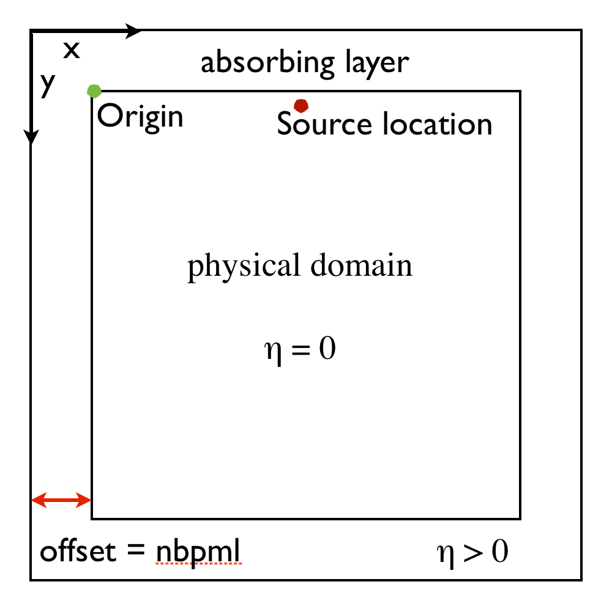

**MLOU: fix typos/bold/... throughout**

## Introduction

**MLOU:small review/intro of adjoint state?**

In this second part of our tutorial serie, we introduce the concept of adjoint modeling that is required for seismic inversion [ref]. We refer to the first part [ref] for forward modeling that will be reused here. We detail adjoint wave-equation and propagators that back-propagate the data residual, followed by gradient calculations via cross-correlations of the forward (see part 1) and back-propagated wavefields. This part is accompanied by a `Jupyter notebook`
- **`adjoint_modeling.ipynb`** ---, in which we demonstrate how to compute the data residual---i.e., the difference between the synthetic and observed data and how to back-propagate this residual to model the adjoint wavefield. Finally we explain how to build a model update for the FWI problem based on the correlation of the forward and adjoint wavefield.
 
For technically more sophisticated methods to minimize the FWI objective and ways to compute matrix-free actions of FWI's Jacobian and (Gauss-Newton) Hessian, we refer to Part 3 of this tutorial.


## Quick recap on modeling 

**MLOU: necessary or just ref part 1?**

The acoustic wave equation for the squared slowness ``m``, defined as ``m(x,y)=c^{-2}(x,y)`` with ``c(x,y)`` being the unknown spatially varying wavespeed, and ``q(x,y,t;x_s)`` a source located at ``(x_s,y_s)``, is given by:

```math {#WE}
 m \frac{d^2 u(t,x,y)}{dt^2} - \nabla^2 u(t,x,y) + \eta(x,y) \frac{d u(t,x,y)}{dt}=q(t,x,y;x_s, y_s).
```

```python
	# Define a Devito model with physical size, velocity vp 
	# and absorbing layer width in number of grid points (nbpml)
	model = Model(vp=vp, origin=origin, spacing=spacing, shape=shape, nbpml=nbpml)
```

**MLOU:Change figure to camembert model**

####Figure: {#model}
{}
: Representation of the computational domain and its extension, which contains the absorbing boundaries layer.


### Backward simulation

**MLOU:split step by step like forward**

The adjoint wave-equation for an adjoint source (data residual) ``\delta d(x,y,t;x_r, y_r)`` located at ``(x_r, y_r)`` is given by

```math {#WEa}
 m \frac{d^2 v(t,x,y)}{dt^2} - \nabla^2 v(r,x,y) - \eta(x,y) \frac{d v(r,x,y)}{dt}=\delta d(r,x,y;x_r, y_r)
```
with its discrete counterpart stencil

```math {#WEdisadj}
\mathbf{v}[\text{time}-1] = 2\mathbf{v}[\text{time}] - \mathbf{v}[\text{time}+1] + dt^2\mathbf{m}^{-2} \odot \Big(\Delta \mathbf{v}[\text{time}]+ \delta \mathbf{d}[\text{time}] \Big).
```

While deriving expressions for adjoint wave equations for more general wave equations may be challenging, the implementation of the adjoint wave equation is straightforward in the acoustic case (except for what happens at in the damping layer) where the system is self-adjoint. So, the only important detail to consider, aside from running the time backwards, is to adjust the non self-adjoint boundary condition, which corresponds to changing the sign of the damping to prevent the equation from becoming unstable. With Devito we define the adjoint wave equation and its propagator in a similar manner as during forward simulations except that we inject the data residual, ``\delta \mathbf{d}``. In `Python`, we have

```python
	# Discrete adjoint wavefield
	v = TimeFunction(name="v", grid=model.grid, time_order=2, space_order=2)
	
	# Receiver setup
	rec = Receiver(name='rec', npoint=101, ntime=nt, grid=model.grid, coordinates=rec_coords)
	rec_term = rec.inject(field=v.backward,  expr=rec * dt**2 / model.m, offset=model.nbpml)
	
	# Define adjoint wave equation
	pde = model.m * v.dt2 - v.laplace + model.damp * v.dt
	stencil_v = Eq(v.backward, solve(pde, v.backward)[0])
	
	# Create propagator
	op_adj = Operator([stencil_v] + src_term + rec_term,
						time_axis=Backward)
```

An animation of the adjoint wavefield is available at **`adjoint_modeling.ipynb`**.

### Objective and gradient

Full-waveform inversion aims to recover accurate estimates of the discrete wave slowness vector ``\mathbf{m}`` from a given set of measurements of the pressure wavefield ``\mathbf{u}`` recorded at predefined receiver locations. Following [@LionsJL1971,@Tarantola], inversion corresponds to minimizing the following FWI objective: 

```math {#FWI}
	\mathop{\hbox{minimize}}_{\mathbf{m}} f(\mathbf{m})=\frac{1}{2}\left\lVert \mathbf{d}^{\mathrm{syn}}(\mathbf{m};\mathbf{q}) - \mathbf{d}^{\mathrm{obs}}\right\rVert_2^2,\\
```

where ``\mathbf{d}^{\mathrm{syn}}(\mathbf{m};\mathbf{q})`` is the synthetic data generated with the described forward simulation. These forward simulations depend on the  slowness  vector ``\mathbf{m}`` and the discretized source function ``\mathbf{q}``, which we assume to be known. FWI aims to find an ``\mathbf{m}`` that minimizes the energy of the misfit between synthetic data and data observed in the field collected in the vector ``\mathbf{d}``. 

We minimize FWI objective by computing updates to the slowness that are given by the gradient of this objective with respect to ``\mathbf{m}``. Following work by @Virieux, this gradient is given by the zero-lag term of the cross-correlation between the second-time derivative of the forward wavefield, ``\mathbf{\ddot{u}}``, and the adjoint wavefield, ``\mathbf{v}``---i.e. we have 

```math {#FWIgrad}
 \nabla f(\mathbf{m};\mathbf{q})= - \sum_{{time} =1}^{n_t}\mathbf{\ddot{u}}[time]\odot \mathbf{v}[time],
```

where the sum runs over all ``n_t`` time samples.

### Computing the gradient

While the derivation of the above expression for the gradient goes beyond the scope of this tutorial, it is important to emphasize how the forward and adjoint wavefields are calculated with the forward and backward simulations introduced above. Mathematically, the forward simulation to compute the forward wavefield ``\mathbf{u}`` for each source involves solving the following linear system of equations:

```math {#linWE}
    \mathbf{A}(\mathbf{m}) \mathbf{u} = \mathbf{q}, 
```
where ``\mathbf{q}`` again represents the known discretized source. With the previous definition for the sources, solving this system corresponds in Devito to running `op_fwd.apply()`. Solutions for the corresponding adjoint wavefields ``\mathbf{v}`` are computed in a similar fashion by solving

```math {#adjWE}
    \mathbf{A}^\top (\mathbf{m})\mathbf{v} = \delta \mathbf{d}.
```

In this expression, we obtain backward propagators by transposing (denoted by the symbol ``^\top``) the linear system associated with the forward simulations. In Devito, the computation of the adjoint wavefield is carried out by `op_ad.apply()`.

When calculating the gradient, we need, as explained in Equation #FWIgrad, to simply sum the pointwise multiplication of the adjoint wavefield with the second-time derivative of the forward wavefield. In Devito, this is symbolically expressed by `grad_update = Eq(grad, grad - u.dt2 * v)`. The full script for calculating the gradient is given in the notebook **`adjoint_gradient.ipynb`**. The computation of the gradient itself is implemented by adding the gradient update to the adjoint propagator. In `Python`, we have

```python
	op_grad = Operator([stencil_v] + src_term + rec_term + grad_update,
						time_axis=Backward)
```

### Verification

Before we take a look at what the gradient for our test model looks like, let us first ensure that our implementation for the forward and adjoint wave equations are indeed a correct forward-adjoint pair. We need to do this because incorrect adjoints can lead to wrong gradients, which in turn may lead to slower convergence or even to convergence to a wrong solution. To ensure that the discretized wave equations and associated propagators are implemented correctly, we provided additional codes that implements the so-called **dot** and **gradient** tests. These codes can be found in the Devito test directory---i.e. in **`tests/test_adjointA.py`** and **`tests/test_gradient.py`**.

### Simple gradient
Having tested the forward/adjoint wave equations and their propagators, we can now calculate the gradient of the FWI objective function for a simple 2D test model. We choose the so-called Camembert model for this purpose, which consists of a constant medium with a circular high velocity inclusion in its centre. To demonstrate our code, we perform a transmission experiment, with 21 sources on one side of the model and receivers at the other side. The source signature is a ``10\text{Hz}`` Ricker wavelet and we have 101 receivers. We show the first gradient with a constant initial model in Figure #Gradient\.

**MLOU: add true and init models **

####Figure: {#Gradient}
{width=45%}
:Gradient for the camembert model transmission experiment. The 21 source are placed on the left-hand side of the model and 101 receivers are located on the right-hand side. See also **`adjoint_gradient.ipynb`**.

With the gradient calculations explained we are now set to carry out a basic FWI experiment that involves repeated calculation of the gradient and the objective (see cell 18 of **adjoint_gradient.ipynb**). We refer to the second part of this tutorial to explain how to implement a basic optimization algorithm to minimize the FWI objective function. 

## Conclusions

In this first part of the tutorial, we demonstrated how to set up adjoint wave equations, their associated propagators with at runtime code generation, and how to calculate a valid gradient of the FWI objective using the adjoint state method. In part three, we will demonstrate how to set up a complete matrix-free and scalable optimization framework for acoustic FWI.

## Installation

This tutorial is based on Devito version 3.1.0 too. It requires the installation of the full software with examples, not only the code generation API. To install Devito if not already done with the first part

	git clone -b v3.1.0 https://github.com/opesci/devito
	cd devito
	conda env create -f environment.yml
	source activate devito
	pip install -e .
 
### Usefull links

- [Devito documentation](http://www.opesci.org/)
- [Devito source code and examples](https://github.com/opesci/Devito)
- [Tutorial notebooks with latest Devito/master](https://github.com/opesci/Devito/examples/seismic/tutorials)


## Acknowledgments

This research was carried out as part of the SINBAD II project with the support of the member organizations of the SINBAD Consortium. This work was financially supported in part by EPSRC grant EP/L000407/1 and the Imperial College London Intel Parallel Computing Centre.

## References

[1] Cerjan, C., Kosloff, D., Kosloff, R., and Reshef, M., 1985, A nonreflecting boundary condition for discrete acoustic and elastic wave equations: GEOPHYSICS, 50, 705–708. doi:10.1190/1.1441945

[2] Lange, M., Kukreja, N., Louboutin, M., Luporini, F., Zacarias, F. V., Pandolfo, V., … Gorman, G., 2016, Devito: Towards a generic finite difference DSL using symbolic python: 6th workshop on python for high-performance and scientific computing. doi:10.1109/PyHPC.2016.9

[3] Meurer A, Smith CP, Paprocki M, Certík O, Kirpichev ˇ SB, Rocklin M, Kumar A, Ivanov S, Moore JK, Singh S, Rathnayake T, Vig S, Granger BE, Muller RP, Bonazzi F, Gupta H, Vats S, Johansson F, Pedregosa F, Curry MJ, Terrel AR, Roucka Š, Saboo A, Fernando I, Kulal S, Cim- ˇ rman R, Scopatz A. (2017) SymPy: symbolic computing in Python. PeerJ Computer Science 3:e103 https://doi.org/10. 7717/peerj-cs.103

[4] Pratt, R. G., 1999, Seismic waveform inversion in the frequency domain, part 1: Theory and verification in a physical scale model: GEOPHYSICS, 64, 888–901. doi:10.1190/1.1444597

[5] Tarantola, A., 1984, Inversion of seismic reflection data in the acoustic approximation: GEOPHYSICS, 49, 1259–1266. doi:10.1190/1.1441754

[6] Virieux, J., and Operto, S., 2009, An overview of full-waveform inversion in exploration geophysics: GEOPHYSICS, 74, WCC1–WCC26. doi:10.1190/1.3238367
