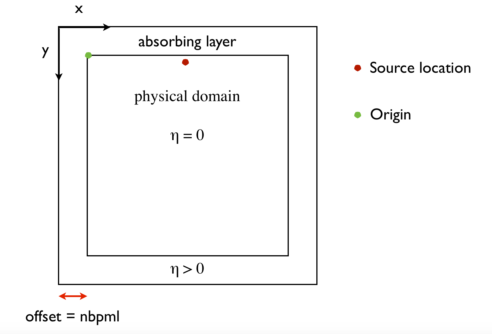
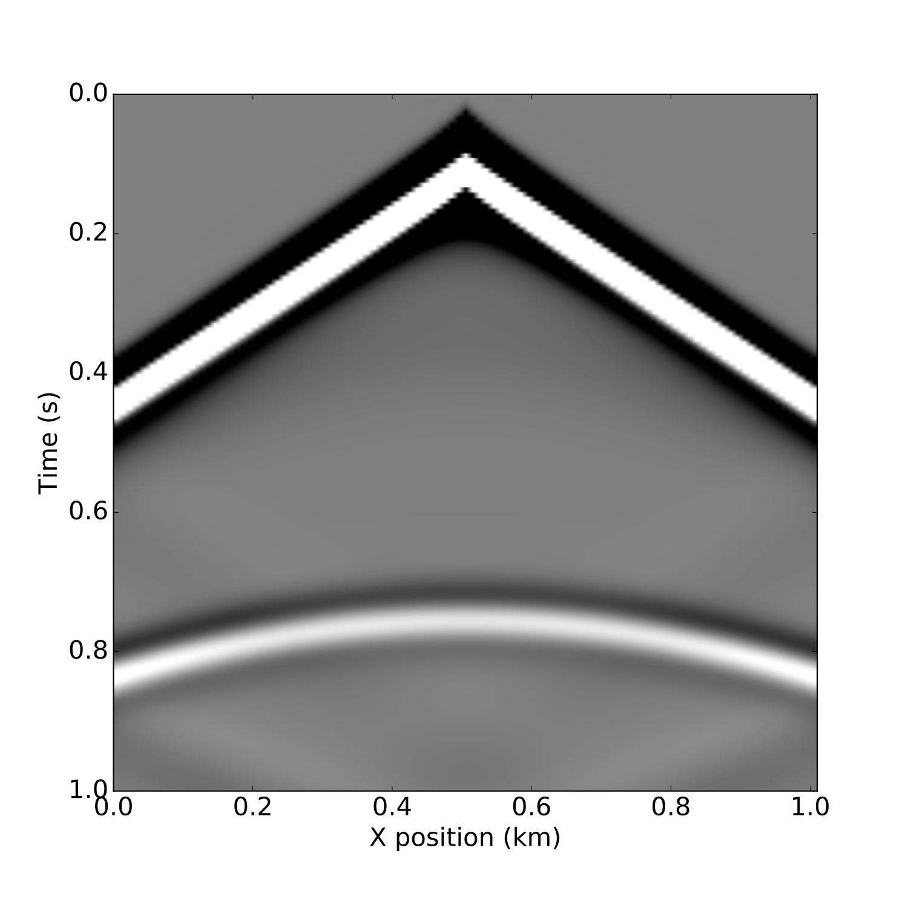

### Geophysics tutorial


# Full-Waveform Inversion - Part 1: forward modeling

Mathias Louboutin<sup>1</sup>\*, Philipp Witte<sup>1</sup>, Michael Lange<sup>2</sup>, Navjot Kukreja<sup>2</sup>, Fabio Luporini<sup>2</sup>, Gerard Gorman<sup>2</sup>, and Felix J. Herrmann<sup>1,3</sup>

<sup>1</sup> Seismic Laboratory for Imaging and Modeling (SLIM), The University of British Columbia 

<sup>2</sup> Imperial College London, London, UK

<sup>3</sup> now at Georgia Institute of Technology, USA 

Corresponding author: mloubout@eoas.ubc.ca

## Introduction

Since its re-introduction by Pratt (1999), Full-waveform inversion (FWI) has gained a lot of attention in geophysical exploration because of its ability to build high resolution velocity models more or less automatically in areas of complex geology. While there is an extensive and growing literature on this topic, publications focus mostly on technical aspects, making this topic inaccessible for a broader audience due to the lack of simple introductory resources for newcomers to geophysics. This is part one of three tutorials that together attempt to provide an introduction to the technique and software to help people get started. We hope to accomplish this by providing a hands-on walkthrough of FWI using Devito [2], a system based on domain-specific languages that automatically generates code for time-domain finite-differences. In this capacity, Devito provides a concise and straightforward computational framework for discretizing wave equations, which underlie all FWI frameworks. We will show that it generates verifiable executable code at run time for wave propagators associated with forward and adjoint (in part two) wave equations. Devito frees the user from the recurrent and time-consuming development of performant time-stepping codes and allows the user to concentrate on the geophysics of the problem rather than on low-level implementation details of wave-equation simulators. This tutorial covers the conventional adjoint-state formulation of full-waveform tomography [5] that underlies most of the current methods referred to as full-waveform inversion [6]. While other formulations have been developed to improve the convergence of FWI for poor starting models, in these tutorials we will concentrate on the standard formulation that relies on the combination of a forward/adjoint pair of propagators and a correlation-based gradient. In part one of this tutorial, we discuss how to set up wave simulations for inversion, including how to express the wave equation in Devito symbolically and how to deal with the acquisition geometry.


Full-waveform inversion tries to iteratively minimize the difference between data that was acquired in a seismic survey and synthetic data that is generated from a wave simulator with an estimated (velocity) model of the subsurface. As such, each FWI framework essentially consists of a wave simulator for forward modeling the predicted data and an adjoint simulator for calculating a model update from the data misfit. The first part of this tutorial is dedicated to the forward modeling part and demonstrates how to discretize and implement the acoustic wave equation using Devito. This tutorial is accompanied by a Jupyter notebook - **`forward_modeling.ipynb`** -, in which we describe how to simulate synthetic data for a specified source and receiver setup and how to save the corresponding wavefields and shot records. In part two of this series, we will address how to calculate model updates, i.e. gradients of the FWI objective function, via adjoint modeling. Finally, in part three we will demonstrate how to use this gradient as part of an optimization framework for inverting an unknown velocity model. 

Devito is required to execute the notebook and can be installed following the instructions at the end of the paper.

## Wave simulations for inversion

The acoustic wave equation with the squared slowness $m$, defined as $m(x,y)=c^{-2}(x,y)$ with $c(x,y)$ being the unknown spatially varying wavespeed, is given by:

$$
\begin{align}
 m \frac{d^2 u(x,y,t)}{dt^2} - \Delta u(x,y,t) + \eta(x,y) \frac{d u(x,y,t)}{dt}=q(x,y,t;x_s, y_s),
\end{align}
$${#WE}

where $q(x,y,t;x_s,y_s)$ is the seismic source, located at $(x_s,y_s)$ and $\eta(x,y)$ is a space-dependent dampening parameter for the absorbing boundary layer [1]. As shown in Figure #model, the physical model is extended in every direction by `nbpml` grid points to mimic an infinite domain. The dampening term $\eta \frac{d u(x,t)}{dt}$ attenuates the waves in the dampening layer [1] and prevents waves from reflecting at the model boundaries. In Devito, the discrete representations of $m$ and $\eta$ are contained in a `model` object that contains a `grid` object with all relevant information such as the origin of the coordinate system, grid spacing, size of the model and dimensions `x, y, time`---i.e., in `Python` we have

```python
	# Define a Devito object with the velocity model and grid information
	model = Model(vp=vp, origin=origin, shape=shape, spacing=spacing, nbpml=40)
```

In the `Model` instantiation, `vp` is the velocity in $\text{km}/\text{s}$, `origin` is the origin of the physical model in meters, `spacing` is the discrete grid spacing in meters, `shape` is the number of grid points in each dimension and `nbpml` is the number of grid points in the absorbing boundary layer. Is is important to note that `shape` is the size of the physical domain only, while the total number of grid points, including the absorbing boundary layer, will be automatically derived from `shape` and `nbpml`.


**Figure 1**: Representation of the computational domain and its extension, which contains the absorbing boundaries layer.


### Symbolic definition of the wave propagator

To model seismic data by solving the acoustic wave equation, the first necessary step is to discretize this PDE, which includes discrete representations of the velocity model and wavefields, as well as approximations of the spatial and temporal derivatives using finite-differences (FD). Unfortunately, implementing these finite-difference stencils in low-level code by hand is error prone, especially when performant and reliable code is desired. This is the mean reason why we employ the powerful symbolic representations of Devito in this tutorial.

The primary design objective of Devito is to allow users to define complex matrix-free finite-difference stencils and propagators from high-level symbolic definitions, while employing automated code generation to create highly optimized low-level C code. For this purpose Devito uses the symbolic algebra package SymPy [4] to facilitate the automatic creation of derivative expressions. These automatic symbolic manipulations allow for quick at run time generation of computationally efficient wave propagators with variable stencil orders (including long and complex high order stencils). We guarantee execution speed by using automated performance optimization with state-of-the-art compiler techniques that ensure computational efficiency both in speed and memory usage.

At the core of Devito's symbolic API are two symbolic types that behave like SymPy function objects, while also managing user data:

* `Function` objects represent a spatially varying function
  discretized on a regular Cartesian grid. For example, a function
  symbol `f = Function(name='f', grid=model.grid, space_order=2)`
  is denoted symbolically as `f(x, y)`. The objects provide auto-generated symbolic expressions for finite-difference derivatives through shorthand expressions like `f.dx` and `f.dx2` for the first and second derivative in `x`, where the `space_order` parameter
  defines the order of the created finite-difference stencil.

* `TimeFunction` objects represent a time-dependent function that has $\text{time}$ as the leading dimension, for example `g(time, x, y)`. In
  addition to spatial derivatives `TimeFunction` symbols also provide
  time derivatives `g.dt` and `g.dt2`, as well as options to store
  the entire data along the time axis.

To demonstrate Devito's symbolic capabilities, let us consider a time-dependent function $\mathbf{u}(\text{time}, x, y)$ representing the discrete forward wavefield. We can define this as a `TimeFunction` object in Devito:

```python
    u = TimeFunction(name="u", grid=model.grid, time_order=2,
                     space_order=2, save=True, time_dim=nt)
```

where the `grid` object provided by the `model` defines the size
of the allocated memory region, `time_order` and `space_order` define
the default discretization order of the derived derivative expressions.

We can now use this symbolic representation of our wavefield to
generate simple discretized stencil expressions for finite-difference
derivative approximations using shorthand expressions, such as `u.dx` and `u.dx2` to
denote $\frac{\partial u}{\partial x}$ and $\frac{\partial^2
u}{\partial x^2}$ respectively. We show the symbolic finite-difference for these two derivatives in the following code snippet for the previously defined Devito object `u`.


```python
  In []: u
  Out[]: u(time, x, y)

  In []: u.dx
  Out[]: -u(time, x, y)/h_x + u(time, x + h_x, y)/h_x

  In []: u.dx2
  Out[]: -2*u(time, x, y)/h_x**2 + u(time, x-h_x, y)/h_x**2 + u(time, x-h_x, y)/h_x**2
```

Using the automatic derivation of derivative expressions, we can now implement a discretized expression for Equation @WE without the source term $q(x,y,t;x_s, y_s)$. The `model` object, which we created earlier, already contains the squared slowness $\mathbf{m}$ and damping term $\mathbf{\eta}$ as `Function` objects:

```python
    # Set up discretized wave equation
    pde = model.m * u.dt2 - u.laplace + model.damp * u.dt
```

If we write out the (second order) second time derivative `u.dt2` as shown earlier and ignore the damping term for the moment, our `pde` expression translates to the following discrete the wave equation:

$$
 \frac{\mathbf{m}}{s^2} \Big( \mathbf{u}[\text{time}-s] - 2\mathbf{u}[\text{time}] + \mathbf{u}[\text{time}+s]\Big) - \Delta \mathbf{u}[\text{time}] = 0, \quad \text{time}=1 \cdots n_{t-1}
$${#WEdis}

with time being the current time step and $s$ being the time stepping interval. As we can see, the Laplacian $\Delta \mathbf{u}$ is simply expressed with Devito by the shorthand expression `u.laplace`, where the order of the derivative stencil is defined by the `space_order` parameter used to create the symbol `u(t, x, y)`.  However, for solving the wave equation, Equation @WEdis needs to be rearranged so that we obtain an expression for the wavefield $\mathbf{u}(\text{time}+s)$ at the next time step. Ignoring the damping term once again, this yields:

$$
 \mathbf{u}[\text{time}+s] = 2\mathbf{u}[\text{time}] - \mathbf{u}[\text{time}-s] + \frac{s^2}{\mathbf{m}} \Delta \mathbf{u}[\text{time}]
$${#WEstencil}

In Python, we can rearrange our `pde` expression automatically using the SymPy utility function `solve`. In Devito, we create a stencil expression, which defines the update of the wavefield for the new time step $\mathbf{u}(\text{time}+s)$, with the command `u.forward` :

```python
    # Rearrange PDE to obtain new wavefield at next time step
    stencil = Eq(u.forward, solve(pde, u.forward)[0])
```

This `stencil` expression now represents the finite-difference approximation derived from Equation @WEstencil. This expression includes the finite-difference approximation of the Laplacian and the damping term. The `stencil` expression defines the update for a single time step only, but since the wavefield `u` is a `TimeFunction` object, Devito knows that we will be solving a time-dependent problem over a number of time steps.


### Setting up the acquisition geometry

The expression for time stepping we derived in the previous section does not contain a seismic source function yet, so the update for the wavefield at a new time step is solely defined by the two previous wavefields. However as indicated in Equation @WE, wavefields for seismic experiments are often excited by an active (impulsive) source $q(x,y,t;x_s)$, which is a function of space and time (just like the wavefield `u`). To include such a source term in our modeling scheme, we simply add the the source wavefield as an additional term to our stencil expression (Equation @WEstencil):

$$
 \mathbf{u}[\text{time}+s] = 2\mathbf{u}[\text{time}] - \mathbf{u}[\text{time}-s] + \frac{s^2}{\mathbf{m}} \Big(\Delta \mathbf{u}[\text{time}] + \mathbf{q}[\text{time}]\Big).
$$ {#WEdisa}

Since the source appears on the right-hand side in the original equation (Equation @WE), the term also needs to be multiplied with $\frac{s^2}{\mathbf{m}}$ (this follows from rearranging expression @WEdis, with the source on the right-hand side). Unlike the discrete wavefield `u` however, the source `q` is typically localized in space and only a function of time, which means the time-dependent source wavelet is injected into the propagating wavefield at a specified source location. The same applies when we sample the wavefield at  receiver locations to simulate a shot record, i.e. the simulated wavefield needs to be sampled at specified receiver locations only. Source and receiver both do not necessarily coincide with the modeling grid.

Since sources and receivers are interspersed sparsely and often located off the computational grid, Devito provides a separate symbolic type specifically designed for sparse objects called `SparseFunction` and that handles interpolations onto the model grid. Just like we defined wavefields as `TimeFunction` objects and model and damping terms as `Function` objects, we can construct `SparseFunction` objects for sources and receiver and add them to our `stencil` expression.

Devito also provides a special function for setting up a Ricker wavelet called `RickerSource`, which acts as a wrapper around `SparseFunction` objects and automatically creates an instance of a `SparseFunction` object for a Ricker wavelet with a specified peak frequency `f0` and source coordinates `src_coords`:

```	
	# define source object with Ricker wavelet and inject
	src = RickerSource(name='src', grid=model.grid, f0=f0, time=time, 	   coordinates=src_coords)
	src_term = src.inject(field=u.forward, expr=src * dt**2 / model.m, offset=model.nbpml)
```

The `src.inject` function now injects the current time sample of the Ricker wavelet (weighted with $\frac{s^2}{\mathbf{m}}$ as shown in equation @WEdisa) into the updated wavefield `u.forward` at the specified coordinates. Again, the parameter `offset` represents the size of the absorbing layer as shown in Figure #model (i.e. the source position is shifted by `offset`).

To extract the wavefield at a predetermined set of receiver locations, there is a corresponding wrapper function for receivers as well, which creates a `SparseFunction` object for a given number `npoint` of receivers, number `nt` of time samples and specified receiver coordinates `rec_coords` (with `ndim=2`, since we have a two-dimensional example). 

```python
	# create receiver array from receiver coordinates
	rec = Receiver(name='rec', npoint=101, ntime=nt, grid=model.grid, coordinates=rec_coords)
	rec_term = rec.interpolate(u, offset=model.nbpml)
```

Rather than injecting a function into the model as we did for the source, we now simply save the wavefield at the grid points that correspond to receiver positions and interpolate the data to their exact possibly of the computatational grid location (`rec.interpolate` in Devito).

### Forward simulation 

Having defined source and receivers objects, we can now define our forward propagator by adding the source and receiver terms to our stencil object; that is, in `Python` we have:

```python
  # Create forward propagator
  op_fwd = Operator([stencil] + src_term + rec_term)
```

The symbolic expressions used to create `Operator` contain sufficient
meta-information for Devito to create a fully functional computational
kernel. The dimension symbols contained in the symbolic function
object (`t, x, y, z`) define the loop structure of the created code,
while allowing Devito to automatically optimize the underlying loop
structure to increase execution speed.

The size of the loops and spacing between grid points is inferred from
the symbolic `Function` objects and associated `model.grid` object at
run-time. As a result, we can invoke the generated kernel through a
simple Python function call by supplying the number of timesteps
`time` and the timestep size `dt`. The user data associated with each
`Function` is updated in-place during operator execution, allowing us
to extract the final wavefield and shotrecord directly from the
symbolic function objects without unwanted memory duplication---i.e. we execute in Python:

```python	
  # Generate wavefield snapshots and a shot record
  op_fwd(time=n_timesteps, dt=model.critical_dt)

  # Access the wavefield and shot record at the end of the propagation.
  wavefield = u.data
  shotrecord = rec.data
```

Although Devito `Operator` objects are fully self-contained Python,
the underlying C code can easily be accessed via `op_fw.ccode`, as
shown in Figure #Forward.


**Figure 2**: Devito C code generated for the forward modeling propagator. 

In Figure 3, we show the resulting shot record. A movie of snapshots of the forward wavefield can be generated by executing the last cell of **`forward_modeling.ipynb`**.

 
**Figure 3**: Shot record on a two layer and marmousimodel for a single source and split-spread receiver geometry from **`modeling.ipynb`**.

  
**Figure 4**: Snapshots of the wavefield in a two layer model for a source in the middle of the x axis **`modeling.ipynb`**.

## Conclusions

In this first part of the tutorial, we have demonstrated how to set up the discretized forward acoustic wave equations and its associated wave propagator with runtime code generation. While we limited our discussion to the constant density acoustic wave equation, Devito is capable of handling more general wave equations but this is a topic beyond this tutorial on simulating waves for inversion. In part two of our tutorial, we will show how to calculate a valid gradient of the FWI objective using the adjoint state method. In part three, we will demonstrate how to set up a complete matrix-free and scalable optimization framework for acoustic FWI.

### Installation

This tutorial and the coming second part are based on Devito version 3.0.3. It requires the installation of the full software with examples, not only the code generation API. To install devito

```
	git clone -b v3.1.0 https://github.com/opesci/devito
	cd devito
	conda env create -f environment.yml
	source activate devito
	pip install -e .
```
 
### Useful links

- [Devito documentation](http://www.opesci.org/)
- [Devito source code and examples](https://github.com/opesci/Devito)
- [Tutorial notebooks with latest Devito/master](https://github.com/opesci/Devito/examples/seismic/tutorials)


### Acknowledgments

This research was carried out as part of the SINBAD II project with the support of the member organizations of the SINBAD Consortium. This work was financially supported in part by EPSRC grant EP/L000407/1 and the Imperial College London Intel Parallel Computing Centre.

### References

[1] Cerjan, C., Kosloff, D., Kosloff, R., and Reshef, M., 1985, A nonreflecting boundary condition for discrete acoustic and elastic wave equations: GEOPHYSICS, 50, 705–708. doi:10.1190/1.1441945

[2] Lange, M., Kukreja, N., Louboutin, M., Luporini, F., Zacarias, F. V., Pandolfo, V., … Gorman, G., 2016, Devito: Towards a generic finite difference DSL using symbolic python: 6th workshop on python for high-performance and scientific computing. doi:10.1109/PyHPC.2016.9

[3] Meurer A, Smith CP, Paprocki M, Certík O, Kirpichev ˇ
SB, Rocklin M, Kumar A, Ivanov S, Moore JK, Singh S,
Rathnayake T, Vig S, Granger BE, Muller RP, Bonazzi F,
Gupta H, Vats S, Johansson F, Pedregosa F, Curry MJ,
Terrel AR, Roucka Š, Saboo A, Fernando I, Kulal S, Cim- ˇ
rman R, Scopatz A. (2017) SymPy: symbolic computing in
Python. PeerJ Computer Science 3:e103 https://doi.org/10.
7717/peerj-cs.103

[4] Pratt, R. G., 1999, Seismic waveform inversion in the frequency domain, part 1: Theory and verification in a physical scale model: GEOPHYSICS, 64, 888–901. doi:10.1190/1.1444597

[5] Tarantola, A., 1984, Inversion of seismic reflection data in the acoustic approximation: GEOPHYSICS, 49, 1259–1266. doi:10.1190/1.1441754

[6] Virieux, J., and Operto, S., 2009, An overview of full-waveform inversion in exploration geophysics: GEOPHYSICS, 74, WCC1–WCC26. doi:10.1190/1.3238367